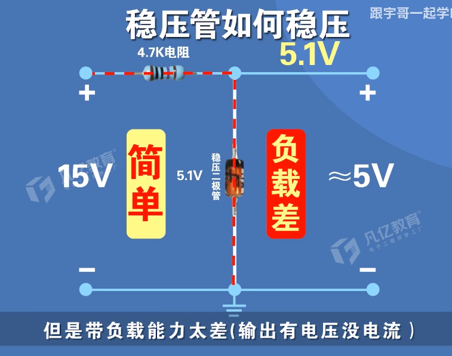
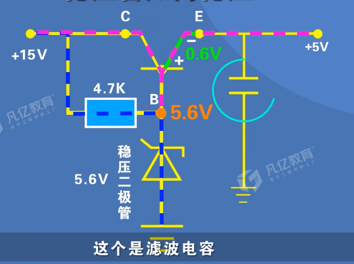
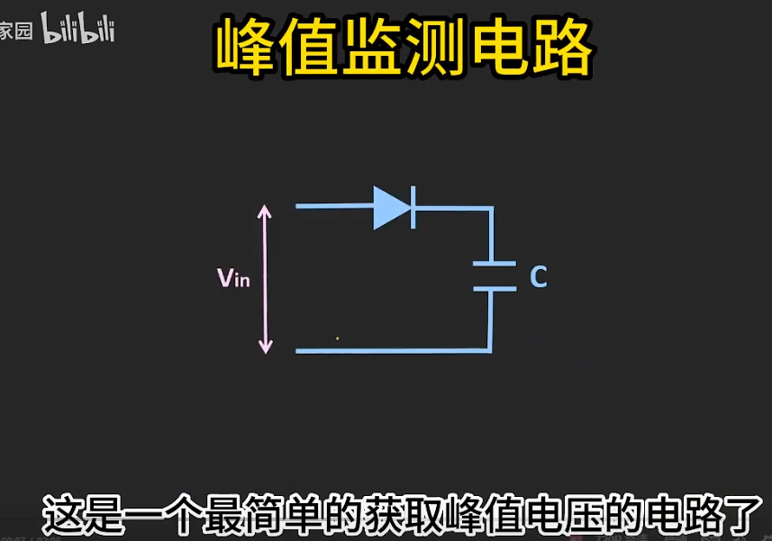
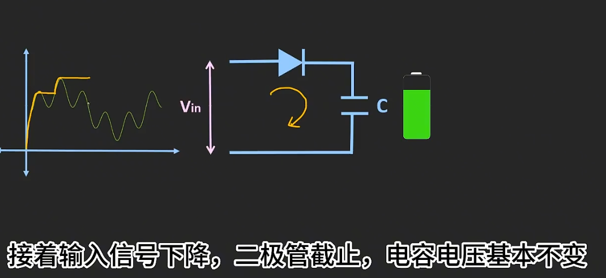
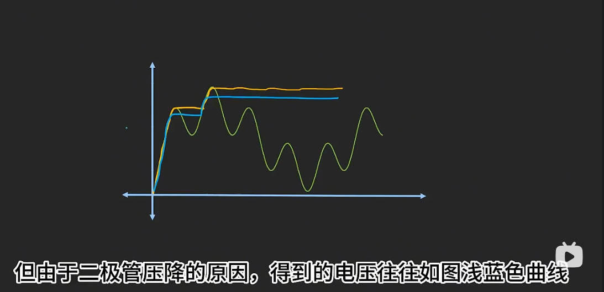
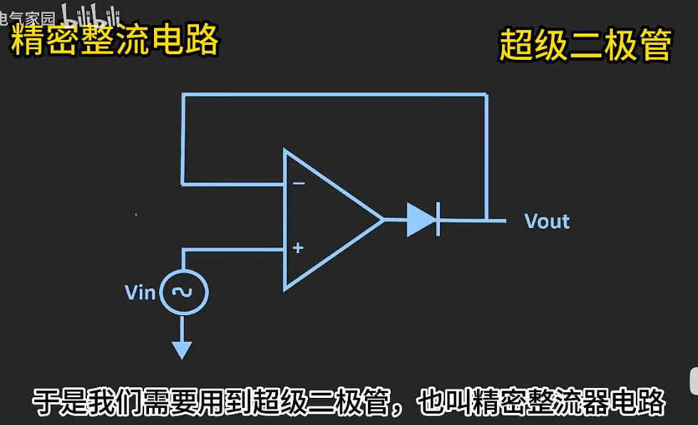
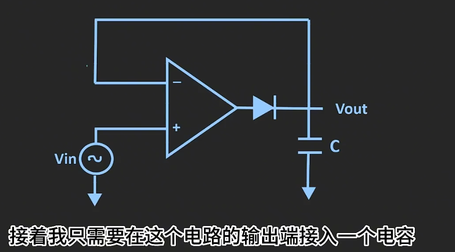
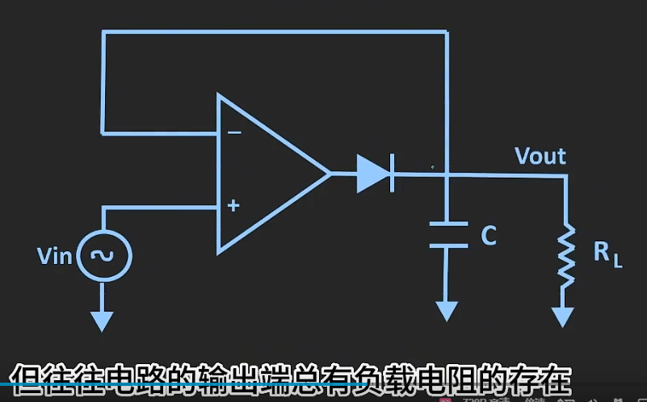

## 5.稳压二极管

用稳压二极管输出一个稳定电压:

但是这个输出电压带负载能力差. 因为输出电流太小了. 
接上R_L后很可能导致稳压二极管无法被反向击穿, 稳压二极管等于断路不存在了...

改进思路: 让输出电流能力加大: 使用三极管.

取一个5.6v稳压二极管, 反向击穿后VB=5.6V. 于是BE导通, 管压降VBE约为0.6V. 于是VE=5V, 是稳定的输出电压! 此时基极电流很小, 而三极管放大电流, IE很大.

## 6.峰值检测电路 

原理很简单, 电容只能充电不放电, 两端电压就是信号峰值了.

改进: 为了防止二极管导通压降, 可以使用超级二极管(精密整流电路)

但是总是有负载, 所以电容其实会放电.

解决: 在电路后面加上一个电压跟随器.

电压跟随器具有很大的阻抗.

