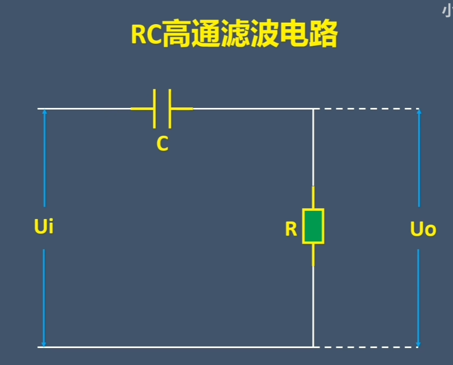

# 1. 器件

## 1.1 稳压二极管

用稳压二极管输出一个稳定电压:

但是这个输出电压带负载能力差. 因为输出电流太小了. 
接上R_L后很可能导致稳压二极管无法被反向击穿, 稳压二极管等于断路不存在了...

改进思路: 让输出电流能力加大: 使用三极管.

取一个5.6v稳压二极管, 反向击穿后VB=5.6V. 于是BE导通, 管压降VBE约为0.6V. 于是VE=5V, 是稳定的输出电压! 此时基极电流很小, 而三极管放大电流, IE很大.

# 2. 电路

## 2.1 峰值检测电路 

原理很简单, 电容只能充电不放电, 两端电压就是信号峰值了.

改进: 为了防止二极管导通压降, 可以使用超级二极管(精密整流电路)

但是总是有负载, 所以电容其实会放电.

解决: 在电路后面加上一个电压跟随器.

电压跟随器具有很大的阻抗.

## 2.2 微分电路(differentiator) &  积分电路

注意:
RC结构的时间常数$τ=RC$要远小于高低电平时间才叫微分电路，否则就是高通滤波电路！

同样的, 积分电路也可以退化为低通滤波电路.

## 2.3 高通/低通滤波电路

### 1.一阶低通滤波器

数学分析:
**先计算转移函数:**

$$
H(j\omega) ≡ \frac{U_o}{U_i} = \frac{X_c}{R + X_c} = \frac{\frac{1}{j\omega C}}{R + \frac{1}{j\omega C}} = \frac{1}{1 + j\omega RC} = \frac{1 - j\omega RC}{1 + (\omega RC)^2}
$$

**计算转移函数的模：**

$$
|H(j\omega)| = \sqrt{\left( \frac{1}{1 + (\omega RC)^2} \right)^2 + \left( \frac{\omega RC}{1 + (\omega RC)^2} \right)^2} = \sqrt{ \frac{1}{1 + (\omega RC)^2} }
$$

**转移的模代表了电压增益。**

当电压增益下降到 $\frac{\sqrt{2}}{2}$ 时，对应频率为定义为截止频率$f_c$ ,

令:

$$
|H(j\omega)| = \sqrt{ \frac{1}{1 + (\omega RC)^2} } = \frac{\sqrt{2}}{2}
$$

化简可得：

$$
\omega RC = 1 = 2\pi f_c RC
$$

求得截止频率：

$$
f_c = \frac{1}{2\pi RC}
$$

小于$f_c$时, 
低频信号可以通过(电压保留比例多于$1/\sqrt{2}=71\%$ , 功率保留多于$50\%$). 
大于$f_c$时, 认为高频信号无法通过.

设计电路时, 一般先选择电容(nf级别), 然后推导想要的电阻R值.

### 2.一阶高通滤波器

传递函数推导:

   根据分压原理，
    $$
     H(j\omega)
     = \frac{U_o}{U_i}
     = \frac{R}{R + X_C}
     = \frac{R}{R + \frac{1}{j\omega C}}
     = \frac{R}{\frac{j\omega RC + 1}{j\omega C}}
     = \frac{j\omega RC}{1 + j\omega RC}
    $$

1. **幅度响应**  
   计算模值：
    $$
     |H(j\omega)|
     = \left| \frac{j\omega RC}{1 + j\omega RC} \right|
     = \frac{\omega RC}{\sqrt{1 + (\omega RC)^2}}
    $$

2. **截止频率**  
   和低通相同. 截止频率定义为幅度降到最大值的 $\frac{1}{\sqrt{2}}$ 处.
   令:
    $$
     |H(j\omega_c)| = \frac{\omega_c RC}{\sqrt{1 + (\omega_c RC)^2}}
     = \frac{1}{\sqrt{2}}
    $$
   解得
    $$
     \omega_c RC = 1
     \quad\Longrightarrow\quad
     \omega_c = \frac{1}{RC}
     \quad\Longrightarrow\quad
     f_c = \frac{\omega_c}{2\pi} = \frac{1}{2\pi RC}
    $$

结果形式正好和低通滤波器相同.

大于于$f_c$时, 
高频信号可以通过(电压保留比例多于$1/\sqrt{2}=71\%$ , 功率保留多于$50\%$). 

小于$f_c$时, 认为低频信号无法通过.

### 3. 二阶RC低通滤波器

分析方法是一样的.
(略)
#

##

