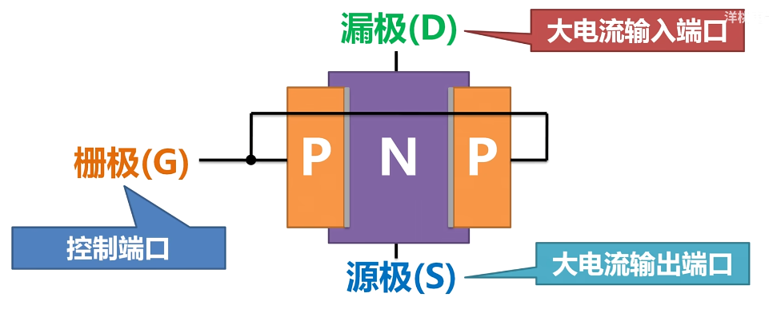
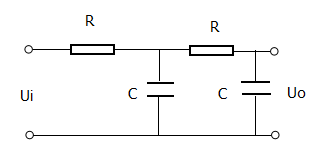

# 0. 定理

## 叠加定理

其实就是简单的能量守恒啦.

**线性电路**(R,C,L,线性源)中,
如果包含多个**独立源**, 

电路的任意位置的电压/电流响应, 等于各个独立源单独作用(其他独立源不做功, 电压源短路电流源开路)产生的响应的简单代数和.

# 1. 器件

## 1.1 稳压二极管

用稳压二极管输出一个稳定电压:

但是这个输出电压带负载能力差. 因为输出电流太小了. 
接上R_L后很可能导致稳压二极管无法被反向击穿, 稳压二极管等于断路不存在了...

改进思路: 让输出电流能力加大: 使用三极管.

取一个5.6v稳压二极管, 反向击穿后VB=5.6V. 于是BE导通, 管压降VBE约为0.6V. 于是VE=5V, 是稳定的输出电压! 此时基极电流很小, 而三极管放大电流, IE很大.

## 1.2 运放

* 运放选型
通用廉价运算放大器。这些廉价的运放除OP07用于直流外，其它的一般不用于直流电路。 
　　1。OP07，这是在各类文章中用得最多的运放，国产型号F07，低漂移，低噪声，增益带宽积不到1MHZ，其中以MAXIM的OP07AJ的品质最好。特别适用于直流放大，对带宽要求不高的场合，价格便宜。工业级的OP07性能超好，但是很贵（100块以上）。 
　　2。LM324，廉价的四路运放(即集成了四个独立的运算放大器)，增益带宽积1MHZ，开环直流增益100DB，适合低电压场合，音频场合也用，最主要优势是便宜。工业级的用LM124代替，LM124在广普屯的报价是14块一只，性能不错的，很难烧坏。
 
　　3。TL084,廉价4运放。 
　　4。LM741，增益带宽积1MHZ，适合小信号交流放大，输出能力较小 
　　5。LM1458，廉价的双路运放，实际是两个LM741封装在一起，和LM741一样基本上要被淘汰了，双运放的场合用TL084代替就行了。 
　　
　　宽带运算放大器。适合于交流放大，这类运放的直流漂移一般较大。 
　　1。NE5532，增益带宽积10MHZ，输出电流50mA，输出阻抗低，适合于要求较高的交流放大场合，总线驱动，信号驱动等。双运放。 
　　2。NE5534,增益带宽积10MHZ，比NE5532摆率高，开环放大倍数大些。单运放，带调整。 
　　3。OP27，OP37，高速宽带运算放大器，增益带宽积40MHZ，摆率高，适合于10MHz以下的交流小信号放大。 
　　
　　常用廉价仪表放大器。这两种都是很便宜的，性能也不错。 
　　1。AD620。20多元一只 
　　2。INA128，稍贵，都是工业级。 
　　
　　极品运放。 
　　1。OPA2227，双路运放，增益带宽积10MHZ，极低噪声和极低漂移，开环增益140DB以上，输出能力50mA，全部为工业级，具有极好的直流和交流特性，自带保护，基本上不会烧坏，为我至今见过的最好的运放，可以使用于1MHz以下的各种场合，广普屯没有卖的，建议订货，24块钱一只。 
　　2。OPA4227，性能和OPA2227相同，四路运放。

### 差分放大电路

## 1.3 NMOS

| 型号         | 特点                              | 常见应用         |
| ---------- | ------------------------------- | ------------ |
| **2N7000** | 门槛电压约 2V，漏极电流可达 300 mA；通用的小功率开关 | 数字电路、低频开关    |
| **BS170**  | 门槛电压约 0.8–3V，漏极电流可达 500 mA；封装更小 | 便携设备、单片机接口驱动 |

## 1.4 双极型晶体管 BJT

我们知道, BJT是利用PN结原理, 实现小电流控制大电流的器件.

--------

当P->N2导通, 流过小电流时, N1->N2可以流过大电流.
此时$V_{N_1 N_2}$的电压决定了BJT工作在:
  - 正常大小: 放大区
  - 足够大: 饱和区

--------

当P->N2不导通, N1和P之间出现PN结绝缘区域, 无法通过大电流.

--------

缺点: 
- 通过电流有限, 而且导致发热损耗. 要想通过更大电流, 只能增加PN结横截面积, 器件不够小
- 不能电压控制.

------

## 1.5 结型场效应管 JFET

JFET是为了克服BJT的缺点而制成的.
 

其原理很简单: 利用电压控制PN结的绝缘区宽度, 实现一个闸门.

左右的电压和上方端子的电压差决定这个绝缘区域大小, 电压差越大PN结反偏越厉害, 直到两个绝缘区域接触, 完全堵住从上到下的电流.

两个PN结一直工作在反偏截至状态, 不需要电流控制, 只需要控制电压差. 所以JFET是电压控制器件!

为啥叫结型场效应管? J(junction),即结型,因为是PN结原理; 场效应管(FET), 即通过非接触式的电场(即电压!)来控制.

引脚命名:

原理图中画成这样:

显然, 箭头方向意味着PN结方向(原理图只画了左边的PN结, 右边镜像对称的结构省略了.)

中间较粗的这个竖棍的意思是`半导体结构`.

P-JFET也就同样很好理解了.

---------
缺点:
加紧方式有天然缺陷...压力太大的时候会"夹不紧".

## MOSFET

我们知道JFET的**初始状态**(没有施加G和D的电压差来让PN结加紧)下, D->S是导通的.

如果想要解决JFET 夹不紧有漏电流的缺点, 我们希望这个器件的**初始状态**是断开状态. 也就是施加了电压才闭合开关.

思考: 想要一个器件, 让它在**施加电压的时候形成导体**.
是**电容**.

我们来做一个电容:

# 2. 电路

## 2.0 二端口(port)网络

即引出四个端子的黑箱, 要求其中两两流过相同的电流, 各称为一对端子/一个端口, 即输入端口in和输出端口out.

当黑箱内只有R,C,L,线性受控源时, 一个二端口网络一定可以对外简化成一个T型阻抗网络, 或者一个PI型阻抗网络.

端口参数:(I1, V1是输入端口电压电流, I2, V2是输出端口电压电流)

| 测量目标           | 停用／激励方式                   | 端口条件       | 名称   |
| -------------- | ------------------------- | ------------- | ---- |
| **Z₁₁ (输入阻抗)** | 在输出端口不通电(关掉激励)，测输入端口的电压/电流比 | **输出开路** (I₂＝0) | 开路阻抗 |
| **Y₁₁ (输入导纳)** | 在输出端口短路，测输入端口的电流/电压比        | **输出短路** (V₂＝0) | 短路导纳 |
| **Z₂₂ (输出阻抗)** | 在输入端口不通电，测输出端口的电压/电流比       | **输入开路** (I₁＝0) | 开路阻抗 |
| **Y₂₂ (输出导纳)** | 在输入端口短路，测输出端口的电流/电压比        | **输入短路** (V₁＝0) | 短路导纳 |

一个网络的输入阻抗越大越好(这意味着不影响后面的网络.)

输出阻抗越小越好(带负载能力强!)

例如:
一个运放可以看成二端口网络.(不考虑供电的两端)
in port: v-, v+
out port: vout, GND

其输入阻抗极大, 所以可以认为in port几乎没有电流(虚断).

其输出阻抗极小, 以至于可以看成一个理想电压源.

## 2.1 峰值检测电路 

原理很简单, 电容只能充电不放电, 两端电压就是信号峰值了.

改进: 为了防止二极管导通压降, 可以使用超级二极管(精密整流电路)

但是总是有负载, 所以电容其实会放电.

解决: 在电路后面加上一个电压跟随器.

电压跟随器具有很大的阻抗.

## 2.2 微分电路(differentiator) &  积分电路

注意:
RC结构的时间常数$τ=RC$要远小于高低电平时间才叫微分电路，否则就是高通滤波电路！

同样的, 积分电路也可以退化为低通滤波电路.

## 2.3 高通/低通滤波电路

### 1.一阶低通滤波器

数学分析:
**先计算转移函数:**

$$
H(j\omega) ≡ \frac{U_o}{U_i} = \frac{X_c}{R + X_c} = \frac{\frac{1}{j\omega C}}{R + \frac{1}{j\omega C}} = \frac{1}{1 + j\omega RC} = \frac{1 - j\omega RC}{1 + (\omega RC)^2}
$$

**计算转移函数的模：**

$$
|H(j\omega)| = \sqrt{\left( \frac{1}{1 + (\omega RC)^2} \right)^2 + \left( \frac{\omega RC}{1 + (\omega RC)^2} \right)^2} = \sqrt{ \frac{1}{1 + (\omega RC)^2} }
$$

**转移的模代表了电压增益。**

当电压增益下降到 $\frac{\sqrt{2}}{2}$ 时，对应频率为定义为截止频率$f_c$ ,

令:

$$
|H(j\omega)| = \sqrt{ \frac{1}{1 + (\omega RC)^2} } = \frac{\sqrt{2}}{2}
$$

化简可得：

$$
\omega RC = 1 = 2\pi f_c RC
$$

求得截止频率：

$$
f_c = \frac{1}{2\pi RC}
$$

小于$f_c$时, 
低频信号可以通过(电压保留比例多于$1/\sqrt{2}=71\%$ , 功率保留多于$50\%$). 
大于$f_c$时, 认为高频信号无法通过.

设计电路时, 一般先选择电容(nf级别), 然后推导想要的电阻R值.

### 2.一阶高通滤波器

传递函数推导:

   根据分压原理，
    $$
     H(j\omega)
     = \frac{U_o}{U_i}
     = \frac{R}{R + X_C}
     = \frac{R}{R + \frac{1}{j\omega C}}
     = \frac{R}{\frac{j\omega RC + 1}{j\omega C}}
     = \frac{j\omega RC}{1 + j\omega RC}
    $$

1. **幅度响应**  
   计算模值：
    $$
     |H(j\omega)|
     = \left| \frac{j\omega RC}{1 + j\omega RC} \right|
     = \frac{\omega RC}{\sqrt{1 + (\omega RC)^2}}
    $$

2. **截止频率**  
   和低通相同. 截止频率定义为幅度降到最大值的 $\frac{1}{\sqrt{2}}$ 处.
   令:
    $$
     |H(j\omega_c)| = \frac{\omega_c RC}{\sqrt{1 + (\omega_c RC)^2}}
     = \frac{1}{\sqrt{2}}
    $$
   解得
    $$
     \omega_c RC = 1
     \quad\Longrightarrow\quad
     \omega_c = \frac{1}{RC}
     \quad\Longrightarrow\quad
     f_c = \frac{\omega_c}{2\pi} = \frac{1}{2\pi RC}
    $$

结果形式正好和低通滤波器相同.

大于于$f_c$时, 
高频信号可以通过(电压保留比例多于$1/\sqrt{2}=71\%$ , 功率保留多于$50\%$). 

小于$f_c$时, 认为低频信号无法通过.

### 3. 二阶RC低通滤波器

分析方法是一样的.
(略)
#

##

