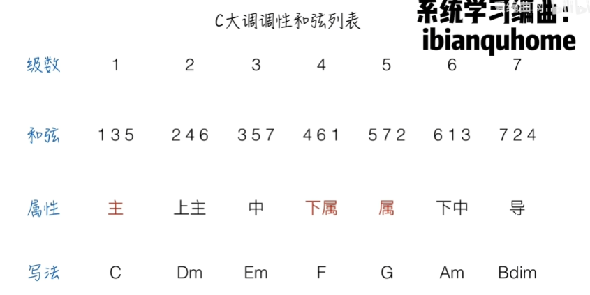
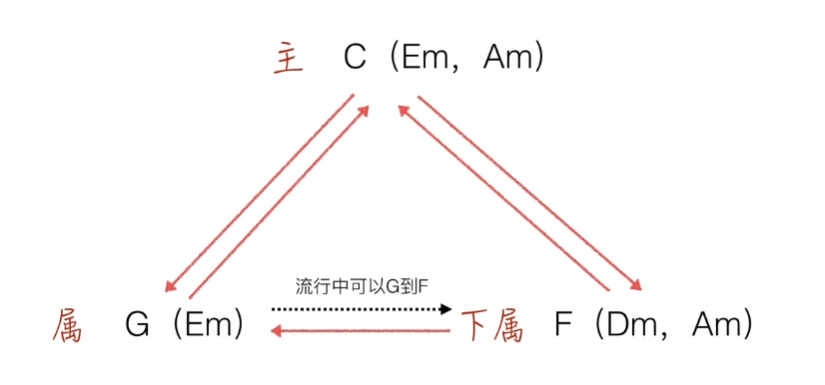

其中，

#### 主和弦: C, Em, Am
  * **1级-主和弦C**: 通常是音乐的“家”，音乐最终会回到这个和弦，感觉非常稳定。
  * **3级-中和弦Em**: 有两个音和主和弦C一样, 有主和弦性质. 带有情感上的弱化。
  * **6级-下中和弦Am**: 有两个音和主和弦C一样, 有主和弦性质. 带有情感上的弱化。

#### 下属和弦: G, Em
  * **4级-下属和弦F**: 常用于为 V 和弦创造过渡。
  * **3级-中和弦Em**: 有两个音和下属和弦F一样, 也有下属和弦性质. 带有情感上的弱化。

#### 属和弦: F, Dm, Am
  * **5级-属和弦G**: 产生强烈的张力，通常会推动回到主和弦C，是音乐中的“推动力量”。
  * **2级-上主和弦D**，通常在 V 和弦前作为一种过渡。

* **7级-导和弦Bdim**: 是`减三和弦` , 不常用.
##
####
##

* 一般不允许`属和弦`连接`下属和弦`, 一般这听起来很不好, 比如sol接fa.
* 为了连接顺畅, 一般为: 某个类的和弦-有这个类相同性质的和弦-另一个类的和弦. 如:C-Em-F. 

##
## 调式
若干高低不同的乐音，
围绕某-有稳定感的中心音，
按一定的音程关系组织在一起，成为一-个有机的体系，
称为调式

### 自然大调式(自然大调)(大调)
7个音由`全全半全全全半`组合. 即常见的C大调, D大调...
描述方法就是把这7个音都写出来, 称为`音阶`.
* C大调: CDEFGAB
* D大调: #C #F
* E大调: #F #G #C #D
* F大调: bB 
* G大调: #F
* A大调: #C #F #G
* B大调: #C #D #F #G #A

### 自然小调式(小调)

#