# 0. 定理

## 0.1 叠加定理

其实就是简单的能量守恒啦.

**线性电路**(R,C,L,线性源)中,
如果包含多个**独立源**, 

电路的任意位置的电压/电流响应, 等于各个独立源单独作用(其他独立源不做功, 电压源短路电流源开路)产生的响应的简单代数和.

# 0 PEH电路分析基础

## 0.2 最大功率传输定理

当一个电源系统的**负载阻抗 $Z_L$ 等于内部阻抗 $Z_r$ 的共轭复数**时, 负载获得的功率最大.

* **戴维宁(Thévenin)电源**:
  $$P_{max} = \frac{V_{th}^2}{4R_{th}}$$
  当且仅当 $Z_L = Z_{th}^*$

* **诺顿(Norton)电源**:
  $$P_{max} = I_{N}^2 R_{N}/4$$
  当且仅当 $Y_L = Y_{N}^*$

**决定$P_{max}$大小的是电源的有功内阻, 而不是无功内抗.**

**但是想要实现负载匹配, 无功内抗也需要调节到相应的 共轭复数值.**

## 0.3 PEH的 最大功率传输 问题

PEH就是一个norton电源, 其内部阻抗是R_p和C_p.

最简单的匹配阻抗就是让负载$Y_L = Y_{N}^*$.

源导纳:
$$Y_P = 1/R_P + i ω C_P$$

匹配导纳:
$$Y_L = Y_P^* = 1/R_P - i ω C_P$$

所以只需要负载为以下部件并联:
* $R_L = R_P$
* $L_L$ 满足: 其导纳$Y_{L_L} = 1/X_{L_L}  = 1/(i ω L_L) = - i ω C_P$
  
  解得$L_L = 1/(ω^2 C_P)$

但是这样做很难:
* 要求的$L_L$太大了. 无法集成.
* 要求的$L_L$和振动频率ω有关, 频率一变就不匹配了.

**这就是一切电源管理电路试图解决的问题.**

## 0.4 PEH的开路电压 V_{P-OC} 

开路(O-C)时,

节点P的KCL方程:
$$I_P = I_R + I_C = \frac{V_P}{R_P} + iωC_PV_P$$

于是**开路电压$V_{P-OC}$**:

$$
V_{P-OC} = I_P |Z_{par}| = I_P \frac{R_P}{\sqrt{1 + (\omega R_P C_P)^2}}
$$

**基于一个常见工程条件的近似**：

在大多数 PEH 的工作点下 $1/(ωC_P) << R_P$，

所以

$$
ω R_P ​C_P >> 1
$$

从而

$$
V_{P-OC} 
= I_P \frac{R_P}{\sqrt{1 + (\omega R_P C_P)^2}} 
≈ I_P \frac{1}{ωC_P}
$$

***
***
***

$V_{P-OC}$ 是开路电压, 即没有外部提取(不抽走能量)的时候, **PEH能建立的最大电压幅值**. 

**它是不受外部电路影响的PEH固有量. (给定频率振幅下)**

**如果连上被动负载, 输出电压一定会小于开路电压.**

这是显然的: 任何不是∞的负载阻抗, 都会把IP看到的 **负载端等效阻抗模** 拉低, 因此把`V_P`拉低.

**要抵消需要 串联，但压电的 `C_P` 是并联的，无法改变它的位置。**

# 1. 器件

## 1.1 稳压二极管

用稳压二极管输出一个稳定电压:

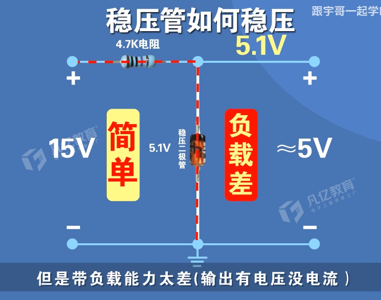

但是这个输出电压带负载能力差. 因为输出电流太小了. 
接上R_L后很可能导致稳压二极管无法被反向击穿, 稳压二极管等于断路不存在了...

改进思路: 让输出电流能力加大: 使用三极管.

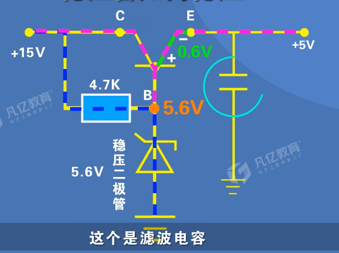

取一个5.6v稳压二极管, 反向击穿后VB=5.6V. 于是BE导通, 管压降VBE约为0.6V. 于是VE=5V, 是稳定的输出电压! 此时基极电流很小, 而三极管放大电流, IE很大.

1N4007塑料二极管

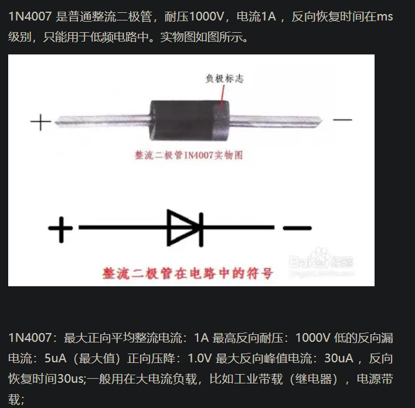

## 1.2 运放

* 运放选型
通用廉价运算放大器。这些廉价的运放除OP07用于直流外，其它的一般不用于直流电路。 
　　1。OP07，这是在各类文章中用得最多的运放，国产型号F07，低漂移，低噪声，增益带宽积不到1MHZ，其中以MAXIM的OP07AJ的品质最好。特别适用于直流放大，对带宽要求不高的场合，价格便宜。工业级的OP07性能超好，但是很贵（100块以上）。 
　　2。LM324，廉价的四路运放(即集成了四个独立的运算放大器)，增益带宽积1MHZ，开环直流增益100DB，适合低电压场合，音频场合也用，最主要优势是便宜。工业级的用LM124代替，LM124在广普屯的报价是14块一只，性能不错的，很难烧坏。
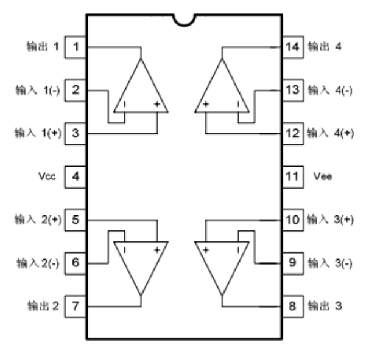 
　　3。TL084,廉价4运放。 
　　4。LM741，增益带宽积1MHZ，适合小信号交流放大，输出能力较小 
　　5。LM1458，廉价的双路运放，实际是两个LM741封装在一起，和LM741一样基本上要被淘汰了，双运放的场合用TL084代替就行了。 
　　
　　宽带运算放大器。适合于交流放大，这类运放的直流漂移一般较大。 
　　1。NE5532，增益带宽积10MHZ，输出电流50mA，输出阻抗低，适合于要求较高的交流放大场合，总线驱动，信号驱动等。双运放。 
　　2。NE5534,增益带宽积10MHZ，比NE5532摆率高，开环放大倍数大些。单运放，带调整。 
　　3。OP27，OP37，高速宽带运算放大器，增益带宽积40MHZ，摆率高，适合于10MHz以下的交流小信号放大。 
　　
　　常用廉价仪表放大器。这两种都是很便宜的，性能也不错。 
　　1。AD620。20多元一只 
　　2。INA128，稍贵，都是工业级。 
　　
　　极品运放。 
　　1。OPA2227，双路运放，增益带宽积10MHZ，极低噪声和极低漂移，开环增益140DB以上，输出能力50mA，全部为工业级，具有极好的直流和交流特性，自带保护，基本上不会烧坏，为我至今见过的最好的运放，可以使用于1MHz以下的各种场合，广普屯没有卖的，建议订货，24块钱一只。 
　　2。OPA4227，性能和OPA2227相同，四路运放。

### 差分放大电路

## 1.3 NMOS

| 型号         | 特点                              | 常见应用         |
| ---------- | ------------------------------- | ------------ |
| **2N7000** | 门槛电压约 2V，漏极电流可达 300 mA；通用的小功率开关 | 数字电路、低频开关    |
| **BS170**  | 门槛电压约 0.8–3V，漏极电流可达 500 mA；封装更小 | 便携设备、单片机接口驱动 |

## 1.4 双极型晶体管 BJT

我们知道, BJT是利用PN结原理, 实现小电流控制大电流的器件.

--------

当P->N2导通, 流过小电流时, N1->N2可以流过大电流.
此时$V_{N_1 N_2}$的电压决定了BJT工作在:
  - 正常大小: 放大区
  - 足够大: 饱和区

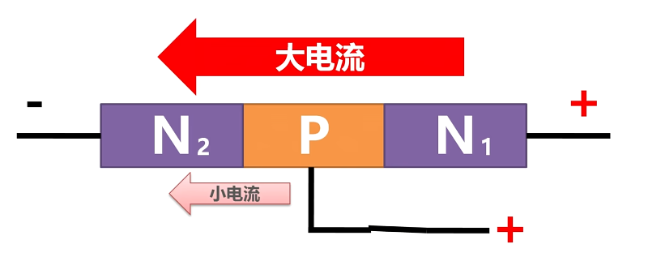
--------

当P->N2不导通, N1和P之间出现PN结绝缘区域, 无法通过大电流.
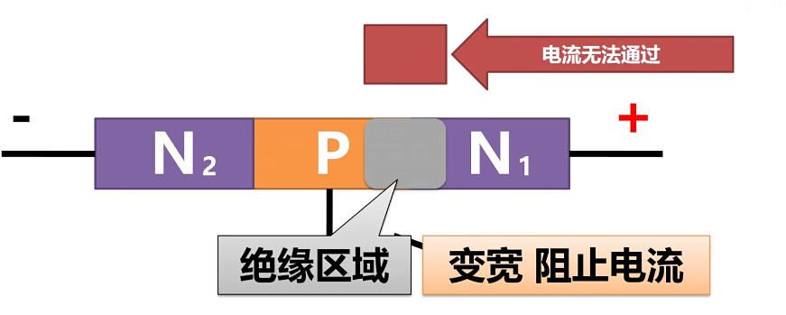
--------

缺点: 
- 通过电流有限, 而且导致发热损耗. 要想通过更大电流, 只能增加PN结横截面积, 器件不够小
- 不能电压控制.

------

## 1.5 结型场效应管 JFET

JFET是为了克服BJT的缺点而制成的.
 

其原理很简单: 利用电压控制PN结的绝缘区宽度, 实现一个闸门.

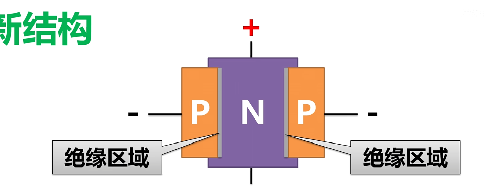

左右的电压和上方端子的电压差决定这个绝缘区域大小, 电压差越大PN结反偏越厉害, 直到两个绝缘区域接触, 完全堵住从上到下的电流.

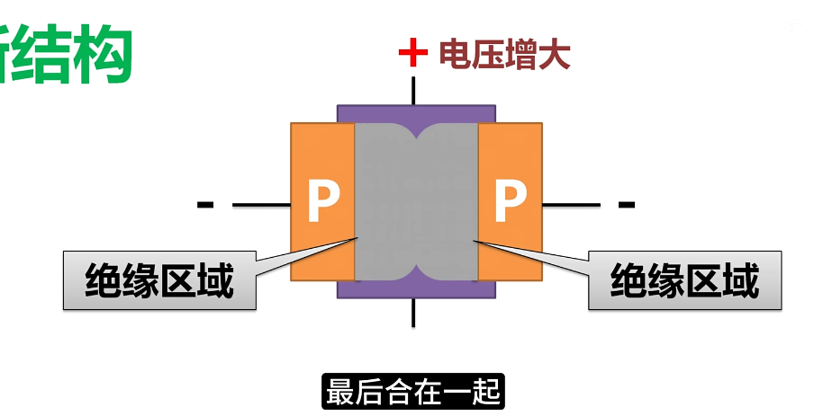

两个PN结一直工作在反偏截至状态, 不需要电流控制, 只需要控制电压差. 所以JFET是电压控制器件!

为啥叫结型场效应管? J(junction),即结型,因为是PN结原理; 场效应管(FET), 即通过非接触式的电场(即电压!)来控制.

引脚命名:

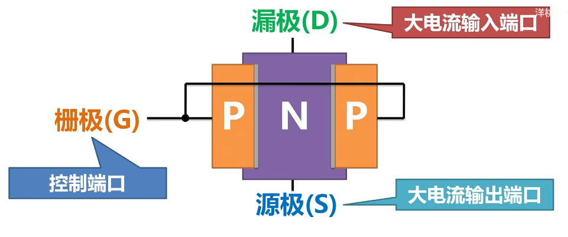

原理图中画成这样:
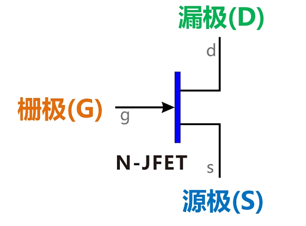

显然, 箭头方向意味着PN结方向(原理图只画了左边的PN结, 右边镜像对称的结构省略了.)

中间较粗的这个竖棍的意思是`半导体结构`.

P-JFET也就同样很好理解了.

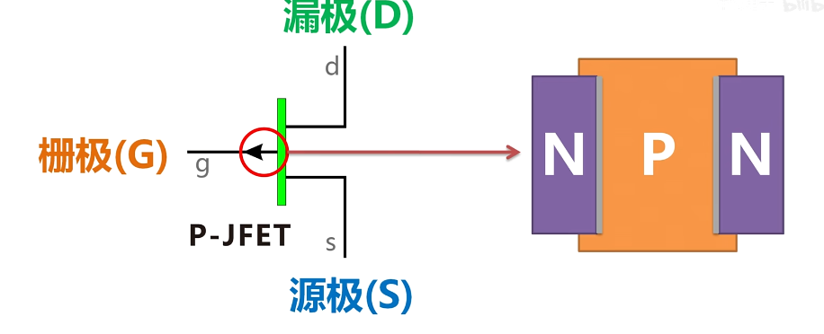

---------
缺点:
加紧方式有天然缺陷...不给栅极电压差或者源漏电压差太大的时候会"夹不紧".

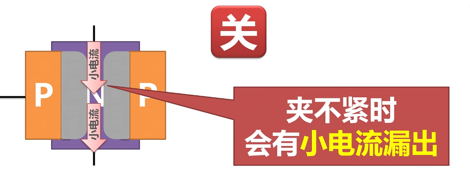

## 1.6 MOSFET

### 1.6.0 器件选型

常用CD4000系列芯片.(集成增强型N,PMOS)

------------
### 1.6.1 原理
我们知道JFET的**初始状态**(没有施加G和D的电压差来让PN结加紧)下, D->S是导通的.

如果想要解决JFET 夹不紧有漏电流的缺点, 我们希望这个器件的**初始状态**是断开状态. 也就是施加了电压才闭合开关.

思考: 想要一个器件, 让它在**施加电压的时候聚集电子, 从而形成导体**.
是**电容**.

我们来做一个电容:(以NPN为例)
利用P型半导体的少子是自由电子, 加电压后让自由电子聚集形成导电层.(为何不用N型? 因为N型半导体的自由电子是多子, 没有`聚集`的概念,加不加电压都到处都是.)

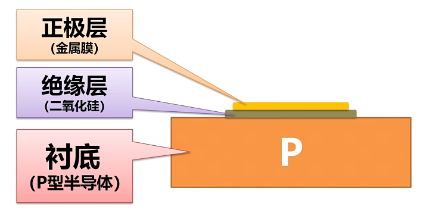

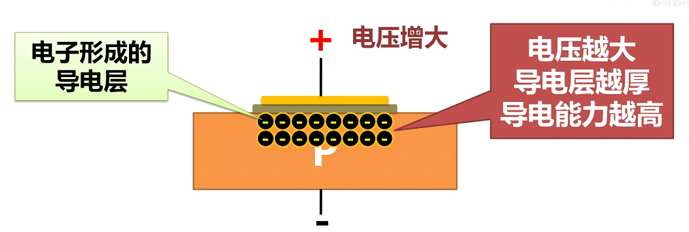

然后用两块N型半导体当导电层的两端引脚, 就是MOSFET了.

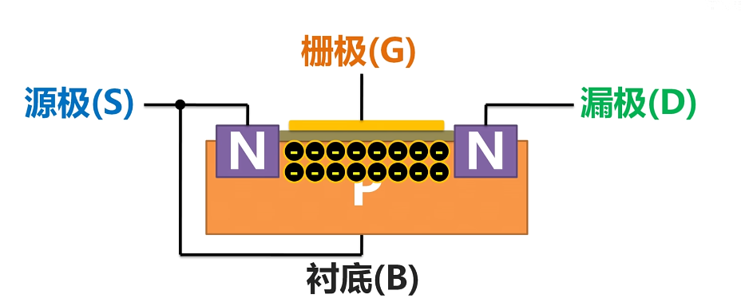

显然源极S和漏极D可以对称互换.
一般将衬底B和源极S连在一起.

* source和drain名称: 
  * 人们最早做出来的是PNP MOSFET, 打开的时候电流从source流向drain. 这就是词语本意.
  * 后来有了npn, 为了结构上一致:
    * source表示载流子出发的位置. 比如npn中载流子是自由电子, 它会从源极出发走向漏极.
      * 无论pnp还是npn, **source要和body短接: 防止source端的寄生二极管生效.**
    * drain表示载流子离开沟道的位置.
* 于是, npn管子电流是D->S, pnp管子电流是S->D.

mosfet的原理就可以形象理解为这样:

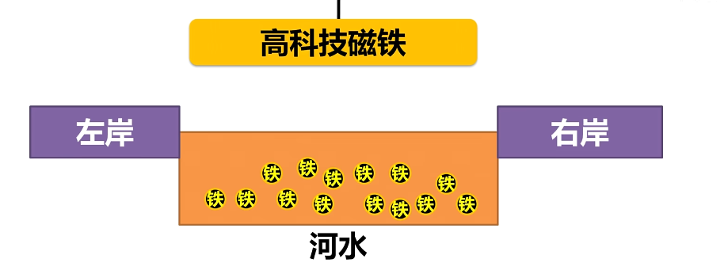
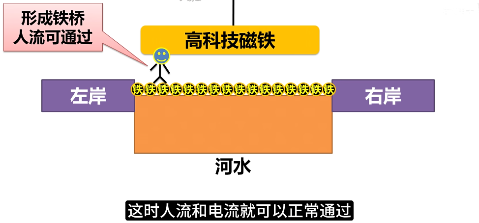

PNP也就很好理解了.

电路符号:

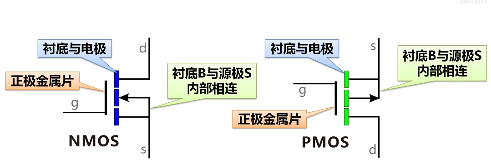
-----------

耗尽型MOS:

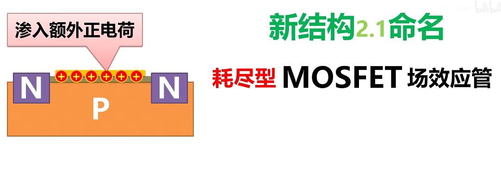

如果将这个NPN结构的**绝缘层**人为地掺杂一些能吸附自由电子的材料,
使即使没有施加电压, 也能吸引部分P型半导体基的一些自由电子到沟道里去, 形成部分导通, 就称为耗尽型.

电路图符号:

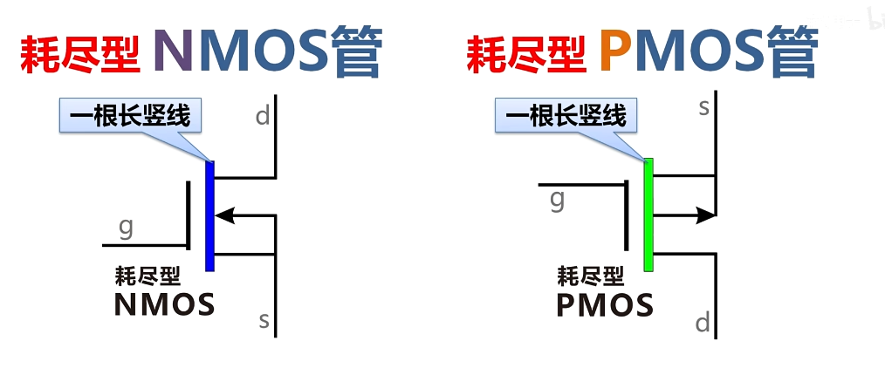
----------

**MOSFET还有很多不同的符号:** 

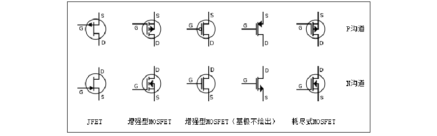

* 其中如果那个G端带有个小圆圈就是PNP, 形象表示比下面的NPN相比加了个非门. g极高电平反而夹断.
* 在绘出B极并和S极短接的MOSFET画法中, 箭头表示**基极**和**沟道**组成的PN结方向. 如下图.
 
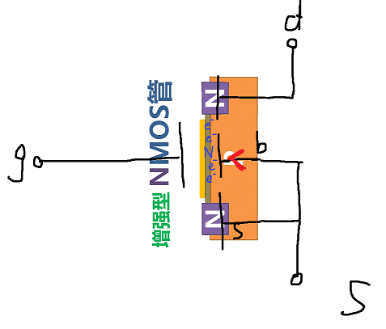

* 在省略B极的三端MOSFET画法中, 箭头表示**源极**和**基极**形成的PN结方向. 
  * 比如npn管子, 这个PN结是P型半导体基极指向N型半导体S极的. 于是标注为从S极向外的箭头. **这种画法可以很轻松理解电流流向**: 就是沿着箭头方向. 如下图.
 
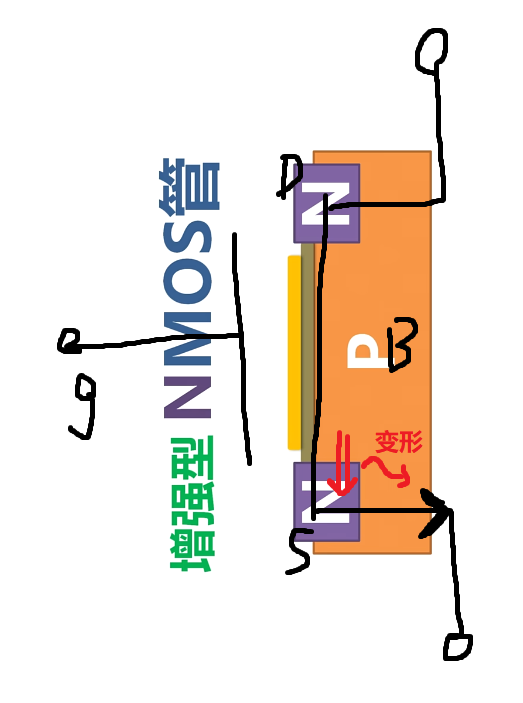

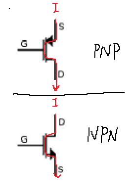

很形象地: 普通的增强型mos的符号是三段虚线, 表示"这里可以导通但是需要条件", 而耗尽型这里直接就是一根长竖线, 表示"这里一开始就是导通的".

事实上`JFET`和`耗尽型MOSFET`都不常用. 我们主要使用的都是`增强型MOSFET`.

更加简略的:

---------

### 1.6.2 寄生二极管

更加严格的增强型MOSFET的电路图其实是这样的:

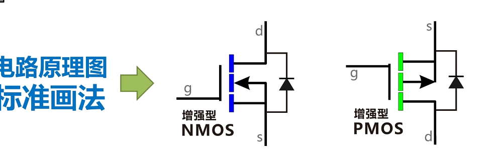

标注了一个二极管. 称为**寄生二极管**

**寄生二极管的方向和二极管导通时电流方向相反.**
这个电路符号形象地表示, 如果你输入了和设计电流流向相反的电压(比如NPN型, 加上U_DS), 那麽mos会无视G极, 反向导通.

--------

MOSFET的寄生二极管:

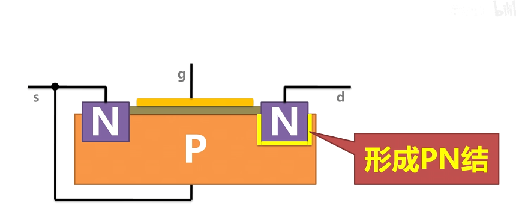

在(NPN)MOSFET结构中, 作为电极的N型半导体和P型半导体基底接触形成PN结(黄色部分). 平时电流不从这里过(直接从最上层的自由电子层沟道过了).

        为啥没有考虑左边也有个寄生二极管? 很简单, 按照惯例S和B已经短接了, 可以无视....

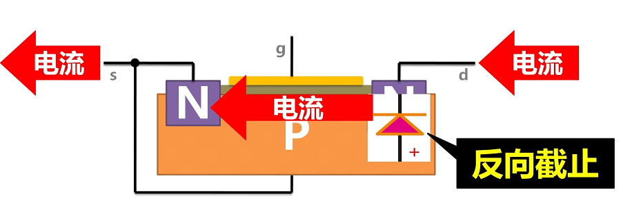

**正常使用时, 我们期望电流方向是(NPN)D->S或(PNP)S->D. (这也是drain(载流子去向), source(载流子来向)的含义)**  

(NPN)此时, 电流从D->S, D处的PN结处在N型半导体电压高, 二极管截止状态. 寄生二极管处在反向截止(因为电流从d->s, 形成微小压降)

如果发生反向的电流(当你施加S->D的电压时),

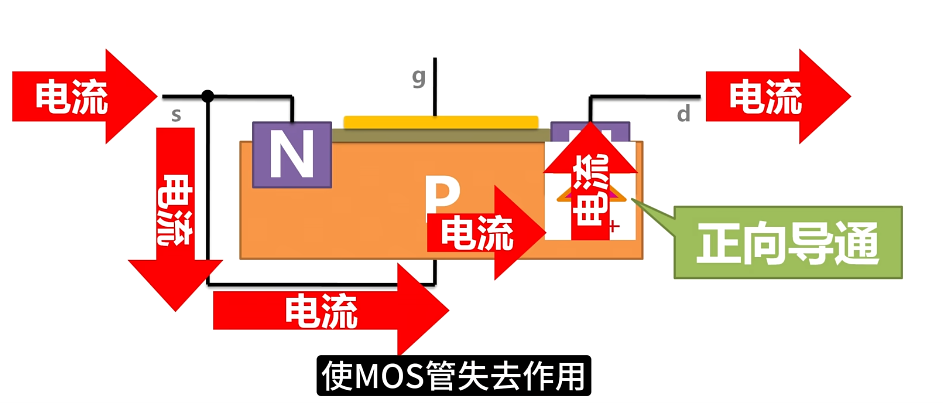

寄生二极管被打通, 电流可以流过, 此时g极没有办法控制电流了.

所以可以看到, 连接S,B极后, D极的寄生二极管的存在使得MOSFET的S,D不对称了. 如果施加(NPN)S->D的反向电压, 此时MOS一定可以导通, G极没有控制能力了. 
这也有好处:
可以反向放电保护MOS管.

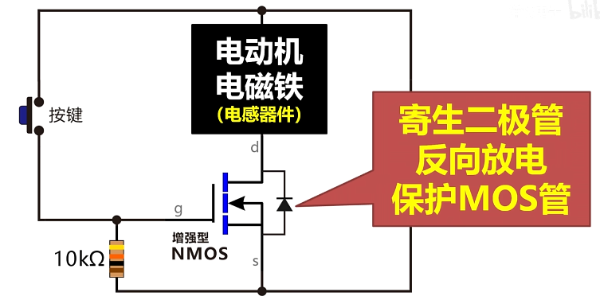
----------
**简单电路举例:**

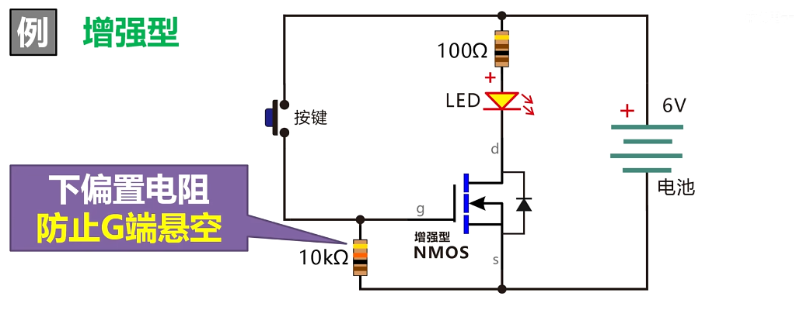
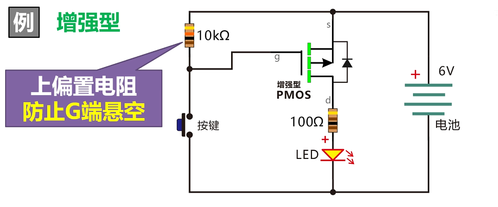

### 1.6.3 杂项

### 1.6.4 CMOS结构

# 2. 电路

## 2.0 二端口(port)网络

即引出四个端子的黑箱, 要求其中两两流过相同的电流, 各称为一对端子/一个端口, 即输入端口in和输出端口out.

当黑箱内只有R,C,L,线性受控源时, 一个二端口网络一定可以对外简化成一个T型阻抗网络, 或者一个PI型阻抗网络.

端口参数:(I1, V1是输入端口电压电流, I2, V2是输出端口电压电流)

| 测量目标           | 停用／激励方式                   | 端口条件       | 名称   |
| -------------- | ------------------------- | ------------- | ---- |
| **Z₁₁ (输入阻抗)** | 在输出端口不通电(关掉激励)，测输入端口的电压/电流比 | **输出开路** (I₂＝0) | 开路阻抗 |
| **Y₁₁ (输入导纳)** | 在输出端口短路，测输入端口的电流/电压比        | **输出短路** (V₂＝0) | 短路导纳 |
| **Z₂₂ (输出阻抗)** | 在输入端口不通电，测输出端口的电压/电流比       | **输入开路** (I₁＝0) | 开路阻抗 |
| **Y₂₂ (输出导纳)** | 在输入端口短路，测输出端口的电流/电压比        | **输入短路** (V₁＝0) | 短路导纳 |

一个网络的输入阻抗越大越好(这意味着不影响后面的网络.)

输出阻抗越小越好(带负载能力强!)

例如:
一个运放可以看成二端口网络.(不考虑供电的两端)
in port: v-, v+
out port: vout, GND

其输入阻抗极大, 所以可以认为in port几乎没有电流(虚断).

其输出阻抗极小, 以至于可以看成一个理想电压源.

## 2.1 峰值检测电路 

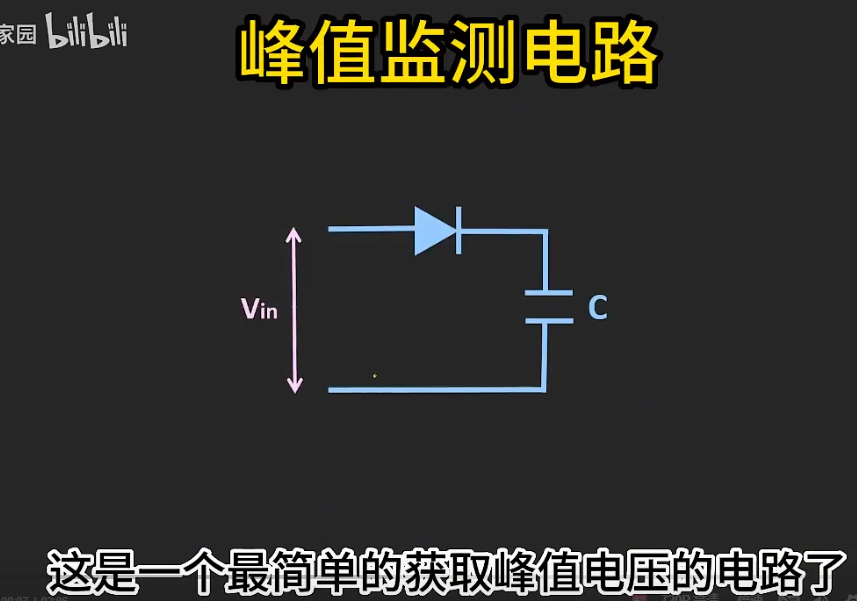

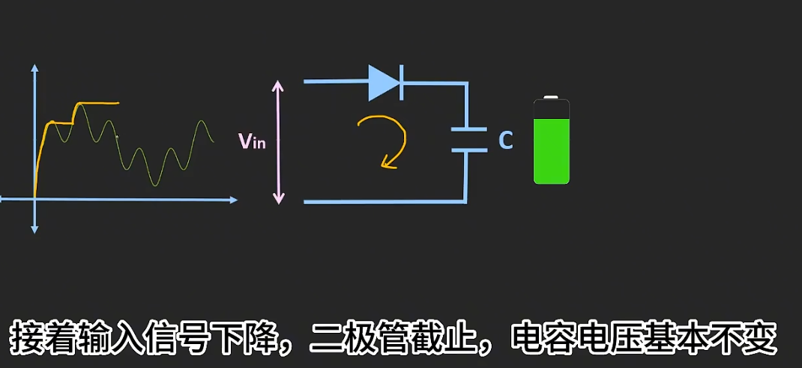

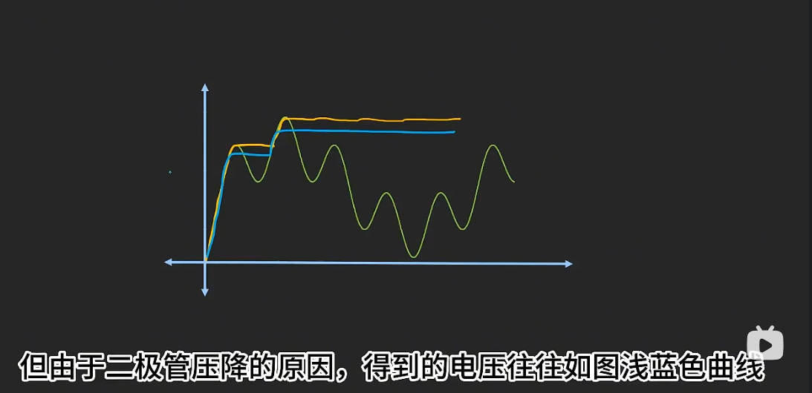

原理很简单, 电容只能充电不放电, 两端电压就是信号峰值了.

改进: 为了防止二极管导通压降, 可以使用超级二极管(精密整流电路)

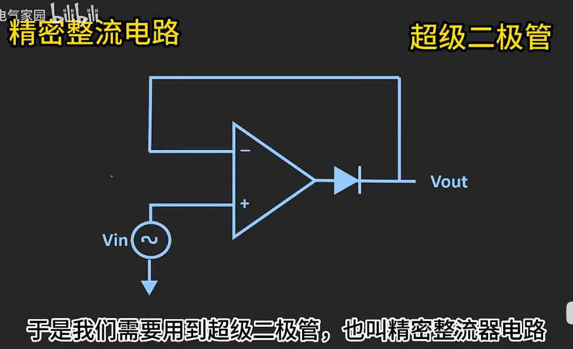

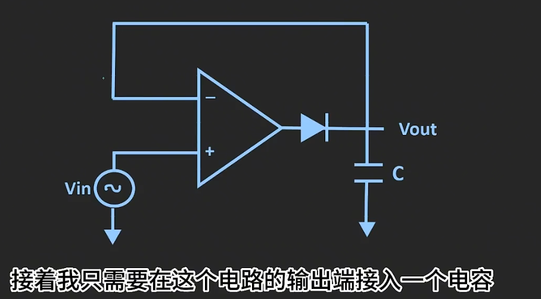

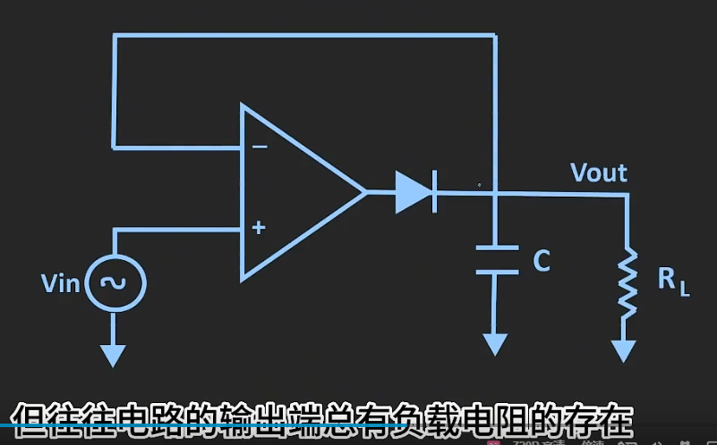

但是总是有负载, 所以电容其实会放电.

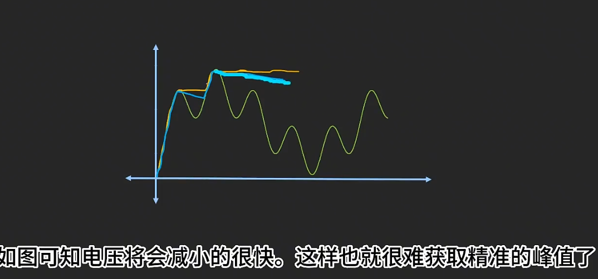

解决: 在电路后面加上一个电压跟随器.

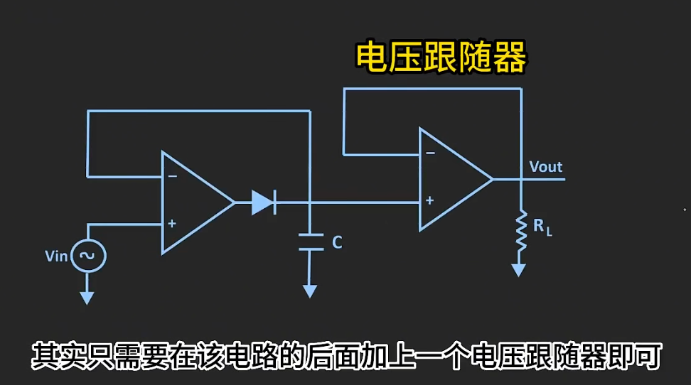

电压跟随器具有很大的阻抗.

## 2.2 微分电路(differentiator) &  积分电路

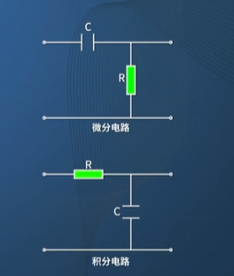
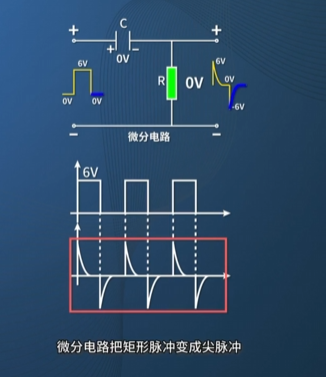

注意:
RC结构的时间常数$τ=RC$要远小于高低电平时间才叫微分电路，否则就是高通滤波电路！

同样的, 积分电路也可以退化为低通滤波电路.

## 2.3 高通/低通滤波电路

### 1.一阶低通滤波器

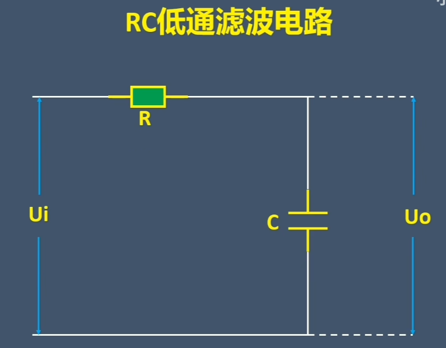

数学分析:
**先计算转移函数:**

$$
H(j\omega) ≡ \frac{U_o}{U_i} = \frac{X_c}{R + X_c} = \frac{\frac{1}{j\omega C}}{R + \frac{1}{j\omega C}} = \frac{1}{1 + j\omega RC} = \frac{1 - j\omega RC}{1 + (\omega RC)^2}
$$

**计算转移函数的模：**

$$
|H(j\omega)| = \sqrt{\left( \frac{1}{1 + (\omega RC)^2} \right)^2 + \left( \frac{\omega RC}{1 + (\omega RC)^2} \right)^2} = \sqrt{ \frac{1}{1 + (\omega RC)^2} }
$$

**转移的模代表了电压增益。**

当电压增益下降到 $\frac{\sqrt{2}}{2}$ 时，对应频率为定义为截止频率$f_c$ ,

令:

$$
|H(j\omega)| = \sqrt{ \frac{1}{1 + (\omega RC)^2} } = \frac{\sqrt{2}}{2}
$$

化简可得：

$$
\omega RC = 1 = 2\pi f_c RC
$$

求得截止频率：

$$
f_c = \frac{1}{2\pi RC}
$$

小于$f_c$时, 
低频信号可以通过(电压保留比例多于$1/\sqrt{2}=71\%$ , 功率保留多于$50\%$). 
大于$f_c$时, 认为高频信号无法通过.

设计电路时, 一般先选择电容(nf级别), 然后推导想要的电阻R值.

### 2.一阶高通滤波器

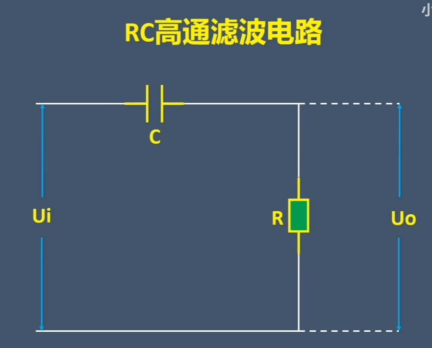

传递函数推导:

   根据分压原理，
    $$
     H(j\omega)
     = \frac{U_o}{U_i}
     = \frac{R}{R + X_C}
     = \frac{R}{R + \frac{1}{j\omega C}}
     = \frac{R}{\frac{j\omega RC + 1}{j\omega C}}
     = \frac{j\omega RC}{1 + j\omega RC}
    $$

1. **幅度响应**  
   计算模值：
    $$
     |H(j\omega)|
     = \left| \frac{j\omega RC}{1 + j\omega RC} \right|
     = \frac{\omega RC}{\sqrt{1 + (\omega RC)^2}}
    $$

2. **截止频率**  
   和低通相同. 截止频率定义为幅度降到最大值的 $\frac{1}{\sqrt{2}}$ 处.
   令:
    $$
     |H(j\omega_c)| = \frac{\omega_c RC}{\sqrt{1 + (\omega_c RC)^2}}
     = \frac{1}{\sqrt{2}}
    $$
   解得
    $$
     \omega_c RC = 1
     \quad\Longrightarrow\quad
     \omega_c = \frac{1}{RC}
     \quad\Longrightarrow\quad
     f_c = \frac{\omega_c}{2\pi} = \frac{1}{2\pi RC}
    $$

结果形式正好和低通滤波器相同.

大于于$f_c$时, 
高频信号可以通过(电压保留比例多于$1/\sqrt{2}=71\%$ , 功率保留多于$50\%$). 

小于$f_c$时, 认为低频信号无法通过.

### 3. 二阶RC低通滤波器

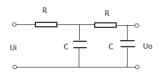

分析方法是一样的.
(略)

## 2.4 RLC串联谐振电路和RLC并联谐振电路

### 2.4.0 概述

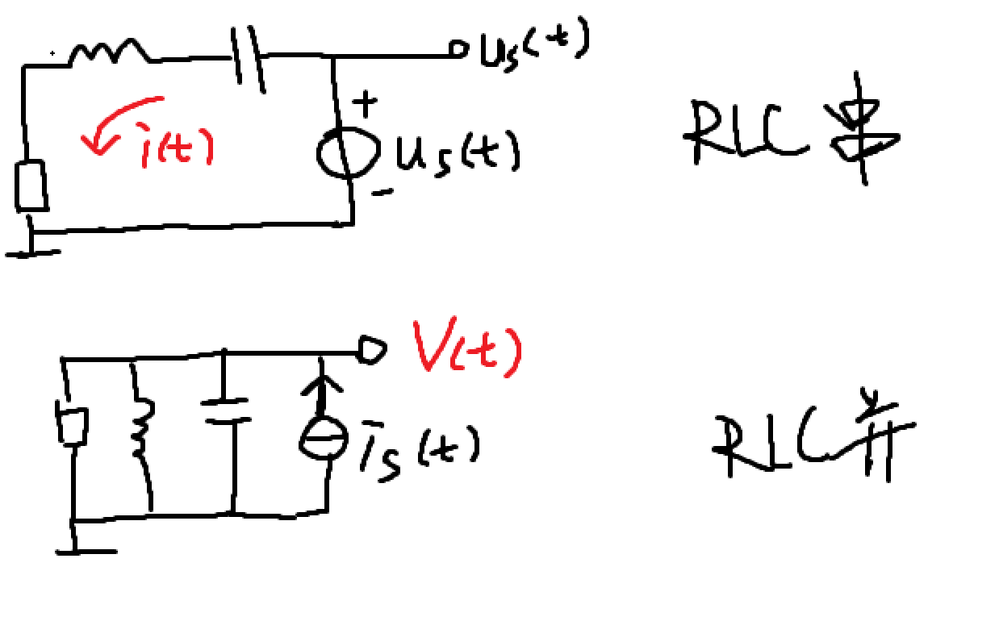

* 微分方程可以用这几组参数来表示:
  * 物理标准形式: **{m,c,k}**
  * 归一化信号标准形式: **{α, $\omega_0$}** 或 **{ζ, $\omega_0$}**

| **类型** | **RLC 串联电路**   | **RLC 并联电路**   |
| ------ | ---------------- | ----------------------------- |
| 微分方程   | $L\frac{d^2 i}{dt^2} + R\frac{di}{dt} + \frac{1}{C}i = 0 或 u_s(t)$ | $C\frac{d^2 V}{dt^2} + \frac{1}{R}\frac{dV}{dt} + \frac{V}{L} = 0 或 i_s(t)$ |
| 状态变量   | 电流 $i(t)$                                                 | 电压 $V(t)$                        |
| 衰减系数$α$   | $\alpha = \frac{R}{2L}$                                   | $\alpha = \frac{1}{2RC}$          |
| 固有频率$\omega_0$| $ω_0 = \frac{1}{\sqrt{LC}}$          | $ω_0 = \frac{1}{\sqrt{LC}}$              |
|系统惯性$m$  |   $m=L$ ($L$电抗抵抗$i$变化)       |      $m=C$  ($C$电容抵抗$V$变化)         |
|系统阻尼系数$c$ |   $c=R$        |      $c=G(电导)=1/R$         |
|系统劲度系数$k$ |   $k=1/C$        |      $k=1/L$           |
| 阻尼比$ζ≡\frac{c}{2\sqrt{mk}}$   | $ζ  = \frac{R}{2} \sqrt{\frac{C}{L}}$     | $ζ = \frac{1}{2R} \sqrt{\frac{L}{C}}$     |
| 品质因数$Q=1/2ζ=\frac{ω_0}{2α}$   | $Q = \frac{1}{R} \sqrt{\frac{L}{C}}$     | $Q = {R} \sqrt{\frac{C}{L}}$     |

* 如何理解**衰减系数α**?
  * α刻画震荡过程中能量耗散的速度.
  * 对串联来说: 
    * α∝R. 串联的R导致电流流过后产生热耗散. R越大, 损耗越快.
    * α∝1/L. 串联的L**存储电流能量**, 抵抗电流变化. L越大, 电流衰减越慢, 更多的能量被存储在磁场中.
  * 对并联来说:
    * α∝1/R. 并联电路上的RLC拥有相同的电压. R越大, R支路的损耗越小.
    * α∝1/C. 并联的C**存储电压(即电场)能量**, 抵抗电压变化. C越大, 电压变化越慢, 更多的能量被存储在电场中.

### 2.4.1 再论振动方程: 对比一下机械系统的震荡

#### 2.4.1.1 振动方程的几个标准形式

阻尼系数 α 和本征频率 $ω_0$ 的引入, 目的是数学上化简微分方程为**标准形式**:

------

##### 2.4.1.1.1 **标准振动方程1(控制理论/信号分析形式, 用{α, $ω_0$}定义方程)**

$$\frac{d^2x}{dt^2} ​+ 2α\frac{dx}{dt} ​+ ω_0^2x = 0 或 f(t)$$

其中:
* α称为**阻尼率/衰减系数**, 单位为1/s
* $ω_0$称为本征频率
* f(t)为外力.
* 定义**阻尼比**$ζ=\frac{α} {ω_0}$ (**物理意义: 衰减系数α显然和阻尼系数ζ正相关; 系统本征频率ω_0越大, 弹簧更硬/电抗更大, 阻尼对系统的影响越小, 系统的阻尼比就越小.**), 方程也可以写成(用ζ消去α, 变成用{ζ, $ω_0$}定义的方程):

  $\frac{d^2x}{dt^2} ​+ 2ζω_0\frac{dx}{dt} ​+ ω_0^2x = 0$
 
-------------

##### 2.4.1.1.2 **标准振动方程2(物理形式,用{m, c, k}定义方程)**

在力学系统, 振动方程一般写为:

$$m\frac{d^2x}{dt^2} ​+ c\frac{dx}{dt} ​+ kx = 0 或 f(t)$$

该方程的每一项的量纲表示一个"力".

其中:
* m为物体质量, 
* c为**(物理)阻尼系数**, 
* k为弹簧刚度, 
* 定义**阻尼比**$ζ=\frac{c}{2\sqrt{mk}}$, 方程也可以用

和标准振动方程1的系数对应:
* 系统的阻尼系数α为$α = C/2m$
* 系统的固有频率ω为:$ω_0 = \sqrt{k/m}$

---
---
方程各项的分解:

* 我们称$kx$项为**回复力**项. 它和 $m\frac{d^2x}{dt^2}$ 项在方程同一侧, 也即关系为 $m\frac{d^2x}{dt^2} = -kx + ...$ 

  **这意味着 $-kx$ 这一项是阻止位移 $x$ 离开平衡位置的!** 

* 我们称$c\dot{x}$项为**衰减项**. 它和 $m\frac{d^2x}{dt^2}$ 项也在方程同一侧, **这意味着 $c\dot{x}$ 这一项是阻止 $x$ 发生变化(拥有速度)的!** 

  假设空气阻力等于1*速度, 则此时$c=1$.
* 我们称$m\frac{d^2x}{dt^2}$为**惯性项**.
---
---

-------------

##### 2.4.1.1.3 RLC串联系统的方程(电流i的方程)

* 在RLC串联电路:

    $$L\frac{d^2 i}{dt^2} + R\frac{di}{dt} + \frac{1}{C}i = 0 或 u_s(t)$$

    将参数对应到{m,c,k}:(换算成{α, $ω_0$})
    * $m=L$ , 表示**惯性**. 物理图像: L作为**电抗**, 和m一样贡献惯性, 抵抗 $i$ 变化.
    * $c=R$ , (阻尼系数) , 表示**能量耗散**. 物理图像: 串联的电阻* $i^2$对应能量耗散.
    * $k=1/C$. 物理图像: 更小的电容->充电更快->系统越硬/快, 本征频率越高.
    * 系统的阻尼比: $ζ = \frac{c}{2\sqrt{mk}} = \frac{R}{2} \sqrt{\frac{C}{L}}$

    定义$α=R/2L$, $ω_0 = \sqrt{k/m}$, 则方程化为标准形式(控制理论形式):

    $$\frac{d^2i}{dt^2} ​+ 2α\frac{di}{dt} ​+ ω_0^2i = 0 或 u_s(t)$$    
---------------

##### 2.4.1.1.4 RLC并联系统的方程(电压V的方程)

* 在RLC并联电路:

    $$C\frac{d^2 V}{dt^2} + \frac{1}{R}\frac{dV}{dt} + \frac{V}{L} = 0 或 i_s(t)$$

    将参数对应到{m,c,k}:. 
    * $m=C$, 表示**惯性**. 物理图像: C作为**电感**, 和m一样贡献惯性, 抵抗 $V$ 变化.
    * $c=1/R$ , 表示**能量耗散**. 物理图像: 并联的电导* $V^2$对应能量耗散.
    * $k = 1/L$ ,物理图像:  因为 $V=L \dot{i}$ , ...不清楚...
    * 系统的阻尼比: $ζ = \frac{c}{2\sqrt{mk}} = \frac{1}{2R} \sqrt{\frac{L}{C}}$

于是现在统一起来了. 无论是RLC串联还是RLC并联还是机械震荡, 都可以用阻尼系数 α 和本征频率 $ω_0$ 这两个参数描述. 接下来我们来讨论解方程, **品质因数**等问题, 可以直接基于标准振动方程来了!

---
---
---

#### 2.4.1.2 解齐次方程(自由振动) :  欠阻尼和过阻尼两种情况

对标准振动方程:
$$\frac{d^2 x}{dt^2} + 2\alpha \frac{dx}{dt} + \omega_0^2\,x = 0 $$

其特征方程:

$$s^2 + 2\alpha\,s + \omega_0^2 = 0$$

求解特征方程得:

$$s = \frac{-2\alpha \pm \sqrt{(2\alpha)^2 - 4\,\omega_0^2}}{2} = -\alpha \pm \sqrt{\alpha^2 - \omega_0^2}$$
--------------

Ⅰ当$α<ω_0$, 即$0<ζ=\frac{α}{ω_0}<1$ (称为**欠阻尼**) 时,

两个特征根s为共轭复数:

$$令\omega_d = \sqrt{\omega_0^2 - \alpha^2} \in \mathbb{R},$$

则有:
$$s_{1,2} = -α ±iω_d$$

此时解得:

$$x(t) = e^{-α t}\bigl(C_1\cos(\omega_d t) + C_2\sin(\omega_d t)\bigr)
$$

可以看到, **欠阻尼时系统 (指x的值啦) 在指数衰减的同时以频率$ω_d$震荡.** 

**当系统阻尼不是很大(α<<1)的时候, $\omega_d = \sqrt{\omega_0^2 - \alpha^2} ≈ \omega_0$, 我们发现系统近似在本征频率$ω_0$做震动! 这也是本征频率名字的由来!**

----------------
Ⅱ 当$α>ω_0$, 即$ζ>1$ (称为**过阻尼（Overdamped**) 时,

两个特征根s为实数.

显然, 此时系统响应是两个指数衰减叠加，没有振荡，信号单调回落。大部分情况下我们对过阻尼系统没什麽兴趣.

----
----
----

#### 2.4.1.3 解非齐次方程 (加上外部激励f(t)后的受迫振动) :

首先, 非齐次方程的标准形式:
$$\frac{d^2 x}{dt^2} + 2α \frac{dx}{dt} + \omega_0^2\,x = \frac{f(t)}{m} $$

考虑正弦激励$f(t)=Acos(ωt)$

取特解$x_{special}(t) = Xcos(ωt-φ)$ , 带入非齐次方程:

先计算导数
$$
\frac{dx_p}{dt} = -X \omega \sin(\omega t - \varphi)        \\
\frac{d^2 x_p}{dt^2} = -X \omega^2 \cos(\omega t - \varphi)
$$

带入非齐次方程:

$$
\bigl(-X \omega^2 \cos(\omega t - \varphi)\bigr) 
+ 2\alpha \bigl(-X \omega \sin(\omega t - \varphi)\bigr) 
+ \omega_0^2 \bigl(X \cos(\omega t - \varphi)\bigr) 
= \frac{A}{m} \cos(\omega t).
$$

解得$X$和$φ$:

$$
% 振幅公式
X(ω) = \frac{A}{k} \cdot \frac{1}{\sqrt{(1 - r^2)^2 + (2 \zeta r)^2}}
$$

其中 $r = \frac{ω}{ω_0}$表示外界激励和系统本征频率的比值.

$$
% 相位差公式
\phi = \arctan\left( \frac{2 \zeta r}{1 - r^2} \right)
$$

其中:
$$
% 参数定义
ω_0 ≡ \sqrt{\frac{k}{m}}(本征频率, 系统决定,和激励无关), 
\\
\zeta ≡ \frac{c}{2 \sqrt{m k}}(称为阻尼比, 系统决定,和激励无关)

\\
总之用\{ω_0, \zeta\}来表示系统和用\{ω_0, α\}, 抑或是直接使用\{m, b, k\}是等价的. \\前两者对所有震荡系统(机械, 电学)通用!
\\
ω_d ≡ ω_0\sqrt{1-\zeta^2}
\\解齐次方程的时候我们已经知道, ω_d是欠阻尼振动的频率. 系统决定,和激励无关
$$
---
于是我们得到**欠阻尼的受迫振动全解**:

$$x(t) = e^{−ζω_0​t} \bigl(C_1​cos(ω_d​t)+C_2​sin(ω_d​t)\bigr) + X(ω) cos(ωt−ϕ)$$

* 初始条件决定常数$C_1$, $C_2$.

这个震动两部分构成, 一段时间后只剩下第一部分:
* 振幅和系统与外界激励一起决定, 频率由外界激励决定的正弦震动项 $X(ω)cos(ωt−ϕ)$ . 其振幅$X(ω)=$

* 一个指数衰减的齐次通解震动项$e^{−ζω_0​t} \bigl(C_1​cos(ω_d​t)+C_2​sin(ω_d​t)\bigr)$. 这一项就是齐次通解, 必然和外界激励无关. 它的振动频率$ω_d ≡ ω_0\sqrt{1-\zeta^2}$, 只由系统决定.
------------
* 我们称$ω_0$为 **本征频率 / 固有频率 / 自然频率**. 
  * **自由振动**情况: 它是系统在没有阻尼时的自由振动频率
  * **受迫振动**情况: 它是外部激励达到共振要求的频率.

* 称$ω_d$为 **阻尼振荡频率 / 衰减频率 / 阻尼自然频率**. 
  * **自由振动**情况: 它是系统在阻尼b下自由振动的频率.
  * **受迫振动**情况: 它是在受迫振动时, 衰减的那部分(也就是齐次通解)的振荡频率. 这就是它被称为衰减频率的原因.
-------------

#### 2.4.1.4 **小阻尼近似; 共振**

首先介绍常用近似: **小阻尼近似**: **ζ≪1** (即考虑微小阻尼的情况. 这种欠阻尼情况也是我们最常遇到的)
  在很多物理和工程系统里 **阻尼都比较小**，所以 ζ≪1是常见情况。
  -   **机械振动（弹簧、梁、桥梁）**：ζ 常常在 0.01 ~ 0.05。   
  -   **电振荡电路（RLC）**：电阻小的高品质电路 ζ≪1，比如射频谐振腔。  
  -   **结构工程**：钢结构、混凝土结构的阻尼比ζ大约在 0.02 ~ 0.1。    
  -   **汽车悬架**：阻尼设计稍大，ζ常在 0.2 ~ 0.3，仍然小于 1（欠阻尼），不过已经不是“极小阻尼”了。    
  -   **过阻尼 (ζ>1)**：就不是振荡，而是单调衰减了。一般调节系统时会避免。

---
---

现在考虑对一个确定的系统, 外接激励$f(t)=Acos(ωt)$的频率 $ω$ 作为变量, 并且做小阻尼近似.

当外接激励$f(t)=Acos(ωt)$的频率 $ω ≈ ω_0$, 即 $r≈1$ 时, 
正弦震动项$Xcos(ωt−ϕ)$的振幅

$$
X(ω) = \frac{A}{k} \cdot \frac{1}{\sqrt{(1 - r^2)^2 + (2 \zeta r)^2}}
$$

取最大值$X_{max}$! 而且观察 $X=X(ω)$ 这个函数, 我们会发现它非常陡峭: 函数形状是

$f(x) = \frac{a}{\sqrt{(1-x^2) + (bx)^2}}$, 其中a~1, b<<1

的形式, 图像大概为:

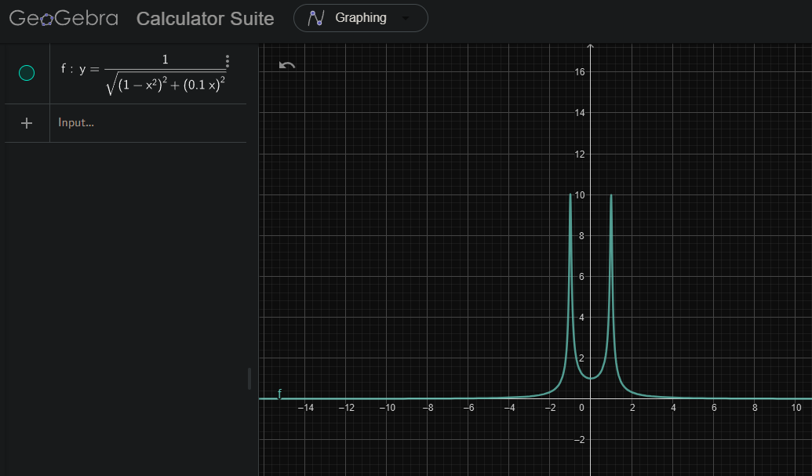 

可以看到当r接近1的时候变化的非常陡峭, 也就是说, 当外界激励的频率$ω$靠近系统的本征频率$ω_0$时, 正弦震动项振幅X会显著地极大增大. 这个现象就称为谐振.

对了, 我们称这个X(ω)图像为**共振曲线**.

------------

#### 2.4.1.5 **品质因数Q**

聚焦在受迫振动-**小阻尼近似**场景下, 我们引入**品质因数Q**的定义:

$$Q ≡  \frac{ω_0}{Δω} 品质因数的频域定义$$

其中w_0是系统的本征频率, Δω是**半功率带宽**, 即:
考虑X(ω)图像 (即上面的系统正弦非衰减项的振幅X和外部激励频率ω的图像), 是个钟形曲线. 我们取$X=1/\sqrt{2}截取得到的带宽就是半功率带宽Δω.$ 

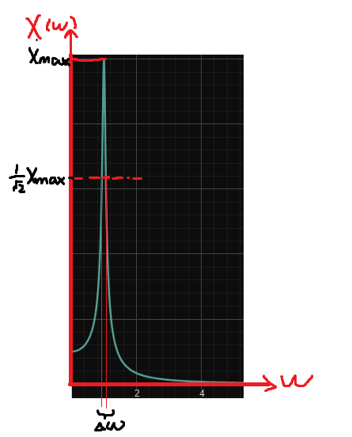

在小阻尼近似(ζ<<1)下, 可以证明:

$$
Δω ≈ 2α \\
Q ≈ \frac{ω_0}{2α} = \frac{1}{2ζ}
$$

**Q和ζ是倒数关系!**  这也意味着, 
$$弱阻尼(ζ<<1) \leftrightarrow Q>>1$$

---
Q的一个**等价**定义:
$$Q ≡  2\pi \frac{E_{total}}{ E_{loss}} 品质因子的时域定义$$

其中,
  * E_{total}是共振时能量存储;
  * E_{loss}是单个周期能量耗散;

我们可以验证这两定义(在小阻尼近似下)等价.

共振时存储的能量为
$$E_{total} = \frac{1}{2} kX_{max}^2$$

单个周期的能量耗散为
$$
\begin{align}
    E_{loss} &= \int^T_0 P_{loss}dt     \\
    &= \int^T_0 b \dot x^2 dt           \\
    &= \pi b ω_0 X_{max}^2              \\
    
\end{align}
$$

现在Q的两个定义的每一项都可以算了, 全带进去发现相等, 结束.
...

---

## 2.5 电感的品质因数

我们已经讨论过在小阻尼近似(ζ<<1)下, 一个标准欠阻尼受迫振动系统{ $ω_0$, $ζ$, $f(t)=Acos(ωt)$ }, 可以定义系统的品质因数($ζ≡\frac{α}{ω_0}$):

$$
Q =  2\pi \frac{E_{total}}{E_{loss}} = \frac{ω_0}{2α} = \frac{1}{2ζ}
$$

我们知道Q和ζ是倒数关系. ζ正比于$\frac{E_{loss}}{E_{total}}$.

我们知道, 
* 在RLC串联电路方程中, 回复力项为$\frac{1}{C}i$, 故$k=\frac{1}{C}$, 故$α = \frac{c}{2m} = $故$Q=\frac{ω_0}{2α} = $
* 在RLC并联电路方程中, 回复力项为$\frac{1}{L}V$, 故$k=\frac{1}{L}$, 故$Q=\frac{ω_0}{2α}$

----

* 对于单个L元件, 它有等效串联电阻$R_s$.

  定义其品质因数$Q≡\frac{ωL}{R_s}$

* 对于单个C元件, 它有等效串联电阻$R_s$.

  定义其品质因数$Q≡\frac{ωL}{R_s}$

##

##

