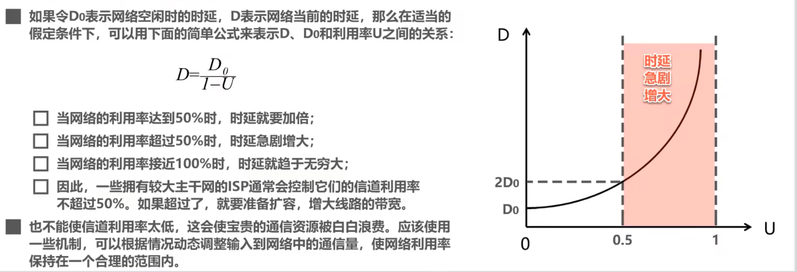
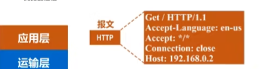
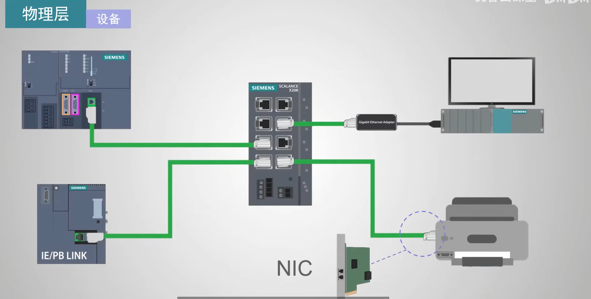
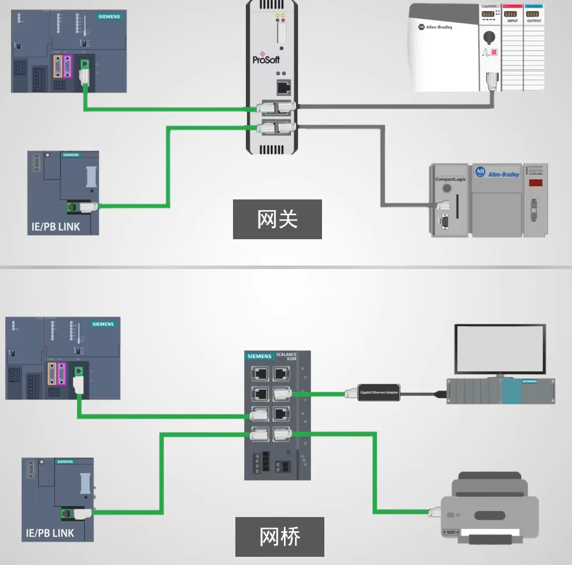
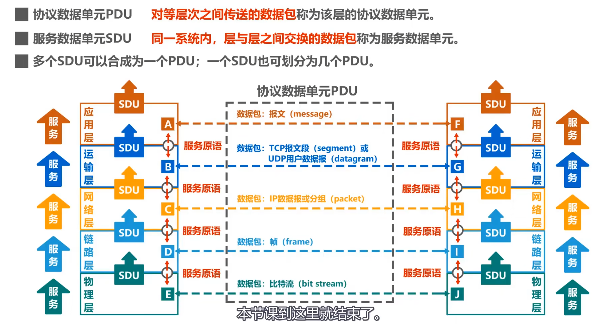

# 1. 计算机网络基础
## 1.概述
### 1.2 因特网概述

* **网络** = 若干**结点node**  + 若干**链路link**(有线链路/无线链路).

* **互联网(internet)** = 多个网络通过**路由器**互连起来, 是网络的网络.
* **因特网(Internet)** = 目前全球最大的互联网络, 采用TCP/IP协议作为通信规则, 其前身是每过ARPANET.
* **主机(host)** = 连接在Internet上的计算机. 是网络中的一个结点.
#### 1.2.1 Internet历史
>1969年, 美国第一个分组交换网ARPANET
>1983年, TCP/IP协议称为ARPANET标准协议, 标志着Internet诞生.
>1985年, NSF围绕六个大型计算机中心,  建设了NSFNET(主干网,地区网和校园网)
>1991年, 美国政府将因特网交给私人经营经营
>1993年, NSFNET被若干个商用因特网主干网替代, 政府机构不负责运营, 而让各种 **因特网服务提供者(ISP,Internet Service Provider)** 来运营.
* 我国主要的ISP是中国电信, 中国联通, 中国移动.
>1995年, NSFNET停止运作, Internet彻底商业化.

#### 1.2.2基于ISP的三层结构的Internet


### 1.3 三种交换方式
#### 1.3.1 电路交换(circuit switching)
是物理上的电路交换. 座机就是使用电路交换.
电话交换机, 其实就是一个开关, 可以控制哪两个线路联通.


#### 报文交换
相比分组交换, 不把一个报文拆为分组+报头, 一整个交换. 也需要路由器缓存转发. 已过时.

#### 1.3.2 分组交换(Packet Swictching)
路由器是最重要的分组交换机.
通过路由器的两主机的一次报文传输:
>发送方: 构造,发送分组
>路由器: 缓存,转发分组
>接收方: 接收,还原分组


#### 总结:
>A, B, C, D为传输路径上所要经过的4个结点, 纵坐标↓为时间.


### 1.5 计算机网络的性能指标
>速率: 主机在数字信道上传送比特的速率. 例: 某段链路的发送速率为100Mbps.
>带宽:   
- [模电]信号所包含的不同频率成分, 即频带宽度.(Hz)    
- [计网]两点之间传输的最高速率.(B/s)
- 事实上, 一条通信线路的频带宽度越高, 最高速率也越高.
>吞吐量: 单位时间通过某个网络/接口的数据量, 吞吐量最高就是带宽.
>**时延**: 延迟. 贡献自 
- 发送时延($\frac{分组长度(b)}{发送速率(b/s)}$). 发送速率可以近似看为信道带宽.
- 传播时延(\frac{传送距离}{介质光速 }) 
- 处理时延(排队时延+处理时延)
>时延带宽积: 即 **时延*带宽** . 其大小的物理意义是[在传输中的数据]大小.

(下图横坐标为时间)


>往返时间(RTT, round-trip time): 两个主机一次双向交互所需时间.
>利用率: 
- 信道利用率: 某信道有百分之几的时间是有数据通过的.
- 网络利用率: 某时刻全网络有百分之几的信道正在有数据通过.
* 根据排队论, 信道利用率越大, 其时延也迅速增加. 信道利用率不能超过50%.
* 
>丢包率:  即分组的丢失率. 可大致分为两种情况:
1.这个分组在传输中出现误码, 从而被下个结点丢弃.
2.这个分组到达一个队列已满的分组交换机, 从而被丢弃. (此时即发生了网络拥塞.)
- 接口丢包率
- 节点丢包率
- 链路丢包率
- 路径丢包率
- 网络丢包率

### 1.6 计算机网络体系结构.

OSI标准体系冗杂, 而且没有及时占领市场, 故失败.
* TCP/IP协议相当于去掉了OSI结构的**会话层**, **表示层**, 合并了**物理层**和**数据链路层**为**网络接口层**,  把**网络层**称为**网际层**(TCP/IP协议在网络层应用IP协议, 即Internet Protocol网际协议)
* 路由器一般只包含网络**接口层**和**网际层**. 
   - 事实上网络接口层并没有限制各种接口, 所以实际上TCP/IP协议只有三层, 其中IP层(网际层)是核心协议. 它将网络接口层互联(称为IP over everything), 并向其上的TCP协议和UDP协议提供网络互连服务(称为everything over IP). 
   - TCP/UDP运输层再向应用层提供传输服务(TCP提供可靠传输服务, UDP提供不可靠传输服务.)
* 运输层协议主要有 
  - TCP(Transmission Control Protocol), 在传输数据之前通过三次握手建立一个可靠的连接. 确保数据发送和接收端都有序完整.
  - UDP(UserDatagram Protocol), 无连接的协议, 即建立连接, 数据直接发送, 也不管发到没有, 丢包没有, 反正就是从本地发送出去. 因此也无法提供错误检查, 重传, 流量控制功能. 数据包可能丢失/重复/乱序到达, 应用程序自己处理这些问题.
* 应用层协议主要有HTTP, SMTP, DNS, RTP, POP3(接收邮件)SSH(是的, http和ssh都是一种TCP/IP协议的应用层协议.)
不同应用层协议使用不同的下层服务(TCP或UDP).

* 由此可见这其实是一个庞大的协议族, 取其中最重要的TCP和IP协议, 将整个协议族取名为TCP/IP协议.
* 在嵌入式开发领域, TCP/IP协议族 常称为TCP/IP协议栈.
  


#### 1.6.1 物理层

物理层要解决的问题是如何在两头传输01信号.
#### 1.6.2 数据链路层

数据链路层要解决的问题是标识一个网络(无论是有限还是无线)的各设备(主机), 协调各主机. 
我们说物理层对数据链路层是**透明**的, 即数据链路层的工作不需要知道物理层是如何实现的, 也不需要知道, 只需要享受物理层的工作结果.
#### 1.6.3 网际层

如图是一个由三个路由器, 四个网络互连起来的小型互联网.
网络层(网际层)的任务是标识各网络和主机, 以及帮助路由器选择合适的路径转发分组.
如, 使用IP协议, 每台主机的IP地址中, 前三个数字用来标识网络, 而后一个数字用来标识该网络的主机.
<br><br>
至此,可以实现分组(回忆, 分组指的就是报文的分尸带上报头)在网络之间(或者说不同局域网之间)的传输问题.
<br><br>
网际层除了IP协议,还有

- **PPP(点对点协议)**
  -  属于TCP/IP体系结构网络接口层, 可以直接为IP协议提供服务.
- **ICMP(网际控制报文协议)**
  - 使用ICMP协议封装的协议数据单元, 需要用IP协议封装为IP数据报才能发送. 即IP协议直接为ICMP协议提供服务.
  

#### 1.6.4 运输层
但是, 例如在一个**客户端主机**主机上同时运行着两个**进程**(google浏览器和qq), 当**服务器主机进程apache**向该主机发送qq消息报文的时候, 客户端主机如何区分该呈给哪个进程呢?--->运输层协议要解决的问题.

#### 1.6.5 应用层
在上述基础上, 只需要制定各种应用层协议, 按照协议编写应用程序, 就可以在应用进程的交互来完成具体到分组的交互.

#### 1.6.6 summery

#### 1.6.7 实际情况;

当我们在浏览器上访问某个网站时, 其实是两个主机的两个应用进程之间的信息交换.

- 首先, 浏览器应用进程按照http协议,生成一个http请求文本.

- 该请求文本在运输层加上TCP协议报头, 成为TCP报文段.

TCP报文段在网络层上按照IP协议加上IP报头, 成为IP数据报.

- IP数据报交付给数据链路层, 将IP数据报加上一个首部和一个尾部, 称为**帧**.  我们假设我们所在的局域网是一个以太网, 以太网的帧如下图.

- 物理层将整个信号加上前导码, 变为01信号后进一步变为可传输信号输出给路由器.

- 路由器接收到信号, 在物理层将其解析并去掉前导码, 去掉TCP报头, 使之成为IP数据报给网络层.
网络层查找IP数据报, 查找自身路由表确定转发端口, 然后加上新的数据链路层成为帧, 然后成为物理层发送出去.
最终服务器主机收到报文, 一步步向上解析为HTTP报文, 传给Web服务器进程, 进程得到消息并且输出html文档.然后再一圈回去.


#### 1.6.8 以太网
以太网是一种有限系统. 属于LAN(局域网), 工作在TCP/IP模型下的网络接口层, 或者说OSI模型的物理层+数据链路层.  以太网当前的标准为**IEEE 802.3**.  以太网可以兼容市面上大多数物理层+数据链路层协议.
- 物理层:
    - 线缆(最初是同轴电缆, 如今使用双绞线电缆, 其最新型号为6类, 6A类, 7类)
         - 型号: 
             - CAT 5/5e 100Mb/s           (CAT->categoty)
             - CAT 6    1Gb/s
             - CAT 6a   10Gb/s
             - CAT 7    10Gb/s 
         - 线头: 配备RJ45  八针连接器, 有半双工, 全双工(即两个半双工啦.) 两个模式.
             - 半双工: 一次沿一个方向传输数据.
             - 全双工: 允许养两个方向同时传输数据.
    - 设备:即包括计算机和各种具有内部NIC(网络接口卡)的设备组成.
     
    网关/网桥将多个以太网连接在一起. 
     - 网关连接不同协议的局域网.
     - 网桥连接相同协议的局域网.
     
- 数据链路层. 
  - 逻辑链路控制(LLC)
  - 介质访问控制(MAC) 
  - 以太网在数据链路层中使用协议**CSMA/CD(Carrier Sense Multiple Access with Collosion Detection载波侦听多路访问/冲突检测)**来传输数据包.
  - * CSMA/CD协议的工作梗概:
          - 先检查网络上是否有数据
          - 若无,发送一部分数据, 看看是否发生冲突
          - 若传输成功, 发送更多数据.
          - 若发送失败, 计算等待时间然后发送数据.

#### 1.6.9 一些专用术语
分为
- **实体**: 任何可发送或接受信息的硬件/软件进程.
  - 对等实体:收发双方相同层次(一般按照TCP/IP模型)中的实体.
    - 例如: 你的谷歌浏览器进程和目标Web服务器进程是应用层的对等实体.
- **协议**: 控制两个对等实体进行逻辑通信的规则的集合. <br> 
  之所以成为逻辑通信, 是因为这种直接通信并不存在, 参见上节的一个具体例子中, 信息传输是一层一层加报头去报头实现的, 除了物理层外, 两个层之间没有直接联系.
  - 协议的三要素：
    - 语法: 即约定好所交换信息由哪些字段以何种顺序构成.
    - 语义: 即约定好收发双方要完成什么操作.
      - 比如一个http请求报文定义了要求Web服务器发送一个特定html文档.
    - 时序: 即约定收发双方的时序关系.
     
     这是一个IP数据报. 其中的小格子称为**字段**或**域** 语法就是约定好这些小格子有多少种, 有多长和先后顺序. 
       - 例如TCP协议的三次握手, 就定义出了时序关系:
           
- **服务**: 两个对等实体间的逻辑通信使得本层能够向上一层提供服务. 例如网络层向运输层提供服务.
  
  - 服务访问点: 指在同一系统中, 相邻两层实体交换信息的(逻辑)接口.例如:
    - **数据链路层**(面向网络层)的服务访问点为**帧**的 **"类型"字段**,
    - **网络层**(面向运输层)的服务访问点为**IP数据报**首部中的 **"协议字段"**.
    - **运输层**(面向应用层)的服务访问点为**端口号**.
  - 服务原语: 上层使用下层服务必须通过与下层交换一些命令, 这些命令称为 **服务原语**.
  - 协议数据单元PDU: 对等层之间传送的数据包, 称为该层的协议数据单元.
    - 例如网络层之间逻辑通信的数据包称为IP数据报或分组(packet). 具体如下图.
    - 
  - 服务数据单元(SDU): 层与层之间交换的数据包.
  - 服务分为
    - 数据报服务: 一种无连接的服务，每个数据包（或数据报）独立地在网络中传输，彼此之间没有关联。数据包可以选择不同的路径到达目的地。
    - 虚电路服务: 一种面向连接的服务，类似于电话通信中的电路交换。在传输数据之前，必须先建立一条虚电路，这条电路在通信过程中保持活跃。
#### 1.6.10 网络互连设备
- 路由器(R1/2/...)
  - 是一个三层的主机.  
- 交换机(Switch)
  - 是一个两层的主机.
- 集线器(Hub)
  - 是一个只有物理层的主机.


### 1.7习题
- 
 端到端服务不仅仅是从一个主机到另一个主机的传递，还包括数据准确地传送到目标主机上的特定应用进程，这就是传输层的工作。端即IP+端口.
 因此，传输层是TCP/IP模型中第一个真正提供端到端服务的层级，因为它确保了数据能够可靠地传送到目标主机的正确应用进程，处理了所有与数据传输相关的复杂性.
-  


## 2.物理层

###  传输媒体:
* 传输媒体在物理层之下, 所以不属于计算机网络结构中任何一层.
- 有线(引导型传输媒体)
  - 同轴电缆(old)
  - 双绞线(保证全双工),
    - 绞合的作用: 可以减少相邻导线和外界的电磁干扰.
  - 光纤
    - 多个光纤可以组成光缆, 更粗更耐操.
  - 电力线(即利用已有的本来用于传输电能的线路, 利用PLC(Power Line Communication)技术实现.)


- 无线(非引导型传输媒体)  
  - 微波传输(2~40GHz)
  - 红外波段(≈300,000 GHz) 传输距离短, 速率低.
    - 一些智能手机保留了红外接口, 可以对有红外遥控器接口的家电进行遥控
    - ISM(Industrial, Scientific, Medical)

- 可见光通信(LI-FI)
  LED灯每秒上万次有规律闪烁传递信号. 显然传输距离短不能穿墙

### 物理层主要任务


### 传输媒体

## 3.网际层


## 4.应用层

## 5.

## 杂项

* VNC(Virtual Network Computing)连接

  是一种远程桌面协议, 它允许你通过网络远程访问和控制另一台计算机的桌面. 
  简单来说, VNC连接使你可以像在本地使用计算机一样, 通过另一个设备控制远程计算机的图形用户界面(GUI).

* 在计算机网络中，`网络接口（Network Interface）`和 `网络适配器（Network Adapter）`这两个术语通常是可以互换使用的.


* SSL(secure sockets layer)
  * 一种保护`通过互联网传输的数据`的加密证书(或者指所使用的同名协议). 基于**SSL/TLS(transport layer security)协议**(事实上后者已经取代了前者, 但是我们仍惯称为SSL证书). 主要**和HTTPS协议一起使用, 加密网站流量**.
  * SSL/TLS 通常使用`443`端口.

* SSH(secure shell)
  * 和SSL一样是一种加密通信协议. 它主要用于提供**远程命令行访问和管理, 公钥/私钥加密.**
  * SSH默认使用`22`端口.


# 2. 服务器


## 2.1 IP

### 回环/内网/公网ip

**内网 IP**和**公网 IP** 有**特定的范围**，这即**RFC 1918** (针对 IPv4 地址空间的规范，定义了专门用于私人网络(内网ip)的地址范围)和**RFC 4193**(针对 IPv6 地址空间的规范)，可以帮助你区分它们。

  * **1.回环地址（Loopback 地址）**

    **以 127.x.x.x（IPv4）或 ::1（IPv6）开头的 IP 地址**. 它一定是回环地址，也叫 localhost 地址，专门用于网络通信测试和本地通信。这些地址只能在本地机器上使用，不能在局域网或互联网中访问。它们不是内网 IP，也不是公网 IP。

  * **2.私有 IP 地址（内网 IP）**
    内网 IP 地址是指在局域网（LAN）中使用的地址，这些地址无法直接通过公网路由访问。私有 IP 地址是由 IETF（Internet Engineering Task Force）定义的，遵循一定的 IP 范围。
    **IPv4的私有IP地址范围：**
    * **10.0.0.0 - 10.255.255.255**（单独的 A 类地址）
    * **172.16.0.0 - 172.31.255.255**（B 类地址的部分范围）
    * **192.168.0.0 - 192.168.255.255**（C 类地址的部分范围）

    **IPv6的私有IP地址范围：**
    * **fc00::/7**（这是专门为私有地址保留的 IPv6 地址空间）
  
    特点：这些地址可以在内部网络中自由使用，不会被路由到公网。它们适用于家庭、公司或数据中心等私有网络内的设备。
    示例：
    192.168.x.x、10.x.x.x、172.16.x.x 等，都是典型的私有内网 IP 地址。
    
  * **3. 公网IP地址**
      公网 IP 地址是指可以在互联网中路由的 IP 地址。公网 IP 地址由 ISP（Internet Service Provider）分配，唯一标识互联网中的设备。

      特点：这些地址可以被全球任何一台计算机访问，因此具有全球唯一性。公网 IP 地址不会出现在内网 IP 的范围内。通常，公网 IP 是服务器或路由器直接连接到互联网时分配的地址。
      **除了上述10,127,172,193开头的的回环和内网地址, 剩下的均可以当作公网地址.**
      示例：
      203.x.x.x、45.x.x.x 等，通常是通过 ISP 提供的公网 IP 地址。
  
  * **4. 特殊地址**
      `0.0.0.0`~`10.0.0.0`这部分地址跟据RFC1918&4193, 似乎不是回环/内网/公网地址之一. 事实上这几个地址是特殊地址:
      * 0.0.0.0 表示任意地址(类似匹配字符? 意味着包括回环地址,任意内网/外网地址.)

  * **CIDR(classless inter-domain routing)地址表示法/无类域间路由**
    一种更灵活的ip表示法, 也就是在(ipv4)地址后面加个/n, 表示前n位是网络位. `/n`用处和一个`子网掩码`是一样的.不再区分传统A/B/C类. 

    | 地址类型 | 地址范围               | 默认子网掩码   | 网络位 | 主机位 |
    |----------|------------------------|----------------|--------|--------|
    | **A 类** | `0.0.0.0 - 127.255.255.255` | `255.0.0.0` (`/8`)  | 前 8 位   | 后 24 位 |
    | **B 类** | `128.0.0.0 - 191.255.255.255` | `255.255.0.0` (`/16`) | 前 16 位  | 后 16 位 |
    | **C 类** | `192.0.0.0 - 223.255.255.255` | `255.255.255.0` (`/24`) | 前 24 位  | 后 8 位  |
    注意:使用A/B/C类或CIDR只是在区分地址的

  * **子网掩码**
    其实就是用来表示一个(ipv4协议)ip的前几位是**网络位**, 后几位是**主机位**. 它和ipv4地址一样是一个32位数字, 某位为`1`意味着对应一个ipv4该位为`网络位`, 反之为`主机位`. 比如想表示一个ipv4地址是A类, 可以用子网掩码`11111111.00000000.00000000.00000000`或者`255.0.0.0` 或者`/8`(CIDR的表示方法)

### local ip和foreign ip

local ip(本地服务器地址)和foreign ip(客户端地址)得到分类是在`服务器`语境下的. 注意它们既可以是内网也可以是公网ip,这取决于服务器和客户端两台主机所处的位置. 如果客户端不是和服务器在同一个局域网, 那麽显然服务器只能看到客户端的公网ip.(当然也不是没有手段...)


## 2.2 监听
  当我们说一个端口“正在监听”时，意味着某个程序或服务正在该端口上等待外部连接。例如，Web 服务器（如 Apache 或 Nginx）通常在端口 80 或 443 上监听 HTTP 或 HTTPS 请求。
  
  * (tcp)端口常见状态：
    * `established` 已建立连接, 端口正在进行数据交换.
    * `listen`  服务器端正在监听该端口, 等待连接.
    * `closed`  端口已关闭.
    * `close_wait`  对方已经发送了一个`FIN`包, 请求关闭连接.
    * `SYN_SENT`  同步请求已发送. 客户端已经发送了一个`SYN`包来发起连接请求, 但还没有收到服务器的响应.

举个例子1:

在服务器输入`sudo netstat  -tun`(`netstat`命令, 选项:
  * `-t`:显示TCP连接
  * `-u`:显示UDP连接
  * `-n`:以数字形式显示地址和端口, 不进行域名解析
  * `-l`:表示只显示`监听状态`的端口
  * `-a`:显示所有监听和连接状态的端口.
得到其中一个端口的输出:

|proto|recv-Q|send-Q| local address      | foreign address     | state|
|-----|------|------|--------------------|---------------------|-------|
|tcp  | 0    | 0    | 192.168.1.100:8888 | 202.168.1.101:23456 | ESTABLISHED|
|-----|------|------|--------------------|---------------------|-------|
|tcp  | 0    | 0    | 192.168.1.100:8888 | 202.168.1.103:10200 | ESTABLISHED|

这意味着:
  * 该端口已经建立服务器和主机之间的连接, 状态为`ESTABLISHED`. 
  * 该端口使用tcp协议;
  * 该端口的接收队列(recv-Q)数据量为`0`, 这是大多数正常情况.
  * 该端口的发送队列(send-Q)数据量为`0`, 这是大多数正常情况.
  * 建立连接的服务器的(内网)ip地址为`192.168.1.100`, 监听该地址的`8888`端口.
  * 建立连接的客户端有两个, (公网)ip地址分别为`202.168.1.101:23456`和`202.168.1.103:10200`.


举个例子2:

|proto|recv-Q|send-Q| local address| foreign address| state|
|-----|------|------|--------------|----------------|-------|
|tcp  | 0    | 0    | 0.0.0.0:22   | 0.0.0.0:*      | LISTEN |

这意味着服务器的所有网络接口均在自己的22端口, 对来自所有ip的所有端口的访问进行监听.
例如, 如果该服务器有两个网络接口, 一个**内网接口**`192.168.1.100`, 一个**公网接口**`203.0.113.10`, 那麽这两个接口此时都会在自身`22`端口上对所有ip发送的请求进行监听:
  >所有从同一局域网的客户端可以通过**内网接口**`192.168.1.100:22`访问服务器,
  >互联网任何地方上的客户端可以通过**公网接口**`203.0.113.10:22`访问服务器.


## 2.3 宝塔 (linux服务器GUI)
安装命令键
`https://www.syunz.com/baota`

=============注意：首次打开面板浏览器将提示不安全=================

 请选择以下其中一种方式解决不安全提醒
 1、下载证书, 地址：https://dg2.bt.cn/ssl/baota_root.pfx, 双击安装,密码【www.bt.cn】
 2、点击【高级】-【继续访问】或【接受风险并继续】访问
 教程：https://www.bt.cn/bbs/thread-117246-1-1.html
 mac用户请下载使用此证书：https://dg2.bt.cn/ssl/mac.crt

========================面板账户登录信息==========================

 【云服务器】请在安全组放行 14371 端口
 外网面板地址: https://120.26.242.238:14371/186166f4
 内网面板地址: https://172.26.158.85:14371/186166f4
 username: sij1sygx
 password: 37c5e33a

 浏览器访问以下链接, 添加宝塔客服
 https://www.bt.cn/new/wechat_customer


* 面板信息:
面板地址:http://120.26.242.238:14371/186166f4
用户名:plblbd54
密码:9476e67a


* 使用WordPress一键部署网站:
这里使用宝塔面板里的WordPress软件进行对一个域名(这里我们暂时用我们的服务器的公网ip`120.26.242.238`代替了,买的域名还没审核好)


注意, 想要访问这个网站, 需要把你的服务器的`80`端口(http端口)和`443`端口(https端口)放行!


## 2.4 安全组
`安全组`(Security Group) 是一种虚拟防火墙, 用于控制进出服务器(或虚拟机)的网络流量。它允许你设置一系列规则, 以限制哪些 IP 地址或网络可以访问服务器, 以及可以访问哪些服务(通过端口)。安全组通常用于云计算环境, 如AWS、Azure等。一般情况下, 一个服务器必须设置安全组, 否则默认不开启.

### 安全组的主要功能：
控制访问：限制哪些 IP 地址可以访问服务器, 哪些端口开放, 确保服务器不暴露于不安全的网络流量中。
防止恶意攻击：通过定义允许的流量, 阻止未经授权的连接, 增强服务器的安全性。
灵活配置：安全组规则可以根据需求随时调整, 无需重启服务器。

### 安全组设置：
* **授权策略：**
  
授权策略指定了允许的网络流量类型。它可以是允许`(Allow)`或拒绝`(Deny)`。通常, 云平台的安全组默认是“隐式拒绝”的, 即如果没有明确授权的规则, 流量将被拒绝。

* **优先级：**
优先级是规则被评估的顺序。较低的数字通常表示较高的优先级。在处理网络请求时, 安全组会按照优先级顺序逐条评估规则, 找到匹配的规则并执行。如果没有匹配的规则, 默认采取拒绝措施。

* **协议类型：**
协议类型指的是网络流量使用的协议。常见的协议有：
TCP：传输控制协议, 最常用于HTTP、HTTPS等应用。
UDP：用户数据报协议, 通常用于视频流、DNS等应用。
ICMP：互联网控制消息协议, 主要用于ping等网络诊断工具。
其他：可以是其他网络协议。

* **端口范围：**
端口范围指定了可以访问服务器的端口或端口范围。比如：
80：HTTP端口。
443：HTTPS端口。
22：SSH端口, 通常用于远程登录。
可以指定一个端口(例如：80), 或者一个端口范围(例如：8000-8080)。

`目的:8888/8888`:端口 8888 到端口 8888，即只允许该端口上的流量进出。它明确地指定了一个端口（8888）进行放行。


* CIDR(classless inter-domain routing)格式
是一种表示 IP 地址和子网掩码的方式，它比传统的类地址（Class A、B、C）划分方式更灵活、高效。CIDR 通过使用斜杠（/）后跟子网掩码位数来表示网络的范围。


  * CIDR 格式的表达方式为
    `IP 地址/子网掩码位数`
    例如：

    `192.168.1.0/24`

    192.168.1.0 是网络地址。
    /24 表示子网掩码包含 24 位用于网络部分，其余 8 位用于主机部分。


* **授权对象：**
授权对象指定了哪些IP地址、IP段、子网或其他安全组可以访问该服务器的指定端口。例如, 可以设置规则只允许来自特定IP地址(例如：192.168.1.0/24)的流量访问端口 80。
描述：
描述用于为规则提供说明, 通常是用于便于理解或记录目的。描述可以帮助管理员知道规则的用途, 例如“允许HTTP流量”。

* **操作：**
“允许(Allow)”或“拒绝(Deny)”。它决定了当某个流量符合该规则时, 是否允许该流量通过安全组。


## 2.5 

## 2.6 NAT(network address translation)网络地址转换技术
即在**局域网(LAN)**和**广域网(WAN)**之间的IP转换(映射). ipv6普及后, nat技术需求会逐渐减少...

因为LAN的ip即为**内网ip**, WAN的ip即为**公网ip**, 故NAT也即内网ip和公网ip之间的转换(映射).

### 静态NAT
将一个固定的私有ip(内网ip)映射到一个固定的公网ip.

### 动态NAT
把局域网中的内网ip动态映射到NAT设备的多个公网ip地址池. 这会导致

### PAT(port address translation)/NAPT(network address&port translation)端口地址转换/端口映射
NAT的一种扩展. 允许多个私有ip通过同一个公网ip对外通信, 依靠`端口号`区分不同设备.


# 

## 我的服务器登录信息


# 3. 代理


## 3.2 v2rayN


架构:
运行时产生两个进程:
* **v2rayn.exe**  它只是GUI页面.
* **xray.exe** 核心进程.


在任务管理器中找到`xray.exe`的PID, (这里假设为`12636`)

使用命令`netstat -ano | findstr 12636`

可以得到该进程所在监听的所有转发:

```bash
PS C:\Users\azazel> netstat -ano | findstr 12636
  TCP    127.0.0.1:10808        0.0.0.0:0              LISTENING       12636
  TCP    127.0.0.1:10809        0.0.0.0:0              LISTENING       12636
  TCP    127.0.0.1:10809        127.0.0.1:2023         ESTABLISHED     12636
  TCP    127.0.0.1:10809        127.0.0.1:2245         ESTABLISHED     12636
  TCP    127.0.0.1:10809        127.0.0.1:3501         ESTABLISHED     12636
  TCP    127.0.0.1:10809        127.0.0.1:3503         ESTABLISHED     12636
  TCP    127.0.0.1:10809        127.0.0.1:3505         ESTABLISHED     12636
  TCP    127.0.0.1:10809        127.0.0.1:3507         ESTABLISHED     12636
  TCP    127.0.0.1:10809        127.0.0.1:3509         ESTABLISHED     12636
  TCP    127.0.0.1:10809        127.0.0.1:3610         ESTABLISHED     12636
  TCP    127.0.0.1:10809        127.0.0.1:3998         ESTABLISHED     12636
  TCP    127.0.0.1:10809        127.0.0.1:4467         ESTABLISHED     12636
  TCP    127.0.0.1:10809        127.0.0.1:7947         ESTABLISHED     12636
  TCP    127.0.0.1:10809        127.0.0.1:7949         ESTABLISHED     12636
  TCP    127.0.0.1:10809        127.0.0.1:8501         ESTABLISHED     12636
  TCP    127.0.0.1:10809        127.0.0.1:8504         ESTABLISHED     12636
  TCP    127.0.0.1:10809        127.0.0.1:8506         ESTABLISHED     12636
  TCP    127.0.0.1:10809        127.0.0.1:9162         ESTABLISHED     12636
  TCP    127.0.0.1:10809        127.0.0.1:9812         ESTABLISHED     12636
  TCP    127.0.0.1:10809        127.0.0.1:9845         ESTABLISHED     12636
  TCP    127.0.0.1:10809        127.0.0.1:11491        ESTABLISHED     12636
  TCP    127.0.0.1:10809        127.0.0.1:11664        ESTABLISHED     12636
  TCP    127.0.0.1:10809        127.0.0.1:12669        ESTABLISHED     12636
  TCP    127.0.0.1:10809        127.0.0.1:12974        ESTABLISHED     12636
  TCP    127.0.0.1:10809        127.0.0.1:13428        ESTABLISHED     12636
  TCP    127.0.0.1:10809        127.0.0.1:13766        ESTABLISHED     12636
  TCP    192.168.3.6:2024       120.241.236.132:11852  ESTABLISHED     12636
  TCP    192.168.3.6:2246       120.241.236.132:11852  ESTABLISHED     12636
  TCP    192.168.3.6:3502       111.6.169.16:443       ESTABLISHED     12636
  TCP    192.168.3.6:3504       120.241.236.132:11852  ESTABLISHED     12636
  TCP    192.168.3.6:3506       120.241.236.132:11852  ESTABLISHED     12636
  TCP    192.168.3.6:3508       120.241.236.132:11852  ESTABLISHED     12636
  TCP    192.168.3.6:3510       120.241.236.132:11852  ESTABLISHED     12636
  TCP    192.168.3.6:3611       120.241.236.132:11852  ESTABLISHED     12636
  TCP    192.168.3.6:3999       111.6.167.134:443      ESTABLISHED     12636
  TCP    192.168.3.6:4468       122.248.50.151:7826    ESTABLISHED     12636
  TCP    192.168.3.6:7948       120.241.236.132:11852  ESTABLISHED     12636
  TCP    192.168.3.6:7950       120.241.236.132:11852  ESTABLISHED     12636
  TCP    192.168.3.6:8502       120.241.236.132:11852  ESTABLISHED     12636
  TCP    192.168.3.6:8505       120.241.236.132:11852  ESTABLISHED     12636
  TCP    192.168.3.6:8507       120.241.236.132:11852  ESTABLISHED     12636
  TCP    192.168.3.6:9163       120.241.236.132:11852  ESTABLISHED     12636
  TCP    192.168.3.6:9813       120.241.236.132:11852  ESTABLISHED     12636
  TCP    192.168.3.6:9846       120.241.236.132:11852  ESTABLISHED     12636
  TCP    192.168.3.6:11492      120.241.236.132:11852  ESTABLISHED     12636
  TCP    192.168.3.6:11665      120.241.236.132:11852  ESTABLISHED     12636
  TCP    192.168.3.6:11946      36.131.221.209:443     ESTABLISHED     12636
  TCP    192.168.3.6:12670      120.241.236.132:11852  ESTABLISHED     12636
  TCP    192.168.3.6:12975      120.241.236.132:11852  ESTABLISHED     12636
  TCP    192.168.3.6:13429      120.241.236.132:11852  ESTABLISHED     12636
  TCP    192.168.3.6:13767      120.241.236.132:11852  ESTABLISHED     12636
  UDP    127.0.0.1:10808        *:*                                    12636
```

这些都是`xray.exe`进程建立的网络连接,

其中可以分为三部分:

***

* **① 本地监听端口（代理入口）**

  ```bash
  TCP    127.0.0.1:10808    0.0.0.0:0    LISTENING    12636 
  TCP    127.0.0.1:10809    0.0.0.0:0    LISTENING    12636 
  UDP    127.0.0.1:10808    *:*                        12636
  ```

  -  `10808` → SOCKS5 代理端口（TCP/UDP 都监听）   
  -  `10809` → HTTP 代理端口
  - Chrome 或其他应用访问代理时，**会连到本机 127.0.0.1:10808/10809**，然后再由 xray 转发。
  - `127.0.0.1`是回环地址, 只能指向自己电脑.

* * *

* ② 本地应用接入代理
  ```bash
  TCP    127.0.0.1:10809    127.0.0.1:2023   ESTABLISHED 12636 
  TCP    127.0.0.1:10809    127.0.0.1:2245   ESTABLISHED 12636 
  ...
  ```

  - 这些就是 **你的应用（例如 Chrome）** 连接到了 xray 的 HTTP 代理端口 `10809`。  
  - 右边的 `127.0.0.1:2023`、`2245`、`3501` 等，是客户端随机分配的临时端口。
  - 所以这一段表示本地应用 =客户端 → 127.0.0.1:10809 (xray)
  - 回忆: 私有IP段:
    -   `10.0.0.0 ~ 10.255.255.255`   
    -   `172.16.0.0 ~ 172.31.255.255`
    -   `192.168.0.0 ~ 192.168.255.255`
    -   它们出不了互联网, 只能在NAT之后由路由器转为公网IP.


* * *

* ③ xray 向外部服务器建立连接

  ```bash
  TCP    192.168.3.6:2024   120.241.236.132:11852  ESTABLISHED 12636 
  TCP    192.168.3.6:3502   111.6.169.16:443       ESTABLISHED 12636 
  TCP    192.168.3.6:3999   111.6.167.134:443      ESTABLISHED 12636 
  TCP    192.168.3.6:4468   122.248.50.151:7826    ESTABLISHED 12636 
  ...
  ```

  -   左边 `192.168.3.6:xxxx` → 这是你电脑在局域网里的 IP 和临时端口（本机需要联网的进程发起连接时随机选的）。   
  -   右边 `120.241.236.132:11852`、`111.6.169.16:443` 就是真正的远程服务器（ v2ray 节点或中转的 IP）公网IP. 
  -   状态 `ESTABLISHED` → 表示隧道已经建立并正在传输数据。


# 4. 其他

## 4.1 linux&WSL的网络配置

`/etc/resolv.conf`是linux系统的DNS配置文件.

其中这麽一行:
```
nameserver 10.255.255.254
```


