# 1.逻辑代数基础

## 1.1概述

* 电路设计方法:
  * 传统设计方法: 自下而上, 人工组装, 调试验证修改. 可靠性差, 设计周期长.
  * 现代设计方法: EDA(Electronics Design Automation)技术. 自上而下, 硬件设计软件化. 借助软件设计平台完成仿真布线, 最后下载到芯片. 
    * 常见软件: xilinx公司的foundation.
    * 设计方法:
      * 原理图;
      * verilog HDL硬件语言;
      * 状态机设计

* 数字集成电路的分类:
  * 按照对输入信号响应规则:
    * 组合逻辑电路
    * 时序逻辑电路
  * 按照电路形式
    * 集成电路
    * 分立电路
  * 按照器件
    * TTL电路
    * CMOS电路
  * 按照规模
    * 小规模SSI(10个左右门)
    * 中规模MSI(10~100)
    * 大规模LSI(~1k)
    * 超大规模VLSI(~1w)
    * 甚大规模ULSI(>10w)


* 集成度: 一块芯片所包含门电路的个数.


* 三极管工作状态: 
  * 模拟电路: 线性放大区
  * 数字电路: 饱和/截止.

* 基本数字电路:
  * 组合逻辑电路;
  * 时序逻辑电路(寄存器,计数器,脉冲发生器,脉冲整形电路)
  * A/D转换器, D/A转换器 (这也是基本模拟电路, ofcourse)

## 1.2 进制

只提一下转换常用算法.


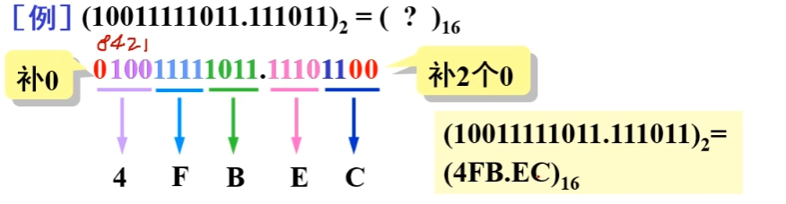


## 1.3 码制

`编码`即用数字的特定组合表达特定信息. 比如unicode编码.
  ### 1.3.1 常用二进制到十进制编码(BCD)


  ### 1.3.2 可靠性编码
即缀在某个编码后面用来确保编码传输后顺序仍然正确.
   #### 格雷码
   <a name="grey_code"></a>

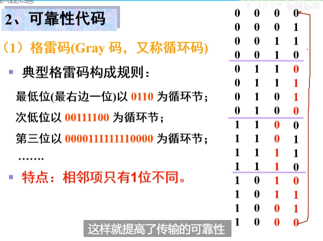
格雷码转换规则:
保留二进制数的最高位，作为格雷码的最高位。
接下来的每一位，都等于它与前一位二进制数的异或（XOR）结果。
步骤示例:假设我们要将 `01010 `转换为格雷码：

转换步骤：

* 保留最高位 0。
* 第二位：0 XOR 1 = 1
* 第三位：1 XOR 0 = 1
* 第四位：0 XOR 1 = 1
* 第五位：1 XOR 0 = 1
得到的格雷码：`01111`

另一个直观的转换方法就是:

比如考虑四位二进制码的转换, 参考上图, 比如`1000`转换为格雷码即为`1100`.


   #### 奇偶校验码


   ### 1.3.3 补码

verilog实现:

***
***

Assume that you have two 8-bit 2's complement numbers, a[7:0] and b[7:0]. These numbers are added to produce s[7:0]. Also compute whether a (signed) overflow has occurred.

Module Declaration
module top_module (
    input [7:0] a,
    input [7:0] b,
    output [7:0] s,
    output overflow
); 
Hint...
A signed overflow occurs when adding two positive numbers produces a negative result, or adding two negative numbers produces a positive result. There are several methods to detect overflow: It could be computed by comparing the signs of the input and output numbers, or derived from the carry-out of bit n and n-1.
Write your solution here


```verilog
module top_module (
    input [7:0] a,
    input [7:0] b,
    output [7:0] s,
    output overflow
); //
 
    // assign s = ...
    // assign overflow = ...
    
    assign s=a+b;//补码可以直接+计算.
    assign overflow=(a[7]==b[7]&&s[7]!=a[7]);//只有最高位相同,且相加结果最高位变化才是溢出.
endmodule
```


## 1.4 逻辑运算
与或非,自行复习


* 芯片选取:
  * a
  * a
  * a
  * a
  * 与非门:74LS00

## 1.5 逻辑代数(布尔代数)

  ### 1.5.1定义

布尔代数是一个具有两个元素 `{0, 1}` 的`半环`，定义
* `加法+` , `or` , $\lor$ , `|`(逻辑或) , `||`(按位或)):
  * 0+0 = 0
  * 0+1 = 1+0 =1
  * 1+1 = 1
* 乘法`*` , 与`and`运算 , $\land$ , `&`(逻辑与) , `&&`按位与:
  * 0*0 = 0
  * 0\*1 = 1\*0 = 0
  * 1*1 = 1
  * 这里的`*`对应verilog中的`&`, 而不是数学上的`×`(对应verilog中的`*`). 在verilog中, 对1bite的变量, `a*b`和`a&b`应该是一个意思.

事实上,`乘法`可以利用`加法`定义出来,两个运算的关系是:
$$
x + y = x * y + 1\\
或者说\\
x * y = x + y + 1
$$

布尔代数的运算满足`加法`和`乘法`的`分配律`、`结合律`和`交换律`，同时存在`加法的单位元0`和`乘法的单位元1`， **但是注意不存在加法逆元和乘法逆元，无法定义减法和除法。**

在这个域的基础上定义了一个运算为`取反` $\urcorner$ , $\urcorner1 := \overline{1} := 0$ , $\urcorner0 := \overline{0} := 1$ ;

#### 1.5.1. 异或XOR

定义运算`异或`$\oplus$

$$A\oplus B := \overline{A}B+A\overline{B}$$

异或符合`交换律`,`结合律`.(证略)

有:
* **和与的分配律**: $A*(B\oplus C)=(AB)\oplus(BC)$
* **和常量有关的运算**:
   $\\ 
   A\oplus1=\overline{A}\\ A\oplus0=A\\  
   A\oplus A=0\\
   A\oplus\overline{A}=0\\
   真值表易证.$
* **因果互换律**:
   $\\若A\oplus B=C, 则有\\
   A\oplus C=B\\
   B\oplus C=A$

   即它们仨任意两个都满足亦或关系.

* **连续异或为奇校验**
A^B^C^...的结果为: 如果有奇数个1, 结果为1, 否则为0.

#### 1.5.1. 同或(异或非)XNOR

定义运算`同或`$\odot$

$A\odot B\\ 
:= \overline{\overline{A}B+A\overline{B}}\\
:=\overline{A}\,\overline{B}+AB(见习题1.5.2.5)\\
$
=~((a&b)|((~a)&(~b)))`代码表示`


同或符合`交换律`.`结合律`. (证略)
显然`异或`和`同或`的关系为互为取反.

---
---
---
---

在此基础上可以推导出一些常用的结果.
* **同一律**
  
$$
x + x = x
\\
x*x = x
$$

* **互补律**

$$
x + \neg x = 1
\\
x * \neg x = 0
$$

* **德摩根律**
$$
\overline{x*y}=\overline{x}+\overline{y}
\\
\overline{x+y}=\overline{x}*\overline{y}
$$
可用真值表证明.


* **吸收律**

$$
1+x=1
$$
易证, 在与运算中只要有一个1, 结果就一定为1.


  ### 1.5.2 逻辑代数例题和常见定理

#### 1.5.2.1 证明$\quad (x+y)(x+z) = x + yz.$

证明:
$$

\text{LHS} = x^2 + xy + xz + yz \\
= x + xy + xz + yz \\
= x(1+y+z) + yz \\
= \text{(吸收律)} \quad x + yz
$$

#### 1.5.2.2 证明冗余律: $xy + \neg xz + yz = xy + \neg xz$ 

证明:
$$
LHS=xy+\neg xz+yz(x+\neg x) \qquad 同一律\\
=xy+\neg xz+xyz+\neg xyz\\
=xy(1+z)+\neg xz(1+y)\\
=xy+\neg xz \qquad 吸收律\\
$$

*欲使用冗余律化简, 检查成对的x和¬x.*

#### 1.5.2.3 证明冗余律推广:$xy + \neg xz + yzm = xy + \neg xz$

证明:
$$
LHS=(xy+\neg xz)+yzm\\
= (xy+ \neg xz+yz)+yzm \qquad 冗余律\\
= xy+\neg xz+yz(1+m)\\
= xy+\neg xz+yz \qquad 吸收律\\
= xy+\neg xz \qquad 冗余律\\
$$

#### 1.5.2.4 证明吸收律2: $x+\neg xy=x+y$

证明:
$$
LHS=(x)+\neg xy\\
=(x+xy+x\neg x)+\neg xy \  逆吸收律\\
=x^2+xy+x\neg x+\neg xy\\
=(x+y)(x+\neg x)\\
=x+y
$$

#### 1.5.2.5 证明同或拆解式: 
$\overline{A\overline{B}+\overline{A}B}=\overline{A} \,\overline{B}+AB$

事实上 $\overline{A\overline{B}+\overline{A}B}$即为 **同或** $\odot$,

=$A\odot B$

或者说是**亦或(⊕)非**

=$\overline{A\oplus B}$


*证明*:
$$
LHS=\overline{A\overline{B}}*\overline{\overline{A}B} \qquad 德摩根律\\
=(\overline{A}+\overline{\overline{B}})
*
(\overline{\overline{A}}+\overline{B})  \qquad 德摩根律\\
=(\overline{A}+B)(A+\overline{B})\\
=A\overline{A}
+\overline{A} \,\overline{B}
+BA
+B\overline{B}\\
=\overline{A} \,\overline{B}+AB \quad 互补律:A\bar{A}=B\bar{B}=0
$$


  ### 1.5.3 反演规则和对偶规则


显然反演规则其实就是摩根律.

#### 1.5.3.2对偶规则

对于任何一个逻辑表达式F，如果将式中所有的“·”换成“+”，“+”换成“·”，“0”换成“1”，“1”换成“0”，有**F=F'**，表达式F'称为F的**对偶式**。

(上述操作就是反演操作除去"原变量变为反变量"这一步.)

对偶式有啥用呢? **对一个等式, 全部替换为对偶式, 等式仍成立**.


* 对偶规则的证明：
  
...


## 1.6逻辑函数的表示方法和转换

  ### 1.6.1 先看一个例子

栗子:


  ### 1.6.2 逻辑函数的表示

   #### 1.6.2.1 逻辑表达式


显然,他们可以通过摩根定律相互转换.


* 与-或表达式最常见, 如常用的**标准与或表达式**.
* 与非-或非表达式也很常见, 因为这样写可以节省芯片门数量.

##### 最小项和最小项(正交)表达式(标准与或表达式)


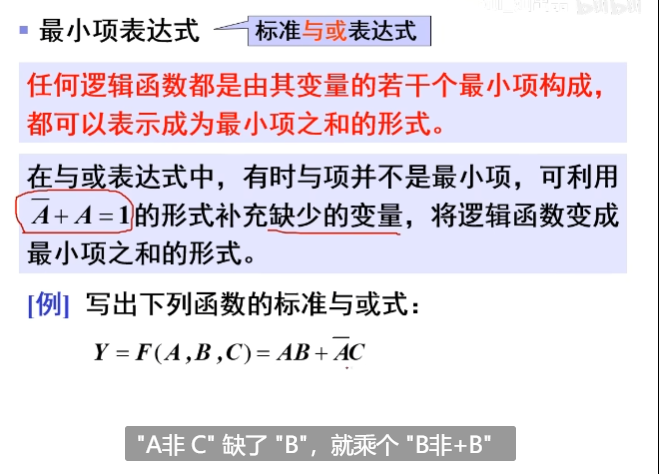
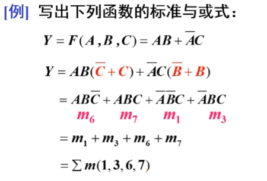


* 真值表到逻辑式的转换: 利用**最小项表达式**:


   #### 1.6.2.2 逻辑图


   #### 1.6.2.3 波形图


  ### 1.6.3 逻辑函数的化简

   #### 1.6.3.1 化简概述


不同形式的逻辑式有不同的最简式.一般先求**最简与或式**, 然后变换得到所需的最简式.

* **最简与或式** 要求:
  * **乘积项个数**最少,使与门个数最少.
  * **乘积项变量**最少,使与门输入端最少.

* **最简与非-与非式** 要求:
  *  **非号个数**最少, 使与非门个数最少.
  *  **每个非号中变量**最少, 使与门最少.


   #### 1.6.3.2 公式化简法
就是直接在逻辑表达式上进行化简. 缺点是直观性差, 不能保证看出来是最简的.

> 能合并(加法分配律)的合并, 
> 能使用吸收律($1+x=x, x+\neg xy=x+y$)/冗余律($xy + \neg xz + yzm = xy + \neg xz$)就用. 
> 可尝试使用: $*(x+\neg x)$, 使用德摩根率拆解或合并,;
> 不能合或者拆, 就使用冗余律多出来一个冗余项试一试 .
> 


 
 
   #### 1.6.3.3 卡诺图


**用卡诺图化简得到的结果一定是最简的.**

   ##### 1.空白卡诺图的画法
空白卡诺图就是一个表格, 每个格子对应一个最小项, 且相邻格子要求只有一个变量互为反变量.

* 相邻最小项


* 卡诺图组成


* 有些书本纵向画三变量卡诺图.
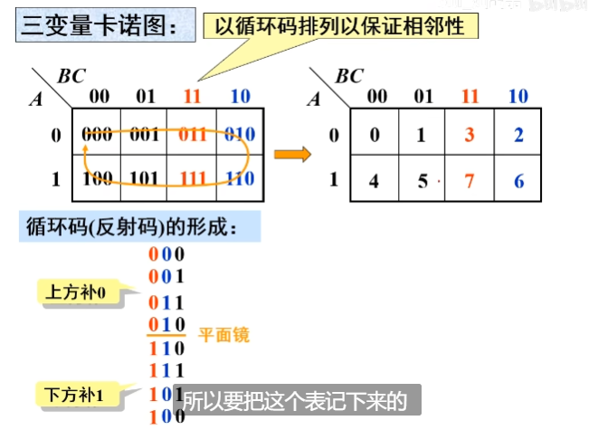


---
---
**一个空白卡诺图卡诺图的目的就是在表中填入n变量的$2^n$个最小项, 使*相邻项*满足*相邻性*(只有一个变量互为反变量,其他相同)**

---
---


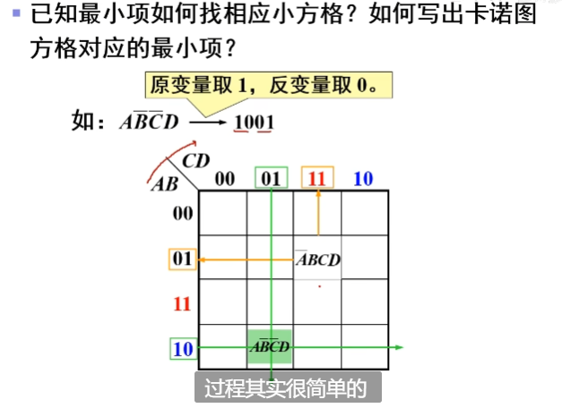


   ##### 2.把一个具体的逻辑函数填入到卡诺图中


* 这里找交集实际上就和你×个$(C+\overline{C})(D+\overline{D})$化成标准最小式是一样的.


👆这里$\bar{B}CD$项对应两格已经重复了, 可以被忽视. 这也意味着原函数式完全可以删去$\bar{B}CD$项, 结果一样.


   ##### 3. 用填好的卡诺图化简逻辑函数 

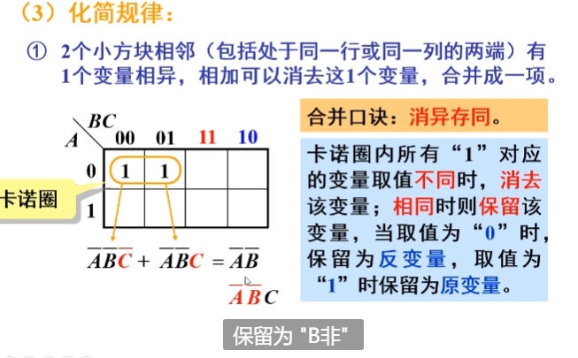

* 化简两个1


* 化简四个1


* 化简八个1


* 实例:


变量和反变量的卡诺图，`0`和`1`互换. 所以,如果卡诺图中全是1, 0很少, 可以先求出来反变量, 把0画出卡诺圈.


  ##### 4.卡诺图的verilog例题

   ###### 例一 三变量卡诺图
Implement the circuit described by the Karnaugh map below.
实现下面卡诺图描述的电路。


Try to simplify the k-map before coding it. Try both product-of-sums and sum-of-products forms. We can't check whether you have the optimal simplification of the k-map. But we can check if your reduction is equivalent, and we can check whether you can translate a k-map into a circuit.
在编码之前尝试简化 k-map。尝试求和乘积和乘积求和形式。我们无法检查您是否拥有 k-map 的最佳简化。但我们可以检查您的简化是否等效，并且我们可以检查您是否可以将 k-map 转换为电路。
```verilog
//可以得到该卡诺图为Y=a+~ab+~a~bc.
module top_module(
    input a,
    input b,
    input c,
    output out  ); 
    assign out = a | (~a)&b | (~a)&(~b)&c;
endmodule
```

   ###### 例二 4变量卡诺图
Implement the circuit described by the Karnaugh map below.
实现下面卡诺图描述的电路。


```verilog
//可以得到该卡诺图为Y = ~b&~c | ~a&b&~c&~d |~a&b&c&d | a&c&d | ~a&c&~d
module top_module(
    input a,
    input b,
    input c,
    output out  ); 
    assign out = ~b&~c | ~a&b&~c&~d |~a&b&c&d | a&c&d | ~a&c&~d;
endmodule
```

  ### 1.6.4 有约束逻辑变量


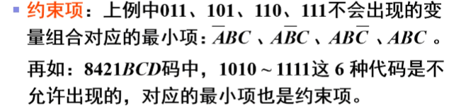

 
* 有约束逻辑变量的化简


# 2.门电路

## 2.0 概述, 以及模电复习


---
---
---
---

* 补充思路1: **BJT导通的条件判断**:
  * 1.最基础的: 发射结正偏集电结反偏.
    * BJT的工作状态:  (导通)
      * 放大: 发射结导通, 集电结截止
      * 饱和: 发射结和集电结都导通.
      * 截止: 发射结和集电结都截止.
      * 倒置: 发射结截止, 集电结导通.

  * 2.看ib. (即从输出特性ic-uce曲线出发) 如果ib足够大, 那麽此时管子一定导通了.
      

* 补充思路2: **判断二极管导通顺序**
最简单的, 初始时管压降大的先导通.
如果某条支路串了两个二极管, 那麽它们初始时假设**平均分压**.


* 补充思路3: **uce或者说ubc的大小是多少?**

BJT的集电结电压大小取决于工作状态. 因为导通情况下, uce是一个变量. 但是在饱和区, uce有一个所谓的典型值uces, 它约等于**0.1v--0.3v**.

这在输出特性曲线上很容易理解:


* 补充思路4: **用数电思维来看三极管**
即, 数电中的BJT一般所谓`导通`就是`深度饱和`, 或者`断开`就是`截止`. 

前者可以看成ce极几乎拉平(uce≈0.1v), 后者可以看成bce三个端子都断开.


---
---
---
---


## 2.1 用晶体管实现基本逻辑门电路(与或非)

基本逻辑电路可以用二极管和三极管搭建.

只使用diode就可以搭建AND和OR.

NOT需要三极管(和VCC), 因为二极管和电阻本身没有放大功能, 电平只能被削减不能被回复.


这种简陋的实现只能做很小规模的组合逻辑. 因为信号会衰减, 而这种电路没有放大/恢复能力.

## 2.3 TTL集成门电路

即用晶体管搭建门电路. 已经过时. 现在都在用MOS.

`Transistor-Transistor-Logic`
输入端和输出端都用三极管的逻辑门电路.
即MOS管互补对称构成的逻辑门电路.
本章主要聚焦于`TTL与非门`及其变形(`TSL`).


  ### 2.3.1 TTL与非门

   #### 1.结构图：


TTL与非门的结构可以分为三部分来分析。
* **输入级**
* 
  

  

* **中间级**和**输出级**
* 


T2管起到**倒相**作用: 其C极和E极输出相反的信号.

   #### 2.工作原理
* 假设导通时,BJT有发射结管压降Ube=0.7V, Uce=0.3V, **深度饱和**时(基极电流ib有够大, 已经比集电极电流ic大好多)Uces不再是0.3V, 而是uces=0.1V. 同时忽略D1, D2(他们只是保护作用)

分析:

##### Ⅰ当输入端AB其中至少一个为低电平0.3v(这一共包含三种情况)时:


我们假设T1(任何一个)导通, 
AB端电平更低的那个发射结优先导通,
ube=0.7v, **钳位效应得到T1管ub≡0.3v+0.7v=1v.** 也就是说这三种情况是相同的. 

例如, 如果ua=0.3v, ub=3.6v, A端发射结导通后钳位效应使得b端发射结截止, 但没关系, 有一个导通, 即可视为导通了.

继续分析. 可得R1两端压降4V, 产生T1管的ib=1mA, 这是很大的电流, T1管此时深度饱和导通, uces=0.1v, 从而得到T2管的ub2=0.4v.

由于T2管子此时即使没有其他电流分压, ube也只=ub2=0.4v < 0.7v, 所以T2管此时无法导通. 或者说, T2发射结想导通, 回路路线:
   * 要么经过R3到GND(这条路需要T2的ub至少(R3不分压)为0.7v). 
   * 要么经过T4发射结到GND(这条路需要T2的ub至少为0.7+0.7v)
所以现在T2的ub只有0.4v, 无法导通.


由于T4是T2发射极控制的(因为T4的导通条件是, 要求ube>0.7v, 而T4的ube即为T2的ue), 现在**T2截止, 即bce三端都断开了**, ue低电压, 所以T4也截止了.


再往右看. 该电路中**R2被设计得非常小, 分压可以忽略.** 从而T3的ub ≈ VCC = 5V.

此时T3显然满足
  * 发射结正偏(可以假设输出端接个负载接地, 还没通电流时无压降, T4的ue=0), 
  * 集电结反偏(ubc≈0-)
所以T3导通.

于是得到输出端电压为UY≈5v-0.7v(T3发射结)-0.7v(二极管压降)=3.6v , 即输出高电平1.

##### Ⅱ 当输入端AB均为3. :

此时AB端可以看成一个端子, 然后简化为一个3.6v源.

和Ⅰ不同的是, 此时T1发射结初始时两端电压为5v-3.6v=1.4v, 不再是优先导通的了:
(实际上我们忽略了Ⅰ中判断T步骤)

先分析初始时导通顺序.考虑两条支路:
  * VCC-R1-AB
    * T1两端压降为1.4v.
  * VCC-R1-T2发射结-R3=GND
    * T2两端压降为5v.<br>
  

于是**T2发射结先导通**, 并**钳位**ube=0.7v, 

此瞬时, T3发射结两端电压为5-0.7=4.3v, 仍然大于T1管子, 所以**按顺序第二个导通的是T3**.  

T3也导通后, 钳位ube=0.7v, 于是T2,T3一起导通, 并且**把ub2电压钳位为0.7+0.7=1.4v**


接下来, T1管子的发射结和集电结争夺顺序, 集电结两端电压更大(5v-1.4v)>1.4v, 于是接下来T1集电结导通, 并**钳位ucb=0.7v**.

此时查看`GND-T3发射结-T2发射结-T1集电结`这条支路, 可知它们三个二极管导通并将ub1钳位为0.7*3=2.1v.

于是T1发射结现在只有ube=2.1-3.4=-1.3v, 无法导通了--**T1发射结反偏, 集电极正偏, 进入了倒置放大状态.**.

事实电路设计上, 此时查看`GND-T3发射结-T2发射结-T1集电结`这条支路, VCC给T2和T3足够的电压, 两个管子均进入**深度饱和**.

最后查看T3管发射结和集电结, 可发现都截止, 

* T3管最后分析, 因为**它必须需经T4才能接地形成回路**, 需要先分析T4才能分析T3.

由于T4饱和, 立即得到uce大概为0.3v, 即**输出低电平.**


此时T4的集电极电流只能由外电路提供, 故称为**灌电流(拉电流)**.

  #### *2.3.1.4 TTL与非门的电气特性

中间是等效电路, 其中BE2, BE4即为T2, T4管的发射结等效二极管.

  ### 2.3.3 OC门(open collector)  集电极开路(与非)门
  一句话: OC门是一种可以实现**线与**的与非门.


   #### 2.3.3.1 OC门电路结构
---
---
**引子:   _线与_**

指TTL器件的输出直接相连, 实现`与`逻辑.
普通TTL器件不能直接实现`线与`, 因为:

---
---

**例如TTL与非门:**

输出方式为`推挽输出`

T1和T2交替工作. 

如果直接把两个ttl与非门的输入连接:

* 若`G1`输出高电平, `G2`输出低电平:
  * 必然`T1`导通, 把G1输出推到VCC那边的高电压.
  * 必然`T4`导通, 把G2输出拉到GND这边的低电压.
  * 连接后, 将会产生一个从Y1到Y2的电流:
  * 
  * 由于`T`, `T2`处于深度饱和状态, 产生的电流很大, 可能把这两个器件烧坏.

* 若`G2`输出高电平, `G1`输出低电平, 也会产生大电流.
---
---
---
---

为了解决这个问题,  我们尝试把`推挽输出结构`上面那个管子摘掉,  即得到`集电极开路结构`:


此时, 如果T2管子导通, 则把输出拉到低电平; 如果T2截止, 导致输出**悬空**, 即`高阻态`.

那麽, 失去了上拉电平的`T1`, 如何能在`T2`截止时得到高电平输出呢?

可以再接一个外电源VCC, 通过上拉电阻实现:


  
这样, `T2`导通时, 得到低电平输出; `T2截止时,`  得到高电平输出.


删去一个管子的ttl与非门, 即为OC门:


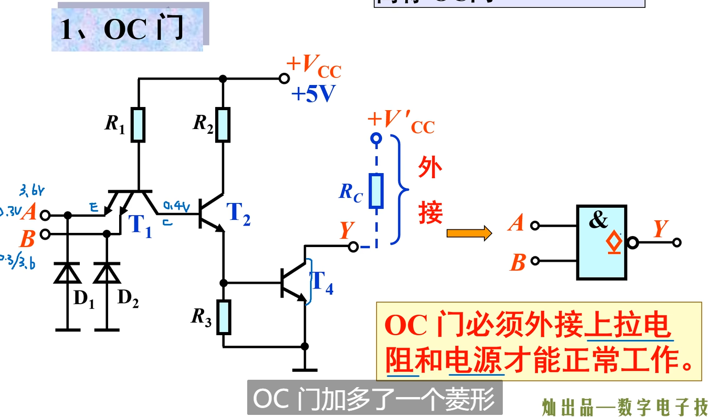

它的分析和ttl思想一样, 略.

* 注意: OC门符号是不包括外电源的...

我们现在得到了新的与非门--`OC`门. 它可以实现`线与`功能了:


分析: 例如`G1`输出`1`(T14管截止断开), `G2`输出`0`(T24管导通)时,

V'CC延RC-T24-GND形成回路(有了RC, 电流不会过大), 得到高电平Y=1.


* OC门逻辑表达式:

  


   #### OC门的应用

* 首先可以用来实现`线与`.
* **驱动发光二极管**:
  * OC门有一个输出端外接电源, 用**灌电流**(sink current, 很大)输出.
    * 
  * 而普通TTL与非门只有自身一个外接电源, 用拉电流(source current, 很小)输出.
    * 
  * OC门这个优点使它的输出电流足以驱动发光二极管, 实现指示灯效果:
    * 输出低电平时产生回路V'CC-LED-T2, 指示灯亮.
    * 输出高电平时为断路, LED无电流, 高电平即为V'CC的电压.

* **实现电平转换**:
原理同上, 使用高电压的V'CC, 利用OC门强力的灌电流来驱动其他门电路. 

如果是普通TTL与非门, 输出最高也无法超过VCC=5V.


  ### 2.3.2 TSL  门(three-state logic) TTL三态门

   #### 2.3.2.1 TSL电路分析
   * 事实上很多种门都有其三态形式, 大多是在原电路上添加一部分.
   * 三态门有两种:`使能端低电平有效`和`使能端高电平有效`, 我们取低电平有效就是底下有一个非门, 高电平有效的情况就是有俩非门(等效于没有非门).
   * EN信号即为使能(enable)信号. $\overline{EN}$即表示需要输入0才能使EN=1, 即低电平有效.  使能信号的作用是, 当其为`0`时, 使输出为第三态:`高阻态`.
   * `∇`表示`三态`, 和普通的与非门区别.
   * 可以看出, TSL门在TTL与非门的基础上添加了一个使能信号电路(红色部分).
  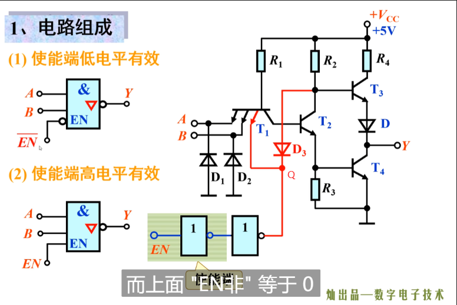


##### Ⅰ使能信号为0(低电平)
<br><br>


当使能信号为0(Q点为0.3v低电平)时, 无论AB输入, 都使T1**深度饱和导通**.
**(事实上, T1管子本身就是一个`与`逻辑.)**

T1的导通, 把T2基极拉到低电平(≈直接连接EN), 于是**T2截止**.

再看下方的使能信号电路:

T5因为经过电阻连着VCC, 故**T5导通**.

(*数电默认发射结导通就是导通, 而且没有其他例外的话就是饱和导通 (集电结也导通) , ce可以看为近乎短路*)

T5的导通, 使C极也被拉到低电平(uce≈0), 于是**T6截止**.

T7同T4, 因为经过电阻连着VCC, 故**T7导通**.

T7的导通. 拉低了T3基极电压, 导致**T3断开**.

再看最后剩下的T4. 因为T2, T3都断开, T4已经悬空(即三端都断开), **T4断开**.

现在因为T3,T4断开, **输出端是悬空的**. 这种状态称为**高阻态**, 既为`Y=Z`. 即可以认为输出端和地之间有极大的电阻, 直接测量输出端的电压得到`0`.
<br><br>

##### Ⅱ 使能信号为1(高电平)

此时(我不知道为什麽,可能是器件参数人为匹配好了吧) **T5处于倒置**, 从而集电结导通.

同时(器件参数人为匹配好保证), T6基极此时电压还足够0.7v, **T6导通**.

T6的导通把T7基极拉到低电位, 从而**T7截止**.

于是此时下方的使能电路不会影响上方了, **电路退化为TTL与非门**.
<br><br>


   #### 2.3.2.2 TSL门的应用 

<br><br>

##### 1.多路开关


* 此处与非门的符号不是`&`而是`1`, 意思是只使用与门的一个输入.
* 使能信号`EN`一个接`G1`, 一个取反后接`G2`, 作用就是保证两个与非门只有一个在工作, 另一个在`高阻态`, 即断开.
* 于是, 控制`EN`, 就可以得到$\overline{A_1}$或$\overline{A_2}$输出, 实现一个两路开关效果.
* 例如输出$\overline{A_1}$的情况:
  


<br><br>

##### 2.信号双向传输


即, 两个TSL与非门,
  * 使用一个使能信号控制(红色电路).
  * G1输入接A1, 输出接A2.
  * G2输入接A2, 输出接A1.

控制`EN`, 使G1工作, G2高阻态(输出断开了, 从而输入也没用) 则有等效电路图:
  * 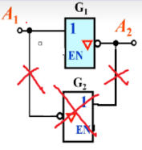
  * 退化一个简单的非门, 也就是A1向A2传输信号.
  
反之亦然, 从而实现双向传输信号电路功能.

* 注意: **data bus在任何时刻, 只允许一个三态门工作, 其他为高阻态(输出断开).**

<br><br>

##### 3. 构成数据总线(DB, data bus)

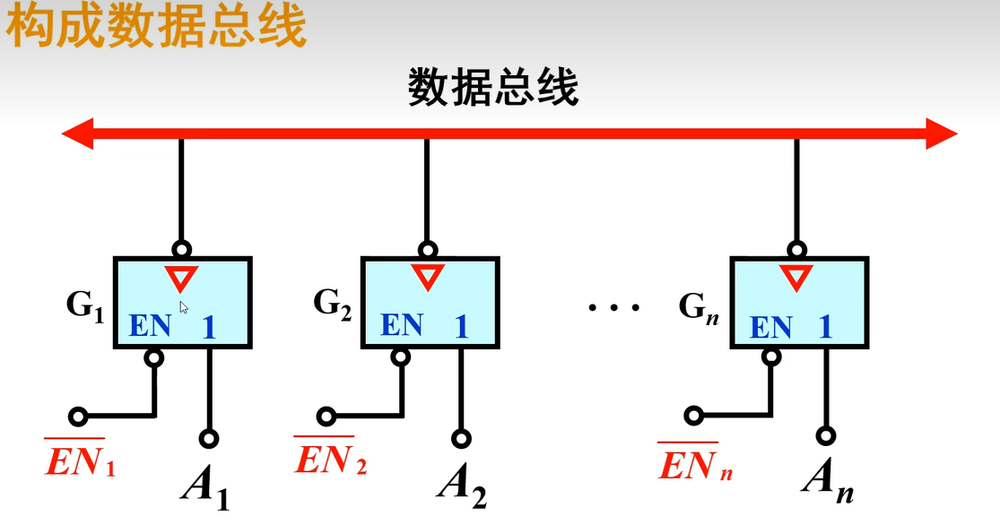

其实就是个多路开关而已. n个`EN`控制这些门的开关.

<br><br>
   
   #### 2.3.2.3 TTL集成芯片


  ### 2.3.4 TTL芯片

   #### 2.3.4.1 TTL芯片分类
* 国内TTL集成芯片有两个系列, `74`(民用)和`54`(军用). 这里我们主要讨论`74`系列.


* `74`系列TTL芯片分类:
    
   * 其中`H`即`highspeed`, `S`即`Schottky`, `A`即`advanced`, `L`即`low`.
   * 复习: 肖特基二极管是一个金属-半导体异质结. 导通压降比硅二极管低(约为0.4v), 响应迅速, 且没有电容效应.

  
  `CT`意为国家标准TTL.
  最后两位数字表示具体型号, 如`CT74ALS00`即为`国家标准-74系列-TTL-先进-低功耗-肖特基-与非门`.
    * `00`表示`与非门`
    * `04`表示`非门`
    * `08`表示`与门`
    * `32`表示`或门`
    * `86`表示`异或门`


   #### 2.3.4.2 TTL芯片使用注意事项:
  * `双列直插`芯片: 即两排对称的需要过孔的引脚, 需要在另一侧焊接. 实验室那些便宜的塑料芯片.
  * `表贴式`芯片: 四方形, 一半多管脚, 在单面即可焊接, 如电脑的CPU.
  * 输出端连接:
    * 普通TTL输出端**不能直接并联**(线与), 需要用OC门, 不然一个0一个1信号产生大电流会烧坏管子!
    * TSL可以并联输出, 但是必须保证使用时同时只有一个工作, 其他均为`高阻态`.
    * 输出端**不能直接接`电源`/`GND`**, 不然会产生大电流烧坏芯片.
  * 与(非)门闲置输入端处理:
    * 接入`逻辑1`.
      * 例如(通过电阻)直接接入`VCC`
      * 
    * 可以`悬空`
      * 
    * 和有用端连在一起.
      * 
        * 用得少, 需要考虑电流分流后还能不能保证信号.
  * 或(非)门闲置输入端处理:
    * 接入`逻辑0`.
      * 例如(通过电阻)直接接入`GND`

  * 电源和焊接:
    * 

-------
-------
-------
-------

## 2.4 CMOS集成门电路

* `TTL门电路`相对`COMS集成门电路`的缺点, 其实就是`BJT`相比`MOSFET`的缺点.
  * 缺点: 功耗高, 器件电路复杂. 工作电压苛刻. 逻辑摆幅不够大. 抗干扰能力低. 扇出能力(驱动其他门电路能力)小.
  * 优点: 不易被击穿.


### 2.4.1 CMOS反相器

就是一个CMOS. 它本身就是一个非门.

### 2.4.2 MOS与非门


当然用MOS管也可以搭建可以实现**线与**的与非门, 即OD门(open drain) 漏极开路与非门.

  * 它实现和`OC门`相同的功能, 只是性能上有差异.

### 2.4.3 MOS与门


### 2.4.4 MOS 或门


### 2.4.5 非典型门电路: ASIC(Application Specific Integrated Circuit, 专用集成电路)设计

直接使用mos管可以搭建更加复杂的逻辑电路, 其电路比使用逻辑包装好的一个个"与/非/或...门"要更加高效.

例如**多输入与非门**(下图例子. 注意到ABC是平权的)

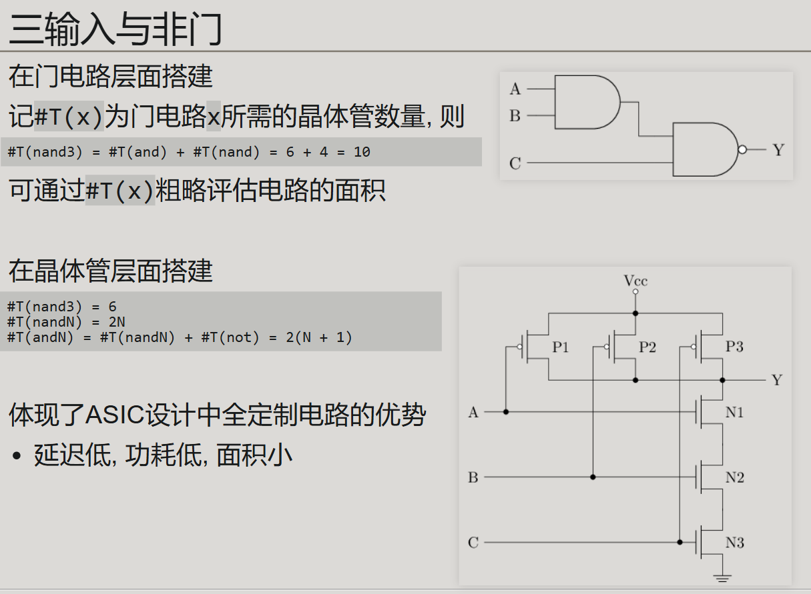

> P1 P2 P3持续拉高Y, 必须ABC都给出高信号才能抑制这三个拉高;
> N1 N2 N3拉低Y, 但是只有在ABC都给出高信号才拉低.
> 从而, ABC都给高信号->`Y=0`, 否则`Y=1`.
> N输入与非门原理同上.


异或门: A^B = A*~B + ~A*B

可以用与门, 非门, 或门搭建;

也可以用MOS单独搭建:


# 3.组合逻辑电路

## 3.0 概述

包含加法器, 编码器, 译码器, 分配器, 选择器

* 组合电路和时序电路的区别:
   
  即有没有 `触发器`. 组合电路没有`触发器`, 由门电路构成. 只有输入到输出的通路, 没有`反馈电路`.

   
## 3.1 组合逻辑电路的分析方式

  ### 例1 一致判断电路(n输入的 同或 )
  
  

  ### 例2 奇校验电路
  
  
  

  ### 例3 设计投票电路(2/3通过)
  
  
  

  ### 例4 设计码制变换电路
[跳转到格雷码介绍](#grey_code)

## 3.2 加法器

### 3.2.1半加器

就是一个`XOR`和一个`AND`.

接受两个`0`或`1`的输入`A`,`B`, 输出它们相加的本位和`S`和进位数`C`. 例如`1+1`得到本位上为`0`, 进位`1`.

显然有**逻辑表达式**:
$$
S=A\oplus B=A\overline{B}+B\overline{A}\\
C=AB
$$
**逻辑电路:**

这里的方框`=1`是同或门符号.
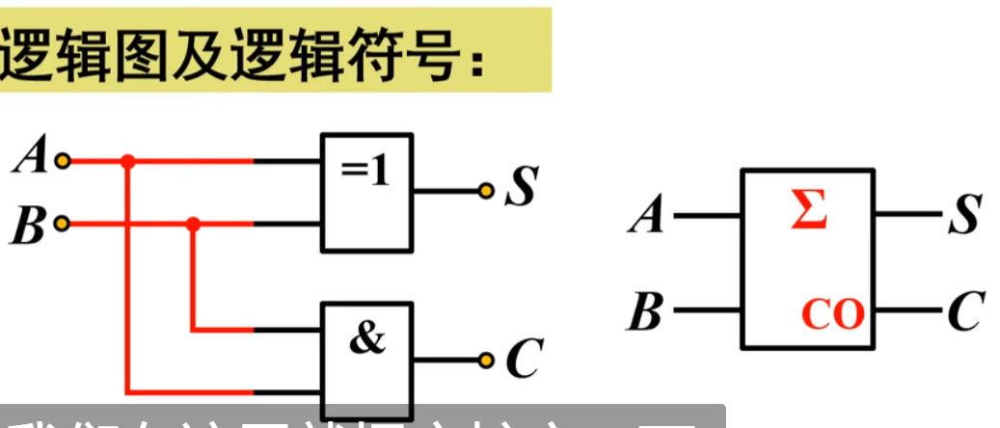

**真值表**:
| 输入1 | 输入2 | 输出1 | 输出2 |
|:----:|:----:|:----:|:----:|
| **A** | **B** | **S** | **C** |
| 0    | 0    | 0    | 0    |
| 0    | 1    | 1    | 0    |
| 1    | 0    | 1    | 0    |
| 1    | 1    | 0    | 1    |

### 3.2.2 一位全加器FA(full adder)


**1位全加器**:
输入为`A` ,`B` , `CI`(carry in) , 输出为`S`(sum), `CO`(carry out).

它由**两个半加器+一个OR**组成.

逻辑不难看出. 先用半加器1加起来A和B, 然后把sum和cin用半加器2再加一次. 两次加法的进位`carry1`, `carry2`进行OR来决定最终进位.


#### 3.2.2.1 1位全加器的verilator实现

You are given a module add16 that performs a 16-bit addition. Instantiate two of them to create a 32-bit adder. One add16 module computes the lower 16 bits of the addition result, while the second add16 module computes the upper 16 bits of the result, after receiving the carry-out from the first adder. Your 32-bit adder does not need to handle carry-in (assume 0) or carry-out (ignored), but the internal modules need to in order to function correctly. (In other words, the add16 module performs 16-bit a + b + cin, while your module performs 32-bit a + b).

Connect the modules together as shown in the diagram below. The provided module add16 has the following declaration:

module add16 ( input[15:0] a, input[15:0] b, input cin, output[15:0] sum, output cout );


```verilog
//该模块利用两个add16拼接了一个add32.
module top_module(
    input [31:0] a,
    input [31:0] b,
    output [31:0] sum
);

  wire add1_cout;
  wire [15:0] add1_sum;
  wire [15:0] add2_sum;
  add16 add1(
    .a(a[15:0]),
    .b(b[15:0]),
    .cin(1'b0),
        .cout(add1_cout),
    .sum(add1_sum)
  );
  
  add16 add2(
    .a(a[31:16]),
    .b(b[31:16]),
        .cin(add1_cout),
        .cout(),//ignore
    .sum(add2_sum)
  );
  assign sum = {add2_sum, add1_sum};
endmodule
```

#### 3.2.2.2 用多个1位加法器连接为n位加法器


显然, 使用`n`块`1bit全加器`即可搭建`n`位加法器.


##### 3.2.2.2.1 例题1

 先构造一个一位全加器, 然后用generate块实例化一百个并拼接为一个一百位全加器. 为了证明你真的实例化了一百个全加器, 要求输出每个全加器的cout.


```verilog
module top_module( 
    input [99:0] a, b,
    input cin,
    output [99:0] cout,
    output [99:0] sum 
);

    generate
        genvar i;
        for(i=0;i<100;i++)begin:adders
            if (i==0) begin
                adder my_first_adder(
                    .a(a[0]),
                    .b(b[0]),
                    .sum(sum[0]),
                    .cin(cin),
                    .cout(cout[0])
                );
            end else begin
                adder my_adder(
                    .a(a[i]),
                    .b(b[i]),
                    .sum(sum[i]),
                    .cin(cout[i-1]),
                    .cout(cout[i])
                );
            end
        end
    endgenerate
endmodule

module adder(
    input a,
    input b,
    input cin,
    output sum,
    output cout
);
    //偷懒的写法:assign {cout,sum} = a+b+cin;

    //正宗的全加器写法: (你是电路工程师不是程序员!不许用`+`了!)
    assign sum=a^b^cin; //异或逻辑. `a^b^cin`即按位异或, 意味着要求当且仅当有`奇数`个`1`异或时输出`1`.
    assgin cout=(a&b)|(cin&(a^b)); //要想有进位, 要麽a和b都为1(a&b), 要麽必须a,b其中一个为1且cin为1.    
endmodule
```

##### 3.2.2.2.2 例题二 bcd add 100
You are provided with a BCD one-digit adder named bcd_fadd that adds two BCD digits and carry-in, and produces a sum and carry-out.

module bcd_fadd (
    input [3:0] a,
    input [3:0] b,
    input     cin,
    output   cout,
    output [3:0] sum );
Instantiate 100 copies of bcd_fadd to create a 100-digit BCD ripple-carry adder. Your adder should add two 100-digit BCD numbers (packed into 400-bit vectors) and a carry-in to produce a 100-digit sum and carry out.

BCD编码列表:
十进制:   0    1    2    3    4   5    6    7    8    9
BCD:   0000 0001 0010 0011 0100 0101 0110 0111 1000 1001

```verilog
module top_module( 
    input [399:0] a, b,
    input cin,
    output cout,
    output [399:0] sum 
);
    
    wire [100:0] carry;//记录中间100个加法器的101个进位信息(第编号i个加法器给第i+i个的进位)

    assign carry[0]=cin;
    assign cout=carry[100];
    
    generate
        genvar i;
        for(i=0;i<100;i++)begin:adders
            bcdadd(
                .a(a[4*i+3:4*i]),
                .b(b[4*i+3:4*i]),
                .sum(sum[4*i+3:4*i]),
                .cout(carry[i+1]),
                .cin(carry[i])
            );
        end
    endgenerate
endmodule

module bcdadd(
    input [3:0]a,
    input [3:0]b,
    input cin,
    output cout,
    output [3:0]sum
);
    wire [4:0] temp_sum;	//储存带进位的加法
    assign temp_sum=a+b+cin;
    
    assign cout=(temp_sum>4'b1001)?1	//进位判断, 当大于10时进位.
        :0;
  
    assign sum=(cout)?(temp_sum-4'b1010)	//根据进位调整加法输出
        :temp_sum; 
endmodule
```


### 3.2.3 选择进位加法器(CSA)

之前的最简单的串联式全加器器被称为纹波式加法器(ripple carry adder).


纹波式加法器, 也就是一个一个的1bit全加器连起来. 缺点就是计算过程是串行的, 每个1bit全加器都要等上一个算完才能开始计算.


-   改进思路：**并行提前算好两种情况**。 以空间换时间. 
    -   假设第二段进位=0，算出一组结果。     
    -   假设第二段进位=1，算出另一组结果.    
-   等第一段真正算出进位后，用一个 **2选1多路选择器 (MUX)** 立即选择正确的结果。


#### 3.2.3.1 一个选择进位加法器例子

下面的例题利用现成的16bit纹波加法器, 制作一个32bit选择加法器. 

前16bit再用一个纹波加法器计算. 进位cout给到二选一MUX.

后16bit用两个纹波加法器分别考虑cin为0,1的情况计算, 其结果由MUX决定用哪一个.


```verilog
//该模块利用两个add16, 并且写了一个multiplexer来实现csel加法器.
module top_module(
    input [31:0] a,
    input [31:0] b,
    output [31:0] sum
);

	wire add1_cout;
	wire [15:0] add1_sum;
	wire [15:0] add2_sum_add1cout0;
	wire [15:0] add2_sum_add1cout1;
	add16 add1(
		.a(a[15:0]),
		.b(b[15:0]),
		.cin(1'b0),
        .cout(add1_cout),
		.sum(add1_sum)
	);
	
	add16 add2_assume_add1_cout_be_0(
		.a(a[31:16]),
		.b(b[31:16]),
		.cin(1'b0),
		.sum(add2_sum_add1cout0)
	);
	
	add16 add2_assume_add1_cout_1(
		.a(a[31:16]),
		.b(b[31:16]),
		.cin(1'b1),
		.sum(add2_sum_add1cout1)
	);
	
	assign sum = (add1_cout==1'b0) ? {add2_sum_add1cout0, add1_sum} :
    {add2_sum_add1cout1, add1_sum};
endmodule
```

### 3.2.3 利用全加器实现`二进制乘法`(二位为例)

  ...

### *3.2.4集成全加器芯片


## 3.3 译码器

该电路可以分辨n个输入信号的具体结果. 也就是把一个编码翻译出来(one-hot向量).

称为 **n-2^n dec** . 由下图可知, #T(n-2^n dec)=n#T(not) + 2^n#T(andn).

n个信号排列组合有2^n种可能, 所以需要2^n位的输出来表示.


## 3.4 编码器

即译码器的相反作用电路. 把输入的one-hot信号(即只有一路输入有效的多路信号)给输出为二进制编码.


* 可以看到译码器和编码器规模随n指数增长. 需要分层检索, 用一个超大译码器+编码器直接处理64位内存是不可能的事.(#T(8-2^64)=18亿亿)

* 事实上, 8位机器就可以使用一个单层译码器+编码器处理.(#T(8-2^8)=256, 这个数量级的门电路很容易做成芯片)


## 3.5 优先编码器

优先编码器允许输入的多路信号不是one-hot信号, **可以有多路高信号**.

优先编码器只选择高信号的最高位, 忽略之后的高信号.

其经常用在中断系统:
* 多个外设分别发出一路中断请求信号, 按照重要优先级组合成一个多路信号, 最高路为最紧急的外设.
* 优先编码器会选择最高优先级的中断信号, 将其对应二进制编号输出.


## 3.6 MUX 多路选择器

电路原理:

利用一个1-2 decoder可以实现一个2-1 MUX.


***

同样地, 利用一个2-4 decoder可以实现一个4-1 MUX.


***

利用一个log₂N-N decoder可以实现一个N-1 MUX.


***
***
***

若考虑N个信号是多通道(位宽M, 作为一个整体被选择/不被选择)的, 则

对于每个数据位宽M, 一共N个输入的N-1 MUX,

控制信号S位宽为log₂N, 使用一个log₂N-N decoder, 其输出引出M条线复用即可.


### 3.6.1 多路选择器的verilog实现

请创建一个256选1, 四位多路复用器(256-to-1 4bit mux).

该module涉及到一个细节问题: 向量指标必须是constant(过程常量). 这是因为切片索引存在非常量时, verilog无法确定步长是一个常量(即使这在我们看来很显然...)
下面的写法是非法的:
```verilog
module top_module( 
    input [1023:0] in,
    input [7:0] sel,
    output [3:0] out ); 
    
    always @(*)begin
    	out = in[sel*4+3 : sel*4]; // error: `sel` is not a constant
    end   
endmodule
```
有两种方法实现切片:
方法1: `[<start> +: <步长>]`
```verilog
module top_module( 
    input [1023:0] in,
    input [7:0] sel,
    output [3:0] out ); 
    
    always @(*)begin
    	out = in[sel*4 +: 4]; // +:[步长]是verilog提供的动态切片语法, 表示in[sel*4 +3 : sel*4]
    end   
endmodule
```
方法2: 分别一个个操作切片的每个值...
```verilog
module top_module( 
    input [1023:0] in,
    input [7:0] sel,
    output [3:0] out ); 
    
    always @(*)begin
    	out[0]=in[4*i+3];
        out[1]=in[4*i+2];
        out[2]=in[4*i+1];
        out[3]=in[4*i];
    end   
endmodule
```
  
## 3.7 比较器

下图是一个2输入, 4位宽的比较器.


显然, 对于2输入, M位宽的比较器, 需要M个`XOR`.

>2输入的比较器可以自行用思路`先两两比较, 再比较上一层`搭建.


# 4.时序逻辑电路

## 4.00 时序逻辑概述

和组合逻辑电路的区别就是有没有触发器, 和时间有关. 多出来的部件有 计数器, 寄存器.

时序, 即`CP`(cyclic prefix,循环前缀)


## 4.0 双稳态电路: 时序逻辑的核心!


-   “稳态” = 一旦电路进入这个状态，就会一直保持下去（除非外部信号强制改变）。
-   “双稳态” = 电路有 **两个可稳定存在的状态**。  
-   所以它就可以存储 **1 bit 信息**（一个状态代表0，另一个状态代表1）。

- 锁存器和触发器都是双稳态电路.
  -   **双稳态电路 → 锁存器 (Latch)**
  -   **双稳态电路 + 时钟 → 触发器 (Flip-Flop)**


先来看几个个双稳态电路例子:

### 4.0.1 交叉配对反向器/互锁反向器

最简单的一个双稳态电路, 只需要两个`NOT`首尾相连.

有两种稳态: 左边通路为1右边通路为0或者反过来. 存储了1bit.


你把它搭出来后可以认为它会随机选择一种状态(比如Q=1, $\bar{Q}$=0), 然后保持 这种状态.


画得更简单一点, 其实就是这样👇
左边为$\bar{Q}$, 右边为$Q$


### 4.0.2 SR锁存器

这是一个有输入的双稳态电路. 用两个交叉耦合的`NOR`构建.

用S和R输入信号来影响输出Q. 实际使用时, S和R平时都是0, 需要改变状态时输出一个方波即可! 

方波R就可以实现reset, 方波S就可以实现set.


## 4.1 触发器和锁存器 概述

它们都是由双稳态电路得来的.

  * 要求有两个稳定的状态(`0`,`1`), 来表示存储内容.
  * 能够`接收`,`保存`,`输出`信号. 

分类:
* 按照电路结构
  * 基本(即双稳态电路. 通常用两个交叉耦合的`NOR`或`NAND`门组成. 没有控制信号. 输入一来就立即影响状态.)
  * 同步(在双稳态电路上加了一个控制信号, 有效1时, 输出才影响电路状态. 即**锁存器**)
  * 边沿(在双稳态电路上加了一个控制信号, 电平变化时, 输出才影响电路状态. 即**触发器**)
* 按照逻辑功能
  * SR(set/reset)
  * JK(对SR的改进, 输入J=1, K=1时, 状态翻转)
  * D(data. 输入在CLK有效时直接传输到输出Q.)
  * T(toggle, 输入T=1时触发器反转. **D触发器+XOR就可以实现一个T触发器**.)

现态和次态:
* `现态`即触发器接收输入信号之前的01状态
* `次态`即触发器接收输入信号之后的01状态.


---
---
---


## 4.2 D latch D锁存器

### 4.2.0 从SR锁存器到D锁存器

我们前面熟悉了SR锁存器. 在其电路结构上添加两个`AND`和一个`not`, 就制成了D锁存器. 

* 两个与门保证了必须在使能信号`WE`置高时才能给SR锁存器输入(否则输入是S=0, R=0)
* 同时, 输入D和其反被分别给到两个与门, 从而硬件层面保证只能给SR锁存器(S=0, R=1)或(S=1, R=0)的情况, 不会出现都为1, 避免了SR锁存器的亚稳态.


D锁存器在使能信号`WE`(有些地方也称`Ena`)为1时将`Q`输出调整为当前输入`D`的值. 这就好像`Q` 是 `D` 直接通过一根导线或一个非反相缓冲器连接到一起，毫无延迟。
* D 锁存器在使能时像一根导线（或非反相缓冲器）.


*Note that this is a latch, so a Quartus warning about having inferred a latch is expected.*


***

*一种用四个与`NAND`搭建的更小的D锁存器*


***

* 锁存器是电平敏感的电路（而非边沿敏感）：
  * 电平敏感（level-sensitive）意味着锁存器根据控制信号（如 enable 或 clk）的电平状态工作，而不是对信号的边沿（如上升沿或下降沿）作出响应。
  * 当控制信号为某个激活状态（例如高电平），锁存器的输出会随输入实时更新。
  * 相反，边沿敏感（edge-sensitive）的电路（如触发器）只在控制信号发生边沿跳变时（如从 0→1 或 1→0）更新输出。


### 4.2.1 Verilog实现D锁存器

**Verilog实现**:

* 锁存器**仍然是时序逻辑元件**，因此应使用非阻塞赋值（<=）. 因为**它可以存储状态**,而不是简单地输出逻辑函数（组合逻辑）.
* 为了避免竞争条件（race condition）和确保数据更新的正确性，非阻塞赋值 (<=) 是推荐使用的赋值方式。
  * 非阻塞赋值会等到所有的逻辑运算都完成后，才在时钟周期结束时更新信号值。

```verilog
module top_module (
    input d, 
    input ena,
    output q);
    always @(*)begin
        if(ena)begin
            q<=d;
        end
    end
endmodule
```


## 4.5 D flipflop DFF D触发器

### 4.5.0 D触发器速览&概述

AD flip-flop is a circuit that stores a bit and is updated periodically, at the (usually) positive edge of a clock signal.

AD 触发器是一种存储位并在时钟信号（通常）正边沿定期更新的电路。


它是由D锁存器演变而来:

D锁存器无法实现同步电路特性. 我们希望一种上升沿触发并维持一个周期的器件.


***
***
**我们来尝试分析这个D触发器电路.**

sr0接收$clk$和sr1的输出$Q_1$;

sr1接收输入$\bar{D}$和$clk ~nand~ \bar{Q_1}$

clk为1时, $R_0=0$, sr0 等待 $S_0=Q_1$的信号; $S_1=Q_0$, 

此时看D. 
* D给出1, $R_1=0$, sr1等待S_1的信号. $S_1=R_1=0$, 从而Q_1=0=S_0

....
***
***
(👇回忆`NOR`搭建的SR锁存器电路结构:)


***
***

### 4.5.1 D触发器可以由两个**D锁存器**实现. 

verilog实现DFF:

```verilog
module d_filp_flop(
    input clk,      //时钟信号
    input reset     //复位信号
    input d         //数据输入
    output reg q    //输出q
);

    always @(posedge clk or posedge reset) begin
        if(reset)
            q<=0;   //异步
        else
            q<=d;
    end
```


### 4.5.2 **主从式D触发器**


当使用时钟always块时，D触发器由**逻辑合成器**创建（参见alwaysblock2 ）。 D触发器是“组合逻辑块后面跟着一个触发器”的最简单形式，其中组合逻辑部分只是一条电线。


创建单个 D 触发器。

```verilog
module top_module (
    input clk,
    input reset,            // Synchronous reset
    input [7:0] d,
    output reg [7:0] q
);
    always @(posedge clk or posedge reset)begin //此处为异步复位(reset高电平的同周期瞬间复位). 如果括号内去掉`or posedge reset`, 则为同步复位(synchronous reset)(reset高电平后, 在下个周期才复位.)
        if(reset)begin
            q <= 0;
        end else begin
          q <= d; 
        end
    end

endmodule
```

### 4.5.3 DFF with byte enable / DFFE / 带使能开关的D触发器


Create 16 D flip-flops. It's sometimes useful to only modify parts of a group of flip-flops. The byte-enable inputs control whether each byte of the 16 registers should be written to on that cycle. byteena[1] controls the upper byte d[15:8], while byteena[0] controls the lower byte d[7:0].
创建 16 个 D 触发器。有时只修改一组触发器的一部分是有用的。字节使能输入控制是否应在该周期写入 16 个寄存器的每个字节。 byteena[1] 控制高字节 d[15:8] ， 尽管 byteena[0] 控制低字节 d[7:0] 。

resetn is a synchronous, active-low reset.
resetn 是同步、低电平有效复位。

All DFFs should be triggered by the positive edge of clk.
所有 DFF 应由上升沿触发 clk 。
```verilog
module top_module (
    input clk,
    input resetn,
    input [1:0] byteena,
    input [15:0] d,
    output reg [15:0] q
);
    
    always @(posedge clk)begin
        if(!resetn)begin
          q<=0;
        end else begin
            for(int i=0;i<2;i++)begin
                q[8*i +: 8]<=(byteena[i]) ? d[8*i +: 8] : q[8*i +: 8];
            end
        end       
    end

endmodule
``` 

### 4.5.4 一道D触发器例题:

Given the **finite state machine** circuit as shown, assume that the D flip-flops are initially reset to zero before the machine begins.


Build this circuit.
   ```verilog
   module top_module (
    input clk,
    input x,
    output z
); 
    wire d1,d2,d3;
    reg q1,q2,q3;
    assign d1= x^q1;
    assign d2= x&~q2;
    assign d3= x|~q3;
    assign z= ~(q1|q2|q3);
    dff dff1(
        .clk(clk),
        .d(d1),
        .q(q1)
    );
        dff dff2(
        .clk(clk),
        .d(d2),
        .q(q2)
    );
        dff dff3(
        .clk(clk),
        .d(d3),
        .q(q3)
    );
endmodule

module dff(
  input clk,d,
    output q
);
    always @(posedge clk)begin
       q<=d; 
    end
endmodule
   ```

## 4.6 JK flip flop JK触发器

是改进的SR触发器, 当J=1,K=1时输出反转


```verilog
module top_module (
    input clk,
    input j,
    input k,
    output Q);
    
    always @(posedge clk or posedge reset)begin
        if(reset)begin
          q<=0;
        end else begin
            case({j,k})
                2'b00:Q<=Q;
                2'b01:Q<=0;
                2'b10:Q<=1;
                2'b11:Q<=~Q;	//j=1,k=1时复位, 这实际上就是一次同步复位. 直接输入的reset则提供异步复位功能.
            endcase
        end
    end
endmodule
```

## 4.7 双边D触发器
    
You're familiar with flip-flops that are triggered on the positive edge of the clock, or negative edge of the clock. A dual-edge triggered flip-flop is triggered on both edges of the clock. However, FPGAs don't have dual-edge triggered flip-flops, and always @(posedge clk or negedge clk) is not accepted as a legal sensitivity list. 会报错:
`Error (10239): Verilog HDL Always Construct error at top_module.v(6): event control cannot test for both positive and negative edges of variable "clk" File: /home/h/work/hdlbits.1233204/top_module.v Line: 6`
您熟悉在时钟的正边沿或负边沿触发的触发器。双边沿触发触发器在时钟的两个边沿上触发。然而，FPGA 没有双边沿触发触发器，并且 always @(posedge clk or negedge clk) 不被接受为合法的敏感列表。

Build a circuit that functionally behaves like a dual-edge triggered flip-flop:
构建一个在功能上类似于双边沿触发触发器的电路：    


(Note: It's not necessarily perfectly equivalent: The output of flip-flops have no glitches, but a larger combinational circuit that emulates this behaviour might. But we'll ignore this detail here.)
（注意：这不一定完全等效：触发器的输出没有毛刺，但模拟这种行为的更大组合电路可能会出现毛刺。但我们在这里忽略这个细节。）

```verilog
//直接@(posedge clk or negdege clk)是不被允许的:error:不允许同时使用上升沿和下降沿. 我也不知道为何.
//直接两个always块分别在posedge和negedge驱动q也是不允许的:error:多个源激励同一个信号.
module top_module (
    input clk,
    input d,
    output q
);
    reg q1, q2;

    //实现一个上沿触发器
    always @ (posedge clk)
        begin
            q1 <= d;
        end

    //实现一个下沿触发器
    always @ (negedge clk)
        begin
           q2 <= d; 
        end

    //让两个触发器组合逻辑得到q
    assign q = clk?q1:q2;
endmodule
```

另一个思路是直接always@(clk), 但是可能出现意想不到的问题, 待研究. 总之最好不要这样写, 时序逻辑的敏感信号必须加上posedge或者negedge不然可能会被综合为组合电路.

这样写问题很大. 在vivado里(默认的综合简化选项), 代码
```verilog
always@(clk)begin
    a<=b;
end
```
综合出的硬件就是
等价于代码`a=b;`  忽略了always和clk了.
有可能调整为更严格的综合简化设置后会解决, 总之暂时最好不要这样写.


* D锁存器
* JK触发器
* SR触发器(边缘捕获)
* 边缘检测
* 双边检测
* 

见`notes_git/Code_Language/verilog_note/verilog_exercise.md`

---
---
---

## 4.8 SR锁存器


### 4.8.1 verilog实现SR触发器

For each bit in a 32-bit vector, capture when the input signal changes from 1 in one clock cycle to 0 the next. "Capture" means that the output will remain 1 until the register is reset (synchronous reset).

Each output bit behaves like a SR flip-flop: The output bit should be set (to 1) the cycle after a 1 to 0 transition occurs. The output bit should be reset (to 0) at the positive clock edge when reset is high. If both of the above events occur at the same time, reset has precedence. In the last 4 cycles of the example waveform below, the 'reset' event occurs one cycle earlier than the 'set' event, so there is no conflict here.

In the example waveform below, reset, in[1] and out[1] are shown again separately for clarity.
其实每一位的逻辑就是一个set-reset触发器(真值表为:R为1则重置; 否则, S=1则输出1), 本题对应R即reset, S即(prev_in[i] & ~in[i]).
```verilog
module sr_ff(
    input clk,S,R,
    output reg Q
);
    always @(posedge clk) begin
        if(R)    //reset操作
            Q<=0;
        else if(S)//set操作
            Q<=1;
    end
endmodule
```

本题代码:
```verilog
module top_module (
   input clk,         // 时钟信号
    input reset,       // 同步复位信号
    input [31:0] in,   // 32 位输入信号
    output reg [31:0] out // 32 位输出信号
);

    reg [31:0] prev_in;  // 32 位寄存器，用来保存上一个时钟周期的输入信号

    always @(posedge clk) begin
        if (reset) begin
            // 同步复位，所有输出都被置为 0
            out <= 32'b0;
        end 
        else begin
            // 捕捉 1 到 0 的变化
            for(int i=0;i<32;i++)begin:whatever
                    if(prev_in[i] & ~in[i])begin
                        out[i] <= 1; // 捕捉 1 到 0 的变化，`prev_in & ~in` 检测变化
                    end
                end

            end
            // 更新 prev_in 为当前输入
            prev_in <= in;       
    end
endmodule
```
* 注意: 本题使用always内的for循环实现重复的代码. (这需要System_Verilog支持)注意generate块不能用在always块里哦. 而且如果你想用一个generate块生成32个always块,每个块里放一个赋值, 会报错(竞态条件), 我暂时不知道为何会这样. 还是最好把东西都写道一个always块里吧? 

### 4.8.2 一道SR试题
   
Consider the n-bit shift register circuit shown below:
考虑如下所示的n位移位寄存器电路：


Write a top-level Verilog module (named top_module) for the shift register, assuming that n = 4. Instantiate four copies of your MUXDFF subcircuit in your top-level module. Assume that you are going to implement the circuit on the DE2 board.
为移位寄存器编写一个顶层 Verilog 模块（名为 top_module），假设n = 4。在顶层模块中实例化 MUXDFF 子电路的四个副本。假设您要在 DE2 板上实现该电路。

Connect the R inputs to the SW switches,
将R输入连接到SW开关，
clk to KEY[0],
clk到KEY[0] ，
E to KEY[1],
E至KEY[1] ，
L to KEY[2], and
L到KEY[2] ，以及
w to KEY[3].
w到KEY[3] 。
Connect the outputs to the red lights LEDR[3:0].
将输出连接到红灯LEDR[3:0] 。   
先自己编写子模块: 带mux的dff,这很容易. 

```verilog
module top_module (
    //顶层模块只需要连线而已.
    input [3:0] SW,
    input [3:0] KEY,
    output [3:0] LEDR
); //

    reg [3:0]R;
    reg clk,E,L,w;
    reg [3:0]Q;
    assign R=SW;
    assign clk=KEY[0];
    assign E =KEY[1];
    assign L=KEY[2];
    assign w=KEY[3];
    assign LEDR=Q;
    MUXDFF muxdff4(clk,w,     R[3],E,L,Q[3]);
    MUXDFF muxdff3(clk,Q[3],  R[2],E,L,Q[2]);
    MUXDFF muxdff2(clk,Q[2],  R[1],E,L,Q[1]);
    MUXDFF muxdff1(clk,Q[1],  R[0],E,L,Q[0]);
endmodule

//子模块mux_dff
module MUXDFF (
    input clk,
    input w, R, E, L,
    output reg Q
);
    wire temp;
    wire d;
    //mux
    assign temp = (E)?w:Q;
    assign d = (L)?R:temp;

    //DFF
    always @(posedge clk)begin
       Q<=d; 
    end
endmodule
```

## 4.9 有限状态机 FSM finite state machine

### 4.9.1 摩尔状态机 moore fsm

This is a Moore state machine with two states, one input, and one output. Implement this state machine. Notice that the reset state is B. 异步复位.

这是一个具有两个状态、一个输入和一个输出的摩尔状态机。实现这个状态机。请注意，重置状态为 B。


***
***

**状态机** (Finite State Machine, FSM) 是一种数学模型，它表示系统可以处于的一组有限状态，以及状态之间的转换规则。

***
***

状态机通常由以下几个部分组成：

1.  **状态 (States)**：系统可以处于的不同状态。
2.  **输入 (Inputs)**：触发状态转换的外部信号。
3.  **输出 (Outputs)**：根据当前状态决定的输出值（在 Moore 状态机中，输出仅依赖当前状态）。
4.  **状态转换规则 (Transitions)**：根据输入信号从一个状态切换到另一个状态的规则。
5.  **复位状态 (Reset State)**：系统启动或复位时的初始状态。

题目中的状态机说明:

1.  **状态**：
    
    -   状态 `A`（输出 `out=0`）。
    -   状态 `B`（输出 `out=1`）。
2.  **输入**：
    
    -   一个输入信号（`1` 或 `0`）。
    -   一个异步复位信号 `areset`，用于强制将状态机复位到状态 `B`。
3.  **输出**：
    
    -   在状态 `A` 时，`out=0`。
    -   在状态 `B` 时，`out=1`。
4.  **状态转换**：
    
    -   当复位信号 `areset` 为 `1` 时，状态直接变为 `B`（异步复位）。
    -   在状态 `B`，如果输入信号为 `1`，保持在状态 `B`；如果输入信号为 `0`，切换到状态 `A`。
    -   在状态 `A`，如果输入信号为 `0`，保持在状态 `A`；如果输入信号为 `1`，切换到状态 `B`。


```verilog
//一个简单的FSM.
//有两个状态A和B，(状态)输入in，输出out。
//当输入为1时，状态保持不变，当输入为0时，状态在下个时钟周期切换。(状态转移规则)
//当state为A时，out为1，当state为B时，out为0。(状态输出规则)

  //a FSM is usually coded in 3 parts: 
  //1.state register 状态寄存器
  //2.state transform logic 状态转移逻辑(combinational logic)
  //3.state output logic 状态输出逻辑(sequence logic)

module top_module (
  input clk,
  input in,
  input areset,//asynchronous reset
  output reg out
);

  //1.state register. assign states.(give name and value)
    parameter A=666,B=233;//it doesnt matter what value we give to each state, as long as they are different.
  //but if assigning large values, the state register may need more bits.(此处因为用了666这样的搞怪数字，所以state和next_state需要很多位)
  reg [10:0]state,next_state;//`state` and `next_state` register. Used to store the current state and the next state.
  

  //2.state transform logic.
  //given the current `state` and the `input`, calculate the `next state`.
  always @(*)begin
    case(state)
      A: next_state = in ? A : B;
      B: next_state = in ? B : A;
    endcase
  end

  always @(posedge clk or posedge areset)begin
    if(areset)	state <= B;//reset to state B
    else state <= next_state;//otherwise, update the state.
  end


  //3.state output logic.	
  //A: out = 0; 
  //B: out = 1;
  always @(*)begin
    case(state)
      A: out = 1'b0;
      B: out = 1'b1;
    endcase
  end
endmodule
```

### 4.9.2 两输入摩尔状态机 moore FSM

输入信号为`j`,`k`.


 
```verilog
module top_module (
  input clk,
  input j,k,
  input areset,//asynchronous reset
  output reg out
);
  //1.state register. assign states.(give name and value)
    parameter OFF=0,ON=1;
  reg state,next_state;
  
  //2.state transform logic.
  always @(*)begin
    case(state)
            ON: next_state = (k==0) ? ON : OFF;
            OFF: next_state = (j==0) ? OFF : ON;
    endcase
  end

  always @(posedge clk or posedge areset)begin
        if(areset)	state <= OFF;//reset to state B
    else state <= next_state;//otherwise, update the state.
  end

  //3.state output logic.	
  //OFF: out = 0; 
  //ON: out = 1;
  always @(*)begin
    case(state)
      OFF: out = 1'b0;
      ON: out = 1'b1;
    endcase
  end
endmodule
```

   #### 3.2.4.4 one-hot fsm
其实就是每个状态编码只有一个位为 1，而其余的位为 0，这就是 "one-hot"（单热）的含义。用十进制来看就是状态编码只能是`2^n`.


## 4.10 shift register 移位寄存器

### 4.10.0 移位寄存器概述

### 4.10.1 4-bit shift register (right shift) 四位右移寄存器

构建一个 4 位移位寄存器（右移），具有异步复位、同步加载和使能功能。

areset：将移位寄存器重置为零。
load：将数据[3:0]加载到移位寄存器而不是移位。
ena：右移（q[3] 变为零，q[0] 移出并消失）。
q：移位寄存器的内容。
如果load和 ena 输入均已置位 (1)，则load具有更高的优先级。

* (n位)右移位寄存器的功能:
  * **异步复位（areset）**： 在areset为高电平时，无论时钟状态如何，都立即将移位寄存器q的内容重置为零。
  * **同步加载（load）**： 在load为高电平时，在时钟上升沿将data[n-1:0]加载到寄存器q，覆盖原有内容。
  * **使能（ena）**： 在ena为高电平时，在时钟上升沿将寄存器q的内容右移一位，q[n-1]变为零，q[0]移出寄存器消失。

```verilog
module SR(
    input clk, areset, load, ena,
    input [3:0] data,
    output reg [3:0] q
);
    always@(posedge clk or posedge areset)begin
        if(areset)      q<=4'b0;
        else if(load)   q<=data;    //load比ena优先级高
        else if(ena)    q<={1'b0, q[3:1]};  //右移操作
        else            q<=q;
    end
endmodule
```

事实上我们应当明白更底层的架构: SR其实是多个DFF串起来形成的! 


让我们从更清晰的DFF模块出发再写一个SR模块, 而不是都交给综合!

```verilog
//先写一个dff.
module dff(
    input clk, reset, d,
    output reg q);

    always@(posedge clk)begin
        if(reset) q<=0;
        else q<=d;
    end
endmodule

//然后通过例化4个dff来搭建SR.
module SR(
    input clk, reset, d
);

endmodule


```

### 4.10.2 移位寄存器实现LUT

In this question, you will design a circuit for an 8x1 memory, where writing to the memory is accomplished by shifting-in bits, and reading is "random access", as in a typical RAM. You will then use the circuit to realize a 3-input logic function.
在本题中，您将为 8x1 存储器设计一个电路，其中写入存储器是通过移入位来完成的，读取是“随机访问”，就像在典型的 RAM 中一样。然后，您将使用该电路来实现 3 输入逻辑功能。

First, create an 8-bit shift register with 8 D-type flip-flops. Label the flip-flop outputs from Q[0]...Q[7]. The shift register input should be called S, which feeds the input of Q[0] (MSB is shifted in first). The enable input controls whether to shift. Then, extend the circuit to have 3 additional inputs A,B,C and an output Z. The circuit's behaviour should be as follows: when ABC is 000, Z=Q[0], when ABC is 001, Z=Q[1], and so on. Your circuit should contain ONLY the 8-bit shift register, and multiplexers. (Aside: this circuit is called a 3-input look-up-table (LUT)).
首先，创建一个带有 8 个 D 型触发器的 8 位移位寄存器。标记 Q[0]...Q[7] 的触发器输出。移位寄存器输入应称为S ，它馈入 Q[0] 的输入（MSB 首先移入）。使能输入控制是否移位。然后，扩展电路以具有 3 个附加输入A 、 B 、 C和一个输出Z 。电路的行为应如下：当 ABC 为 000 时，Z=Q[0]，当 ABC 为 001 时，Z=Q[1]，依此类推。您的电路应仅包含 8 位移位寄存器和多路复用器。 （旁白：该电路称为 3 输入查找表 (LUT)）。


```verilog
module top_module (
    input clk,
    input enable,
    input S,
    input A, B, C,
    output reg Z ); 

    reg [7:0]q;
    
    assign Z = (A == 0 && B == 0 && C == 0) ? q[0] :
    (A == 0 && B == 0 && C == 1) ? q[1] :
    (A == 0 && B == 1 && C == 0) ? q[2] :
    (A == 0 && B == 1 && C == 1) ? q[3] :
    (A == 1 && B == 0 && C == 0) ? q[4] :
    (A == 1 && B == 0 && C == 1) ? q[5] :
    (A == 1 && B == 1 && C == 0) ? q[6] :
    q[7];
    always @(posedge clk) begin
        if(enable)begin
            q[7]<=q[6];
            q[6]<=q[5];
            q[5]<=q[4];
            q[4]<=q[3];
            q[3]<=q[2];
            q[2]<=q[1];
            q[1]<=q[0];
            q[0]<=S;
            /*
            case ({A,B,C})	//这样不对, 延后了. 题目的意思是Z即时读取Q的值
                3'b000: Z <= q[0];
                3'b001: Z <= q[1];
                3'b010: Z <= q[2];
                3'b011: Z <= q[3];
                3'b100: Z <= q[4];
                3'b101: Z <= q[5];
                3'b110: Z <= q[6];
                3'b111: Z <= q[7];
                default: Z <= 0;
            endcase
                */
        end
    end
endmodule

```

### 4.10.3 arithmetic_shift 算数移位寄存器

构建一个**算数**移位寄存器.
算数移位寄存器处理**有符号数(signed)**, 或者说处理补码.  右移时, 最高位补符号位而不一定是`0`.  回忆:正负数补码的转换: 按位取反+1
  * 如负数最高位补`1`. `10110110` → `11011011`, 即`-74`->`-37`
  * 如正数最高位补`0`. `00110110` → `00011011`, 即`54`->`27`
可以发现, `算数右移1位`等价于`÷2`

而算术左移和逻辑左移没有区别.
```verilog
module arithmetic_shift(
    input clk,
    input load,
    input ena,
    input [1:0] amount,//移位方向. 2'b00: shift left by 1 bit.    2'b01: shift left by 8 bits.    2'b10: shift right by 1 bit.    2'b11: shift right by 8 bits.
    input [63:0] data,
    output reg [63:0] q); 

    always @(posedge clk) begin
        if(load)    q<=data;
        else if(ena)
            begin
                case(amount)
                    2'b00:     q <= {q[62:0],1'd0} ;//左移1位
                    2'b01:     q <= {q[55:0],8'd0} ;//左移8位
                    2'b10:     q <= {q[63],q[63:1]};//算数右移1位
                    2'b11:     q <= {{8{q[63]}},q[63:8]};//算数右移8位 
                endcase
            end       
    end
endmodule
```

### 4.10.4 linear feedback shift register, LFSR, 线性反馈移位寄存器

LFSR（Linear Feedback Shift Register，线性反馈移位寄存器）就是一种特殊的移位寄存器，用来产生伪随机序列或者实现编码/解码、CRC校验、加密等功能的。

它的关键点在于：**寄存器的输入位（通常是最高位）不是直接外来的数据，而是若干寄存器输出位经过 线性反馈函数（通常是异或XOR） 运算之后得到的。**

下面介绍两种等价的线性反馈SR实现形式:
* 伽瓦罗寄存器
* 斐波那契寄存器


  
题目:
线性反馈移位寄存器（LFSR）通常是一个带有一些XOR门的移位寄存器，用于生成寄存器的下一个状态。Galois LFSR是其中一种特定的排列方式，在这种方式中，带有“tap”（反馈点）的比特位置与输出比特进行XOR操作，以生成下一个值，而没有“tap”的比特位置则直接移位。如果精心选择tap位置，可以使LFSR达到“最大长度”。一个n位的最大长度LFSR在重复之前会经历2^n - 1个状态（全零状态永远不会出现）。

以下图示展示了一个5位的最大长度Galois LFSR，其中tap位置在比特位置5和3（tap位置通常从1开始编号）。请注意，我将XOR门画在位置5以保持一致性，但其中一个XOR门的输入是0。Build this LFSR. The reset should reset the LFSR to 1.


具体举个LFSR例子:

假设我们有一个 3 位的 LFSR（3 个寄存器），初始值是 `101`，生成规则是：

- **反馈规则**：用寄存器的第 1 位和第 3 位做 XOR，结果填到第 1 位（空位）。
- 每次移位，右边最末的位就“掉出”了。

- **过程演示**：
初始值是 `101`，我们开始按规则移位：

1. 当前状态是 `101`。  
   - 第 1 位和第 3 位：`1 XOR 1 = 0`。  
   - 新状态是 `010`（右移，左边空位填上 `0`）。

2. 当前状态是 `010`。  
   - 第 1 位和第 3 位：`0 XOR 0 = 0`。  
   - 新状态是 `001`。(右移，左边空位填上 `0`)

3. 当前状态是 `001`。  
   - 第 1 位和第 3 位：`0 XOR 1 = 1`。  
   - 新状态是 `100`。(右移，左边空位填上 `1`)

4. 当前状态是 `100`。  
   - 第 1 位和第 3 位：`1 XOR 0 = 1`。  
   - 新状态是 `110`。

5. 当前状态是 `110`。  
   - 第 1 位和第 3 位：`1 XOR 0 = 1`。  
   - 新状态是 `011`。

6. 当前状态是 `011`。  
   - 第 1 位和第 3 位：`0 XOR 1 = 1`。  
   - 新状态是 `101`。
 **循环出现了！**
最终，序列变成了 `101 → 010 → 001 → 100 → 110 → 011 → 101`，它会不断重复这个循环，周期是 6（循环长度）。
这是一个斐波那契LFSR.


还有Galois LFSR, 伽瓦罗线性反馈移位寄存器:Galois LFSR 是一种特殊的移位寄存器(多个D触发器(通过导线或者门电路)首尾相连)，其中称为“抽头”的那些与输出位进行异或以产生其下一个值，而没有抽头移位的位位置。如果仔细选择抽头位置，则可以使 LFSR 成为“最大长度”。 n 位的最大长度 LFSR 在重复之前会循环经过 2 n -1 个状态（永远不会达到全零状态）。
下图是一个5bit的[最大长度]`Galois LFSR`, 其`抽头`位设为第`5`位和第`3`个D触发器.(请注意，为了保持一致性，我在位置 5 处绘制了异或门，但异或门输入之一为 0。)


构建这个 LFSR。这 reset 应将 LFSR 重置为` 5'b0_0001`。

```verilog
//找着电路图连接即可. 一个<=语句实际上即为实例化一个dff.
module lfsr5(
    input clk,
    input reset,    // Active-high synchronous reset to 5'h1
    output [4:0] q);
    always @(posedge clk)begin
        if(reset)   q<=5'b1;    //将5个D触发器同步复位为1
        else begin
            q[4]<= 1'd0^q[0];   //连接第5个dff和第1个dff
            q[3]<=      q[4];   //连接第4个dff和第5个dff
            q[2] <= q[3] ^ q[0] ;
            q[1] <= q[2] ;
            q[0] <= q[1] ;
            end
        end
endmodule
```

```verilog
//为了清晰, 我们也可以自己例化一个个dff然后连接它们来实现相同的电路.
module top_module(
    input clk,
    input reset,    // Active-high synchronous reset to 5'h1
    output [4:0] q);
    
    //1st dff instantiation
    mydff dff1(
        .clk(clk),
        .reset1(reset),
        .d(q[1]),
        .q(q[0])
    );

    //2st dff instantiation
    mydff dff2(
        .clk(clk),
        .reset2(reset),
        .d(q[2]),
        .q(q[1])
    );

    //3st dff instantiation
    mydff dff3(
        .clk(clk),
        .reset2(reset),
        .d(q[3]^q[0]),
        .q(q[2])
    );

    //4st dff instantiation
    mydff dff4(
        .clk(clk),
        .reset2(reset),
        .d(q[4]),
        .q(q[3])
    );
    
    //5st dff instantiation
    mydff dff5(
        .clk(clk),
        .reset2(reset),
        .d(q[0]^1'b0),
        .q(q[4])
    );   
endmodule

// 一个dff模块. rst行为为sync, high effective, 输出复位为1(reset1)或2(reset2).
module mydff(input clk, reset1, reset2, d, output reg q);
    always @(posedge clk) begin
        if(reset1)          q<=1'b1;
        else if(reset2)     q<=0;
        else  q<=d;
    end
endmodule
```

### 4.10.5 rotater 旋转器/环形移位寄存器

相比移位寄存器, 旋转器把最后一位放到第一位而不是丢弃, 形成一个环.

构建100bit左/右旋转器. 具有同步加载和左/右转使能。load优先级大于左右转.不需要复位.

```verilog
module rotater(
    input clk,
    input load,     //同步加载
    input [1:0] ena,//01右转一位, 10左转一位, 00,11不转.
    input [99:0] data,
    output reg [99:0] q); 
    always@(posedge clk)begin
        if(load)            q<=data;
        else if(ena==2'b01) q<={q[0],q[99:1]};
        else if(ena==2'b10) q<={q[98:0],q[99]};
        else                q<=q;
    end
endmodule

```
   


## 4.11 计数器

### 4.11.1 周期计数器


verilog实现一个4位自然二进制计数器.


复位输入是同步的.

自然指的是**自然溢出**(1111后溢出)

```verilog
module top_module(
  input clk,
  input reset,
  output reg [3:0] q);
  
  always @(posedge clk)
    if (reset)
      q <= 0;
    else
      q <= q+1;		// Because q is 4 bits, it rolls over from 15 -> 0.
    // If you want a counter that counts a range different from 0 to (2^n)-1, 
    // then you need to add another rule to reset q to 0 when roll-over should occur.
  
endmodule
```

我们可以人为设置溢出条件, 比如当数到9(4'b1001)后,回到0.

```verilog
module top_module(
  input clk,
  input reset,
  output reg [3:0] q);
  
  always @(posedge clk)
    if (reset || q == 9)	// Count to 10 requires rolling over 9->0 instead of the more natural 15->0
      q <= 0;
    else
      q <= q+1;
endmodule
```

### 4.11.3 周期计数器,但是十进制(显示数字1~10)

```verilog
module top_module (
    input clk,
    input reset,
    output [3:0] q);
    always@(posedge clk)begin
        if(reset||q==4'd10)
            q<=4'd1;
        else
            q<=q+1;
    end
endmodule
```
   
### 4.11.4 十进制计数器0~9, 但是有播放/暂停按钮slowena

Build a decade counter that counts from 0 through 9, inclusive, with a period of 10. The reset input is synchronous, and should reset the counter to 0. We want to be able to pause the counter rather than always incrementing every clock cycle, so the slowena input indicates when the counter should increment.
(要求复位有比ena更大的优先级)
```verilog
module top_module (
    input clk,       // 时钟信号
    input reset,       // 同步复位信号
    input slowena,   // 计数使能信号
    output reg [3:0] q // 4位计数器输出，最大值为9
);
    // 每个时钟周期检查是否复位或递增
    always @(posedge clk) begin
        if (reset) 
            q <= 4'b0000; // 复位时将计数器清零
        else if (slowena) 
            if (q == 9)
                q <= 4'b0000; // 达到最大值9时，计数器归零
            else
                q <= q + 1; // 否则递增计数器
    end
endmodule
```
   
### 4.11.5 利用4bit计数器制作新的计数器
    
Design a 1-12 counter with the following inputs and outputs:

Reset Synchronous active-high reset that forces the counter to 1
Enable Set high for the counter to run
Clk Positive edge-triggered clock input
Q[3:0] The output of the counter
c_enable, c_load, c_d[3:0] Control signals going to the provided 4-bit counter, so correct operation can be verified.
You have the following components available:

the 4-bit binary counter (count4) below, which has Enable and synchronous parallel-load inputs (load has higher priority than enable). The count4 module is provided to you. Instantiate it in your circuit.
logic gates
module count4(
  input clk,
  input enable,
  input load,
  input [3:0] d,
  output reg [3:0] Q
);
The c_enable, c_load, and c_d outputs are the signals that go to the internal counter's enable, load, and d inputs, respectively. Their purpose is to allow these signals to be checked for correctness.

```verilog
module top_module (
    input clk,
    input reset,
    input enable,
    output reg [3:0] Q,
    output reg c_enable,
    output reg c_load,
    output reg [3:0] c_d
); 
//将输出端口定义为`reg`可以直接对输出赋值(否则不允许类似`out<=1`的行为)(无论out是wire还是reg, 都可以assign out=某信号), 但不是很推荐: 接口信号和内部逻辑信号混在一起，不利于模块化设计。
//更好的风格是用wire的输出端口, 如果需要对输出赋值, 声明一个out_reg, 对其赋值然后assign到out上.

    count4 my_count4 (
        .clk(clk),
        .enable(c_enable),
        .load(c_load),
        .d(c_d),
        .Q(Q)
        );

        //思路:需要通过控制 count4 的输入信号（如 load 和 d）来间接设置 Q 的值。
        //试图用reset直接驱动Q, 抑或是先声明一个Q_reg再assign Q=Q_reg是不被允许的, 因为这导致Q信号被多个激励驱动报错. 这个错误具体来说即:
        //Error (12014): Net "Q[3]", which fans out to "Q_reg", cannot be assigned more than one value.
        //抽象出来这个错误就是↓
        /*
        reg [3:0] Q_reg;
        wire [3:0] Q;

        assign Q = Q_reg; // Q 被 Q_reg 驱动
        assign Q = 4'b0011; // 再次试图驱动 Q（冲突）
        */
        //fan out就是一个模块的输出端能分叉去作为多少个模块的输入端. `assign Q=Q_reg;`意味着Q_reg(输入)驱动Q(输出).
        
    always @(posedge clk) begin
        if(reset|Q==4'd12)begin//[重置]
            c_d<=4'd1;//装填内容为0001
            c_load<=1;//装填使能开启
            c_enable<=0;//递增关闭
        end 
        else if(enable)begin//[正常计数]
            c_load<=0;//装填使能关闭
            c_enable<=1;//递增开启           
        end 
        else begin//[未启用计数]
            c_load<=0;//装填使能关闭
            c_enable<=0;//递增关闭  
        end
    end
    //观察上述always内的if分类, 可以得到[c_load, c_enable, c_d]和[enable, reset, Q==4'd12]的逻辑关系(真值表). 于是我们可以直接用组合电路解决:
    /*
    assign c_enable = ~(reset | 4'd12) & enable;
    assign c_load = reset | Q==4'd12;
    assign c_d = 4'd1;
    */
    //这样做会导致结果比always的方法提前一个周期.(毕竟always的方法属于对三个c_输出打拍了)
    //网站的答案可能有点问题, 我们只要保证Q是对的其实就行了, 网站对c_的判定其实是不合理的...
endmodule

/*
黑箱模块:
module count4(
  input clk,
  input enable,
  input load,
  input [3:0] d,
  output reg [3:0] Q
);
*/
```


### 4.11.6 时钟分频(利用计数器)
From a 1000 Hz clock, derive a 1 Hz signal, called OneHertz, that could be used to drive an Enable signal for a set of hour/minute/second counters to create a digital wall clock. Since we want the clock to count once per second, the OneHertz signal must be asserted for exactly one cycle each second. Build the frequency divider using modulo-10 (BCD) counters and as few other gates as possible. Also output the enable signals from each of the BCD counters you use (c_enable[0] for the fastest counter, c_enable[2] for the slowest).
从 1000 Hz 时钟得出一个 1 Hz 信号，称为OneHertz ，可用于驱动一组小时/分钟/秒计数器的启用信号，以创建数字挂钟。由于我们希望时钟每秒计数一次，因此必须每秒断言OneHertz信号恰好一个周期。使用模 10 (BCD) 计数器和尽可能少的其他门构建分频器。还从您使用的每个 BCD 计数器输出使能信号（c_enable[0] 表示最快的计数器，c_enable[2] 表示最慢的计数器）。

The following BCD counter is provided for you. Enable must be high for the counter to run. Reset is synchronous and set high to force the counter to zero. All counters in your circuit must directly use the same 1000 Hz signal.
下面为您提供了 BCD 计数器。使能必须为高电平才能使计数器运行。复位是同步的，设置为高电平可强制计数器归零。电路中的所有计数器必须直接使用相同的 1000 Hz 信号。

module bcdcount (
  input clk,
  input reset,
  input enable,
  output reg [3:0] Q
);

```verilog
//分频器: 将1000hz的信号分频为1hz的信号.(1hz脉冲信号) 利用提供的BCD计数器来实现.
module top_module (
    input clk,//1000hz的输入
    input reset,
    output OneHertz,//1hz的脉冲输出
    output [2:0] c_enable,//每个bcd实例的使能信号
    output reg clk_1hz//1hz的时钟输出
); //
    reg [3:0]Q1,Q2,Q3;

    bcdcount counter0 (clk, reset, c_enable[0], Q1/*, ... */);
    bcdcount counter1 (clk, reset, c_enable[1], Q2/*, ... */);
    bcdcount counter2 (clk, reset, c_enable[2], Q3/*, ... */);

    assign c_enable = {
        Q2 == 4'd9 && Q1 == 4'd9, 
        Q1 == 4'd9, 
        1'b1
    };

    assign OneHertz = {Q1==4'd9&&Q2==4'd9&&Q3==4'd9};

    //如果想把OneHertz以1hz时钟信号输出, 可以使用一个T触发器将[脉冲]变成[时钟]:
    always@(posedge clk)begin
        if(OneHertz)
            clk_1hz<=~clk_1hz;
    end
endmodule
/*
黑箱模块:一个提供好的计数器.
module bcdcount (
  input clk,
  input reset,
  input enable,
  output reg [3:0] Q
);
*/
```
   
### 4.11.7 用4个bcdcounter组装4-digit-bcd计数器

```verilog
//4-digit bcd bcdcount
module top_module(
    input clk,
    input reset,   // Synchronous active-high reset
    output reg [3:1] ena,//指示四位十进制计数器的upper三位数字何时进位.
    output reg [15:0] q
); //


    wire [3:0] q1,q2,q3,q4;
    assign q = {q4,q3,q2,q1};


    bcdcounter bcdcount1 (clk, reset, 1'b1  , q1);//最低位
    bcdcounter bcdcount2 (clk, reset, ena[1], q2);
    bcdcounter bcdcount3 (clk, reset, ena[2], q3);
    bcdcounter bcdcount4 (clk, reset, ena[3], q4);//最高位

    assign ena = {
        q1==4'd9 && q2==4'd9 && q3==4'd9,//最高位进位信号
        q1==4'd9 && q2==4'd9,//第二高位进位信号
        q1==4'd9//第三高位进位信号
    };

endmodule

//一个同步复位mod10counter, 即bcdcounter.
module bcdcounter (
  input clk,
  input reset,
  input enable,
  output reg [3:0] Q
);
//注意优先级: 首先是reset, 然后是enable下的操作, 然后是Q==9进位. 
//如果if嵌套变成reset -> Q==9进位 -> enable, 就会有问题:即使计数器enable信号为0, 也会在时钟周期上沿检测是否有9然后把它进位. 显然这样的计数器暂停到一个含有9的结果后,在下一个周期(还在暂停,enable还是0)会发生改变.
    always @(posedge clk) 
        begin
            if(reset)
                Q<=4'b0;
            else if(enable)
                if(Q==4'd9)
                    Q<=0;
                else
                    Q<=Q+1'b1;      
        end
endmodule
```

### 4.11.8 Count clock 计数时钟

Create a set of counters suitable for use as a 12-hour clock (with am/pm indicator). Your counters are clocked by a fast-running clk, with a pulse on ena whenever your clock should increment (i.e., once per second).

reset resets the clock to 12:00 AM. pm is 0 for AM and 1 for PM. hh, mm, and ss are two BCD (Binary-Coded Decimal) digits each for hours (01-12), minutes (00-59), and seconds (00-59). Reset has higher priority than enable, and can occur even when not enabled.

The following timing diagram shows the rollover behaviour from 11:59:59 AM to 12:00:00 PM and the synchronous reset and enable behaviour.
```verilog
//module clock(
module top_module(
    input clk,
    input reset,//同步复位
    input ena,//电子钟开关
    output pm,//0上午,1下午
    output [7:0] hh,
    output [7:0] mm,
    output [7:0] ss); 

    //声明信号,连接到输入
    reg [3:0] h1,h2,m1,m2,s1,s2,pm_reg;
    reg hena, mena, sena, pmena;
    assign hh = {h2,h1};
    assign mm = {m2,m1};
    assign ss = {s2,s1};
    //assign pm_reg = pm;

    //例化模块
    bcdcounter_1to12 hhcounter(clk, reset, hena, h1, h2);
    bcdcounter_0to59 mmcounter(clk, reset, mena, m1,m2);
    bcdcounter_0to59 sscounter(clk, reset, sena, s1,s2);
    counter_0to1 pmcounter(clk, reset, pmena, {hh,mm,ss}, pm);


    //驱动使能信号
    assign sena=ena;
    assign mena=ena & ({s2,s1}=={4'd5,4'd9});   //xx:59时mm进位
    assign hena=ena & ({m2,m1}=={4'd5,4'd9}) & ({s2,s1}=={4'd5,4'd9});    //xx:59:59时hh进位
    assign pmena=ena;

endmodule


//实现pm信号, 其实就是一个监测器.
module counter_0to1(
    input clk, reset,
    input ena,
    input [23:0]signal,//要监测的信号. 本次监测:当信号从0001_0001变为0001_0010时跳变.
    output reg out
);
    //reg [7:0]signal_prev;//通过打拍储存监测信号上个周期的值

    always @(posedge clk) begin

        if(reset)
            out<=0;
        else if(ena)begin
            //if((signal==8'b00010010)&(signal_prev==8'b00010001))
            if(signal==24'b0001_0001_0101_1001_0101_1001)//11:59:59
                out<=~out;  
        end  
        //signal_prev<=signal;//打拍   
    end
endmodule
//另一个思路是边缘捕获: 利用打拍创建一个信号的D触发器, 监测信号(hh)从11变为12时, 捕获信号. 这样做(即counter_0to1)会导致监测比hh跳变的那个周期慢一个周期.
//事实上, d触发器的d和q总是相差一个周期. 所谓modelsim中在tb中写"在时钟上沿阻塞赋值(#10 in=1;)"后, d和q会同步变化(因为阻塞赋值`程序层面`优先级比非阻塞赋值的右值读取高). 但是实际上这是不可综合的: 硬件层面上, d触发器的信号稳定需要一定时间, 而所有电路里clk信号是老大! 如果在clk上沿一瞬间给d触发器阻塞赋值信号, d触发器此时根本没稳定, 读出来的也是不可用数据呀! 写tb正确的做法是在时钟下沿给in赋值, 或者上沿过后一小段时间(hlsbit的网站波形图就是这样,类似#10.001)
//知道上述问题后, 自然可以明白: 要想让pm随hh变化的那个同周期也变化, 读取hh的变化是会慢一个周期, 应该读取"使hh将要变化的因素", 也就是"11:59:59". 不过如果不做题的话, 实际应用中,慢一个周期其实也可以接受. 

//mm和ss计数器(mod60)
module bcdcounter_0to59 (
  input clk,
  input reset,
  input enable,
  output reg [3:0] q1,q2
);
    always @(posedge clk) 
        begin
            if(reset)//重置
                {q1,q2}<=8'b0;
            else if(enable)begin
                if(q1==4'd9)begin//进位
                   if(q2==4'd5)begin//59 to 00
                        q1<=4'd0;
                        q2<=4'd0;
                   end else begin//39 to 40
                        q1<=0;
                        q2<=q2+1;
                   end
                end else//不进位
                    q1<=q1+1; 
            end   
        end
endmodule

//hh计数器(mod12)
module bcdcounter_1to12 (
  input clk,
  input reset,
  input enable,
  output reg [3:0] h1,h2
);
    always @(posedge clk) 
        begin
            if(reset)begin
                {h2,h1}<={4'd1,4'd2};//重置为12
            end
            else if(enable)begin
                if({h2,h1}=={4'd1,4'd2})begin
                    {h2,h1}<={4'd0,4'd1};//12to1
                end else if(h1==4'd9)begin//09to10
                    {h2,h1}<={4'd1,4'd0};
                end else
                    h1<=h1+1;
            end
        end
endmodule
```   


## 4.12 寄存器

### 4.12.0 寄存器概述:

**寄存器就是一组 触发器 构成的存储单元。**


* 

-   **RV32** = RISC-V 指令集架构 (ISA) 中的 **32位指令集变体**。 
    -   RISC-V 有不同位宽的变体：    
        -   RV32 → 寄存器宽度 32 位     
        -   RV64 → 寄存器宽度 64 位      
        -   RV128 → 寄存器宽度 128 位           
-   RV32 中，所有通用寄存器（包括 PC）都是 **32 位宽**。
- PC(Program Counter), 程序计数器, 存放下一条将要执行指令的addr. RV32的PC是一个32位寄存器.


## 4.13 存储器

### 4.13.0 存储器概述

-   **定义**：存储器是一大块 **可寻址的存储单元集合**. 它是一个由比特构成的**矩阵**. 每一**行**称为一个**存储字（word）**. 
    
- 存储器又可以分为ROM, RAM两大类.

***
***
补充: RAM中的"random"并不是随机的意思, 而是可以"访问任意位置".
* **随机访问（Random Access）**：就像你可以直接通过一个地址读取任何一块内存，不管它是存储在内存的开始位置还是末尾位置。**RAM, ROM都是随机访问存储器.**
* **顺序访问（Sequential Access）**：则要求你必须从某个起始位置开始，依次读取每个位置，直到你找到所需的数据（比如老式的磁带存储）。
***
***

-   **组织方式**： 
    -   **深度 (depth)**：有多少行（多少个地址）。   
    -   **宽度(位宽)(width)**：每行能存多少位（比如 32 位，64 位）。       
-   **寻址方式**：通过地址总线选中一行，然后对这一行的数据进行读/写。   
-   **规模**：存储器很大（如几 KB ~ GB 级别）。


***
***

**寄存器和存储器的区别?**
| 特性   | 存储器 (Memory)        | 寄存器 (Register)     |
| ---- | ------------------- | ------------------ |
| 容量   | 大（KB \~ GB）         | 小（个位数 \~ 几十个 word） |
| 结构   | 行列矩阵 (深度×宽度)        | 一般就是几个触发器组成        |
| 访问方式 | 通过地址选择一行            | 直接点名寄存器编号          |
| 速度   | 较慢（通常需要多个周期，甚至还要缓存） | (理想模型)**单CPU时钟周期**     |
| 位置   | CPU 外部（主存、cache）    | CPU 内部             |
***
***

***
***

### 4.13.1 用DFF作为存储单元, 搭建存储器

#### 4.13.1.1用D触发器可以实现存储器的读操作:


* 假设我们要读一个位宽为3bit, 深度为2^1=2行(地址宽度为)的存储器.
  
* $b_{00}$即第0行第0列存储单元(DFF)存的比特. 如果$b_{00}=1$, 意味着**此时该DFF处于set状态, 输出Q=1**.

* 想要read, 首先选择一个一位地址. 比如`1b'1`, 表示想读第1(**从0开始数**)行. `1b'1` 经过一个1-2decoder, 得到onehot向量`10`. 
  * 其中的低位`0`通过第行, 和每个DFF的输出Q一起连到与门-->第0行与门输出都是0.
  * 高位`1`通过第1行.--->第1行与门输出即为$(b_{1,2}​,b_{1,1}​,b_{1,0​})$. 即第1行储存的**数据字**: $Word_1=(b_{1,2}​,b_{1,1}​,b_{1,0​})$
* 两行的`AND`输出通过`OR`筛一遍(实际上此处完全可以把上下两个`AND`的输出连起来, 不需要`OR`), 得到的输出: $Q([2],Q[1],Q[0])=(b_{1,2}​,b_{1,1}​,b_{1,0​})$ 这即为读到的第一行.

***
***
#### 4.13.1.2 用D触发器可以实现存储器的写操作:


* 同样看上述位宽3bit, 深度2行的DFF存储器.
* 仍然假设我们要写第1(**从0开始数**)行. `1b'1` 经过一个1-2decoder, 得到onehot向量`10`. 
* 写操作电路: 首先decoder得到的onehot向量每一位通过一个和EN的与门, 其结果作为每行的实际`EN`.
* 于是我们要写的第1行DFF得到`EN=1`, 而第0行DFF`EN=0`, 维持自身输出状态不改变.
* 想要写入的数据为$(D[2],D[1],D[0])$, 其每一位连接着对应列每一个DFF. 
* 于是实现对第1行位宽3的3个DFF的`D`端分别输入$(D[2],D[1],D[0])$, 它们将在下一次`clk`上升沿同步给其输出端$Q([2],Q[1],Q[0])$, 实现写入.

#### 4.13.1.3 完整结构


### 4.13.2 SRAM

S(static)RAM 是晶体管级别上搭建的, 比DFF RAM要小得多.

它的的存储单元是一个非常简陋的**互锁反向器**: 


利用两个MOS管, 以及`WL`, `BL`线来操纵这个互锁反向器.

读操作时, `WL`拉高打开两个NMOS管. 此时如果互锁反向器存储的是`1`, 即左边低电平右边高电平, 则左边位线的电压会被轻微拉低一点, 右边位线不受影响.


###

##


##

# 6.脉冲产生与整形电路


# 7. ISA (instruction set architecture) 指令集体系结构


# 8.杂项

## 7.1 `74`、`74HC`、 `74LS` 系列芯片资料

* 单词解释:
  * (1) QUAD(ruplet): 4 组←
  * (2) TRIPLE: 3组←
  * (3) HEX(agon): 6角←


| **Part Number**                  | **Description (English)**                | **Description (Chinese)**       |
|----------------------------------|-------------------------------------------|---------------------------------|
| 7400 QUAD 2-INPUT NAND GATES     | Quad 2-input NAND gates                   | 与非门                          |
| 7401 QUAD 2-INPUT NAND GATES OC  | Quad 2-input NAND gates with open collector | 与非门                          |
| 7402 QUAD 2-INPUT NOR GATES      | Quad 2-input NOR gates                    | 或非门                          |
| 7403 QUAD 2-INPUT NAND GATES     | Quad 2-input NAND gates                   | 与非门                          |
| 7404 HEX INVERTING GATES         | Hex inverting gates                       | 反向器                          |
| 7406 HEX INVERTING GATES HV      | Hex inverting gates, high voltage         | 高输出反向器                    |
| 7408 QUAD 2-INPUT AND GATES      | Quad 2-input AND gates                    | 与门                            |
| 7409 QUAD 2-INPUT AND GATES OC   | Quad 2-input AND gates with open collector | 与门                            |
| 7410 TRIPLE 3-INPUT NAND GATES   | Triple 3-input NAND gates                 | 与非门                          |
| 7411 TRIPLE 3-INPUT AND GATES    | Triple 3-input AND gates                  | 与门                            |
| 74121 ONE-SHOT WITH CLEAR        | One-shot with clear                       | 单稳态                          |
| 74132 SCHMITT TRIGGER NAND GATES | Schmitt trigger NAND gates                | 触发器与非门                    |
| 7414 SCHMITT TRIGGER INVERTERS   | Schmitt trigger inverters                 | 触发器反向器                    |
| 74153 4-LINE TO 1 LINE SELECTOR  | 4-line to 1-line selector                 | 四选一                          |
| 74155 2-LINE TO 4-LINE DECODER   | 2-line to 4-line decoder                  | 译码器                          |
| 74180 PARITY GENERATOR/CHECKER   | Parity generator/checker                  | 奇偶发生检验                    |
| 74191 4-BIT BINARY COUNTER UP/DOWN | 4-bit binary up/down counter             | 计数器                          |
| 7420 DUAL 4-INPUT NAND GATES     | Dual 4-input NAND gates                   | 双四输入与非门                  |
| 7426 QUAD 2-INPUT NAND GATES     | Quad 2-input NAND gates                   | 与非门                          |


## 