## 1. PS&PL简介

  ### Processing System (PS):
Zynq SoC的PS部分包含一个或多个 ARM 处理器内核、内存控制器、I/O接口（如USB、UART、I2C等），以及网络接口（网口）。
PS网口是处理系统内部的 Ethernet Controller，负责通过网线进行数据的收发，通常用于普通的网络通信，例如以太网连接。
   #### PS网口的作用：
它允许Zynq SoC中的ARM处理器通过网络进行通信，比如访问互联网、局域网中的设备、传输数据等。
PS网口的配置与普通的网络接口类似，可以通过常见的 Linux 命令（如 ifconfig、ip）进行IP地址配置、状态查看等。
常见的使用场景包括与主机进行通信、远程登录（SSH）、数据流传输等。
   #### PL（Programmable Logic）网口：
在对比下，Zynq中的 PL网口 是指通过可编程逻辑部分实现的自定义网络接口，通常用于特殊需求的网络加速、定制通信协议等。与PS网口不同，它需要开发者通过硬件描述语言（如VHDL或Verilog）来定义和实现。

PS和PL通过AXI协议(一种总线协议)互联.
   #### PS网口
指的是 Processing System（PS）的网络接口，这是在像 Xilinx Zynq SoC 这样的处理器架构中使用的术语。Zynq SoC 将可编程逻辑（PL，Programmable Logic）和处理系统（PS，Processing System）集成在同一块芯片上。

## 2. ZYNQ简介
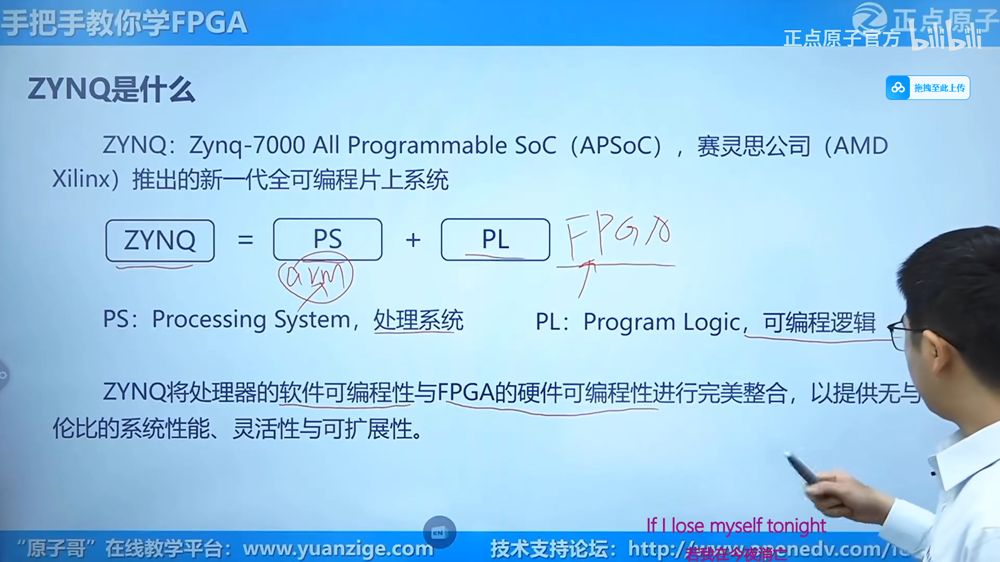
ZENC是基于arm硬盒(闭源,赛灵思的护城河)的SoC.
全可编程指的是拥有PS(硬件可编程)和PL(软件可编程).
  ### SoC 概述

#### ASIC SoC
ASIC（Application-Specific Integrated Circuit）是一种**专用**集成电路，主要设计用于执行特定应用或任务。与通用集成电路（如 CPU、GPU）不同，ASIC 的设计目标是优化性能、功耗和面积，以满足特定需求。

通常用于执行特定的、重复性的任务，如信号处理、数据加密、视频编解码等。因此，它们在处理这些特定应用时比通用处理器更高效。

由于 ASIC 是为特定任务优化的，因此在执行该任务时，它们通常能提供比通用处理器更高的性能和更低的功耗。

ASIC 设计可以在**功耗**方面进行优化，特别适合对**能耗**敏感的应用，如移动设备、嵌入式系统和物联网设备。

一旦制造完成，ASIC 的功能是固定的，无法重新编程或更改，这与 FPGA（现场可编程门阵列）不同，后者可以在硬件层面上进行重新配置。

虽然 ASIC 在量产时的单个成本较低，但开发和制造 ASIC 的初始成本相对较高，因此通常只在大规模生产的应用中经济有效。
应用实例:
* 比特币挖矿：专为挖矿算法设计的 ASIC。
* 网络设备：用于处理特定网络协议的 ASIC。
* 消费电子：如智能手机中的图像处理器、视频编解码器等。

#### SOPC
system-on programable chip, 可编程片上系统, 其实就是FPGA(Field Programmable Gate Array,现场可编程门阵列.).

#### APSoC
All-Programable SoC, 全可编程片上系统, SOPC再加上类似arm盒来提供操作系统, 实现软件编程. 即ZYNQ.
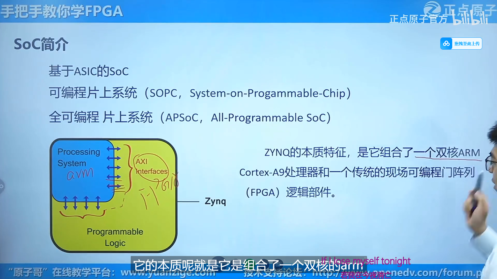

  ### FPGA概述
Field Programmable Gate Array, 现场可编程门阵列. 是**数字电路**为主的集成电路芯片, 术语可编程逻辑芯片(Programmable Logic Device, PLD)的一种.

* 和单片机的对比:
单片机也是集成电路芯片, 是ASIC.

* 应用领域:
  * 通信领域. 中兴/华为.
  * 验证领域: 用FPGA进行IC原型验证, 降低ASIC流片失败风险. 
  * 图像处理领域. 海康威视
  * 人工智能领域: 硬件加速.
  * 汽车自动驾驶.
  * 赛灵思发明并且几乎垄断了高端FPGA.
  * 国产:紫光同创,安路科技,高云半导体,复旦微电子,智多晶,遨格芯,华微科技..

  ### PL(Programmable logic)

Z-7010,Z-7015,Z-7020的PL架构为`Artix`.

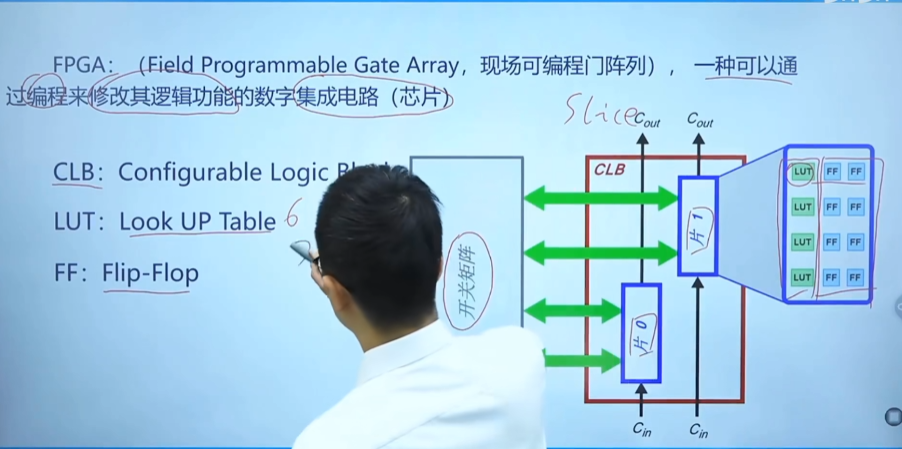

一块FPGA含有以下成分:
 
* `CLB`(configurable logic block)即`可编程逻辑单元`.

  *  `ff`(flip-flop)八个ff即类似DQ寄存器，可以寄存单个比特。
  *  `LUT`(look up table)即`查找表`.
* 嵌入式`块RAM`
  * `PLL`(phase-locked loop), 锁相环
    该模块提供多个时钟域并实现精确的时钟同步.
  * `DSP`(digital signal processing)即数字信号处理模块.
    该模块专门用于执行高效的数字信号处理,如滤波/FFT/图像处理等需要高性能运算的场景.
* 布线资源
* `hard IP core` (硬核)
  已经**预先设计和优化**，并且以物理形式(布局和电路级设计)存在的模块。这种设计在芯片制造时是不可修改的，因此被称为“硬”核。
  * `XADC`(extensible analog-to-digital converter), 可扩展A-D转换器
    `XADC`是`Xilinx 7`系列FPGA(包括`Zynq-7000`系列)中特有的硬核功能模块.
  * `GTX Transceivers`高速串行收发器.
  * `PCI`(peripheral component interconnect express, PCIe)高速互联标准协议模块.
* 可编程IO单元

  和物理层面的焊盘连接, 实现可编程的IO特性.
* 底层嵌入功能单元 

  ### PS(processing system)
一般指ARM处理器. 当然, 也可以在PL部分(即FPGA)中实现一个软核处理器, 处理相对简单的功能. 

* `APU`(application processing unit), 应用处理单元, PS的**核心部分**.
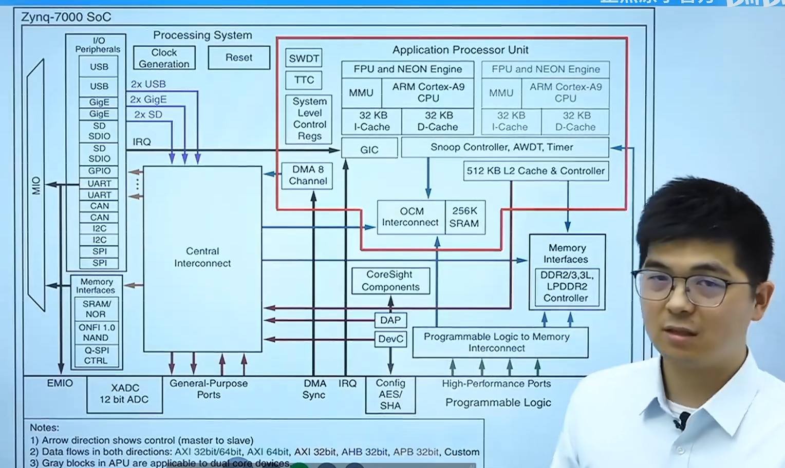
↑上图是zynq内部示意图, 横线上方为PS.4, 下方为PL.

  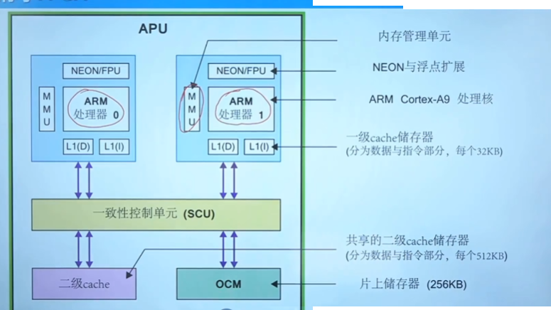
  * `ARM处理器`两个Cortex-A9处理核.
    * `MMU`(memory manage unit)内存管理单元
    * `NEON`媒体处理引擎.
    * `FPU`浮点运算单元.
    * `L1(D)`一级cache储存器(数据)
    * `L1(I)`一级cache储存器(指令)
    * `SCU`(snoop control unit)一致性(窥探)控制单元
      * 是`arm处理器`和`二级缓存`;  `OCM`的桥梁, 可以方便地访问缓存.`PL`直接连接着`APU`的`SCU`, 从而`PL`端可以方便访问缓存. 
      当`PS`端产生计算结果后, 可以快速通过`ACP`接口(`ACP`接口直接连接到SCU)送到`PL`端. 
      同样的, 当`PL`端做了一个硬件加速, 也可以用`ACP`接口快速给`PS`端. 
    * `OCM`片上储存器 
    * ...
* `DDR3`(double data rate3)高速动态随机存储器.
* `AXI Interface` (advanced extensible interface)即AXI接口. 它是`ARM`的`AMBA`总线的一部分.

  ### PL和PS的数据交互接口(AXI)
从上方`zynq's PS and PL`图中可看到, PS和PL之间的接口有:(它们都是`AXI接口`)
  * `GP接口`(general purpose ports), 通用接口. zynq7010中分为两个M两个S.
    * M_AXI_GP(主机接口)
    * S_AXI_GP(从机接口)
  * `HP接口`(high performance ports), 高性能接口. 也是两个M两个S.
    * `FIFO`(first in, first out)缓冲功能是 `HP接口`相比`GP接口`独有的.
  * `ACP接口`()加速器一致性接口

接口的简化示意图: 

###

## 3. ZYNQ7010 硬件

按键电路
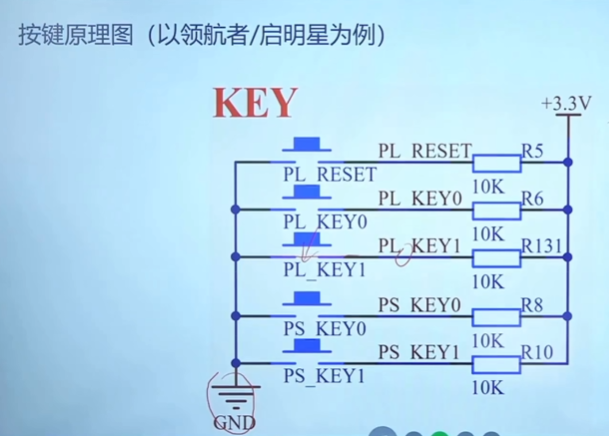

`IP核`: 即intellectual property core, 知识产权模块. 就是xilinx写好的很好用的`module`.

`IP Integrator`: vivado中的IP核集成模块管理工具.

## 原理图 

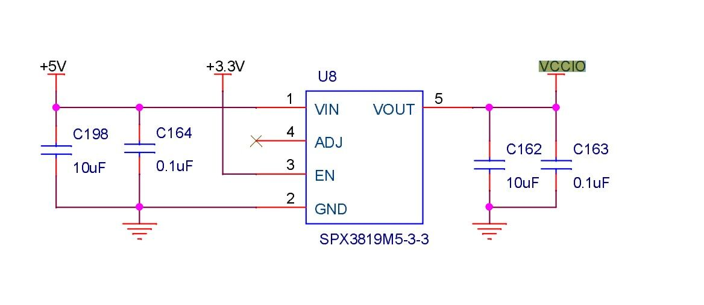

`SPX3819M5-3-3` 是一个 LDO 稳压器芯片，用于为 VCCIO 提供稳定的 3.3V 电源。因为它输出 3.3V，并且连接到 VCCIO，这意味着 VCCIO 应该是 3.3V 的工作电压。

* `SPX3819M5-3-3`采用`taxis instruments`命名规范.
  * 3-3意为3.3v
  * M5意为SOT-23-5封装, 具有五个引脚.

## DVI(digital video interface)

* 只能传输视频数据, 被`HDMI`向下兼容的通信接口(协议). 

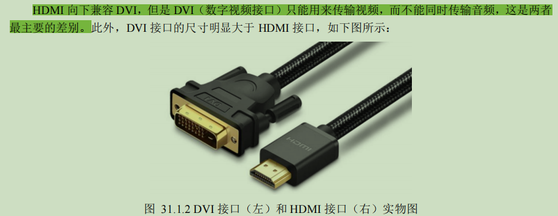

## HDMI(high-defination multi-media interface, 高清多媒体接口)

* 这里的`多媒体`可以理解为同时传输`视频`和`音频`信号.

* 接口类型
  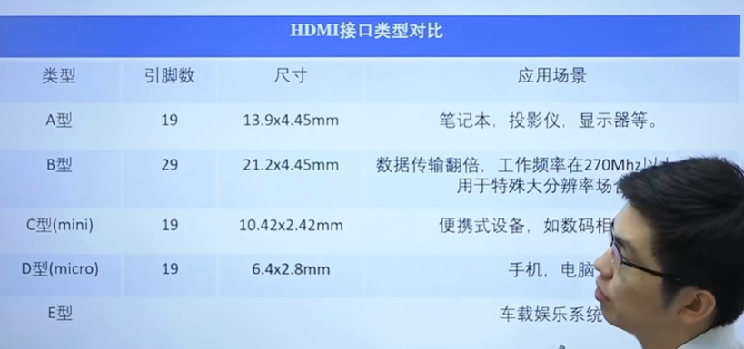

* 协议类型
  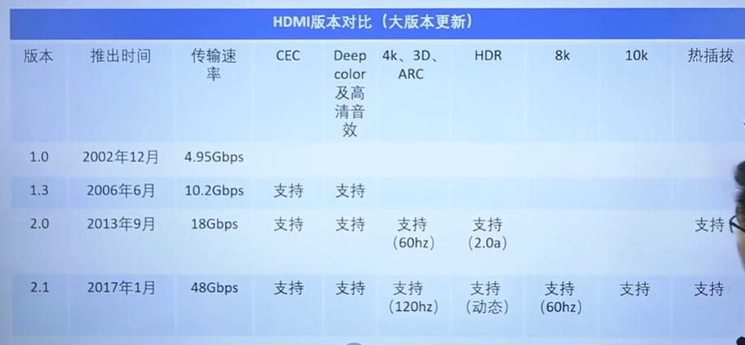

* 引脚

  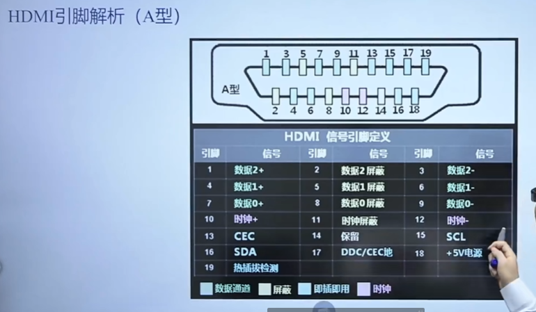

* 工作原理
  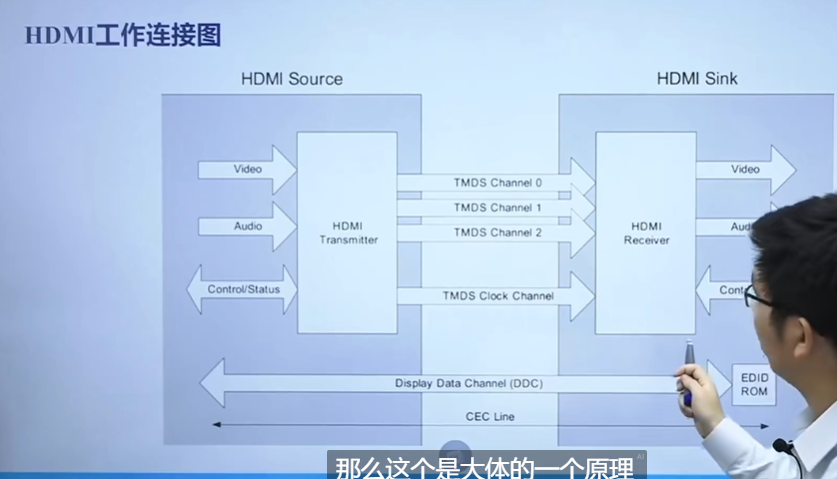
* `source`端连接主机, `sink`端连接从机.

* 音频信息的传递非常麻烦. 传递它用的`[3:0]`四比特数据包括采样频率, 频率等等. 

* 视频信息使用每个像素的`r``g``b`各有一条`[7:0]`八位数据, 即每个像素中每个原色可以有2^8=256种深浅, 整个像素有(2^8)^3=1670万种颜色.

* `HDMI`接口工作流程:
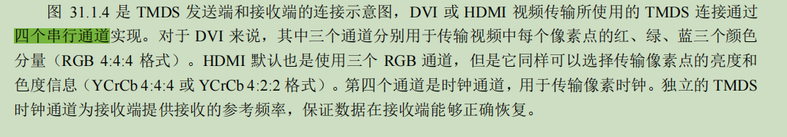
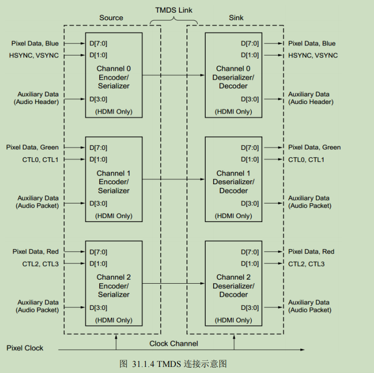

#

## TMDS编码(最小化差分传输)

* 差分传输: 即使用两条数据线完成单个通道的信号传输: 以两条线的电压**差值**作为信号, 好处是当外界存在对两条线影响相同的干扰时, 信号不会失真.
* 显然, 如果利用差分技术实现一个串口通信(即最简单的一个RX通道一个TX通道), 需要四根差分线.

`DVI` 和 `HDMI` 接口协议在物理层使用 `TMDS` 标准传输音视频数据。

编码规则: 将8bit数据转换为10比特数据.
* bit9==0: 表示亦或非
* bit9==1: 表示亦或. 
* bit10: 直流平衡位. 当前面`0`比较多的时候补个`1`, `1`比较多的时候补个`0`, 保证10bit内
  * 原因: 长时间产生`0`或`1`信号时, 电流为直流电流, 会导致电路中的电容受影响, 解码错误.

#
##