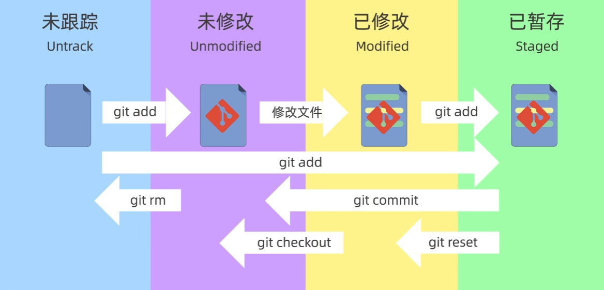

# 1 bash命令行 

linux中输入的命令行即为bash命令。每个bash命令是一个可执行程序(在/bin中储存). 创建一个可执行的bash命令行文件, 即为bash脚本script.

## 1.1

## 1.2 常用bash命令

### 1.1 man 
想要搜索的外部命令名可以跳转到该命令的man界面. 如果想查看bash内部命令, 比如cd, pwd, 使用help即可.
man -k <keyword>可以输出所有简介中包含关键字的man条目供你选择, 而不是直接进入某个具体的man条目.

 
### 1.2 find
find /指定路径下 -type f -name "filename" 
输出查找到的文件的路径. \
其中选项-type的参数为: -f(regular file), -d(directory), -l(symbolic link)等. -name可以替换为-iname, 即不区分大小写.
find经常和grep一起使用. find的结果|到grep中进行更细致的名称筛选. 比如find ~ -iname "my_first_program"和命令find ~ | grep -i "my_first_program"是等价的, 运行速度也几乎一样.

### 1.3 grep
格式为**grep -E "chars"**， 输出-E选项开启扩展正则表达式(ERE), 若没有这个选项, 系统会用基本正则表达式(BRE)来识别""内的字符. 
- 注意: BRE和ERE有不同: ERE支持 **|** 符号为"或", 而BRE需要用转义字符搭配 **/|** 为"或".


cat /etc/centos-release	查看centos版本。即cat显示命令和centos的版本信息存储地址.


### 1.4 xargs (extended arguments, 扩展参数)
- UNIX/Linux 命令的设计原则：
**命令行参数**：专门用于传递文件名或其他参数。
**标准输入stdin**：用于传递数据流。
函数根据不同的输入来源（命令行参数或标准输入）来采取不同的处理方式。命令行参数传递的是文件名，而标准输入传递的是数据流，这是 UNIX 命令处理输入的一种惯例和规范。 对大多数函数,如cat, wc, 如果没有指定命令行输入文件(即参数没有填), 它会将'input_desc'设置为'STDIN_FILENO',从标准输入(通常来自管道符|)中读取stdin. 而标准输入stdin是一个文本, 如果标准输入是一串参数(如一个读取出来的文件列表), 需要使用xargs将其转化为命令行参数. 例子:

```bash
azazel@DESKTOP-NJKSK6O:~/test/test$ wc -l testfile4.h
6 testfile4.h
azazel@DESKTOP-NJKSK6O:~/test/test$ vim testfile4.h
azazel@DESKTOP-NJKSK6O:~/test/test$ find . | grep ".c" | wc -l
2
azazel@DESKTOP-NJKSK6O:~/test/test$ find . | grep ".c" | xargs wc -l
0 ./testfile3.c
0 ./testfile1.c
0 total
```


### 1.5 wc (word count,词数统计)
**wc -l file**  输出file文件的行数(对一行的一句话,即显示字母数).\
-w：显示单词数。\
-m：显示字符数（与 -c 类似，但在处理多字节字符时有所不同）。\
-c：显示字节数。


### 1.6 motion

这应该是vim的内容好吧!

[motion]包括 hjkl(四向), w(下一个word开头), e(下一个word ending), 0(当前line开头), ^(当前line不为空格的开头.), $(当前line ending), G(文档ending), gg(文档开头)等，即cursor移动操作。


### 1.7 磁盘管理命令 du df 
 
#### 1.7.1 du (disk usage磁盘使用情况)


- 格式:
**du -sc 路径**

- 选项 -s(--summarize), 只显示每个参数的总和, 不显示每个子目录的用量. 
- 选项 -c(--total), 最后加上一个总计.

#### 1.7.2 df (disk free, 显示文件系统的磁盘空间占用情况)
- 选项 -h (human-readable) 将输出格式化为易于阅读的形式，如以 KB、MB、GB 等单位显示，而不是以字节数显示。
- example
  ```bash
  df -h | tee disk_usage.txt    #将磁盘使用情况输出在终端上,并且存入文件disk_usage中
  ```

### 1.8 sort (数据排序工具)
经常以pipe(|)接前一个函数的输出流, 以达到整理后使输出更加美观/易读的目的.
- 格式: **sort -nr 文件(一般以某个路径下的全部(用通配符实现)子文件/.../*表示)**
- 选项 -n(numerical), 按数值排序
- 选项 -r(reverse), 降序. 

### 1.9 more & less

- more, 用于分页显示文件内容或输入。它一次显示一页内容，用户可以按空格键查看下一页，按 q 键退出。
- 格式: **more filename**
- 示例: 
```bash
more AVeryVeryLongDocument.txt
```

**less,比 more 更强大的逐屏查看文件内容工具。其命名是一个笑话(less>more). 常用操作：**

  - 按空格键（Space）滚动到下一屏。
  - 按 b(back) 键滚动到上一屏。
  - 按回车键（Enter）滚动一行。
  - 按 k 键向上滚动一行。
  - 按 j 键向下滚动一行。
* 📜 翻页
-   `Space` → 向下翻一页    
-   `b` → 向上翻一页    
-   `d` → 向下翻半页 (down half)    
-   `u` → 向上翻半页 (up half)    
* * *
* 🎯 跳转
-   `g` → 跳到文档开头    
-   `G` → 跳到文档末尾    
-   `:n` → 跳到第 _n_ 行 (比如 `:100`)   
* * *
* 👀 查看
-   `=` → 显示当前行号和总行数    
-   `-N` → 打开行号显示（输入 `-N` 再按回车）
    -   `/pattern` → 从当前位置往下搜索 `pattern`
    -   `?pattern` → 从当前位置往上搜索 `pattern` 
    -   `n` → 跳到下一个匹配结果   
    -   `N` → 跳到上一个匹配结果
    - 按 q 键退出。


### 1.11 tee(这个名字来自字母T, 一个三向接口, 寓意数据分流)
这个命令读取标准输入, 并将数据输出到多个目标中.
- 语法:
```bash
command | tee [options] [file...]
```
- 选项: 
  - -a 将内容append到文件最后, 而不是直接覆写文件. 
- example:

  ```bash
   ls -la | tee output.txt  #将当前文件列表显示在终端,同时保存在文件output.txt中
  ```
  ```bash
   echo "a new line" | tee -a file  #将新的一行文字append到file结尾, 同时在终端显示这行文字.
  ```


### 1.12 objdump(object dump, 对象转储)
用于显示和分析二进制文件的内容。在软件开发和逆向工程中，objdump 常用于反编译和查看程序的汇编代码。
格式为**objdump <选项> <file>**
- 选项: 用于switch显示什麽信息(所以至少要填一个选项)
  - -S Intermix source code with disassembly,将源代码和反汇编代码混合显示.
  - -d disassembly, 反汇编所有可执行的节.
- example
  ```bash
  objdump -d myprog > disassembly_of_myprog.txt #将可执行程序myprog反汇编,将反汇编内容存储在disassembly_of_myprog.txt中.
  ```

### 1.13 time 记录其他命令的执行时间
在命令前面加上`time ` , 可以在执行命令后, 输出该命令的执行时间，包括 总耗时（real）、用户时间（user） 和 系统时间（sys）


### 1.14 网络和下载命令 curl scp 

#### 1.14.1 curl
**curl**用来从网络上获取数据. -s选项是silence模式,级不显示进度信息.
```bash
curl -s $URL
```

#### scp (secure copy protocol, 安全拷贝协议)

它是基于ssh协议的命令, 用来在两台主机之间传输文件.

拷贝一台服务器上的文件(夹)到本地: (-r表示recursive, 传输文件夹.)
scp -r <username>@<ip>:<目标服务器的文件(夹)路径> <想要保存的本地文件夹路径>
对于windows的powershell, 可以用""包裹表示windows风格路径名: "windows路径名"


### 1.15 重定向符号 (< , > , &, >>)
\>符号表示将左边的命令的标准输出stdin写入右边的文档中, 称为重定向.
如果加上&, 即&> 这个符号表示将标准输出stdin和<span style="color: red">
标准错误stderr
</span>
都重定向.
而>>表示把内容append到文件里而不是覆写.
\>符号同理.

`<<`符号和`>>`符号完全不同! 
* `>>`是**追加重定向**加重**定向**(如`echo "hello">> file`)
* 而`<<`是**多行输入重定向**.
    ```bash
      cat <<EOF
      hello
      world
      EOF
    ```
`<<EOF`会让shell(bash(linux终端默认)也是一种shell)进入`多行输入模式`, 直到遇到`EOF`.


### 1.16 一些应用:
- ```bash
  > newfile #创建一个新文档newfile. (即,将'空'重定向到newfile中) 它和touch newfile不同在于后者更安全: 如果存在名字为newfile的文件, > newfile删除了其全部文件, 而touch newfile不会进行任何操作.
  ```

 - ```bash
   cat file1 > file2 #复制file1文档到file2文档. (即, 显示file1的文档内容, 将内容重定向到file2) 它和cp file1 file2效果大部分时候相同, 但事实上后者可以保留文件权限和元数据.

   ```
   
 - ```bash
   ./myprog < data.txt  #如果myprog需要从键盘上读入大量数据(例如一个图的拓扑结构), 当你需要反复对myprog进行测试的时候, 你需要多次键入大量相同的数据. 只需要将myprog读入的数据一次性输入到文件data中, myprog就会从文件data中读入数据, 节省了大量的时间.
   ```
   - ```bash
    

     ```


### 1.17 程序和进程命令 ps init

#### 1.17.1 ps (process status)检查进程.

```bash
ps -p 1 -o comm=
```
`-p 1`表示查看pid=1的进程. 系统的第一个进程即为`init进程`.

`-o comm=`表示指定输出格式为command(命令名), `=`表示去掉标题行(不显示列名)

这条命令查看系统初始化进程(init进程)叫什麽.

#### 1.17.2 init进程


初始化进程是系统开机时第一个被运行的程序!

它管理:
  * 启动服务;
  * 日志;
  * 启动流程;等等.


不同的linux系统的init进程不一定一样.
现在大多数主流 Linux 发行版（如 Ubuntu 16.04+、Debian 8+、CentOS 7+）都默认使用 **systemd**
  常用命令:(`systemctl` 是 systemd 提供的命令行工具。)
  任务                |              命令
  查看 ssh 服务状态   | systemctl status sshd
  启动 ssh 服务       | sudo systemctl start sshd
  设置开机启动 ssh    | sudo systemctl enable sshd
  重启 ssh 服务       | sudo systemctl restart sshd
一些系统(特别是轻量级系统、嵌入式环境、HPC 环境, 容器) 可能有其他的init进程, 

比如有些容器/非常轻量的虚拟环境等, 会使用**sh**, 即shell. 这意味着这个**系统**本质上只是个运行shell的环境罢了.


### 1.18 tree 显示目录结构

⚠注意bash中的tree和 powershell中的tree语法不同!!!

bash:
    tree -L [层数]  这是我最喜欢的功能! 搜索深度为[层数]层目录显示.
    tree -d         只显示文件夹, 不显示文件.
    tree -a         显示隐藏

powershell:
    tree      输出当前目录树(只包含文件夹. 这个默认是和bash相反的, 毕竟powershell助长易用性和懒人)
    tree /F   输出当前目录树(包含文件夹和所有文件)(一般会超级爆炸长)
    tree /A   输出当前目录, 以ASCII字符的方式.(我觉得没啥区别, 无非就是树枝符号变更丑了. 即使是非ascii符号一般情况下也可以复制粘贴和在大部分地方显示的啦...)


## 1.3 Here Document

又称heredoc, 是bash中一种多行文本输入方式, 语法:

```bash
command <<结束标记
内容内容
内容内容
结束标记
```

当你以`<<EOF`结束一行后, 按下回车, bash自动进入换行模式, 一直等待直到某一行你输入单独的`EOF`并回车.
例如如果你想要写一个简单的c程序:

```bash
cat > test.cpp << MY_EOF_SIGNAL
//this is my test program. just press ENTER.
#include iostream //just press ENTER!

int main(){
cout>>"hello world!";
return 0;
}
MY_EOF_SIGNAL
```


##

##

##

# 2 如何编译C文件: 直接使用gcc/g++; MAKE命令和Makefile

如果你不想写好一个c文件然后`gcc yourcode.c`(如果你的yourcode.c要包含其他文件, 要让它们在同目录下.)

抑或是写好一个cpp然后`g++ yourcode.cpp`(如果你的yourcode.c要包含其他文件, 要让它们在同目录下.)


那麽使用make吧.

大多数linux发行版预装了MAKE.
`make -v`

## 2.-1 前言: 程序编译的四个步骤

### 1. 预处理（Preprocessing）
- 任务: 在编译源代码之前，对代码进行初步处理。

- 操作:  宏替换: 替换 #define 定义的宏。例如，将 #define PI 3.14 替换成 3.14。
文件包含: 处理 #include 指令，插入所包含的头文件内容。
条件编译: 处理条件编译指令，如 #ifdef 和 #endif，只编译符合条件的代码块。

- 结果: 输出一个中间文件，通常是扩展名为 **.i** 的文件，包含了经过预处理的源代码。

### 2. 编译（Compilation）
- 任务: 将预处理后的源代码转换为汇编代码。

- 操作:  语法分析: 检查代码是否符合语言的语法规则。
生成中间代码: 将源代码转换为中间表示，如抽象语法树（AST）或中间语言（IR）。
优化: 对中间代码进行优化，以提高效率。

- 结果: 输出一个汇编语言代码文件，通常是扩展名为 **.s** 的文件。

### 3. 汇编（Assembly）
- 任务: 将汇编语言代码转换为机器代码。

- 操作:  汇编: 将汇编语言代码翻译成机器语言指令（即机器码），这些指令是计算机可以直接执行的。
生成目标文件: 输出 **目标文件** ，通常是扩展名为 **.o** 或 **.obj** 的文件，包含机器代码和其他必要的符号信息。

- 结果: **目标文件**，包含了编译生成的机器码，但还不是最终的可执行文件。

### 4. 链接（Linking）
- 任务: 将目标文件与所需的库文件合并，生成最终的可执行文件。

- 操作:  符号解析: 处理目标文件中未定义的符号，链接到库文件中的相应定义。例如，处理函数调用。
地址分配: 分配内存地址，确保所有代码和数据都放在正确的位置。
生成可执行文件: 输出最终的可执行文件，通常是没有扩展名的文件（如 program）或带有 .exe 扩展名的文件。
- 结果: 完整的可执行文件，可以在计算机上运行。

## 2.0 gcc(GNU compiler Collection, GNU 编译器套装")

最简单的编译命令.
gcc会根据**提供文件类型**和**选项**自动决定处理阶段:
|选项|输入文件|行为|output|
|---|---|---|---|
|无|.c|预处理->compile->汇编->link|可执行文件|
|无|.i|compile->汇编->link|可执行文件|
|无|.o|汇编->link|可执行文件|
|-c|.c|预处理->compile|.o目标文件|
|-E|.c|预处理|.i预处理文件|


- 基本命令:     
  <span style="color: red;"> 
  **gcc [选项] [源文件] -o [输出文件]**
  </span>,

  或者    <span  style="color: red;">  
   **gcc [选项]  -o [输出文件] [源文件] 
   </span> 
   (只要`-o`后面跟着输出文件命名, 源文件放在前面和最后都是可以的)** 
   
   这命令将源(文本)文件.c编译为可执行文件'输出文件'.
- 选项`-o`表示输出文件的名称(如果不加-o [输出文件], 则在则会默认生成名为a.out的文件, 它的含义是assembler output)
- 选项-O:优化代码. 有-O1(一级优化), -O2(二级优化), -O3(三级优化)三个等级.
- 选项 -g
- 选项`-c`: 即compile, 只编译为目标文件.o.
    ``

**例子:**
* `gcc hello.c -o hello`
  * 在当前目录寻找`hello.c`, 将其编译为可执行程序`hello`
* **只编译**: `gcc -c hello.c -o hello.o`
  * 在当前目录寻找`hello.c`, 将其编译为目标文件`hello.o`
* **只预处理**: `gcc -E hello.c -o hello.i`
  * 在当前目录寻找`hello.c`, 将其预处理为目标文件`hello.i`  
* **分步编译**: 
```bash
#编译每个.c文件为.o文件. 注意要在代码中正确写好include头文件
gcc -c main.c -o main.o
gcc -c utils.c -o utils.o` 

#链接所有编译单元(即.o文件)
gcc main.o utils.o -o myprogram
```
* 启用警告和调试信息:`gcc -Wall -Wextra -g main.c -o debug_app`
  * `-Wall`: 启用所有常见警告
  * `-Wextra`: 启用额外警告(如未初始化的变量)
  * `-g`: 添加调试信息, 供`gdb`使用

* 优化代码性能(牺牲编译时间): `gcc -02 main.c -o myprogram`
  * `-01`: 添加该选项后, 进行基础优化. 编译更慢, 优化更好.
  * `-02`: 推荐的平衡级别.
  * `-03`: 激进优化. 可能会影响代码行为..

* 链接外部库: `gcc main.c -lm -lpthread -o myprogram`
  * `-lm`:

* 指定头文件和库路径: `gcc -I./include -L./lib program.c -lmylib -o app`
  * -I和-L选项指定了头文件在 ./include，库文件在 ./lib。
  * -lmylib：链接 libmylib.so。

* 静态链接: `gcc -static main.c -o static_app`
  * -static选项生成不依赖动态库的可执行文件, 适合分发, 文件体积显著增大.

* 检查语法: `gcc -fsyntax-only main.c`
  * `-fsyntax-only`选项: 快速验证代码语法是否正确（无需编译）。

* 多线程编译加速: `gcc -j4 main.c utils.c -o app  # 使用 4 个线程`
  * `-j4`即使用4个线程. `-j0`即使用cpu所有线程.

## 2.1 make命令的使用

**make命令**利用Makefile(一个txt)工作, 用于自动化编译和构建程序的过程。使用方法是在项目文件夹中同时放入源文件和一个名为Makefile的文本文件, 然后在当前项目文件夹目录下直接键入命令make.

**bash命令的基本用法:**

```bash
make #编译项目. 查找当前目录的Makefile, 执行默认目标`all`.

make mycode_main.cpp #制定目标编译项目. 查找当前目录的Makefile中有没有叫做`mycode_main.cpp`的target, 如果有, 执行这个target. 如果没有找到, 或者甚至根本没有找到Makefile, 查找当前目录中的`mycode_main.cpp, 编译它.`

```


```bash
make -j -C obj_dir -f Vour.mk Vour
```
* `-j` 多线程并行编译
* `-C [路径]` 切换到[路径]再运行make
* `-f Vour.mk` 使用指定的Makeifle文件来编译
* `Vour` 编译的目标名. 


## 2.2 编写Makefile的简单例子

### 2.2.1 Makefile 简述
如果要使用make, 需要编写**Makefile**.

* Makefile
是一个特定格式(见下文)的文本文件, 它由:
* **变量声明**
* **一个个规则**
组成.

* **变量部分**
| 变量名   | 默认值 | 作用                     |
|----------|--------|--------------------------|
| `CC`     | `cc`   | C 编译器（通常链接到 gcc） |
| `CFLAGS` | 空     | C 编译选项                |
| `LDFLAGS`| 空     | 链接选项                  |
| `CPPFLAGS`| 空    | 预处理选项（如 `-I`）     |


* **规则部分:**
每个规则通常包含三个部分: 
- **目标(target)**：要创建或更新的文件或对象。这通常是可执行文件或目标文件。
- **先决条件/依赖(dependencies/Prerequisites)**：目标所依赖的文件。如果这些文件中的任何一个发生更改，目标将被重建。
- **Recipe** : make 将执行的命令来创建或更新目标。这些命令必须使用`Tab`缩进。

**格式**:
```Makefile
target: dependencies
  recipe
```


例如, 若想使用bash命令`make clean`, 你的Makefile中必须写好了下面这个clean规则:(假设你在项目ex3目录中)

```Makefile
clean:
  rm -f ex3
```

### 2.2.2 例子1
* 例子1: 将当前文件夹内的hello.c编译为hello.


```bash

#任务很简单, 就不声明那些变量了, 让make默认吧.

hello:hello.c
	gcc hello.c -o hello	#

.PHONY: clean  
 #.PHONY: targetName是一种特殊的指令，用于告诉 make，clean 是一个伪目标（也就是不与某个具体文件相关的目标）。这可以防止有同名文件时的冲突。
 #在 Makefile 中，目标target通常对应于要生成的文件，例如可执行文件或编译后的目标文件。但有时，目标可能不会生成一个文件，而是用于执行某个动作，比如清理编译生成的文件。这些目标就是伪目标（phony targets）。
 #如果你在当前目录下有一个名字叫 clean 的文件，而你在 Makefile 中也有一个 clean 目标，那么 make clean 时，Makefile 可能会认为目标已经满足，而不会执行清理操作。使用 .PHONY 可以告诉 make 这个目标是伪造的，不要检查同名文件是否存在。


#clean规则. 显然它不需要dependencies.
clean:
	rm hello	
```

* 例子2: 有main.c和utils.c两个编译单元.
```Makefile
#假设你已经有了源文件 main.c 和 utils.c
# 变量定义
CC = gcc
CFLAGS = -Wall -g
OBJ = main.o utils.o

# 默认目标
all: my_program   
#如果只运行 make，则默认构建 my_program。

# 生成目标 my_program
my_program: $(OBJ)
	$(CC) $(CFLAGS) -o my_program $(OBJ)
#多个依赖项是很常见的，特别是在较大的项目中，一个目标可能依赖于多个文件或组件。链接器（linker）将 main.o 和 utils.o 合并，生成最终的可执行文件 my_program。


# 生成目标 main.o
main.o: main.c
	$(CC) $(CFLAGS) -c main.c
#这里使用依赖为main.o utils.o, 而不是源文件main.c utils.c. 
#这是因为, 当 .c 文件发生变化时，需要重新编译这些源文件，生成新的 .o 文件。如果你直接在 Makefile 中指定 .c 文件作为依赖项，那么每次你运行 make 时，它都会重新编译所有的 .c 文件，即使 .o 文件没有变化。这样不够高效。
#通过使用 .o 文件作为依赖项，make 只会在 .c 文件发生变化时重新编译相应的 .o 文件，从而节省时间。


# 生成目标 utils.o
utils.o: utils.c
	$(CC) $(CFLAGS) -c utils.c

# 清理目标
clean:
	rm -f *.o my_program  
#删除所有对象文件和 my_program 可执行文件。
```
例子3: 实现对文件夹里所有ex[0-9]*.c的文件进行编译.
```makefile
#变量定义
CC = gcc
CFLAGS = -Wall -g

#清理生成的文件
clean:
        rm -f ex*

#默认目标.
#patsubst即pattern substitution, makefile中的字符串模式替换函数, 格式为$(patsubst <pattern>, <replacement>, <text>)
#wildcard即makefile中的万用字符函数, 格式为$(wildcard <表达式>)
all:$(patsubst %.c, %, $(wildcard ex[0-9]*.c))

#生成目标
# % 通配符表示任何字符串.
# $@ 表示当前规则的目标文件.
# $< 表示规则中第一个依赖文件.
%:%.c
        $(CC) $(CFLAGS)  -o $@ $<
```

## 2.3 **编写Makefile, 用make进行编译 的一个综合例子**

### 2.3.1 例程内容
现在有一个简单的项目: main.c主程序, 以及一个`math_utils`模块, 包括math_utils.h和math_utils.c两个文件.

* math_utils.h
```cpp
#ifndef MATH_UTILS_H
#define MATH_UTILS_H

int add(int a, int b);
int multiply(int a, int b);

#endif
```

* math_utils.c
```cpp
#include "math_utils.h"

int add(int a, int b) {
    return a + b;
}

int multiply(int a, int b) {
    return a * b;
}
```


* main.c
```cpp
#include <stdio.h>
#include "math_utils.h"  // 依赖 math_utils.h

int main() {
    printf("3 + 5 = %d\n", add(3, 5));
    printf("3 * 5 = %d\n", multiply(3, 5));
    return 0;
}
```

### 2.3.2 手动编译这个例程


如果手动编译, 需要把三个文件放在一个目录下, 然后使用gcc.
要添加所有参与编译的.c文件.

```bash
gcc main.c math_utils.c -o myprogram
```


### 2.3.3 写Makefile编译这个例程


**下面我们编写这个例程的Makefile.**

```Makefile
# 定义编译器和选项
CC = gcc
CFLAGS = -Wall -Wextra#启用额外警告

#你想要生成的可执行文件名字
TARGET = myprogram

# 约定用法: 变量SRCS, 项目文件列表. 这就对应IDE中的项目文件列表. 告诉编译器, 这些文件要参与编译.
SRCS = main.c math_utils.c 


# 约定用法: 变量OBJS, 目标文件列表. 为 make 和linker提供明确的中间文件列表。
# 虽然按理说所有的.c编译单元对应生成一个.o, 但是Makefile提供OBJS变量原因:
# 1.可以在特殊情况下控制哪些编译文件被link, 
# 2.而且可以实现增量构建(Partial Rebuild): 只编译修改过的文件而不是重新编译整个项目. 有了OBJS列表, 当你修改一个文件xx.c或.h后, make 会一个个检查OBJS中的目标文件, 当这个目标文件依赖xx.c时, 才会重新编译这个目标文件.
# 大部分情况下直接OBJS = $(SRCS:.c=.o)就可以了...
# 语法上, 这句话的意思是, 将`字符串数组`变量SRCS中所有字符串中`.c`都替换为`.o`(得到一个中间变量), 然后赋值给OBJS.
# 这样做的好处就是你只需要维护一个SRCS, 如果加入一个newmodule.c, 会自动在OBJS添加一个newmodule.o.
OBJS = $(SRCS:.c=.o)

# 命令行住直接运行make, 不指定target时, make会执行`all`默认目标. 也就是说在命令行中, `make`和`make all`命令等价.
# $符号即引用变量的值. 此处的`all: $(TARGET)`等价于`all: myprogram`.
all: $(TARGET)


#上面是定义本makefile要用的变量. 下面就是一个个makefile规则. 一个makefile的结构:
# target: dependencies
#     recipe
# 其中target是一个字符串, 表示要生成的可执行文件的名字.
# dependencies是字符串数组, 表示生成这个可执行文件需要的所有依赖.o文件名称.
# recipe是生成target要执行的命令.必须以Tab开头哦
# $@表示当前目标, 即$(TARGET), 
# $^代表所有依赖文件,即 $(OBJS), 
# $<表示第一个依赖文件（如 main.c）
$(TARGET): $(OBJS)
	$(CC) $(CFLAGS) -o $@ $^


# 编译每个 .c 文件到 .o 文件（依赖对应的 .h）
%.o: %.c math_utils.h
	$(CC) $(CFLAGS) -c $< -o $@

```

-
* 如果没有 `Makefile`，`make` 会自动尝试使用默认的编译命令。
  * 此时， 如果输入`make ex1`, 命令会尝试查找名字带有ex1的文件, 如`ex1.c`,`ex1.cpp`等, 如果找到并唯一, 就以此为**依赖**,  创建一个ex1可执行文件作为**目标**, 同时输出他刚刚执行的编译命令,即`cc     ex1.c   -o ex1`
* 每次运行make命令时, make会检查源文件和目标文件(如果已经存在同名目标文件)的时间戳. 如果发现目标文件已经存在, 并且时间戳新于所有依赖源文件, 那麽会停止命令, 并且输出"make: 'hello' is up to date."(没有需要更新的文件)
* 在make命令前加上对环境变量`CFLAGS`的改变, 可以在编译时启动所有警告显式. 


```
CFLAGS "-Wall" make ex1
```

  也可以在Makefile里添加对这个环境变量的修改. 下面是一个Makefile:
  ```Makefile
  CFLAGS=-Wall -g #将环境变量CFLAGS修改为-Wall以启用所有常见编译警告. g选项生成调试信息.

  clean:
    rm -f ex1
  ```
* `make clean` 该命令将当前目录由编译器生成的可执行文件删除. 方便你重新开始生成可执行文件.


# 3 linux的用户(组)管理
linux的权限管理包括用户和用户组, 两者权限系统互相独立, 一个用户可以存在在多个用户组中， 但必须至少存在在一个用户组中。

## 用户组管理
###  创建用户组 groupadd 命令(可能需要sudo)
```bash
groupadd newgroup
```
### 删除用户组  groupdel 命令
```bash
groupdel group
```
### 查看用户组  cat /etc/group 即可.

## 用户管理
### 添加用户 adduser 命令
```bash
useradd -g groupName -d homePath userName
#添加一个用户.
# -g 选项用于将新用户添加到某个已经存在的用户组中. 如果没有-g 选项, 会默认创建一个和新用户名同名的新用户组, 并把新用户放进去. 
# -d 选项用于指定用户的home文件夹位置. 若没有 -d 选项,会将用户的home文件夹默认放在/home中.
```
### 删除用户 userdel 命令
```bash
userdel -r userName
#删除一个用户.
# -r 选项用于删除用户的home目录. 否则将保留其目录和内部文件.
```

### 查看用户所属组 id 命令
```bash
id userName
#如果不输入userName, 直接id, 默认查看当前用户的信息.
```


各个组的常见用途：
- adm：管理员组，通常用于授予访问系统日志文件的权限。
- sudo：允许用户执行需要超级用户权限的命令。
- dialout：允许用户访问串口设备（如调制解调器）。
- cdrom、floppy、audio：这些组允许访问相应的硬件设备（如光驱、软盘驱动器和音频设备）。
- video：允许访问视频设备。
- plugdev：允许用户访问即插即用设备（如 USB 设备）。
- netdev：通常用于网络设备管理。


### 修改用户所属组 usermod 命令
```bash
usermod -aG groupName userName
#  -aG选项即append group, 在不改变$userName当前所属组的前提下将其添加到$groupName中. 
#  若没有则会把$userName当前所属的组剔除, 并将其加到$groupName组. 
```


### 查看本系统所有用户名单 cat /etc/passwd 即可.


## 修改文件(夹)的权限信息 chmod (change mode)命令 
```bash
chmod [-R] 权限(r/w/x) 
# -R表示递归操作, 即对文件夹内的全部内容应用.
# u(user), g(group), o(other)
#例子:
chmod u=rwx, g=rx, o=x hello.txt
```
除了上述符号模式参数, 也可以用数字模式参数:
数字模式中的每一位都代表用户 (user)、用户组 (group) 和其他人 (others) 的权限。权限用一个三位数来表示：

>r (读权限) = 4\
>w (写权限) = 2\
>x (执行权限) = 1\
>无权限 = 0\
从而, 7=rwx, 6=rw-, 4=r--,...
数字模式的权限是通过将这些值相加来确定的。
```bash
#为了确保 SSH 能正常工作，你需要设置文件的权限.
chmod 600 ssh_key #等同于chmod u=rw-, g=---, o=--- ssh_key
chmod 604 ssh_key #
```
## 修改文件(夹)的所属用户(组) chown (change owner)
只能以root用户执行.
```bash
chown [-R] [user]:[group] file

# 例子:
chown azazel hello.txt #将hello.txt所属用户改为azazel
chown :sudo hello.txt #将hello.txt的所属用户组改为sudo
chown -R root:root hello #将文件夹hello内所有文件所属用户和用户组改为root.
```

# 4 杂项

## 4.1 shell和linux哲学: 一切都是子进程.

linux里, 运行一个.sh脚本 = 启动一个子shell, 不污染当前shell环境. 如果运行`~/your_script.sh`, 不会对当前shell(如bash, git bash)产生任何影响, 如指定当前python环境等. 

如果想要某些激活效果影响当前终端, 需要添加关键词`source`(把这个脚本文件当作一个**源文件**, 读取文本, 将文本注入(打出来)到当前shell来执行. 效果等同于把里面的东西手动敲出来. ):`source ~/your_script.sh` 

* 相比之下，**PowerShell**是windows为交互式任务和管理系统环境而生的，它更倾向于“运行脚本时改当前 shell 的行为”，所以设计上允许直接运行脚本: `~\your_script.ps1` 来改变当前环境。 `.ps1`本质上是一个可以独立运行的命令单元!


## 4.2 万用字符(REGEX)

Bash中的万用字符(wildcards)(*通配符就是一种万用字符.)
#### *（星号）：
匹配任意数量的字符（包括零个字符）。
例子：*.txt 匹配所有扩展名为 .txt 的文件。

#### ?（问号）：
匹配任意单个字符。
例子：file?.txt 匹配 file1.txt、fileA.txt 等，但不匹配 file.txt。

#### [ ]（方括号）：
匹配方括号中的任何一个字符。
例子：file[1-3].txt 匹配 file1.txt、file2.txt 和 file3.txt。

#### {}（花括号）：
匹配花括号中的多个选项之一。
例子：file{1,2,3}.txt 匹配 file1.txt、file2.txt 和 file3.txt.

## 4.3 正则表达式

正则表达式是一种比bash的万用字符更复杂的模式匹配工具("增强版通配符")，通常用于文本处理。正则表达式在Bash中主要用于工具如 grep、sed 和 awk 中。它提供了更多的匹配功能.\
*正则表达式在线测试工具：https://regex101.com/


### 正则表达式- 限定符(quantifiers)
#### .（点）
匹配任意单个字符。(即万用字符中的?)
例子：a.b 匹配 aab、acb，但不匹配 ab。

#### *（星号）
匹配零个或多个前面的字符。(即a\*意味着a可以没有可以有很多连在一起)
例子：a\*b 匹配 b、ab、aab、aaab 等。

#### +（加号）
匹配一个或多个前面的字符。(即a*意味着a必须出现,可以多次)\ 

例子：a+b 匹配 ab、aab、aaab, **但不匹配 b** 。
如果想匹配abababab,可用"(ab)+". 其中圆括号()在正则表达式中表示分组和优先级, 和数学括号一样.

#### ?（问号）
匹配零个或一个前面的字符。(即a?意味着a可以有可以没有)
例子：a?b 匹配 b 和 ab。

#### {} 花括号
{m,n}:匹配m~n个前面的字符.(即a{0~1}等价于a?, a{5}等价于aaaaa)

#### \b
\b是单词边界(word boundary)匹配符, 匹配单词边界,具体来说是
- 单词和空格之间
- 单词和标点符号之间
- 单词和字符串开头或结尾之间

####　^ 和 $

^　表示行的开始，$ 表示行的结束。\
例子:
- ^star 匹配start,但不匹配 bastard.
- end$  匹配以 theend, 但不匹配 ending.


在［］内的＾则表达**不匹配**身后的字符的单个字符.
例子:
- [^a] 匹配不是a的任意一个单个字符.
- [^0-9] 匹配所有非数字的单字符.
- 

### 或运算(OR operators)

#### |
| 即为或. 如"a (cat|dog)"可以匹配到"a cat"和"a dog".

#### 字符类(character classes)
[ ]（方括号）：
匹配方括号中的任何一个字符。
例子：

[abc] 匹配 a、b 或 c.
[a-z] 匹配 所有的单个小写字母.
[a-zA-Z0-9]+ 匹配所有的大写字母小写字母数字组成的单词(以空格为界).

#### 元字符(meta characters)
- \d    数字字符, 等于[0-9]
- \w    单词字符, 等于[0-9a-zA-Z_-]所有数字&大小写单词&上下划线.
- \s    空白符, 包括tab&换行符
- \D    非数字字符, 等于[^0-9]
- \W    非单词字符, 等于[^(0-9a-zA-Z-_)]
- \S    非空白字符

#### 贪婪与懒惰匹配
比如当希望在<html><body>Hello</body></html>中匹配到每个html标签,如果使用正则表达式<.+>  (回忆.+即为对任意一个字符取任意次出现), 由于+默认匹配尽可能最大的结果,会导致匹配结果为<html><body>Hello</body></html>这一整块.

可以使用?来切换匹配模式:

- ?作为量词修饰符

当 ? 紧跟在其他量词, 如 __\* , + , {n,m}__ 之后时，它将这些量词从贪婪模式切换到非贪婪模式（也称为惰性模式）。在这种模式下，正则表达式会尽可能少地匹配字符。
例如，.+? 和 .*? 都是非贪婪模式。

- ?作为量词
  
即单独使用?表示匹配前面字符0~1次, 这个用法上面已经介绍过.

上面的例子里,使用<.+?>去匹配

``` <html><body>Hello</body></html> ```

即可得到四个标签了.


#### 一些正则表达式例子

- 匹配16进制颜色编码:
    - 待匹配文本: (第一个和最后一个是不符合要求的)\
    ```
    #00
    #ffffff
    #ffaaff
    #e8hhee
    #aabbcc
    #ee0e0e
    #ffffffff
    ```
    匹配正则表达式:  
    ```
    #[0-9a-fA-F]{6}\b
    ```      
    
    几点说明: 若没有\b来识别单词边界,最后一个#ffffffff的前面部分也会被识别到.

    <br>
- ipv4地址匹配:
    - 待匹配文本:
    ```
    123
    255.255.255.0
    192.168.0.1
    0.0.0.0
    256.1.1.1
    This is a string.
    123.123.0
    ```

    匹配正则表达式:   
    ```python
    ((25[0-5]|2[0-4]\d|[01]\d\d|\d\d?)\.){3}(25[0-5]|2[0-4]\d|[01]\d\d|\d\d?)
    ```
 几点说明: .作为特殊字符, 需要用转义字符\连接使用表达匹配特殊字符本身.

 ```python
     25[0-5]|2[0-4]\d|[01]\d\d
 ```
 这段表示匹配三位数表示的000-255数字;
 ```
    \d\d?
 ```
这段表示匹配两位或一位数表示的00-99和0-9数字.

- 在本markdown文件中匹配所有的一级标题,即匹配单次出现的#:
 ```bash
    
 ```


## 4.4 路径结尾加不加/?    
在路径的结尾加上 / 并不影响操作，但它可以帮助明确指示目标路径的类型。如果你在路径的结尾加上 /，通常是为了明确指出这是一个目录。例如：cp ~/note .和cp ~/note ./效果都是把~/note复制粘贴到当前目录中.

## 4.5 在当前路径检索时加上./是好习惯.
有些Linux发行版系统默认情况下并不查找当前目录, 这是因为Linux下有大量的标准工具(如test等), 很容易与用户自己编写的程序重名, 不搜索当前目录消除了命令访问的歧义.   在操作当前目录文件时,路径开头不要省略./是好习惯.

## 4.6 过滤输出
一种实现过滤输出的方式为将内容输出到 **/dev/null** 中. 任何试图输出到这个特殊文件的信息都会被丢弃, 而读取它则总是返回 EOF (End of File) . 

*这是由一个简单的设备驱动程序实现的。这个驱动程序处理所有对该文件的 I/O 请求。对于写入操作，它直接丢弃数据，而对于读取操作，它返回零字节（EOF）。
- example:
```bash
time ./myprog < data.txt >/dev/null #希望测试myprog读取数据运行的时间, 此时我不关心他的输出,  可以将其丢到/dev/null中.
```

## 4.7 ? 变量
**?** 是一个重要的环境变量(which also means, 不要把自己的变量取名叫`?`!), 它用来储存上一个命令执行后的退出状态 (exit status). 在unix/linux系统中, 几乎每一个命令都会返回一个退出状态码, 一般情况下**0** 表示成功执行,  其他非0值表示各种类型的错误情况. 
- 例如**ping** 命令:
>**0** : 成功

>**1** : 一般错误 (General Error)\
这是一个通用错误码, 表达ping命令遇到了一些问题, 但不是具体的网络问题. 可能是命令选项使用不当或者系统问题.

>**2** : 分配内存错误　(Allocation Failure).  这错误很少见, 除非系统内存资源非常有限...

>**68** :　目标不可达 (Destination Unreachable).\
网络配置问题, 防火墙阻止了ICMP包, 或者目标主机根本不存在. 这个错误码是ICMP协议提供的.

>**69** : Timeout.

>**70** : Time Exceeded.

使用$?来表示上一个命令的退出状态码的值.

## 4.8 条件运算符

**-eq** 是一个用于比较整数的条件运算符，表示 "equal"（等于）。在 if 语句中，你可以使用它来比较两个整数是否相等。

**-eq**：表示 "等于"。
**-ne**：表示 "不等于"。
其他类似的运算符还有 **-lt**（小于），**-le**（小于等于），**-gt**（大于），**-ge**（大于等于）。


## 4.9 source命令以及环境变量

`source` 命令（在某些 shell 中也可以使用 `.` 符号）在 Unix 和 Linux 系统的 shell 环境中用于执行.sh脚本文件中的命令。它的主要作用是在当前 shell 会话中执行文件的内容，而不是启动一个新的 shell。

### 使用场景

1. **加载环境变量**：
   `source` 命令常用于加载和应用环境变量设置。这在你修改了 `.bashrc`、`.bash_profile` 或其他配置文件后特别有用。例如：
   ```bash
   source ~/.bashrc
   ```
   这会重新加载 .bashrc 文件，使得你对环境变量的更改立即生效，而无需重新登录或启动新的 shell 会话。

2.  **执行脚本：**
   source 命令可以用来执行 shell 脚本中的命令，并且不会启动新的 shell。这样脚本中的变量和函数可以直接影响当前的 shell 环境。例如：
   ```bash
   source myscript.sh
   ```
   这会执行 myscript.sh 文件中的所有命令，使得脚本中定义的变量和函数在当前 shell 中可用。


## 4.10 解压文件

`tar -xvzf systemc-2.3.3.tar.gz`

参数解释：
-   `x`：extract 解压 
-   `v`：verbose 显示详细信息（可以省略）  
-   `z`：gzip（.gz 就是用这个压缩的）   
-   `f`：file 后面接文件名


##


# 5 程序调试: gdb 

## 🔹 启动 & 基本操作


| 命令            | 作用                     |
| ------------- | ---------------------- |
| `gdb ./a.out` | 启动 gdb，加载目标程序          |
| `run` / `r`   | 运行程序                   |
| `start`       | 从 `main` 开始执行并停在第一行    |
| `starti`      | 从入口 `_start` 指令开始执行并停下 |
| `quit`        | 退出 gdb                 |


## 🔹 源码级调试 (C/C++ 等)


| 命令                          | 作用                |
| --------------------------- | ----------------- |
| `list` / `l`                | 查看源码              |
| `break <func>` / `b <line>` | **在函数入口处或行号设置断点**        |
| `delete <n>`                | 删除断点              |
| `disable/enable <n>`        | 禁用/启用断点           |
| `info break`                | 查看断点信息            |
| `step` / `s`                | 单步进入函数 (源码级)      |
| `next` / `n`                | 单步执行 (不进入函数)      |
| `continue` / `c`            | 继续运行，直到下一个断点或程序结束 |
| `finish`                    | 运行到当前函数返回         |
| `print <expr>` / `p <expr>` | 打印变量或表达式的值        |
| `display <expr>`            | 每次停下时自动显示变量       |
| `backtrace` / `bt`          | 查看函数调用栈           |
| `frame <n>`                 | 切换栈帧              |
| `info locals`               | 查看局部变量            |

## 🔹 汇编级调试
| 命令                             | 作用                                                 |
| ------------------------------ | -------------------------------------------------- |
| `disassemble` / `disas`        | 反汇编当前函数                                            |
| `disassemble <addr>`           | 反汇编指定地址附近代码                                        |
| `set disassembly-flavor intel` | 设置反汇编为 Intel 风格                                    |
| `si` (stepi)                   | **单步执行一条指令**                                           |
| `ni` (nexti)                   | 单步执行一条指令 (不进入 call)                                |
| `info registers` / `i r`       | 查看寄存器                                              |
| `x/<n><f> <addr>`              | 查看内存 (n = 数量, f = 格式) <br> 例：`x/8x $rsp` 显示栈顶 8 个字 |
| `x/s <addr>`                   | 以字符串形式查看内存                                         |
| `set $eax=5`                   | 修改寄存器值                                             |
| `break *<addr>`                | 在某条指令地址处设置断点                                       |

## 🔹 调试小技巧

-   `layout asm` → 打开 TUI 界面显示汇编和寄存器
    
-   `layout src` → 打开源码视图
    
-   `info files` → 查看程序入口点 `_start` 地址
    
-   `x/20i $rip` → 查看从当前指令指针开始的 20 条指令


# 6 git

## 6.0 git的基础概念



在 **Git** 里，文件有4种主要状态：

1.  **未追踪 (untracked)**：新建的文件，Git 根本还不知道它。
    
2.  **已追踪 (tracked) 但未修改**：文件已经被 `git add` 过，Git 会继续管理它。
    
3.  **已修改 (modified)**：文件改过了，但还没被放进暂存区。
    
4.  **已暂存 (staged)**：用 `git add` 加进去，准备提交。

* track的意义? 我们发现, 想要让一个改动后的本地文件进入**staged**状态, 从而进行commit, 无论该文件是不是**tracked**(比如, 建了个新文件写了点东西(untracked)或已有文件改动了一下(tracked)), 都需要使用命令`git add file`.


## 6.1 如何初始化一个git仓库

* 将一个文件夹myfile初始化为仓库并导入azazelplus账号的git在线仓库：
首先在在该目录下运行git bash.
```bash
git init  #初始化仓库, 生成.git目录.

git add . #将目录下所有文件放入暂存区, 等待commit.

git commit -m "first commit"  #第一次提交到本地仓库.

#如果还没有设定身份,需要先设定身份(我的github.com网站的用户名和邮箱.)
git config user.name "azazelplus"
git config user.email "azazelplusplusplus@gmail.com"

#commit成功运行时, 会显示create mode xxxxx (yourFileName)

git log #查看一下提交日志, 应该是只有一条刚刚的第一次提交.

git remote add origin <url>
#git remote add命令用于为 当前本地git仓库 添加一个名为origin的新的远程仓库. (惯例取名origin) 
#远程仓库的url可以使用http协议, 也可以使用ssh协议. 要先在github.com中新建一个仓库, 然后复制新仓库的url, 粘贴在这里.
#在github.com创建远程仓库时取的别名可能和这里的名字不同, 这没有影响, 在git bash中继续使用惯例origin来引用这个仓库.
#不同的本地仓库完全可以都这么干, 都叫origin是允许的, git是以一个仓库为单位管理的, 不会混淆.

git push -u origin master #将本地仓库的分支`master`推送到
# -u选项会设定远程仓库`origin`为本地仓库分支`master`的该本地仓库将会和该远程仓库默认绑定, 默认push和pull的时候就是他俩之间的交互.

#到此成功创建本地仓库, 并创建对应远程仓库.
```

* 每次修改完本地文件, 存档到本地仓库和远程仓库:
```bash
git add . #把所有文件放到暂存区

git commit -n "i did something-2024-08-15"  #提交快照到本地仓库

git push  #将本地提交推送到 本地仓库所默认的 远程仓库.
# 即可完成一次存档.
```


## 6.2 HEAD指针

一个git本地仓库维护一个全局的HEAD指针. 它指向"**你现在在哪个分支的哪个提交**"

**每个分支维护自己的指针**, 用来记录该分支的最新commit.

* 一般情况下, 它指向当前branch(比如master), 然后**当前分支再指向其最新的commit**.

* **detached HEAD** 模式下, HEAD指向一个具体的commit.


## 6.3 显示状态 `git status`

```bash
git status #显示当前仓库状态, 包括这些信息: 
#Unstaged changes(那些已经被修改, 但是未添加到暂存区的文件); 
#Staged changes(被添加到暂存区, 但是还没被提交的文件); 
#Untracked files(那些在工作目录中, 但是还没被git跟踪, 即添加到暂存区的文件)

```

----------------------------
---------------------------


上述示例表示:
* 你在`master`本地分支上.
* 本地分支`master`相比于远程仓库`origin`的`master`分支, 多了三次提交. 这三次提交只存在于你的本地, 还没有被push到远程仓库. 提示你用`git push`命令push.
* 工作目录是clean的, 即本地没有任何暂存更改和为跟踪的文件, 所有更改都提交到了本地的`master`分支.

-----------------------------
-----------------------------


上述示例表示:
* 你在`master`本地分支上.
* 本地分支`master`相比于远程仓库`origin`的`master`分支, 完全相同. 这意味着远程仓库最后一次被push的 commit 就是本地仓库当前分支.
* 本地工作目录中, 有未被staged(放入暂存区)的本地改动:
  * `Academic/Linux_note/linux_note.md`(modified, 即这个文件相较于该本地仓库分支的[最新快照]发生了改变.)

* 本地工作目录中, 有未被track(跟踪)的新建文件:
  * MEMO/ssh.txt


## 6.5 git checkout

该命令让用户在不改动的情况下查看某个branch/commit.

```bash
git checkout branch_name  #切换分支.  把当前本地仓库切换到该branch(最新commit)(工作目录改变), HEAD指针变为detached模式.


git checkout <commit_hash>  #把当前本地仓库的当前branch切换到指定历史commit. HEAD指针变为detached模式.

git checkout -- filename  #把当前本地仓库工作目录的某个文件恢复到[暂存区]的样子, 丢弃你在工作区的修改. 例如: 上一次commit后, 想改一个文件, 改来改去不想改了(期间没有git add), 想恢复到上一次commit的内容.

```

## 6.6 查看日志 git log & git reflog

### 6.6.1 git log

这个命令列出**当前本地分支的commit记录**.

```bash
git log #显示当前仓库所有提交历史

git log -n 3 #显示最近的三次提交.

git log -n 3 --oneline #--oneline选项将每个提交略缩为一行简洁信息显示.

git log --since="2 weeks ago" #显示过去两周内的提交记录.

git log <filename> #只显示文件夹中某个文件的提交历史.


git log | less  #分页查看日志, 可用Page Up/Page Down查看大量信息.

git log <branch-name> #显示某个分支的所有提交.

git log --auther="name" #过滤掉某个作者的提交显示.

git log --grep="bug fix"  #提交信息过滤, 过滤出包含"bug fix"的更新日志.
```

### 6.6.2 git reflog

这个指令显示在当前本地仓库中**对`HEAD`(当前分支的指针)所做的操作记录**.
这些记录仅存在于本地仓库, 不会被推送到远程仓库.

当你执行这些操作的时候, HEAD指针会变化:
* git commit
  * 新建一个commit节点, HEAD移动到新commit.
* git checkout <branch_name>
  * HEAD指向
* git reset
* git merge
* git rebase
* git pull

从而记录在git reflog中.


这些输出的意思:
```git
49d4be5 (HEAD -> master, origin/master) HEAD@{0}: pull origin master: Fast-forward
```
>`49d4be5`: 这是一个提交 ID，标识了当前 `HEAD` 指向的提交，也就是 git pull 操作后指向的提交。

>`HEAD -> master`: 表示当前 HEAD 指向的是 `master` 分支。

>`origin/master`: 说明这个提交同时也是远程仓库 `origin` 的 `master` 分支的最新提交。

>`HEAD@{0}`: 表示这是你最近的一次操作，索引值为 `0`。

>`pull origin master: Fast-forward`: 说明最近的一次操作是 `git pull`，并且通过 “Fast-forward” 模式合并了远程 `master` 分支的更改到本地 `master` 分支。

```git
9bf2b3c (testbranch) HEAD@{1}: checkout: moving from testbranch to master
```
>这是倒数第二次操作, 操作为`checkout`,将分支从`testbranch`切换到了`master`.


## 6.7 

## 6.8 暂存区和提交

```bash
git ls-files  #列出暂存区的文件.
```

### 6.8.1 将文件加入跟踪列表 git add
```bash
git add ./somefolder/new_file  #将指定路径下的new_file加入跟踪列表

git add -A #将所有未被跟踪文件加入跟踪列表. 这可能会跟踪一些不必要的文件, 例如编译产生的.o文件, 和最后产生的可执行文件. 而事实上只需要跟踪 代码源文件. 
#可以编辑./.gitignore 文件, 在里面给出git需要忽略的文件(类型).

git add . #将当前目录中所有的文件加入跟踪列表. 效果即和`git add -A`相同.
```

### 6.8.2 保存到本地仓库 git commit
```bash
git commit #当前文件夹进行一个commit.

git commit -m "Add feature xxx" #进行一个commit, 同时附带一条message("Add feature xxx")在该次提交上用来简要描述提交.

git commit -a #好像等于先执行了一个git add .

git commit --allow-empty  #该选项允许无改动提交.
```

## 6.9 回档 git reset

`git reset`用于改变`HEAD`指针及其相关引用, 达到回退版本的效果.
发生意外后的chronos.

```bash
git reset --选项 <commit> 
#其中`<commit>`可以是是欲返回的存档的hash code的前缀(前几位或更多,只要他们在仓库中唯一就被允许, git会自动匹配); 可以是相对引用: `HEAD~1`(表示上一次提交), `HEAD~2~(上上次提交), `HEAD^`(当前提交的父提交); 可以是分支名,如`master`

#hard模式下, 移动`HEAD`指针, 重置暂存区和工作目录.
#soft模式下, 移动`HEAD`指针, 但不改变暂存区和工作目录.
#mix(默认)模式下, 移动`HEAD`指针, 重置工作目录, 但不重置暂存区.

```


## 6.10 branch管理

### 6.10.1 使用branch的标准流程:

* 在开始一个新的大型改动之前, new a branch `try`, 检查一下 然后在该分支上code.
* 完成修改后, merge分支`try`到`master`, 然后回到`master`进行检查.


### 6.10.2 查看分支

```bash
git branch  #查看当前仓库的所有分支.
```

### 6.10.3 创建新分支和切换当前分支


**创建分支**:
```bash
git branch pa0 #创建一个新分支pa0, 但你仍然停留在当前分支.

git checkout -b pa0 #-b(branch)选项是创建分支.  创建一个名为pa0的分支, 并立即切换到这个分支.

git switch -c pa0 #新版本推荐. -c即create, 创建pa0新分支并立即切换到它.
```

**切换分支:**
```bash
git checkout master #切换到master分支.

#从git 2.23开始, 推荐使用switch命令切换分支:
git switch branch_name
```

### 6.10.4 合并分支 git merge

```bash
git merge branch_name #将<branch_name>这个分支合并进当前本地分支.
```

合并时会发生几种情况: (例子: 在main分支下, 使用`git merge feature`)

1.  **Fast-forward 合并**（快进合并）
    
    -   如果 **`main` 落后于 `feature`**, 那么 Git 会直接把 `main` 的指针“快进”到 `feature` 的最新提交。
    -   不会生成新的 merge commit。
    -   就像直接移动 HEAD 一样。
    
    ```
    当前两个分支的commit记录:
    main: A---B 
    feature: A---B---C---D  
    
    运行命令:
    git checkout main 
    git merge feature   # 快进 

    结果:
    main: A---B---C---D
    ```

2.  **普通合并（merge commit）**
    
    -   如果 `main` 和 `feature` 都有自己的提交，Git 会生成一个新的 **合并提交（merge commit）**，有两个父节点。
        
    -   Git 会尽量自动合并代码, **如果同一个文件的同一行被两个分支修改**, 就会出现 **冲突（conflict）**，需要你手动解决。
    
    ```
    当前状态:
    main:    A---B---C
                  \ 
    feature:       D---E  
    
    运行命令:
    git checkout main 
    git merge feature   # 生成一个新提交 M 
    
    结果:
    main:    A---B---C---M
                  \     / 
                   D---E
    ```

## 6.11 从网上clong仓库
```bash
git clone <url>
#请使用ssh_url而不是http_url. 后者已经不支持了.
```

## 6.12 远程仓库 

### 6.12.1 远程仓库配置git remote
```bash
git remote -v #查看当前本地仓库的默认推送远程仓库.

git push --set-upstream <remote_name> <branch_name> #更改当前本地仓库的默认推送远程仓库和分支.

```
### 6.12.2 推送到远程仓库 git push

`git push`命令会在bash中运行

```bash
git push  #把本地仓库的[当前所在分支]提交到远程仓库的对应[上游分支]. 如果当前本地仓库没有设置[上游分支], 则失败并提示要

git push [远程仓库名] [远程仓库的分支名]  #把本地仓库的[当前所在branch]推送到指定远程仓库的指定分支(如果权限允许)

git push origin master  #把[当前所在本地分支]推送到远程仓库`origin`(远程仓库的名字默认叫做origin)的`master`分支.  `master`是默认的主分支名称.

git push -u origin master #-u选项会将[当前所在本地分支]与[远程分支`master`]关联起来, 今后直接使用git push会默认指定的远程仓库分支.

git push --force  #强制推送[本地当前],覆盖远程分支上的内容, 谨慎使用.

```
### 6.12.3 从远程仓库合并到本地 git pull


```bash
git pull  #将当前本地仓库分支的默认upstream(如果有的话)拉取
```

## 6.13 网络问题和ssh

github.com提供了两个主机来交互:

`github.com`(port 22, 负责ssh协议, port 443, 负责http协议)
`ssh.github.com`(port 22, 负责ssh协议, port 443, 负责http协议)

有时github.com会出问题, 或者其22端口会出问题. 此时就要改config, 尝试换为443端口, 或者从备用主机ssh.github.com的22/443端口访问.


使用git远程推送, 有两种通讯方式:
1. http协议: 使用个人令牌
2. ssh协议: 需要配置好本地ssh(windows地址在user/.ssh/):
   1. `config`配置文件
   2. `id_rsa`(私钥)
   3. `id_rsa.pub`(公钥)
   4. 在要访问的远程仓库里添加`id_rsa.pub`(公钥)

----

**config的配置**: (config格式就是下面这种一段一段的. `#`注释. 第一行只是规则自定义名称)
`./user/.ssh/config`用来设置**对于某个主机, ssh连接它的方式**.

当我们`git push`的时候, git根据remote地址来决定选择哪个主机, 然后从config里寻找该主机的配置(找不到就默认).

例如如果当前环境下查询:

```bash
azazel@DESKTOP-NJKSK6O MINGW64 /f/aza/notes_git (master)
$ git remote -v
origin  git@github.com:azazelplus/markdown_notes.git (fetch)
origin  git@github.com:azazelplus/markdown_notes.git (push)
```

格式为`git@[host_name]:[user_name]/[repo_name]`

这意味着, 该仓库的push和pull访问的主机名为`github.com`. 

**它只是一个自定义名称****: 它对应config中的Host. git会在config中一段一段查找这个叫做`github.com`的配置. (所以大多数情况下你无需`git remote set-url`来更改实际要访问的主机. 当然为了解耦的精神, 我推荐你还是写成不同主机别名, 对应的主机配置固定.)


-----
-----
-----
**我们可以这样写config:**

```bash
#github.com主机的ssh连接配置. 当22端口因某种不可抗力出问题时, 尝试把Port从默认22换为443. 
Host github.com
  HostName github.com
  Port 22
  User git
  IdentityFile ~/.ssh/id_rsa


# 如果还不行, 可能`github.com`主机挂掉了. 
# 这段配置使用备用主机`ssh.github.com`, 尝试其443端口. 需要运行命令`git remote origin set-url ssh.github.com`, 将当前远程仓库的remote主机设置, 将`连接的服务器别名`设置为`ssh.github.com`, 这样git就会来找这一段了.
Host ssh.github.com
  HostName ssh.github.com
  Port 443
  User git
  IdentityFile ~/.ssh/id_rsa
```

这段配置的意思是:

* 当访问别名为`github.com`的主机时(第二段同, 略):
  * 将要访问的主机为`github.com`.
  * 端口为`22`.
  * 用户名为`git`.
  * 所使用的ssh私钥文件为`~/.ssh/id_rsa`.

-----
-----
-----

默认行为:

* 远程仓库的默认remote设置为访问一个叫做`github.com`的主机. 所以一般我们写config都向上面一样, 第一行为`Host github.com`, 第二行Hostname(真正要访问的地址)可以选择`github.com`或`ssh.github.com`
* 当访问主机`github.com`时, 默认访问22端口.(但是一般443也可以用)
* 当访问主机`ssh.github.com`时, 默认访问443端口.(但是一般22也可以用)


##


##

# 7 进程

## 7.1 什麽是进程?
**进程（process）** 是**程序(一个可执行单位, 如.exe, .bin, .out)**的**运行实例**。

-   当你运行一个**程序**，它被加载进**内存**，就变成了“一个进程”。
    
-   每个进程有自己的**内存空间**、**寄存器**、**打开的文件**等资源。
    
-   “万物皆进程”通常是 Linux 的设计哲学：
    
    > 在 Linux 中，**设备、文件、服务、终端、后台任务，都是进程或可以用进程处理的东西**。

可以用 ps(process status)命令查看当前运行的进程:

```bash
ps aux # a: all users; u: user-friendly; x: no controlling terminal,即不要显示控制终端的进程(如后台服务)
```

**执行 ps aux 会显示以下字段：**

-   **USER**：进程所有者
    
-   **PID**：进程 ID
    
-   **%CPU/%MEM**：CPU/内存占用百分比
    
-   **VSZ/RSS**：虚拟内存/物理内存占用（KB）
    
-   **TTY**：关联的终端（`?` 表示无终端）
    
-   **STAT**：进程状态（如 `S`\=休眠，`R`\=运行，`Z`\=僵尸进程）
    
-   **COMMAND**：启动进程的命令

常见用法:

```bash
ps aux | grep your_keywords   #用管道符过滤结果;

ps aux --sort=-%cpu  #按降序排序, CPU降序

```


# 8 WSL

## 8.1 wsl2和win10的交互复制粘贴方式.

	从https://www.c3scripts.com/tutorials/msdos/paste.zip
	下载paste.exe, 放在`C:\Windows\System32`中.
	配置 Vim 快捷键
	在~/.vimrc文件中添加以下内容：
	```
		" 复制到Windows剪贴板（Visual模式下选中文本按;y）
		vmap ;y : !/mnt/c/Windows/System32/clip.exe<CR>u''

		" 从Windows剪贴板粘贴（任何模式下按;p）
		map ;p :read !/mnt/c/Windows/System32/paste.exe <CR>
		map! ;p <Esc>:read !/mnt/c/Windows/System32/paste.exe <CR>
	```

	目前似乎;y会强制复制选中部分的完整行。无伤大雅...
	有时似乎;y会导致gbk-utf-8的乱码. 比如选中一个单独行`a(单个字母)`的时候,我暂时无法解释...

## 8.2 运行脚本
	比如当前目录有一个init.sh脚本, 直接运行一个脚本文件（如 init.sh）需要满足以下条件之一：

	* 脚本文件具有可执行权限：你可以通过 chmod +x init.sh 赋予脚本可执行权限。

	* 显式指定解释器：如果你没有赋予脚本可执行权限，可以通过显式调用解释器来运行脚本，例如 bash init.sh。
	
	
## 8.3 wsl的环境变量
查看某个环境变量目前的值, echo $(环境变量名).

使用export命令在当前终端临时给某个环境变量赋值, `export NVBOARD_HOME=~/ysyx-workbench/nvboard`
将export命令写入./bashrc里, 直接在永久对某个环境变量赋值(退出系统重进仍然生效), echo 'export NVBOARD_HOME=~/ysyx-workbench/nvboard' >> ~/.bashrc
source ~/.bashrc	#让修改立即生效
Linux 其实有很多“层级”来存储环境变量，不是只有 ~/.bashrc 一个地方：


| 变量存储位置                | 作用范围                  | 生效时机              |
|-----------------------------|---------------------------|-----------------------|
| /etc/environment            | 全局（所有用户）          | 开机时加载            |
| /etc/profile                | 全局，但仅适用于“登录 shell” | 用户登录时加载        |
| /etc/bash.bashrc            | 全局，所有 Bash 终端都生效 | 终端启动时加载        |
| ~/.profile                  | 当前用户，仅“登录 shell”有效 | 用户登录时加载        |
| ~/.bashrc                   | 当前用户，适用于交互式终端 | 每次打开终端时加载    |
| export VAR=xxx（直接运行）  | 仅当前 shell              | 立即生效，终端关闭后失效 |


* 短期用 export（只在当前终端生效）。
* 长期用 ~/.bashrc 或 ~/.profile（开机自动加载）。
* 系统级变量放 /etc/environment（所有用户都能用）。

* 注意, 在bash中`$(command)`是命令替换, 比如`$(pwd)`会被`/home/azazel`替换.  如果表示环境变量, 不加(), 即$NVBOARD_HOME, 会被这个环境变量值`/home/azazel/nvboard`替换. 
* 而在编写Makefile时环境变量要加括号, $(NVBOARD_HOME)会被`/home/azazel/nvboard`替换.


## 8.4 关于Makefile

* 奶奶的, Makefile的注释必须单独成行,,,,诸如`TOPNAME = top	 # 这句话的意思xxx`会导致#前面的空格也被读进去然后就完蛋了....

* **优先级**: Makefile中, 变量赋值加载顺序是语句先后. 后面覆盖前面. 可以用?=(最低优先级),  `override a=5`(最高优先级). 不过在bash里make命令行参数直接指定 `make a=5`无视Makefile有最高优先级

* 关键词变量. Makefile有一些约定俗成的变量（常见的“内部变量”）. 这些变量虽然 不是 Makefile 的关键字，但 make 及编译工具默认会识别：
* CC：指定 C 编译器（默认为 gcc）
* CXX：指定 C++ 编译器（默认为 g++）
* CFLAGS：C 编译选项
* CXXFLAGS：C++ 编译选项
* LDFLAGS：链接选项（影响最终生成的可执行文件）.
	* `LDFLAGS`是Makefile内部参数, 用于指定`链接器`linker. +=表示在已有值上append新选项. -l库名表示链接该库.
* CPPFLAGS：预处理选项（如 -I 头文件路径）
* LDLIBS：库文件（通常是 -l 选项，但和 LDFLAGS 不同，它出现在链接命令的 最后）
	
* 下面是一些注释笔记.
```Makefile
# 那些在TARGET(:build)块外的等式, 意义是: 变量TOPNAME的值是"top", 可以用$(TOPNAME)得到字符串"top". 顺带, Makefile有严格的缩进要求, TARGET块内的命令必须缩进.
# `?=`意味着, 考虑`INC_PATH?=`, 如果INC_PATH变量还没有被定义, 则定义其值为""(空). 如果外部已传入, 比如用户输入命令`make INC_PATH=/somepath`, 则该行语句不执行.
#default 目标块在用户没有指定目标的时候执行. 比如用户输入`make`.  此处具体来说执行的是`./build/top`. 如果用户输入`make build`, 则执行build目标块.
# `$^`表示所有依赖文件的列表, `@(bash command)`表示执行之后的bash command但不在终端显示命令.
```


# 9 C程序的库

## 9.0 库 概述
库分为静态库和动态库. windows和linux上对应后缀:

* 🔒 静态库 `.a`（archive）
-   本质是：把多个 `.o` 文件（目标文件）打包成一个 `.a` 文件   
-   链接时：**编译器会把整个库内容拷贝进你的可执行文件里**    
-   使用场景：体积大但部署方便（无外部依赖）
    

*  🔄 动态库 `.so`（shared object）
-   本质是：可以被多个程序共享使用的“外部函数实现文件”    
-   链接时：**不会拷贝代码，仅留下引用，程序运行时加载**
-   使用场景：系统库（比如 libc）、大型程序共享资源


| 平台           | 静态库         | 动态库（共享库）    |
| ------------ | ----------- | ----------- |
| Linux / Unix | `.a`(archive)        | `.so` (shared object)      |
| Windows      | `.lib`（静态库） | `.dll`（动态库） |

## 9.1 自己写一个静态库`libutils.a`并使用它.

在这个例子里, 我们写一个`utils.c`, `utils.h`,
然后将这个模块打包为`libutils.a`静态库.

顺带一提: 使用静态库的方法:
* 1.你需要拿到两份文件:
  * 静态库文件`libutils.a`
  * 静态库头文件`utils.h`
* 2.在你的主函数`main.c`里`#include utils.h`
* 3.在编译你的主函数`main.c`时**链接**静态库文件`libutils.a`. 链接的命令为: `gcc main.c -L -lutils -o main`.  也就添加`-L -l[libname]`选项, 抑或不使用`-L -l[libname]`, 直接指定要链接的库路径作为依赖之一: `gcc main.c ./libutils.static_app`
  * gcc的-L选项即`在当前目录查找静态/动态库文件.a或.so`
  * -lname: 链接名为`libname.a`或`libname.so`的库文件. 
  * -l选项不接受完整的文件名, 会自动添加前缀lib和后缀.a/.so, 这是linux的传统命名约定.


我们先写好`utils.c`, `utils.h`, `main.cpp`

* main.cpp:
```cpp
#include "utils.h"
int main() {
    hello();
    return 0;
}
```

* utils.h
```cpp
#ifndef UTILS_H
#define UTILS_H
void hello();
#endif
```

* utils.c

```cpp
#include <stdio.h>

#include "utils.h"
void hello() {
    printf("Hello from static library!\n");
}
```

现在我们写一个makefile.

```Makefile
CC = gcc
#定义静态库打包工具为ar(archive)
AR = ar	
#-g生成调试信息方便gdb等使用
CFLAGS = -Wall -g	


#默认target为main.  直接运行`make`等价于`make main` 
#这是一个[转发]目标. 当执行`make`或`make all`时, 会执行`make main`, 而main这个target才真正拥有recipe. 这是一个约定俗成的做法.
all: main	


# `libutils.a`目标: 将`utils.o`构建成静态库. bash命令`ar rcs libutils.a utils.o` 将目标文件`utils.o`打包成`libutils.a`. rcs是选项.
# r: replace, 替换已有对象 c: create, 创建静态库(如果不存在) s: 写入symbol table, 加快link速度.
libutils.a: utils.o
	$(AR) rcs libutils.a utils.o


# `utils.o`目标: 编译单元. 注意头文件`utils.h`也要写进依赖, 这样当utils.h被更改后, make会重新编译utils.o.
utils.o: utils.c utils.h
	$(CC) $(CFLAGS) -c utils.c


# 编译生成可执行文件main. 编译使用main.c, 同时链接libutils.a静态库.
# gcc的-L选项即`在当前目录查找静态/动态库文件.a或.so`
# -l[name]: 链接名为`libname.a`或`libname.so`的库文件. 
# -l选项不接受完整的文件名, 会自动添加前缀lib和后缀.a/.so, 这是linux的传统命名约定.
# -static选项: 只链接静态库. `-L -l[name]`此时只会选中.a文件而不是.so文件了. 否则, 如果同时存在`libutils.a`, `libutils.so`两个文件, `gcc  main.c -L. -lutils -o main`命令会优先选择动态库链接.
# 当然其实有一个更好的方法, 直接指定要链接的库: 
# $(CC) $(CFLAGS) main.c ./libutils.a -o main
main: main.c libutils.a
	$(CC) $(CFLAGS) -static main.c -L. -lutils -o main

clean:
	rm -f *.o *.a main
```

然后`make`, 就可以得到可执行程序main啦.


## 9.2 自己写一个动态库`libutils.so`并使用它.

我们仍然使用上面的例子, 在一个目录里有`utils.c`, `utils.h`.

首先把utils.c编译成.so库. 这需要使用命令:

`gcc -fPIC -shared -o libutils.so utils.c`

**参数解释**:
-   `-fPIC`：生成位置无关的代码（Position Independent Code），这是动态库所要求的。
-   `-shared`：生成共享库，也就是 `.so` 文件。  
-   `-o libutils.so`：输出为共享库文件名，建议以 `libxxx.so` 命名格式。


* 然后你会得到一个`libutils.so`文件. 有趣的是, 它是**绿色**的, 这意味着它**被设置了`x`执行权限**(查看一下:`ls -l libutils.so`). 事实上.so文件的确是ELF文件, 但是它不是一个**有效的主程序入口**, 直接运行它一般会报错.

* main.c中已经引入了**库函数头文件**`utils.h`, 现在我们直接编译main并链接`libutils.so`. 这命令和链接静态库一样. 使用选项`-L -l[name]`

`gcc main.c -L -lutils.o -o main2`

完成. 运行试试看.`./main2`

不过要注意, 使用动态库编译出来的可执行程序main, 运行的时候可能发生找不到动态库路径错误. 比如你把main换个位置之类的.

在链接动态库的时候, **不要**不使用`-L -l[name]`命令而直接指定库的路径:`gcc main.c ./libutils.so -o main2`.

-   你不是在告诉 gcc “去链接 libutils.so 这个动态库”；
-   而是直接把 `.so` 文件当作 `.o` 文件来用了！（**这虽然在技术上可行，但不推荐！**）
-   当你这么编译的时候，它没有把路径信息嵌入到 ELF 文件中，**运行时可能找不到动态库**，报错：`error while loading shared libraries: libutils.so: cannot open shared object file`
-   如果现在能运行，是因为当前目录就在 LD_LIBRARY_PATH 或者 rpath 默认可见路径中，或者因为你之前运行过已经缓存了。


`readelf -d ./main2`用这个命令来看看rpath. 如果啥也没有, 就说明你的可执行文件没有指定动态库路径.
解决方式...(哎呀你用-L -l[name]选项重新编译就好啦!)


##


#


