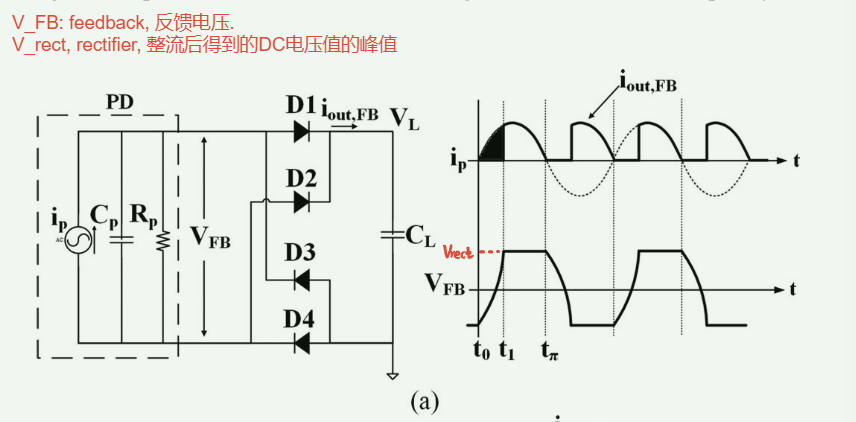
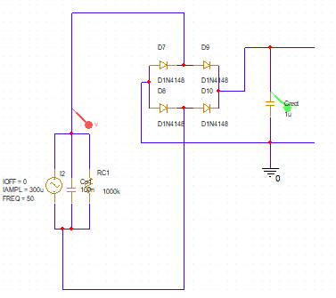
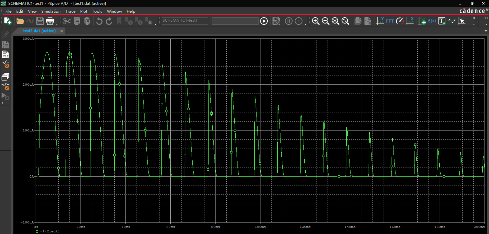
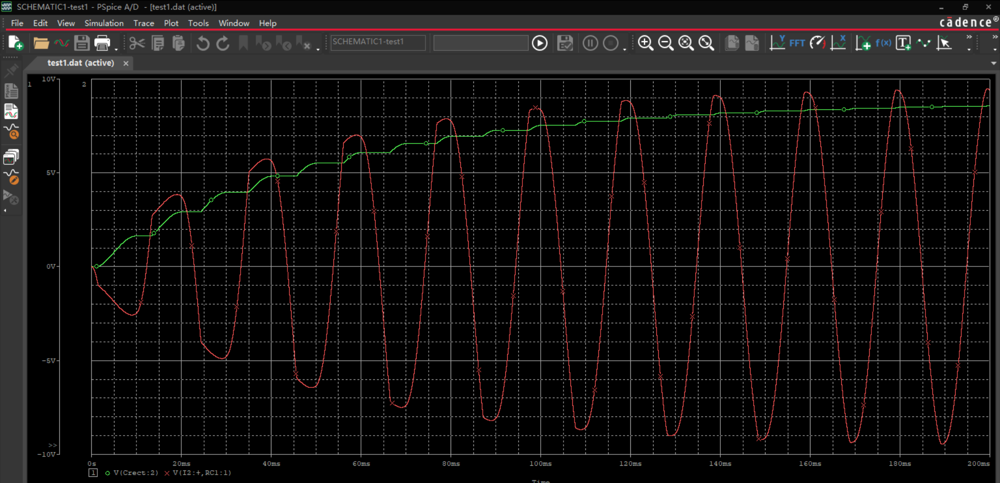
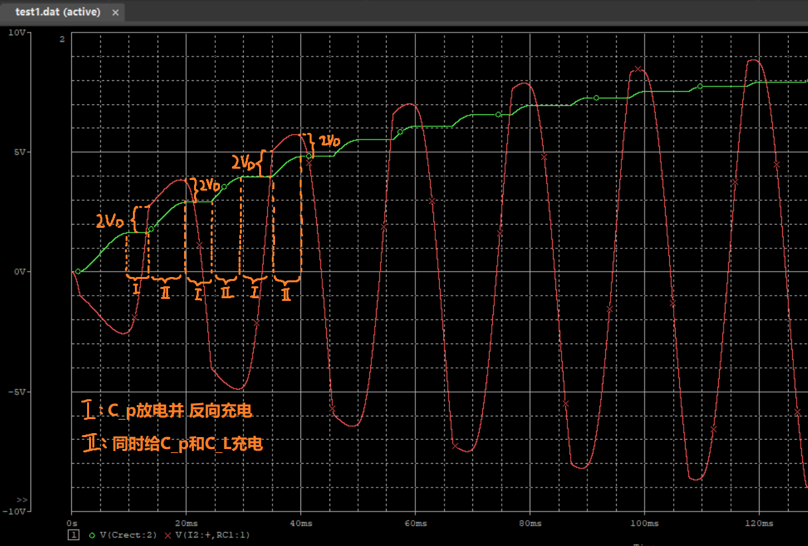
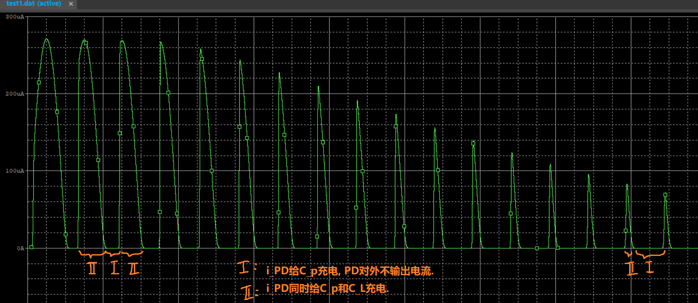

##

##

## 最简单的标准整流: full_wave电路的局限性

其中:
- $V_{FB}$: feedback, 反馈电压. 此处即$C_{rect}$两端电压值. 
- $V_{rect}$, rectifier, 整流后得到的DC电压值的峰值

实际上的仿真结果:
电路图:

$i_L$曲线:

$V_L(green)$ & $V_{FB}(red)$曲线

全波整流下, 每次PD想要给$C_L$充电时, 首先需要克服整流电桥的$2V_D$导通电压; 其次需要输出电压$V_{FB}$达到和当前$C_L$储存电压的高度, 才可以开始给$C_L$充电.

然而发现, $V_{FB}$同时也是$C_p$两端电压, 也就是说, 每次PD想要给$C_L$充电时, 都需要先将$C_p$充电到$±(C_L+2V_D)$, 才能开始给$C_L$充电.

可以看出, 该电路下1u的电容大概300ms充分充电. 而$V_{rect}$是一个简化的概念, 即认为Ⅱ阶段的$V_{FB}$

## 一种P-SSHI电路

### 一个周期内的时序行为:

1.  **机械加载 → 压电电压上升**  
    振动使 CpC\_pCp​ 产生交变电压 vp(t)v\_p(t)vp​(t)，电压随位移同相变化。
    
2.  **到达峰值（速度为零）**  
    当压电电压到峰值（正峰或负峰），此时压电电流为零。控制器检测到这一瞬间，**打开 MOSFET**，使 CpC\_pCp​ 与电感 LLL 形成谐振回路。
    
3.  **电压翻转**  
    在谐振回路中，CpC\_pCp​ 的电压在 LLL 的作用下被快速翻转（正负极互换）；谐振时间约为半个 LC 周期：
    
    Tflip≈πω0\=πLCp T\_{\\mathrm{flip}} \\approx \\frac{\\pi}{\\omega\_0} = \\pi\\sqrt{LC\_p}Tflip​≈ω0​π​\=πLCp​​
4.  **开关断开 → 恢复高阻**  
    半个周期后，MOSFET 断开，回路切换回原先的高阻状态。此时 CpC\_pCp​ 两端已完成电压反向。
    
5.  **能量流入整流部分**  
    voltage polarity 翻转后，压电电压与整流电容 CsC\_sCs​ 之间形成有利的电压差，更大幅度地推动电荷经过整流桥流入 CsC\_sCs​，从而把更多机械能转换为储能电荷。
    
6.  **振动过零 → 重复**  
    当 vpv\_pvp​ 从峰值回落并过零、到另一峰值时，控制器再次同步闭合开关，重复上述翻转／充电步骤。
    

* * *

### 为什么效率更高？

-   **相位对准**：电压翻转后，压电电流与压电电压相位几乎对齐，减少了无功功率损耗。
    
-   **增大电压摆幅**：翻转操作让压电电压幅值翻倍（正峰 → 负峰），使更多电能在一次振动中被抽取。
    
-   **避免电容泄漏**：快速谐振切换，减少压电电容自放电损失。
    

两点:
P-SSHI 通过在每个机械位移极值处“同步开关 + L⁠C 谐振翻转”策略，最大化压电器件输出电压摆幅并对齐电流相位，从而显著提升给 C-rect 充能的效率.

## 一种新式SSHI电路.

[1] S. Lu and F. Boussaid, "A highly efficient P-SSHI rectifier for piezoelectric energy harvesting," IEEE Transactions on Power Electronics, vol. 30, no. 10, pp. 5364–5369, Oct. 2015.

##

