# 机电耦合系数是啥?

**机电耦合系数×电压=机械力**.

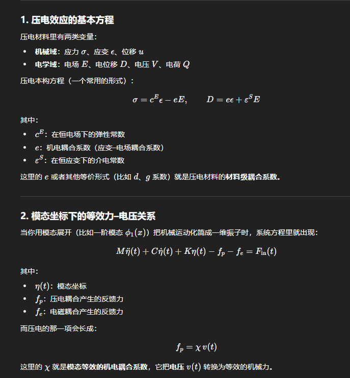

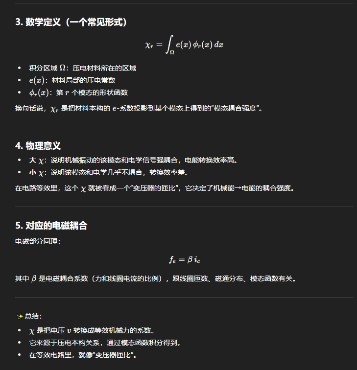

# 计算PDE

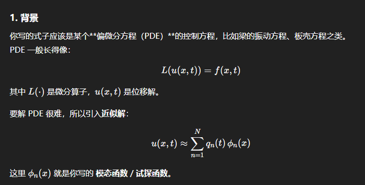

## 加权余量法 (Weighted Residual Method, WRM)

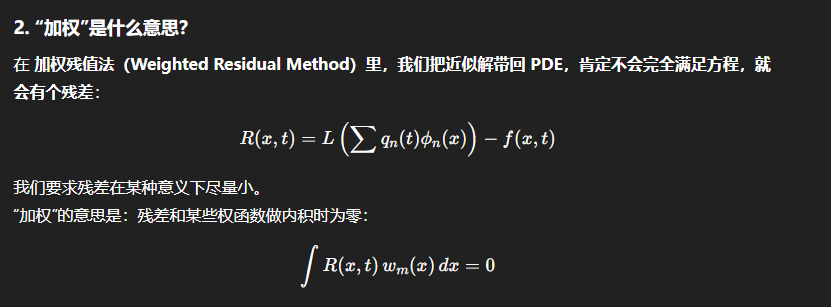

(这是N个积分式. 其中积分域Ω指的是原始PDE方程定义的空间区域, 比如一维问题中是梁长, $Ω\=\[0,L\]$)

* 这些模态函数基底是怎麽得到的?
  忘记了...解某个本征函数得到一个个本征解.
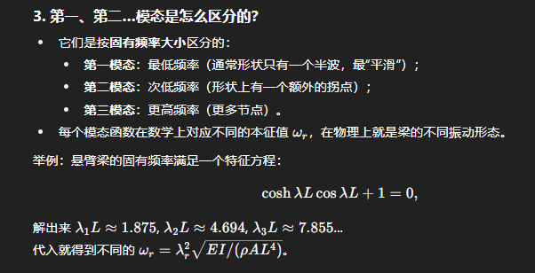

### Galerkin 法 / Rayleigh–Ritz

能和残差R(x,t)相乘为0的权函数w(x)有非常多种选择方式, 比如0. 我们要选出一组N个w_m(x).

Galerkin 法 指的是具体如何去选择这组权函数w_m(x): 直接令$w_m(x)=ϕ_m(x)$.

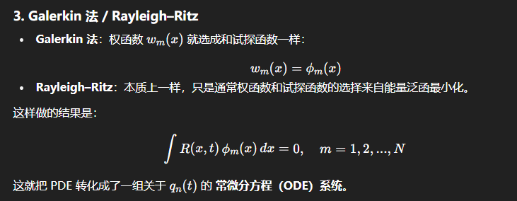

以Euler–Bernoulli 梁方程为例.

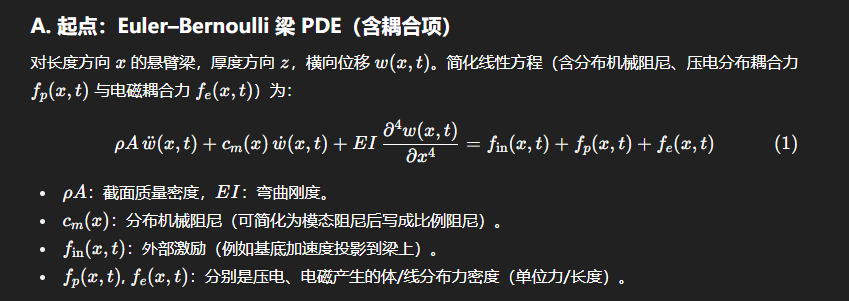

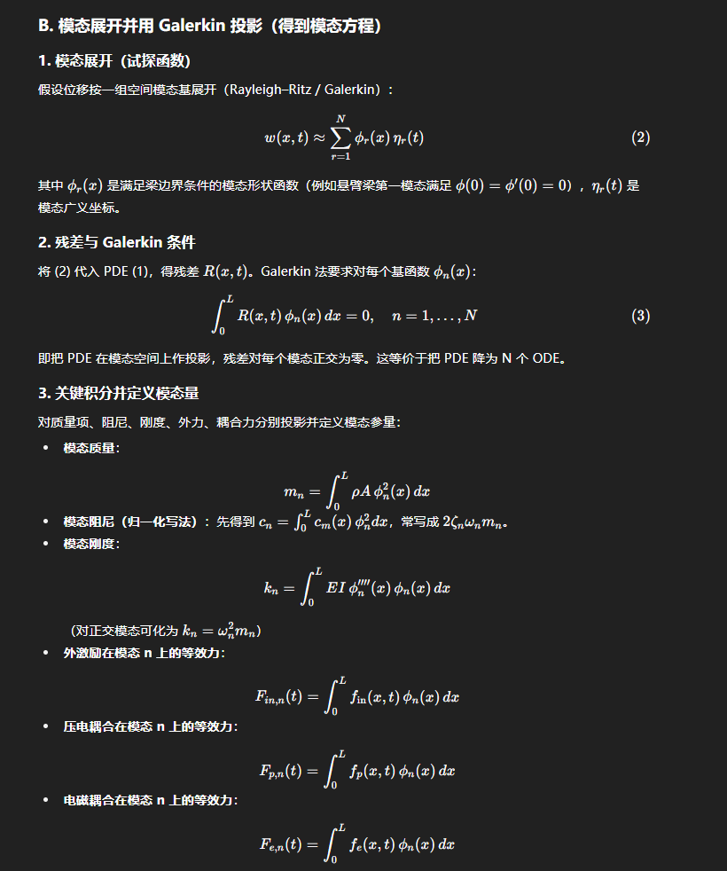

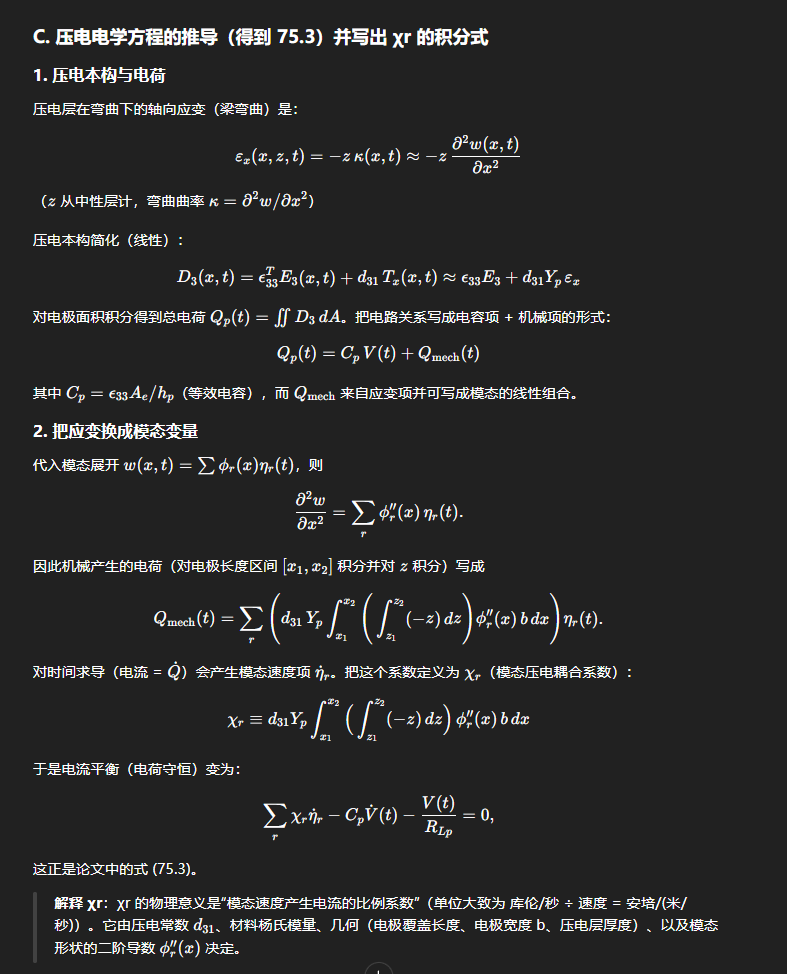

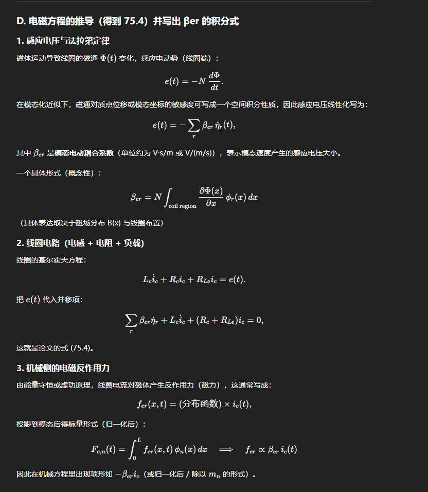

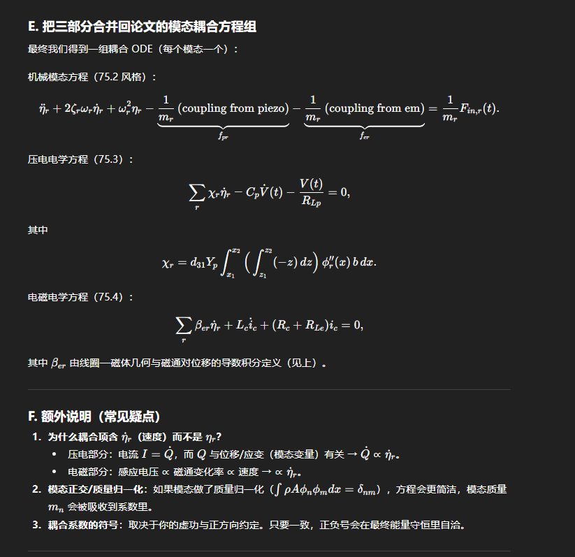

