# 9 STM32CubeMX


## 9.0 简å•å…¥é—¨ç¤ºä¾‹

我们使用å‹å·:é‡ç«æŒ‡å—者. 它使用的MCU是
`stm32f103vet6`


| ç±»å‹       | ä½ç½®è¯´æ˜                        | ä¾‹å­                                             |
| -------- | --------------------------- | ---------------------------------------------- |
| **内部外设** | 集æˆåœ¨èŠ¯ç‰‡ç¡…ç‰‡é‡Œçš„åŠŸèƒ½æ¨¡å—               | SPIã€I2Cã€UARTã€ADCã€DACã€SDIOã€CANã€FSMCã€USBã€å®šæ—¶å™¨ç­‰    |
| **外部外设** | 独立的芯片或模å—，焊在开å‘æ¿ä¸Šï¼Œé å¼•è„šä¸ MCU è¿æ¥ | 传感器模å—（温度ã€æ¹¿åº¦ï¼‰ã€è“牙模å—ã€å­˜å‚¨èŠ¯ç‰‡ï¼ˆSPI Flash）ã€æ¶²æ™¶å±ã€æŒ‰é”®ã€LED ç­‰ |


#### 9.0.1. 创建项目æµç¨‹:
使用三ç§æ–¹å¼åˆ›å»ºæ–°å·¥ç¨‹: 
* 1.选择MCU
* 2.选择æ¿å­
* 3.选择example

我们选择MCU, æœç´¢stm32f103vet6, 选择åŒå‡»:


至此创建了一个新的cube工程.

#### 9.0.2. Pinouts&Configuration


在芯片图上点击æŸä¸ªå¼•è„š, 会让你选择该引脚的å¤ç”¨åŠŸèƒ½:


以PC13为例:

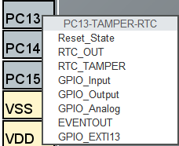

| é€‰é¡¹å                 | å«ä¹‰               | 用途                                 |
| ------------------- | ---------------- | ---------------------------------- |
| **PC13-TAMPER-RTC** | 默认å称（芯片å¤ä½å的默认功能） | é€šå¸¸ç”¨äº RTC çš„ **防篡改输入**，但默认状æ€ä¸æ˜¯ GPIO  |
| **Reset\_State**    | 芯片å¤ä½åé»˜è®¤çŠ¶æ€        | STM32 上电å此引脚默认处äºæµ®ç©ºè¾“å…¥æ¨¡å¼             |
| **RTC\_OUT**        | RTC 时钟输出         | 用äºå°† RTC çš„ 1Hz ä¿¡å·è¾“出到外部设备（æ少用）       |
| **RTC\_TAMPER**     | RTC 篡改检测输入       | 如æœä½ å¯ç”¨ RTC 防篡改功能，它作为输入检测外部é法干预（如é‡å¯ï¼‰ |
| **GPIO\_Input**     | 通用输入             | 作为普通数字输入引脚                         |
| **GPIO\_Output**    | 通用输出             | 💡 最常用模å¼ï¼Œç”¨äºç‚¹ç¯ã€é©±åŠ¨å¤–设等                |
| **GPIO\_Analog**    | æ¨¡æ‹Ÿè¾“å…¥æ¨¡å¼           | 如 ADC 输入（在 PC13 上ä¸ä¼šè¿™ä¹ˆç”¨ï¼‰            |
| **EVENTOUT**        | è¾“å‡ºäº‹ä»¶ä¿¡å·           | 用äºä½åŠŸè€—应用中的事件触å‘，æ少用                  |
| **GPIO\_EXTI13**    | 外部中断线 13         | 把这个引脚设置æˆä¸­æ–­æºï¼Œå¦‚æŒ‰é”®è§¦å‘ `EXTI13` 中断      |

>å¯ä»¥æ–¹ä¾¿çœ‹åˆ°PC14å’ŒPC15分别有一个`RCC_OSC32_IN`å’Œ`RCC_OSC32_OUT`. 这两个å¤ç”¨å¼•è„šç”¨äºè¿æ¥`LSE`外部ä½é€Ÿæ™¶æŒ¯çš„输入输出端. å¯ç”¨LSE的时候, PC14å’ŒPC15会被å ç”¨. 所以一般PC14å’ŒPC15ä¸ç»å¸¸ç”¨ä½œå…¶ä»–用途了.

#### 9.0.3 é…ç½®gpio

我们以é…ç½®PC13为gpio输出模å¼ç„¶å用æ¥ç‚¹ç¯ä¸ºä¾‹.

å³è¾¹èŠ¯ç‰‡å›¾ä¸­é…ç½®PC13为`GPIO_Output`, 然å左边选择System Core->GPIO, 在Configuration横æ é€‰æ‹©é…置好的PC13è¡Œ, 下方出ç°config选项.

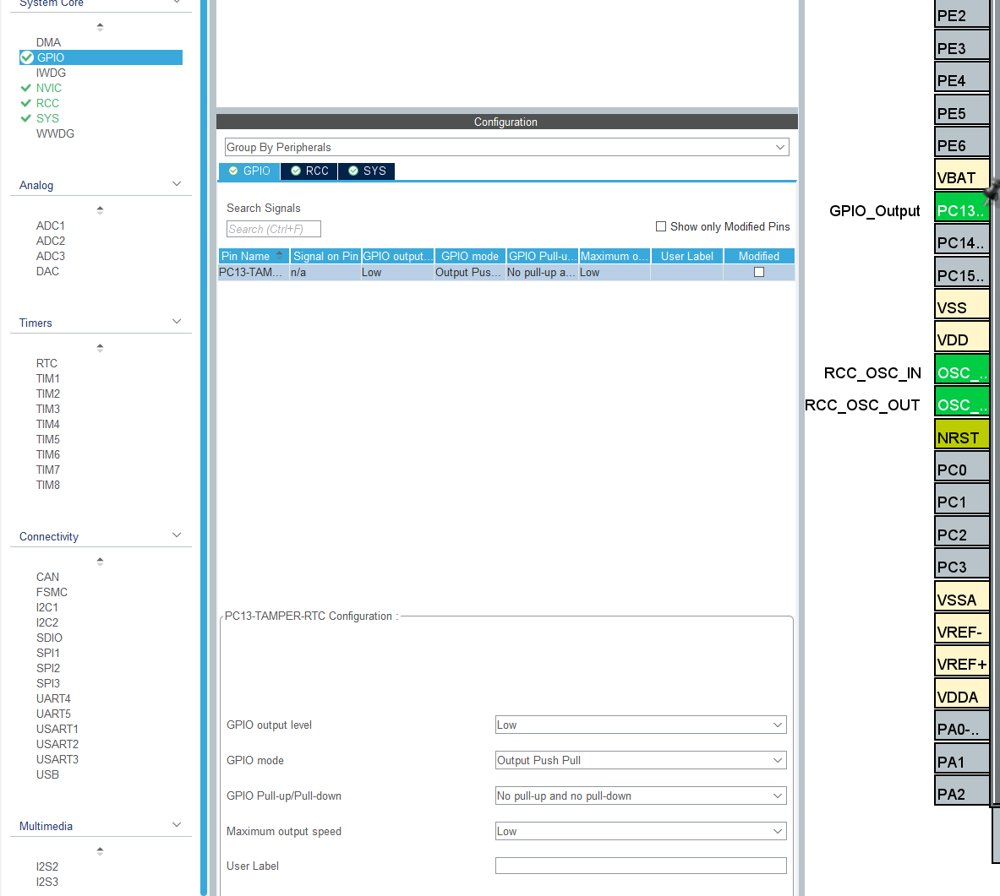

| 选项å称                       | å«ä¹‰                     | æ¨è设置（点ç¯ç”¨ï¼‰                       |
| -------------------------- | ---------------------- | ------------------------------- |
| **GPIO Output Level**      | 上电åˆå§‹åŒ–时该引脚输出的是高电平还是ä½ç”µå¹³  | 🔺 `High`（先熄ç¯ï¼‰æˆ– `Low`（先亮）       |
| **GPIO Mode**              | 引脚工作模å¼ï¼ˆæ¨æŒ½è¾“出(强制高(3.3v)ä½(0v)电平, 有拉电阻能力, 但是无法åšåˆ°æ¯”如说你想让引脚æ¥å…¥5v会æåæ¿å­)或开æ¼è¾“出(没有拉电阻能力需è¦å¤–部电路)）      | ✅ `Output Push Pull`（点ç¯ç”¨ï¼‰       |
| **GPIO Pull-up/Pull-down** | 是å¦å¯ç”¨èŠ¯ç‰‡å†…部的å¯ç¼–程电阻é…置为上下拉电阻（对输出æ¥è¯´é€šå¸¸æ— æ•ˆï¼‰   | ⌠`No pull-up and no pull-down` |
| **Maximum Output Speed**   | IO å£è¾“出电平切æ¢é€Ÿåº¦ï¼ˆç›¸å½“äºé©±åŠ¨èƒ½åŠ›ï¼‰  | ✅ `Low`（PC13 驱动能力本就弱, 点ç¯ä¹Ÿä¸è¦æ±‚）           |
| **User Label**             | ä½ å¯ä»¥ç»™è¿™ä¸ªå¼•è„šèµ·ä¸ªå字，生æˆä»£ç æ—¶è‡ªåŠ¨åŠ å® | å¯é€‰ï¼Œå¦‚命å为 `LED1`                  |


#### 9.0.4 é…ç½®RCC:

在Pinout&Configuration -> System Core -> RCC 处é…ç½®.

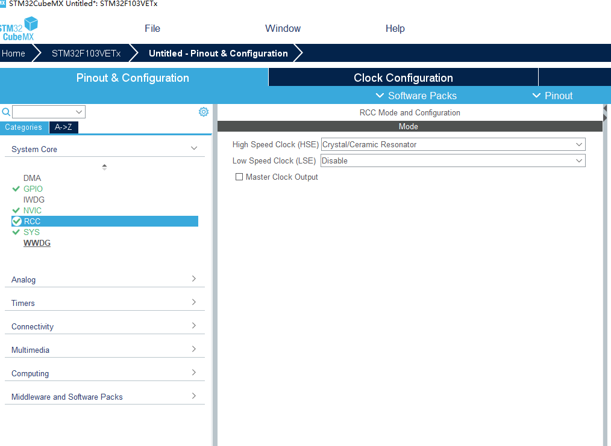


HSEå’ŒLSE在这里é…ç½®, 选项都一样.

| 选项                          | è¯´æ˜                               |
| ----------------------------- | -------------------------------- |
| `Disable`                     | 关闭 HSE，ä¸ä½¿ç”¨å¤–部晶振（åªé å†…部 RC 振è¡å™¨ HSI）  |
| `BYPASS Clock Source`         | 外部æ供时钟信å·ï¼ˆä¸æ˜¯æ™¶æŒ¯ï¼Œè€Œæ˜¯æ¨¡å—，如 TCXO）       |
| `Crystal/Ceramic Resonator` ✅ | 用外æ¥æ™¶æŒ¯ï¼Œ**大多数开å‘æ¿éƒ½é€‰è¿™ä¸ª**（比如 8MHz 晶振） |


选项**Master Clock Output (MCO)** å³æŠŠè‡ªå·±ä¸»é¢‘输出到æŸä¸ªå¼•è„šï¼ˆå¦‚ PA8）â€çš„功能，一般用äºè°ƒè¯•æˆ–外部åŒæ­¥ã€‚


#### 9.0.5 é…ç½®SYS(系统)

在Pinout&Configuration -> System Core -> SYS 处é…ç½®.

é…ç½®SYSTEM:


* Debug项

该项决定**调试æ¥å£**å’Œ**跟踪功能**使用哪些引脚. 一般设为Serial Wire. 

| 选项å称                                     | 引脚å ç”¨                                 | å«ä¹‰/用途                   |
| ---------------------------------------- | ------------------------------------ | ----------------------- |
| **Serial Wire**                          | 2 个引脚：`SWDIO` + `SWCLK`              | æ¨è ✅：常用的调试方å¼ï¼ˆSWD）       |
| **JTAG (4 pins)**                        | 4 个引脚：`JTDI`, `JTDO`, `JTCK`, `JTMS` | è€å¼è°ƒè¯•æ–¹å¼ï¼ˆå¾ˆå°‘用了）            |
| **JTAG (5 pins)**                        | 5 ä¸ªå¼•è„šï¼šä¸Šé¢ 4 个 + `nTRST`               | 更完整的è€å¼ JTAG æ¥å£          |
| **Trace Asynchronous SW**                | åŸºäº SWD，å†ç”¨é¢å¤–å¼•è„šè¾“å‡ºè°ƒè¯•è·Ÿè¸ªæ•°æ®                | 高级 Trace 功能，STM32F1 ä¸å¸¸ç”¨ |
| **JTAG with Trace Synchro (1/2/4 bits)** | JTAG + Trace è¾“å‡ºé€šé“                    | STM32F1 系列ä¸æ”¯æŒ           |
| **Trace Synchro SW (1 bit)**             | SWD + 1 æ¡ Trace 输出线                  | STM32F1 系列ä¸æ”¯æŒ           |


#### 9.0.6 é…置其他å„ç§å¤–设

在Pinout&Configuration->Analog(é…ç½®ADCå’ŒDAC); Timers(é…ç½®TIM)...


#### 9.0.7 Clock Configuration


Clock Configurationç•Œé¢å¦‚下图, 其中采用了常用的é…ç½®.

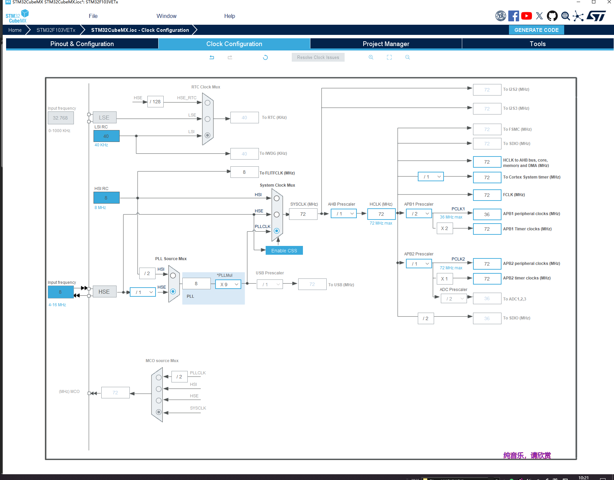

* input frequency:

	å¯ä»¥çœ‹åˆ°æœ€å·¦è¾¹ä¸»æ—¶é’Ÿæ ‘有两个input frequency, 上é¢é‚£ä¸ª32.768KHz的是LSE. 在Pinout&Configration里没开的è¯å°±æ˜¯ç°è‰²çš„. 下é¢è¿™ä¸ªæ˜¯HSE, å³æ¿å­ä¸Šç„Šçš„外部晶体晶振.

* 两个内部振è¡å™¨LSI, HSI在左上角.

* PLL Source Mux

	这个å¤é€‰å™¨å†³å®šè¦å€é¢‘æ¥è‡ªHSEçš„ä¿¡å·è¿˜æ˜¯HSIçš„ä¿¡å·. 一般选择HSE.

* PLLMul

	å¯ä»¥é€‰æ‹©PLLçš„å€é¢‘å€æ•°. 对`stm13f103vet6`, 最高主频72MHz, 此处å¯ä»¥é€‰æ‹©`×9`.


	如æœPinouts&Configs没有选择conectivity->USB通讯, 则此处为ç°

	

* System Clock Mux:
  
	

	这个å¤é€‰å™¨é€‰æ‹©STM32çš„**主系统时钟SYSCLK**æ¥è‡ªå“ªä¸ªæº.
	在**选择HSE/HSE分频得到的PLLCLK为æº**的时候å¯ä»¥é€‰æ‹©æ˜¯å¦å¯ç”¨CSS(clock security system). 如æœå¯ç”¨, 它会在HSE震è¡å¤±è´¥çš„时候生æˆä¸€ä¸ªä¸å¯å±è”½ä¸­æ–­(NMI), 然å自动切æ¢åˆ°HSI.

* AHB Prescaler; APB1 Prescaler

AHBå’ŒAPB1分频. 分频的结æœå¿…é¡»ä¿è¯ä¸è¶…过该时钟线å…许的最大值. 比如下图的é…置中, 导致APB1总线时钟`PCLK1`最终为72KHz, 超过了å…许的最大值`36 MHz max`, äºæ˜¯åˆ†é¢‘器和PCLK1结æœä¸¤ä¸ªæ¡†æ ‡çº¢è¡¨ç¤ºé”™è¯¯. 需è¦æŠŠAPB1 Prescaler设为`/2`.


## 9.1 HAL库的NVIC中断å®ç°:

在MX图形化é…置界é¢->NVICé…ç½®, 在这里å¯ä»¥å‹¾é€‰ä½ æƒ³è¦ç”¨çš„中断.

勾选的外设中断会导致在`stm32f1xx_it.h`中自动生æˆå¯¹åº”的中断函数. 它们都会调用一个很å¤æ‚的中断处ç†å‡½æ•°, 其中有é常多的弱定义. æ ¹æ®ä½ çš„å®é™…中断类å‹, 在æŸä¸ªåœ°æ–¹(main.c 或者对应外设.c)å®ç°ä½ çš„业务逻辑.

举个例å­.

勾选rtc中断å, 在`stm32f1xx_it.h`中会自动生æˆè¿™ä¸€æ®µ:

```c
void RTC_IRQHandler(void)
{
  /* USER CODE BEGIN RTC_IRQn 0 */
//这里是让你写触å‘中断之å‰çš„抢先逻辑. 一般å¯ä»¥ä¸å†™
  /* USER CODE END RTC_IRQn 0 */
  HAL_RTCEx_RTCIRQHandler(&hrtc);
  /* USER CODE BEGIN RTC_IRQn 1 */
//中断之å的逻辑. 一般å¯ä»¥ä¸å†™.
  /* USER CODE END RTC_IRQn 1 */
}
```

其中, `HAL_RTCEx_RTCIRQHandler`é常长, 其中弱定义了很多函数, 比如
```c
__weak void HAL_RTCEx_RTCEventCallback(RTC_HandleTypeDef *hrtc)
__weak void HAL_RTCEx_RTCEventErrorCallback(RTC_HandleTypeDef *hrtc)
__weak void HAL_RTCEx_Tamper1EventCallback(RTC_HandleTypeDef *hrtc)
//...
```

它们对应ä¸åŒçš„中断情况, 会根æ®å…·ä½“å‘生的中断执行其中一个. 需è¦è‡ªå·±æŸ¥ä½ ç”¨çš„中断是哪个.  下é¢æ˜¯ä¸€äº›ä¾‹å­.
-   **定时器更新中断 (Update event)** → `HAL_TIM_PeriodElapsedCallback`   
-   **定时器输入æ•è·äº‹ä»¶** → `HAL_TIM_IC_CaptureCallback`   
-   **定时器输出比较事件** → `HAL_TIM_OC_DelayElapsedCallback`   
-   **RTC Alarm** → `HAL_RTC_AlarmAEventCallback`   
-   **UART æ¥æ”¶å®Œæˆ** → `HAL_UART_RxCpltCallback`

我们这个例å­è¦ç”¨RTC触å‘alarm中断, 所以è¦å®ç°çš„å›è°ƒå‡½æ•°æ˜¯:
```c
void HAL_RTC_AlarmAEventCallback(RTC_HandleTypeDef *hrtc)
```

下é¢æˆ‘们å»`rtc.c`, 找个地方å®ç°è¿™ä¸ªå‡½æ•°, 里é¢å°±æ˜¯æˆ‘们的中断逻辑.

注æ„:

在标准库 SPL 里，IRQHandler 必须你手动åšä¸‰ä»¶äº‹ï¼š
1.  **判断中断æº** (`RTC_GetITStatus`)   
2.  **清除中断标志** (`RTC_ClearITPendingBit`, `RTC_WaitForLastTask`, `EXTI_ClearITPendingBit`)   
3.  **执行用户逻辑** (`rtc_alarm_triggered = 1;` 等)

而在HAL库开å‘, 1,2å·²ç»åœ¨è¿™ä¸ª`HAL_RTC_AlarmAEventCallback()`函数里全都安æ’好了. ä½ åªéœ€è¦å†™ä¸šåŠ¡é€»è¾‘.


```c
//åŸæ¥æ ‡å‡†åº“写的RTC中断函数:
void RTCAlarm_IRQHandler(void)
{
    if (RTC_GetITStatus(RTC_IT_ALR) != RESET)
    {
				//清除中断标志
        RTC_ClearITPendingBit(RTC_IT_ALR);
			
				//清除外部中断线
        RTC_WaitForLastTask();
			
				//设置闹钟触å‘å˜é‡ä¸º1

        rtc_alarm_triggered = 1;
			
		/*****************redé—ªçƒ******************************/
		//GPIO_ResetBits(GPIOB, GPIO_Pin_5);				Delay(0x0FFFFF);
		//GPIO_SetBits(GPIOB, GPIO_Pin_5);					Delay(0x0FFFFF);
		//GPIO_ResetBits(GPIOB, GPIO_Pin_5);					Delay(0x0FFFFF);
		//GPIO_SetBits(GPIOB, GPIO_Pin_5);					Delay(0x0FFFFF);
		/*****************redé—ªçƒ******************************/
						
				EXTI_ClearITPendingBit(EXTI_Line17);
    }
}


//ç°åœ¨ä½ åœ¨HAL库开å‘中åªéœ€è¦åœ¨tim.c(ä½ è¦æ˜¯æƒ³ä¹Ÿå¯ä»¥åœ¨main.c)里å®ç°è¿™ä¸ªåå­—çš„å›è°ƒå‡½æ•°:
void HAL_RTC_AlarmAEventCallback(RTC_HandleTypeDef *hrtc){

    // 设置闹钟触å‘标志
    rtc_alarm_triggered = 1;

    /*****************redé—ªçƒ******************************/
    //HAL_GPIO_WritePin(GPIOB, GPIO_PIN_5, GPIO_PIN_RESET); Delay(0x0FFFFF);
    //HAL_GPIO_WritePin(GPIOB, GPIO_PIN_5, GPIO_PIN_SET);   Delay(0x0FFFFF);
    //HAL_GPIO_WritePin(GPIOB, GPIO_PIN_5, GPIO_PIN_RESET); Delay(0x0FFFFF);
    //HAL_GPIO_WritePin(GPIOB, GPIO_PIN_5, GPIO_PIN_SET);   Delay(0x0FFFFF);
    /*****************redé—ªçƒ******************************/	
}

```


## 9.2 HAL库FATFS读å–SDå¡çš„å®ç°


图形化界é¢å¼€å¯FATFSå, 产生了很多文件:

* ./FATFS/App下有: 
  * fatfs.c, 
  * fatfs.h 

* ./FATFS/Target下有
  * ffcon.h, 
  * user_diskio.c, 
  * user_diskio.h

* ./Middlewares/Third_Party/FatFs/src/下有
  * diskio.c, 
  * ff.c, 
  * diskio.h, 
  * integer.h...

**这些目录/文件的角色...先看懂å†æ”¹.**

-   `Middlewares/Third_Party/FatFs/src/`  
    这是 FatFs çš„**上层中间件å®ç°**（核心库文件：`ff.c`ã€`ff.h`ã€ä»¥åŠä¸€ä¸ªé€šç”¨çš„ `diskio.c` ）。通常 `diskio.c` 是 FatFs 和硬件驱动之间的“æ¥å£å±‚â€æ¨¡æ¿ï¼ˆæœ‰æ—¶é‡Œé¢ä¼šè°ƒç”¨ä½ åœ¨ Target 下å®ç°çš„ä½å±‚函数）。**ä¸è¦ç›²æ”¹æ ¸å¿ƒåº“**，除é你知é“在åšä»€ä¹ˆã€‚
    
-   `./FATFS/Target/`  
    这个目录通常是放**æ¿çº§/目标平å°çš„å®ç°**（ä½å±‚ç£ç›˜é©±åŠ¨ã€GPIO/CS 具体å®ç°ï¼‰çš„地方，CubeMX æœ‰æ—¶ä¼šç”Ÿæˆ `user_diskio.c` 在这里，目的是让你把具体的硬件å®ç°æ”¾è¿™é‡Œä»¥é¿å…改动中间件。优先在这里å®ç° SPI 版本的ç£ç›˜é©±åŠ¨ã€‚
    
-   `./FATFS/App`（fatfs.c/h）  
    这是示例应用层（how to use FatFs）。通常ä¸éœ€è¦åŠ¨å®ƒï¼Œé™¤éä½ è¦æ”¹å˜ mount/路径/行为。


## 9.3 HAL库的USART


CUBEMXé…ç½®USART这样就å¯ä»¥. 一般我们使用异步收å‘, 就是åŒæ—¶å¯ä»¥æ”¶å‘.

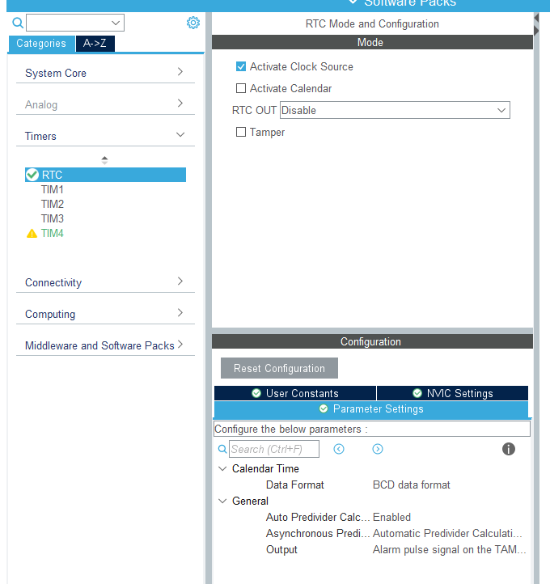


常用HAL库函数:

首先, CUBEMX自动生æˆçš„usart.c中会声æ˜ä¸€ä¸ªUSART外设å¥æŸ„`huart1`或2/3如æœä½ ç”¨USART2/3çš„è¯.


```C

//阻å¡å‘é€. 串å£å¥æŸ„: huart1
//è¦å‘é€çš„æ•°æ®ä¸º(uint8_t *)"[æ•°æ®å­—符串]"
//æ•°æ®é•¿åº¦ä¸º7(这个å¯ä»¥ç”¨strlen()函数)
//阻å¡è¶…时时间. HAL_MAX_DELAY=0xFFFF FFFF U. 这里就是一直等待.
HAL_UART_Transmit(&huart1, (uint8_t *)"Hello\r\n", 7, HAL_MAX_DELAY);

```


### 9.3.1 DEBUG: å›ç¯æµ‹è¯•

这是调试å°æŠ€å·§. 当usartä¸å·¥ä½œæ—¶.

首先是MCU自å›ç¯. ä¸è¿æ¥CH340, 短æ¥TXå’ŒRX, è¿è¡Œä¸‹é¢çš„å›ç¯ä»£ç (æ€è·¯å°±æ˜¯å‘é€æ•°æ®, 然åæ¥æ”¶æ•°æ®, 看能å¦æ¥æ”¶åˆ°.) å¯ä»¥ä½¿ç”¨äº®ç¯/OLED等手段查看return结æœ.

如æœMCU没问题, 继续æ’查ch340串å£. è¿æ¥ch340串å£è®¾å¤‡, 在PC端å›ç¯æŸ¥çœ‹èƒ½å¦æ‰“å°ä¿¡æ¯.


```C
//串å£æµ‹è¯•
#if 1
//printf("usart test\r\n");


  /* ç®€å• MCU loopback test (blocking) */
  /* 先把 PA9 ä¸ PA10 短æ¥ï¼ˆç‰©ç†ï¼‰ */
  uint8_t tx[] = "LOOPTEST\r\n";
  uint8_t rx;
  HAL_StatusTypeDef st;

  /* å‘é€ä¸€ä¸² */
  st = HAL_UART_Transmit(&huart1, tx, sizeof(tx)-1, 100);
  if (st == HAL_OK) {
      /* è¯»å– 1 字节看看能å¦æ¥åˆ°ï¼ˆé˜»å¡ 200ms） */
      if (HAL_UART_Receive(&huart1, &rx, 1, 200) == HAL_OK) {
          /* 收到åå†å‘å› PCï¼ˆå¦‚æœ CH340 è¿æ¥ä¸”工作，则PC会看到） */
          HAL_UART_Transmit(&huart1, &rx, 1, HAL_MAX_DELAY);
      } else {
          /* 没收到：å¯ä»¥ç”¨LED或断点æ示 */
    	  sparckle_fast(20);
      }
  }
  HAL_Delay(500);

#endif
```

请ä¸è¦çŠ¯USARTçš„TX, RXè¿æ¥åˆ°CH340çš„TX, RXçš„ä½çº§é”™è¯¯. 

CH340çš„TX应该è¿USARTçš„RX.


## 9.4 分æ.elf文件: 最後攻勢

我真的ä¸çŸ¥é“为什麽printf()函数ä¸èƒ½é‡å®šå‘æˆåŠŸ.

我ç°åœ¨å¿…须找到它具体的å®ç°è¿‡ç¨‹äº†.

项目编译å, 默认一般生æˆ.elf文件, ä½ç½®åœ¨`./adc_v1.0/Debug/adc_v1.0.elf`

如æœæ²¡æœ‰, 看一下设置:
***
在MX项目中, 选择生æˆ.elf文件. 
Project → Properties → C/C++ Build → Settings → MCU GCC Linker → Miscellaneous

其中有两个框å¯ä»¥æ供命令行å‚æ•°(用空格隔开.)

* Other flages: 给链æ¥å™¨æä¾›é¢å¤–命令行å‚æ•°.
  * `-specs=rdimon.specs`: å¯ç”¨**semihosting(åŠä¸»æœº)**. 一ç§ç‰¹æ®Šè°ƒè¯•æ¨¡å¼, 它会æ•è·æ ‡å‡†åº“函数的å®ç°æ–¹å¼.
  * `-specs=nosys.specs` ä¸è¦èµ°è°ƒè¯•ä¸»æœº.
  * `-Wl,-Map=${ProjName}.map` 让linker输出一个`map`文件, 文件å为`${ProjName}.map`
* Additional object files: 手工加入想å‚ä¸linkçš„.o/.a文件路径. 一般ä¸ç”¨.
***


使用`arm-none-eabi-nm`命令分æ.elf文件.

这是armæ¶æ„çš„nm(name manager), 会列出目标文件的所有符å·`symbol`.

eabi(embedded appplication binary interface), 嵌入å¼åº”用二进制æ¥å£


先检索包å«printf符å·çš„指令部分.

```bash
azazel@DESKTOP-NJKSK6O:/mnt/f/aza/STM32CUBE_IDE_WORKSPACE/adc_v0.1/Debug$ arm-none-eabi-nm -C adc_v0.1.elf | grep printf
08004a34 T _printf_common
080045dc W _printf_float
08004b18 T _printf_i
08007c14 T _svfiprintf_r
08007c14 T _svfprintf_r
08007e5c T _vfiprintf_r
08007e5c T _vfprintf_r
20000238 B dbg_printf_count
08008af4 T fiprintf
08008af4 T fprintf
080052ec T iprintf
080052ec T printf
0800537c T siprintf
08005310 T sniprintf
08005310 T snprintf
0800537c T sprintf
```

å‘ç°`printf`å’Œ`iprintf`åŒä¸€åœ°å€: 
```
080052ec T iprintf
080052ec T printf
```
è¿™æ„味ç€printf被定义为iprintf的弱符å·æˆ–别å. iå³int, 是简化版的printf，专门用äºåµŒå…¥å¼ç³»ç»Ÿï¼Œä¸æ”¯æŒæµ®ç‚¹æ•°.


ç°åœ¨æ ¹æ®è¿™ä¸ª`iprintf`地å€`080052ec`å汇编附近的指令.

```bash
azazel@DESKTOP-NJKSK6O:/mnt/f/aza/STM32CUBE_IDE_WORKSPACE/adc_v0.1/Debug$ 
arm-none-eabi-objdump -D adc_v0.1.elf --start-address=0x080052ec --stop-address=0x080055ec

adc_v0.1.elf:     file format elf32-littlearm


Disassembly of section .text:

080052ec <iprintf>:
 80052ec:       b40f            push    {r0, r1, r2, r3}
 80052ee:       b507            push    {r0, r1, r2, lr}
 80052f0:       4906            ldr     r1, [pc, #24]   ; (800530c <iprintf+0x20>)
 80052f2:       ab04            add     r3, sp, #16
 80052f4:       6808            ldr     r0, [r1, #0]
 80052f6:       f853 2b04       ldr.w   r2, [r3], #4
 80052fa:       6881            ldr     r1, [r0, #8]
 80052fc:       9301            str     r3, [sp, #4]
 80052fe:       f002 fdad       bl      8007e5c <_vfiprintf_r>
 8005302:       b003            add     sp, #12
 8005304:       f85d eb04       ldr.w   lr, [sp], #4
 8005308:       b004            add     sp, #16
 800530a:       4770            bx      lr
 800530c:       20000030        andcs   r0, r0, r0, lsr r0

08005310 <sniprintf>:
...
```

我们å‘ç°`iprintf`的汇编å®ç°è·³è½¬åˆ°äº†ç¬¦å·`_vfiprintf_r`. 需è¦è¿›ä¸€æ­¥å¯»æ‰¾.

```bash
080052ec <iprintf>:
  ... 
  bl      8007e5c <_vfiprintf_r>
```

我们æ¥å汇编`_vfiprintf_r`这个符å·é™„近的指令.


```bash
azazel@DESKTOP-NJKSK6O:/mnt/f/aza/STM32CUBE_IDE_WORKSPACE/adc_v0.1/Debug$ arm-none-eabi-objdump -D adc_v0.1.elf --start-address=0x08007e5c --stop-address=0x08007e7c

adc_v0.1.elf:     file format elf32-littlearm


Disassembly of section .text:

08007e5c <_vfiprintf_r>:
 8007e5c:       e92d 4ff0       stmdb   sp!, {r4, r5, r6, r7, r8, r9, sl, fp, lr}
 8007e60:       460d            mov     r5, r1
 8007e62:       4614            mov     r4, r2
 8007e64:       4698            mov     r8, r3
 8007e66:       4606            mov     r6, r0
 8007e68:       b09d            sub     sp, #116        ; 0x74
 8007e6a:       b118            cbz     r0, 8007e74 <_vfiprintf_r+0x18>
 8007e6c:       6a03            ldr     r3, [r0, #32]
 8007e6e:       b90b            cbnz    r3, 8007e74 <_vfiprintf_r+0x18>
 8007e70:       f7fd fa06       bl      8005280 <__sinit>
 8007e74:       6e6b            ldr     r3, [r5, #100]  ; 0x64
 8007e76:       07d9            lsls    r1, r3, #31
 8007e78:       d405            bmi.n   8007e86 <_vfiprintf_r+0x2a>
 8007e7a:       89ab            ldrh    r3, [r5, #12]

```

ä¼¼ä¹å‡ºç°äº†ä¸€æ¬¡bl:
```bash
 8007e70:       f7fd fa06       bl      8005280 <__sinit>
```
但是这æ¡æ±‡ç¼–指令`__sinit`是newlib / newlib-nano 的标准 I/O åˆå§‹åŒ–函数. åˆå§‹åŒ–之å还会跳å›æ¥. 继续往下看.


这样自己找`bl`指令太慢了. 使用grip, 把ä»`_vfiprintf_r`开始相当长的一段汇编中的`bl`抓出æ¥:

```bash
azazel@DESKTOP-NJKSK6O:/mnt/f/aza/STM32CUBE_IDE_WORKSPACE/adc_v0.1/Debug$ arm-none-eabi-objdump -d adc_v0.1.elf --start-address=0x08007e5c --stop-address=0x08007fec \
  | grep -E '\bbl\b|\bblx\b'
 8007e70:       f7fd fa06       bl      8005280 <__sinit>
 8007e82:       f7fd fbe0       bl      8005646 <__retarget_lock_acquire_recursive>
 8007e94:       f7fd fb16       bl      80054c4 <__swsetup_r>
 8007eb2:       f7fd fbc9       bl      8005648 <__retarget_lock_release_recursive>
 8007ef0:       f7ff ffa1       bl      8007e36 <__sfputs_r>
 8007f2c:       f7fd fb8d       bl      800564a <memchr>
 8007fbc:       f7fd fb45       bl      800564a <memchr>
 8007fde:       f7fd fb34       bl      800564a <memchr>

```

å¯ä»¥å‘ç°å…³é”®è¾“出函数是`__sfputs_r`. 

而在 newlib / newlib-nano 中，`__sfputs_r` 通常会调用  
...→ `__swrite_r` → `_write_r` → `_write`（弱符å·ï¼Œå¯è¢«ç”¨æˆ·é‡å®šä¹‰ï¼‰.


我们å¯ä»¥éªŒè¯ä¸€ä¸‹`__sfputs_r`是调用`_write_r`çš„, 继续å汇编抓å–bl指令:
```bash
azazel@DESKTOP-NJKSK6O:/mnt/f/aza/STM32CUBE_IDE_WORKSPACE/adc_v0.1/Debug$ arm-none-eabi-nm -C adc_v0.1.elf | grep __sfputs_r
08007e36 T __sfputs_r

```


越æ¥è¶Šä¹±äº†...


最终解决了é‡å®šå‘问题, åªç•™ä¸‹

```c
int __io_putchar(int ch)
{
    uint8_t c = ch & 0xFF;
    HAL_UART_Transmit(&huart1, &c, 1, HAL_MAX_DELAY);
    return ch;
}
```

bugçš„åŸå› :

写了太多é‡å®šå‘函数, 其中包括
```c
int _write_r(struct _reent *r, int file, char *ptr, int len)
{
    (void) r; /* unused */
    return _write(file, ptr, len);
}
```
这个ä¸æ˜¯å¼±ç¬¦å·, å’Œlibc的符å·åº”该冲çªäº†.

åŒæ—¶, æ供了错误/UBç­¾å. `_write_r` çš„ç­¾å/è¿”å›å€¼æœ‰é—®é¢˜ï¼Œå‡½æ•°æ ˆ/寄存器期望被破å. 应该是...


## 9.9 MXå¼€å‘细节...

### 9.9.1 printf&scanf浮点数


默认情况下, MX工程使用`newlib-nano`标准库进行C编译.
**newlib-nano**是一个为嵌入å¼ç³»ç»Ÿç‰¹åˆ«ä¼˜åŒ–的标准C库的简化版本, 节çœFlashå’ŒRAM空间.

它对printf等函数åšäº†æ端精简, åªæ”¯æŒè¯ä¹¦æ ¼å¼(`%d`, `%s`, `%x`...)ç­‰, ä¸æ”¯æŒæµ®ç‚¹æ•°(`%f`, `%lf`, `%.2f`...).

如æœéœ€è¦ä½¿ç”¨printf浮点数, 需è¦è®¾ç½®:

-   **å³é”®é¡¹ç›®** → `Properties`   
-   展开 `C/C++ Build` → 选择 `Settings`   
-   在 `Tool Settings` 选项å¡ä¸­ï¼š   
    -   点击 `MCU/MPU Settings`      
    -   找到 **"Use float with printf from newlib-nano (-u\_printf\_float)", 勾选.**

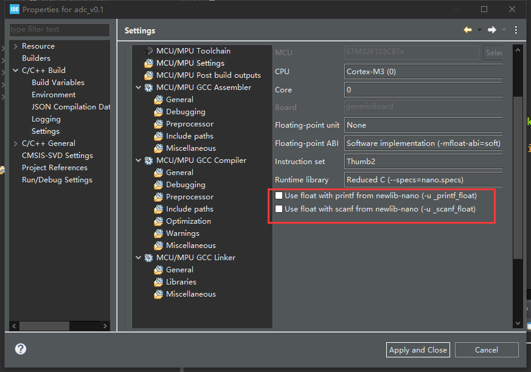

### 9.9.2 IDE的项目树结æ„

**CubeIDE的项目结æ„ç›´æ¥å°±æ˜¯æ–‡ä»¶ç³»ç»Ÿæ˜ å°„!**
***
在 **STM32CubeIDE (åŸºäº Eclipse CDT)** 里：
-   左边的 _Project Explorer_ 本质上就是 IDE 里挂载的工作区目录，它直æ¥æ˜ å°„到你硬盘上的真å®ç›®å½•ç»“æ„。   
-   你在文件管ç†å™¨é‡Œæ–°å»º/删除/移动文件，CubeIDE 里会åŒæ­¥æ›´æ–°ï¼ˆå之亦然）。   
-   所以 `folder`ã€`source folder`ã€`file`ã€`source file` 本质就是告诉 IDE æ€ä¹ˆå¯¹å¾…这个硬盘上的对象，并ä¸æ˜¯â€œå•ç‹¬ç»´æŠ¤ä¸€ä»½è™šæ‹Ÿå·¥ç¨‹ç»“æ„â€ã€‚
    

而 **Keil (MDK-ARM)** 是è€ä¸€å¥—设计：
-   左边的 _Project Tree_ 完全是一个 **虚拟工程视图**，你得手动把文件加进å»ï¼Œä¸ä¼šè‡ªåŠ¨è·ŸéšçœŸå®ç›®å½•ç»“æ„。    
-   å®é™…硬盘目录和工程树没啥绑定关系，所以容易乱ã€å®¹æ˜“出“找ä¸åˆ°æ–‡ä»¶â€çš„å‘。    
-   这就是为啥很多人骂 Keil 傻逼. 它更åƒæ˜¯ 90 年代 VC6 é‚£ç§æ‰‹å·¥ç®¡ç†é¡¹ç›®.  

***


-   **Folder（普通文件夹）**  
    -   就是物ç†æ–‡ä»¶å¤¹ã€‚       
    -   IDE ä¸ä¼šè‡ªåŠ¨æŠŠé‡Œé¢çš„ `.c` / `.h` 当作编译输入，除é该文件夹被包å«åœ¨å·¥ç¨‹çš„编译路径里。        
    -   常用äºå­˜æ”¾æ–‡æ¡£ã€èµ„æºã€æˆ–者临时文件。       
-   **Source Folder（æºæ–‡ä»¶å¤¹ï¼‰**    
    -   这是 Eclipse/CDT 概念：标记为“æºç ç›®å½•â€çš„文件夹会被自动加到 **Include Paths** 和编译器的æœç´¢è·¯å¾„里。       
    -   里é¢æ”¾çš„ `.c/.h` 会默认å‚ä¸ç¼–译。       
    -   如æœä½ ç”¨ CubeIDE 创建 `Source Folder`，它会自动在项目设置里修改 **C Source folders**。
-   Eclipse/CDT 里åªæœ‰**被标记过的一级目录**æ‰æ˜¯ Source Folder。   
-   它的å­ç›®å½•å¦‚æœæ²¡æœ‰å•ç‹¬æ ‡è®°ï¼Œå°±åªæ˜¯æ™®é€š Folder。    
-   但编译器在扫 Source Folder 的时候，会递归进å»ç¼–译 `.c` 文件，所以功能上没区别。


项目树视图的文件夹如æœæœ‰ä¸ªæ–œçº¿åˆ’æ‰, æ„æ€æ˜¯ä¸å‚ä¸ç¼–译. å³é”®->`Properties`->å‚ä¸ç¼–译å³å¯


**注æ„! 有时候IDE里的项目树和å®é™…ç£ç›˜ä¸åŒæ­¥. è¿™ç§æƒ…况必须å°è¯•ç¼–译, å³å¯åŒæ­¥. é‡å¯IDE或者徒劳地在IDE视窗更改是ä¸è¡Œçš„.**


### 9.9.3 特殊的PC13


F103C8T6版本中, PC13引脚åŒæ—¶å¤ç”¨RTC TAMPER(防篡改)功能,

**CUBEMX会生æˆé”™è¯¯çš„代ç **:

当å¯ç”¨RTCæ—¶, å³ä½¿æ²¡æœ‰é€‰æ‹©output功能(RTCåªç”¨æ¥è®¡æ—¶å’Œè§¦å‘中断, ä¸å¯¹å¤–输出)


PC13引脚ä»ç„¶ä¼šè¢«`MX_RTC_Init();`函数写入rtcçš„CR寄存器,  `hrtc.Init.OutPut` 写 `BKP->RTCCR`（把 alarm/second/calib 输出路由到 TAMPER 引脚）, 导致PC13强制拉ä½æ— æ³•ä½¿ç”¨.

解决方å¼: 在`MX_RTC_Init();`之åè¿è¡Œä¸‹é¢çš„代ç , 强制清除 BKP->CR çš„ TPE ä½(Tamper 使能ä½)，把引脚æ¢å¤ä¸ºæ™®é€šç”¨é€”。


```C
#if 1
  /* ---------- 放在 MX_RTC_Init() 完æˆå (USER CODE BEGIN RTC_Init 2) 或 main() 中 ---------- */
  /* ç¡®ä¿åŒ…å« HAL 头文件： stm32f1xx_hal.h */
  /* 1) å…许访问备份域并使能 BKP 时钟 */
  __HAL_RCC_PWR_CLK_ENABLE();
  HAL_PWR_EnableBkUpAccess();      // å…许访问 RTC/BKP 寄存器
  __HAL_RCC_BKP_CLK_ENABLE();

  /* 2) 关闭 RTC 输出到 TAMPER（PC13） —— 清除 RTCCR çš„ CCO/ASOE/ASOS ä½ */
  BKP->RTCCR &= ~(BKP_RTCCR_CCO | BKP_RTCCR_ASOE | BKP_RTCCR_ASOS);

  /* 3) 关闭 Tamper åŠŸèƒ½ï¼ˆç¡®ä¿ TAMPER 引脚ä¸å†è¢«å½“作 Tamper）*/
  BKP->CR &= ~BKP_CR_TPE;


  /* 4) é‡æ–°è®¾ç½®PC13普通GPIO: 示例为æ¨æŒ½è¾“出reset拉高模å¼. */
  __HAL_RCC_GPIOC_CLK_ENABLE();
  GPIO_InitTypeDef GPIO_InitStruct = {0};
  GPIO_InitStruct.Pin = GPIO_PIN_13;
  GPIO_InitStruct.Mode = GPIO_MODE_OUTPUT_PP;
  GPIO_InitStruct.Pull = GPIO_NOPULL;
  GPIO_InitStruct.Speed = GPIO_SPEED_FREQ_LOW;
  HAL_GPIO_Init(GPIOC, &GPIO_InitStruct);
  /* ---------- end ---------- */
#endif
```

### 9.9.4 æ— å“应BUG

有时候会å‘生无å“应打ä¸å¼€è½¯ä»¶.

CUBEIDE的底层框æ¶æ˜¯Eclipse. 用这个框æ¶çš„逻辑一点点æ’查.

CUBEIDEæ¯æ¬¡æ‰“开一个WORKPLACE都会写日志: `工作区地å€/metadata/.log`

上一次失败查看日志, å‘ç°æ˜¯ä»£ç†çš„问题. ä¼¼ä¹cubeide无法访问本地å›ç¯ä»£ç†127.0.0.1:10809? 但是之å‰å¼€ç€ä»£ç†ä¹Ÿæ²¡å‡ºé—®é¢˜å‘€.

但是关æ‰ä»£ç†ä¹Ÿæ²¡ç”¨äº†.

**é‡è£…**一次, 没用. (注æ„放在有中文字符路径会安装报错还ä¸å‘Šè¯‰ä½ ä¸ºå•¥)

**é‡å¯ç”µè„‘**, 解决.


### 9.9.5 SPIä¸å·¥ä½œ


**我们先补充一点SPI和SD的基本知识.**

SPI是按字节传输的.  

调用一次`HAL_SPI_TransmitReceive(&hspi1, &dummy, &resp, n, 200);`
å³ä¼ è¾“n bitæ•°æ®.

在一次字节传输时, 主机å‘é€8个SCK. æ¯ä¸ªå‘¨æœŸ, ä»æœºä»`MISO`输出1bit, 主机ä»

* 调用`HAL_SPI_TransmitReceive(&hspi1, &tx, &rx, 1, 200);` æ„味ç€:
  * 主机å‘é€8个SCK. 
  * æ¯ä¸ªå‘¨æœŸ, ä»æœºå°†åº”答缓冲区`SR_out`ä»`MISO`输出1bit到主机`rx`.
  * æ¯ä¸ªå‘¨æœŸ, 主机将`tx`ä»MOSI输入1bit到ä»æœº`SR_in`.
* 调用`HLA_Transimit(&hspi1, &tx, 1, 200)` æ„味ç€:
  * 主机å‘é€8个SCK. 
  * æ¯ä¸ªå‘¨æœŸ, ä»æœºå°†åº”答缓冲区`SR_out`ä»`MISO`输出1bit到主机, **但主机丢弃**.
  * æ¯ä¸ªå‘¨æœŸ, 主机将`tx`ä»MOSI输入1bit到ä»æœº`SR_in`.
* 调用`HLA_Receive(&hspi1, &rx, 1, 200)` æ„味ç€:
  * 主机å‘é€8个SCK. 
  * æ¯ä¸ªå‘¨æœŸ, ä»æœºå°†åº”答缓冲区`SR_out`ä»`MISO`输出1bit到主机`rx`.
  * æ¯ä¸ªå‘¨æœŸ, 主机将`0x1`ä»MOSI输入1bit到ä»æœº`SR_in`. 也å³dummy字节, 8周期一共å‘é€`FF`.
  * æ¢å¥è¯è¯´, 下é¢ä¸¤ä¸ªå‘½ä»¤æ˜¯ç­‰ä»·çš„:
    * `uint8 tx = 0xFF; HAL_SPI_TransmitReceive(&hspi1, &tx, &rx, n, 200);`
    * `HAL_SPI_Receive(&hspi1, &rx, 1, 200);`

* 一个éµå®ˆSPIä»æœºå议的系统需è¦æœ‰ä¸€ä¸ª**能æ¥æ”¶SCK并å‘é€æ•°æ®çš„缓冲区**. å…¶å®å°±æ˜¯ä¸ª**被动移ä½å¯„存器**. 主机打几下SCK, ä»æœºå几bitæ•°æ®. 这就是SPI的全部内容了. 
* 这也è¦æ±‚, 通过SPIå议工作的系统, 工作的最å°å‘¨æœŸä¸º8个SCK(å³ä½¿ä»æœºæ˜¯å¾ˆå‰å®³çš„计算机å¯ä»¥åœ¨1SCKå°±åšå‡ºå¾ˆå¤šäº‹.)
* SPIå议本身ä¸å®šä¹‰å›åº”çš„æ•°æ®æ„味ç€ä»€éº½. 

***
***
对äºSDå¡çš„情况:

SDå¡çº¦å®š:

没有准备好或者空闲时, å›åº”`0xFF`. 

SDå¡åœ¨ä¸€ä¸ªSCK收到命令å, 需è¦æ¥ä¸‹æ¥å‡ ä¸ªSCKæ¥å¤„ç†.

SD å议里**æ˜ç¡®å…许ä»æœºå»¶è¿Ÿå“应**。
> After a command has been sent, the card may respond with 0xFF for an arbitrary number of bytes (each byte = 8 clock cycles), until it becomes ready to send the valid response token.

也就是说：
-   å¡åœ¨å†…部è¦è§£æ命令ã€æ‰§è¡Œåˆ¤æ–­ï¼ˆæ˜¯å¦è¿›å…¥ SPI 模å¼ã€æ˜¯å¦ç©ºé—²ã€æ˜¯å¦å¿™ï¼‰. 这一切工作以8个SCK周期为最å°ç²’度.
-   在这期间，**主机ä»è¦æŒç»­å‘时钟**, SDå¡å› ä¸ºæ²¡å‡†å¤‡å¥½, å‘ `0xFF` 字节.     
-   一旦内部准备完毕，ä»æœºä¸‹ä¸€æ¬¡ç§»å‡ºçš„字节就会å˜æˆå“应ç ï¼ˆå¦‚ `0x01`）。


SDå¡å…¶ä»–çš„MISO输出:

-   在写æ“作期间，å¡å¯èƒ½åœ¨ MISO 上æŒç»­è¾“出 0x00（ä½ç”µå¹³ï¼‰ç›´åˆ°å†…部写完æˆï¼›ä¸»æœºéœ€å¾ªç¯è¯»å–直到读到 0xFF 表示å¡ç©ºé—²ã€‚


问题解决log:

总之æˆåŠŸäº†!!!!!!!æ¢ç”¨æ·˜å®çš„åå—钱的模å—å°±å¯ä»¥äº†.

项目大概是这样的.

è¿æ¥å¥½ç‰©ç†å¼•è„šVCC, GND, MISO, MOSI, SCK, CS.

注æ„这个项目的CS用的是软件æ§åˆ¶, å…¶å®å°±æ˜¯ä½ è‡ªå·±é…置个GPIOå«åšSD_CS_PIN然å软件æ§åˆ¶å®ƒé«˜ä½.

MXé…ç½®:

å¯ç”¨FATFS;

é…ç½®`SPI1`外设, 以åŠä¸€ä¸ªGPIO当作CS.

注æ„点:
SPI外设的NSSè¦disable, 因为我们是软件æ§åˆ¶CS
CPOL, CPHAè¦ä¸ºLow, 1Edge.

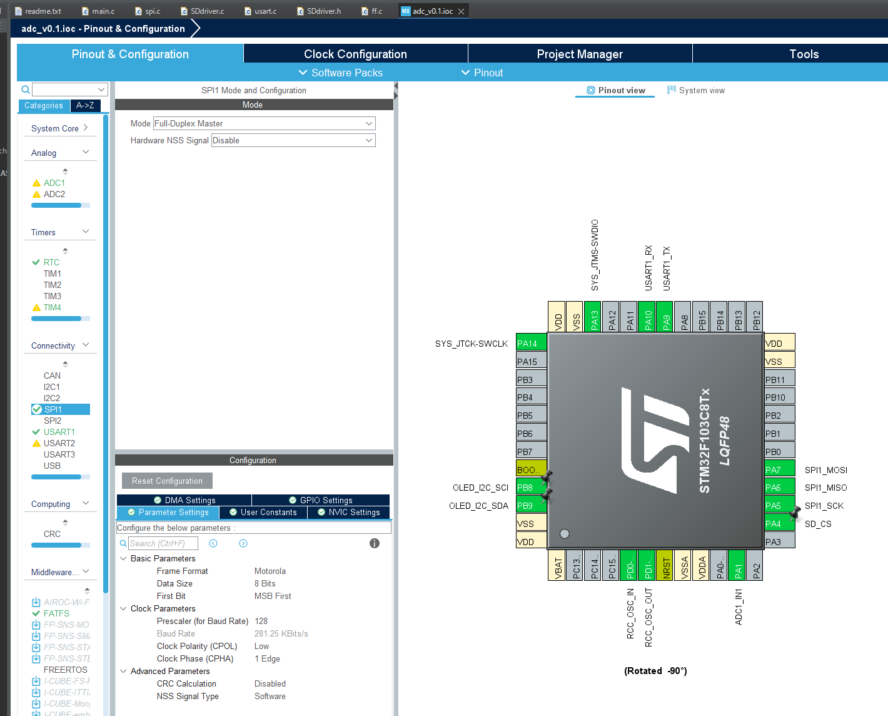


你最头疼的代ç é…ç½®:

. 


首先调用层级:

```
//SPI读写SDå¡çš„调用关系:
//data_logger.c->ff.c->diskio.c->SDdriver.c->HAL

//ff.c(最高层文件系统)->
//diskio.c/user_diskio(æ¥å£é€‚é…层)->
//SDdriver.c(BSP层)->
//HAL(底层)


//BSP层。 它调用HAL库(HAL_GPIO_WritePin, HAL_SPI_TransmitReceive, HAL_Delay...), ç›´æ¥æ“作SPIå’ŒGPIO.

//它定义然å暴露这些函数, 供上层(diskio.c)调用.
//uint8_t		 	SD_init(void);
//void 				SD_CS(uint8_t p);
//uint32_t  	SD_GetSectorCount(void);
//uint8_t 		SD_GETCID (uint8_t *cid_data);
//uint8_t 		SD_GETCSD(uint8_t *csd_data);
//int 				MSD0_GetCardInfo(PMSD_CARDINFO SD0_CardInfo);
//uint8_t			SD_ReceiveData(uint8_t *data, uint16_t len);
//uint8_t 		SD_SendBlock(uint8_t*buf,uint8_t cmd);
//uint8_t 		SD_ReadDisk(uint8_t*buf,uint32_t sector,uint8_t cnt);
//uint8_t 		SD_WriteDisk(uint8_t*buf,uint32_t sector,uint8_t cnt);


//void SPI_setspeed(uint8_t speed);
//uint8_t spi_readwrite(uint8_t Txdata);

```

è¦ç›´æ¥ç§»æ¤çš„文件:

* `项目/Middlewares`. ä¸è¦åŠ¨. 好åƒè¿™ä¸ªæ˜¯MX选择Fatfså生æˆçš„, å…¶å®éƒ½ä¸ç”¨ç§»æ¤?
* `项目/Fatfs`.  
  * `项目/Fatfs/App`里的`fatfs.c, fatfs.h`别动.
  * `项目/Fatfs/Target`里的`user_diskio.c` 也ä¸éœ€è¦æ”¹. 
* `项目/Driver/SDdriver/SDdriver.c`是调用å•ç‰‡æœºçš„最底层. 它也定义了CS引脚的软件行为. 按ç†è¯´ä¹Ÿä¸éœ€è¦æ”¹. 注æ„你需è¦åœ¨main.h中定义`#define SD_CS_Pin GPIO_PIN_4 #define SD_CS_GPIO_Port GPIOA`
* main.c中记得
```
#include "logger.h"
#include "SDdriver.h"
```

先确定SPI能正常工作:
å›ç¯æµ‹è¯•å³å¯. (ç•¥)

å†ç¡®å®šSDå¡å¯ä»¥æ­£å¸¸SPI通信:

```C
 /* ç®€å• SPI / SD sanity test */
  uint8_t tx[10];
  uint8_t rx[10];
  for (int i=0;i<10;i++) tx[i]=0xFF;

  /* 拉高 CS, 片选[å…³]（å‡è®¾ CS = GPIO_PIN_x, adjust accordingly） */
  HAL_GPIO_WritePin(SD_CS_GPIO_Port, SD_CS_Pin, GPIO_PIN_SET);
  HAL_Delay(1); /* 80 clocks will be sent below */

  /* 用SPIå¾€MOSIå‘é€ 10 字节 0xFF.  åŒæ—¶ä»MISO读å–10字节. 如æœSPI主机时钟跑起æ¥äº†, 但ä»æœºæ— å“应(SDå¡ç©ºé€šä¿¡, 没SDå¡/片选关了)ä¼šè¿”å› 0xFF , 表示SPI硬件在工作, 但ä»æœºæ²¡æœ‰å›ç­”.*/
  HAL_StatusTypeDef st = HAL_SPI_TransmitReceive(&hspi1, tx, rx, 10, 200);
  printf("SPI txrx ret=%d rx[0]=%02X rx[1]=%02X ...\r\n", st, rx[0], rx[1]);
```

测试结æœ:

```
SPI txrx ret=0 rx[0]=00 rx[1]=00 ...
```

这她妈根本æ„味ç€å•¥ä¹Ÿæ²¡æœ‰. 你妈的.

æ¢äº†ä¸ªspi-sd模å—, 测试返å›FF了.


然åå°è¯•å‘é€cmd0ç»™SDå¡, 看看能ä¸èƒ½æ­£å¸¸è¿›å…¥SPI模å¼.

```C
#if 1
   uint8_t resp;
   HAL_GPIO_WritePin(SD_CS_GPIO_Port, SD_CS_Pin, GPIO_PIN_RESET);//CS拉ä½, 选中
   uint8_t cmd0[] = {0x40,0x00,0x00,0x00,0x00,0x95};
   HAL_SPI_Transmit(&hspi1, cmd0, sizeof(cmd0), 200);//å‘é€cmd0ç»™SDå¡


   // è¿ç»­è¯»è‹¥å¹²å­—节看有没有é0xFF
   for (int i = 0; i < 10; i++) {
       uint8_t dummy = 0xFF;
       HAL_SPI_TransmitReceive(&hspi1, &dummy, &resp, 1, 200);
       printf("resp[%d]=%02X\r\n", i, resp);
   }
   HAL_GPIO_WritePin(SD_CS_GPIO_Port, SD_CS_Pin, GPIO_PIN_SET);

#endif
```

测试结æœ:
```
resp[0]=FF
resp[1]=01
resp[2]=FF
resp[3]=FF
resp[4]=FF
resp[5]=FF
resp[6]=FF
resp[7]=FF
resp[8]=FF
resp[9]=FF
```
说æ˜SDå¡æˆåŠŸèŠ±äº†1字节时间(8SCK)处ç†äº†cmd0并且返å›äº†`01`正常返å›å€¼.

到这里一般就åæ‹¿ä¹ç¨³äº†.

ç°åœ¨åšSDå¡è¯»å†™æµ‹è¯•

```C
#if 1
  //SD test begin
  printf("SD Card test start.\r\n");

  // FatFs 需è¦çš„对象
  FATFS fs;
  FIL file;
  FRESULT res;
  UINT bytes_written;
  printf("fatfs obj created.\r\n");

  // 挂载文件系统
  res = f_mount(&fs, "0:", 1);
  if (res != FR_OK) {
      printf("f_mount failed: %d\r\n", res);
      Error_Handler();
  }
  printf("f_mount ok\r\n");

  // 打开（如æœä¸å­˜åœ¨åˆ™åˆ›å»ºï¼‰æ–‡ä»¶ test.txt
  res = f_open(&file, "0:test.txt", FA_CREATE_ALWAYS | FA_WRITE);
  if (res != FR_OK) {
      printf("f_open failed: %d\r\n", res);
      Error_Handler();
  }
  printf("f_open ok\r\n");

  // 写入 "123\n"
  const char *text = "123\n";
  res = f_write(&file, text, strlen(text), &bytes_written);
  if (res != FR_OK || bytes_written == 0) {
      printf("f_write failed: %d\r\n", res);
      Error_Handler();
  }
  printf("f_write ok (%u bytes)\r\n", bytes_written);

  // 关闭文件
  f_close(&file);
#endif
```

测试结æœ:
```
SD Card test start.
fatfs obj created.
f_mount ok
f_open ok
f_write ok (4 bytes)
```

把å¡æ‹”了放进读å¡å™¨, 看到确å®æœ‰æ–‡ä»¶`TEST.TXT`, 里é¢æ˜¯123.

SDå¡æˆåŠŸSPI读写.

ç°åœ¨ä½ å¯ä»¥ç”¨æˆ‘自己写的datalogger进行你想è¦çš„读写æ“作了.


###


# 0 上版æµç¨‹ & STM32项目结æ„:

### 0.1 上æ¿æµç¨‹

#### 安装usb转串å£é©±åŠ¨
å³ch340. 驱动安装好å, æ¿å­æ’`usb转串å£`那个usbå£. 上电å, 在电脑设备管ç†å™¨-端å£åº”当能看到ch340端å£.ä¸ä¸Šç”µå°±æ²¡æœ‰. 废è¯!


#### 先安装keil(5.24以上版本,最好)
然å使用注册机破解它.
然å找è¦å®‰è£…的包pack文件(å³cmsis pack),åŒå‡»å®‰è£….
然åå°±å¯ä»¥æ‰“å¼€keil使用了.


#### 新建projectæµç¨‹:
keil里新建一个μvision projectå, 在当å‰ç›®å½•:
需è¦æ·»åŠ å¯åŠ¨æ–‡ä»¶(`F:\aza\wokwok\STM32\é‡ç«ã€STM32F103å¼€å‘æ¿-指å—者】资料\3-STM32官方资料(标准库固件包; hal固件包, 一些手册)\标准库固件包\STM32F10x_StdPeriph_Lib_V3.5.0\Libraries\CMSIS\CM3\DeviceSupport\ST\STM32F10x\startup\arm`)
需è¦æ·»åŠ è‡ªå·±çš„.c文件.
需è¦æ·»åŠ ä¸€ä¸ªç©ºçš„头文件.

#### 生æˆç¼–译文件
写好å编译. 记得勾选生æˆhex文件.

#### (串å£)下载
然å(这里用串å£é€šä¿¡)使用串å£ä¸‹è½½è½¯ä»¶(mcuisp):
	æœç´¢ä¸²å£,选择对应的ch340串å£. bpså°±115200å§åˆ«å¤ªé«˜äº†
	选择下载时的程åºæ–‡ä»¶ä¸ºç”Ÿæˆçš„hex文件.(在项目文件夹的objects里)
	选择DTRä½ç”µå¹³å¤ä½; RTS高电平进bootloader.(这个的åŸç†å¯ä»¥å‚考é‡ç«æ–‡æ¡£-isp一键下载åŸç†åˆ†æ.)

### 0.2 标准库STM32项目结æ„
```
azazel@DESKTOP-NJKSK6O:/mnt/f/aza/WOKWOK/STM32/my_projects/ADC_DMA_TIM_interrupt$ tree
.
├── Libraries(官方库文件. 这些都是和内核相关的文件, 大部分情况下你几ä¹ä¸ä¼šå»ä¿®æ”¹, åªä¼šinclude它们, 比如`#include stm32f10x.h`)
│   ├── CMSIS
│   │   ├── core_cm3.c
│   │   ├── core_cm3.h
│   │   ├── startup(.s文件是)
│   │   │   ├── startup_stm32f10x_cl.s
│   │   │   ├── startup_stm32f10x_hd.s
│   │   │   ├── startup_stm32f10x_hd_vl.s
│   │   │   ├── startup_stm32f10x_ld.s
│   │   │   ├── startup_stm32f10x_ld_vl.s
│   │   │   ├── startup_stm32f10x_md.s
│   │   │   ├── startup_stm32f10x_md_vl.s
│   │   │   └── startup_stm32f10x_xl.s
│   │   ├── stm32f10x.h(主头文件. 包å«æ‰€æœ‰å¯„存器的定义.)
│   │   ├── system_stm32f10x.c(一些系统åˆå§‹åŒ–函数)
│   │   └── system_stm32f10x.h(一些系统åˆå§‹åŒ–函数)
│   └── FWlib(å³Firmware Library, STM32F10x标准固件库)
│       ├── inc(外设的头文件)
│       │   ├── misc.h
│       │   ├── stm32f10x_adc.h
│       │   ├── stm32f10x_bkp.h
│       │   ├── stm32f10x_can.h
│       │   ├── stm32f10x_cec.h
│       │   ├── stm32f10x_crc.h
│       │   ├── stm32f10x_dac.h
│       │   ├── stm32f10x_dbgmcu.h
│       │   ├── stm32f10x_dma.h
│       │   ├── stm32f10x_exti.h
│       │   ├── stm32f10x_flash.h
│       │   ├── stm32f10x_fsmc.h
│       │   ├── stm32f10x_gpio.h
│       │   ├── stm32f10x_i2c.h
│       │   ├── stm32f10x_iwdg.h
│       │   ├── stm32f10x_pwr.h
│       │   ├── stm32f10x_rcc.h
│       │   ├── stm32f10x_rtc.h
│       │   ├── stm32f10x_sdio.h
│       │   ├── stm32f10x_spi.h
│       │   ├── stm32f10x_tim.h
│       │   ├── stm32f10x_usart.h
│       │   └── stm32f10x_wwdg.h
│       └── src(外设的å®ç°æ–‡ä»¶)
│           ├── misc.c
│           ├── stm32f10x_adc.c
│           ├── stm32f10x_bkp.c
│           ├── stm32f10x_can.c
│           ├── stm32f10x_cec.c
│           ├── stm32f10x_crc.c
│           ├── stm32f10x_dac.c
│           ├── stm32f10x_dbgmcu.c
│           ├── stm32f10x_dma.c
│           ├── stm32f10x_exti.c
│           ├── stm32f10x_flash.c
│           ├── stm32f10x_fsmc.c
│           ├── stm32f10x_gpio.c
│           ├── stm32f10x_i2c.c
│           ├── stm32f10x_iwdg.c
│           ├── stm32f10x_pwr.c
│           ├── stm32f10x_rcc.c
│           ├── stm32f10x_rtc.c
│           ├── stm32f10x_sdio.c
│           ├── stm32f10x_spi.c
│           ├── stm32f10x_tim.c
│           ├── stm32f10x_usart.c
│           └── stm32f10x_wwdg.c
├── Listing(汇编清å•æ–‡ä»¶)
│   ├── USART.map
│   └── startup_stm32f10x_hd.lst
├── Output(编译结æœ. 其中有大é‡.s(汇编æºä»£ç ), .crf(keil专用中间文件), .d(记录æºæ–‡ä»¶ä¹‹é—´çš„ä¾èµ–关系的文件), .o(目标文件), .axf(ARM处ç†å™¨è°ƒè¯•æ–‡ä»¶), .htm(网页报告)....以åŠæœ€é‡è¦çš„.hex, 用äºçƒ§å½•çš„16进制å¯æ‰§è¡Œæ–‡ä»¶. 你最终è¦çƒ§å½•çš„东西就是这个.)
│   ├── USART.hex(用äºçƒ§å½•çš„16进制å¯æ‰§è¡Œæ–‡ä»¶)
│   ├── USART.htm
│	.....
├── Project(keil工程文件.)
│   └── RVMDK（uv5）
│       ├── BH-F103.uvguix.azazel(用户个性化é…ç½®)
│       ├── BH-F103.uvoptx(项目的é…置和编译选项)
│       ├── BH-F103.uvprojx(å¯ä»¥ç”¨keil打开的工程文件.)
│       └── DebugConfig(调试器的é…ç½®)
│           ├── ADC_DMA_STM32F103VE_1.0.0.dbgconf
│           └── USART_STM32F103VE_1.0.0.dbgconf
├── User(这里都是用户自己编写的内容. 用户主代ç åŒº! 一般在这里编写我们自己的代ç .)
│   ├── adc(如æœä½ è¦ç”¨ä¸€ä¸ªå¤–设比如adc, 用模å—化的é£æ ¼ç¼–程.下åŒ...)
│   │   ├── bsp_adc.c
│   │   ├── bsp_adc.h
│   │   └── readme.txt
│   ├── tim
│   │   ├── bsp_tim.c
│   │   └── bsp_tim.h
│   ├── usart
│   │   ├── bsp_usart.c
│   │   └── bsp_usart.h
│   ├── main.c(主函数, 程åºå…¥å£.)
│   ├── stm32f10x_conf.h
│   ├── stm32f10x_it.c(中断æœåŠ¡å‡½æ•°.)
│   ├── stm32f10x_it.h
├── keilkill.bat(看起æ¥æ„æ€æ˜¯ä¸ªæ¸…ç†å·¥å…·, å¯èƒ½ä¼šå¸®ä½ åˆ é™¤æ‰€æœ‰çš„编译文件å§? )
└── readme.md
```

# 1 å„ç§å¤–设

* STM32硬件资æºæ述图


* stm32f10系列引脚分类

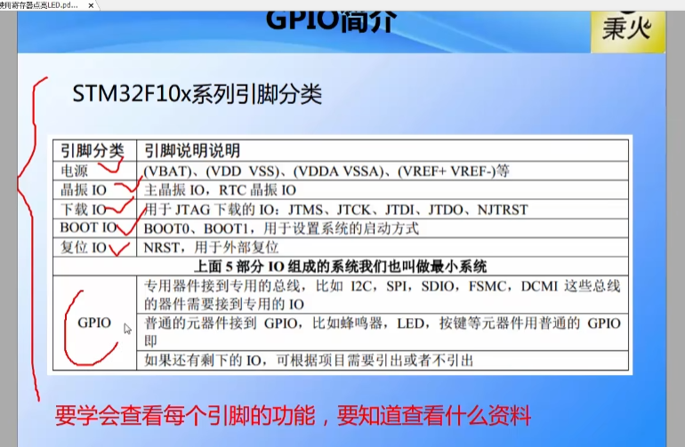

## 1.1 GPIO:

通用输入输出端å£çš„简称. 也就是软件å¯ä»¥æ§åˆ¶çš„引脚.
这个外设在APB2总线è¿æ¥. 使用时å¤ä½å’Œæ—¶é’Ÿä¿¡å·è¦å»APB2总线的对应æ§åˆ¶å¯„存器打开.
一共有GPIOx, x=`ABCDE`五个端å£, æ¯ä¸ªç«¯å£æœ‰ä¸ª16个引脚. 在æ¿å­ä¸Šæ¯”如PB0å³ä¸ºGPIOçš„B端å£0å·å¼•è„š.


### 1.1.1 GPIO结æ„çš„å‘展å²
GPIO在å‘展中, 支æŒçš„模å¼ä¹Ÿåœ¨å‘展.

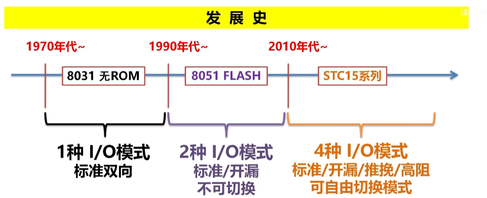


### 1.1.2 (old) GPIO的标准åŒå‘输入输出模å¼

GPIOä»æœ€æ—©æœŸçš„版本是**标准åŒå‘输入输出模å¼**:

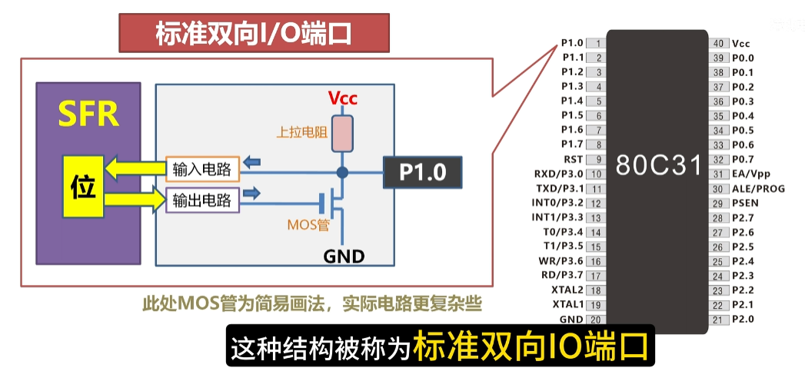

其中的上拉电阻很大! 显然, 因为输出电路åªæœ‰ä¸Šä¸€èŠ‚`GPIO的输出电路`中的开æ¼è¾“出结æ„, 没有直æ¥è¿æ¥VCC(通过很大的上拉电阻å电æµæå°æ— æ³•é©±åŠ¨ç¡¬ä»¶)的部分, 所以该模å¼ä¸‹æ²¡æœ‰`push`功能.

如图, å¼€æ¼è¾“出没有åŠæ³•ç›´æ¥ç›´æ¥å¯¹å¤–输出电æµ, 需è¦æ¥ä¸€ä¸ª**VCC+å°å‹ä¸Šæ‹‰ç”µé˜»**.
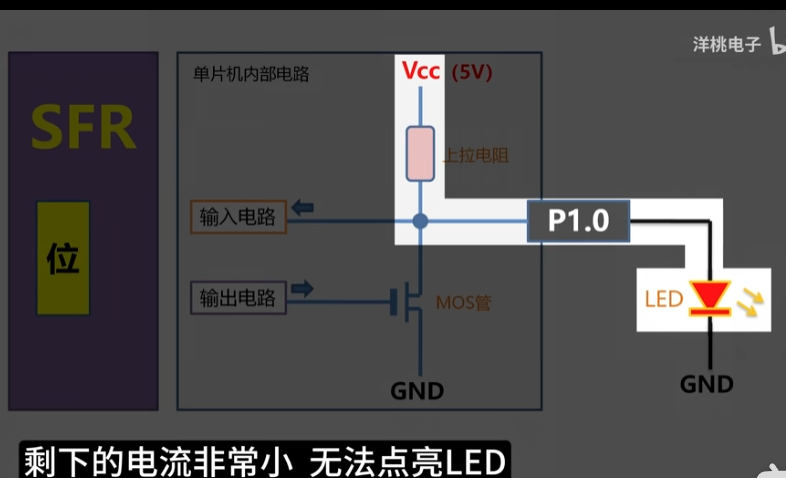


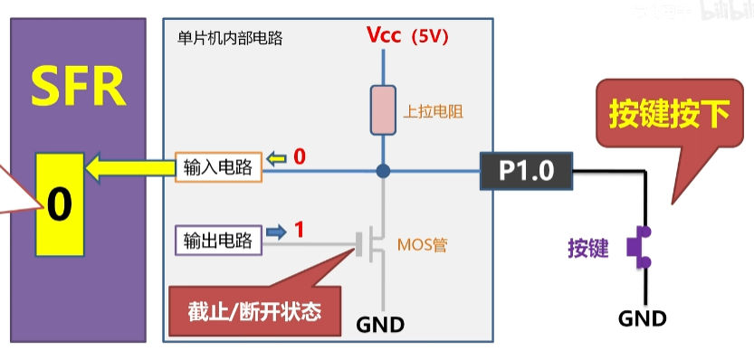


### 1.1.3 STM32çš„GPIO结æ„

STMçš„GPIO结æ„如图所示. 它分为输入电路和输出电路两部分.

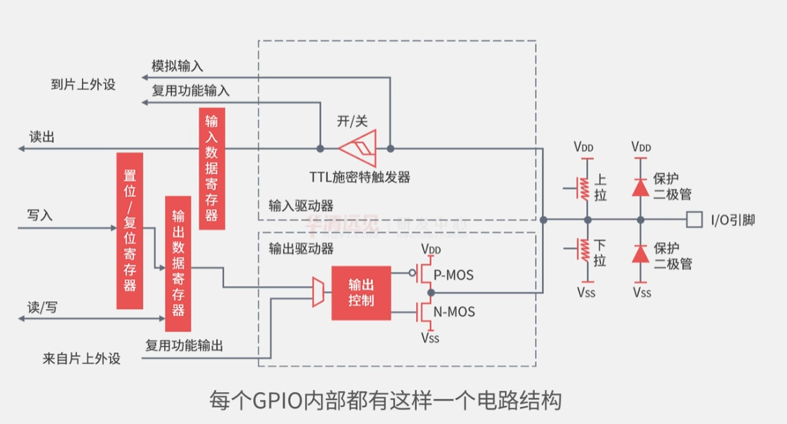

#### 1.1.3.1 GPIO的输入电路:


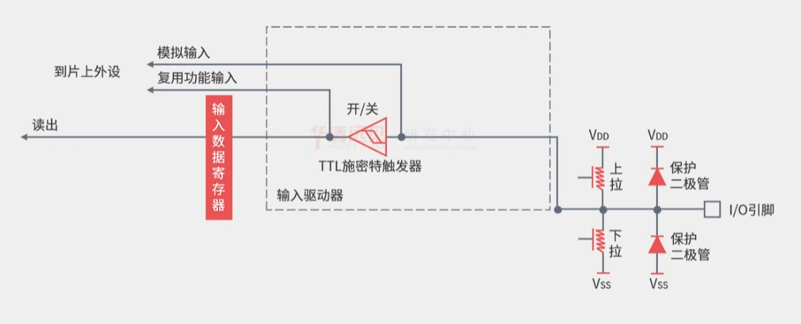

其中的**TTL施密特触å‘器**å¯ä»¥æŠŠæ¨¡æ‹Ÿä¿¡å·è½¬æ¢ä¸ºæ•°å­—ä¿¡å·. 


STM32的输入电路结æ„æ供了4ç§è¾“入模å¼: 
* 上拉输入(悬空时读å–高电平)
  * 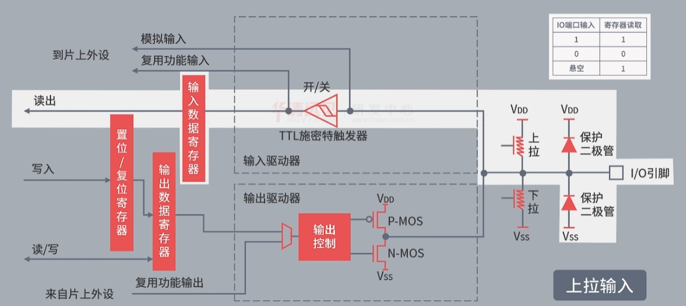
* 下拉输入(悬空时读å–ä½ç”µå¹³, ä¸å¸¸ç”¨.)
  * 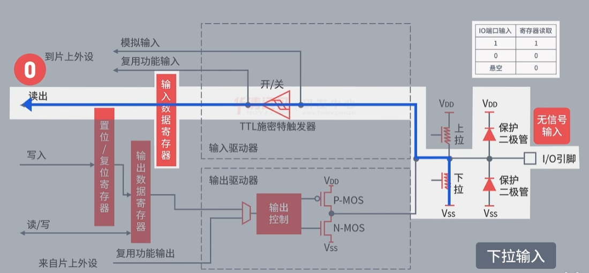
* 浮空输入(最常用. ä¸æ˜“å—干扰.)
  * 
* 模拟输入(上下拉电阻和施密特触å‘器都断开, 输入信å·ç›´æ¥ä¼ é€’到片上外设或者å¤ç”¨åˆ°adc外设. 最çœç”µ.)
  * 


#### 1.1.3.2GPIO的输出电路:

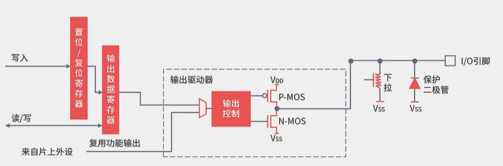

å¯ä»¥çœ‹åˆ°, 通过æ’列组åˆ

æ§åˆ¶å™¨é€šè¿‡æ§åˆ¶`PMOS`å’Œ`NMOS`æ¥æ”¹å˜GPIO的输出模å¼.

å¯ä»¥çœ‹åˆ°, 通过æ’列组åˆ`PMOS`å’Œ`NMOS`(但是ä¸èƒ½éƒ½æ‰“开会短路), 得到三ç§è¾“出情况:
* PMOS打开NMOS关闭, GPIO的VCC给外部充电. 输出高电平(push)
* PMOS关闭NMOS打开, GPIOè¿æ¥çš„外部电路的电æºé€šè¿‡NMOS放电. 输出ä½ç”µå¹³(pull)
* 全部关闭: 外部影å“ä¸åˆ°GPIO. 浮空/高阻æ€
äºæ˜¯, å¯ä»¥è®¾è®¡GPIOä¸åŒ**输出模å¼**, å…¶å®å°±æ˜¯ä¸ºäº†é˜²æ­¢å±é™©, 把上述三ç§è¾“出情况分æˆå‡ ç»„å…许的组åˆ.

有4ç§è¾“出模å¼:
* **æ¨æŒ½è¾“出模å¼**: 
	åªå…许`push`å’Œ`pull`模å¼.

	能驱动高ä½ç”µå¹³, 但是ä¸æ”¯æŒOR线ä¸åŠŸèƒ½.
* **å¼€æ¼è¾“出模å¼**: 
	åªå…许`pull`å’Œ`浮空`模å¼. 该模å¼ä¸‹`PMOS`永远关闭, 所以电路图å¯ä»¥é€€åŒ–为:

	

	此时`NMOS`çš„æ¼æ啥也没æ¥æ‰€ä»¥ç§°ä¸ºå¼€æ¼. 显然, 离开了VCC, å¼€æ¼è¾“出本身ä¸å…·æœ‰è¾“出高电平的能力, 需è¦å¤–æ¥é«˜ç”µå¹³.* 部分å•ç‰‡æœºå·²ç»é…置好了电å‹æº-上拉电阻.
	
	**å¼€æ¼è¾“出应用**:
	* 1. GPIO的高电平电å‹ä¸åŒ¹é…的时候, å¯ä»¥ç”¨**å¼€æ¼è¾“出模å¼** + **外æ¥åˆé€‚的电å‹æº** å®ç°è¾“出è¦æ±‚电å‹çš„高ä½ç”µå¹³.

	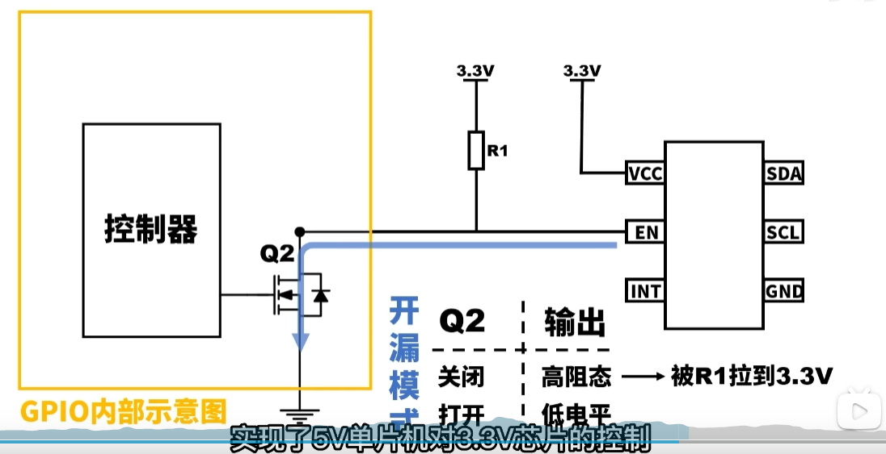

	* 2. å¯ä»¥æ”¯æŒ**OR逻辑**, 多个GPIOåŒæ—¶æ§åˆ¶ä¸€ä¸ªè¾“å…¥:

		
		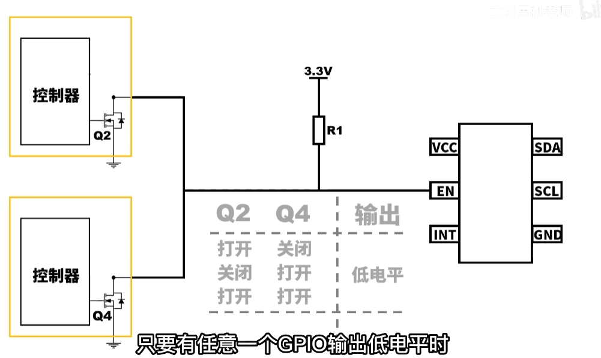
	如上图, 如æœä¸¤ä¸ªGPIO使用`æ¨æŒ½è¾“出`, 则一个push一个pull会形æˆé€šè·¯çƒ§æ¯.
	若两个GPIO都é…ç½®æˆå¼€æ¼è¾“出然å外æ¥ç”µå‹+上拉电阻, å°±å¯ä»¥å®ç°ORæ§åˆ¶.
	**事å®ä¸Š, `I2C`, SMBUS等通信因为需è¦çº¿ä¸, 所以它们使用的都是开æ¼è¾“出模å¼.**
* **å¤ç”¨æ¨æŒ½è¾“出**
* **å¤ç”¨å¼€æ¼è¾“出**

### 1.1.4 STMæ§åˆ¶GPIO的寄存器

GPIO的完整结æ„å¯ä»¥çœ‹æˆ**寄存器-æ§åˆ¶(驱动)器-针脚**. å‰é¢è®²çš„输入/输出电路图结æ„, 也æˆä¸º**输入/输出驱动器**. 而å‰é¢çš„寄存器æ§åˆ¶è¿™å¥—电路哪里断开哪里闭åˆ. 用户通过软件设置这些寄存器.


这些**GPIOé…置寄存器**为:
| GPIOé…ç½®å¯„å­˜å™¨å  | å«ä¹‰                                           |
| ------ | ------------------------------------------------ |
| `CRL`  | é…ç½®ä½ 8 ä½å¼•è„šï¼ˆPin 0\~7）的æ§åˆ¶å¯„存器。é…置引脚的模å¼/功能等。           |
| `CRH`  | é…置高 8 ä½å¼•è„šï¼ˆPin 8\~15）的æ§åˆ¶å¯„存器。                      |
| `IDR`  | 输入数æ®å¯„存器（Input Data Register），å¯è¯»æŸä¸ªå¼•è„šå½“å‰è¾“入的电平状æ€ã€‚    |
| `ODR`  | 输出数æ®å¯„存器（Output Data Register），写入这个寄存器æ¥è¾“出电平。      |
| `BSRR` | ä½è®¾ç½®/å¤ä½å¯„存器（Bit Set/Reset Register），å¯ä»¥å¿«é€Ÿç½®ä½/清零æŸä¸ªå¼•è„šã€‚ |
| `BRR`  | ä½å¤ä½å¯„存器（Bit Reset Register），专门用æ¥æ¸…零引脚。             |
| `LCKR` | é”存寄存器（Lock Register），用æ¥é”ä½å¼•è„šé…置，防止修改。              |


#### 1.1.4.1 CRLå’ŒCRH

其中**CRL**å’Œ**CRH**é…置了GPIO的模å¼.
GPIO引脚的**模å¼**通过 
* **GPIOx_CRL(æ§åˆ¶ GPIOx的第 0ï½7 引脚 `Pin0~7`)**
* **GPIOx_CRH(æ§åˆ¶ GPIOx的第 8ï½15 引脚 `Pin8~15`)**
寄存器é…ç½®.

这两个寄存器一共64bit宽, æ¯ä¸ªå¼•è„šåˆ†åˆ°4bit: MODE[1:0] + CNF[1:0]

| CRL/CRHå¯„å­˜å™¨å­—æ®µå   | ä½æ•° | 作用                          |
| ----------- | -- | --------------------------- |
| `MODE[1:0]` | 2ä½ | 指定“输出模å¼ä¸‹â€çš„速ç‡ï¼ˆè¾“入模å¼æ—¶å¼ºåˆ¶ä¸º `00`） |
| `CNF[1:0]`  | 2ä½ | 指定该引脚的“具体模å¼â€ï¼ˆæ¯”如æ¨æŒ½ã€å¼€æ¼ç­‰ï¼‰      |

它们对应的模å¼:
| `MODE[1:0]` | `CNF[1:0]` | 模å¼å称                       | 输入/输出 | è¯´æ˜                 |
| ----------- | ---------- | -------------------------- | ----- | ------------------ |
| `00`        | `00`       | 模拟输入（Analog）               | 输入    | ä¾› ADC 等使用，ä½åŠŸè€—      |
| `00`        | `01`       | 浮空输入（Floating Input）       | 输入    | é»˜è®¤è¾“å…¥çŠ¶æ€             |
| `00`        | `10`       | 上/下拉输入（Pull-up/down Input） | 输入    | 由 `ODR` 设置是上拉还是下拉  |
| `00`        | `11`       | ⌠ä¿ç•™ï¼Œç¦æ­¢é…ç½®                  | âŒæ— æ•ˆ   | STM32F1 ä¸å…许这ç§ç»„åˆ    |
| `01/10/11`  | `00`       | 通用æ¨æŒ½è¾“出（General Output PP）  | 输出    | MCU 能主动拉高和拉ä½ç”µå¹³     |
| `01/10/11`  | `01`       | 通用开æ¼è¾“出（General Output OD）  | 输出    | åªèƒ½æ‹‰ä½ç”µå¹³ï¼Œéœ€å¤–部上拉       |
| `01/10/11`  | `10`       | å¤ç”¨æ¨æŒ½è¾“出（AF Output PP）       | 输出    | 比如 SPI/USART/PWM 用 |
| `01/10/11`  | `11`       | å¤ç”¨å¼€æ¼è¾“出（AF Output OD）       | 输出    | 比如 I2C 等需开æ¼è¾“出的å¤ç”¨åœºæ™¯ |

#### 1.1.4.2 APB2总线 外设时钟使能寄存器(RCC_APB2ENR); APB2 外设å¤ä½å¯„存器 (RCC_APB2RSTR)
在AHB总线上. 地å€ä¸º`0x4002 1000 - 0x4002 13FF`
首先是使能和å¤ä½ä¿¡å·. 如æœæƒ³ä½¿ç”¨GPIO端å£(在总线APB2è¿æ¥), 则需è¦å¼€å¯å¤ä½å’Œæ—¶é’Ÿæ§åˆ¶RCC. 外设的时钟和使能信å·é»˜è®¤æ˜¯å…³é—­çš„.
当外设时钟没有å¯ç”¨æ—¶ï¼Œè½¯ä»¶ä¸èƒ½è¯»å‡ºå¤–设寄存器的数值，返å›çš„数值始终是0x0。

#### 1.1.4.3 IDR (input data reg)输入数æ®å¯„存器.

它是一个32bit寄存器. 高16ä½é¢„留为0没用. ä½16ä½ä¿å­˜ç«¯å£0~端å£15çš„å®é™…物ç†ç”µå¹³, 0为ä½ç”µå¹³.

它储存引脚å®é™…物ç†ç”µå¹³.

它的值用库函数
`GPIO_ReadInputDataBit()`æ¥è¯»å–.

#### 1.1.4.4 ODR (output data reg)输出数æ®å¯„存器.

它是一个32bit寄存器. 高16ä½é¢„留为0没用. ä½16ä½æ§åˆ¶ç«¯å£0~端å£15的输出电平, 0为ä½ç”µå¹³.

ODR寄存器åªæœ‰**æ¨æŒ½è¾“出模å¼**时有用. 当æ¨æŒ½é©±åŠ¨æ—¶, IDR被驱动为ODR的值.

它的值用库函数
`GPIO_ReadOutputDataBit()`æ¥è¯»å–.

在GPIOçš„ä¸åŒæ¨¡å¼ä¸‹:
| æ¨¡å¼     | 输入逻辑（IDR） | 输出逻辑（ODR）  |
| ------ | --------- | ---------- |
| 输入模å¼(上/下拉输入, 浮空输入, 模拟输入)   | ✅使能       | âŒå…³é—­        |
| æ¨æŒ½è¾“å‡ºæ¨¡å¼ | ✅ä»ç„¶æ‰“å¼€ï¼    | ✅使能（æ¨é«˜/æ¨ä½ï¼‰ |


### 1.1.5 GPIOçš„é…置写法

比如è¦é…ç½®3个gpio为**æ¨æŒ½è¾“出**模å¼, æ¥ç”¨äºæ§åˆ¶ä¸‰ä¸ª`LED外设`, 规范的åšæ³•:

```c
LED_GPIO_Config()	//在main.c 中调用é…置函数. 具体的é…置函数写在`bsp_led.c`中.


//bsp_led.h中é…ç½®å®å称(主è¦æ˜¯è¦ç”¨çš„gpioåå­—). å®ç°ç¡¬ä»¶é…ç½®ä¸ç¨‹åºé€»è¾‘解耦~
/* 如æœä½ æƒ³æ¢ä¸€ä¸ªgpio用, 需è¦æ›´æ”¹ä¸‹é¢ä¸‰ä¸ªå±æ€§. portå’Œclkå¿…é¡»ä¾ç…§ä½ å…·ä½“gpio对应的æ¿ä¸Šç»“æ„哦, å»çœ‹å¼•è„šå§. */
// R-红色: 这是一个å±äº`GPIOB`组的5å·gpio, 是PB5引脚的å¤ç”¨. 使用apb2_gpiob的总线.
#define LED1_GPIO_PORT    	GPIOB			              /* GPIOç«¯å£ */
#define LED1_GPIO_CLK 	    RCC_APB2Periph_GPIOB		/* GPIO端å£æ—¶é’Ÿ */
#define LED1_GPIO_PIN		GPIO_Pin_5			        /* è¿æ¥åˆ°SCL时钟线的GPIO */

// G-绿色
#define LED2_GPIO_PORT    	GPIOB			              /* GPIOç«¯å£ */
#define LED2_GPIO_CLK 	    RCC_APB2Periph_GPIOB		/* GPIO端å£æ—¶é’Ÿ */
#define LED2_GPIO_PIN		GPIO_Pin_0			        /* è¿æ¥åˆ°SCL时钟线的GPIO */

// B-è“色
#define LED3_GPIO_PORT    	GPIOB			              /* GPIOç«¯å£ */
#define LED3_GPIO_CLK 	    RCC_APB2Periph_GPIOB		/* GPIO端å£æ—¶é’Ÿ */
#define LED3_GPIO_PIN		GPIO_Pin_1			        /* è¿æ¥åˆ°SCL时钟线的GPIO */

//å‡è®¾LED1çš„GPIO你想æ¢ä¸€ä¸ª, 比如你想用PB8(gpio_pin_8), 则è¦æŸ¥è¯¢: 它å±äºGPIOB端å£, 则:
#define LED1_GPIO_PORT  GPIOB
#define LED1_GPIO_CLK   RCC_APB2Periph_GPIOB
#define LED1_GPIO_PIN   GPIO_Pin_8


//`bsp_led.c`中的é…ç½®
void LED_GPIO_Config(void)
{		
	/*定义一个GPIO_InitTypeDefç±»å‹çš„结æ„体.*/
	GPIO_InitTypeDef GPIO_InitStructure;


    /************* 通用é…置：适用äºæ‰€æœ‰ LED 引脚的通用设置 *************/
	/*å¼€å¯LED相关的GPIO外设时钟*/
	RCC_APB2PeriphClockCmd( LED1_GPIO_CLK | LED2_GPIO_CLK | LED3_GPIO_CLK, ENABLE);

	/*设置引脚模å¼ä¸ºé€šç”¨æ¨æŒ½è¾“出*/
	GPIO_InitStructure.GPIO_Mode = GPIO_Mode_Out_PP;   

	/*设置引脚速ç‡ä¸º50MHz */   
	GPIO_InitStructure.GPIO_Speed = GPIO_Speed_50MHz; 
	/*选择è¦æ§åˆ¶çš„GPIO引脚*/
	GPIO_InitStructure.GPIO_Pin = LED1_GPIO_PIN;	


    /************* å•ç‹¬é…ç½®æ¯ä¸ª LED 的引脚 *************/
	/*调用库函数，åˆå§‹åŒ–GPIO*/
	GPIO_Init(LED1_GPIO_PORT, &GPIO_InitStructure);	
	
	/*选择è¦æ§åˆ¶çš„GPIO引脚*/
	GPIO_InitStructure.GPIO_Pin = LED2_GPIO_PIN;

	/*调用库函数，åˆå§‹åŒ–GPIO*/
	GPIO_Init(LED2_GPIO_PORT, &GPIO_InitStructure);
	
	/*选择è¦æ§åˆ¶çš„GPIO引脚*/
	GPIO_InitStructure.GPIO_Pin = LED3_GPIO_PIN;

	/*调用库函数，åˆå§‹åŒ–GPIOF*/
	GPIO_Init(LED3_GPIO_PORT, &GPIO_InitStructure);


	//åˆå§‹åŒ–默认状æ€è®¾ç½®(å³å°†)
	/* 关闭所有ledç¯	*/
	GPIO_SetBits(LED1_GPIO_PORT, LED1_GPIO_PIN);
	
	/* 关闭所有ledç¯	*/
	GPIO_SetBits(LED2_GPIO_PORT, LED2_GPIO_PIN);	 

	/* 关闭所有ledç¯	*/
	GPIO_SetBits(LED3_GPIO_PORT, LED3_GPIO_PIN);
}

```


## 1.2 时钟和RCC(reset and clock control)

STM32F103 的时钟系统使用 时钟树 进行管ç†ï¼Œæ‰€æœ‰å¤–设（GPIOã€USARTã€ADC 等）都需è¦æ—¶é’Ÿæ‰èƒ½å·¥ä½œã€‚

**HSE(High-Speed External clock), 高速外部时钟**由外部晶振æ供信å·.
å¯ä»¥é€šè¿‡ **PLL（é”相ç¯ï¼‰** å€é¢‘，把 STM32 的主频æå‡åˆ° 72MHz.


RCC是stm32的一个外设,  负责系统å¤ä½å’Œæ—¶é’Ÿç®¡ç†.
它æ§åˆ¶gpio, adc, usart, apb1, apb2ç¯å¤–设的始终开关.
比如，RCC->APB2ENR |= (1 << 9); ç”¨äº å¼€å¯ ADC1 时钟。

时钟树:


* `HSE_OSC`震è¡æ¨¡å—é…åˆOSC_IN, OSC_OUT引脚输入输出, 产生HSE震è¡æ—¶é’Ÿä¿¡å·. (stm32本身ä¸åŒ…å«ä¸€ä¸ªæ™¶æŒ¯æ¨¡å—. `HSE_OSC`模å—åªæ˜¯åˆ©ç”¨é©±åŠ¨ç”µè·¯æ¥é…åˆå¤–部的晶振工作, 产生信å·ç»™å†…部模å—用.)
* ç´§æ¥ç€çš„`PLLXTPRE`(PLL extended pre-divider)预分频器模å—.
  * ENABLE: å°†HSEä¿¡å·1/2分频, 然åé€å…¥`PLL选择器`.
  * UNENABLE: HSEç›´æ¥é€å…¥`PLL选择器`.
* `PLL选择器`通过PLLSRC使能, 选择(分频的)`HSE`ä¿¡å·æˆ–HSIä¿¡å·, ä¼ ç»™`PLL`.
* `HSI`是内部振è¡å™¨ä¿¡å·. 比较简æ´, ä¸éœ€è¦æ™¶æŒ¯å’Œæ§åˆ¶ç”µè·¯, 产生8MHZ的劣质信å·...
* 


## 1.4 æ¥å£çš„é‡æ˜ å°„

例如`USART2_TX`, 当æ§åˆ¶é‡æ˜ å°„的寄存器USART2_REMAP=0æ—¶, 它被分é…到默认物ç†å¼•è„šPA2.
当USART2_REMAP=1æ—¶, 它被分é…到物ç†å¼•è„šPD5.


## 1.5 DMA (data memory access) ç›´æ¥å­˜å‚¨å™¨è®¿é—®

功能: 在两处æ¬è¿æ•°æ®, ä¸å ç”¨cpu.
比如串å£è¾“入时, 我们把sram中的字符串数æ®arrå…ˆæ¬è¿åˆ°cpuæš‚å­˜reg, 然åæ¬è¿åˆ°USARTçš„DR, 然åå‘é€.
如æœèƒ½ä½¿ç”¨DMA, åªéœ€è¦cpuå‘个命令, 让数æ®arr自动æ¬è¿åˆ°ç›®çš„地(USART_DR), cpuå¯ä»¥å»åšåˆ«çš„事.

stm32f103大容é‡ç‰ˆæœ¬æœ‰ä¸¤ä¸ªDMA外设`DMA1`, `DMA2`.
æ¯ä¸ªDMA有7个通é“. å¯ä»¥å®ç°
* P->M
* M->P
* M->M

P:外设peripheral.  
M:

注æ„:ADC2没有DMA功能. å¯ä»¥ç”¨ADC1或ADC3.

## 1.6 TIM(timer)定时器


### 1.6.1 基本定时器


##### 时基 time base

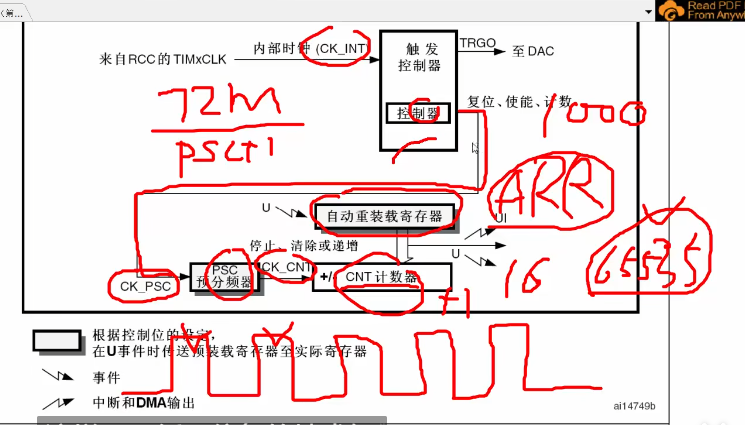
* 计时器 **CNT**
* 预分频器 **PSC**(Prescaler)
  * 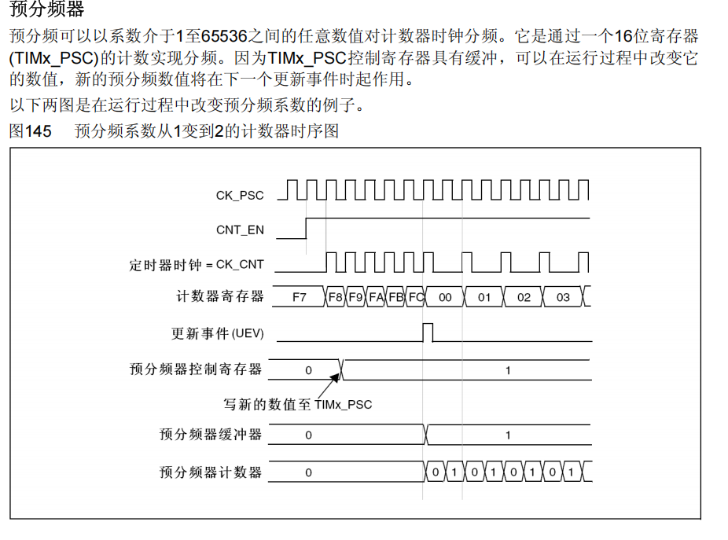
  * 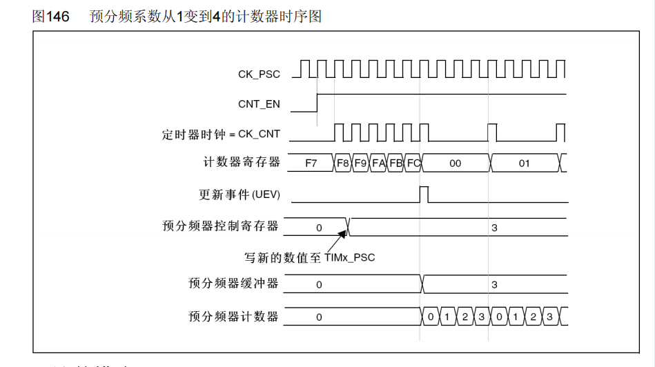
* 自动é‡è£…载寄存器 **ARR** : 计数器到达该寄存器值å自动清零.

* **å½±å­å¯„存器**: 
  * PSCå’ŒARR都有`å½±å­å¯„存器`(框图中, PSCå’ŒARR矩形有一个影å­å›¾æ¡ˆ). å…¶å®å°±æ˜¯æ‰“æ‹. 比如ARRçš„å½±å­å¯„存器称为称为`自动é‡è£…载预装载`, 使能在TIMx_CR1寄存器的7ä½`ARPE`.
    * 
    * 

计数器时钟`CK_CNT`频ç‡: 
$CK\_CNT=\frac{72M}{PSC+1}$
äºæ˜¯è®¡æ•°å™¨æŠ€æœ¯ä¸€è½®éœ€è¦çš„时间为$\frac{ARR}{CK\_CNT}$

时基结æ„体的åˆå§‹åŒ–:
```c
typedef struct{
//PSC的分频因å­
uint16_t TIM_Prescaler;

//计数模å¼. (基本计时器TIM7,TIM8ä¸ç”¨é…, åªèƒ½å‘上计数)
uint16_t TIM_CounterMode;

//ARR的值, 计数周期
uint32_t TIM_Period;

//外部输入的时钟分频因å­.(基本计时器没有)

//é‡å¤è®¡æ—¶å™¨(高级定时器专用)
//如æœå¼€å¯ç›¸å…³åŠŸèƒ½, å¯ä»¥åœ¨ARR满的时候ä¸äº§ç”Ÿä¸­æ–­/DMA请求, 而是清零并且让é‡å¤è®¡æ—¶å™¨++. 感觉没啥用...你扩å€ARR设定ä¸å°±å¥½äº†.
uint8_t TIM_ClockDivision;
//

} TIM_TimeBaseInitTypeDef
```

### 1.6.2 高级定时器 TIM1, TIM8

三个功能:
* 定时
* PWM
* æ•è·
  * 脉冲宽度
  * PWM


## 1.7 LED

指å—者æ¿å­æœ‰ä¸‰è‰²led. 它们通过**çŒç”µæµ**çš„æ–¹å¼è¿æ¥åˆ°GPIOå£. çŒç”µæµå³æ„味ç€LED先直æ¥è¿æ¥é«˜ç”µå¹³, 然åæ¥å…¥GPIOå£, 当GPIOå£ä»¥**pull模å¼**(å³å†…部åªå­˜åœ¨gpio-MOS-GND通路: )è¿è¡Œæ—¶

其电路å‚è§æŒ‡å—者åŸç†å›¾:


å¯è§, redè¿æ¥çš„gpioå£æ˜¯`PB5`, 当`PB5`ä½ç”µå¹³æ—¶å¯¼é€š.


如æœä½ è¦è®¾ç½®gpioçš„è¯å¦‚下
```c
void REDLED_GPIO_Config(void)
{
    GPIO_InitTypeDef GPIO_InitStructure;
    
    // å¼€å¯ GPIOB 时钟
    RCC_APB2PeriphClockCmd(RCC_APB2Periph_GPIOB, ENABLE);
    
    // é…ç½® PB5 为æ¨æŒ½è¾“出模å¼
    GPIO_InitStructure.GPIO_Pin = GPIO_Pin_5;
    GPIO_InitStructure.GPIO_Mode = GPIO_Mode_Out_PP;
    GPIO_InitStructure.GPIO_Speed = GPIO_Speed_50MHz;
    GPIO_Init(GPIOB, &GPIO_InitStructure);
    
    // 默认PB5高电平, 关闭 LED
    GPIO_SetBits(GPIOB, GPIO_Pin_0);
}
```


## 1.8 晶振


* å®ä½“晶振:
  * `Y1`处å³HSE所用的8MHz晶振(通过PLLå€é¢‘为72MHz)
  * `Y2`处å³LSE所用的32.768KHz晶振.

* 内部振è¡å™¨æ™¶æŒ¯:
  * 串å£èŠ¯ç‰‡`CH340C`自带一个12MHz晶振在内部. (对应`Y3`处没有晶振. å¦åˆ™ç”¨çš„是`CH340`çš„è¯, 这里è¦ç„Šä¸€ä¸ª12MHzå®ä½“晶振给CH340G用)
  * `HSI`. 在MCU内部. 8MHz. 和焊æ¥çš„HSE(PLLå€é¢‘之å‰)一样, 但是精度è¦å·®å¾—多.
  * `LSI`. 在MCU内部. 40kHz, 精度差.

## 1.9 key开关

查看åŸç†å›¾:


这是一个带防抖(0.1uFå»æŠ–电容)和上拉(4.7k上拉电阻)的按键电路.

按下key则对PA0输出高电平, æ¾å¼€æ—¶PA0为ä½ç”µå¹³.

使用的四点å¼key按键模å—有四个点触引脚, å®é™…上å¯ä»¥ä¸€ä¸ªæŒ‰é”®åŒæ—¶æ§åˆ¶ä¸¤ä¸ªå¼€å…³. 这里æ¿å­ä¸Šçš„电路是把12å’Œ34端æ¥åœ¨ä¸€èµ·äº†. 这样就是一个简å•çš„å•åˆ€å•æ·å¼€å…³äº†.

# 2 几个例程:

### 指å—者æ¿å­ç¡¬ä»¶è®¾è®¡:
ä»åŸç†å›¾æŸ¥åˆ°:

注æ„PC0å®é™…上被SPIæ¥å£å ç”¨äº†. 别用.


## 2.1 ADCå®éªŒ
整个åŸç†å›¾:
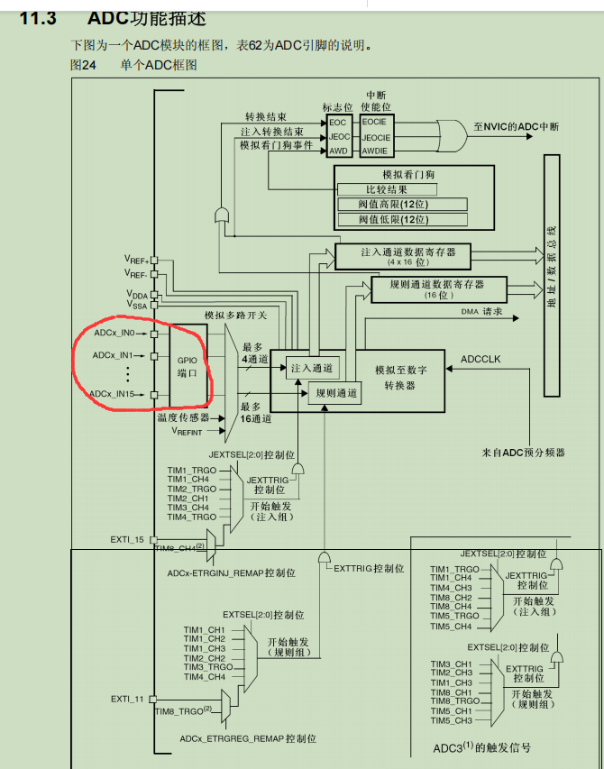
### ç†è®ºéƒ¨åˆ† 


#### 引脚
VDDA(VDD(drain to drain) analog)å³æ¨¡æ‹Ÿæ¨¡å—的电æºç”µå‹ã€‚
VSSA(VSS(source to source) analog)å³æ¨¡æ‹Ÿæ¨¡å—的地.


引脚分é…图:


å¯ä»¥ä½¿ç”¨è¿™ä¸ªåˆ†å‹ç»“æ„测é‡æ›´é«˜çš„电å‹:
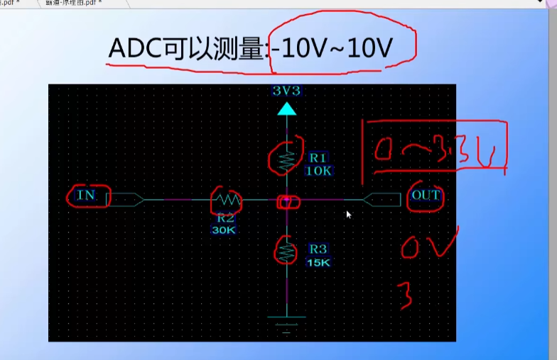
很容易导出uout和uin的线性关系:
i1=uin/(R2+R3);
i2=3v3/(R1+R3);
uout=R3(i1+i2)=R3(uin/(R2+R3)+3v3/(R1+R3)). 线性关系.

æ¯ä¸ªADC的端å£:


先看adcçš„16个外部通é“结æ„:

外部的16个通é“在转æ¢çš„时候åˆåˆ†ä¸º**规则通é“**å’Œ**注入通é“**.
其中规则通é“最多有16è·¯,注入通é“最多有4路。
**规则通é“**:顾åæ€æ„,规则通é“就是很规矩的æ„æ€ï¼Œæˆ‘们平时
一般使用的就是这个通é“。
**注入通é“**:注入,å¯ä»¥ç†è§£ä¸ºæ’å…¥,æ’队的æ„æ€ï¼Œæ˜¯ä¸€-ç§ä¸å®‰
分的通é“。它是一ç§åœ¨è§„则通é“转æ¢çš„时候强行æ’å…¥è¦è½¬æ¢çš„
一ç§ã€‚这点跟中断程åºå¾ˆåƒ,都是ä¸å®‰åˆ†çš„主。所以，注入通
é“åªæœ‰åœ¨è§„则通é“存在时æ‰ä¼šå‡ºç°ã€‚


有三格寄存器æ¥å†³å®šé€šé“转æ¢é¡ºåº.
#### 规则åºåˆ—寄存器SQRx, x=1,2,3
  

举个例å­: 如æœéœ€è¦adc模å—转æ¢é€šé“3,8两个通é“的模拟信å·å¹¶ä¸”ä¾æ¬¡å°†è½¬æ¢ç»“æœå­˜åœ¨å¯„存器里等待cpu读å–, 那麽SQR寄存器è¦è®¾ç½®ä¸º:
	SQR3çš„[4:0],å³SQ1部分设置为`00011`,å³`3`,表示第一个è¦è½¬æ¢çš„通é“是3.
	SQR3çš„[9:5],å³SQ2部分设置为`00100`,å³`8`,表示第二个è¦è½¬æ¢çš„通é“是8.
	SQR3剩下的ä½å’ŒSQR2,SQR1除了`SQL`部分的ä½å‡é»˜è®¤ä¸º`0`, 表示ä¸è½¬æ¢.
	SQL部分设置为`0010`,å³`2`, 表示一共è¦è½¬æ¢çš„通é“数为2.


#### 注入åºåˆ—寄存器JQR


#### 触å‘æºéƒ¨åˆ†
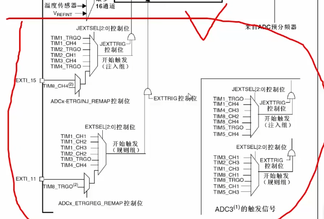
需è¦å…ˆè®¾ç½®ADON寄存器让adc模å—工作, 然å:
* 1.使用软件触å‘: 设置SWSTARTå’ŒJSWSTART寄存器.
* 2.使用外部事件触å‘:
ADON寄存器æ§åˆ¶adc模å—工作电å‹æ˜¯å¦å¼€å¯(是å¦å¼€å¯adc.)
SWSTART寄存器,æ§åˆ¶è§„则通é“å¯ä»¥å¼€å§‹è½¬æ¢äº†.
JSWSTART寄存器,æ§åˆ¶æ³¨å…¥é€šé“å¯ä»¥å¼€å§‹è½¬æ¢äº†.

也å¯ä»¥ç”¨**外部事件触å‘**
例如,下é¢çš„模å—就是规则通é“的外部触å‘:

打开EXTTRIG寄存器开å¯è§„则通é“的外部触å‘;然å
设置EXTSEL寄存器选择用哪个信å·, 然å对应的那个计时器信å·å¯ä»¥ä½œä¸ºè§¦å‘.
看模å—å¯ä»¥çŸ¥é“, å¯ä»¥ç”¨TIM1_CH1~TIM4_CH4这些计时器信å·, 也å¯ä»¥ç”¨å¤–部gpioä¿¡å·`EXTI_11`.

这几个寄存器简å•æŸ¥ä¸€ä¸‹å‘ç°éƒ½åœ¨32ä½å¯„存器`ADC_CR2`中.

#### 转æ¢.
转æ¢æ—¶é—´:


#### 转æ¢ç»“æœ:
规则组的数æ®æ”¾åœ¨`ADC_DR`寄存器.
注入组的数æ®æ”¾åœ¨`JDRx`寄存器.


* `独立模å¼`: å³å•ç‹¬ä½¿ç”¨adc1,2,3之一时.


#### 中断


##### EOC(end of complete)中断
##### JEOC()中断
##### AWD()中断
模拟看门狗的寄存器é…ç½®:
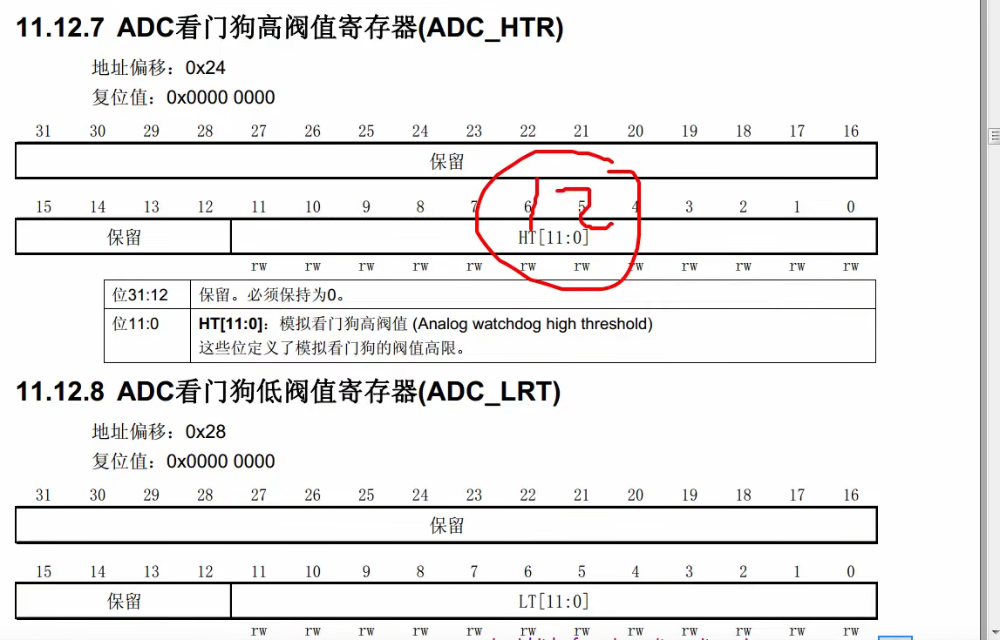


#### æ•°æ®æ¢ç®—关系
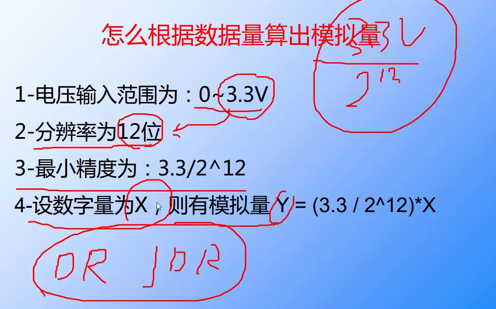


#### åˆå§‹åŒ–结æ„体:
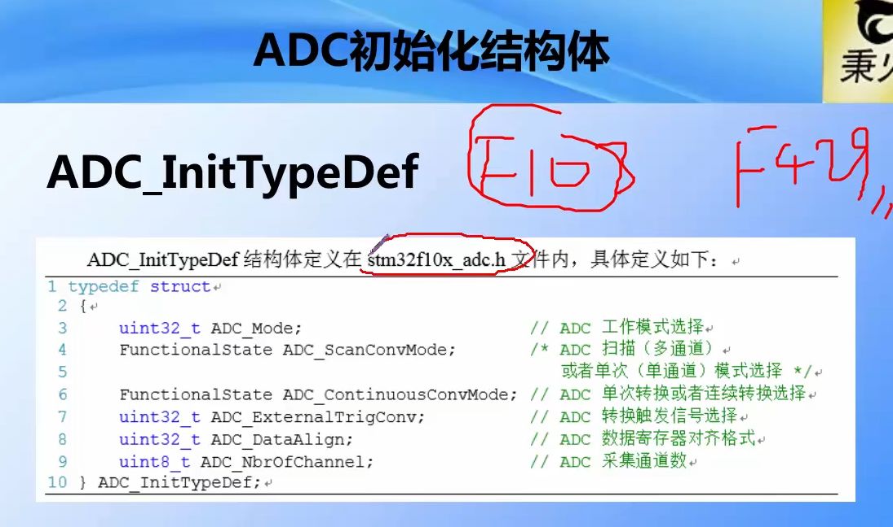


### å®éªŒéƒ¨åˆ†

首先å¤åˆ¶ä¸€ä¸ªä¸²å£å®éªŒé¡¹ç›®`USART1æ¥å‘`为基础.

改文件夹å字为ADC,开始:

在User目录新建一个adc文件夹存放驱动.
在其中新建`bsp_adc.c`å’Œ`bsp_adc.h`æ¿çº§æ”¯æŒåŒ…文件.

#### 1.编写bsp_adc.c和bsp_adc.h
在啊keil中指定头文件路径: 魔术棒->c/c++->include paths->new(insert), 选择adc文件夹, äºæ˜¯æ·»åŠ è¿™ä¸ªè·¯å¾„到头文件寻找中.

写`bsp_adc.h`. 我们è¦åœ¨é‡Œé¢å†™æ¡ä»¶ç¼–译. å¯ä»¥ä»é¡¹ç›®çš„bsp_usart.h中粘贴修改.
ç›´æ¥æŠ„æ¥ä¾‹ç¨‹ä¸­çš„bsp_adc.h.

```c
#include "bsp_adc.h"
//1.åˆå§‹åŒ–adcè¦ç”¨çš„gpio.
void ADCx_GPIO_Config(void){
	//ç›´æ¥ä»å›ºä»¶åº“例程里抄å§~
	//地å€åœ¨F:\aza\wokwok\STM32\é‡ç«ã€STM32F103å¼€å‘æ¿-指å—者】资料\1-程åºæºç _教程文档\1-[é‡ç«]《STM32库开å‘å®æˆ˜æŒ‡å—》(标准库æºç )ã€ä¼˜å…ˆå­¦ä¹ ã€‘\30-ADC—电å‹é‡‡é›†\1-ADC—å•é€šé“（中断读å–）
	
	
	//定义一个åˆå§‹åŒ–结æ„体å˜é‡.
	GPIO_InitTypeDef GPIO_InitStructure;
	
	// 打开 ADC IO端å£æ—¶é’Ÿ
	ADC_GPIO_APBxClock_FUN ( ADC_GPIO_CLK, ENABLE );
	
	// é…ç½® ADC IO 引脚模å¼
	// 必须为模拟输入
	//GPIO.pin是结æ„体GPIO_InitTypeDefçš„æˆå‘˜. 表示è¦é…置的引脚. 此处ADC_PIN在头文件å®ä¸­å®šä¹‰ä¸º`GPIO_Pin_1`.
	GPIO_InitStructure.GPIO_Pin = ADC_PIN;
	GPIO_InitStructure.GPIO_Mode = GPIO_Mode_AIN;	//模拟输出模å¼
	
	// åˆå§‹åŒ– ADC IO. ADC_PORT在å®ä¸­å®šä¹‰ä¸º`GPIOC`
	GPIO_Init(ADC_PORT, &GPIO_InitStructure);		

}


//2.åˆå§‹åŒ–ADCåˆå§‹åŒ–结æ„体
void ADCx_Mode_Config(void){
	ADC_InitTypeDef ADC_InitStruct;
	
	//打开ADC时钟.(具体这个函数å»rcc固件库里找.)
	ADC_GPIO_APBxClock_FUN ( ADC_GPIO_CLK, ENABLE ); 
	
	
	//å…ˆé…置结æ„体的第一个æˆå‘˜:ADC_Mode. adc模å¼é€‰æ‹©. 我们ç°åœ¨åªä½¿ç”¨ä¸€ä¸ªadc, 所以选择`独立模å¼`.(å»å›ºä»¶åº“stm32f10x_adc.h, line94找. 先在FWLB文件夹找到stm32f10x_adc.c,然å在其includeçš„å‰è€…跳转å³å¯.
	//en, åˆå§‹åŒ–结æ„体的6个æˆå‘˜ä¹Ÿè¦åœ¨stm32f10x_adc.h里查看结æ„体typedef哦.
	ADC_InitStruct.ADC_Mode = ADC_Mode_Independent;
	
	//第二个æˆå‘˜æ˜¯ADC_ScanConvMode(see stm32f10x_adc.h, line56). 是å¦æ‰«æ. 扫æ是针对多通é“çš„. 选择DISABLE(how can i know the options?? see .h pls.).
	ADC_InitStruct.ADC_ScanConvMode = DISABLE;
	
	//第三个æˆå‘˜æ˜¯ADC_ContinuousConvMode, 是å¦è¿ç»­è½¬æ¢, enable.
	ADC_InitStruct.ADC_ContinuousConvMode = ENABLE;
	
	
	//4th member: ADC_ExternalTrigConv, adc触å‘模å¼. choose 软件触å‘.(ä¸ä½¿ç”¨å¤–部触å‘, 外部触å‘是定时器/外部gpio)
	//选项å‚考.h文件, line123~138. 
	ADC_InitStruct.ADC_ExternalTrigConv = ADC_ExternalTrigConv_None;
	
	//5th: dataalign.
	ADC_InitStruct.ADC_DataAlign = ADC_DataAlign_Right;
	
	//6th: channel nember.
	ADC_InitStruct.ADC_NbrOfChannel = 1;


	//åˆå§‹åŒ–结æŸå, 调用adc_init.该函数的作用是: 按照上述é…置好的å‚æ•°, å»æ”¹å†™å„ç§è®¾ç½®adc功能的寄存器, å®ç°ä½ çš„é…ç½®.
	//(.h, line429: `void ADC_Init(ADC_TypeDef* ADCx, ADC_InitTypeDef* ADC_InitStruct);`)
	ADC_Init(ADC_x, &ADC_InitStruct);


	//3.1é…ç½®adc时钟. å‰å¾€å›ºä»¶åº“stm32f10x_rcc.c, line766:`void RCC_ADCCLKConfig(uint32_t RCC_PCLK2)`
	//函数的形å‚选择: è§stm32f10x_rcc.c, line760~764处说æ˜. 此处选择8分之一分频.
	RCC_ADCCLKConfig(RCC_PCLK2_Div8);
		
	
	
	//3.2é…ç½®`通é“转æ¢é¡ºåº`, `采样时间`
	//查看stm32f10x_adc.h, line442, 得到函数ADC_RegularChannelConfig.æ¯ä¸ªå‚æ•°...
	//1.哪个adc, 
	//2.哪个通é“, 
	//3.转æ¢é¡ºåº(cause 我们这里åªç”¨ä¸€ä¸ªadc通é“所以它的rank就是1å’¯.)
	//4.采样时间. è§stm32f10x_adc.c, line579~588. 这里我们选择55.5个周期.
	ADC_RegularChannelConfig(ADC_x, ADC_CHANNEL, 1, ADC_SampleTime_55Cycles5);
	
	
	
	//4.1使能adc转æ¢å®Œæˆä¸­æ–­, é…ç½®adc优先级.
	//å»adc.h中找到IT(interrupt)字样的函数: void ADC_ITConfig(ADC_TypeDef* ADCx, uint16_t ADC_IT, FunctionalState NewState);
	//1.选的哪个adc
	//2.中断类å‹. ADC_IT_EOC, 规则通é“.
	//3.enable/diable
	ADC_ITConfig(ADC_x, ADC_IT_EOC, ENABLE);
	
	
	//5.使能adc(就是打开adc), 准备开始转æ¢.
	//(最快的编程方法: 把函数定义给ai看, 让她告诉你形å‚æ€éº½è®¾ç½®.)
	ADC_Cmd(ADC_x, ENABLE);
	
	
	//6.校准adc.
	// åˆå§‹åŒ–ADC 校准寄存器  
	ADC_ResetCalibration(ADC_x);
	// 等待校准寄存器åˆå§‹åŒ–完æˆ
	while(ADC_GetResetCalibrationStatus(ADC_x));
	
	// ADC开始校准
	ADC_StartCalibration(ADC_x);
	// 等待校准完æˆ
	while(ADC_GetCalibrationStatus(ADC_x));
	
	
	//7.软件触å‘adc, 开始转æ¢.
	// ç”±äºæ²¡æœ‰é‡‡ç”¨å¤–部触å‘，所以使用软件触å‘ADCè½¬æ¢ 
	ADC_SoftwareStartConvCmd(ADC_x, ENABLE);
}

//8.编写终端æœåŠ¡å‡½æ•°, 读å–ADC转æ¢çš„æ•°æ®.
//这个函数的作用是é…ç½® ADC çš„ NVIC（嵌套å‘é‡ä¸­æ–­æ§åˆ¶å™¨ï¼‰ï¼Œä¹Ÿå°±æ˜¯å‘Šè¯‰ STM32，当 ADC 触å‘中断时，该如何处ç†ã€‚
static void ADC_NVIC_Config(void)
{
	////声æ˜ä¸€ä¸ª NVIC_InitTypeDef 结æ„体å˜é‡ï¼Œç”¨æ¥é…ç½® NVIC.
  NVIC_InitTypeDef NVIC_InitStructure;
	// 优先级分组
	NVIC_PriorityGroupConfig(NVIC_PriorityGroup_1);
	
	
	//选择è¦é…置的中断æºï¼Œè¿™é‡Œæ˜¯ ADC_IRQ（ADC 的中断）。
  NVIC_InitStructure.NVIC_IRQChannel = ADC_IRQ;
	
	//设置 抢å ä¼˜å…ˆçº§ = 1，å­ä¼˜å…ˆçº§ = 1。
  NVIC_InitStructure.NVIC_IRQChannelPreemptionPriority = 1;
  NVIC_InitStructure.NVIC_IRQChannelSubPriority = 1;
	
	//å¯ç”¨ ADC 中断。
  NVIC_InitStructure.NVIC_IRQChannelCmd = ENABLE;
	
	//调用 STM32 库函数 NVIC_Init()，把上é¢çš„é…置写入 NVIC。
  NVIC_Init(&NVIC_InitStructure);
}


//包装一下上é¢æˆ‘们写的åˆå§‹åŒ–函数.
void ADCx_Init(void){
	ADC_NVIC_Config();
	ADCx_GPIO_Config();
	ADCx_Mode_Config();
}


```


#### 2.编写中断æœåŠ¡å‡½æ•°.
在USER目录中编辑文件`stm32f10x_it.c`(itå³interrupt. stm32官方库默认中断处ç†å‡½æ•°éƒ½å®šä¹‰åœ¨è¿™ä¸ªæ–‡ä»¶.)
因为这个例å­é‡Œæˆ‘们的项目文件是拷è´çš„USARTæ¥å‘, 所以该文件写入了串å£ç»ˆç«¯æœåŠ¡å‡½æ•°. 注释æ‰, 写上我们è¦ç”¨çš„adc中断æœåŠ¡å‡½æ•°.
记得包å«å¤´æ–‡ä»¶`bsp_adc.h`

#### 3.编写main函数.
在USER目录中编辑文件`main.c`.


# 3 中断, NVIC模å—, EXTI模å—

stm32使用模å—`NVIC`(nested vectored interrupt controller,内嵌å‘é‡ä¸­æ–­æ§åˆ¶å™¨)管ç†ä¸­æ–­.
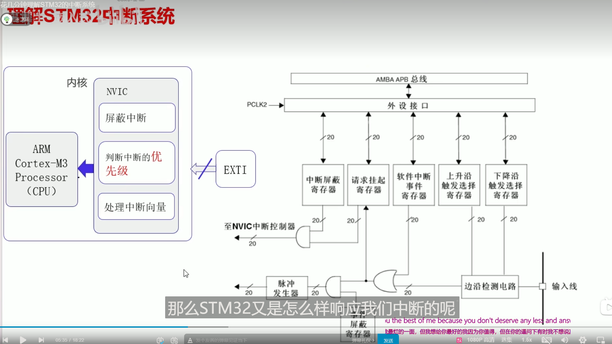
å³è¾¹çš„框图解释:
`中断`的输入é‡:
* 1.外设影å“æŸä¸ªioå£ç”µå¹³.
  * 边沿检测电路检测到上å‡/下é™(这个自己设置,也å¯ä»¥æ˜¯åŒè¾¹)å, 会给`请求挂起寄存器`ä¿¡å·. 
* 2.内部软件中断事件.
  * 软件中断事件寄存器也å¯ä»¥ç»™è¯·æ±‚挂起寄存器å‘ä¿¡å·. 
`请求挂起寄存器`用或门è¿æ¥è½¯ä»¶/ioå£ä¿¡å·, å³éƒ½å¯æ¥æ”¶.
然å:
* 当`中断å±è”½å¯„存器`å…许时, `请求挂起寄存器`ä¿¡å·å‘é€ç»™`EXTI`.

**EXTI**(external interrupt controller,外部中断æ§åˆ¶å™¨). 管ç†å¤–部中断, 然å给信å·åˆ°NVIC. "秘书的秘书".

stm32拥有19个`EXTI`模å—, 比如EXTI0管ç†çš„i/oå£ä¸ºPA0,PB0,PC0,PD0,PE0.

* 注æ„: stm32中, 相åŒç¼–å·çš„ioå£(如PA0å’ŒPB0两个引脚)使用相åŒçš„EXTI线. ä¸èƒ½åŒæ—¶è®¾ç½®ä¸ºä¸åŒçš„外部中断, 会失效.


**中断å‘é‡**: å³ä¸­æ–­æœåŠ¡ç¨‹åºæ‰€åœ¨çš„ä½ç½®.(这里的`å‘é‡`å…¶å®å°±æ˜¯ä¸ª**指针**)
**中断嵌套**: 优先级更高的中断请求打断了正在进行的中断æœåŠ¡.

**优先级**:
对æ¯ä¸€ä¸ªä¸­æ–­è¯·æ±‚, 需è¦é…置其
* 抢å å¼ä¼˜å…ˆçº§(如æœå·²ç»æœ‰æ­£åœ¨å¤„ç†çš„中断请求, 抢å ä¼˜å…ˆçº§æ›´é«˜çš„中断å¯ä»¥æ‰“断它.)
* å“应å¼ä¼˜å…ˆçº§(用æ¥åˆ¤æ–­cpu正常è¿è¡Œæ²¡æœ‰ä¸­æ–­è¯·æ±‚的时候的优先级.) 
两ç§ä¼˜å…ˆçº§éƒ½æ˜¯ä¸€ä¸ªæ•°å­—, 数字越ä½(1)越高级.

#### 中断函数的例å­:
```c
//中断æœåŠ¡å‡½æ•°ISR应当写在`stm32f10x_it.c`中.

//TIM6外设的中断函数. 其中有库函数和å®:
//TIM_GetITStatus,...: stm32f10x_tim.c中的库函数.
//定时器硬件模å—选择
//#define	BASIC_TIM		TIM6
//...
void  BASIC_TIM_IRQHandler (void)
{
	if ( TIM_GetITStatus( BASIC_TIM, TIM_IT_Update) != RESET ) 
	{	
		//一个全局å˜é‡.
		time++;
		//清除中断标志ä½
		TIM_ClearITPendingBit(BASIC_TIM , TIM_FLAG_Update);  		 
	}		 	
}
```

# 5. 标准库...编程ç»éªŒ

## 5.1 头文件
---
æ ¹æ®æˆ‘们的ç»éªŒ, 头文件大致结æ„为:
1. 定义åˆå§‹åŒ–结æ„体;
2. 用å®ç»™å‡ºç»“æ„体的æˆå‘˜çš„值的å³å€¼é€‰é¡¹(å…¶å®å°±æ˜¯ç”¨åˆ«å代替一个个寄存器)
3. 固件库函数. 
   1. 会有init函数, 也就是调用æ¥åˆå§‹åŒ–结æ„体(把填的设置写到寄存器里)
   2. ...其他常用函数. 

固件库编程中, 常用的两类结æ„体:
* [外设å]_InitTypeDef
  * 这个结æ„体用æ¥å¯¹æŸä¸ªç‰¹å®šå¤–设([外设å]_TypeDef类的对象)进行é…ç½®. 它储存设置用的寄存器赋值. 由用户声æ˜, 然å作为形å‚ä¼ å…¥init函数进行åˆå§‹åŒ–.
* [外设å]_TypeDef
  * 这个结æ„体
  * 该结æ„体的å®ä¾‹ç”± STM32 固件库(stm32f10x.h)æ供，对应 STM32 内部 USART 硬件外设的寄存器。一般用户ä¸æ¶‰åŠå£°æ˜æ–°çš„结æ„体哦.
   
---


## 5.3 标准库...åˆå§‹åŒ–结æ„体, 以USART为例
有两个结æ„体. 它们在固件库FWLBçš„stm32f10x_usart.c中

```c
typedef struct
{
  uint32_t USART_BaudRate;            /*!< This member configures the USART communication baud rate.
                                           The baud rate is computed using the following formula:
                                            - IntegerDivider = ((PCLKx) / (16 * (USART_InitStruct->USART_BaudRate)))
                                            - FractionalDivider = ((IntegerDivider - ((u32) IntegerDivider)) * 16) + 0.5 */

  uint16_t USART_WordLength;          /*!< Specifies the number of data bits transmitted or received in a frame.
                                           This parameter can be a value of @ref USART_Word_Length */

  uint16_t USART_StopBits;            /*!< Specifies the number of stop bits transmitted.
                                           This parameter can be a value of @ref USART_Stop_Bits */

  uint16_t USART_Parity;              /*!< Specifies the parity mode.
                                           This parameter can be a value of @ref USART_Parity
                                           @note When parity is enabled, the computed parity is inserted
                                                 at the MSB position of the transmitted data (9th bit when
                                                 the word length is set to 9 data bits; 8th bit when the
                                                 word length is set to 8 data bits). */
 
  uint16_t USART_Mode;                /*!< Specifies wether the Receive or Transmit mode is enabled or disabled.
                                           This parameter can be a value of @ref USART_Mode */

  uint16_t USART_HardwareFlowControl; /*!< Specifies wether the hardware flow control mode is enabled
                                           or disabled.
                                           This parameter can be a value of @ref USART_Hardware_Flow_Control */
} USART_InitTypeDef;

```

如æœä¸ç”¨ä½¿ç”¨åŒæ­¥åŠŸèƒ½, ä¸éœ€è¦åˆå§‹åŒ–下é¢è¿™ä¸ªæ—¶é’Ÿç»“æ„体咯.
```c
typedef struct {
uint16_t USART_Clock; // 时钟使能æ§åˆ¶
uint16_t USART_CPOL; // 时钟æ性(空闲的时候是高电平还是ä½ç”µå¹³.)
uint16_t USART_CPHA; // 时钟相ä½(第一个边沿触å‘还是第二个边沿触å‘)
uint16_t USART_LastBit; // 最尾ä½æ—¶é’Ÿè„‰å†²(当 STM32 çš„ USART å¤„äº åŒæ­¥æ¨¡å¼ï¼ˆSynchronous Mode） 时，USART 需è¦è¾“å‡ºä¸€ä¸ªæ—¶é’Ÿä¿¡å· (USARTx_CK) æ¥åŒæ­¥é€šä¿¡ã€‚USART_LastBit 决定是å¦åœ¨æ•°æ®å¸§çš„ 最åä¸€ä½ å‘é€æ—¶å†è¾“出一个é¢å¤–的时钟脉冲。)
} USART_ClockInitTypeDef;

```

## 5.4 固件库函数, 以USART为例
它们在固件库FWLB的stm32f10x_usart.c中
```c
void USART_DeInit(USART_TypeDef* USARTx);//default init. 就是把æŸä¸ªusart硬件`USARTx`åˆå§‹åŒ–为默认值.
void USART_Init(USART_TypeDef* USARTx, USART_InitTypeDef* USART_InitStruct);//åˆå§‹åŒ–函数. æ¥å—æŸä¸ªusart硬件`USARTx`和用户写的åˆå§‹åŒ–设置结æ„体`USART_InitStruct`, 然å把å‰è€…用å者进行åˆå§‹åŒ–.
void USART_StructInit(USART_InitTypeDef* USART_InitStruct);//把传入的åˆå§‹åŒ–结æ„体设置为默认值.
void USART_ClockInit(USART_TypeDef* USARTx, USART_ClockInitTypeDef* USART_ClockInitStruct);//用时钟åˆå§‹åŒ–结æ„体, æ¥é…ç½®æŸä¸ªusart的时钟. (适用äºåŒæ­¥æ¨¡å¼. 我们一般都使用异步模å¼...ä¸éœ€è¦é…置时钟.)
void USART_ClockStructInit(USART_ClockInitTypeDef* USART_ClockInitStruct);//把传入的åˆå§‹åŒ–结æ„体设置为默认值.
void USART_Cmd(USART_TypeDef* USARTx, FunctionalState NewState);//
void USART_ITConfig(USART_TypeDef* USARTx, uint16_t USART_IT, FunctionalState NewState);//中断é…ç½®. usartå‘é€æ•°æ®å¯„存器为空/完æˆå‘é€/æ¥å—æ•°æ®å¯„存器为空..æ—¶, 都å¯ä»¥äº§ç”Ÿä¸­æ–­.
void USART_DMACmd(USART_TypeDef* USARTx, uint16_t USART_DMAReq, FunctionalState NewState);
void USART_SetAddress(USART_TypeDef* USARTx, uint8_t USART_Address);
void USART_WakeUpConfig(USART_TypeDef* USARTx, uint16_t USART_WakeUp);
void USART_ReceiverWakeUpCmd(USART_TypeDef* USARTx, FunctionalState NewState);
void USART_LINBreakDetectLengthConfig(USART_TypeDef* USARTx, uint16_t USART_LINBreakDetectLength);
void USART_LINCmd(USART_TypeDef* USARTx, FunctionalState NewState);
void USART_SendData(USART_TypeDef* USARTx, uint16_t Data);
uint16_t USART_ReceiveData(USART_TypeDef* USARTx);
void USART_SendBreak(USART_TypeDef* USARTx);
void USART_SetGuardTime(USART_TypeDef* USARTx, uint8_t USART_GuardTime);
void USART_SetPrescaler(USART_TypeDef* USARTx, uint8_t USART_Prescaler);
void USART_SmartCardCmd(USART_TypeDef* USARTx, FunctionalState NewState);
void USART_SmartCardNACKCmd(USART_TypeDef* USARTx, FunctionalState NewState);
void USART_HalfDuplexCmd(USART_TypeDef* USARTx, FunctionalState NewState);
void USART_OverSampling8Cmd(USART_TypeDef* USARTx, FunctionalState NewState);
void USART_OneBitMethodCmd(USART_TypeDef* USARTx, FunctionalState NewState);
void USART_IrDAConfig(USART_TypeDef* USARTx, uint16_t USART_IrDAMode);
void USART_IrDACmd(USART_TypeDef* USARTx, FunctionalState NewState);
FlagStatus USART_GetFlagStatus(USART_TypeDef* USARTx, uint16_t USART_FLAG);//è·å–usart的状æ€æ ‡å¿—ä½. 
// USART_FLAG_TXE	å‘é€æ•°æ®å¯„存器空，表示å¯ä»¥å‘é€æ–°æ•°æ®
// USART_FLAG_RXNE	æ¥æ”¶æ•°æ®å¯„存器é空，表示有新数æ®å¯ä»¥è¯»å–
// USART_FLAG_TC	å‘é€å®Œæˆ
// USART_FLAG_ORE	过载错误
// USART_FLAG_FE	帧错误
void USART_ClearFlag(USART_TypeDef* USARTx, uint16_t USART_FLAG);//手动清除 USART 标志ä½.
ITStatus USART_GetITStatus(USART_TypeDef* USARTx, uint16_t USART_IT);//检查 USART çš„ä¸­æ–­æ ‡å¿—ä½ æ˜¯å¦è¢«è§¦å‘，判断是å¦è¿›å…¥æŸä¸ª USART 中断状æ€ã€‚
// USART_IT_TXE	å‘é€å¯„存器空中断
// USART_IT_RXNE	æ¥æ”¶æ•°æ®å¯„存器é空中断
// USART_IT_TC	å‘é€å®Œæˆä¸­æ–­
// USART_IT_ORE	过载错误中断
// USART_IT_FE	帧错误中断
void USART_ClearITPendingBit(USART_TypeDef* USARTx, uint16_t USART_IT);//清除 USART çš„ä¸­æ–­æŒ‚èµ·æ ‡å¿—ï¼Œå³ æ‰‹åŠ¨æ¸…é™¤æŸä¸ªä¸­æ–­çŠ¶æ€ï¼Œé¿å…中断é‡å¤è§¦å‘。
```


## 5.5 编程任务和æµç¨‹
* 01-åˆå§‹åŒ–串å£éœ€è¦ç”¨åˆ°çš„GPIO
* 02-åˆå§‹åŒ–串å£, USART _InitTypeDef
* 03-中断é…ç½®(æ¥æ”¶ä¸­æ–­,中断优先级)
* 04-使能串å£
* 05-编写å‘é€å’Œæ¥æ”¶å‡½æ•°
* 06-编写中断æœåŠ¡å‡½æ•°


## 5.6 程åºç§»æ¤: 如何å¤ç”¨è‡ªå·±å†™çš„外设bsp?

1. å¤åˆ¶USER的外设文件夹(一般包å«`bsp_外设.c`, `bsp_外设.h`), 并在keil项目中添加这些文件到1.项目和2.链æ¥å™¨ä¸­
2. 在项目的`stm32f10x_conf.h`中将对应的外设的库文件头文件包å«(å–消注释)
3. 在main.c中包å«`bsp_外设.h`, å³å¯å¼€å§‹åœ¨main.c中使用该外设了.

## 5.7 delay 延时


最简å•ç²—暴的空转延时函数法:
```c
void Delay(__IO uint32_t nCount)
{
  for(; nCount != 0; nCount--);
} 
```
`Delay(0x400000);`大概会在72MHzçš„STM32上延时1så·¦å³.


## 5.8 两ç§æ£€æµ‹æ–¹å¼: 轮询扫æ&设置中断


| 特性        | 轮询扫ææ–¹å¼              | ä¸­æ–­æ–¹å¼                    |
| --------- | ------------------- | ----------------------- |
| æ£€æµ‹æ–¹å¼      | 程åºä¸»åŠ¨è°ƒç”¨ `Key_Scan()` | é…ç½® `EXTI` ä¸­æ–­å‡½æ•°è‡ªåŠ¨è§¦å‘      |
| å“åº”æ•ˆç‡      | ä½ï¼Œéœ€é¢‘ç¹è°ƒç”¨å‡½æ•°           | 高，按下立å³è·³è½¬ä¸­æ–­              |
| å ç”¨ CPU 时间 | 高，å ç”¨ä¸»å¾ªç¯èµ„æº           | ä½ï¼Œåªåœ¨è§¦å‘æ—¶å“应               |
| 适åˆåº”用场景    | 简å•é¡¹ç›®ã€ä½é€ŸæŒ‰é”®ã€ä¸æ€•é˜»å¡      | å®æ—¶æ€§è¦æ±‚高ã€åŠŸè€—优化等            |
| 代ç å¤æ‚度     | ä½ï¼Œæ˜“äºä¸Šæ‰‹              | 高，需è¦é…ç½® `EXTI` + NVIC 中断 |
| å»æŠ–åŠ¨æ–¹å¼     | å¯åœ¨ while 里等待稳定      | 通常需加软件延时或定时器过滤          |

### 1.轮询扫æ
比如设置按钮key1的轮询扫ææ¥æ£€æµ‹æŒ‰é’®:

在mainçš„æ— é™å¾ªç¯ä¸­è°ƒç”¨ä¸€ä¸ªè‡ªå®šä¹‰`Key_Scan`函数:
```c
 while (1)
  {	
		if(Key_Scan(KEY1_GPIO_PORT,KEY1_GPIO_PIN) == KEY_ON)
		{		
			//do sth		
		}
	} 
```
而`Key_Scan`是调用`GPIO_ReadInputDataBit`函数å®ç°çš„. 它就是读å–`GPIO`çš„**输入数æ®å¯„存器IDR**的值. 在æ¨æŒ½è¾“出模å¼ä¸‹, 其值å³ä¸ºè®¾ç½®çš„输出电平.


```c
uint8_t Key_Scan(GPIO_TypeDef* GPIOx,uint16_t GPIO_Pin)
{			
	/*检测是å¦æœ‰æŒ‰é”®æŒ‰ä¸‹ */
	if(GPIO_ReadInputDataBit(GPIOx,GPIO_Pin) == KEY_ON )  
	{	 
		/*等待按键释放 */
		while(GPIO_ReadInputDataBit(GPIOx,GPIO_Pin) == KEY_ON);   
		return 1;	 
	}
	else
		return 0;
}
```

然å我们记得é…ç½®key为


# 6.电æºç®¡ç†

stm32芯片的电æºæ¨¡å—:


特别的,stm13f103v6(指å—者)å‹å·çš„usb供电模å—åŸç†å›¾:


## 6.1 三ç§æ¨¡å¼

模å¼å称	        | CPU状æ€	      | 时钟状æ€				 | 电æµå…¸å‹å€¼ï¼ˆ@72 MHz） | 说æ˜
|------------------|--------------|--------------------|-----------------------|------|
è¿è¡Œæ¨¡å¼ï¼ˆRun）     | 正常è¿è¡Œ         | 所有开å¯ï¼ˆHSEã€PLL） | 20ï½30 mA | CPU 主频全速è¿è¡Œï¼Œå¤–设全开
ç¡çœ æ¨¡å¼ï¼ˆSleep）   | CPUåœæ­¢ï¼Œå¤–设继续 | 外设时钟正常 | 6ï½12 mA | 用 __WFI()，中断å¯å”¤é†’
åœæ­¢æ¨¡å¼ï¼ˆStop）    | CPUåœæ­¢          | 主时钟关闭，仅ä½é€Ÿæ—¶é’Ÿä¿ç•™ | 10ï½100 µA | RAM ä¿æŒï¼Œå”¤é†’ç¨æ…¢ï¼Œå¯é€šè¿‡ RTC 唤醒
待机模å¼ï¼ˆStandby） | 全部åœæ­¢         | 所有时钟关闭 | 1ï½10 µA | RAM丢失，需å¤ä½å”¤é†’，功耗最ä½

### 1.ç¡çœ æ¨¡å¼(sleep)

通过调用_WFI()或_WFE()进入ç¡çœ .

ç¡çœ æœ‰ä¸¤ä¸ªæ¨¡å¼: ç«‹å³å’Œé€€å‡ºæ—¶. 它们主è¦æ˜¯é€šè¿‡WFI()ç¡çœ æ—¶åŒºåˆ†çš„. 通过é…置内核寄存器`SLEEPONEXIT`设置.


### 2.åœæ­¢æ¨¡å¼(stop)


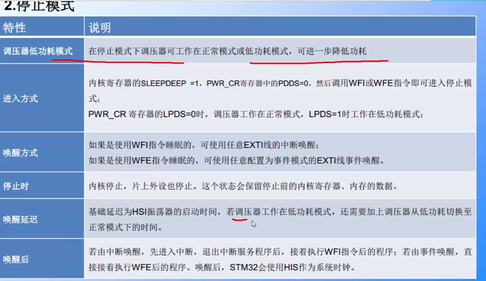


### 3.待机模å¼(standby关机)


注æ„: 如æœæœ‰å¤‡ä»½ä¾›ç”µ(纽扣电池), `备份域`内的RTC都å¯ä»¥æ­£å¸¸è¿è¡Œ, 寄存器都å¯ä»¥è¢«æ­£å¸¸ä¿å­˜.

## 6.2 电æºæ§åˆ¶(POWER CONTROL, PWR)的寄存器(PWR_CR)和库函数

它们是arm cc编译器支æŒçš„一些指令, 是最底层的指令了. 我们ä¸èƒ½å†è¿›ä¸€æ­¥è·³è½¬...


我们å¯ä»¥å»çœ‹`Cortex-M3 æƒå¨æŒ‡å—`:


#### WFI和WFE命令  


## 6.3 ä½åŠŸè€—å®éªŒ

我们通过软件使寄存器:
* SLEEPDEEP = 1
* PWR_CR->PDDS = 1
* PWR_CR->WUF = 0
然å调用`__WFI()`/`__WFE`, 进入待机.

唤醒: ç»™`WKUP`引脚上å‡æ²¿ä¿¡å·.

但是具体版上哪个引脚是`WKUP`引脚呢?

我们看到`æ•°æ®æ‰‹å†Œ Table 5. High-density STM32F103xx pin definitions (continued)`中, `WKUP`引脚被æ¥åœ¨`PA0` 引脚.

我们看到`指å—者åŸç†å›¾`中, `K1`按键按下å, `PA0`引脚会通过电阻R15æ¥å…¥é«˜ç”µå¹³.
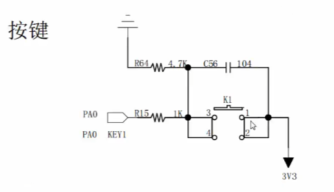


## 7. RTC

用rtcå®ç°ä¸€ä¸ªä¸­æ–­ï¼š

先看bsp_rtc.c
```c
#include "bsp_rtc.h"

#include "stm32f10x.h"

#include <stdio.h>

#include "stm32f10x_exti.h"
#include "delay.h"

//rtc闹钟触å‘标志. å¤ä¹ :__IO是stm一个å®, ==volatile, 表达这个å˜é‡å¯èƒ½è¢«ç¡¬ä»¶ä¸­æ–­æˆ–改å˜, ä¸å…许优化和缓存å·æ‡’, 时刻监视.
__IO uint8_t rtc_alarm_triggered = 0;


//rtc外设é…置中断, å³åœ¨NVIC中注册RTC中断通é“
void RTC_NVIC_Config(void)
{
	

    NVIC_InitTypeDef NVIC_InitStructure;	//NVICé…置结æ„体


	  EXTI_InitTypeDef EXTI_InitStructure;	//EXITé…置结æ„体
	    
	
	
    EXTI_ClearITPendingBit(EXTI_Line17);// 清除 EXTI Line17 的中断挂起标志
	  // è¿æ¥ EXTI Line17 到 RTC Alarm
	  EXTI_InitStructure.EXTI_Line = EXTI_Line17;
    EXTI_InitStructure.EXTI_Mode = EXTI_Mode_Interrupt;
    EXTI_InitStructure.EXTI_Trigger = EXTI_Trigger_Rising;
    EXTI_InitStructure.EXTI_LineCmd = ENABLE;
    EXTI_Init(&EXTI_InitStructure);
	
	
	
    NVIC_PriorityGroupConfig(NVIC_PriorityGroup_1);	//设置 中断优先级分组策略在 ä¸ä½¿ç”¨ HALã€å®Œå…¨è£¸æœºé£æ ¼ï¼ˆæ¯”如你ç°åœ¨çš„库） 中，这个é…ç½® 是必须的，å¦åˆ™åé¢ NVIC_Init() 设置的优先级å¯èƒ½ä¼šè¢«å¿½ç•¥æˆ–ä¸ç”Ÿæ•ˆã€‚
	
		//注æ„è¿™ä¸æ˜¯ RTC_IRQn 而是 RTCAlarm_IRQn）
    NVIC_InitStructure.NVIC_IRQChannel = RTCAlarm_IRQn;
	//享有最高优先级.
    NVIC_InitStructure.NVIC_IRQChannelPreemptionPriority = 0;
    NVIC_InitStructure.NVIC_IRQChannelSubPriority = 0;
    NVIC_InitStructure.NVIC_IRQChannelCmd = ENABLE;
    NVIC_Init(&NVIC_InitStructure);
}


//åˆå§‹åŒ–rtc外设.
void RTC_Configuration(void)
{
		//打开 PWR 和 BKP 外设时钟
    RCC_APB1PeriphClockCmd(RCC_APB1Periph_PWR | RCC_APB1Periph_BKP, ENABLE);
	
		//å…许访问å备寄存器（BKP 寄存器）
    PWR_BackupAccessCmd(ENABLE);
	
		//å¤ä½RTCå’ŒBKP寄存器的备份域, 好习惯.
    BKP_DeInit();
		
		//å¯ç”¨LSE
    RCC_LSEConfig(RCC_LSE_ON);
	
		//等待LSE稳定(起振)
    while (RCC_GetFlagStatus(RCC_FLAG_LSERDY) == RESET);
	
		//设置RTC的时钟æºä¸ºLSE
    RCC_RTCCLKConfig(RCC_RTCCLKSource_LSE);
	
		//使能RTC时钟
    RCC_RTCCLKCmd(ENABLE);

	  // 等待 RTC 寄存器åŒæ­¥å®Œæˆï¼ˆå¿…须）
    // 因为 APB 时钟快ã€RTC 慢，需è¦åŒæ­¥åæ‰å…许æ“作 RTC
    RTC_WaitForSynchro();
		
		//等待上一æ¡å‘½ä»¤å®Œæˆï¼ˆRTC 是ä½é€Ÿå¤–设，需等待确认）
    RTC_WaitForLastTask();

		//使能 RTC 的闹钟中断（Alarm 中断）.RTC有三ç§ä¸­æ–­æ¥æº, 用三个寄存器æ§åˆ¶.
    RTC_ITConfig(RTC_IT_ALR, ENABLE);
		
		//å†æ¬¡ç­‰å¾…上æ¡å†™å‘½ä»¤å®Œæˆ
    RTC_WaitForLastTask();


		//设置 RTC 的分频器，使其以 1Hz 计数
    // LSE = 32768 Hz → 32767 分频åæ¯ç§’è¿› 1（1 Hz）
    RTC_SetPrescaler(32767);
    RTC_WaitForLastTask();
}


//é…置一个seconds秒å触å‘的闹钟.
void RTC_SetAlarmInSeconds(uint32_t seconds)
{
		//RTC_GetCounter()库函数读å–当å‰RTC计数器的值, å³UNIX时间戳.
    uint32_t current_time = RTC_GetCounter();
	
		//RTC_SetAlarm()函数对RTC外设*设置闹钟*(请å‚è§RTC外设产生中断的三ç§æ–¹å¼, alarm就是其中一ç§). 届时,RTC会产生一个中断信å·.
    RTC_SetAlarm(current_time + seconds);
	
		//等待上é¢å‡½æ•°çš„寄存器写æ“作完æˆ.
    RTC_WaitForLastTask();
}


//RTC的中断æœåŠ¡å‡½æ•°. 在it.c中转å‘这个函数, å®ç°è§£è€¦çš„效æœ.
void BSP_RTCAlarm_IRQHandler(void)
{
    if (RTC_GetITStatus(RTC_IT_ALR) != RESET)
    {
				//清除中断标志
        RTC_ClearITPendingBit(RTC_IT_ALR);
			
				//清除外部中断线
        RTC_WaitForLastTask();
			
				//设置闹钟触å‘å˜é‡ä¸º1

        rtc_alarm_triggered = 1;
			
		/*****************redé—ªçƒ******************************/
		//GPIO_ResetBits(GPIOB, GPIO_Pin_5);				Delay(0x0FFFFF);
		//GPIO_SetBits(GPIOB, GPIO_Pin_5);					Delay(0x0FFFFF);
		//GPIO_ResetBits(GPIOB, GPIO_Pin_5);					Delay(0x0FFFFF);
		//GPIO_SetBits(GPIOB, GPIO_Pin_5);					Delay(0x0FFFFF);
		/*****************redé—ªçƒ******************************/
						
				EXTI_ClearITPendingBit(EXTI_Line17);
    }
}

```

然å在main.c中å¯ä»¥è¿™æ ·:
```c
//2025.6.22.azazel
 //这是æ¥è‡ªUSART1æ¥å‘项目文件夹的基础上进行的adcå•é€šé“中断读å–项目的基础上的阈值检测.
 //的基础上的USART1_ADC_DMA.
 //的基础上的USART1_ADC_DMA_TIMled.
 //的基础上的rtc休眠
#include "stm32f10x.h"
#include "bsp_usart.h"
#include "bsp_adc.h"
#include "bsp_tim.h"
#include "bsp_led.h"
#include "bsp_rtc.h"
#include "bsp_beep.h"
#include "delay.h"

extern __IO uint16_t ADC_ConvertedValue;
extern uint8_t led_timer_count;

//局部å˜é‡.用æ¥ä¿å­˜è½¬æ¢è®¡ç®—å的电å‹å€¼
float ADC_ConvertedValueLocal;
#define THRESHOLD_VOLTAGE 0.05f


int main(void)
{	
	
	/****************************除了RTC外的åˆå§‹åŒ–***************************************/
  USART_Config();  /*åˆå§‹åŒ–USART é…置模å¼ä¸º 115200 8-N-1，中断æ¥æ”¶*/
	ADCx_Init();	//åˆå§‹åŒ–adc
	LED_GPIO_Config();	//åˆå§‹åŒ–LED
	RED_LED_GPIO_Config();	//åˆå§‹åŒ–RED LED
	BasicTIM_Init();		//åˆå§‹åŒ–TIM
	BEEP_GPIO_Config();			/* BEEP GPIO åˆå§‹åŒ– */
	/*************************************************************************/
	
	
	/****************************RTCåˆå§‹åŒ–*********************************************/	
	RTC_NVIC_Config();	// RTC 中断通é“é…ç½®
	RTC_Configuration();	// RTC 外设åˆå§‹åŒ–（LSEã€åˆ†é¢‘器ã€Alarm 中断使能）
	/*************************************************************************/


  while(1)
	{	
		rtc_alarm_triggered = 0; // 清标志		
		RTC_SetAlarmInSeconds(5);	//设定工作闹钟: 工作时间为5秒
		
		
		/******************************è¦è¿›è¡Œçš„工作循ç¯*******************************************/
		while(!rtc_alarm_triggered){
			//电å‹å€¼=寄存器值/4096*3.3
			ADC_ConvertedValueLocal =(float) ADC_ConvertedValue/4096*3.3; 

			if (ADC_ConvertedValueLocal >= THRESHOLD_VOLTAGE)//如æœè¶…过阈é™
			{
					// å°† LED ç½®ä½ï¼Œç‚¹äº® LED
					GPIO_ResetBits(GPIOB, GPIO_Pin_0);
					// é‡ç½®è®¡æ—¶å™¨ä¸º x（ x * 中断触å‘频ç‡(0.1s) = x/10s）
					led_timer_count = 5; 
				
					BEEP( ON ); 			  // å“
					Delay(0x0FFFFF);	
					BEEP( OFF );		  // ä¸å“
					Delay(0x0FFFFF);
			} 
		/*************************************************************************/

		}
		
		/* —— 工作闹钟触å‘å进入这里 —— */
		rtc_alarm_triggered = 0; // 清标志
		GPIO_SetBits(GPIOB, GPIO_Pin_0);
		/* —— 设定休眠闹钟. 休眠时间为x秒 —— */
		RTC_SetAlarmInSeconds(5);
		

		

		/* —— 进入 Stop 模å¼ï¼Œç­‰å¾… RTC 中断自动唤醒 —— */
		PWR_EnterSTOPMode(PWR_Regulator_LowPower, PWR_STOPEntry_WFI);

		/* —— 唤醒åè¦é‡é…置系统时钟 —— */
		
		SystemInit();
		/*除了RTC外的åˆå§‹åŒ–******************************************************************/
		USART_Config();  /*åˆå§‹åŒ–USART é…置模å¼ä¸º 115200 8-N-1，中断æ¥æ”¶*/
		ADCx_Init();	//åˆå§‹åŒ–adc
		LED_GPIO_Config();	//åˆå§‹åŒ–LED
		BasicTIM_Init();		//åˆå§‹åŒ–TIM
		
		//亮ç¯è¡¨ç¤ºä¼‘眠结æŸ
		/*****************redé—ªçƒ******************************/
		int i=5;
		while(i--){
		GPIO_ResetBits(GPIOB, GPIO_Pin_5);				Delay(0x05FFFF);
		GPIO_SetBits(GPIOB, GPIO_Pin_5);					Delay(0x05FFFF);
		}
		/*****************redé—ªçƒ******************************/
	}	
}
/*********************************************END OF FILE**********************/

```


## 8.æ‚项

### 8.1. å»å“ªé‡Œæ‰¾å¼•è„š?
* 使用外设(如串å£usart, ADC, i2c, spi)...引脚(绑定到哪个gpioå£), å»`æ•°æ®æ‰‹å†Œ`里找(pinouts and pin descriptions). 注æ„`å‚考手册`里没有. 它主è¦æ˜¯ä»‹ç»å¤–设的功能和åŸç†å›¾ä»¥åŠå¯„存器说æ˜.

	比如, 我们使用adc, 先看`å‚考手册`:
	
	ç°åœ¨æˆ‘们想知é“外部通é“ADCx_IN0~ADCx_IN15è¿™16个外部通é“æ¥å“ªä¸ªgpio引脚. 

	ç°åœ¨å»æŸ¥`æ•°æ®æ‰‹å†Œ`, 找到
	


	å‘ç°æ–‡ä»¶ä¸€å¤„错误: stm32f10xx中文说æ˜æ‰‹å†Œï¼Œå¯„存器映射GPIOF基地å€é”™äº†ï¼Œåˆ«é—®æˆ‘æ€ä¹ˆçŸ¥é“的，这是一个痛苦的故事。


	出ç°flash download failed cortex-M3，然åå°†debug中setting中的debug中的connect设置为under reset， reset设为SYSRESETEQåå°±å¯ä»¥äº†.


	编译出ç°4个错误20个警告的è¯ï¼Œé­”术棒target里å³ä¸Šé€‰version5版本.

* stm32的引脚上电å如æœä¸åˆå§‹åŒ–, 默认是浮空输入模å¼. å¯ä»¥æ— è§†.
* ä½ å¯ä»¥ç”¨gpioå£æ¨æŒ½è¾“出高ä½ç”µå¹³æ¥é©±åŠ¨ä½åŠŸè€—的外设, 但是这ä¸è§„范, 最好还是用stm32çš„GNDå’Œ3.3V两个引脚æ¥é©±åŠ¨.

### 8.2. 常用英文缩写说æ˜

-   **LDO**：Low Drop-Out regulator，ä½å‹å·®çº¿æ€§ç¨³å‹å™¨. 比DC-DCé™å‹æ¨¡å—,比如buckä½èƒ½, 就是纯电阻分å‹.
    -   工作方å¼ï¼šåœ¨è¾“入和输出之间串è”一个“å¯å˜ç”µé˜»â€ï¼ˆé€šå¸¸æ˜¯ä¸€ä¸ªæ™¶ä½“管），通过调节它的导通度æ¥ä¸¢å¼ƒå¤šä½™ç”µå‹ã€‚
    -   优点：电路简å•ã€å“应快ã€è¾“出噪声ä½ã€‚  
    -   缺点：效ç‡ä½â€”—当输入电å‹é«˜äºè¾“出很多时，剩余能é‡å…¨ä»¥çƒ­é‡å½¢å¼æµªè´¹æ‰ï¼›å°¤å…¶ ΔV（输入−输出）越大，æŸè€—越严é‡ã€‚


    
-   **MCU**：Microcontroller Unit，微æ§åˆ¶å™¨å•å…ƒ
    
-   **ADC**：Analog‑to‑Digital Converter，模数转æ¢å™¨
    
-   **VDDA**：Voltage Digital‑to‑Analog，模拟电æºè¾“å…¥
    
-   **VSSA**：Voltage Serial Signal Analog，模拟地
    
-   **VBUS**：USB 总线供电电å‹

### 8.3. 通信åè®®

### 3.0 通信å议的电平标准

| 电平标准                                          | å…¸å‹ç”µå‹èŒƒå›´                 | 逻辑0电平     | 逻辑1电平     | 常è§ä½¿ç”¨åœºæ™¯/åè®®                   |
| --------------------------------------------- | ---------------------- | --------- | --------- | --------------------------- |
| **TTL (Transistor-Transistor Logic)**         | 0V \~ 5V| < 0.8V    | > 2.0V    | UART（å•ç‰‡æœºï¼‰ã€SPIã€I2C（主æµMCU级通信） |
| **LVTTL (Low Voltage TTL)**                   | 0V \~ 3.3V(兼容TTL)        | < 0.8V    | > 2.0V    | 新一代 MCU/FPGA（STM32, Zynq 等） |
| **CMOS**                                      | 0V \~ Vcc（1.8V\~5V ä¸ç­‰ï¼‰(兼容TTL) | < 0.3×Vcc | > 0.7×Vcc | SPIã€I2Cã€æ•°å­—逻辑芯片内部传输          |
| **RS-232**                                    | -12V \~ +12V（±5\~15V）  | > +3V     | < -3V     | PC串å£é€šä¿¡ï¼ˆè€å¼ä¸²å£ï¼‰ã€è°ƒè¯•ä¸²å£ç­‰          |
| **RS-485 / RS-422**                           | å·®åˆ†ä¿¡å· Â±1.5V \~ ±5V      | 差分        | 差分        | 工业总线ã€485串å£ã€å¤šç‚¹é€šä¿¡             |
| **CAN Bus**                                   | 差分信å·ï¼ˆå…¸å‹2.5V为中点）        | 差分        | 差分        | 汽车通信ã€å·¥ä¸šæ§åˆ¶                   |
| **USB**                                       | 差分信å·ï¼ˆä½é€Ÿ3.3V）           | 差分        | 差分        | USB 1.1\~3.0 æ¥å£             |
| **Ethernet (PHY)**                            | å·®åˆ†ä¿¡å· Â±1.0V \~ ±2.5V    | 差分        | 差分        | 局域网通信（RJ45网å£ï¼‰               |
| **LVDS (Low Voltage Differential Signaling)** | ±350mV（中心电å‹1.2V）       | 差分        | 差分        | 高速传输，LCDå±ã€FPGA高速æ¥å£          |
| **MIPI D-PHY / C-PHY**                        | ä½ç”µå‹å·®åˆ†ï¼Œ<1V              | 差分        | 差分        | 手机摄åƒå¤´/å±å¹•çš„ CSI/DSI 总线        |


* RS-232电平: 15v表示0, -15v表示1. RS-232标准串å£ä¸€èˆ¬ç”¨äºå·¥ä¸šè®¾å¤‡ç›´æ¥é€šä¿¡. 电平转æ¢èŠ¯ç‰‡å¸¸ç”¨çš„有`MAX3232`,`SP3232`.


RS-232长这样å­:(ä¹æ ¹é’ˆ)


* *å¯ä»¥åœ¨æŒ‡å—者上拓展出RS232æ¥å£:*
购买一个232转TTL:


四个引脚,vccå’Œgnd分别æ¥stm32æ供的一个vccå’Œgndå³å¯;
rxd(收端)å’Œtxd(å‘端)


### 3.1 UART串å£é€šä¿¡

#### 3.1.0 UART概述
**串å£**（Serial Port），通常指的是 UART（Universal Asynchronous Receiver/Transmitter，通用异步收å‘器），它是一ç§æ•°æ®ä¼ è¾“å议。

å®ç°èµ·æ¥è¶…级简å•, 就是两根线, 约定一个传输速度然å一根å‘é€ä¸€æ ¹æ¥æ”¶.

缺点:
* ä¸èƒ½è¿œè·ç¦»ä¼ è¾“ä¿¡å·;
* 通信速度比spi, i2c等通信å议慢;
* ä¸èƒ½ä¸€å¯¹å¤š.
  


#### 3.1.1 USART的硬件部分:

**在 STM32 和大多数å•ç‰‡æœºä¸Šï¼ŒUART 通信默认使用 TTL(0v 5v) 电平.**

###### USB转UART:
å®é™…中我们ç»å¸¸ä½¿ç”¨USBæ•°æ®çº¿, 想è¦ä½¿ç”¨UART通讯, **需è¦è¿›è¡Œä¸¤ä¸ªå议的转æ¢**.

>usbåè®®(å³universaal serial bus,通用串行总线åè®®), ä¿¡å·ä¼ è¾“æ–¹å¼æ˜¯å·®åˆ†ä¿¡å·, 且需è¦å¤æ‚çš„å议通信(æšä¸¾, æ¡æ‰‹, æ•°æ®å¸§...)

具体æ¥è¯´, stm32æ¿å­å’Œç”µè„‘è¿æ¥;

stm32指å—者æ¿å­ä¸Š, ä¿¡å·è¦é€šè¿‡æ¿å­ä¸Šçš„ch340芯片, 然å通过è¿æ¥çš„usb转串å£æ•°æ®çº¿. 

**引脚è¿æ¥æ–¹å¼:(如图)**
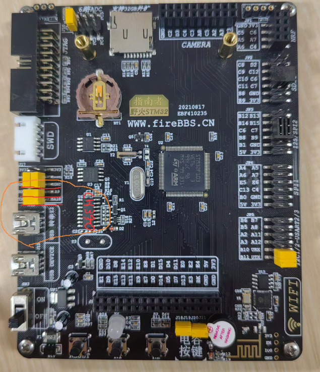
查åŸç†å›¾å¾—:(查åŸç†å›¾ç¬¬ä¸€å›¾, å³ä¸‹æ–¹æ ‡æœ‰`stm32f103vet6`, 此为cpu的引脚. å¯çœ‹åˆ°PA9分é…到USART1_TX, å者å³ä¸ºstm32çš„UARTå‘é€å¼•è„š, PA10分é…到USART1_RX.)
看æ¿å­ä¸ŠPA9å’ŒPA10分别è¿æ¥RXD, TXD, 这部分å±äºJ11框图. äºæ˜¯åœ¨åŸç†å›¾ä¸­æœç´¢J11框图, 查到这是usb串å£è½¬æ¢æ¨¡å—, 而TXDå’ŒRXD是芯片ch340的引脚, 它们通过两个跳帽和PA9(USART1_RX), PA10(USART1_TX)相è”.
* PA9表示一个物ç†ä¸Šçš„唯一的引脚. 而引脚å¯ä»¥å¤ç”¨, 抽象æ„义的引脚USART1_RX被分é…在PA9.

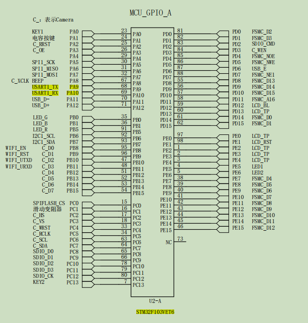


STM32 TX（å³USART1_TX, å³PA9. TTL电平） → CH340 RX(å³J11æ¿å—上的RXD)
STM32 RX（å³USART1_RX, å³PA10. TTL电平） → CH340 TX(å³J11æ¿å—上的TXD)
STM32 GND → CH340 GND
* 用 CH340 è¿æ¥ STM32 和电脑时，它在åšä¸¤ä¸ªè½¬æ¢

	* USB ⇄ UART（å议转æ¢ï¼‰
	电脑用的是 USB，但 STM32 åªä¼š UART，CH340 充当“å议翻译官â€ã€‚
	* USB ⇄ TTL（电平转æ¢ï¼‰
	电脑的 USB 是 0V / 5V，STM32 çš„ UART 是 3.3V，CH340 还能帮忙匹é…电平。
安装ch340驱动å, windowså¯ä»¥è®¤è¯†ch340, 给它分é…一个comå£.
TTL转usb电平的芯片常有`ch340`.


**å®é™…电路图:**
å®é™…上就是ch340电路图.


由上图, 默认ch340芯片的RXDå’ŒTXDè¿æ¥çš„æ—¶PA9å’ŒPA10, 这两个引脚被分é…在USART1çš„TXå’ŒRX. 所以默认使用的是USART1.

如æœæƒ³è¦ä½¿ç”¨USART2, å¯ä»¥æ‹†æ‰ä¸¤ä¸ªè·³å¸½, 把CH340çš„RXDå’ŒTXDè¿æ¥åˆ°USART2外设的TXå’ŒRX上. 查表(`Table 5. High-density STM32F103xx pin definitions`)å¾—, 
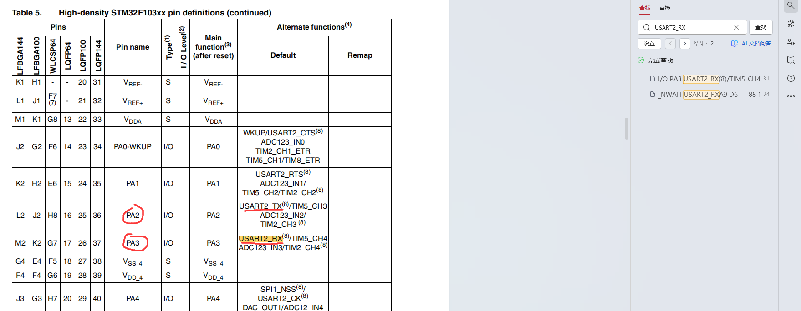
它们是:`PA3`, `PA2`. äºæ˜¯æˆ‘们å¯ä»¥ç”¨æœé‚¦çº¿æŠŠRXDå’ŒTXDè¿æ¥åˆ°PA2å’ŒPA3.

åŒç†, PB10, PB11默认和wifiè¿æ¥, 是USART3.


#### 3.1.2 UART的软件部分:


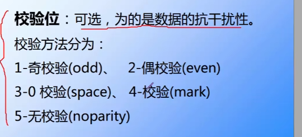
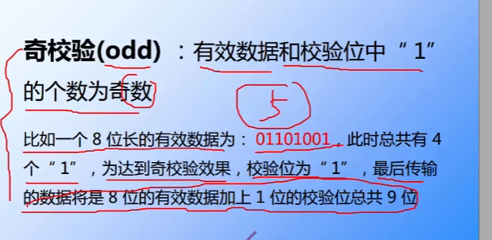
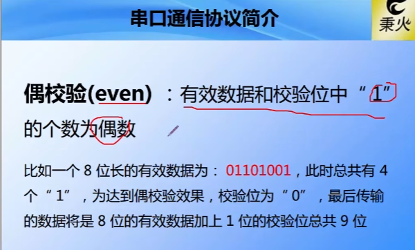


#####  3.1.3 UART串å£é€šä¿¡-功能框图

##### 1.引脚部分
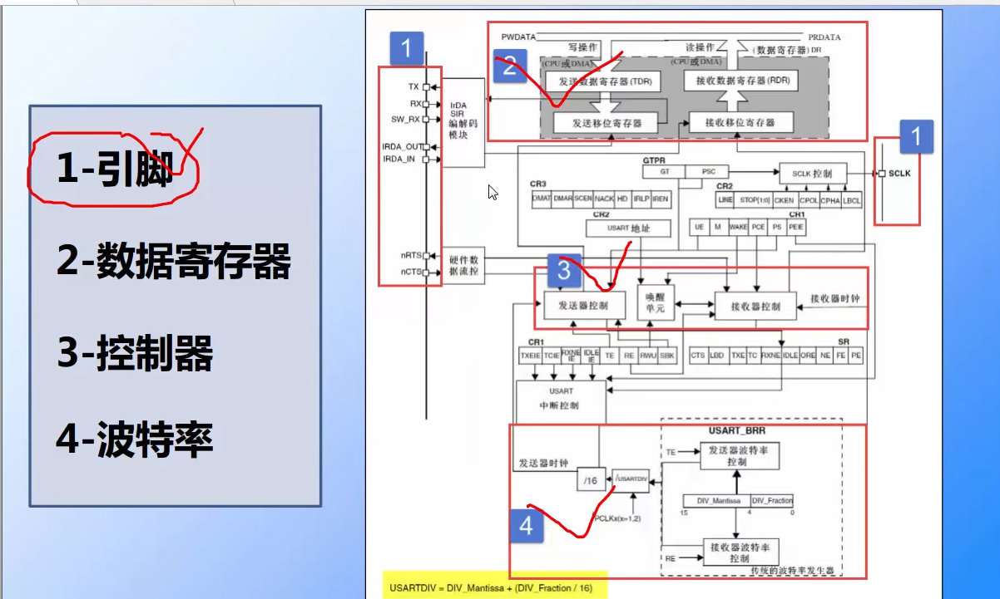

æ¯ä¸ªUSART串å£æœ‰äº”个常用引脚(IRDA_OUTå’ŒIRDA_IN是红外功能, 很少用):

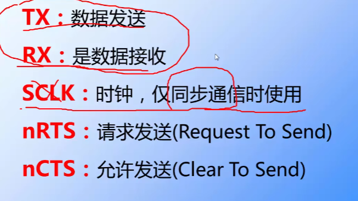
nRTS中的n表示ä½ç”µå¹³æœ‰æ•ˆ.
这些引脚对应的gpio: å»æŸ¥è¯¢`2-STM32F103xCDE_æ•°æ®æ‰‹å†Œ-英文`çš„`pinouts and pin descriptions, table 5`.

就这个表. high-densityå³é«˜å®¹é‡. 指å—者就是高容é‡.
LQFP144指的是144脚的芯片,
指å—者是LQFP100å‹å·çš„.
但是å‰å…­åˆ—这些数字的æ„义? 是PCBå°è£…引脚å·.
例如如æœæˆ‘想找usart1çš„cts, 我应该æœç´¢è¿™ä¸ªå¼•è„šå:`USART1_CTS`
然åæœç´¢æ•°æ®æ‰‹å†Œ(`pinouts and pin descriptions, table 5`):
这是查询的结æœ.


* 我们å¯ä»¥çœ‹åˆ°stm32指å—者有5个串å£æ¨¡å—, 其中uart1挂载在总线APB2(72M时钟)上,比较快. 剩下四个挂载在APB1总线(36M时钟).  åŒæ—¶ä¹Ÿè¦æ³¨æ„写程åºçš„时候记得打开总线时钟.

* å‰ä¸‰ä¸ªæ˜¯`USART`, å³é€šç”¨åŒæ­¥/异步收å‘器. å两个是`UART`,å³é€šç”¨å¼‚步收å‘器. 少了`SCLK`, `CTS`, `RTS`三个引脚.

##### 2.æ•°æ®å¯„存器部分
这部分自己看寄存器文档å³å¯.

`USART_DR`. 9ä½æœ‰æ•ˆ. 


ç”±USART_CR1çš„Mä½å†³å®šå…·ä½“用几ä½.
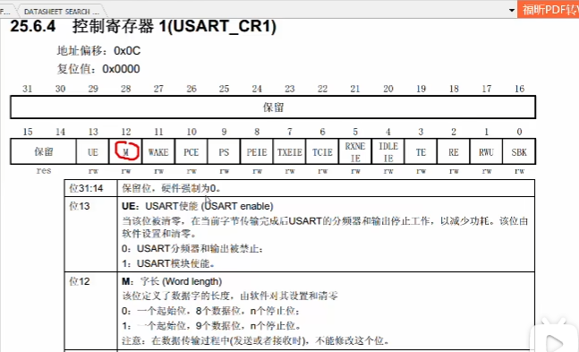


åœæ­¢ä½ç”±USART_CR2寄存器的相关ä½é…ç½®:

最常用:1个åœæ­¢ä½.


想è¦ä½¿ç”¨usart, 首先UE(usart enable, 在CR1寄存器的13ä½)è¦ç½®1. 如æœæ¥æ”¶, RE(也在CR1寄存器)=1. åŒç†å‘é€éœ€è¦TE=1.

* SR寄存器:存储状æ€ç”¨çš„. 


`RXNE`: 读数æ®å¯„存器é空. 该ä½è¡¨ç¤º:


`TXEIE`: 

`USART_BRR`是波特ç‡å¯„存器.
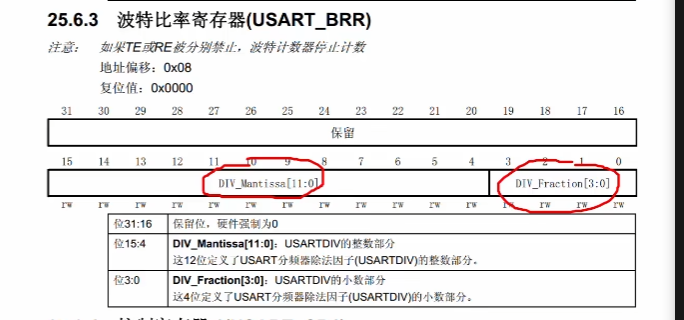


##### 3.1.4 USART编程
stm32f10x_usart.h.

### 3.2 I2Cåè®®


å°±åƒSPI解决了UART因为没有CLK线传输导致ä¸ç¨³å®šå’Œå¾ˆæ…¢çš„问题一样,
I2Cçš„æ€æƒ³æ˜¯é€šè¿‡`总线`çš„æ出, 解决UART无法和一对多通信问题. 当然, `总线`结æ„比UART, SPIè¦å¤æ‚得多.

I2C有两æ¡çº¿, 主机è¿å‡ºä¸€æ¡clk(称为**SCK, serial clock**)一æ¡data(**SDA, serial data总线**). æ¯ä¸ªä»æœºéƒ½æŒ‚载在这两根线上(如下图). æ¯ä¸ªä»æœºæœ‰ç‹¬ç«‹ID, 主机通过选定IDæ¥å®ç°å’Œæƒ³è¦é€šä¿¡çš„ä»æœºé€šä¿¡.

---

UART无法一对多通信. æ¯ä¸ªå¤–设都需è¦å ç”¨MCU一个UARTæ¥å£.
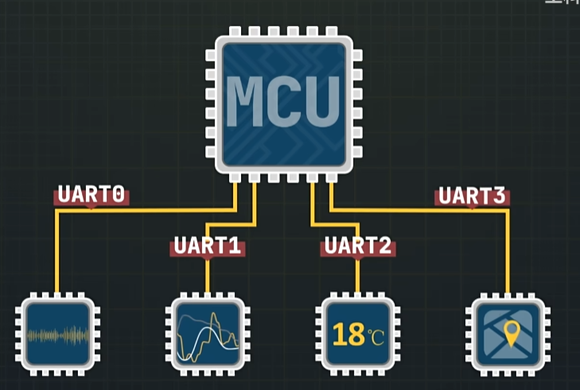
而I2Cå¯ä»¥ä¸€å¯¹å¤šé€šä¿¡.
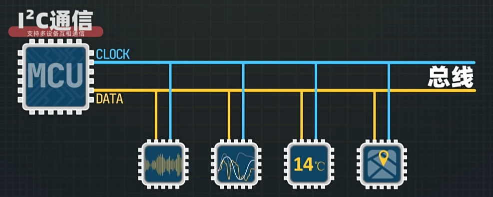

---

* 串行通信的æ„æ€: å®é™…æ•°æ®æ˜¯ä¸€ä½ä¸€ä½åœ°ä¸²è¡Œä¼ è¾“. UART, I2C, SPI都是串行通信. 虽然I2C的总线结æ„ä»ç”µè·¯ä¸Šæ¥è¯´, ä»æœºæ˜¯"并è”"在SLKå’ŒSDA上的.

### 3.3 SWD(serial wire debug)

SWD是armå…¬å¸å¼€å‘的专门为**调试**å’Œ**烧录** MCU 设计的 通信åè®®.

🔠和 UART/I2C/SPI 的区别是什么？

| 项目       | **SWD**                        | **UART/I2C/SPI**                            |
| -------- | ------------------------------ | ------------------------------------------- |
| 📌 目的    | 💻 调试ã€å•æ­¥è¿è¡Œã€çƒ§å½•ç¨‹åº                | 📡 æ•°æ®é€šä¿¡ï¼ˆä¼ æ„Ÿå™¨ã€æ¨¡å—ã€MCU之间）                       |
| 📠引脚    | SWDIO（åŒå‘æ•°æ®ï¼‰ã€SWCLK（时钟）          | UART: TX/RXï¼›I2C: SDA/SCLï¼›SPI: MISO/MOSI/SCK |
| 📦 通信角色  | 主机 = ST-Link<br>ä»æœº = STM32 MCU | 多为 MCU ä¸å¤–设模å—通信                              |
| 💡 é€šä¿¡æ¨¡å¼  | 串行调试å议（带æ¡æ‰‹ã€å¯„存器访问等）             | 简å•æ”¶å‘æ•°æ®ï¼ˆæ— è°ƒè¯•æ¦‚念）                               |
| ğŸ› ï¸ æ§åˆ¶åŠŸèƒ½ | 调试寄存器ã€æŸ¥çœ‹å†…å­˜ã€è®¾ç½®æ–­ç‚¹ã€å¤ä½ç­‰            | 通常åªæ˜¯æ”¶å‘ç”¨æˆ·æ•°æ®                                  |
| 🧱 使用范围  | 仅用äºæ”¯æŒ SWD çš„ ARM MCU            | 几ä¹æ‰€æœ‰åµŒå…¥å¼è®¾å¤‡                                   |
| 📂 åè®®å¤æ‚度 | 较高，包å«å议层ã€APã€DP 等内部机制           | 相对简å•ï¼ˆå°¤å…¶ UART）                               |

SWD 是 “调试员â€å’Œ MCU 之间的远程æ§åˆ¶å议，能“å·çœ‹â€ MCU 大脑里的内容。

UART/I2C/SPI 是 “两个普通人â€ä¹‹é—´çš„ä¿¡æ¯äº¤æµå议，他们åªç®¡äº’相传消æ¯ã€‚

### 8.4. 施密特触å‘器
 

施密特触å‘器是比较器的负å馈改进(加了一个å馈电阻). 它用äºå°†æ¨¡æ‹Ÿä¿¡å·è½¬æ¢ä¸ºæ•°å­—ä¿¡å·.

ç›´æ¥æ¯”较器也å¯ä»¥åšè¿™ä¸ªæ´»:

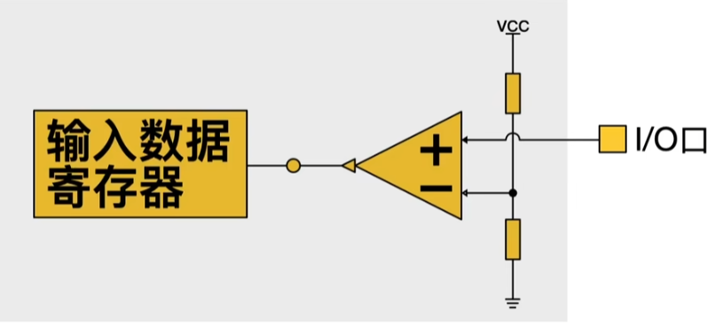

但是ä¸è¿™æ ·åš, åŸå› : 输入电å‹ä¸ä¸€å®šæ˜¯å¹³æ»‘çš„, 如æœæœ‰é”¯é½¿/抖动, 则输出的信å·ä¼šæ˜¯å¤šæ¬¡é«˜ä½ç”µå¹³:

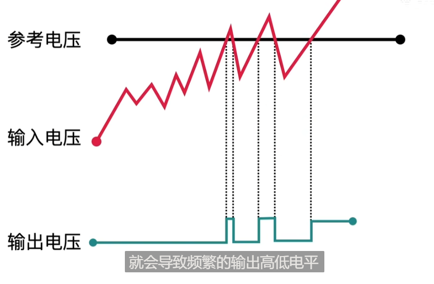

为了防抖动, 对比较器加入一个负å馈电阻, å°±æˆäº†**è¿Ÿæ»æ¯”较器/施密特触å‘器**.


#### 施密特触å‘器的电路分æ:

我们ä»åˆå§‹æ—¶è¾“å…¥0V开始分æ. 首先此时比较器正æ电å‹å³`R1`å’Œ`R2`分å‹å`R2`的分å‹, 它高äº0V, 所以比较器输出VCC高电平. 我们称这个电å‹ä¸º**ä½å‚考电å‹**(马上会知é“为什麽)


然å分æå馈的效æœ: 此时R1å’ŒR3并è”然å串è”R2, 所以此时比较器å®é™…çš„æ­£æ电å‹å³`R1//R3`å’Œ`R2`分å‹å`R2`的分å‹. 我们称其为**高å‚考电å‹**(马上会知é“为什麽)


如æœæ­¤æ—¶è¾“入慢慢å¢å¤§, 直到超过上述**高å‚考电å‹**电å‹å, 比较器将会输出ä½ç”µå¹³. 此时åˆå›åˆ°R1å’ŒR2分å‹äº†. 比较器正æ电å‹ä¼šå˜ä¸º**ä½å‚考电å‹**.

此时, å³ä½¿è¾“å…¥å‘生抖动, 但åªè¦ä¸ä½äº**ä½å‚考电å‹**. 比较器都ä¸ä¼šå应.

然å正如一开始的过程, 当输入ä»å°å˜å¤§çš„时候, åªè¦ä¸é«˜äº**高å‚考电å‹**, 比较器都ä¸ä¼šå应. äºæ˜¯è¿Ÿæ»æ¯”较器å®ç°äº†!


### 8.5. status和state区别?

| å•è¯       | æ„æ€                                    | 适用场景（常è§ï¼‰                                  |
| -------- | ------------------------------------- | ----------------------------------------- |
| `stat`   | statistic/statistics 的缩写，或 status 的缩写 | 通常用作简写å˜é‡å（如 `DSTATUS stat;`）表示当å‰è®¾å¤‡çŠ¶æ€      |
| `status` | 当å‰çŠ¶æ€/状æ€ç ï¼ˆè¿”å›å€¼å¸¸ç”¨ï¼‰                       | ✅ 函数返å›çŠ¶æ€ï¼ˆæˆåŠŸ/失败/错误ç ï¼‰æœ€å¸¸ç”¨çš„è¯                  |
| `state`  | 状æ€ï¼ˆåå‘“内部状æ€æœºâ€çš„状æ€ï¼‰                      | 状æ€æœº / 模å—的状æ€å€¼ï¼Œå¸¸ç”¨äºé€»è¾‘æ§åˆ¶ï¼Œæ¯”如 `"idle"`ã€`"busy"` |


### 8.6. 一些概念

#### 8.6.1**HID(human interface device)**, 人机æ¥å£è®¾å¤‡. 是一ç§usbæ¥å£çš„设备.
åå­—çš„æ„æ€æ˜¯ç”¨æ¥å’Œäººäº¤äº’的设备, 比如键盘/é¼ æ ‡/手柄/触摸å±...但是一些调试工具比如CMSIS-DAP调试器也是HID.
* 特点: å³æ’å³ç”¨(ä¸éœ€è¦å®‰è£…驱动!)(å°è£…了report机制)
* 传输å议简å•, å³USBåè®®.

### 7.

### 8. STMçš„å¯åŠ¨æ–‡ä»¶

`startup_stm32f10x_hd.s`是stmçš„å¯åŠ¨æ–‡ä»¶. 使用ARM汇编语言**Assembly**.

一般在项目的`.\STARTUP\`下.

#### 8.1 栈空间

在`startup_stm32f10x_hd.s`中å¯ä»¥ä¿®æ”¹æ ˆç©ºé—´.
栈的作用是ä¿å­˜ç¨‹åºè¿è¡Œçš„时候产生的局部å˜é‡. 如æœç¨‹åºå¾ˆè‡ƒè‚¿æˆ–者è¦è°ƒç”¨å¾ˆå¤šå¤æ‚的大å‹å›¾åƒ/字库资料, 或者涉åŠåˆ°é€’å½’, 应该改大一点防止è¿è¡Œçš„时候爆栈.

```assembly
Stack_Size      EQU     0x00000400  ;当å‰è®¾ç½®ä¸º1KB
```


## 9 SDå¡

注æ„: `SD总线åè®®(简称SD)`å’ŒUSBå议一样, **区分主机(æ§åˆ¶å™¨)å’Œä»æœº**.
F10X系列åªæœ‰å¤§å®¹é‡æ‰æœ‰SDIO外设.

指å—者æ¿å­(F103VET6)æ­è½½äº†SDIO外设, å¯ä»¥å’ŒSDå¡äº¤äº’.

核心æ¿F103C8T6没有.


* `SDIOåè®®`: 是扩展自`SD总线åè®®`的扩展标准, 它å…许主机通过 `SDå¡æ¥å£` 访问é存储类外设, 比如SDIO-wifi芯片之类的. *SDIOå议在电气和时åºä¸Šä¸SD存储å议兼容，但å¢åŠ äº†å¯¹é存储设备的命令集。*

* stm32çš„SDæ¥å£å¤–设为SDIO, 所以åŒæ—¶æ”¯æŒSDå¡äº¤äº’å’ŒSDIO外设交互.

### 9.0 常è§çš„储存设备


| å称                       | 通信åè®®| 常è§å®¹é‡èŒƒå›´        | è¯´æ˜                                                          |
| ------------------------ | ---------------- | ------------- | ----------------------------------------------------------- |
| **TFå¡ï¼ˆmicro SD）**        | SD/SPI  | 1GB ï½ 1TB+    | åˆå« microSD å¡ï¼Œæœ€åˆå‘½å为 TransFlash，å被纳入 SD å会标准。å¯é€šè¿‡å¡å¥—转æ¢ä¸º SD 大å¡ã€‚  |
| **SDå¡**                  | SD/SPI  | 1GB ï½ 2TB     | 标准尺寸 SD å¡ï¼Œä¹Ÿå«â€œå¤§å¡â€ã€‚æ”¯æŒ SPI/SD 通信。                            |
| **CFE A å¡ï¼ˆCFexpress A）** | PCIe/NVMe åè®®   | 64GB ï½ 1TB+   | 专业高速å¡ï¼Œé‡‡ç”¨ PCIe æ¥å£ï¼ŒNVMe å议，适用äºé«˜ç«¯ç›¸æœºï¼ˆå¦‚ Sony A7S III），尺寸å°ã€é€Ÿåº¦å¿«ã€‚   |
| **CFE B å¡ï¼ˆCFexpress B）** | PCIe/NVMe åè®®   | 128GB ï½ 4TB+  | æ›´å¤§æ›´å¿«çš„ç‰ˆæœ¬ï¼Œå¸¸ç”¨äº Canon R5/R3ã€Nikon Z9 等高端设备。                     |
| **SPI Flash**            | SPI    | 512KB ï½ 256MB | 片上 NOR Flash，MCU 程åº/网页/固件存储用，常è§å¦‚ W25Q64ã€GD25Q128。由主æ§è‡ªè¡Œè¯»å†™ç®¡ç†ã€‚ |
| **EEPROM**               | 常为 I²C（部分 SPI） | 128B ï½ 512KB  | 电å¯æ“¦å†™å­˜å‚¨å™¨ï¼Œé€‚åˆå°‘é‡æ•°æ®é¢‘ç¹å†™å…¥ï¼ˆå¦‚é…ç½®/å‚æ•°ä¿å­˜ï¼‰ã€‚常è§å¦‚ AT24C32ã€CAT24C256。         |

* 
  -   **SD å¡**åƒæ˜¯â€œU盘â€ä¸€æ ·ï¼Œ**自己带æ§åˆ¶å™¨ã€åœ°å€ç®¡ç†ã€å†™ä¿æŠ¤ã€ç¼“å­˜**ï¼›   
  -   **SPI Flash**åƒæ˜¯â€œè£¸ç¡¬ç›˜èŠ¯ç‰‡â€ï¼Œ**由你自己决定æ€ä¹ˆå­˜æ•°æ®ã€æ€ä¹ˆè¯»å—**。

* SDIOå¡: 指的是å¯ä»¥ä½¿ç”¨SDIOåè®®(比如其中9个I/Oå£å¯ä»¥ç”¨ä½œUHS-Iå议的SDIO通讯, 或者其中17个I/Oå£å¯ä»¥ç”¨ä½œUHS-IIå议的SDIO通讯)的外设芯片. 注æ„指的是外设芯片, 而ä¸æ˜¯å­˜å‚¨è®¾å¤‡. 比如一å—wifi芯片.

* 
	**SPI Flash 是一ç§ä½¿ç”¨ SPI æ¥å£çš„ NOR å‹é—ªå­˜**ï¼›  
	**SD å¡å†…部通常是 NAND 闪存结æ„**，由æ§åˆ¶å™¨ç®¡ç†è¯»å†™ã€‚


#### 9.0.1啥是NOR闪存/NAND闪存?

首先它们都是é易失性
| ç±»å‹             | åå­—æ¥æº                     		| 是å¦ç›´æ¥ç”±æŸç§é—¨ç”µè·¯æ„æˆ |
| -------------- | ------------------------ 			| ------------ |
| **NAND Flash** | ç”±å¤§é‡ **NAND 结æ„的晶体管阵列** ç»„æˆ | ✅ 是的         |
| **NOR Flash**  | ç”±å¤§é‡ **NOR 结æ„的晶体管阵列** ç»„æˆ  | ✅ 是的         |


---------------------------
##### NAND
---------------------------
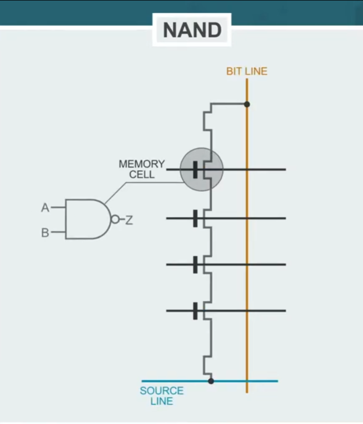

- NAND 串行访问结æ„æ¶æ„. 擦除得更快, 但是读å–很慢. 是以å—为å•ä½è¯»å–/写入的(一般是512bit).
- 很便宜而且储存密度大.
- 适用在储存å¡, 硬盘...
-   **å•å…ƒè¿æ¥æ–¹å¼**：
      -   多个存储å•å…ƒï¼ˆé€šå¸¸32-64个）**串è”æˆä¸€æ¡é“¾ï¼ˆNAND String）**，共享ä½çº¿ã€‚          
      -   å¿…é¡»**é€é¡µï¼ˆPage）访问**（典å‹é¡µå¤§å°4KB-16KB），无法直æ¥è¯»å–å•ä¸ªå•å…ƒã€‚         
      -   **结æ„类似硬盘**，按å—/页管ç†ã€‚      
-   **读å–åŸç†**：    
    -   需è¦å…ˆé€‰ä¸­æ•´é¡µæ•°æ®ï¼Œå†é€šè¿‡ä¸²è¡Œæ¥å£é€ä½è¾“出。        
    -   **éšæœºè¯»å–延迟高**（~25-50μs），但è¿ç»­è¯»å–ååé‡é«˜ï¼ˆå› é¡µç¼“存机制）。

------------
* NAND微观结æ„:
 


NAND闪存用**浮栅晶体管**串è”制作. è¿™ç§æ™¶ä½“管是改进版的MOSFET, 相比MOSFET多了两层: `浮栅层`å’Œ`ç»ç¼˜å±‚`, å®ç°äº†é易失性存储.

* 浮栅晶体管结æ„(NMOS):


* **读å–åŸç†**: G,Dæ通阈值电å‹, 有S->D电æµå°±æ˜¯1.
  * **浮栅晶体管的`浮栅`内存储“0â€å’Œâ€œ1â€çš„定义**
  -   **逻辑“0â€**：浮栅中存储**大é‡ç”µå­**（负电è·ï¼‰ã€‚ 
  -   **逻辑“1â€**：浮栅中**电å­è¾ƒå°‘或无电å­**（中性或正电è·ï¼‰ã€‚

  * **`浮栅`结æ„存储的电è·å¯¹MOSFET的沟é“产生影å“:**
  -   **浮栅存储电å­ï¼ˆé€»è¾‘“0â€ï¼‰**：
      -   电å­åœ¨æµ®æ …上形æˆ**负电场**，会**æ’æ–¥**沟é“中的电å­ï¼ˆN-MOSFET çš„è½½æµå­æ˜¯ç”µå­ï¼‰ã€‚       
      -   相当äº**抬高了沟é“的阈值电å‹ï¼ˆVth）**，需更高栅å‹æ‰èƒ½å¼€å¯æ²Ÿé“。      
      -   若施加**标准阈值电å‹ï¼ˆVth\_normal）**，沟é“ä»å¤„äº**关闭状æ€**（无电æµï¼‰ã€‚      
  -   **浮栅无电å­ï¼ˆé€»è¾‘“1â€ï¼‰**：
      -   浮栅无é¢å¤–负电è·ï¼Œæ²Ÿé“阈值电å‹**ä¿æŒè®¾è®¡å€¼ï¼ˆVth\_normal）**。       
      -   施加阈值电å‹æ—¶ï¼Œæ²Ÿé“**正常导通**，产生电æµã€‚

* **写入åŸç†**: 高å‹ç”µé•¿è¿«ä½¿ç”µå­ç©¿è¿‡ç»ç¼˜å±‚å®ç°.
  * ***(1) 热电å­æ³¨å…¥ï¼ˆNOR Flash常用）**
    -   **电å‹é…ç½®**：   
        -   **æ§åˆ¶æ …（G）**：高å‹ï¼ˆ~10V），å¸å¼•ç”µå­ã€‚      
        -   **æ¼æ（D）**：中å‹ï¼ˆ~5V），形æˆå¼ºæ¨ªå‘电场。      
        -   **æºæ（S）**：æ¥åœ°ï¼ˆ0V）。       
    -   **物ç†è¿‡ç¨‹**：  
        1.  沟é“中的电å­åœ¨é«˜å‹ä¸‹è·å¾—高能é‡ï¼ˆâ€œçƒ­ç”µå­â€ï¼‰ã€‚    
        2.  热电å­è¶Šè¿‡ç»ç¼˜å±‚势å’（SiO₂），被浮栅æ•è·ã€‚     
    -   **特点**：
        -   速度快，但功耗高（需大电æµï¼‰ã€‚    
        -   主è¦ç”¨äºNOR Flash的字节级写入。       
  * **(2) Fowler-Nordheim隧穿（NAND Flash常用）**
    -   **电å‹é…ç½®**：
        -   **æ§åˆ¶æ …（G）**：高å‹ï¼ˆ~15-20V）。      
        -   **æº/æ¼æ**：æ¥åœ°æˆ–浮空。     
    -   **物ç†è¿‡ç¨‹**：  
        1.  强å‚直电场使电å­ç›´æ¥éš§ç©¿ç»ç¼˜å±‚（é‡å­éš§ç©¿æ•ˆåº”）。     
        2.  电å­è¢«æµ®æ …æ•è·ã€‚      
    -   **特点**：  
        -   功耗ä½ï¼ˆæ— éœ€å¤§ç”µæµï¼‰ï¼Œä½†é€Ÿåº¦è¾ƒæ…¢ã€‚     
        -   适用äºNAND Flash的页写入（一次写多字节）。


* æ ¼å¼åŒ–: æ ¼å¼åŒ–闪存å³å…¨éƒ¨å†™1, 释放所有浮栅内的电å­.
----------------------------
---------------------------
##### NOR
---------------------------

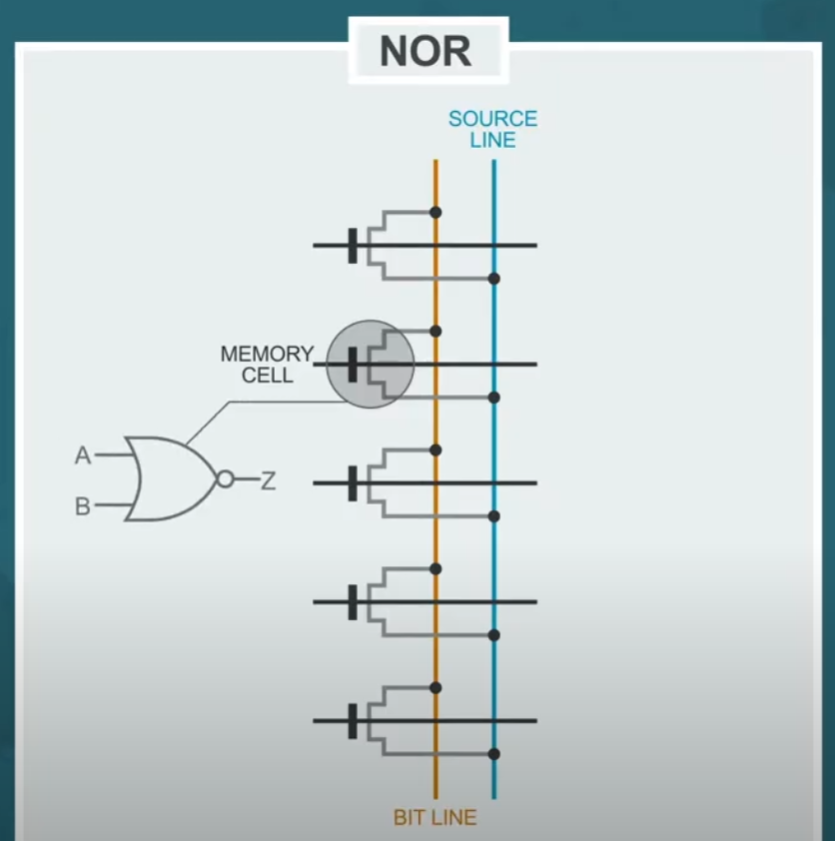

- NOR 并行访问æ¶æ„, addresses the entire memory range, 所以å¯ä»¥è®¿é—®å…¶ä¸­ä»»æ„一个字节, 所以读å–é常快; 

- 但是NOR逻辑门å•å…ƒæ›´å¤§(CMOS), 也更昂贵.
- NOR首次å¯åŠ¨éœ€è¦æ›´å¤§çš„功ç‡, 但是å¯åŠ¨ä¹‹å功耗会å°äºNAND.
- 适åˆé«˜é€Ÿéšæœºè¯»å–.
- 适用在计算芯片的内存.
-   **å•å…ƒè¿æ¥æ–¹å¼**：
    -   æ¯ä¸ªå­˜å‚¨å•å…ƒï¼ˆMemory Cell）**ç›´æ¥å¹¶è”到ä½çº¿ï¼ˆBit Line）**，类似“独立开关â€ã€‚
    -   通过**字线（Word Line）**选中一行å•å…ƒï¼Œæ‰€æœ‰ä½çº¿å¯åŒæ—¶è¢«è¯»å–（并行访问）。
    -   **结æ„类似SRAM**，支æŒéšæœºå¯»å€ã€‚   
-   **读å–åŸç†**：
    -   ç›´æ¥é€šè¿‡ä½çº¿æ£€æµ‹ç”µæµï¼ˆæ— éœ€æ•´é¡µè¯»å–）。       
    -   **éšæœºè¯»å–延迟ä½**（~50-100ns），适åˆä»£ç æ‰§è¡Œï¼ˆXIP, Execute-In-Place）。


---------------------------

存储å¡çš„速度指标:

| 指标         | è¯´æ˜                    | 主è¦å½±å“的应用场景             | 举例                                  |
| ---------- | --------------------- | --------------------- | ----------------------------------- |
| **顺åºå†™å…¥é€Ÿåº¦** | è¿ç»­å†™å…¥å¤§å—æ•°æ®çš„速度（如写大文件）    | **视频录制ã€æ•°æ®é‡‡é›†ã€å•ä¸ªå¤§æ–‡ä»¶å¤‡ä»½å­˜å‚¨, 下载游æˆå†…大å‹èµ„æº**    | 行车记录仪ã€å®‰é˜²å½•åƒã€STM32采集传感器数æ®å¹¶å†™æ–‡ä»¶         |
| **顺åºè¯»å–速度** | è¿ç»­è¯»å–大å—æ•°æ®çš„速度（如读大文件）    | **媒体播放ã€ç³»ç»Ÿå¯åŠ¨ã€è¯»å–å•ä¸ªå¤§æ–‡ä»¶, ç©æ¸¸æˆ** | 播放高清视频ã€è¯»å–音频文件ã€åŠ è½½æ¸¸æˆå¤§åœ°å›¾               |
| **éšæœºå†™å…¥é€Ÿåº¦** | 在éšæœºåœ°å€å†™å…¥å°æ•°æ®å—的能力（4KB以下） | **æ•°æ®åº“ã€å°æ–‡ä»¶æ—¥å¿—写入**       | Android App 写é…ç½®ã€STM32日志写入FATFS多个å°æ–‡ä»¶ |
| **éšæœºè¯»å–速度** | ä»éšæœºåœ°å€è¯»å–å°æ•°æ®å—的能力（4KB以下） | **æ“作系统å“应, 索引检索, ç©æ¸¸æˆ** | å¯åŠ¨ç³»ç»Ÿã€è¯»å–é…ç½®ã€æ‰“开一堆å°å›¾ç‰‡æˆ–文档                |


一般情况下, 顺åºè¯»å– > 顺åºå†™å…¥ >> éšæœºè¯»å– > éšæœºå†™å…¥. 比如一张普通质é‡çš„TFå¡:

| ç±»å‹        | å…¸å‹é€Ÿåº¦èŒƒå›´ï¼ˆMB/s）    |
| --------- | --------------- |
| 顺åºè¯»å–      | 60–100+ MB/s（快） |
| 顺åºå†™å…¥      | 20–80 MB/s（略慢）  |
| éšæœºè¯»å–（4KB） | 5–15 MB/s（å°æ–‡ä»¶ï¼‰  |
| éšæœºå†™å…¥ï¼ˆ4KB） | 0.5–5 MB/s（最慢）  |


一般标在表é¢çš„是顺åºè¯»å–速度. 而且是æ端完ç¾å·¥å†µä¸‹.

最ä½é€Ÿåº¦æ ‡è¯†:

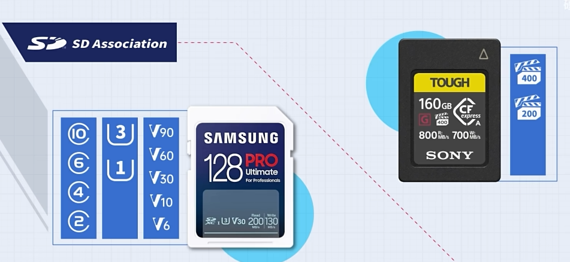


### 9.1 SDå¡çš„标识

| 标识               | å«ä¹‰                        | 举例         | 是å¦ä»£è¡¨é€Ÿåº¦ï¼Ÿ     |
| ---------------- | ------------------------- | ---------- | ----------- |
| **UHS-I/II/III** | 总线标准. UHS-IIå议通过17个引脚, 而UHS-Iåªæœ‰9个引脚. UHS-IIå¡å¯å…¼å®¹UHS-Iå¡æ§½, 但é™é€Ÿè¿è¡Œ.| 决定ç†è®ºå¸¦å®½     | ✅ 是         |
| **U1/U3**        | 最å°é¡ºåºå†™å…¥é€Ÿåº¦ï¼ˆ10MB/s / 30MB/s） | 写视频时的最ä½ä¿è¯  | ✅ 是         |
| **V30/V60/V90**  | 视频速度等级（最ä½å†™å…¥é€Ÿç‡ï¼‰            | 适åˆè§†é¢‘录制     | ✅ 是         |
| **A1/A2**        | App 性能等级（éšæœº IOPS）         | 适åˆè¿è¡Œåº”用或多任务 | ✅ 是（但是éšæœºæ€§èƒ½ï¼‰ |


* 举个例å­è¯´æ˜ï¼š

	你买了一张：

	-   **UHS-II / U3 / V60 / A2** çš„ SD å¡ï¼›
		
	-   æ’入普通 UHS-I 相机中使用；
		
	-   结æœï¼š   
		-   它åªèƒ½è¿è¡Œåœ¨ UHS-I 速度；        
		-   最大读å–速度 ≈ 90 MB/sï¼›        
		-   但它ä»èƒ½ä¿è¯ **V60：最å°å†™å…¥ 60 MB/s**，适åˆå½• 4K 视频；        
		-   App 加载快，因为是 A2 å¡ã€‚


* 因为尺寸太å°, 没有åŠæ³•å®¹çº³ç¬¬äºŒæ’UHS-IIæ¥å£å¼•è„š, 所以**所有的micro SD(TF)å¡éƒ½æœ€å¤šåªæ”¯æŒUHS-I**, åªæœ‰9个针脚"金手指". 具体引脚说æ˜è§9.4 SDå¡ç»“æ„.


#### 9.1.3 读写速度测试?

CDM(crystal disk mark)软件测速

### 9.2 SDå¡é€šè®¯çš„最简å•çš„åè®®: SPIåè®®


SPI模å¼ä¹Ÿç§°ä¸ºSDå¡çš„兼容模å¼. UHS-Iå’ŒUHS-IIå议都å‘下支æŒ, åªä½¿ç”¨å››æ ¹å¼•è„šé€šä¿¡:
| å称         | è¯´æ˜         |
| ---------- | ---------- |
| DAT0–DAT3  | æ•°æ®çº¿ï¼ˆ4-bit） |
| CMD        | 命令线        |
| CLK        | 时钟线        |
| VCC/GND/CD | 电æºã€åœ°ã€æ£€æµ‹    |

而SDIO模å¼æ˜¯æ›´é«˜é€Ÿçš„åè®®, UHS-Iå’ŒUHS-II分别使用9个和17个引脚å®ç°(å者多了一æ’并行所以更快).


### 9.3 SDå¡å®¹é‡

ä¸åŒå®¹é‡çš„SDå¡æ”¯æŒçš„SDå议版本ä¸åŒ. 也就是说SPIå议下工作都一样, 但是SDIOåè®®ä¸åŒ, 表ç°ä¸ä¸€æ ·.

| ç±»å‹       | 全称                           | 容é‡èŒƒå›´        | 文件系统    | 指令集/åè®® 	 | 标识            |
| -------- | -------------------------------- | ------------- | ----------- | ------- 		| ------------- |
| **SDSC** | Secure Digital Standard Capacity | ≤ 2 GB        | FAT12/FAT16 | SD v1.x 				| 通常写 “SD†     |
| **SDHC** | Secure Digital High Capacity     | 4 GB ï½ 32 GB  | FAT32       | SD v2.0 				| 带 “HC†标志     |
| **SDXC** | Secure Digital eXtended Capacity | 64 GB ï½ 2 TB  | exFAT       | SD **v3.0** 				| 带 “XC†标志     |

stm32F4系列åªèƒ½æ”¯æŒSD2.0åè®®, 也就是说如æœç”¨SDIOåè®®, åªèƒ½é€‰æ‹©SDSC, SDHCå¡.

### 9.4 SDå¡ç‰©ç†ç»“æ„


其中, 图中的`æ§åˆ¶å•å…ƒ`å’Œ`存储å•å…ƒæ¥å£`之间有一个FIFOæ•°æ®ç¼“冲器. 

#### 9.4.1.SDå¡çš„寄存器结æ„:

| å称      | ä½å®½  | ä¸­æ–‡è¯´æ˜                                    | 通俗解释                                                            |
| ------- | --- | --------------------------------------- | --------------------------------------------------------------- |
| **CID** | 128 | å¡è¯†åˆ«å· (Card Identification Number)       | **å¡çš„身份è¯**。包å«å‚商IDã€äº§å“åã€ç”Ÿäº§æ—¥æœŸç­‰ã€‚**唯一标识一张å¡**。主机å¯ä»¥ç”¨å®ƒè¯†åˆ«ä¸åŒå¡ã€‚             |
| **RCA** | 16  | ç›¸å¯¹åœ°å€ (Relative Card Address)            | 主机分é…ç»™SDå¡çš„“通信地å€â€ã€‚多å¡ç³»ç»Ÿä¸­æ¯å¼ å¡é å®ƒæ¥åŒºåˆ†ã€‚åˆå§‹åŒ–时主机设置。                         |
| **DSR** | 16  | 驱动器寄存器 (Driver Stage Register)          | 用äºé…ç½®å¡çš„输出驱动强度，**å¯é€‰å¯„存器**，å®é™…中**很少使用**。                             |
| **CSD** | 128 | å¡ç‰¹å®šæ•°æ® (Card Specific Data)              | åŒ…å« SD å¡çš„**容é‡ã€è¯»å†™é€Ÿåº¦ã€å—大å°ã€æœ€å¤§ç”µæµ**等信æ¯ï¼Œæ˜¯**主机最é‡è¦çš„å‚考信æ¯ä¹‹ä¸€**。              |
| **SCR** | 64  | SDé…置寄存器 (SD Configuration Register)     | è¯´æ˜ SD å¡çš„**版本ã€æ€»çº¿å®½åº¦æ”¯æŒæƒ…况（1-bit / 4-bit）ã€å‘½ä»¤æ”¯æŒæƒ…况等**。主机用它æ¥åˆ¤æ–­èƒ½å¦å¯ç”¨4线模å¼ã€‚ |
| **OCR** | 32  | æ“作æ¡ä»¶å¯„存器 (Operation Conditions Register) | åŒ…å« SD å¡çš„**电å‹èŒƒå›´æ”¯æŒä¿¡æ¯**，以åŠå¡æ˜¯å¦å‡†å¤‡å¥½ã€‚åˆå§‹åŒ–阶段主机会ä¸æ–­è¯»å–这个寄存器æ¥åˆ¤æ–­å¡æ˜¯å¦ready。     |
| **SSR** | 512 | SDçŠ¶æ€ (SD Status)                        | 包å«æ›´è¯¦ç»†çš„å¡è¿è¡ŒçŠ¶æ€ï¼Œæ¯”如**写ä¿æŠ¤ã€æ“¦é™¤å•å…ƒå¤§å°ã€å½“å‰é€Ÿåº¦æ¨¡å¼ç­‰**。                           |
| **CSR** | 32  | å¡çŠ¶æ€ (Card Status)                       | 是主机æ¯æ¬¡å‘é€å‘½ä»¤ï¼ˆCMD）å SD å¡å馈的“简è¦çŠ¶æ€ç â€ï¼ŒåŒ…å«æ˜¯å¦å‡ºé”™ã€æ˜¯å¦å°±ç»ªç­‰ã€‚å¯ä»¥ç†è§£ä¸ºâ€œæœ€è¿‘一次æ“作的执行结æœâ€ã€‚ |


#### 9.4.2 SD总线åè®®:

>请注æ„区分. 这里的**SD总线åè®®**指的是**标准SDåè®®**. 

>**SDIOåè®®**是它的超集. 但是它们共享物ç†å±‚, 讨论åŸç†å’Œç‰©ç†ç»“æ„的时候几ä¹æ˜¯ä¸€å›äº‹(SDIO有更丰富的指令集而已)


SDå议使用9æ¡æ•°æ®çº¿:

| å¼•è„šå           | æ–¹å‘     | 功能                 |
| ------------- | ------ | ------------------ |
| **CLK**       | 主机 → å¡ | 时钟线                |
| **CMD**       | åŒå‘, åŠåŒå·¥ 		| 命令/å“应线             |
| **DAT0~3**    | **4根并行数æ®çº¿**. åŒå‘, å•å·¥ä½†æ–¹å‘å¯å˜(这严格称为**时分åŒå‘**)     | æ•°æ®çº¿                |
| **VDD, VSS (GND)**      | -      | 电æºï¼ˆé€šå¸¸ 3.3V）和地        |
| **CD/DAT3**   | åŒç”¨     | å¡æ£€æµ‹/CD 线（ä½ç”µå¹³è¡¨ç¤ºå¡æ’入）(DAT3也å¯å¤ç”¨ä¸ºå¡æ£€æµ‹è¾“å…¥) |


* 刚上电时, 因为除了VDDå’ŒVSS, åªç”¨DAT0进行主机和SDå¡ä¹‹é—´çš„交互. 所以交互是1bitä½å®½.

* 主机通过 **CMD0 → CMD8 → ACMD41** ç­‰åˆå§‹åŒ–æµç¨‹ç¡®è®¤å¡ç±»å‹ï¼ˆSD1.0/SD2.0/SDHC...）å, å¯ä»¥é€šè¿‡ **CMD55 + ACMD6** æ¥å‘Šè¯‰ SD å¡åˆ‡æ¢åˆ° **4-bit 模å¼**, 使用DAT0~3å››æ¡çº¿.


* 使用4bit模å¼æ—¶ï¼Œæ¯æ ¹æ•°æ®çº¿éƒ½å¿…须有**起始ä½**ã€**终止ä½**以åŠ**CRCä½**，CRCä½æ¯æ ¹æ•°æ®çº¿éƒ½è¦åˆ†åˆ«æ£€æŸ¥ï¼Œå¹¶æŠŠæ£€æŸ¥ç»“æœæ±‡æ€»ç„¶å在数æ®ä¼ è¾“完å通过D0线å馈给主机。

* SDå¡æ•°æ®åŒ…有两ç§æ ¼å¼ï¼Œä¸€ç§æ˜¯å¸¸è§„æ•°æ®(8bit宽)，它先å‘ä½å­—节å†å‘高字节，而æ¯ä¸ªå­—节则是先å‘高ä½å†å‘ä½ä½ï¼Œ4线传输示æ„如下图：

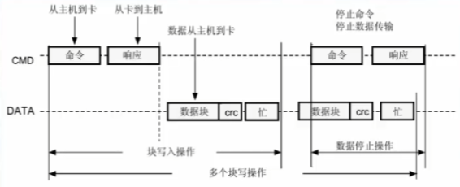

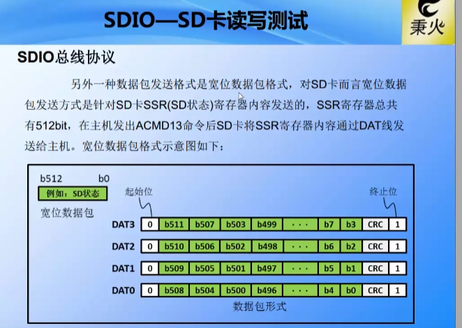
  - 起始ä½: 4根线åŒæ—¶ä¼ è¾“一个`0`
  - 终止ä½: 4根线åŒæ—¶ä¼ è¾“一个`1`
- SD宽数æ®åŒ…


#### 9.4.3 SDåè®® 使用的9个数æ®çº¿(引脚):

å‰é¢å·²ç»ä»‹ç»äº†SDå议的ä¹æ¡æ•°æ®çº¿:

CLK, CMD, DAT0~3, VDD&GND, CD, å¤ç”¨DAT3


* 在stm32上的对应引脚: (你也å¯ä»¥è‡ªå·±å»`中文手册`那个什麽`pinout & discription table5`查)

| **SDå¡å¼•è„š** | **引脚功能**       | **STM32F103V 引脚** | **备注**                             |
|--------------|--------------------|---------------------|--------------------------------------|
| 1            | CD/DAT3            | PC11 (SDIO_D3)      | æ•°æ®çº¿3，兼作å¡æ£€æµ‹ï¼ˆå¯é€‰ï¼‰         |
| 2            | CMD                | PD2 (SDIO_CMD)      | 命令/å“应线                         |
| 3            | VSS1 (GND)         | GND                 | æ¥åœ°ï¼Œéœ€è¿æ¥è‡³å¼€å‘æ¿GND             |
| 4            | VDD (3.3V)         | 3.3V                | 供电，æ¥å¼€å‘æ¿3.3Vç”µæº              |
| 5            | CLK                | PC12 (SDIO_SCK)     | æ—¶é’Ÿä¿¡å·                            |
| 6            | VSS2 (GND)         | GND                 | æ¥åœ°ï¼ˆæ ‡å‡†SDå¡æœ‰åŒGND引脚）         |
| 7            | DAT0               | PC8 (SDIO_D0)       | æ•°æ®çº¿0（必需）                     |
| 8            | DAT1               | PC9 (SDIO_D1)       | æ•°æ®çº¿1（4ä½æ¨¡å¼éœ€è¿æ¥ï¼‰            |
| 9            | DAT2               | PC10 (SDIO_D2)      | æ•°æ®çº¿2（4ä½æ¨¡å¼éœ€è¿æ¥ï¼‰            |


### 9.5 SDçš„CMD线: `命令` å’Œ `å“应`


`SD命令`由主机å‘出. `å“应`则由SDå¡å‘出.

它们通过`CMD`引脚åŠåŒå·¥é€šä¿¡.

 [常规命令]分为四ç§å‘½ä»¤.
| 缩写       | 全称                              | 特点                                    |
| -------- | ------------------------------- | ------------------------------------- |
| **bc**   | Broadcast Command               | 广播命令，**所有å¡éƒ½æ¥æ”¶**，**æ— å“应**（如 CMD0）       |
| **bcr**  | Broadcast Command with Response | 广播命令，所有å¡æ¥æ”¶ï¼Œä½†ä¸»æœº**会等待å“应**（如 CMD1）       |
| **ac**   | Addressed Command               | **指定æŸå¼ å¡**（通过 RCA 地å€ï¼‰ï¼Œä¸»æœºä¼šç­‰å¾…å“应（如 CMD17） |
| **adtc** | Addressed Data Transfer Command | æŒ‡å®šå¡ + **带有数æ®ä¼ è¾“**（如 CMD18ã€CMD24 等）     |


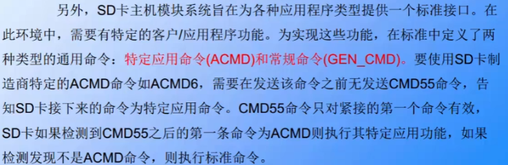


- **命令格å¼**:  
- 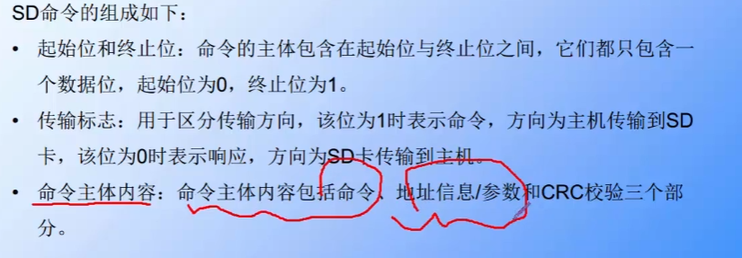
  - 


#### 9.5.1 SD命令的命令å·éƒ¨åˆ†

å¯ä»¥çœ‹åˆ°SD命令用6bit表示`命令å·`. 6bitå¯ä»¥è¡¨ç¤º2^6=64æ¡å‘½ä»¤, å³`CMD0`~`CMD63`.

它们是:


🧾 标准命令（CMDx）列表（部分ä¿ç•™å‘½ä»¤ä¼šæ ‡æ˜ï¼‰
| CMDç¼–å· | å称                     | åŠŸèƒ½è¯´æ˜                       |
| ----- | ---------------------- | -------------------------- |
| CMD0  | GO\_IDLE\_STATE        | 软件å¤ä½å¡ï¼Œè¿›å…¥ idle 状æ€ï¼ˆä¸Šç”µå第一æ¡å‘½ä»¤ï¼‰ |
| CMD1  | SEND\_OP\_COND         | å¯åŠ¨å¡åˆå§‹åŒ–（MMC专用，SDä¸ç”¨ï¼‰         |
| CMD2  | ALL\_SEND\_CID         | 请求å¡çš„CIDå·ï¼ˆå¡å”¯ä¸€è¯†åˆ«å·ï¼‰           |
| CMD3  | SEND\_RELATIVE\_ADDR   | 设置/è·å– RCA（å¡ç›¸å¯¹åœ°å€ï¼‰           |
| CMD4  | SET\_DSR               | 设置 DSR 寄存器（很少用）            |
| CMD5  | IO\_SEND\_OP\_COND     | SDIO专用，åˆå§‹åŒ–IOå¡              |
| CMD6  | SWITCH\_FUNC           | 切æ¢å‡½æ•°ï¼ˆé«˜é€Ÿæ¨¡å¼ç­‰ï¼‰æˆ–读å–支æŒå‡½æ•°         |
| CMD7  | SELECT/DESELECT\_CARD  | 选择/å–æ¶ˆé€‰æ‹©å¡                   |
| CMD8  | SEND\_IF\_COND         | 检测电å‹èŒƒå›´ã€ç¡®è®¤æ˜¯å¦æ”¯æŒSDHC/SDXC     |
| CMD9  | SEND\_CSD              | 读å–CSD寄存器                   |
| CMD10 | SEND\_CID              | 读å–CID寄存器                   |
| CMD11 | READ\_DAT\_UNTIL\_STOP | （ä¿ç•™ï¼‰                       |
| CMD12 | STOP\_TRANSMISSION     | åœæ­¢å¤šå—æ•°æ®ä¼ è¾“                   |
| CMD13 | SEND\_STATUS           | è·å–å¡å½“å‰çŠ¶æ€                    |
| CMD14 | BUSTEST\_R             | 总线测试（ä¿ç•™ï¼‰                   |
| CMD15 | GO\_INACTIVE\_STATE    | 让å¡è¿›å…¥â€œä¼‘眠â€çŠ¶æ€ï¼Œæ–­å¼€æ€»çº¿            |


📤 æ•°æ®ä¼ è¾“相关命令：
| CMDç¼–å· | å称                      | åŠŸèƒ½è¯´æ˜              |
| ----- | ----------------------- | ----------------- |
| CMD16 | SET\_BLOCKLEN           | 设置数æ®å—长度（标准为512字节） |
| CMD17 | READ\_SINGLE\_BLOCK     | 读å–å•ä¸ªæ•°æ®å—           |
| CMD18 | READ\_MULTIPLE\_BLOCK   | 读å–多个数æ®å—           |
| CMD19 | BUSTEST\_W              | 总线测试（ä¿ç•™ï¼‰          |
| CMD20 | WRITE\_DAT\_UNTIL\_STOP | （ä¿ç•™ï¼‰              |


📥 写入相关命令：
| CMDç¼–å· | å称                     | åŠŸèƒ½è¯´æ˜       |
| ----- | ---------------------- | ---------- |
| CMD24 | WRITE\_BLOCK           | 写入å•å—       |
| CMD25 | WRITE\_MULTIPLE\_BLOCK | å†™å…¥å¤šå—       |
| CMD26 | PROGRAM\_CID           | 编程CID（åªä¸€æ¬¡ï¼‰ |
| CMD27 | PROGRAM\_CSD           | 编程CSD（åªä¸€æ¬¡ï¼‰ |

â›” 擦除ã€å†™ä¿æŠ¤ç­‰ï¼š
| CMDç¼–å· | å称                          | åŠŸèƒ½è¯´æ˜               |
| ----- | --------------------------- | ------------------ |
| CMD28 | SET\_WRITE\_PROT            | 设置写ä¿æŠ¤ï¼ˆç¡¬ä»¶ï¼‰          |
| CMD29 | CLR\_WRITE\_PROT            | 清除写ä¿æŠ¤              |
| CMD30 | SEND\_WRITE\_PROT           | 查询是å¦å†™ä¿æŠ¤            |
| CMD32 | ERASE\_WR\_BLK\_START\_ADDR | è®¾ç½®æ“¦é™¤å¼€å§‹åœ°å€           |
| CMD33 | ERASE\_WR\_BLK\_END\_ADDR   | 设置擦除结æŸåœ°å€           |
| CMD38 | ERASE                       | 执行擦除命令（æ­é…CMD32/33） |


🧾 应用命令（ACMDxx）列表（需先å‘é€ CMD55）：
| ACMDç¼–å· | å称                         | åŠŸèƒ½è¯´æ˜                     |
| ------ | -------------------------- | ------------------------ |
| ACMD6  | SET\_BUS\_WIDTH            | 设置总线宽度（1-bit / 4-bit）    |
| ACMD13 | SD\_STATUS                 | 读å–SD状æ€å¯„存器（512bit）        |
| ACMD22 | SEND\_NUM\_WR\_BLOCKS      | è¿”å›æœ€å一次写入的å—æ•°              |
| ACMD23 | SET\_WR\_BLK\_ERASE\_COUNT | 设置一次擦除的å—æ•°                |
| ACMD41 | SD\_SEND\_OP\_COND         | SDå¡åˆå§‹åŒ–命令，检测电å‹èŒƒå›´ï¼Œå¡æ˜¯å¦ready |
| ACMD42 | SET\_CLR\_CARD\_DETECT     | æ§åˆ¶pull-up电阻使能            |
| ACMD51 | SEND\_SCR                  | 读å–SCR寄存器（å¡æ”¯æŒçš„特性）         |


例如, `CMD0`是一个`bc`(boardcast)命令, 所有å¡éƒ½æ¥å—且无`å“应`. 它的内容是:
- 起始ä½: 0(1bit, 固定为0)
- 传输ä½: 1(1bit, 表示方å‘为主机->SDå¡ä»æœº)
- 命令å·: 0(6bit, 0å·å‘½ä»¤0x0å³000000)
- å‚æ•°: 0(32bit, CMD0ä¸éœ€è¦å‚数默认都为0)
- CRC7校验ä½: 1001010(CRC7校验ä½æ˜¯å¯¹å‰é¢åŠ èµ·æ¥40bit进行è¿ç®—(ç•¥)得到的.)
- åœæ­¢ä½: 1(1bit, 固定为1)

åˆèµ·æ¥å°±æ˜¯ä¸€ä¸ª48ä½SD命令帧:
`0 1 000000 00000000000000000000000000000000 1001010 1`
å六进制表示就是`0x40 0x00 0x00 0x00 0x00 0x95`


#### 9.5.2 SD命令的å‚数部分 

SD命令有32bit用æ¥è¡¨è¾¾å‘½ä»¤å‚æ•°. 包括å—地å€ã€æ‰‡åŒºç¼–å·ã€å移é‡ã€æ ‡å¿—ä½ã€çŠ¶æ€é…置值等.

注æ„SDå¡è®¿é—®çš„地å€æ˜¯`å—地å€`, å³æ‰‡åŒºç¼–å·. æ¯å—512B.

#### 9.5.3 SDå“应

å“应由SDå¡å‘主机å‘出. 部分命令è¦æ±‚SDå¡ä½œå‡ºå“应.

| å“åº”ç±»å‹ | ä½å®½      | ç”¨é€”è¯´æ˜                      |
| ---- | ------- | ------------------------- |
| R1   | 48 bit  | å¡çŠ¶æ€å“应（最常è§ï¼‰                |
| R1b  | 48 bit  | R1 + å¡å¿™ä¿¡å·ï¼ˆéœ€ç­‰å¾…）            |
| R2   | 136 bit | 读å–CID/CSD寄存器              |
| R3   | 48 bit  | OCR（电å‹æ¡ä»¶ï¼‰å“应               |
| R4   | 48 bit  | **未在 SD å¡ä¸­ä½¿ç”¨. ç”¨äº SDIO.** |
| R5   | 48 bit  | **未在 SD å¡ä¸­ä½¿ç”¨. ç”¨äº SDIO.**       |
| R6   | 48 bit  | RCA 地å€å“应（如 CMD3）          |
| R7   | 48 bit  | 电å‹æ£€æµ‹å’Œæ¥å£æ¡ä»¶ï¼ˆCMD8）           |


### 9.6 SDå¡çš„命令层: 两ç§`æ“作模å¼`: `å¡è¯†åˆ«æ¨¡å¼` å’Œ `æ•°æ®ä¼ è¾“模å¼`, CPSM

SDå¡æœ‰ä¸¤ç§æ“作模å¼.

-   **SDå¡åˆå§‹åŒ–模å¼ï¼ˆIdentification Mode）**
    
    -   在å¤ä½ï¼ˆCMD0）å，SDå¡è¿›å…¥**åˆå§‹åŒ–模å¼**，此时通信使用**ä½é€Ÿæ—¶é’Ÿï¼ˆé€šå¸¸400kHz以下）**。
        
    -   主机å‘é€ **CMD8（Send Interface Condition）** 检查å¡æ”¯æŒçš„电å‹èŒƒå›´ã€‚
        
    -   æ¥ç€å‘é€ **ACMD41（SD\_SEND\_OP\_COND）** 进行åˆå§‹åŒ–，并å商工作电å‹å’Œä¸»æœºèƒ½åŠ›ï¼ˆå¦‚高容é‡æ”¯æŒï¼‰ã€‚
        
    -   在åˆå§‹åŒ–完æˆå，SDå¡ä¼šåˆ†é…一个**相对地å€ï¼ˆRCA, Relative Card Address）**，并进入**æ•°æ®ä¼ è¾“模å¼**。
        
-   **SDå¡æ•°æ®ä¼ è¾“模å¼ï¼ˆData Transfer Mode）**
    
    -   åˆå§‹åŒ–完æˆå，SDå¡è¿›å…¥**æ•°æ®ä¼ è¾“模å¼**，此时å¯ä»¥ä½¿ç”¨**高速时钟（最高å¯è¾¾208MHz，å–决äºSDå¡ç‰ˆæœ¬ï¼‰**。
        
    -   主机通过 **CMD7（Select/Deselect Card）** 选择æŸå¼ å¡ï¼ˆä½¿ç”¨RCA），使其进入**传输状æ€ï¼ˆTransfer State）**。
        
    -   在该模å¼ä¸‹ï¼Œä¸»æœºå¯ä»¥æ‰§è¡Œè¯»å†™æ“作（如 **CMD17/18/24/25** 等）访问存储数æ®ã€‚


事å®ä¸Š, 两ç§æ“作模å¼ä¸‹è¿˜æœ‰ä¸åŒçš„`状æ€`.

状æ€è½¬æ¢å›¾: (å³ä¸€ä¸ª**状æ€æœº)**

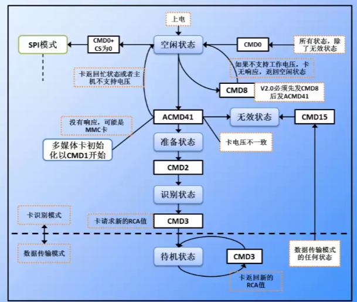

è´Ÿè´£å®ç°è¿™ä¸ªçŠ¶æ€è½¬æ¢çš„逻辑电路模å—å³ç§°ä¸º**CPSM, Command Path State Machine, 命令路径状æ€æœº**. SDå¡çš„状æ€æ”¹å˜ç”±ä¸¤éƒ¨åˆ†ç»„æˆ:
* 一部分是**CPDM**. 它åªç®¡å‘命令ã€ç­‰å¾…å“应. 它MCU内部的`SDIO外设`的一部分, 存在在MCU芯片内部. 
* 一部分是SDå¡çš„**内部状æ€æœº**逻辑电路. **CPDM**通过`CMD`线å‘**内部状æ€æœº**å‘é€å‘½ä»¤, å®ç°æ”¹å˜SDå¡çš„状æ€. 


---

 **表1：åˆå§‹åŒ–模å¼ï¼ˆIdentification Mode）下的状æ€**
| **状æ€**              | **触å‘æ¡ä»¶**               | **关键命令**                                                                 | **说æ˜**                                                                 |
|-----------------------|---------------------------|-----------------------------------------------------------------------------|-------------------------------------------------------------------------|
| **Idle State**        | 上电或收到 `CMD0`          | `CMD0`（强制å¤ä½ï¼‰ã€`CMD8`（检查电å‹ï¼‰ã€`ACMD41`（åˆå§‹åŒ–）                   | å¡æœªæ¿€æ´»ï¼Œä»…å“应少数命令。                                               |
| **Ready State**       | `ACMD41` åˆå§‹åŒ–æˆåŠŸ        | `CMD2`（读å–CID）ã€`CMD3`（分é…RCA）                                        | å¡å·²å‡†å¤‡å¥½è¢«è¯†åˆ«ï¼Œç­‰å¾…CID读å–å’ŒRCA分é…。                                 |
| **Identification State** | 收到 `CMD3`（分é…RCA）   | `CMD7`（选择å¡ï¼Œè¿›å…¥ä¼ è¾“模å¼ï¼‰                                              | å¡å·²è·å¾—RCA，但未进入数æ®ä¼ è¾“模å¼ã€‚                                      |

---

 **表2：数æ®ä¼ è¾“模å¼ï¼ˆData Transfer Mode）下的状æ€**
| **状æ€**              | **触å‘æ¡ä»¶**               | **关键命令**                                                                 | **说æ˜**                                                                 |
|-----------------------|---------------------------|-----------------------------------------------------------------------------|-------------------------------------------------------------------------|
| **Stand-by State**    | 收到 `CMD7`（选择å¡ï¼‰      | `CMD7`（å–消选择）ã€`CMD9`（读å–CSD）ã€`CMD16`（设置å—大å°ï¼Œä»…SDSC有效）     | å¡å·²è¢«é€‰æ‹©ï¼Œä½†æœªè¿›è¡Œæ•°æ®ä¼ è¾“。                                           |
| **Transfer State**    | ä» Stand-by 进入           | `CMD17/18`（读å•å—/多å—）ã€`CMD24/25`（写å•å—/多å—）ã€`CMD12`（终止传输）    | å¡å¯æ‰§è¡Œè¯»å†™æ“作，正常状æ€ã€‚                                             |
| **Sending-data State** | 收到 `CMD17/18`（读数æ®ï¼‰ | æ— é¢å¤–命令（自动返å›Transfer State）                                         | å¡æ­£åœ¨å‘主机å‘é€æ•°æ®ã€‚                                                   |
| **Receive-data State** | 收到 `CMD24/25`（写数æ®ï¼‰ | æ— é¢å¤–命令（自动返å›Transfer State）                                         | å¡æ­£åœ¨æ¥æ”¶ä¸»æœºæ•°æ®ã€‚                                                     |
| **Programming State** | æ•°æ®å†™å…¥é—ªå­˜ï¼ˆå¦‚ `CMD24`） | `CMD13`（查询状æ€ï¼Œæ£€æŸ¥`BUSY`ä½ï¼‰                                            | å¡æ­£åœ¨ç¼–程（写入数æ®ï¼‰ï¼Œå¯èƒ½ä¸å“应其他命令。                             |
| **Disconnect State**  | `CMD7`（RCA=0）å–消选择    | `CMD7`（é‡æ–°é€‰æ‹©å¡ï¼‰                                                         | å¡è¢«ä¸´æ—¶å–消选择，å¯å¿«é€Ÿæ¢å¤ã€‚                                           |


* `Transfer State`是`Sending-data State`å’Œ`Receive-data State`çš„å‰ç½®, å两者å¯ä»¥çœ‹æˆ`Transfer State`çš„å­çŠ¶æ€.


### 9.7 SDå¡çš„æ•°æ®ä¼ è¾“层, DPSM

æ•°æ®ä¼ è¾“层的è¿ä½œè¢«ç±»ä¼¼`CPSM`地称为`DPSM`. 这个电路模å—是`SDIO外设`的一部分, 存在在MCU芯片内部.

写入过程:

* 用户调用库函数写入命令(比如`f-write()`)-> 
* MCU çš„ CPSM å‘出写命令 → 
* SD å¡çŠ¶æ€æœºå‡†å¤‡æ¥æ”¶ → 
* MCU é…ç½® DPSM 并写入 FIFO → DPSM æ§åˆ¶ FIFO æ•°æ®é€šè¿‡ DAT 线å‘出 → 
* SD å¡ç¼“å­˜æ¥æ”¶æ•°æ® → 
* SD å¡å†…部状æ€æœºæ§åˆ¶å†™å…¥ Flash。

* **FIFO(first in first out)**

FIFO是一个带有寄存器和简å•æ§åˆ¶æ¨¡å—的外设, 是MCU内部SDIO外设的一部分. 

SD å¡çš„æ•°æ® FIFO 是其内部æ§åˆ¶å™¨ç”¨äºç¼“冲数æ®çš„“队列â€ï¼Œ
主è¦ç›®çš„是：å调主æ§å’Œ NAND 之间的数æ®é€Ÿç‡ã€å‡å°å»¶è¿Ÿã€æ高效ç‡ã€‚

æ•°æ®FIFO(先进先出)部件是一个数æ®ç¼“冲器，带å‘é€å’Œæ¥æ”¶å•å…ƒã€‚
æ§åˆ¶å™¨çš„FIFO包å«å®½åº¦ä¸º32bitã€æ·±åº¦ä¸º32å­—çš„æ•°æ®ç¼“冲器和å‘é€/æ¥æ”¶é€»è¾‘。
SDIO状æ€å¯„存器(SDIO_ STA)çš„TXACTä½ç”¨äºæŒ‡ç¤ºå½“å‰æ­£åœ¨å‘é€
æ•°æ®ï¼ŒRXACTä½æŒ‡ç¤ºå½“å‰æ­£åœ¨æ¥æ”¶æ•°æ®ï¼Œè¿™ä¸¤ä¸ªä½ä¸å¯èƒ½åŒæ—¶ä¸º1。
â—当TXACT为1时， å¯ä»¥é€šè¿‡AHBæ¥å£å°†æ•°æ®å†™å…¥åˆ°ä¼ è¾“FIFO。
â—当RXACT为1时， æ¥æ”¶FIFO存放ä»æ•°æ®è·¯å¾„部件æ¥æ”¶åˆ°çš„æ•°æ®ã€‚


### 9.8 SDå¡çš„寻å€

#### **1. SDSC（标准容é‡å¡ï¼Œâ‰¤ 2GB）—— 以字节（Byte）为å•ä½å¯»å€**

-   **物ç†å¯»å€æ–¹å¼**：SDSC 使用 **字节寻å€ï¼ˆByte Addressing）**，å³ä¸»æœºå¯ä»¥æŒ‡å®šä»»æ„字节å移é‡ï¼ˆ32ä½åœ°å€ï¼Œæœ€å¤§æ”¯æŒ 2^32 = 4GB，但å®é™…最大容é‡ä¸º 2GB）。
    
-   **读写å•ä½**：
    
    -   虽然SDåè®®å…许按字节寻å€ï¼Œä½† **å®é™…读写ä»ä»¥å—（Block）为å•ä½**（典å‹å—大å°æ˜¯512字节）。
        
    -   例如：
        
        -   `CMD17 (READ_SINGLE_BLOCK)` 读å–一个å—（如512字节）。
            
        -   `CMD24 (WRITE_BLOCK)` 写入一个å—。
            
    -   **å³ä½¿ä¸»æœºåªè¯·æ±‚1字节，SDå¡ä»ä¼šè¯»å†™æ•´ä¸ªå—**，å†ç”±ä¸»æœºæ§åˆ¶å™¨æˆ–软件处ç†æ‰€éœ€å­—节。
        

* * *

#### **2. SDHC（高容é‡å¡ï¼Œ2GB~32GB）和 SDXC（扩展容é‡å¡ï¼Œ32GB~2TB）—— 以å—（Block）为å•ä½å¯»å€**

-   **物ç†å¯»å€æ–¹å¼**：SDHC/SDXC 使用 **å—寻å€ï¼ˆBlock Addressing）**，地å€ç›´æ¥æŒ‡å‘å—å·ï¼ˆ32ä½å—地å€ï¼Œæ¯å—固定为512å­—èŠ‚ï¼Œæœ€å¤§æ”¯æŒ 2^32 × 512B = 2TB）。
    
    -   例如：
        
        -   åœ°å€ `0` = 第0å—（0x000~0x1FF）。
            
        -   åœ°å€ `1` = 第1å—（0x200~0x3FF）。
            
-   **读写å•ä½**：
    
    -   所有æ“作必须按整å—进行，**ä¸æ”¯æŒå­—节级寻å€**。
        
    -   例如：
        
        -   `CMD17` 读å–一个å—（512字节），å³ä½¿ä¸»æœºåªéœ€è¦å…¶ä¸­å‡ ä¸ªå­—节。
            
        -   `CMD24` 写入一个å—，必须完整写入512字节。


* * *

### 9.8 stm32F103x的SDIO外设


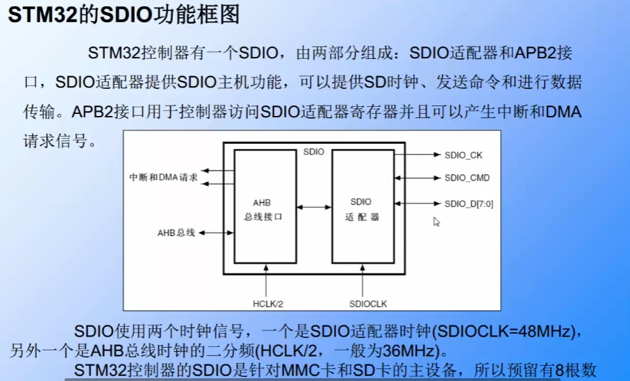

  * 这里的`SDIOCLK`有误. å®é™…上在F1系列是

  
  所以应该是72MHz.
  在F2~4系列里SDIOCLK是å•ç‹¬çš„时钟线, 是48MHz.


其中SDIO_D[7:0]çš„å‰å››ä½æ˜¯DATA0~3æ•°æ®çº¿, 剩下的是MMCå¡è¦ç”¨çš„线, SDå¡ä¸éœ€è¦

-----
-----
#### **指å—者STM32çš„SDIO(å³SDå¡æ§½)åŸç†å›¾:**

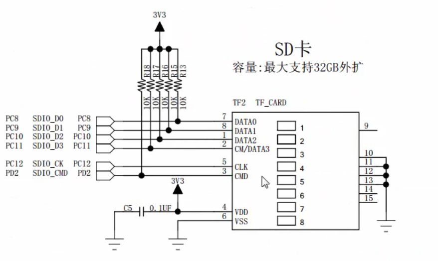

其中9/15引脚的作用是SDå¡æ£€æµ‹.1 检测到SDå¡è¾“出高电平. å¯ä»¥ç»‘定到一个普通GPIO比如`PA2`上å®ç°æ£€æµ‹.

-----
-----

### 9.9 SDIO编程

**标准库**函数对SDIO外设建立了三个åˆå§‹åŒ–结æ„体，分别为

* **SDIOåˆå§‹åŒ–结æ„体SDIO_ InitTypeDef**			(åˆæ­¥åˆå§‹åŒ–SDIO外设)
* **SDIO命令åˆå§‹åŒ–结æ„体SDIO_ CmdInitTypeDef**  (åˆå§‹åŒ–CPSM)
* **SDIOæ•°æ®åˆå§‹åŒ–结æ„体SDIO_ DatalnitTypeDef** (åˆå§‹åŒ–DPSM)

é…置好åå°±å¯ä»¥ç”¨å‡½æ•°`SDIO_DataConfig()`å‘é€æ•°æ®.

åˆå§‹åŒ–结æ„体æˆå‘˜ç”¨äºè®¾ç½®SDIO工作ç¯å¢ƒå‚数，并由SDIO相应åˆå§‹åŒ–é…ç½®


SDå¡ä¸èƒ½å·¥ä½œåœ¨è¶…过24MHz, 所以一般å¯ä»¥è®¾ç½®å¯„存器BYPASS=0; CLKDIV=3, 
用MCU的主频`SDIOCLK`=72MHzçš„/3å=24MHzçš„`SDIO_CK`æ¥é©±åŠ¨SDIO外设.


* * *


### 9.10 FATFS


åªæœ‰åŠ å…¥æ–‡ä»¶ç³»ç»Ÿæ‰èƒ½ä½¿å¾—å•ç‰‡æœºå†™å…¥æ•°æ®åçš„SDå¡å¯ä»¥è¢«è¯»å¡å™¨+电脑读å–.


ATFS 是一个轻é‡çº§çš„ FAT 文件系统库，专门用äºåœ¨åµŒå…¥å¼ç³»ç»Ÿï¼ˆå¦‚ STM32）中读写文件系统（FAT12/16/32）格å¼çš„存储设备，如 SD å¡ã€U盘ã€SPI Flash 等。


# 10 SPI Flash

## 10.0 SPIåè®®

SPIå¯ä»¥çœ‹ä½œUSART的改进:

UART传输速度慢而且ä¸ç¨³å®š, 因为å³ä½¿çº¦å®šå¥½äº†ä¼ è¾“速ç‡, åŒæ–¹çš„å®é™…波特也会有浮动. 一般åªèƒ½åœ¨ä½¿ç”¨åŒä¸€ä¸ªç³»ç»Ÿæ—¶é’Ÿä¸¤ä¸ªæŒ¨å¾—很近的åŒæ–¹ä½¿ç”¨. 

这导致å³ä½¿ä½¿ç”¨æœ€å¸¸ç”¨çš„最大波特ç‡`115200`, UART速度也é常慢(11.25KB/s)

SPIå议的æ€æƒ³å°±æ˜¯æ‹‰ä¸€æ ¹CLOCK, 让其中一方Aå‘é€clockç»™å¦ä¸€æ–¹B, 这样就ä¸éœ€è¦çº¦å®šä¼ è¾“速度了. B在æ¯æ¬¡æ”¶åˆ°CLOCK上å‡æ²¿çš„时候æ¥æ”¶1bitæ•°æ®å³å¯. 传输速度轻æ¾çªç ´10M/s.


---
SPI是由motorolaå…¬å¸å¼€å‘的一ç§é€šç”¨æ•°æ®æ€»çº¿. 使用四根通信线:

| ä¿¡å·çº¿      | 全称                  | æ–¹å‘       | è¯´æ˜         |
| -------- | ------------------- | -------- | ---------- |
| **MOSI** | Master Out Slave In | 主机 → SDå¡ | 主机å‘æ•°æ®ï¼ˆå‘½ä»¤ï¼‰  |
| **MISO** | Master In Slave Out | SDå¡ â†’ 主机 | SDå¡è¿”å›æ•°æ®    |
| **SCLK** | Serial Clock        | 主机 → SDå¡ | æ—¶é’Ÿä¿¡å·       |
| **CS**   | Chip Select（片选）     | 主机 → SDå¡ | 拉ä½ä½¿èƒ½é€‰ä¸­çš„SDå¡ |

SPIå议是åŒæ­¥å…¨åŒå·¥çš„.

支æŒæ€»çº¿æŒ‚载多个ä»è®¾å¤‡.

W25Q64: 一款常è§çš„NOR Flash存储器芯片, 使用SPIæ¥å£.
| å±æ€§       | è¯´æ˜                             |
| -------- | ------------------------------ |
| **å‹å·**   | W25Q64                         |
| **容é‡**   | 64 Mbit = **8 MB**             |
| **ç±»å‹**   | NOR Flash                      |
| **æ¥å£**   | SPI（支æŒæ ‡å‡†SPIã€Dual SPIã€Quad SPI） |
| **电å‹èŒƒå›´** | 2.7V \~ 3.6V                   |
| **å‚家**   | Winbond（å邦电å­ï¼‰                  |


# 12 OLED

一般用作调试显示å±, 方便我们调试程åº.

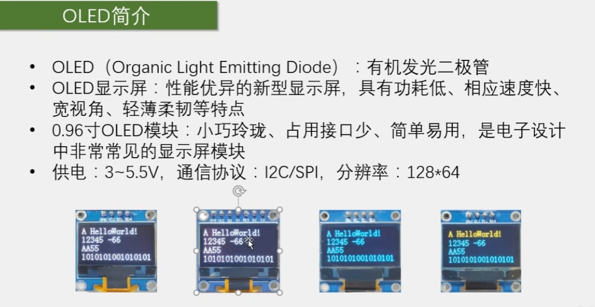

常è§ä¸¤ç§åè®®, 4阵脚的是I2C, 7针脚的是SPI

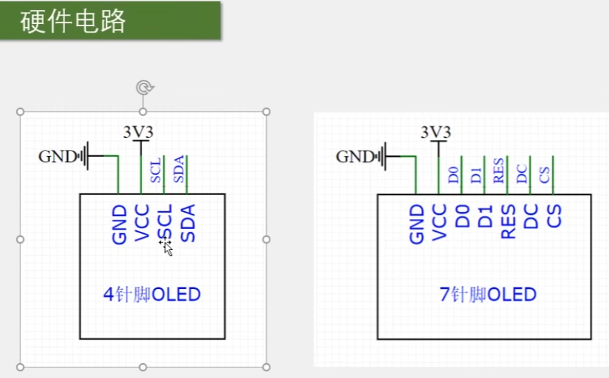


江å科技up主写的驱动函数:
å‰ä¸¤ä¸ªå‚数是行/列.


##

# 13 文件系统

FarFS(FAT(File Allocation Table) File System), 文件分é…表-文件系统.


##
# 14 常è§é—®é¢˜(bug log)


## 14.1 库函数未声æ˜(this func is decleared implicit)

检查:
* 1.有没有include头文件
  * #include "stm32f10x.h"(总头文件)
    * 注æ„: 该总头文件通过这段代ç æ¥include `stm32f10x_conf.h`:
```c
#ifdef USE_STDPERIPH_DRIVER
#include "stm32f10x_conf.h"
#endif
```
  * 而`stm32f10x_conf.h`中å«æœ‰#include "stm32f10x_rtc.h"...(å„ç§å¤–设的头文件, **它们是你最终è¦include的头文件!**), 但是它们å¯èƒ½æ˜¯é»˜è®¤è¢«æ³¨é‡Šçš„, 需è¦æŠŠå¯¹åº”的头文件å»æ³¨é‡Šå“¦!
* 2.有没有æ„外的中文路径å
  * 比如因为å¤åˆ¶æ¥çš„项目导致的文件夹å«åš`xxx-副本`


## 14.2 C项目的.c和.h; 


### 14.2.1 预处ç†é˜¶æ®µå’Œç¼–译阶段

在编译之å‰é¦–先是预处ç†é˜¶æ®µ. 这个阶段, 预处ç†å™¨ä¼šåˆ†åˆ«å¤„ç†**project list**çš„æ¯ä¸ª.c文件. 预处ç†å™¨å¼€å§‹é˜…读这个.c代ç , 并且将所有`#`命令进行代ç æ›¿æ¢. 当é‡åˆ°`#include`æ—¶, 预处ç†å™¨åœ¨`including path`中寻找该文件, 然å将该文件的所有代ç æ’入到此处.

**.h头文件在且仅在在这个阶段被使用.** 预处ç†å®Œäº†å, .h文件已ç»è入到**project list**çš„æ¯ä¸ª.c文件, ä¸å¤å­˜åœ¨. 
这些预处ç†å¥½çš„.c文件一般å缀为.i

然å是编译.
编译器会将**project项目列表**中的**æ¯ä¸ª**.c文件(已被预处ç†ä¸ºå¯¹åº”.i文件)编译为对应.o文件, 然å使用这些.o文件进行link.

è®°ä½é»„金法则：  
**「.c文件是工人（需è¦é›‡ä½£ï¼‰ï¼Œ.h文件是工具（需è¦çŸ¥é“在哪拿）ã€**

* **project list项目列表**åªä¼šçœ‹åˆ°.c文件, 忽略.h文件.
ç”±äºä¸Šè¿°è¯´æ˜çš„, 编译å®é™…上是以一个个.c文件为最å°å•å…ƒå¤„ç†ç„¶ålink, 所以ä¸åº”当#include 任何.c文件. è¿™æ„味ç€ä½ åœ¨é¢„处ç†é˜¶æ®µå°†ä¸€ä¸ª.c文件å¤åˆ¶åˆ°å¦ä¸€ä¸ª.c文件中å»äº†. 这两个.c文件都会å‚ä¸ç¼–译, 这在link阶段一定会导致é‡å¤å®šä¹‰å‡½æ•°é”™è¯¯.

(除é你用static关键字...**æ¯ä¸ªstatic符å·è·å¾—唯一内部标识**. å¯ä»¥æœ‰åŒåçš„static函数或static全局å˜é‡ï¼Œå®ƒä»¬è¢«è§†ä¸ºä¸åŒçš„å®ä½“，ä¸ä¼šåœ¨é“¾æ¥æ—¶å‘生冲çªã€‚).

* `static`关键字å³æ„味ç€è¯¥å‡½æ•°/å˜é‡çš„作用域是**当å‰ç¼–译å•å…ƒ**, å³: link的时候, 当å‰è¿™ä¸ª.i文件自己å¯ä»¥ç”¨, 其他å‚ä¸linkçš„.i文件ä¸å¯ä»¥.
* 目标文件(.o)çš„`symbol`指的是函数å和全局å˜é‡å（éstatic的）。

* å…³äºå…¨å±€å˜é‡å’Œé™æ€å˜é‡:
在一个project list中, 对æ¯ä¸ª.c文件, (ä¸è€ƒè™‘函数内部形å‚å˜é‡) 函数和å˜é‡åªæœ‰å…¨å±€å’Œé™æ€ä¹‹åˆ†, 默认是全局, static是é™æ€.

* extern关键字的作用: *给**编译器**的承诺.*
  * **编译阶段**: 告诉编译器：这个符å·ä¸åœ¨å½“å‰**翻译å•å…ƒ(.i文件)**定义，而是在其他æŸä¸ªåœ°æ–¹å®šä¹‰ï¼Œæ‰€ä»¥ä¸è¦ä¸ºå®ƒåˆ†é…存储空间（对äºå˜é‡ï¼‰æˆ–者ä¸è¦æŠ¥é”™ï¼ˆå¯¹äºå‡½æ•°. 
    * 它会相信这个符å·åœ¨å…¶ä»–地方定义，因此ä¸ä¼šåœ¨å½“å‰ç›®æ ‡æ–‡ä»¶ï¼ˆ.o）中为该符å·åˆ†é…空间（对äºå˜é‡ï¼‰æˆ–生æˆä»£ç ï¼ˆå¯¹äºå‡½æ•°ï¼‰ï¼Œä¹Ÿä¸ä¼šå› ä¸ºæ‰¾ä¸åˆ°å®šä¹‰è€ŒæŠ¥é”™ã€‚它会在目标文件中生æˆä¸€ä¸ªæœªè§£å†³çš„外部符å·ï¼ˆunresolved external symbol）的引用。
    * åªæœ‰å˜é‡éœ€è¦extern, 函数的声æ˜é»˜è®¤æ˜¯`extern`的，所以通常我们写函数声æ˜æ—¶ä¸éœ€è¦æ˜¾å¼åŠ ä¸Š`extern`。但是，如æœä½ å¸Œæœ›å¼ºè°ƒå®ƒæ˜¯å¤–部链æ¥ï¼Œä¹Ÿå¯ä»¥åŠ ä¸Šã€‚
  * **链æ¥é˜¶æ®µ**：链æ¥å™¨ä¼šæ”¶é›†æ‰€æœ‰ç›®æ ‡æ–‡ä»¶.i，然å解æ这些未解决的引用。如æœé“¾æ¥å™¨åœ¨æ‰€æœ‰ç›®æ ‡æ–‡ä»¶ä¸­éƒ½æ‰¾ä¸åˆ°è¿™ä¸ªç¬¦å·çš„定义，就会报“未定义的符å·â€é”™è¯¯.

### 14.2.2 link阶段的编译错误: .o文件中未定义符å·/

在keil5中编译SDçš„fatfs项目时3, 因为在ffconf.h中é…置了
```c
//系统使用的字符编ç (Code Page)
#define _CODE_PAGE	437

//使用长文件å模å¼
#define	_USE_LFN	1
```
而没有在左侧projectæ æ·»åŠ `..\fatfs\options\unicode.c`一起编译, ä»è€Œä¼šæŠ¥é”™:
```
*** Using Compiler 'V5.05 update 2 (build 169)', folder: 'D:\Keil_v5\ARM\ARMCC\Bin'
Build target 'sdio_sdcard'
compiling ff.c...
compiling diskio.c...
compiling main.c...
linking...
..\..\Output\Template.axf: Error: L6218E: Undefined symbol ff_convert (referred from ff.o).
..\..\Output\Template.axf: Error: L6218E: Undefined symbol ff_wtoupper (referred from ff.o).
Not enough information to list image symbols.
Not enough information to list load addresses in the image map.
Finished: 2 information, 0 warning and 2 error messages.
"..\..\Output\Template.axf" - 2 Error(s), 0 Warning(s).
Target not created.
```

è¿™ç§é”™è¯¯æ˜¯å› ä¸ºç¼–译器在编译好所有.c文件å, 在link阶段å‘ç°å…¶ä¸­ä¸€äº›symbol(å…¶å®å°±æ˜¯.o文件中的函数)找ä¸åˆ°å®šä¹‰. 这是因为缺少了一些.c文件没有编译åå‚ä¸åˆ°link阶段.

 * 类似的link阶段报错还有symbolé‡å¤å®šä¹‰. 这是由äºæ‰€æœ‰å‚ä¸linkçš„.o文件中, 存在é‡å¤çš„函数定义. 这一般是由äºä½ åœ¨é¡¹ç›®çš„project中å«æœ‰ä¸¤ä¸ªåŒå函数的.c文件å‚ä¸ç¼–译, 或者.h文件


### 14.2.3 IDE的**project list**和**including path**

包括keil的IDE有两个列表:
* project list: 在这个虚拟路径下的所有.c文件会å‚ä¸é¢„处ç†å’Œç¼–译, **.h文件则被忽略.**
* including path: 这是一个地å€åˆ—表. 在预处ç†æ—¶, 预处ç†å™¨ä¼šåœ¨è¿™ä¸ªåˆ—表里寻找include命令指å‘的文件.


keilçš„è¯, 点击魔术棒(options)选项-> C/C++ -> include paths, 选择添加è¦include的头文件的路径. 注æ„路径没有包å«å…³ç³», 必须是åŒçº§ç›®å½•.

### 14.2.4 官方的头文件æ€éº½ä¹ŸæŠ¥é”™"xxx not decleared/ implicit declearation"?

因为官方头文件å¯èƒ½å¹¶ä¸æ˜¯è¢«è®¾è®¡ç”¨æ¥å•ç‹¬ä½¿ç”¨çš„. 
比如CMSISçš„"core_cm3.h". 这个头文件直æ¥ä½¿ç”¨äº†å¾ˆå¤šå˜é‡/æšä¸¾ç±»å‹, 比如`IQR_Type`, ç›´æ¥åŒ…å«å®ƒ, 会在编译的时候因为没有定义`IQR_Type`而报错. 事å®ä¸Š, "core_cm3.h"期望它被一个具体的MCU头文件给包å«, 而å‰è€…å·²ç»å®šä¹‰å¥½äº†å…·ä½“çš„
`IQR_Type`ç­‰å˜é‡/å® ä½œä¸ºä¸€æ¬¾å…·ä½“å‹å·çš„MCUçš„æ¥å£.

### 14.2.5 CMSIS和stm32f10x标准库

**CMSIS（Cortex Microcontroller Software Interface Standard）**是 ARM 官方为所有 Cortex-M 系列 MCU æ供的**底层标准æ¥å£/核心库**. 包括所有的stm32çš„MCU都是Cortex-Mx(x=3,4,7)æ¶æ„çš„.


**使用CMSIS为基础编写的stm32f10x标准库**的文件结æ„:

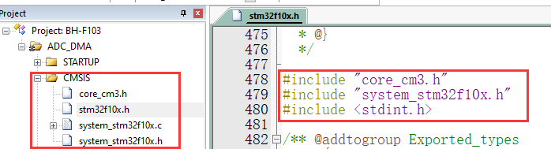

å¯ä»¥çœ‹åˆ°, 主è¦æ˜¯4个库文件在项目列表分支`CMSIS`中, `stm32f10x.h` 是STM32F10x MCU çš„**设备头**. 它include了`core_cm3.h`. 使用**stm32f10x标准库**的时候åªéœ€è¦åœ¨éœ€è¦ç”¨åˆ°æ ‡å‡†åº“的模å—`#include "core_cm3.h"`å³å¯.


## 14.3 中断函数æ€éº½å†™å¥½?

å…³äºä¸€äº›ä¸­æ–­å‡½æ•°å†™åœ¨å“ªé‡Œ? 它们用的全局å˜é‡å‘¢? ç»éªŒ:
| æ–¹å¼                                       | è¯´æ˜          | 是å¦æ¨è           |
| ---------------------------------------- | ----------- | -------------- |
| 在 `it.c` ç›´æ¥ `extern` å„个å˜é‡                | 简å•ï¼Œä½†ç»´æŠ¤æˆæœ¬é«˜   | ⌠ä¸æ¨è          |
| 把å˜é‡å£°æ˜å†™åœ¨å„自 `.h` 文件中，在 `it.c` 中 `#include` | 易维护，结æ„清晰    | ✅ æ¨è           |
| 中断函数内部「转å‘ã€åˆ°å¯¹åº”外设模å—å¤„ç†                      | 解耦ã€åˆ©äºå¤§å‹é¡¹ç›®æ‰©å±• | ✅✅ 强烈æ¨è（中大å‹é¡¹ç›®ï¼‰ |


## 14.4 F12找ä¸åˆ°å®šä¹‰è·³è½¬?

如æœå½“å‰æ²¡æœ‰æŠ¥é”™æˆ–警告, å¯èƒ½æ˜¯ä½ è¿˜æ²¡æœ‰ç¼–译. 编译一下å†F12.

也有å¯èƒ½æ˜¯ç¼–译器内建的扩展关键字（attribute）. 如:


```c
//__weak是Keil MDK (armcc)å’ŒARM GCC（比如 STM32CubeIDE）的编译器内建的扩展关键字（attribute）. 表示这个函数是弱符å·ï¼ˆWeak Symbol）
//如æœç¨‹åºä¸­æ²¡æœ‰å…¶ä»–地方定义这个函数, 那就用这个定义. å¦åˆ™å°±æ— è§†è¿™ä¸ªå®šä¹‰! get_fattime()这个函数å¯èƒ½å¾ˆå®¹æ˜“在其他地方é‡å¤å£°æ˜, 我们ä¸å¸Œæœ›å½±å“到那些地方.
__weak DWORD get_fattime(void) {
```


## 14.5 添加新的bsp文件步骤:

å¯ä»¥è‡ªå·±å»USER新建, 也å¯ä»¥åœ¨keilç•Œé¢ç›´æ¥é€‰æ‹©USER文件夹然åadd a new file...但是记得改一下路径, 看一眼你创建在哪里了. è®°å¾—ç»´æŒæ¸…爽的USER文件夹下é¢å„ç§å¤–设文件夹的结æ„! ä¸ç„¶è¿˜å¾—花时间维护include path设置


因为这样åšç”Ÿæˆçš„文件


## 14.6 利用DAP(Debug Access Port)进行烧录/调试


#### .6.0 DAPæ¥å£
DAP 是 ARM Cortex-M 系列微æ§åˆ¶å™¨ä¸­ç”¨äºè°ƒè¯•å’Œç¼–程的一ç§æ¥å£æœºåˆ¶. 它å¯ä»¥æ¥å—æ¥è‡ªå¤–部调试器（比如 ST-Linkã€J-Linkã€CMSIS-DAP）的访问请求，通过支æŒä¸åŒåè®®ä¸å¤–界通信。

é‡ç«DAP下载器:
1. éµå¾ªARMå…¬å¸çš„CMSIS-DAP标准,支æŒæ‰€æœ‰åŸºäºCortex-M内核的å•ç‰‡æœº
2. å±äº**HID设备**,跟鼠标键盘-样，无需安装驱动
3. 支æŒXP/WIN7/WIN8/WIN10 这四个æ“作系统
4. 支æŒJTAGå’ŒSW下载模å¼,å¯åœ¨çº¿è°ƒè¯•å’Œç¡¬ä»¶ä»¿çœŸ

注æ„: 高速版DAP下载器支æŒJTAGå’ŒSW模å¼,全速版åªæœ‰SW模å¼.

* **SW(SWD, serial wire debug)**
  -   是 ARM æ¨å‡ºçš„替代 JTAG 的简化版调试æ¥å£ã€‚
  -   **åªéœ€ä¸¤æ ¹çº¿ï¼ˆSWDIO+SWCLK）**，适åˆå¼•è„šç´§å¼ çš„ MCU。 
  -   用äºæ–­ç‚¹è°ƒè¯•ã€å¯„存器查看ã€çƒ§å½•ç¨‹åºç­‰ã€‚
🔧 你常用的 ST-Link 和 J-Link 就是通过 SWD 跟 MCU 通讯的。


| å¼•è„šå            | åŠŸèƒ½è¯´æ˜              |
| -------------- | ----------------- |
| **SWDIO**      | æ•°æ®è¾“入输出（åŒå‘）        |
| **SWCLK**      | 时钟信å·ï¼ˆå•å‘）          |
| **GND**        | 地线（必须è¿æ¥ï¼‰          |
| **VCC**        | 目标电æºå‚考电å‹ï¼ˆé€šå¸¸3.3V）  |
| （å¯é€‰ï¼‰**nRESET** | 系统å¤ä½å¼•è„šï¼Œç”¨äºè¿œç¨‹å¤ä½ï¼ˆå¯é€‰ï¼‰ |


* **JTAG(joint test action group)**
  -   是一ç§æ›´é€šç”¨çš„ã€**4~5线的调试æ¥å£**（TDI/TDO/TCK/TMS/\[TRST\]）。 
  -   支æŒå¤šèŠ¯ç‰‡çº§è”调试。   
  -   功能比 SWD æ›´å¤æ‚，但在 STM32 上你ä¸ä¸€å®šéœ€è¦è¿™ä¹ˆå¤šã€‚


| å¼•è„šå        | åŠŸèƒ½è¯´æ˜                     |
| ---------- | ------------------------ |
| **TDI**    | Test Data In（数æ®è¾“入）       |
| **TDO**    | Test Data Out（数æ®è¾“出）      |
| **TCK**    | Test Clock（时钟信å·ï¼‰         |
| **TMS**    | Test Mode Select（模å¼é€‰æ‹©ï¼‰   |
| **TRST**   | Test Reset（å¯é€‰ï¼Œä¸æ˜¯æ‰€æœ‰èŠ¯ç‰‡éƒ½éœ€è¦ï¼‰ |
| **GND**    | 地线                       |
| **VCC**    | 目标æ¿å‚è€ƒç”µå‹                  |
| **nRESET** | 系统å¤ä½ï¼ˆå¯é€‰ï¼‰                 |

* **SWJ(SWD JTAG Switching)**

也就是JTAG+SWD功能.


大多数 Cortex-M 系列 MCU（比如 STM32）在芯片å¯åŠ¨æ—¶ä¼šé»˜è®¤å¯ç”¨ SWJ 全部功能，也就是JTAG + SWD 都打开。
通过设置特定寄存器（一般是 AFIO_MAPR 或 SYSCFG->CFGRx，视芯片而定）å¯ä»¥å…³é—­ JTAG，仅ä¿ç•™ SWD，以节çœå¼•è„šèµ„æºã€‚


* V-UART(Virtual UART)
  -   是 CMSIS-DAP 或 DAPLink æ供的一ç§è™šæ‹Ÿä¸²å£ã€‚ 它在 USB 中模拟出一个 UART（串å£ï¼‰ï¼Œä½ å¯ä»¥åœ¨ç”µè„‘上看到一个 COM å£
MCU ä¸ç”µè„‘通过这个虚拟串å£è¿›è¡Œ 日志输出ã€å‘½ä»¤è¾“å…¥ã€è°ƒè¯•é€šä¿¡
  - 好处：ä¸éœ€è¦æ¥é¢å¤–串å£èŠ¯ç‰‡ï¼ˆå¦‚CH340ã€MAX232），直æ¥åœ¨è°ƒè¯•å™¨ä¸­å°±æœ‰
  -   用æ¥å®ç° **USB转串å£** 的调试输出。
  -   比如你æ’上一个 DAPLink 调试器å，电脑上出ç°ä¸€ä¸ª COM å£ï¼Œå°±æ˜¯ V-UART æ供的，通常被用æ¥åš `printf` 输出调试。


####  .6.1**keil中用DAP烧录/调试**
------------
使用SWD或JTAGè¿æ¥å¥½DAP调试器å, 在keil中选择debugger为CMSIS-DAP Debugger:

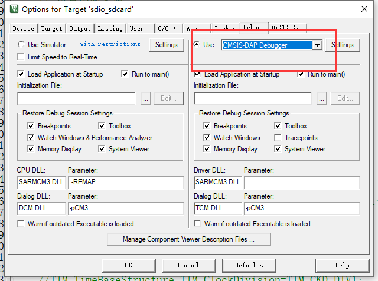


è®°å¾—utilities勾选å¯ç”¨debugger


在æ¥å…¥DAP调试器å, 在debug->setting中å¯ä»¥çœ‹åˆ°å…·ä½“的调试器å‹å·, 以åŠè¿æ¥åˆ°çš„MCUå‹å·

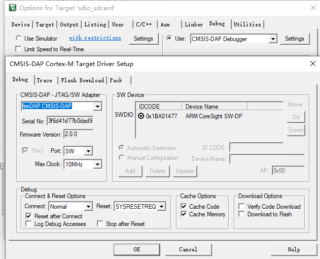


其中的åºåˆ—å·:
FS-xxxx: é‡ç«full speed版
HS-xxxx: é‡ç«high speed版(支æŒJTAG)


Reset选项:
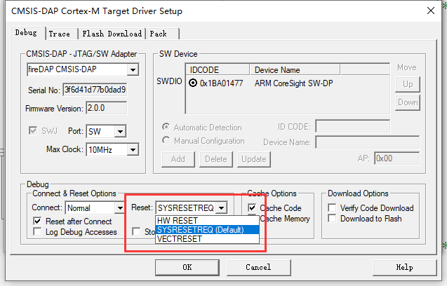

| 选项          | 使用场景                  |
| ----------- | --------------------- |
| SYSRESETREQ | æ¨è的默认方å¼ï¼Œé€‚åˆç»å¤§å¤šæ•°æƒ…况      |
| HW RESET    | MCUè·‘é£ã€Flash错烧时清除状æ€æœ€å½»åº• |
| VECTRESET   | 内核异常æ¢å¤ï¼Œä½†ä¸å½±å“å¤–è®¾çŠ¶æ€       |

选择flash download. (烧录到哪个flash中. å¤æ‚çš„å¼€å‘æ¿å¯èƒ½è¯†åˆ«å‡ºå¥½å¤šflash设备)

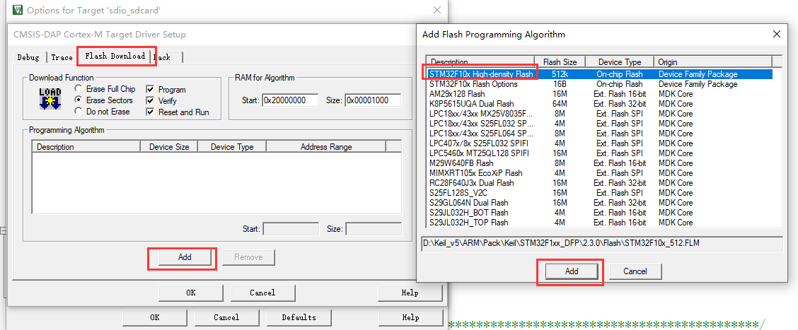

记得勾选eraser sector(擦除全片有点慢), 还有reset and run(软件烧录å自动reset+run, 就和硬件reset一样的)


#### .6.2 ST-LINK

使用CUBE_IDE的工程ä¸èƒ½ç›´æ¥ä½¿ç”¨DAP下载器, 必须使用ST-LINK下载器...


## 14.7 使用ST-LINK烧录/调试


## 14.7 跨芯片移æ¤ç¨‹åº


æµç¨‹å¤§æ¦‚是:
Project → Options → device, 更改芯片选å‹.

确定`CMSIS/stm32f10x.h`中那堆芯片选å‹çš„#ifdefåªé€‰ä¸­äº†ä¸€ä¸ª. 如æœå¤šä¸ªèŠ¯ç‰‡é€‰å‹çš„#ifdef被命中, 会拼æ¥å‡ºé”™è¯¯çš„语法.

Project → Options → C/C++ → Defines, 这里是**家æ—å®**. `,`分隔的字符串, æ¯ä¸ªå­—符串`str`都被当作在当å‰æ‰€æœ‰æ–‡ä»¶å¼€å¤´`#define str`. 查看家æ—å®æœ‰æ²¡æœ‰é—®é¢˜. 

比如f103VET6->F103C8T6æ—¶, 家æ—å®é‡Œ`STM32F10X_HD`è¦æ”¹æˆ`STM32F10X_MD`.

然å修改一个个bsp_xxx


##

##


# 16. 汇编语言(Assembly)


https://www.bilibili.com/video/BV1KG411T77D/?spm_id_from=333.337.search-card.all.click&vd_source=4665566d92a194d3e4867c96fe3441c0


### 0. 简介

汇编语言没有统一的标准版本，因为它是针对**具体处ç†å™¨æ¶æ„**编写的，æ¯ç§å¤„ç†å™¨ï¼ˆæˆ–æ¶æ„）都有自己的汇编语言指令集。我们通常说“汇编语言版本â€æ—¶ï¼Œå®é™…是指 所使用的指令集æ¶æ„（ISA）：
| æ¶æ„                      | 常è§ä½¿ç”¨è€…             | 示例汇编指令             |
| ----------------------- | ----------------- | ------------------ |
| x86 / x86-64            | Intel, AMD PC端    | `MOV EAX, 1`       |
| ARM (如 ARMv7, Cortex-M) | STM32ã€æ‰‹æœºCPU等嵌入å¼ç³»ç»Ÿ | `MOV R0, #1`       |
| RISC-V                  | æ–°å…´å¼€æºæ¶æ„，清åYsyxç­‰    | `addi a0, zero, 1` |
| MIPS                    | 教育领域ã€æ—©æœŸåµŒå…¥å¼        | `li $v0, 1`        |

汇编语言æºä»£ç ä¸€èˆ¬ä»¥.asm结尾.

汇编器(Assembler)å°†**汇编代ç **翻译为**机器ç (比特æµ)**.
ä¸åŒå·¥å…·é“¾çš„汇编器也会有版本，例如：
| 汇编器                  | 常è§å¹³å°             | 示例版本命令                    |
| -------------------- | ---------------- | ------------------------- |
| `GNU as` (gas)       | Linuxã€ARM GCC工具链 | `as --version`            |
| `Keil ARM Assembler` | Keil MDK for ARM | è‡ªåŠ¨éš IDE é›†æˆ                |
| `NASM`               | x86/PCå¹³å°         | `nasm -v`                 |
| `MASM`               | Windows x86      | Microsoft Macro Assembler |

例如,**Keil + STM32**调试ç¯å¢ƒä¸­ä½¿ç”¨çš„是:
  -   使用的是 **ARM Cortex-M æ¶æ„的汇编语言（ARM Thumb 指令集）** 
  -   汇编器是 **Keil MDK çš„ ARM 汇编器**ï¼ˆå†…éƒ¨æ”¯æŒ `.asm` 或 `.s` 文件）


## 1. ASMçš„vscodeæ’件

在vscode里用这个æ’件写汇编.


æ’件é…置主è¦æ”¹è¿™ä¸¤ä¸ª:使用的**汇编工具**/使用的**DOSç¯å¢ƒæ¨¡æ‹Ÿå™¨**å°±å¯ä»¥äº†

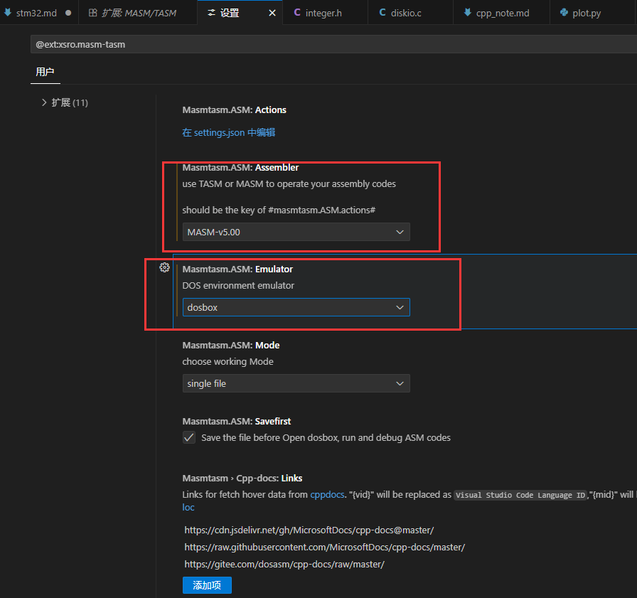


dosbox: 弹出类似cmd的黑框框.
msdos pleayer: ç›´æ¥åœ¨ç»ˆç«¯è¿è¡Œ


代ç å†™å¥½ä¹‹å, å³é”®å¯ä»¥çœ‹åˆ°:


* open emulator(打开dosç¯å¢ƒ)
* run ASM code(è¿è¡Œå½“å‰ç¨‹åº, 汇编+linking+running)
* debug ASM code(调试当å‰ç¨‹åº, 汇编+linking+debugging)


### 1.1 调试ASM code
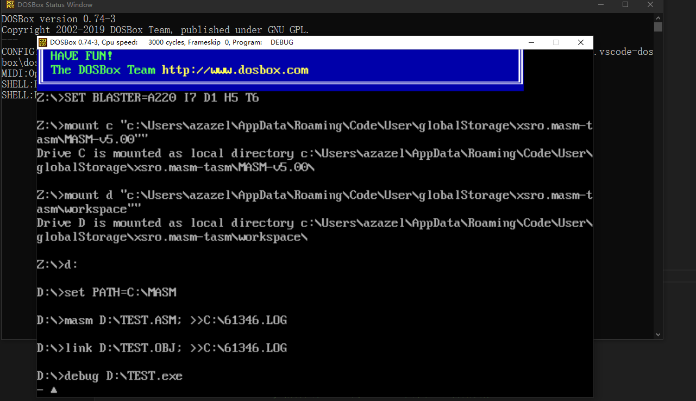

指令:
* `t`: trapå•æ­¥æ‰§è¡Œ
* `r`: 查看寄存器
* `G`: 程åºè¿è¡Œåˆ°åº•
* `D [addr]`: 查看内存中的内容. 如D


## 2. 基础指令&通用寄存器 (intel 8086æ¶æ„)

* 通用寄存器（General Purpose Registers）
这些寄存器å¯ä»¥ç”¨äºç®—术è¿ç®—ã€å­˜å‚¨ä¸´æ—¶å˜é‡ã€å‡½æ•°è°ƒç”¨å‚数等。它们也å¯ä»¥ç»†åˆ†ä¸ºé«˜8ä½å’Œä½8ä½ï¼Œä¾‹å¦‚ AX å¯ä»¥æ‹†æˆ AH（高）和 AL（ä½ï¼‰ã€‚
| å称   | å«ä¹‰                   | 用途                                                   |
| ---- | -------------------- | ---------------------------------------------------- |
| `AX` | Accumulator 累加器      | 最é‡è¦çš„寄存器之一，很多指令默认使用 AX 作为æ“作数。例如乘法ã€é™¤æ³•ç­‰æŒ‡ä»¤ç»“æœé»˜è®¤å­˜å…¥ AX      |
| `BX` | Base Register 基地å€å¯„存器 | 常用äºä½œä¸ºåŸºå€ï¼Œé…åˆå˜å€å¯„存器组æˆå†…å­˜è®¿é—®åœ°å€                              |
| `CX` | Count Register 计数器   | `LOOP` 指令自动使用 CX 作为循ç¯è®¡æ•°å™¨ï¼›ä¹Ÿç”¨äº `SHIFT`ã€`ROTATE` 类的é‡å¤æ¬¡æ•° |
| `DX` | Data Register æ•°æ®å¯„存器  | 通常用äºå­˜æ”¾ I/O 地å€ã€æ•°æ®æˆ–乘除法时的高ä½æ“ä½œæ•°æˆ–ç»“æœ                       |

* 指针和å˜å€å¯„存器（Pointer and Index Registers）
主è¦ç”¨äºå¤„ç† å†…å­˜åœ°å€è®¡ç®—，特别是在字符串æ“作ã€æ•°ç»„访问等。
| å称   | å«ä¹‰                        | 用途                                          |
| ---- | ------------------------- | ------------------------------------------- |
| `SP` | Stack Pointer 栈指针         | 指å‘栈顶；入栈 `PUSH` 和出栈 `POP` æ“作会自动改å˜å®ƒ           |
| `BP` | Base Pointer 基指针          | 用äºè®¿é—®æ ˆå¸§ä¸­çš„æ•°æ®ï¼ˆå‡½æ•°å±€éƒ¨å˜é‡/å‚数）；常和 `SP` é…åˆä½¿ç”¨          |
| `SI` | Source Index æºå˜å€å¯„存器       | 字符串å¤åˆ¶æˆ–数组读å–时用äºæŒ‡å‘æºæ•°æ®åœ°å€ï¼Œå¸¸ç”¨äº `MOVS`, `LODS` 等指令 |
| `DI` | Destination Index 目标å˜å€å¯„存器 | åŒä¸Šï¼Œä½†ç”¨äºç›®æ ‡åœ°å€ï¼Œå¸¸ç”¨äº `STOS`, `SCAS` 等指令           |

* 段寄存器（Segment Registers）
  在 8086 中内存寻å€é‡‡ç”¨æ®µ:å移（Segment:Offset）方å¼ã€‚æ¯ä¸ªæ®µå¯„存器æ§åˆ¶ä¸€ç±»å†…存区域的起始ä½ç½®ã€‚
| å称   | 全称                       | 用途                                    |
| ---- | ------------------------ | ------------------------------------- |
| `CS` | Code Segment 代ç æ®µ         | 指å‘当å‰æ­£åœ¨æ‰§è¡Œçš„程åºä»£ç çš„æ®µåœ°å€                     |
| `DS` | Data Segment æ•°æ®æ®µ         | 默认的数æ®å­˜å‚¨æ®µ                              |
| `SS` | Stack Segment 栈段         | 当å‰æ ˆçš„段地å€ï¼Œé…åˆ `SP` 使用                    |
| `ES` | Extra Segment 附加段        | 一般用äºå­—符串æ“作（比如 `MOVS`, `LODS`）中作为附加的数æ®æ®µ |
| `IP` | Instruction Pointer 指令指针 | 当å‰æ­£åœ¨æ‰§è¡ŒæŒ‡ä»¤çš„å移地å€ï¼Œé…åˆ `CS` 定ä½ä¸‹ä¸€æ¡è¦æ‰§è¡Œçš„指令     |

* 标志寄存器（FLAGS Register）
  用äºä¿å­˜ CPU 当å‰çš„状æ€ï¼Œæ¯”如上次è¿ç®—结æœæ˜¯æ­£/è´Ÿ/零/溢出等，供æ¡ä»¶è·³è½¬å’Œåˆ¤æ–­ä½¿ç”¨ã€‚
| å称   | å«ä¹‰              | 功能                       |
| ---- | --------------- | ------------------------ |
| `ZF` | Zero Flag       | 上一æ“作结æœä¸º 0，则 ZF = 1       |
| `SF` | Sign Flag       | 上一æ“作结æœä¸ºè´Ÿæ•°ï¼Œåˆ™ SF = 1       |
| `CF` | Carry Flag      | è¿›ä½æ ‡å¿—（无符å·æ•°è¿ç®—时有溢出则 CF = 1） |
| `OF` | Overflow Flag   | 溢出标志（有符å·æ•°è¿ç®—时溢出）          |
| `PF` | Parity Flag     | 检查结æœçš„最ä½å­—节中有å¶æ•°ä¸ª1，则 PF = 1 |
| `AF` | Auxiliary Carry | åŠå­—节进ä½ï¼ˆç”¨äº BCD è¿ç®—）         |
| `IF` | Interrupt Flag  | 是å¦å“应外部中断                 |
| `DF` | Direction Flag  | 字符串处ç†æŒ‡ä»¤çš„æ–¹å‘（自å¢æˆ–自å‡ï¼‰        |


MOV:

```Assembly
MOV	AX, Y ;

```


Operand(æ“作数): 指令作用的对象.`MOV AX BX`指令中, 
常è§æ“作数å¯ä»¥æ˜¯ï¼š
| ç±»å‹       | 示例            | è¯´æ˜         |
| -------- | ------------- | ---------- |
| **寄存器**  | AX, BX, CX... | 寄存器内的值     |
| **ç«‹å³æ•°**  | 5, 0x1F       | ç›´æ¥å†™çš„数值     |
| **内存地å€** | `[1234H]`     | æŸä¸ªå†…å­˜ä½ç½®     |
| **å移地å€** | `[BX+SI]`     | ç”¨å¯„å­˜å™¨è®¡ç®—å‡ºçš„åœ°å€ |

```asm
MOV AX, 1234H     ; 将立å³æ•° 1234H 放入 AX
MOV BX, AX        ; å°† AX 的值å¤åˆ¶åˆ° BX
MOV [2000H], BX   ; 将 BX 的值写入内存 2000H

```


