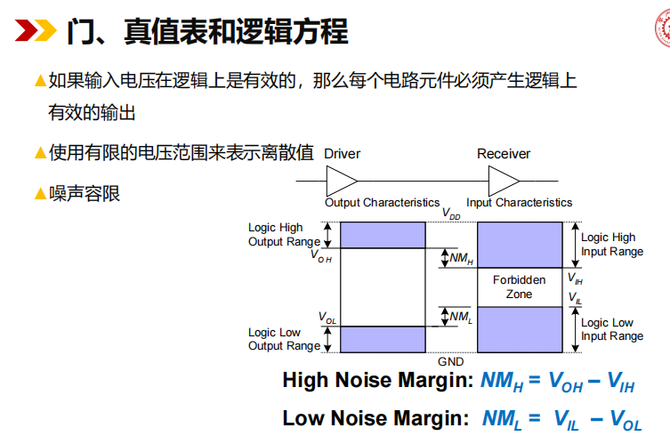
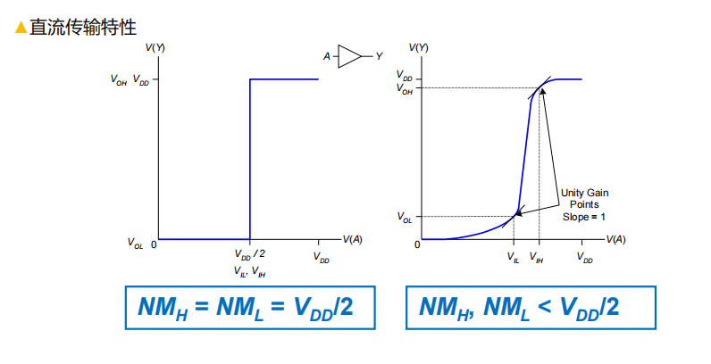
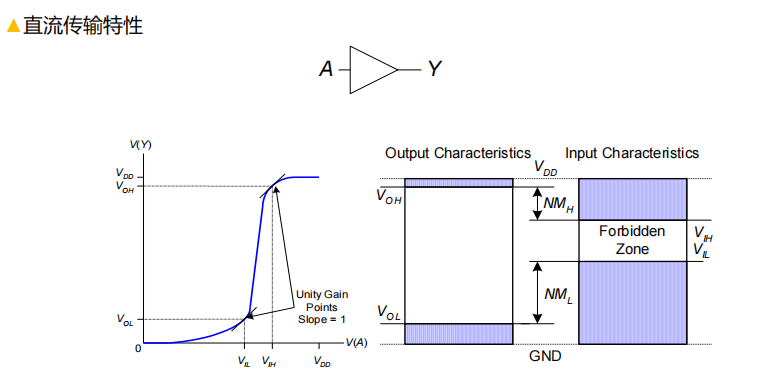
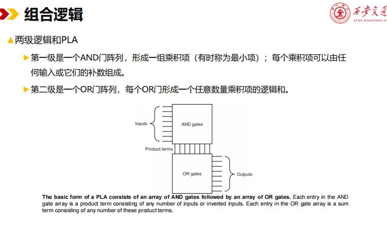
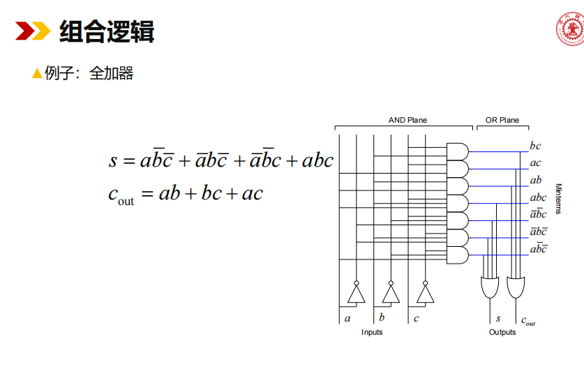
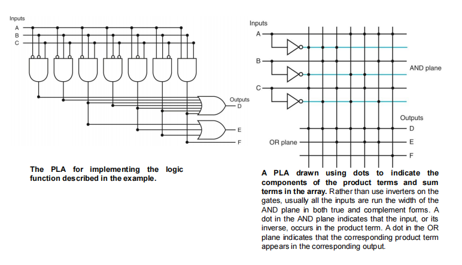

**大规模集成电路设计 VLSI(very large scale intergration circuit)**

## 1.0 门,真值表和逻辑方程

| 符号 | 英文全称 (English Full Name) | 中文解释 (Chinese Meaning) | 描述 (Description) |
| :--- | :--- | :--- | :--- |
| VDD | Voltage at Drain Drain | 电源电压 | 驱动器 (Driver) 或接收器 (Receiver) 的正电源引脚电压, 通常是最高逻辑电平。 |
| VOH | Voltage Output High | 输出高电平电压 | 驱动器 (Driver) 输出的高电平电压的最小值。 |
| VOL | Voltage Output Low | 输出低电平电压 | 驱动器 (Driver) 输出的低电平电压的最大值。 |
| VIH | Voltage Input High | 输入高电平电压 | 接收器 (Receiver) 能识别为高电平信号的最小输入电压。 |
| VIL | Voltage Input Low | 输入低电平电压 | 接收器 (Receiver) 能识别为低电平信号的最大输入电压。 |
| NMH | Noise Margin High | 高电平噪声容限 | 高电平信号的抗噪声能力, 由 VOH - VIH 计算得出。 |
| NML | Noise Margin Low | 低电平噪声容限 | 低电平信号的抗噪声能力, 由 VIL - VOL 计算得出。 |

## 2. 可编程门阵列, PLA(programmable logic array)

### 两级逻辑和PLA

►任何逻辑功能都可以只用AND、OR和NOT函数来实现。

►事实上，任何逻辑函数都可以写成典型的形式，其中每个输入都是一个真变量或补码变量，只有两级门，一个是AND，另一个是OR，最后的输出可能是反转的。

►这样的表示法被称为两级表示法，有两种形式，称为积之和，和之积。

►积之和表示法是乘积（使用AND运算符的条款）的逻辑和（OR）；和之积则正好相反。

### 查找表 (Look-Up Table, LUT)

它是FPGA的基本单元！

