# 0. esp32&arduino


## 0.


-------------
开发方式:
* 1.官方IDE
* 2.vscode platformIO


## 0.1 官方IDE

打开官方IDE, 在tools->board寻找你的开发板型号(`esp32`). 如果没有, 选择boards manager添加.

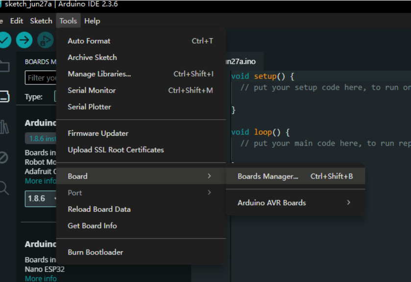

或者直接在侧边栏的第二个图标进入boards manager.

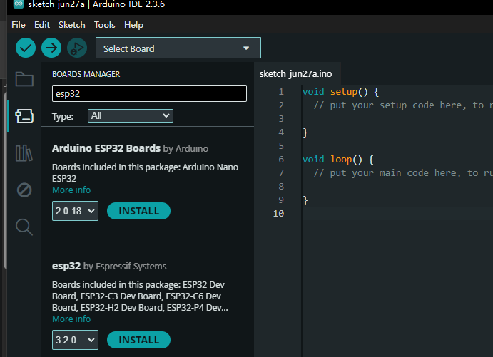

搜索`esp32`会发现两个结果:
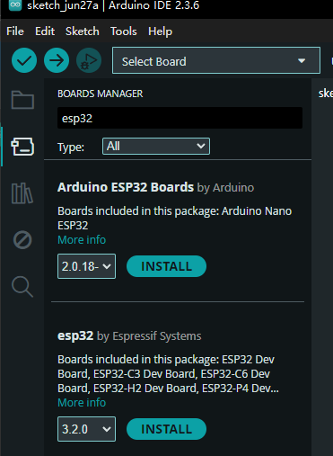


### 🟦 **1\. `Arduino ESP32 Boards by Arduino`**

-   📦 版本：2.0.18（由 Arduino 官方团队维护）
    
-   ✅ 支持板子：Arduino Nano ESP32 系列
    
-   🔧 优化对象：主要为 Arduino 自家推出的 **Nano ESP32** 板子（不是普通 ESP32 DevKit）
    

⚠️ 如果你用的是市面上的 **普通 ESP32 DevKit V1、ESP32-WROOM-32、ESP32-C3** 等板子，不推荐选这个包，兼容性差。

* * *

### 🟩 **2\. `esp32 by Espressif Systems`**

-   📦 版本：3.2.0（由 Espressif 官方提供）
    
-   ✅ 支持板子：几乎所有 ESP32 系列（DevKit V1、ESP32-C3/C6、S2/S3、PICO 等）
    
-   💡 最常用、最强大、社区最活跃的支持包
    
-   💯 推荐用于 **绝大多数 ESP32 开发板**


我操死活下载不了, 说网络错误. 现在在用全局代理... 

尝试离线安装. 手动粘贴了url下载然后放在本地缓存目录(C:\Users\<你>\AppData\Local\Arduino15\staging\packages\)的压缩包然后IDE就她妈的安装了半个小时还是这样,.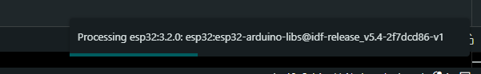
死妈IDE, 卸载.

第二天. 不知道为什麽成功了.
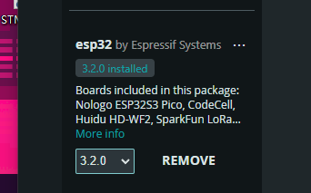

但是因为初体验很差, 去隔壁了.

## 0.2 vscode+platformIO插件

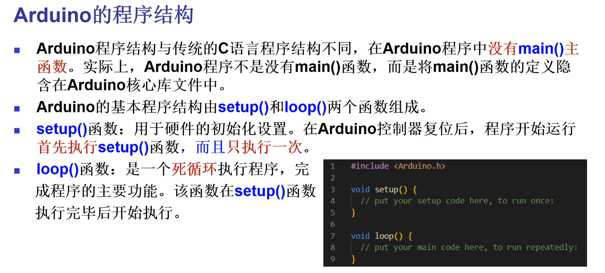


下载这个插件.


下载好插件后侧边栏点击就可以用了:
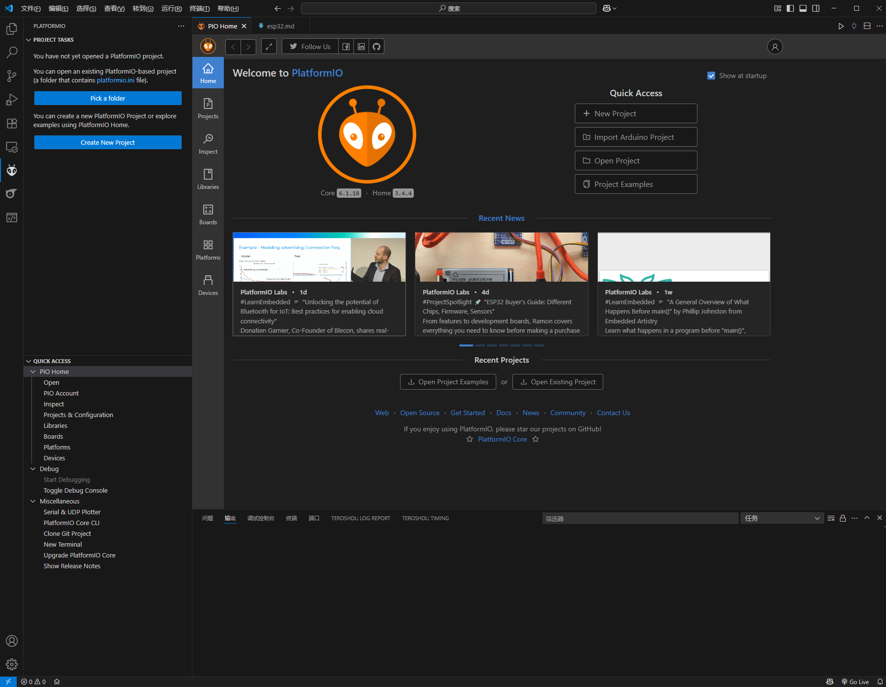


   
确认芯片型号?
常见配有 CH340 + USB-C 接口的 ESP32 板子
很多这类板子的实际型号都是：
ESP32 DevKit V1 (也叫 ESP32 Dev Module)
这种板子几乎都是基于 ESP32-WROOM-32 模块（有 Wi-Fi + 蓝牙、带 4MB Flash）。


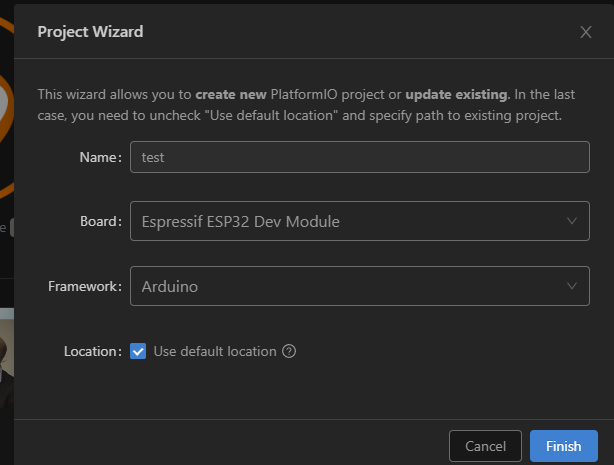


然后创建大概需要很久(30min+), 因为要下载板载包(600+mb), 最好开全局代理.

### 0.2.1 项目结构
创建的项目文件夹是这样的结构:
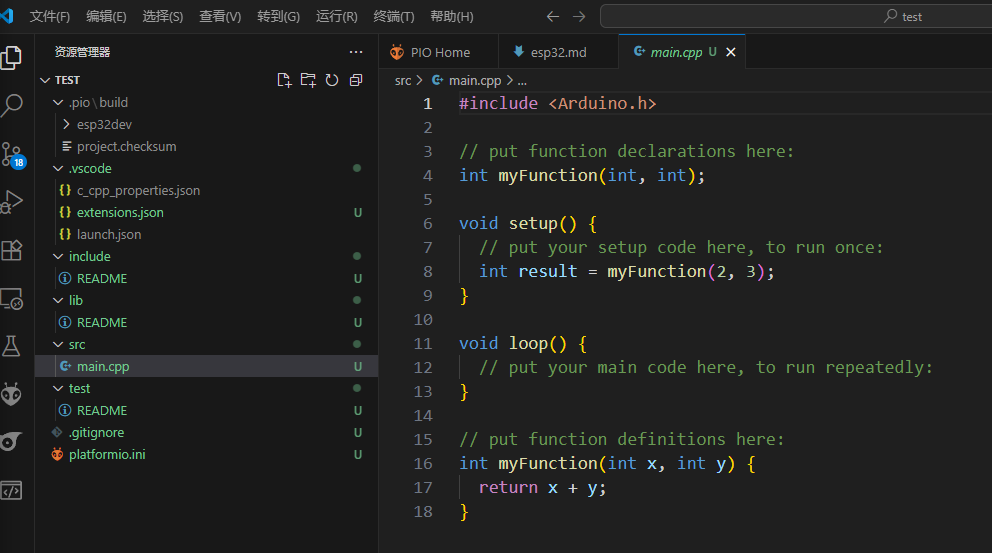

my_test_project/    ← 你的项目根目录
├── include/
│   └── README
├── lib/
│   └── README
├── platformio.ini
├── src/
│   └── main.cpp
└── test/
    └── README

| 名称               | 类型     | 说明                                                                                         |
| ---------------- | ------ | ------------------------------------------------------------------------------------------ |
| `platformio.ini` | 配置文件   | 📌 PlatformIO 的项目配置核心。你会在里面指定开发板型号（比如 `esp32dev`）、所用框架（比如 `arduino` 或 `espidf`）、库依赖、串口配置等。 |
| `src/`           | 源码目录   | 放你**主要的应用程序代码**。比如 `main.cpp` 就是程序入口点，对应 Arduino 风格的 `setup()` / `loop()` 函数。              |
| `include/`       | 头文件目录  | 放你自己写的 `.h` / `.hpp` 文件，用来声明函数、类等供多个 `.cpp` 使用。                                            |
| `lib/`           | 自定义库目录 | 你可以自己写一些模块化的库（每个子目录一个库），放到这里。也可以用 PlatformIO 自动添加外部库。                                      |
| `test/`          | 单元测试目录 | 用于 PlatformIO 的**内置测试框架**（unittest）进行自动化测试；用得较少，但可以写测试代码来验证模块功能。                           |
| `README`（多个）     | 文档提示   | 各目录下的占位文件，通常提示你这个目录可以干嘛；可删可不删，对构建没有影响。                                                     |


### 0.2.2
在main.c中写你的代码.

as you know, 选择arduino框架后, main.c中没有出现int main(){}


**pinout**

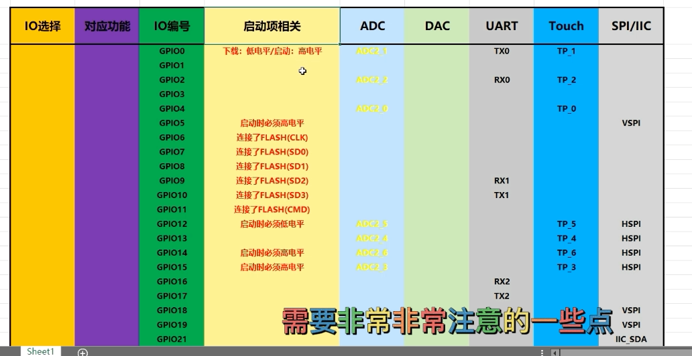

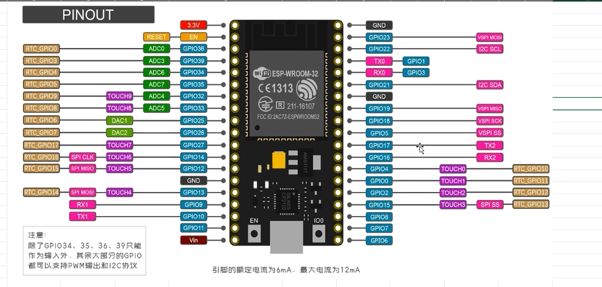
硬件上带了两组SPI.
一个快速SPI(HSPI)
一个普通SPI(VSPI)


**🧩 一、SPI 引脚（Serial Peripheral Interface）**

SPI 是**串行外设接口**，通信速度快，通常用于和显示屏、SD 卡、FLASH 等通信。

**常用引脚有：**


| 名称   | 全称                  | 作用           |
| ---- | ------------------- | ------------ |
| MISO | Master In Slave Out | 从机发送数据到主机    |
| MOSI | Master Out Slave In | 主机发送数据到从机    |
| SCLK | Serial Clock        | 时钟信号（由主机输出）  |
| CS   | Chip Select         | 片选信号，选中某个从设备 |

**📘 二、IIC / I²C 引脚（Inter-Integrated Circuit）**

IIC 是**集成电路间通信接口**，是一种**双线通信协议**，使用非常广泛，常用于传感器、EEPROM 等小外设。

**常用引脚有：**


| 名称  | 作用                |
| --- | ----------------- |
| SDA | 数据线（Serial Data）  |
| SCL | 时钟线（Serial Clock） |

### 0.2.3 platformIO的配置

#### 1. 库管理


和arduinoIDE是一样的:

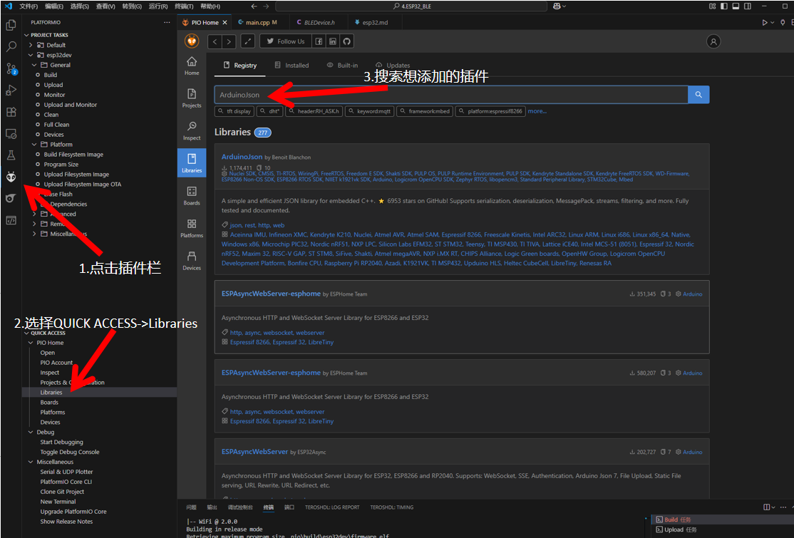

#### 2. 配置文件

即项目文件夹下的`platformio.ini`配置文件.

```ini
; PlatformIO Project Configuration File
;
;   Build options: build flags, source filter
;   Upload options: custom upload port, speed and extra flags
;   Library options: dependencies, extra library storages
;   Advanced options: extra scripting
;
; Please visit documentation for the other options and examples
; https://docs.platformio.org/page/projectconf.html

[env:esp32dev]
platform = espressif32
board = esp32dev
framework = arduino
monitor_speed = 115200 ;不设置的话默认串口波特率是9600!!!
upload_speed = 921600 ;上传速度, 最高921600, 但有些板子不支持, 需要测试
board_build.partitions = huge_app.csv ;分区表, 这个是官方的huge_app分区表, 适合大多数应用. 没有这段话会爆flash哦~
upload_protocol = esptool ;上传协议, esptool是官方的上传工具, 也可以用其他的, 比如espefuse, 但需要额外安装
```


#### 3. 分区表

对platformio, 在路径`C:\Users\azazel\.platformio\packages\framework-arduinoespressif32\tools\partitions`

对arduinoIDE, 在路径`C:\Users\azazel\AppData\Local\Arduino15\packages\esp32\hardware\esp32\3.2.0\tools\partitions`


里面有很多.csv分区表, 你使用 PlatformIO / Arduino / ESP-IDF 烧录程序时，它会参考其中一个分区表，把程序烧录到对应区域。系统启动时也会根据它来找程序、配置、文件系统。

不同分区表名称表示不同用途下的选择. 比如`huge_app.csv`相比`default.csv`, 其app0的size要大得多, 即给予你的程序更大的flash空间.

以`huge_app.csv`为例.

```
# Name,   Type, SubType, Offset,  Size, Flags
nvs,      data, nvs,     0x9000,  0x5000,
otadata,  data, ota,     0xe000,  0x2000,
app0,     app,  ota_0,   0x10000, 0x300000,
spiffs,   data, spiffs,  0x310000,0xE0000,
coredump, data, coredump,0x3F0000,0x10000,

```
| 字段        | 含义说明                                   |
| --------- | -------------------------------------- |
| `Name`    | 分区的名字，比如 `nvs`、`app0`、`spiffs` 等       |
| `Type`    | 类型：`app`（程序），`data`（数据）等               |
| `SubType` | 子类型：比如 `nvs`, `ota`, `spiffs`, `ota_0` |
| `Offset`  | 在 Flash 中的起始地址                         |
| `Size`    | 该分区所占的大小                               |
| `Flags`   | 一般留空，用于配置额外权限                          |

| Name       | 用途说明                                   |
| ---------- | -------------------------------------- |
| `nvs`      | Non-Volatile Storage，保存系统配置、WiFi 连接信息等 |
| `otadata`  | OTA 更新信息（比如当前是 app0 还是 app1）           |
| `app0`     | 应用程序存储区（这个就是你写的程序）                     |
| `spiffs`   | 文件系统分区(虚拟文件管理.) 存放静态网页、图片、配置等                   |
| `coredump` | 当系统崩溃时保存调用栈、寄存器、异常信息（方便调试）             |


#### 4.

# 1. BLE


BLE 通信基于 GATT（Generic Attribute Profile） 模型，整体是树状结构：

BLE Server（设备）
├── Service（服务）
│   ├── Characteristic（特征）
│   │   ├── Descriptor（描述符）


 BLE 创建的 6 步操作:以 ESP32 和 Arduino BLE 库为例（使用 NimBLE 或 ESP32 BLE Arduino）：

### ✅ 1. 创建 BLE Server（服务端）
```Cpp
BLEDevice::init("MyESP32");  // 初始化 BLE 设备，设置名称 BLEServer *pServer = BLEDevice::createServer();  // 创建 GATT 服务器
```
你这个 ESP32 就变成了 **蓝牙广播设备**。
* * *
### ✅ 2. 创建 BLE Service（服务）
```Cpp
BLEService *pService = pServer->createService("12345678-1234-5678-1234-56789abcdef0");
```
-   每个 Service 有一个唯一 UUID（128-bit 格式）
    
-   一个服务可以包含多个特征（Characteristic）
### ✅ 3. 创建 BLE Characteristic（特征）
```Cpp
BLECharacteristic *pCharacteristic = pService->createCharacteristic(   "abcdefab-1234-5678-1234-56789abcdef0",   BLECharacteristic::PROPERTY_READ   |   BLECharacteristic::PROPERTY_WRITE  |   BLECharacteristic::PROPERTY_NOTIFY );
```
-   用于 **数据读写或通知**
    
-   每个特征也有唯一 UUID
    
-   支持属性如 READ、WRITE、NOTIFY、INDICATE 等:
| 属性         | 含义          | 谁发起？    | 是否需要回应  | 是否主动发给 Client |
| ---------- | ----------- | ------- | ------- | ------------- |
| `READ`     | 客户端读取值      | **客户端** | ✅ 是     | ❌ 否. 客户端读服务端的数据.           |
| `WRITE`    | 客户端写入值      | **客户端** | ❌/✅ 看情况 | ❌ 否. 客户端写数据到服务端           |
| `NOTIFY`   | 服务端推送值（不确认） | **服务端** | ❌ 否     | ✅ 是, 但客户端必须订阅特征才能收到 Notify.   |
| `INDICATE` | 服务端推送值（要确认） | **服务端** | ✅ 是     | ✅ 是, 服务端发送并要求客户端确认.           |

* * *

### ✅ 4. 创建 BLE Descriptor（描述符）
```cpp
pCharacteristic->addDescriptor(new BLE2902());
```
-   BLE2902 是 BLE 标准的配置描述符（用于通知/指示功能）
    
-   你也可以自定义描述符（如用户描述、长度约束等）    
* * *

### ✅ 5. 开始服务

```cpp
pService->start();  // 启动服务（并非广播）
```
* * *

### ✅ 6. 开始广播（Advertise）

```cpp
BLEAdvertising *pAdvertising = BLEDevice::getAdvertising(); pAdvertising->addServiceUUID(pService->getUUID()); pAdvertising->start();
```

-   广播使客户端能“扫描到”你的设备
    
-   扫描之后客户端可以连接并操作服务/特征

例如下面这个树结构描述你的 ESP32 作为从机（Peripheral，也就是 GATT Server），它提供一个“温度”特征，属性为 NOTIFY。客户端（Central，比如手机 App）会订阅这个特征，接收温度更新。
ESP32 (Peripheral / GATT Server)
└── Service: UUID "12345678-1234-5678-1234-56789abcdef0"
    └── Characteristic: UUID "abcdefab-1234-5678-1234-56789abcdef0"
        ├── Properties: NOTIFY
        ├── Value: (e.g. 25.3°C as float or int16)
        └── Descriptor: UUID 0x2902 (Client Characteristic Configuration Descriptor, CCCD)

# 2. 低功耗模式


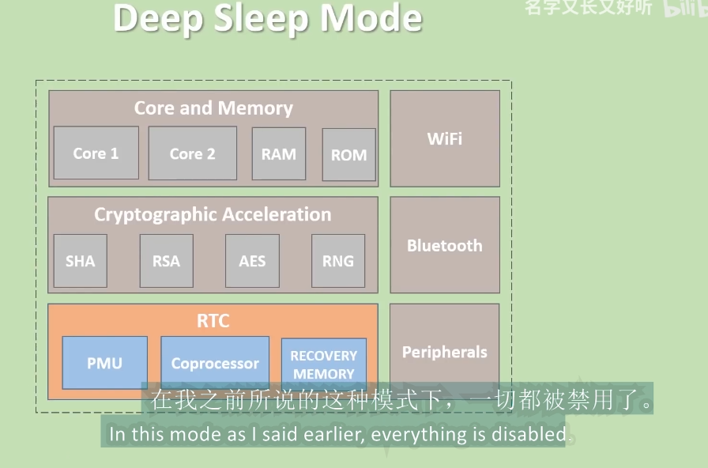


