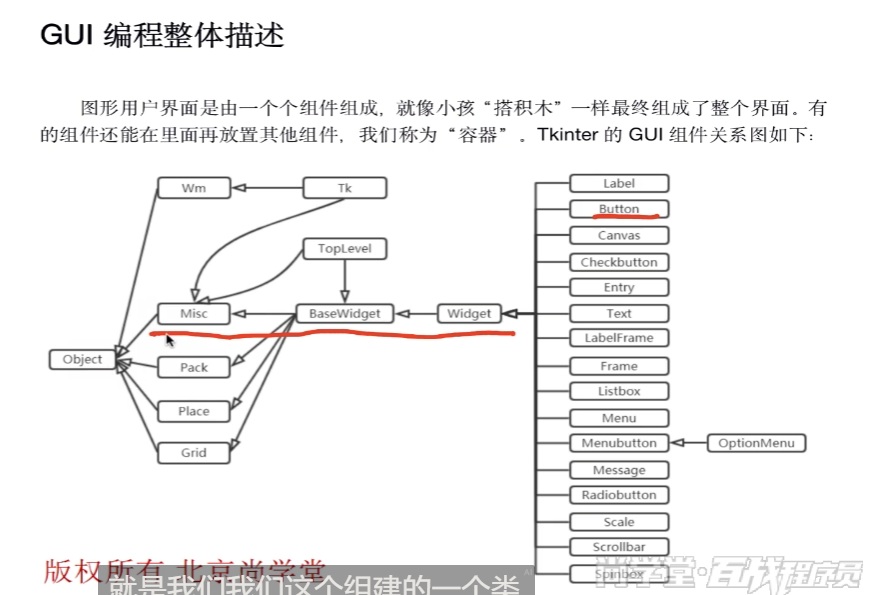

官方文档:

https://docs.python.org/3.7/library/tk.html

初学者文档:
https://effbot.org/tkinterbook/


Tkinter组件的类继承关系图:


其中Wm类方法用来控制窗口之间的交互.
- Misc 和 Wm：

  Tkinter 的 GUI 组件有两个根父类，它们都直接继承了 object 类：
  ・Misc：它是所有组件的根父类。
  ・Wm：它主要提供了一些与窗口管理器通信的功能函数。

其中pack, place, grid是三种**布局管理器**.

## 3.布局管理器


### 3.1 pack布局管理器


### messagebox的主要弹窗类型


在 `tkinter.messagebox` 中，`showinfo()` 只是其中一种消息弹窗类型，`messagebox` 提供了多种不同类型的弹窗，每种弹窗的 **图标、按钮和默认用途** 不同。  

### **1. `messagebox` 的主要弹窗类型**
| 方法 | 图标 | 按钮 | 用途 |
|------|------|------|------|
| `showinfo(title, message)` | ℹ️ 信息图标 | 仅 **OK** | 显示普通提示信息 |
| `showwarning(title, message)` | ⚠️ 警告图标 | 仅 **OK** | 显示警告信息 |
| `showerror(title, message)` | ❌ 错误图标 | 仅 **OK** | 显示错误信息 |
| `askquestion(title, message)` | ❓ 问号图标 | **Yes / No** | 返回 `"yes"` 或 `"no"` |
| `askokcancel(title, message)` | ❓ 问号图标 | **OK / Cancel** | 返回 `True`（OK）或 `False`（Cancel） |
| `askyesno(title, message)` | ❓ 问号图标 | **Yes / No** | 返回 `True`（Yes）或 `False`（No） |
| `askretrycancel(title, message)` | 🔄 重试图标 | **Retry / Cancel** | 返回 `True`（Retry）或 `False`（Cancel） |

---

### **2. 不同弹窗的示例**
#### **(1) 信息提示（`showinfo`）**
```python
from tkinter import messagebox

messagebox.showinfo("提示", "操作成功！")  # 仅显示信息，用户只能点 OK
```


#### **(2) 警告提示（`showwarning`）**
```python
messagebox.showwarning("警告", "磁盘空间不足！")  # 警告图标，用户只能点 OK
```


#### **(3) 错误提示（`showerror`）**
```python
messagebox.showerror("错误", "文件读取失败！")  # 错误图标，用户只能点 OK
```


#### **(4) 询问用户（`askyesno`）**
```python
answer = messagebox.askyesno("确认", "确定要删除吗？")
if answer:  # True（Yes） or False（No）
    print("用户选择了 Yes")
else:
    print("用户选择了 No")
```
  

#### **(5) 确认操作（`askokcancel`）**
```python
confirm = messagebox.askokcancel("确认", "是否继续？")
if confirm:  # True（OK） or False（Cancel）
    print("用户点击了 OK")
else:
    print("用户点击了 Cancel")
```
  

---

### **3. 返回值对比**
| 方法 | 返回值 |
|------|--------|
| `showinfo()` | 无返回值（仅显示信息） |
| `showwarning()` | 无返回值（仅显示警告） |
| `showerror()` | 无返回值（仅显示错误） |
| `askquestion()` | `"yes"` 或 `"no"` |
| `askokcancel()` | `True`（OK）或 `False`（Cancel） |
| `askyesno()` | `True`（Yes）或 `False`（No） |
| `askretrycancel()` | `True`（Retry）或 `False`（Cancel） |

---

### **4. 如何选择？**
- **仅提示信息（用户无需选择）** → `showinfo()` / `showwarning()` / `showerror()`
- **需要用户确认（是/否）** → `askyesno()` / `askquestion()`
- **需要用户确认（继续/取消）** → `askokcancel()`
- **需要用户重试或取消** → `askretrycancel()`


