https://hdlbits.01xz.net/wiki/Main_Page

# 1. device

## 1.1 D-filp-flop

最常见的触发器，用于存储一个二进制位。
输入 D 在时钟上升沿或下降沿被采样，并存储为输出 Q

```verilog
module d_filp_flop(
    input clk,      //时钟信号
    input reset     //复位信号
    input d         //数据输入
    output reg q    //输出q
);

    always @(posedge clk or posedge reset) begin
        if(reset)
            q<=0;   //异步
        else
            q<=d;
    end

```

## 1.2 FSM(finite state machine)有限状态机

```verilog

```

# 2.verilog language

## 2.3 modules:hierarchy

### 2.3.4   3modules
You are given a module my_dff with two inputs and one output (that implements a D flip-flop). Instantiate three of them, then chain them together to make a shift register of length 3. The clk port needs to be connected to all instances.

The module provided to you is: module my_dff ( input clk, input d, output q );

Note that to make the internal connections, you will need to declare some wires. Be careful about naming your wires and module instances: the names must be unique.

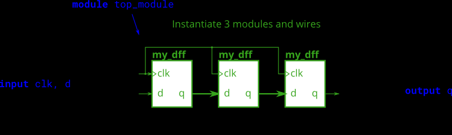
```verilog
module top_module ( input clk, input d, output q );
    wire internal_q1,internal_q2;
    
    my_dff dff1(
        .clk(clk),
        .d(d),
        .q(internal_q1)
    );
    
    my_dff dff2(
        .clk(clk),
        .d(internal_q1),
        .q(internal_q2)
    );
    
    my_dff dff3(
        .clk(clk),
        .d(internal_q2),
        .q(q)
    );
endmodule

```

### 2.3.5 modules and vectors
This exercise is an extension of module_shift. Instead of module ports being only single pins, we now have modules with vectors as ports, to which you will attach wire vectors instead of plain wires. Like everywhere else in Verilog, the vector length of the port does not have to match the wire connecting to it, but this will cause zero-padding or trucation of the vector. This exercise does not use connections with mismatched vector lengths.

You are given a module my_dff8 with two inputs and one output (that implements a set of 8 D flip-flops). Instantiate three of them, then chain them together to make a 8-bit wide shift register of length 3. In addition, create a 4-to-1 multiplexer (not provided) that chooses what to output depending on sel[1:0]: The value at the input d, after the first, after the second, or after the third D flip-flop. (Essentially, sel selects how many cycles to delay the input, from zero to three clock cycles.)

The module provided to you is: module my_dff8 ( input clk, input [7:0] d, output [7:0] q );

The multiplexer is not provided. One possible way to write one is inside an always block with a case statement inside. (See also: mux9to1v)
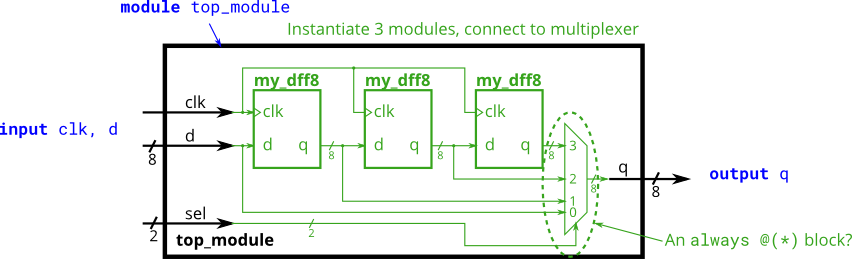
```verilog
module top_module ( 
    input clk, 
    input [7:0] d, 
    input [1:0] sel, 
    output [7:0] q 
);
    wire [7:0] q1;
    wire [7:0] q2;
    wire [7:0] q3;
    
    my_dff8 dff1(
        .clk(clk),
        .d(d),
        .q(q1)
    );
    
    my_dff8 dff2(
        .clk(clk),
        .d(q1),
        .q(q2)
    );
    
    my_dff8 dff3(
        .clk(clk),
        .d(q2),
        .q(q3)
    );    
    
    multiplexer multiplexer1(
        .in1(d),
        .in2(q1),
        .in3(q2),
        .in4(q3),
        .sel(sel),
        .out(q)
    );
endmodule


module multiplexer(
    input [7:0] in1, in2, in3, in4,
    input [1:0] sel,
    output reg [7:0] out	//out必须是reg 
);
    
    //we can directly use 3元操作符`?` to achieve `if` 组合逻辑:
    
    
    assign out = (sel == 2'b00) ? in1:
        (sel == 2'b01) ? in2:
        (sel == 2'b10) ? in3:
        (sel == 2'b11) ? in4:
        8'b0;	//default value
   
    
    
    //也可以使用always内的if或case[行为逻辑], 实现`if`时序逻辑. `@*` automately detect all the relative signal.
    //虽然always块是专门设计给时序逻辑赋值用的, always赋值称为`过程赋值`, 包括`阻塞`(给组合逻辑用,不常见)和`非阻塞`(给组合逻辑用,常见)两个子类. 
    //该程序只涉及组合逻辑赋值. 可以在always块使用阻塞赋值.
    /*
    always @* begin
        case(sel)
            2'b00: out = in1;   // 阻塞赋值. 输出 in1
            2'b01: out = in2;  // 输出 in2
            2'b10: out = in3;  // 输出 in3
            2'b10: out = in4;  // 输出 in4
            default: out = 8'b0;	//default
        endcase
    end     
    */
endmodule
```

### 2.3.6 module add
You are given a module add16 that performs a 16-bit addition. Instantiate two of them to create a 32-bit adder. One add16 module computes the lower 16 bits of the addition result, while the second add16 module computes the upper 16 bits of the result, after receiving the carry-out from the first adder. Your 32-bit adder does not need to handle carry-in (assume 0) or carry-out (ignored), but the internal modules need to in order to function correctly. (In other words, the add16 module performs 16-bit a + b + cin, while your module performs 32-bit a + b).

Connect the modules together as shown in the diagram below. The provided module add16 has the following declaration:

module add16 ( input[15:0] a, input[15:0] b, input cin, output[15:0] sum, output cout );

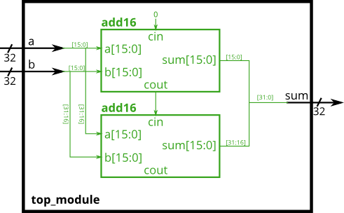
```verilog
//该模块利用两个add16拼接了一个add32.
module top_module(
    input [31:0] a,
    input [31:0] b,
    output [31:0] sum
);

	wire add1_cout;
	wire [15:0] add1_sum;
	wire [15:0] add2_sum;
	add16 add1(
		.a(a[15:0]),
		.b(b[15:0]),
		.cin(1'b0),
        .cout(add1_cout),
		.sum(add1_sum)
	);
	
	add16 add2(
		.a(a[31:16]),
		.b(b[31:16]),
        .cin(add1_cout),
        .cout(),//ignore
		.sum(add2_sum)
	);
	assign sum = {add2_sum, add1_sum};
endmodule
```

### 2.3.7 Module fadd(full adder)
In this exercise, you will create a circuit with two levels of hierarchy. Your top_module will instantiate two copies of add16 (provided), each of which will instantiate 16 copies of add1 (which you must write). Thus, you must write two modules: top_module and add1.

Like module_add, you are given a module add16 that performs a 16-bit addition. You must instantiate two of them to create a 32-bit adder. One add16 module computes the lower 16 bits of the addition result, while the second add16 module computes the upper 16 bits of the result. Your 32-bit adder does not need to handle carry-in (assume 0) or carry-out (ignored).

Connect the add16 modules together as shown in the diagram below. The provided module add16 has the following declaration:

module add16 ( input[15:0] a, input[15:0] b, input cin, output[15:0] sum, output cout );

Within each add16, 16 full adders (module add1, not provided) are instantiated to actually perform the addition. You must write the full adder module that has the following declaration:

module add1 ( input a, input b, input cin, output sum, output cout );

Recall that a full adder computes the sum and carry-out of a+b+cin.

In summary, there are three modules in this design:

top_module — Your top-level module that contains two of...
add16, provided — A 16-bit adder module that is composed of 16 of...
add1 — A 1-bit full adder module.

If your submission is missing a module add1, you will get an error message that says Error (12006): Node instance "user_fadd[0].a1" instantiates undefined entity "add1".

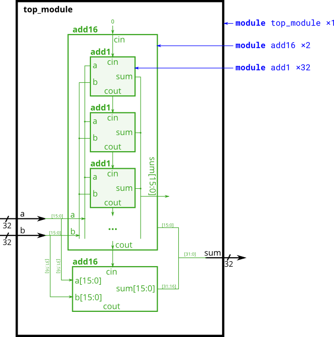
```verilog
//就比2.3.6多了一个全加器add1而已:
//全加器add1
module add1(
	input a,b,cin,
    output cout,sum
);
    assign {cout, sum} = a + b + cin; // 直接利用 Verilog 的位拼接
endmodule
```

### 2.3.8 Module cseladd(carry-select adder)

之前的最简单的串联式加法器被称为纹波式加法器(ripple carry adder).
One drawback of the ripple carry adder (See previous exercise) is that the delay for an adder to compute the carry out (from the carry-in, in the worst case) is fairly slow, and the second-stage adder cannot begin computing its carry-out until the first-stage adder has finished. This makes the adder slow. One improvement is a carry-select adder, shown below. The first-stage adder is the same as before, but we duplicate the second-stage adder, one assuming carry-in=0 and one assuming carry-in=1, then using a fast 2-to-1 multiplexer to select which result happened to be correct.

In this exercise, you are provided with the same module add16 as the previous exercise, which adds two 16-bit numbers with carry-in and produces a carry-out and 16-bit sum. You must instantiate three of these to build the carry-select adder, using your own 16-bit 2-to-1 multiplexer.

Connect the modules together as shown in the diagram below. The provided module add16 has the following declaration:

module add16 ( input[15:0] a, input[15:0] b, input cin, output[15:0] sum, output cout );
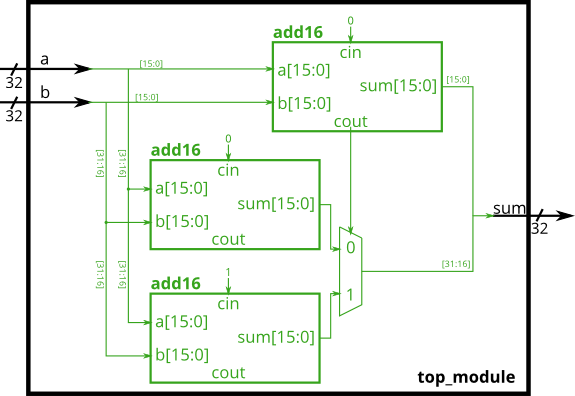

```verilog
//该模块利用两个add16, 并且写了一个multiplexer来实现csel加法器.
module top_module(
    input [31:0] a,
    input [31:0] b,
    output [31:0] sum
);

	wire add1_cout;
	wire [15:0] add1_sum;
	wire [15:0] add2_sum_add1cout0;
	wire [15:0] add2_sum_add1cout1;
	add16 add1(
		.a(a[15:0]),
		.b(b[15:0]),
		.cin(1'b0),
        .cout(add1_cout),
		.sum(add1_sum)
	);
	
	add16 add2_assume_add1_cout_be_0(
		.a(a[31:16]),
		.b(b[31:16]),
		.cin(1'b0),
		.sum(add2_sum_add1cout0)
	);
	
	add16 add2_assume_add1_cout_1(
		.a(a[31:16]),
		.b(b[31:16]),
		.cin(1'b1),
		.sum(add2_sum_add1cout1)
	);
	
	assign sum = (add1_cout==1'b0) ? {add2_sum_add1cout0, add1_sum} :
    {add2_sum_add1cout1, add1_sum};
endmodule
```

### 2.3.9 Module addsub(adder-substractor, 加减法器)
Adder-Subtractor（加减法器）是一种可以同时执行加法和减法运算的数字电路。它的实现基于一个可控的操作符号（通常称为 op 或 mode 信号），通过简单的电路设计，可以用一个模块实现两个功能。
工作原理：
加法和减法的关系基于二进制数的**补码**表示：
加法:A+B
减法:A+(-B)
负数-B等价于对B按位取反再+1, 这也即B的补码.
通过一个 XOR 门实现按位取反，结合控制信号，可以轻松实现 B 的补码计算。
An adder-subtractor can be built from an adder by optionally negating one of the inputs, which is equivalent to inverting the input then adding 1. The net result is a circuit that can do two operations: (a + b + 0) and (a + ~b + 1). See Wikipedia if you want a more detailed explanation of how this circuit works.

Build the adder-subtractor below.

You are provided with a 16-bit adder module, which you need to instantiate twice:

module add16 ( input[15:0] a, input[15:0] b, input cin, output[15:0] sum, output cout );

Use a 32-bit wide XOR gate to invert the b input whenever sub is 1. (This can also be viewed as b[31:0] XORed with sub replicated 32 times. See replication operator.). Also connect the sub input to the carry-in of the adder.
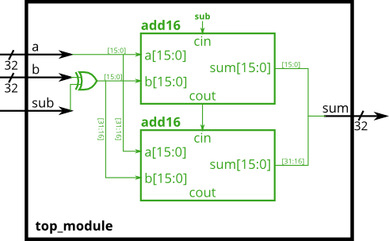

```verilog
//该模块利用两个add16写了一个加减法器.
module top_module(
    input [31:0] a,
    input [31:0] b,
	input sub,
    output [31:0] sum
);

	wire add1_cout;
	wire [15:0] add1_sum;
	wire [15:0] add2_sum;
	
	wire [31:0] b_comp = (sub==1'b0) ? b 
		: ~b+1;	//b的补码complement

	
	add16 add1(
		.a(a[15:0]),
		.b(b_comp[15:0]),
		.cin(1'b0),
		.cout(add1_cout),
		.sum(add1_sum)
	);
	
	add16 add2(
        .a(a[31:16]),
        .b(b_comp[31:16]),
		.cin(add1_cout),
		.cout(),	//ignore
		.sum(add2_sum)
	);
	assign sum = {add2_sum, add1_sum};
endmodule
```

## 2.4 Procedures (程序, 即always块, 包括always组合逻辑块和always时序逻辑快)


### 2.4.1 Always block (combinational) always组合逻辑块
Since digital circuits are composed of logic gates connected with wires, any circuit can be expressed as some combination of modules and assign statements. However, sometimes this is not the most convenient way to describe the circuit. Procedures (of which always blocks are one example) provide an alternative syntax for describing circuits.

For synthesizing hardware, two types of always blocks are relevant:

Combinational: always @(*)
Clocked: always @(posedge clk)
Combinational always blocks are equivalent to assign statements, thus there is always a way to express a combinational circuit both ways. The choice between which to use is mainly an issue of which syntax is more convenient. The syntax for code inside a procedural block is different from code that is outside. Procedural blocks have a richer set of statements (e.g., if-then, case), cannot contain continuous assignments*, but also introduces many new non-intuitive ways of making errors. (*Procedural continuous assignments do exist, but are somewhat different from continuous assignments, and are not synthesizable.)

For example, the assign and combinational always block describe the same circuit. Both create the same blob of combinational logic. Both will recompute the output whenever any of the inputs (right side) changes value. 
assign out1 = a & b | c ^ d;
always @(*) out2 = a & b | c ^ d;
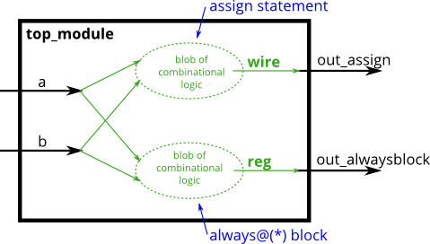
For combinational always blocks, always use a sensitivity list of (*). Explicitly listing out the signals is error-prone (if you miss one), and is ignored for hardware synthesis. If you explicitly specify the sensitivity list and miss a signal, the synthesized hardware will still behave as though (*) was specified, but the simulation will not and not match the hardware's behaviour. (In SystemVerilog, use always_comb.)
对于组合的always块，


始终使用敏感度列表 (*) 。明确列出信号很容易出错（如果您错过了一个），并且在硬件综合中会被忽略。如果您显式指定敏感度列表并错过信号，则合成硬件的行为仍会像 (*) 已指定，但模拟不会也不匹配硬件的行为。 （在 SystemVerilog 中，使用 always_comb .)

A note on wire vs. reg: The left-hand-side of an assign statement must be a net type (e.g., wire), while the left-hand-side of a procedural assignment (in an always block) must be a variable type (e.g., reg). These types (wire vs. reg) have nothing to do with what hardware is synthesized, and is just syntax left over from Verilog's use as a hardware simulation language.
关于wire 与reg 的注释：分配语句的左侧必须是网络类型（例如， wire ），而过程赋值的左侧（在always块中）必须是变量类型（例如， reg ）。这些类型（wire 与 reg）与合成的硬件无关，只是 Verilog 作为硬件模拟语言使用时遗留下来的语法。

A bit of practice 一点练习
Build an AND gate using both an assign statement and a combinational always block. (Since assign statements and combinational always blocks function identically, there is no way to enforce that you're using both methods. But you're here for practice, right?...)
使用分配语句和组合的always块构建AND门。 （由于赋值语句和组合总是块功能相同，因此无法强制您使用这两种方法。但是您来这里是为了练习，对吧？...）
```verilog
module top_module(
    input a, 
    input b,
    output wire out_assign,
    output reg out_alwaysblock
);
    assign out_assign = a&b;      
    always @(*) out_alwaysblock = a&b;


endmodule
```


### 2.4.2 Always block (clocked) always时序逻辑块
For hardware synthesis, there are two types of always blocks that are relevant:

Combinational: always @(*)
Clocked: always @(posedge clk)
Clocked always blocks create a blob of combinational logic just like combinational always blocks, but also creates a set of flip-flops (or "registers") at the output of the blob of combinational logic. Instead of the outputs of the blob of logic being visible immediately, the outputs are visible only immediately after the next (posedge clk).

Blocking vs. Non-Blocking Assignment
There are three types of assignments in Verilog:

Continuous assignments (assign x = y;). Can only be used when not inside a procedure ("always block").
Procedural blocking assignment: (x = y;). Can only be used inside a procedure.
Procedural non-blocking assignment: (x <= y;). Can only be used inside a procedure.
In a combinational always block, use blocking assignments. In a clocked always block, use non-blocking assignments. A full understanding of why is not particularly useful for hardware design and requires a good understanding of how Verilog simulators keep track of events. Not following this rule results in extremely hard to find errors that are both non-deterministic and differ between simulation and synthesized hardware.

A bit of practice
Build an XOR gate three ways, using an assign statement, a combinational always block, and a clocked always block. Note that the clocked always block produces a different circuit from the other two: There is a flip-flop so the output is delayed.
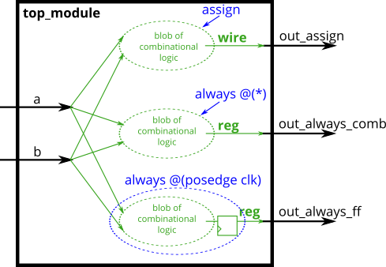
```verilog
module top_module(
    input clk,
    input a,
    input b,
    output wire out_assign,
    output reg out_always_comb,
    output reg out_always_ff   //为啥叫ff(触发器)? 事实上, 当我写一个个的always时序逻辑赋值时, 我将要在硬件里实现一个个触发器, 触发器本身就是完成非阻塞赋值嘛.
    );
    
    assign out_assign = a^b;
    always @(*) out_always_comb = a^b;
    always @(posedge clk) out_always_ff = a^b;  

endmodule
```


### 2.4.3 if
An if statement usually creates a 2-to-1 multiplexer, selecting one input if the condition is true, and the other input if the condition is false.


always @(*) begin
    if (condition) begin
        out = x;
    end
    else begin
        out = y;
    end
end
This is equivalent to using a continuous assignment with a conditional operator:

assign out = (condition) ? x : y;
However, the procedural if statement provides a new way to make mistakes. The circuit is combinational only if out is always assigned a value.

A bit of practice
Build a 2-to-1 mux that chooses between a and b. Choose b if both sel_b1 and sel_b2 are true. Otherwise, choose a. Do the same twice, once using assign statements and once using a procedural if statement.

sel_b1	sel_b2	out_assign
out_always
0	0	a
0	1	a
1	0	a
1	1	b

```verilog
// synthesis verilog_input_version verilog_2001
module top_module(
    input a,
    input b,
    input sel_b1,
    input sel_b2,
    output wire out_assign,
    output reg out_always   ); 
    
    assign out_assign = (sel_b1&sel_b2==1'b1) ? b
        : a;
    
    always @(*) begin
        if(sel_b1&sel_b2==1'b1) begin
            out_always=b;
        end
        else begin
            out_always=a;
        end
    end
endmodule

```


### 2.4.4 没有else的常见错误
A common source of errors: How to avoid making latches
常见的错误来源：如何避免制作锁存器
When designing circuits, you must think first in terms of circuits:
设计电路时，首先要从电路方面来思考：

I want this logic gate
我想要这个逻辑门
I want a combinational blob of logic that has these inputs and produces these outputs
我想要一个具有这些输入并产生这些输出的逻辑组合块
I want a combinational blob of logic followed by a set of flip-flops
我想要一个组合逻辑块，后面跟着一组触发器
What you must not do is write the code first, then hope it generates a proper circuit.
您不能先编写代码，然后希望它生成正确的电路。

If (cpu_overheated) then shut_off_computer = 1;
如果（cpu_overheated）则shut_off_computer = 1；
If (~arrived) then keep_driving = ~gas_tank_empty;
如果（~到达）则 keep_driven = ~gas_tank_empty;
Syntactically-correct code does not necessarily result in a reasonable circuit (combinational logic + flip-flops). The usual reason is: "What happens in the cases other than those you specified?". Verilog's answer is: Keep the outputs unchanged.
语法正确的代码不一定会产生合理的电路（组合逻辑+触发器）。通常的原因是：“除了您指定的情况之外，会发生什么情况？”。 Verilog 的答案是：保持输出不变。

This behaviour of "keep outputs unchanged" means the current state needs to be remembered, and thus produces a latch. Combinational logic (e.g., logic gates) cannot remember any state. Watch out for Warning (10240): ... inferring latch(es)" messages. Unless the latch was intentional, it almost always indicates a bug. Combinational circuits must have a value assigned to all outputs under all conditions. This usually means you always need else clauses or a default value assigned to the outputs.
这种“保持输出不变”的行为意味着需要记住当前状态，从而产生锁存器。组合逻辑（例如逻辑门）无法记住任何状态。留意 Warning (10240): ... inferring latch(es)" 消息。除非闩锁是故意的，否则它几乎总是表明存在错误。组合电路必须在所有条件下为所有输出分配一个值。这通常意味着您始终需要 else 子句或分配给输出的默认值。

Demonstration 示范
The following code contains incorrect behaviour that creates a latch. Fix the bugs so that you will shut off the computer only if it's really overheated, and stop driving if you've arrived at your destination or you need to refuel.
以下代码包含创建锁存器的不正确行为。修复错误，以便只有在计算机确实过热时才关闭计算机，并在到达目的地或需要加油时停止驾驶。


This is the circuit described by the code, not the circuit you want to build.
这是代码描述的电路，而不是您要构建的电路。
```
always @(*) begin
    if (cpu_overheated)
       shut_off_computer = 1;
end

always @(*) begin
    if (~arrived)
       keep_driving = ~gas_tank_empty;
end
```

```verilog
module top_module (
    input      cpu_overheated,
    output reg shut_off_computer,
    input      arrived,
    input      gas_tank_empty,
    output reg keep_driving  ); //

    always @(*) begin
        if (cpu_overheated) begin
           shut_off_computer = 1;
    	end
    	else begin
        	shut_off_computer = 0;
    	end  
    end
//如果没有else语句,导致当cpu_overheated为0时程序不知道做什么, shut_off_computer信号将申请latch.
    always @(*) begin
        if (~arrived) begin
           keep_driving = ~gas_tank_empty;
    	end else begin
           keep_driving = 0; 
        end
    end
endmodule
```


### 2.4.5 case块
Case statements in Verilog are nearly equivalent to a sequence of if-elseif-else that compares one expression to a list of others. Its syntax and functionality differs from the switch statement in C.

always @(*) begin     // This is a combinational circuit
    case (in)
      1'b1: begin 
               out = 1'b1;  // begin-end if >1 statement
            end
      1'b0: out = 1'b0;
      default: out = 1'bx;
    endcase
end
The case statement begins with case and each "case item" ends with a colon. There is no "switch".
Each case item can execute exactly one statement. This makes the "break" used in C unnecessary. But this means that if you need more than one statement, you must use begin ... end.
Duplicate (and partially overlapping) case items are permitted. The first one that matches is used. C does not allow duplicate case items.
A bit of practice
Case statements are more convenient than if statements if there are a large number of cases. So, in this exercise, create a 6-to-1 multiplexer. When sel is between 0 and 5, choose the corresponding data input. Otherwise, output 0. The data inputs and outputs are all 4 bits wide.

Be careful of inferring latches (See.always_if2)
```verilog
module top_module ( 
    input [2:0] sel, 
    input [3:0] data0,
    input [3:0] data1,
    input [3:0] data2,
    input [3:0] data3,
    input [3:0] data4,
    input [3:0] data5,
    output reg [3:0] out   );//

    always@(*) begin  // This is a combinational circuit
        case(sel)
            3'b0:out=data0;
            3'b1:out=data1;
            3'b10:out=data2;
            3'b11:out=data3;
            3'b100:out=data4;
            3'b101:out=data5;
            default:out=0;
        endcase
    end
endmodule
```


### 2.4.6 优先级编码
A priority encoder is a combinational circuit that, when given an input bit vector, outputs the position of the first 1 bit in the vector. For example, a 8-bit priority encoder given the input 8'b10010000 would output 3'd4, because bit[4] is first bit that is high.
优先级编码器是一个组合电路，当给定输入位向量时，它输出第一个的位置 1 向量中的位。例如，给定输入的 8 位优先级编码器 8'b10010000 会输出 3'd4 ，因为 bit[4] 是第一个高位。

Build a 4-bit priority encoder. For this problem, if none of the input bits are high (i.e., input is zero), output zero. Note that a 4-bit number has 16 possible combinations.
构建 4 位优先级编码器。对于这个问题，如果没有一个输入位为高（即输入为零），则输出为零。
```verilog
// synthesis verilog_input_version verilog_2001
module top_module (
    input [3:0] in,
    output reg [1:0] pos  );
    always @(*) begin
        if (in[0])   
            pos = 2'd0;
        else if (in[1])  
            pos = 2'd1;
        else if (in[2])  
            pos = 2'd2;
        else if (in[3])  
            pos = 2'd3;
        else
            pos = 2'd0;  
    end

endmodule
```


### 2.4.7 casez块
casez相比case的区别就是允许你用`z`进行通配符匹配, 可以匹配`0`,`1`,`z`,`?`(未定态和高阻态)

```verilog
// synthesis verilog_input_version verilog_2001
module top_module (
    input [7:0] in,
    output reg [2:0] pos );
    always @(*)begin
        casez(in)
            8'b zzzzzzz1:pos= 3'd0 ; 
            8'b zzzzzz1z:pos=  3'd1;
            8'b zzzzz1zz:pos=3'd2;
            8'b zzzz1zzz:pos=  3'd3;
            8'b zzz1zzzz:pos=  3'd4;
            8'b zz1zzzzz:pos=  3'd5;
            8'b z1zzzzzz:pos=  3'd6;
            8'b 1zzzzzzz:pos=  3'd7;
            default: pos=0;
        endcase
    end
endmodule
```

### 2.4.8 避免组合逻辑中出现latch
这需要留意给if或者case块的所有情况留出default. 一种方法是**先赋值再覆盖**.
Suppose you're building a circuit to process scancodes from a PS/2 keyboard for a game. Given the last two bytes of scancodes received, you need to indicate whether one of the arrow keys on the keyboard have been pressed. This involves a fairly simple mapping, which can be implemented as a case statement (or if-elseif) with four cases.

Scancode [15:0]	Arrow key
16'he06b	left arrow
16'he072	down arrow
16'he074	right arrow
16'he075	up arrow
Anything else	none
Your circuit has one 16-bit input, and four outputs. Build this circuit that recognizes these four scancodes and asserts the correct output.

To avoid creating latches, all outputs must be assigned a value in all possible conditions (See also always_if2). Simply having a default case is not enough. You must assign a value to all four outputs in all four cases and the default case. This can involve a lot of unnecessary typing. One easy way around this is to assign a "default value" to the outputs before the case statement:

always @(*) begin
    up = 1'b0; down = 1'b0; left = 1'b0; right = 1'b0;
    case (scancode)
        ... // Set to 1 as necessary.
    endcase
end
This style of code ensures the outputs are assigned a value (of 0) in all possible cases unless the case statement overrides the assignment. This also means that a default: case item becomes unnecessary.

Reminder: The logic synthesizer generates a combinational circuit that behaves equivalently to what the code describes. Hardware does not "execute" the lines of code in sequence.
```verilog
// synthesis verilog_input_version verilog_2001
module top_module (
    input [15:0] scancode,
    output reg left,
    output reg down,
    output reg right,
    output reg up  ); 

    always @(*) begin
        left = 0;
        down = 0;
        right = 0;
        up = 0;
        case(scancode)
            16'he06b	:left = 1;
			16'he072	:down = 1;
			16'he074	:right = 1;
			16'he075	:up = 1;
        endcase
    end    
endmodule
```

## 2.5 more features

### 2.5.1 conditional 条件运算符
Verilog has a ternary conditional operator ( ? : ) much like C:
Verilog 有一个三元条件运算符 (?:)，很像 C：

(condition ? if_true : if_false)

This can be used to choose one of two values based on condition (a mux!) on one line, without using an if-then inside a combinational always block.
这可用于根据一行上的条件（多路复用器！）选择两个值之一，而无需在组合的always块内使用if-then。

Examples:  例子：

(0 ? 3 : 5)     // This is 5 because the condition is false.
(sel ? b : a)   // A 2-to-1 multiplexer between a and b selected by sel.

always @(posedge clk)         // A T-flip-flop.
  q <= toggle ? ~q : q;

always @(*)                   // State transition logic for a one-input FSM
  case (state)
    A: next = w ? B : A;
    B: next = w ? A : B;
  endcase

assign out = ena ? q : 1'bz;  // A tri-state buffer

((sel[1:0] == 2'h0) ? a :     // A 3-to-1 mux
 (sel[1:0] == 2'h1) ? b :
                      c )
A Bit of Practice 一点练习
Given four unsigned numbers, find the minimum. Unsigned numbers can be compared with standard comparison operators (a < b). Use the conditional operator to make two-way min circuits, then compose a few of them to create a 4-way min circuit. You'll probably want some wire vectors for the intermediate results.
给定四个无符号数，求最小值。无符号数可以与标准比较运算符 (a < b) 进行比较。使用条件运算符创建两路最小电路，然后组合其中的一些电路以创建四路最小电路。您可能需要一些线向量作为中间结果。

Expected solution length: Around 5 lines.
预期解决方案长度：大约 5 行。
```verilog
module top_module (
    input [7:0] a, b, c, d,
    output [7:0] min);//
    // assign intermediate_result1 = compare? true: false;
    wire [7:0]min1 = (a<b)? a :b;
    wire [7:0]min2 = (c<d)? c :d;
    assign min = (min1<min2)? min1:min2;
endmodule
```

### 2.5.2 reduction 归约运算符
You're already familiar with bitwise operations between two values, e.g., a & b or a ^ b. Sometimes, you want to create a wide gate that operates on all of the bits of one vector, like (a[0] & a[1] & a[2] & a[3] ... ), which gets tedious if the vector is long.
您已经熟悉两个值之间的按位运算，例如， a & b 或者 a ^ b 。有时，您想要创建一个对一个向量的所有位进行操作的宽门，例如 (a[0] & a[1] & a[2] & a[3] ... ) ，如果向量很长，这会变得乏味。

The reduction operators can do AND, OR, and XOR of the bits of a vector, producing one bit of output:
归约运算符可以对向量的位进行 AND、OR 和 XOR，产生一位输出：

& a[3:0]     // AND: a[3]&a[2]&a[1]&a[0]. Equivalent to (a[3:0] == 4'hf)
| b[3:0]     // OR:  b[3]|b[2]|b[1]|b[0]. Equivalent to (b[3:0] != 4'h0)
^ c[2:0]     // XOR: c[2]^c[1]^c[0]
These are unary operators that have only one operand (similar to the NOT operators ! and ~). You can also invert the outputs of these to create NAND, NOR, and XNOR gates, e.g., (~& d[7:0]).
这些是只有一个操作数的一元运算符（类似于 NOT 运算符 ! 和 ~）。您还可以反转它们的输出以创建 NAND、NOR 和 XNOR 门，例如， (~& d[7:0]) 。

Now you can revisit 4-input gates and 100-input gates.
现在您可以重新访问4 输入门和100 个输入门。

A Bit of Practice 一点练习
Parity checking is often used as a simple method of detecting errors when transmitting data through an imperfect channel. Create a circuit that will compute a parity bit for a 8-bit byte (which will add a 9th bit to the byte). We will use "even" parity, where the parity bit is just the XOR of all 8 data bits.
奇偶校验通常用作通过不完善的通道传输数据时检测错误的简单方法。创建一个电路来计算 8 位字节的奇偶校验位（这将向该字节添加第 9 位）。我们将使用“偶”奇偶校验，其中奇偶校验位只是所有 8 个数据位的 XOR。

Expected solution length: Around 1 line.
预期解决方案长度：大约 1 行。
```verilog
module top_module (
    input [7:0] in,
    output parity); 
    assign parity=^in;
endmodule
```

### 2.5.3 reduction2


Build a combinational circuit with 100 inputs, in[99:0].
构建一个具有 100 个输入的组合电路， in[99:0] 。

There are 3 outputs:  有3个输出：

out_and: output of a 100-input AND gate.
out_and：100 个输入与门的输出。
out_or: output of a 100-input OR gate.
out_or：100 个输入或门的输出。
out_xor: output of a 100-input XOR gate.
out_xor：100 输入异或门的输出。
```verilog
module top_module( 
    input [99:0] in,
    output out_and,
    output out_or,
    output out_xor 
);
    assign out_and = &in;
    assign out_or = |in;
    assign out_xor = ^in;
endmodule

```

### 2.5.4 reverse vector(组合逻辑循环1)
Given a 100-bit input vector [99:0], reverse its bit ordering.

Module Declaration
module top_module( 
    input [99:0] in,
    output [99:0] out
);
Hint...
A for loop (in a combinational always block or generate block) would be useful here. I would prefer a combinational always block in this case because module instantiations (which require generate blocks) aren't needed.


```verilog
module top_module( 
    input [99:0] in,
    output [99:0] out
);
    integer i;
    always @(*) begin
        for(i=0;i<100;i++)begin
            out[i]=in[99-i];
        end
    end
endmodule
```


### 2.5.5 popular counter(组合逻辑循环2)

```verilog
//法一: 使用reg类型的out, 配合always块中的for循环.
module top_module( 
    input [254:0] in,
    output reg [7:0] out
);
    always @(*) begin
        out = 8'd0; // 初始化 out. 这一步不可省略...不然波形图里整个out会变成未定义
        for (int i = 0; i < 255; i = i + 1) begin
            out = out + in[i]; // 累加
        end
    end
endmodule
```

```verilog
//错误: 使用wire类型的out, 利用always块中的for进行assign. 这会导致同时有多个信号试图改变wire类型变量out, 引发多驱动错误.
module top_module( 
    input [254:0] in,
    output [7:0] out
);
    always @(*)begin
        assign out=out+in[i];//错误: Error (10028): Can't resolve multiple constant drivers for net "out[7]" at top_module.v(7) File: 
    end
endmodule
```

```verilog
//如果支持systemverilog, 可以直接使用内置函数`$countones`.
module top_module( 
    input [254:0] in,
    output [7:0] out
);
    assign out = $countones(in);
endmodule
```

### 2.5.6 先构造一个一位全加器, 然后用generate块实例化一百个并拼接为一个一百位全加器. 为了证明你真的实例化了一百个全加器, 要求输出每个全加器的cout.
```verilog
module top_module( 
    input [99:0] a, b,
    input cin,
    output [99:0] cout,
    output [99:0] sum 
);

    generate
        genvar i;
        for(i=0;i<100;i++)begin:adders
            if (i==0) begin
                adder my_first_adder(
                    .a(a[0]),
                    .b(b[0]),
                    .sum(sum[0]),
                    .cin(cin),
                    .cout(cout[0])
                );
            end else begin
                adder my_adder(
                    .a(a[i]),
                    .b(b[i]),
                    .sum(sum[i]),
                    .cin(cout[i-1]),
                    .cout(cout[i])
                );
            end
        end
    endgenerate
endmodule

module adder(
    input a,
    input b,
    input cin,
    output sum,
    output cout
);
    //偷懒的写法:assign {cout,sum} = a+b+cin;

    //正宗的全加器写法: (你是电路工程师不是程序员!不许用`+`了!)
    assign sum=a^b^cin; //异或逻辑. `a^b^cin`即按位异或, 意味着要求当且仅当有`奇数`个`1`异或时输出`1`.
    assgin cout=(a&b)|(cin&(a^b)); //要想有进位, 要麽a和b都为1(a&b), 要麽必须a,b其中一个为1且cin为1.    
endmodule
```

### 2.5.7 bcd add 100
You are provided with a BCD one-digit adder named bcd_fadd that adds two BCD digits and carry-in, and produces a sum and carry-out.

module bcd_fadd (
    input [3:0] a,
    input [3:0] b,
    input     cin,
    output   cout,
    output [3:0] sum );
Instantiate 100 copies of bcd_fadd to create a 100-digit BCD ripple-carry adder. Your adder should add two 100-digit BCD numbers (packed into 400-bit vectors) and a carry-in to produce a 100-digit sum and carry out.

BCD编码列表:
十进制:   0    1    2    3    4   5    6    7    8    9
BCD:   0000 0001 0010 0011 0100 0101 0110 0111 1000 1001

```verilog
module top_module( 
    input [399:0] a, b,
    input cin,
    output cout,
    output [399:0] sum 
);
    
    wire [100:0] carry;//记录中间100个加法器的101个进位信息(第编号i个加法器给第i+i个的进位)

    assign carry[0]=cin;
    assign cout=carry[100];
    
    generate
        genvar i;
        for(i=0;i<100;i++)begin:adders
            bcdadd(
                .a(a[4*i+3:4*i]),
                .b(b[4*i+3:4*i]),
                .sum(sum[4*i+3:4*i]),
                .cout(carry[i+1]),
                .cin(carry[i])
            );
        end
    endgenerate
endmodule

module bcdadd(
    input [3:0]a,
    input [3:0]b,
    input cin,
    output cout,
    output [3:0]sum
);
    wire [4:0] temp_sum;	//储存带进位的加法
    assign temp_sum=a+b+cin;
    
    assign cout=(temp_sum>4'b1001)?1	//进位判断, 当大于10时进位.
        :0;
  
    assign sum=(cout)?(temp_sum-4'b1010)	//根据进位调整加法输出
        :temp_sum; 
endmodule
```


# 3 circuits 电路

## 3.1 combinational logiv 组合逻辑电路

  ### 3.1.1 basic gates

   #### 3.1.1.14 thermo stat
A heating/cooling thermostat controls both a heater (during winter) and an air conditioner (during summer). Implement a circuit that will turn on and off the heater, air conditioning, and blower fan as appropriate.
加热/冷却恒温器控制加热器（冬季）和空调（夏季）。实施一个电路，根据情况打开和关闭加热器、空调和鼓风机。

The thermostat can be in one of two modes: heating (mode = 1) and cooling (mode = 0). In heating mode, turn the heater on when it is too cold (too_cold = 1) but do not use the air conditioner. In cooling mode, turn the air conditioner on when it is too hot (too_hot = 1), but do not turn on the heater. When the heater or air conditioner are on, also turn on the fan to circulate the air. In addition, the user can also request the fan to turn on (fan_on = 1), even if the heater and air conditioner are off.
恒温器可以处于两种模式之一：加热（ mode = 1 ）和冷却（ mode = 0 ）。在制热模式下，当天气太冷（ too_cold = 1 ）时打开加热器，但不要使用空调。制冷模式下，太热时（ too_hot = 1 ）打开空调，但不要打开暖气。当暖气或空调打开时，还要打开风扇使空气流通。此外，即使加热器和空调关闭，用户也可以请求打开风扇（ fan_on = 1 ）。

Try to use only assign statements, to see whether you can translate a problem description into a collection of logic gates.
尝试仅使用assign语句，看看是否可以将问题描述转换为逻辑门的集合。


Expected solution length: Around 3 lines.
预期解决方案长度：大约 3 行。
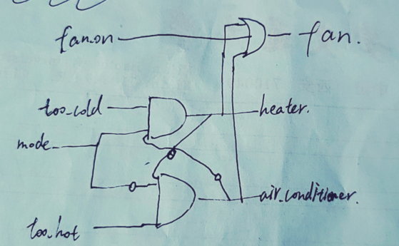
```verilog
module top_module (
    input too_cold,
    input too_hot,
    input mode,
    input fan_on,
    output heater,
    output aircon,
    output fan
); 
    assign heater = too_cold&mode&(~aircon);
    assign aircon = too_hot&(~mode)&(~heater);
    assign fan = fan_on|heater|aircon;

endmodule
```

   #### 3.1.1.16 gates and vectors
You are given a four-bit input vector in[3:0]. We want to know some relationships between each bit and its neighbour:

out_both: Each bit of this output vector should indicate whether both the corresponding input bit and its neighbour to the left (higher index) are '1'. For example, out_both[2] should indicate if in[2] and in[3] are both 1. Since in[3] has no neighbour to the left, the answer is obvious so we don't need to know out_both[3].
out_any: Each bit of this output vector should indicate whether any of the corresponding input bit and its neighbour to the right are '1'. For example, out_any[2] should indicate if either in[2] or in[1] are 1. Since in[0] has no neighbour to the right, the answer is obvious so we don't need to know out_any[0].
out_different: Each bit of this output vector should indicate whether the corresponding input bit is different from its neighbour to the left. For example, out_different[2] should indicate if in[2] is different from in[3]. For this part, treat the vector as wrapping around, so in[3]'s neighbour to the left is in[0].

```verilog
// 我的笨方法: always块内for遍历.
module top_module( 
    input [3:0] in,
    output [2:0] out_both,
    output [3:1] out_any,
    output [3:0] out_different );
    
    always @(*)begin
        for(int i=0;i<4;i++)begin
            
            if(i!=3)begin
            out_both[i]=in[i]&in[i+1];
            end
            
            if(i!=0)begin
            	out_any[i]=in[i]|in[i-1];
            end
            
            out_different[i]=(i!=3)?in[i]^in[i+1]:in[3]^in[0];
        end
    end
```

```verilog
//参考答案的牛逼写法. 用优美的向量运算.
module top_module (
	input [3:0] in,
	output [2:0] out_both,
	output [3:1] out_any,
	output [3:0] out_different
);

	// Use bitwise operators and part-select to do the entire calculation in one line of code
	// in[3:1] is this vector:   					 in[3]  in[2]  in[1]
	// in[2:0] is this vector:   					 in[2]  in[1]  in[0]
	// Bitwise-OR produces a 3 bit vector.			   |      |      |
	// Assign this 3-bit result to out_any[3:1]:	o_a[3] o_a[2] o_a[1]

	// Thus, each output bit is the OR of the input bit and its neighbour to the right:
	// e.g., out_any[1] = in[1] | in[0];	
	// Notice how this works even for long vectors.
	assign out_any = in[3:1] | in[2:0];

	assign out_both = in[2:0] & in[3:1];
	
	// XOR 'in' with a vector that is 'in' rotated to the right by 1 position: {in[0], in[3:1]}
	// The rotation is accomplished by using part selects[] and the concatenation operator{}.
	assign out_different = in ^ {in[0], in[3:1]};
	
endmodule
```


  ### 3.1.2 MULTIPLEXERS

   #### 3.1.2.5 256-to-1 4bit mux
请创建一个256选1, 四位多路复用器.

该module涉及到一个细节问题: 向量指标必须是constant(过程常量). 这是因为切片索引存在非常量时, verilog无法确定步长是一个常量(即使这在我们看来很显然...)
下面的写法是非法的:
```verilog
module top_module( 
    input [1023:0] in,
    input [7:0] sel,
    output [3:0] out ); 
    
    always @(*)begin
    	out = in[sel*4+3 : sel*4]; // error: `sel` is not a constant
    end   
endmodule
```
有两种方法实现切片:
方法1: `[<start> +: <步长>]`
```verilog
module top_module( 
    input [1023:0] in,
    input [7:0] sel,
    output [3:0] out ); 
    
    always @(*)begin
    	out = in[sel*4 +: 4]; // +:[步长]是verilog提供的动态切片语法, 表示in[sel*4 +3 : sel*4]
    end   
endmodule
```
方法2: 分别一个个操作切片的每个值...
```verilog
module top_module( 
    input [1023:0] in,
    input [7:0] sel,
    output [3:0] out ); 
    
    always @(*)begin
    	out[0]=in[4*i+3];
        out[1]=in[4*i+2];
        out[2]=in[4*i+1];
        out[3]=in[4*i];
    end   
endmodule
```
  ### 3.1.3 arithmetic

   #### 3.1.3.5 补码

Assume that you have two 8-bit 2's complement numbers, a[7:0] and b[7:0]. These numbers are added to produce s[7:0]. Also compute whether a (signed) overflow has occurred.

Module Declaration
module top_module (
    input [7:0] a,
    input [7:0] b,
    output [7:0] s,
    output overflow
); 
Hint...
A signed overflow occurs when adding two positive numbers produces a negative result, or adding two negative numbers produces a positive result. There are several methods to detect overflow: It could be computed by comparing the signs of the input and output numbers, or derived from the carry-out of bit n and n-1.
Write your solution here


```verilog
module top_module (
    input [7:0] a,
    input [7:0] b,
    output [7:0] s,
    output overflow
); //
 
    // assign s = ...
    // assign overflow = ...
    
    assign s=a+b;//补码可以直接+计算.
    assign overflow=(a[7]==b[7]&&s[7]!=a[7]);//只有最高位相同,且相加结果最高位变化才是溢出.
endmodule
```
  
  ### 3.1.4 kmap卡诺图

   #### 3.1.4.1 三变量卡诺图
Implement the circuit described by the Karnaugh map below.
实现下面卡诺图描述的电路。


Try to simplify the k-map before coding it. Try both product-of-sums and sum-of-products forms. We can't check whether you have the optimal simplification of the k-map. But we can check if your reduction is equivalent, and we can check whether you can translate a k-map into a circuit.
在编码之前尝试简化 k-map。尝试求和乘积和乘积求和形式。我们无法检查您是否拥有 k-map 的最佳简化。但我们可以检查您的简化是否等效，并且我们可以检查您是否可以将 k-map 转换为电路。
```verilog
//可以得到该卡诺图为Y=a+~ab+~a~bc.
module top_module(
    input a,
    input b,
    input c,
    output out  ); 
    assign out = a | (~a)&b | (~a)&(~b)&c;
endmodule
```

   #### 3.1.4.2 4变量卡诺图
Implement the circuit described by the Karnaugh map below.
实现下面卡诺图描述的电路。

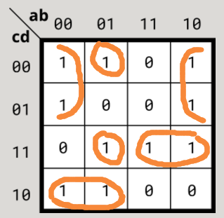

```verilog
//可以得到该卡诺图为Y = ~b&~c | ~a&b&~c&~d |~a&b&c&d | a&c&d | ~a&c&~d
module top_module(
    input a,
    input b,
    input c,
    output out  ); 
    assign out = ~b&~c | ~a&b&~c&~d |~a&b&c&d | a&c&d | ~a&c&~d;
endmodule
```

## 3.2 sequential logic 时序逻辑电路

  ### 3.2.1 latches and flip-flop 锁存器和触发器

   #### 3.2.1.1 DFF D触发器
AD flip-flop is a circuit that stores a bit and is updated periodically, at the (usually) positive edge of a clock signal.

AD 触发器是一种存储位并在时钟信号（通常）正边沿定期更新的电路。

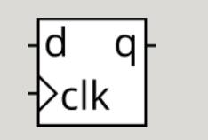

D flip-flops are created by the logic synthesizer when a clocked always block is used (See alwaysblock2). A D flip-flop is the simplest form of "blob of combinational logic followed by a flip-flop" where the combinational logic portion is just a wire.
当使用时钟always块时，D触发器由**逻辑合成器**创建（参见alwaysblock2 ）。 D触发器是“组合逻辑块后面跟着一个触发器”的最简单形式，其中组合逻辑部分只是一条电线。

Create a single D flip-flop.
创建单个 D 触发器。

```verilog
module top_module (
    input clk,
    input reset,            // Synchronous reset
    input [7:0] d,
    output reg [7:0] q
);
    always @(posedge clk or posedge reset)begin //此处为异步复位(reset高电平的同周期瞬间复位). 如果括号内去掉`or posedge reset`, 则为同步复位(synchronous reset)(reset高电平后, 在下个周期才复位.)
        if(reset)begin
            q <= 0;
        end else begin
       		q <= d; 
        end
    end

endmodule
```

   #### 3.2.1.2 DFF with byte enable 带使能开关的D触发器
Create 16 D flip-flops. It's sometimes useful to only modify parts of a group of flip-flops. The byte-enable inputs control whether each byte of the 16 registers should be written to on that cycle. byteena[1] controls the upper byte d[15:8], while byteena[0] controls the lower byte d[7:0].
创建 16 个 D 触发器。有时只修改一组触发器的一部分是有用的。字节使能输入控制是否应在该周期写入 16 个寄存器的每个字节。 byteena[1] 控制高字节 d[15:8] ， 尽管 byteena[0] 控制低字节 d[7:0] 。

resetn is a synchronous, active-low reset.
resetn 是同步、低电平有效复位。

All DFFs should be triggered by the positive edge of clk.
所有 DFF 应由上升沿触发 clk 。
```verilog
module top_module (
    input clk,
    input resetn,
    input [1:0] byteena,
    input [15:0] d,
    output reg [15:0] q
);
    
    always @(posedge clk)begin
        if(!resetn)begin
        	q<=0;
        end else begin
            for(int i=0;i<2;i++)begin
                q[8*i +: 8]<=(byteena[i]) ? d[8*i +: 8] : q[8*i +: 8];
            end
        end       
    end

endmodule
``` 

   #### 3.2.1.3 D latch D锁存器
Implement the following circuit:

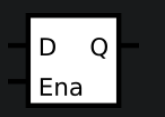

*Note that this is a latch, so a Quartus warning about having inferred a latch is expected.*


Hint...

Latches are level-sensitive (not edge-sensitive) circuits, so in an always block, they use level-sensitive sensitivity lists.
* 锁存器是电平敏感的电路（而非边沿敏感）：
  * 电平敏感（level-sensitive）意味着锁存器根据控制信号（如 enable 或 clk）的电平状态工作，而不是对信号的边沿（如上升沿或下降沿）作出响应。
  * 当控制信号为某个激活状态（例如高电平），锁存器的输出会随输入实时更新。
  * 相反，边沿敏感（edge-sensitive）的电路（如触发器）只在控制信号发生边沿跳变时（如从 0→1 或 1→0）更新输出。


However, they are still sequential elements, so should use non-blocking assignments.
* 锁存器仍然是时序逻辑元件，因此应使用非阻塞赋值（<=）：
  * 锁存器是一种 时序逻辑元件（sequential element），它可以存储状态，而不是简单地输出逻辑函数（组合逻辑）。
  * 在时序电路设计中，为了避免竞争条件（race condition）和确保数据更新的正确性，非阻塞赋值 (<=) 是推荐使用的赋值方式。
  * 非阻塞赋值会等到所有的逻辑运算都完成后，才在时钟周期结束时更新信号值。

A D-latch acts like a wire (or non-inverting buffer) when enabled, and preserves the current value when disabled.
* D 锁存器在使能时像一根导线（或非反相缓冲器）：

  * 当锁存器的 enable 信号为高时，输出 Q 会直接跟随输入 D。这就好像 Q 是 D 直接通过一根导线或一个非反相缓冲器连接到一起，毫无延迟。


```verilog
module top_module (
    input d, 
    input ena,
    output q);
    always @(*)begin
        if(ena)begin
            q<=d;
        end
    end
endmodule
```

   #### 3.2.1.13 dffs and gates
   Given the **finite state machine** circuit as shown, assume that the D flip-flops are initially reset to zero before the machine begins.

Build this circuit.
   ```verilog
   module top_module (
    input clk,
    input x,
    output z
); 
    wire d1,d2,d3;
    reg q1,q2,q3;
    assign d1= x^q1;
    assign d2= x&~q2;
    assign d3= x|~q3;
    assign z= ~(q1|q2|q3);
    dff dff1(
        .clk(clk),
        .d(d1),
        .q(q1)
    );
        dff dff2(
        .clk(clk),
        .d(d2),
        .q(q2)
    );
        dff dff3(
        .clk(clk),
        .d(d3),
        .q(q3)
    );
endmodule

module dff(
	input clk,d,
    output q
);
    always @(posedge clk)begin
       q<=d; 
    end
endmodule
   ```

   #### 3.2.1.14 JK flip flop JK触发器

```verilog
module top_module (
    input clk,
    input j,
    input k,
    output Q);
    
    always @(posedge clk or posedge reset)begin
        if(reset)begin
         	q<=0;
        end else begin
            case({j,k})
                2'b00:Q<=Q;
                2'b01:Q<=0;
                2'b10:Q<=1;
                2'b11:Q<=~Q;	//j=1,k=1时复位, 这实际上就是一次同步复位. 直接输入的reset则提供异步复位功能.
            endcase
        end
    end
endmodule
```

   #### 3.2.1.15 边缘检测
For each bit in an 8-bit vector, detect when the input signal changes from 0 in one clock cycle to 1 the next (similar to positive edge detection). The output bit should be set the cycle after a 0 to 1 transition occurs.

Here are some examples. For clarity, in[1] and pedge[1] are shown separately.
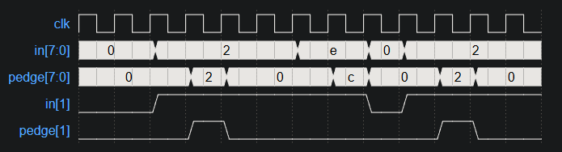


注意上图给出的波形图中, 要求output延后一个周期. 而网站题目判定却是要求output同周期.
先给出同周期的代码和modelsim仿真波形:
```verilog
module edge_detect (
    input clk,
    input in,
    output reg pedge
);
    reg [7:0] prev_in;//存储之前的in状态.对每一位有 pedge=(prev_in==0&in==1) , 这等价于pedge=~prev_in*in 

    //notice: 非阻塞赋值语句是parallel的. 顺序无关紧要.
    always @(posedge clk)begin
        pedge <= ~prev_in & in; // 检测从 0 -> 1 的跳变
        prev_in <= in;         // 更新前一周期输入状态
    end

endmodule

// Testbench 模块
module tb_edge_detect();
    reg clk;          // 生成时钟
    reg in;      
    wire pedge;     
    	
    // 实例化被测试模块
    edge_detect uut (
        .clk(clk),
        .in(in),
        .pedge(pedge)
    );
    
    // 生成时钟信号，每 5ns 翻转一次（10ns周期 -> 100MHz时钟）
    initial begin
        clk = 0;
        forever #5 clk = ~clk;
    end
    
    // 生成测试信号 
    initial begin
        // 初始化
        in = 0; 

        #25 in = 1; 
               
        // 等待几个时钟周期观察波形
        #50;
        
        // 结束仿真
        $stop;
    end
endmodule
```
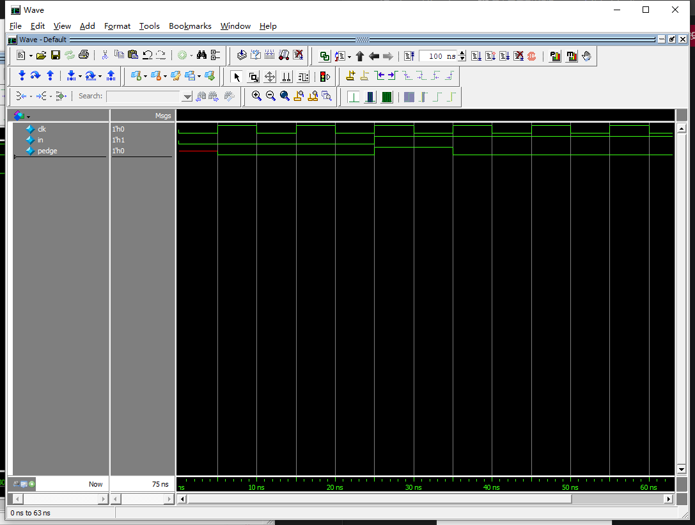

然后给出延后一周期的代码(对上述代码进行打拍即可)和波形图.
```verilog
//在edge_detect的基础上对输出打一拍. 对比两个项目的波形图可以看出， 打拍导致output信号延后了一个周期。
//打拍操作很简单.只需要让原变量在always块中进行var_delay<=var;就可以了.
//原理也很简单:在第i次时钟周期上沿时, 开始执行[active event], 包括`var_delay记录此时的var值`, 即`非阻塞赋值的右值读取`. 这件事之后, 才进行各种左值更新, 从而实现var_delay读取到的是var上个周期的值.
//注意打拍的时候不要对var进行阻塞赋值. 因为`阻塞赋值`和`非阻塞赋值的右值读取`都是[活动事件], 但是`阻塞赋值`拥有更高的优先级!
module edge_detect_delay (
    input clk,
    input in,
    output reg pedge
);
    reg prev_in;//存储之前的in状态.有 pedge=(prev_in==0&in==1) , 这等价于pedge=~prev_in*in 

	reg pedge_tmp;//中间变量, 其值和in同步变化, 用来打拍.
	
    //notice: 非阻塞赋值语句是parallel的. 顺序无关紧要.
    always @(posedge clk)begin
        pedge_tmp <= ~prev_in & in; // 检测从 0 -> 1 的跳变
        prev_in <= in;         // 更新前一周期输入状态
		
		//进行一次打拍.
		pedge<=pedge_tmp;
    end

endmodule

// Testbench 模块(未修改激励)
module tb_edge_detect_delay();
    reg clk;          // 生成时钟
    reg in;      
    wire pedge;     
    	
    // 实例化被测试模块
    edge_detect_delay uut (
        .clk(clk),
        .in(in),
        .pedge(pedge)
    );
    
    // 生成时钟信号，每 5ns 翻转一次（10ns周期 -> 100MHz时钟）
    initial begin
        clk = 0;
        forever #5 clk = ~clk;
    end
    
    // 生成测试信号 
    initial begin
        // 初始化
        in = 0; 

        #25 in = 1; 
               
        // 等待几个时钟周期观察波形
        #50;
        
        // 结束仿真
        $stop;
    end
endmodule
```
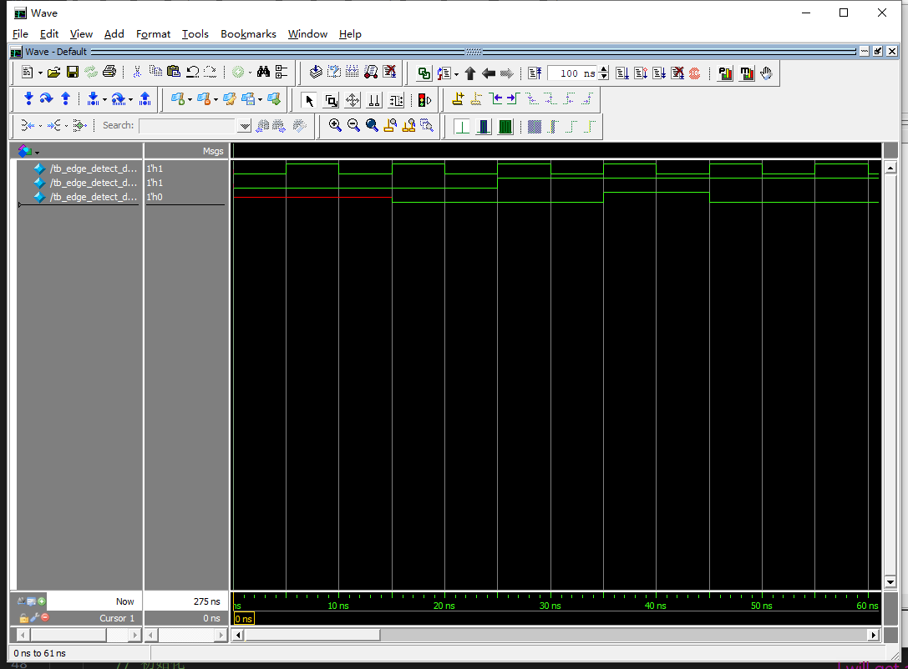


   #### 3.2.1.16 双边检测
For each bit in an 8-bit vector, detect when the input signal changes from one clock cycle to the next (detect any edge). The output bit should be set the cycle after a 0 to 1 transition occurs.

Here are some examples. For clarity, in[1] and anyedge[1] are shown separately
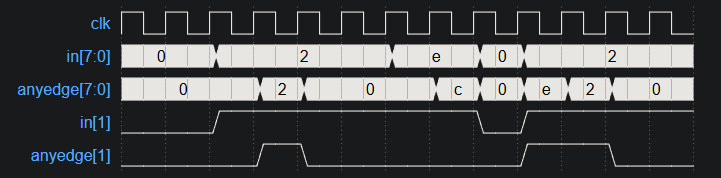
注意提供的波形图里, 激励信号是在上升沿后"隔了一小段时间"才变化, 这其实是在表达激励信号使用非阻塞赋值,也就是说prev_in<=in的操作就可以进行一次打拍, 而不是需要再来一次perv2<=prev_in.如果你自己写tb仿真, tb把in进行阻塞赋值, 那麽第一次打拍得到的prev_in是和in同步的, 必须再打拍一次哦.
```verilog
module top_module (
    input wire [7:0] in,
    input clk,
    output reg [7:0] anyedge
);
    reg [7:0] prev_in;
    
    always @(posedge clk) begin  
        prev_in<=in;            //即打拍. prev_in信号是in的往前平移一个周期, 如果in没有阻塞赋值的话.
        anyedge <= in^prev_in;  //双边检测.
    end
endmodule
```
 
   #### 3.2.1.17 边缘捕获(SR触发器)
For each bit in a 32-bit vector, capture when the input signal changes from 1 in one clock cycle to 0 the next. "Capture" means that the output will remain 1 until the register is reset (synchronous reset).

Each output bit behaves like a SR flip-flop: The output bit should be set (to 1) the cycle after a 1 to 0 transition occurs. The output bit should be reset (to 0) at the positive clock edge when reset is high. If both of the above events occur at the same time, reset has precedence. In the last 4 cycles of the example waveform below, the 'reset' event occurs one cycle earlier than the 'set' event, so there is no conflict here.

In the example waveform below, reset, in[1] and out[1] are shown again separately for clarity.
其实每一位的逻辑就是一个set-reset触发器(真值表为:R为1则重置; 否则, S=1则输出1), 本题对应R即reset, S即(prev_in[i] & ~in[i]).
```verilog
module sr_ff(
    input clk,S,R,
    output reg Q
);
    always @(posedge clk) begin
        if(R)    //reset操作
            Q<=0;
        else if(S)//set操作
            Q<=1;
    end
endmodule
```

本题代码:
```verilog
module top_module (
   input clk,         // 时钟信号
    input reset,       // 同步复位信号
    input [31:0] in,   // 32 位输入信号
    output reg [31:0] out // 32 位输出信号
);

    reg [31:0] prev_in;  // 32 位寄存器，用来保存上一个时钟周期的输入信号

    always @(posedge clk) begin
        if (reset) begin
            // 同步复位，所有输出都被置为 0
            out <= 32'b0;
        end 
        else begin
            // 捕捉 1 到 0 的变化
            for(int i=0;i<32;i++)begin:whatever
                    if(prev_in[i] & ~in[i])begin
                        out[i] <= 1; // 捕捉 1 到 0 的变化，`prev_in & ~in` 检测变化
                    end
                end

            end
            // 更新 prev_in 为当前输入
            prev_in <= in;       
    end
endmodule
```
* 注意: 本题使用always内的for循环实现重复的代码. (这需要System_Verilog支持)注意generate块不能用在always块里哦. 而且如果你想用一个generate块生成32个always块,每个块里放一个赋值, 会报错(竞态条件), 我暂时不知道为何会这样. 还是最好把东西都写道一个always块里吧? 

    #### 3.2.1.18 双边D触发器
You're familiar with flip-flops that are triggered on the positive edge of the clock, or negative edge of the clock. A dual-edge triggered flip-flop is triggered on both edges of the clock. However, FPGAs don't have dual-edge triggered flip-flops, and always @(posedge clk or negedge clk) is not accepted as a legal sensitivity list. 会报错:
`Error (10239): Verilog HDL Always Construct error at top_module.v(6): event control cannot test for both positive and negative edges of variable "clk" File: /home/h/work/hdlbits.1233204/top_module.v Line: 6`
您熟悉在时钟的正边沿或负边沿触发的触发器。双边沿触发触发器在时钟的两个边沿上触发。然而，FPGA 没有双边沿触发触发器，并且 always @(posedge clk or negedge clk) 不被接受为合法的敏感列表。

Build a circuit that functionally behaves like a dual-edge triggered flip-flop:
构建一个在功能上类似于双边沿触发触发器的电路：    
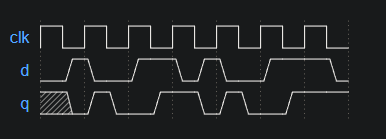

(Note: It's not necessarily perfectly equivalent: The output of flip-flops have no glitches, but a larger combinational circuit that emulates this behaviour might. But we'll ignore this detail here.)
（注意：这不一定完全等效：触发器的输出没有毛刺，但模拟这种行为的更大组合电路可能会出现毛刺。但我们在这里忽略这个细节。）

```verilog
//直接@(posedge clk or negdege clk)是不被允许的:error:不允许同时使用上升沿和下降沿. 我也不知道为何.
//直接两个always块分别在posedge和negedge驱动q也是不允许的:error:多个源激励同一个信号.
module top_module (
    input clk,
    input d,
    output q
);
    reg q1, q2;

    //实现一个上沿触发器
    always @ (posedge clk)
        begin
            q1 <= d;
        end

    //实现一个下沿触发器
    always @ (negedge clk)
        begin
           q2 <= d; 
        end

    //让两个触发器组合逻辑得到q
    assign q = clk?q1:q2;
endmodule
```

另一个思路是直接always@(clk), 但是可能出现意想不到的问题, 待研究. 总之最好不要这样写, 时序逻辑的敏感信号必须加上posedge或者negedge不然可能会被综合为组合电路.

这样写问题很大. 在vivado里(默认的综合简化选项), 代码
```verilog
always@(clk)begin
    a<=b;
end
```
综合出的硬件就是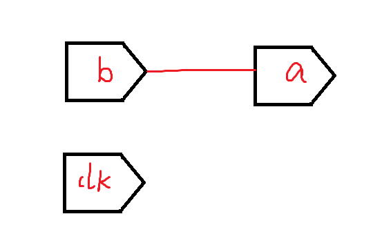
等价于代码`a=b;`  忽略了always和clk了.
有可能调整为更严格的综合简化设置后会解决, 总之暂时最好不要这样写.


  ### 3.2.2 计数器

   #### 3.2.2.1 16周期计数器
Build a 4-bit binary counter that counts from 0 through 15, inclusive, with a period of 16. The reset input is synchronous, and should reset the counter to 0.
构建一个 4 位二进制计数器，从 0 到 15（含）计数，周期为 16。复位输入是同步的，应将计数器复位为 0。
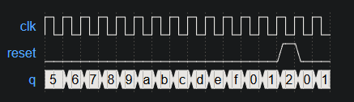
```verilog
module top_module(
	input clk,
	input reset,
	output reg [3:0] q);
	
	always @(posedge clk)
		if (reset)
			q <= 0;
		else
			q <= q+1;		// Because q is 4 bits, it rolls over from 15 -> 0.
		// If you want a counter that counts a range different from 0 to (2^n)-1, 
		// then you need to add another rule to reset q to 0 when roll-over should occur.
	
endmodule
```

   #### 3.2.2.2 10周期计数器
```verilog
module top_module(
	input clk,
	input reset,
	output reg [3:0] q);
	
	always @(posedge clk)
		if (reset || q == 9)	// Count to 10 requires rolling over 9->0 instead of the more natural 15->0
			q <= 0;
		else
			q <= q+1;
endmodule
```

   #### 3.2.2.3 10周期计数器,但是十进制(显示数字1~10)
```verilog
module top_module (
    input clk,
    input reset,
    output [3:0] q);
    always@(posedge clk)begin
        if(reset||q==4'd10)
            q<=4'd1;
        else
            q<=q+1;
    end
endmodule
```
   
   #### 3.2.2.4 十进制计数器0~9, 但是有播放/暂停按钮slowena
Build a decade counter that counts from 0 through 9, inclusive, with a period of 10. The reset input is synchronous, and should reset the counter to 0. We want to be able to pause the counter rather than always incrementing every clock cycle, so the slowena input indicates when the counter should increment.
(要求复位有比ena更大的优先级)
```verilog
module top_module (
    input clk,       // 时钟信号
    input reset,       // 同步复位信号
    input slowena,   // 计数使能信号
    output reg [3:0] q // 4位计数器输出，最大值为9
);
    // 每个时钟周期检查是否复位或递增
    always @(posedge clk) begin
        if (reset) 
            q <= 4'b0000; // 复位时将计数器清零
        else if (slowena) 
            if (q == 9)
                q <= 4'b0000; // 达到最大值9时，计数器归零
            else
                q <= q + 1; // 否则递增计数器
    end
endmodule
```
   
   #### 3.2.2.5 利用4bit计数器制作新的计数器
Design a 1-12 counter with the following inputs and outputs:

Reset Synchronous active-high reset that forces the counter to 1
Enable Set high for the counter to run
Clk Positive edge-triggered clock input
Q[3:0] The output of the counter
c_enable, c_load, c_d[3:0] Control signals going to the provided 4-bit counter, so correct operation can be verified.
You have the following components available:

the 4-bit binary counter (count4) below, which has Enable and synchronous parallel-load inputs (load has higher priority than enable). The count4 module is provided to you. Instantiate it in your circuit.
logic gates
module count4(
	input clk,
	input enable,
	input load,
	input [3:0] d,
	output reg [3:0] Q
);
The c_enable, c_load, and c_d outputs are the signals that go to the internal counter's enable, load, and d inputs, respectively. Their purpose is to allow these signals to be checked for correctness.

```verilog
module top_module (
    input clk,
    input reset,
    input enable,
    output reg [3:0] Q,
    output reg c_enable,
    output reg c_load,
    output reg [3:0] c_d
); 
//将输出端口定义为`reg`可以直接对输出赋值(否则不允许类似`out<=1`的行为)(无论out是wire还是reg, 都可以assign out=某信号), 但不是很推荐: 接口信号和内部逻辑信号混在一起，不利于模块化设计。
//更好的风格是用wire的输出端口, 如果需要对输出赋值, 声明一个out_reg, 对其赋值然后assign到out上.

    count4 my_count4 (
        .clk(clk),
        .enable(c_enable),
        .load(c_load),
        .d(c_d),
        .Q(Q)
        );

        //思路:需要通过控制 count4 的输入信号（如 load 和 d）来间接设置 Q 的值。
        //试图用reset直接驱动Q, 抑或是先声明一个Q_reg再assign Q=Q_reg是不被允许的, 因为这导致Q信号被多个激励驱动报错. 这个错误具体来说即:
        //Error (12014): Net "Q[3]", which fans out to "Q_reg", cannot be assigned more than one value.
        //抽象出来这个错误就是↓
        /*
        reg [3:0] Q_reg;
        wire [3:0] Q;

        assign Q = Q_reg; // Q 被 Q_reg 驱动
        assign Q = 4'b0011; // 再次试图驱动 Q（冲突）
        */
        //fan out就是一个模块的输出端能分叉去作为多少个模块的输入端. `assign Q=Q_reg;`意味着Q_reg(输入)驱动Q(输出).
        
    always @(posedge clk) begin
        if(reset|Q==4'd12)begin//[重置]
            c_d<=4'd1;//装填内容为0001
            c_load<=1;//装填使能开启
            c_enable<=0;//递增关闭
        end 
        else if(enable)begin//[正常计数]
            c_load<=0;//装填使能关闭
            c_enable<=1;//递增开启           
        end 
        else begin//[未启用计数]
            c_load<=0;//装填使能关闭
            c_enable<=0;//递增关闭  
        end
    end
    //观察上述always内的if分类, 可以得到[c_load, c_enable, c_d]和[enable, reset, Q==4'd12]的逻辑关系(真值表). 于是我们可以直接用组合电路解决:
    /*
    assign c_enable = ~(reset | 4'd12) & enable;
    assign c_load = reset | Q==4'd12;
    assign c_d = 4'd1;
    */
    //这样做会导致结果比always的方法提前一个周期.(毕竟always的方法属于对三个c_输出打拍了)
    //网站的答案可能有点问题, 我们只要保证Q是对的其实就行了, 网站对c_的判定其实是不合理的...
endmodule

/*
黑箱模块:
module count4(
	input clk,
	input enable,
	input load,
	input [3:0] d,
	output reg [3:0] Q
);
*/
```


   #### 3.2.2.6 时钟分频(利用计数器)
From a 1000 Hz clock, derive a 1 Hz signal, called OneHertz, that could be used to drive an Enable signal for a set of hour/minute/second counters to create a digital wall clock. Since we want the clock to count once per second, the OneHertz signal must be asserted for exactly one cycle each second. Build the frequency divider using modulo-10 (BCD) counters and as few other gates as possible. Also output the enable signals from each of the BCD counters you use (c_enable[0] for the fastest counter, c_enable[2] for the slowest).
从 1000 Hz 时钟得出一个 1 Hz 信号，称为OneHertz ，可用于驱动一组小时/分钟/秒计数器的启用信号，以创建数字挂钟。由于我们希望时钟每秒计数一次，因此必须每秒断言OneHertz信号恰好一个周期。使用模 10 (BCD) 计数器和尽可能少的其他门构建分频器。还从您使用的每个 BCD 计数器输出使能信号（c_enable[0] 表示最快的计数器，c_enable[2] 表示最慢的计数器）。

The following BCD counter is provided for you. Enable must be high for the counter to run. Reset is synchronous and set high to force the counter to zero. All counters in your circuit must directly use the same 1000 Hz signal.
下面为您提供了 BCD 计数器。使能必须为高电平才能使计数器运行。复位是同步的，设置为高电平可强制计数器归零。电路中的所有计数器必须直接使用相同的 1000 Hz 信号。

module bcdcount (
	input clk,
	input reset,
	input enable,
	output reg [3:0] Q
);

```verilog
//分频器: 将1000hz的信号分频为1hz的信号.(1hz脉冲信号) 利用提供的BCD计数器来实现.
module top_module (
    input clk,//1000hz的输入
    input reset,
    output OneHertz,//1hz的脉冲输出
    output [2:0] c_enable,//每个bcd实例的使能信号
    output reg clk_1hz//1hz的时钟输出
); //
    reg [3:0]Q1,Q2,Q3;

    bcdcount counter0 (clk, reset, c_enable[0], Q1/*, ... */);
    bcdcount counter1 (clk, reset, c_enable[1], Q2/*, ... */);
    bcdcount counter2 (clk, reset, c_enable[2], Q3/*, ... */);

    assign c_enable = {
        Q2 == 4'd9 && Q1 == 4'd9, 
        Q1 == 4'd9, 
        1'b1
    };

    assign OneHertz = {Q1==4'd9&&Q2==4'd9&&Q3==4'd9};

    //如果想把OneHertz以1hz时钟信号输出, 可以使用一个T触发器将[脉冲]变成[时钟]:
    always@(posedge clk)begin
        if(OneHertz)
            clk_1hz<=~clk_1hz;
    end
endmodule
/*
黑箱模块:一个提供好的计数器.
module bcdcount (
	input clk,
	input reset,
	input enable,
	output reg [3:0] Q
);
*/
```
   
   #### 3.2.2.7 用4个bcdcounter组装4-digit-bcd计数器

```verilog
//4-digit bcd bcdcount
module top_module(
    input clk,
    input reset,   // Synchronous active-high reset
    output reg [3:1] ena,//指示四位十进制计数器的upper三位数字何时进位.
    output reg [15:0] q
); //


    wire [3:0] q1,q2,q3,q4;
    assign q = {q4,q3,q2,q1};


    bcdcounter bcdcount1 (clk, reset, 1'b1  , q1);//最低位
    bcdcounter bcdcount2 (clk, reset, ena[1], q2);
    bcdcounter bcdcount3 (clk, reset, ena[2], q3);
    bcdcounter bcdcount4 (clk, reset, ena[3], q4);//最高位

    assign ena = {
        q1==4'd9 && q2==4'd9 && q3==4'd9,//最高位进位信号
        q1==4'd9 && q2==4'd9,//第二高位进位信号
        q1==4'd9//第三高位进位信号
    };

endmodule

//一个同步复位mod10counter, 即bcdcounter.
module bcdcounter (
	input clk,
	input reset,
	input enable,
	output reg [3:0] Q
);
//注意优先级: 首先是reset, 然后是enable下的操作, 然后是Q==9进位. 
//如果if嵌套变成reset -> Q==9进位 -> enable, 就会有问题:即使计数器enable信号为0, 也会在时钟周期上沿检测是否有9然后把它进位. 显然这样的计数器暂停到一个含有9的结果后,在下一个周期(还在暂停,enable还是0)会发生改变.
    always @(posedge clk) 
        begin
            if(reset)
                Q<=4'b0;
            else if(enable)
                if(Q==4'd9)
                    Q<=0;
                else
                    Q<=Q+1'b1;      
        end
endmodule
```

   #### 3.2.2.8 Count clock 计数时钟

Create a set of counters suitable for use as a 12-hour clock (with am/pm indicator). Your counters are clocked by a fast-running clk, with a pulse on ena whenever your clock should increment (i.e., once per second).

reset resets the clock to 12:00 AM. pm is 0 for AM and 1 for PM. hh, mm, and ss are two BCD (Binary-Coded Decimal) digits each for hours (01-12), minutes (00-59), and seconds (00-59). Reset has higher priority than enable, and can occur even when not enabled.

The following timing diagram shows the rollover behaviour from 11:59:59 AM to 12:00:00 PM and the synchronous reset and enable behaviour.
```verilog
//module clock(
module top_module(
    input clk,
    input reset,//同步复位
    input ena,//电子钟开关
    output pm,//0上午,1下午
    output [7:0] hh,
    output [7:0] mm,
    output [7:0] ss); 

    //声明信号,连接到输入
    reg [3:0] h1,h2,m1,m2,s1,s2,pm_reg;
    reg hena, mena, sena, pmena;
    assign hh = {h2,h1};
    assign mm = {m2,m1};
    assign ss = {s2,s1};
    //assign pm_reg = pm;

    //例化模块
    bcdcounter_1to12 hhcounter(clk, reset, hena, h1, h2);
    bcdcounter_0to59 mmcounter(clk, reset, mena, m1,m2);
    bcdcounter_0to59 sscounter(clk, reset, sena, s1,s2);
    counter_0to1 pmcounter(clk, reset, pmena, {hh,mm,ss}, pm);


    //驱动使能信号
    assign sena=ena;
    assign mena=ena & ({s2,s1}=={4'd5,4'd9});   //xx:59时mm进位
    assign hena=ena & ({m2,m1}=={4'd5,4'd9}) & ({s2,s1}=={4'd5,4'd9});    //xx:59:59时hh进位
    assign pmena=ena;

endmodule


//实现pm信号, 其实就是一个监测器.
module counter_0to1(
    input clk, reset,
    input ena,
    input [23:0]signal,//要监测的信号. 本次监测:当信号从0001_0001变为0001_0010时跳变.
    output reg out
);
    //reg [7:0]signal_prev;//通过打拍储存监测信号上个周期的值

    always @(posedge clk) begin

        if(reset)
            out<=0;
        else if(ena)begin
            //if((signal==8'b00010010)&(signal_prev==8'b00010001))
            if(signal==24'b0001_0001_0101_1001_0101_1001)//11:59:59
                out<=~out;  
        end  
        //signal_prev<=signal;//打拍   
    end
endmodule
//另一个思路是边缘捕获: 利用打拍创建一个信号的D触发器, 监测信号(hh)从11变为12时, 捕获信号. 这样做(即counter_0to1)会导致监测比hh跳变的那个周期慢一个周期.
//事实上, d触发器的d和q总是相差一个周期. 所谓modelsim中在tb中写"在时钟上沿阻塞赋值(#10 in=1;)"后, d和q会同步变化(因为阻塞赋值`程序层面`优先级比非阻塞赋值的右值读取高). 但是实际上这是不可综合的: 硬件层面上, d触发器的信号稳定需要一定时间, 而所有电路里clk信号是老大! 如果在clk上沿一瞬间给d触发器阻塞赋值信号, d触发器此时根本没稳定, 读出来的也是不可用数据呀! 写tb正确的做法是在时钟下沿给in赋值, 或者上沿过后一小段时间(hlsbit的网站波形图就是这样,类似#10.001)
//知道上述问题后, 自然可以明白: 要想让pm随hh变化的那个同周期也变化, 读取hh的变化是会慢一个周期, 应该读取"使hh将要变化的因素", 也就是"11:59:59". 不过如果不做题的话, 实际应用中,慢一个周期其实也可以接受. 

//mm和ss计数器(mod60)
module bcdcounter_0to59 (
	input clk,
	input reset,
	input enable,
	output reg [3:0] q1,q2
);
    always @(posedge clk) 
        begin
            if(reset)//重置
                {q1,q2}<=8'b0;
            else if(enable)begin
                if(q1==4'd9)begin//进位
                   if(q2==4'd5)begin//59 to 00
                        q1<=4'd0;
                        q2<=4'd0;
                   end else begin//39 to 40
                        q1<=0;
                        q2<=q2+1;
                   end
                end else//不进位
                    q1<=q1+1; 
            end   
        end
endmodule

//hh计数器(mod12)
module bcdcounter_1to12 (
	input clk,
	input reset,
	input enable,
	output reg [3:0] h1,h2
);
    always @(posedge clk) 
        begin
            if(reset)begin
                {h2,h1}<={4'd1,4'd2};//重置为12
            end
            else if(enable)begin
                if({h2,h1}=={4'd1,4'd2})begin
                    {h2,h1}<={4'd0,4'd1};//12to1
                end else if(h1==4'd9)begin//09to10
                    {h2,h1}<={4'd1,4'd0};
                end else
                    h1<=h1+1;
            end
        end
endmodule
```   


  ### 3.2.3 shift register 移位寄存器

   #### 3.2.3.1 4-bit shift register (right shift) 四位右移寄存器
构建一个 4 位移位寄存器（右移），具有异步复位、同步加载和使能功能。

areset：将移位寄存器重置为零。
load：将数据[3:0]加载到移位寄存器而不是移位。
ena：右移（q[3] 变为零，q[0] 移出并消失）。
q：移位寄存器的内容。
如果load和 ena 输入均已置位 (1)，则load具有更高的优先级。

* (n位)右移位寄存器的功能:
  * **异步复位（areset）**： 在areset为高电平时，无论时钟状态如何，都立即将移位寄存器q的内容重置为零。
  * **同步加载（load）**： 在load为高电平时，在时钟上升沿将data[n-1:0]加载到寄存器q，覆盖原有内容。
  * **使能（ena）**： 在ena为高电平时，在时钟上升沿将寄存器q的内容右移一位，q[n-1]变为零，q[0]移出寄存器消失。

```verilog
module SR(
    input clk, areset, load, ena,
    input [3:0] data,
    output reg [3:0] q
);
    always@(posedge clk or posedge areset)begin
        if(areset)      q<=4'b0;
        else if(load)   q<=data;    //load比ena优先级高
        else if(ena)    q<={1'b0, q[3:1]};  //右移操作
        else            q<=q;
    end
endmodule
```

事实上我们应当明白更底层的架构: SR其实是多个d_ff串起来形成的! 
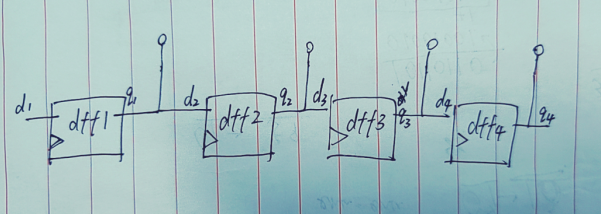
让我们从更清晰的d_ff模块出发再写一个SR模块, 而不是都交给综合!

```verilog
//先写一个dff.
module dff(
    input clk, reset, d,
    output reg q);

    always@(posedge clk)begin
        if(reset) q<=0;
        else q<=d;
    end
endmodule

//然后通过例化4个dff来搭建SR.
module SR(
    input clk, reset, d
);

endmodule


```


   #### 3.2.3.2 rotater 旋转器
相比移位寄存器, 旋转器把最后一位放到第一位而不是丢弃, 形成一个环.

构建100bit左/右旋转器. 具有同步加载和左/右转使能。load优先级大于左右转.不需要复位.

```verilog
module rotater(
    input clk,
    input load,     //同步加载
    input [1:0] ena,//01右转一位, 10左转一位, 00,11不转.
    input [99:0] data,
    output reg [99:0] q); 
    always@(posedge clk)begin
        if(load)            q<=data;
        else if(ena==2'b01) q<={q[0],q[99:1]};
        else if(ena==2'b10) q<={q[98:0],q[99]};
        else                q<=q;
    end
endmodule

```
   
   #### 3.2.3.3 arithmetic_shift 算数移位寄存器
构建一个**算数**移位寄存器.
算数移位寄存器处理**有符号数(signed)**, 或者说处理补码.  右移时, 最高位补符号位而不一定是`0`.  回忆:正负数补码的转换: 按位取反+1
  * 如负数最高位补`1`. `10110110` → `11011011`, 即`-74`->`-37`
  * 如正数最高位补`0`. `00110110` → `00011011`, 即`54`->`27`
可以发现, `算数右移1位`等价于`÷2`

而算术左移和逻辑左移没有区别.
```verilog
module arithmetic_shift(
    input clk,
    input load,
    input ena,
    input [1:0] amount,//移位方向. 2'b00: shift left by 1 bit.    2'b01: shift left by 8 bits.    2'b10: shift right by 1 bit.    2'b11: shift right by 8 bits.
    input [63:0] data,
    output reg [63:0] q); 

    always @(posedge clk) begin
        if(load)    q<=data;
        else if(ena)
            begin
                case(amount)
                    2'b00:     q <= {q[62:0],1'd0} ;//左移1位
                    2'b01:     q <= {q[55:0],8'd0} ;//左移8位
                    2'b10:     q <= {q[63],q[63:1]};//算数右移1位
                    2'b11:     q <= {{8{q[63]}},q[63:8]};//算数右移8位 
                endcase
            end       
    end
endmodule
```

   #### 3.2.3.4 linear feedback shift register, lfsr, 线性反馈移位寄存器
题目:
线性反馈移位寄存器（LFSR）通常是一个带有一些XOR门的移位寄存器，用于生成寄存器的下一个状态。Galois LFSR是其中一种特定的排列方式，在这种方式中，带有“tap”（反馈点）的比特位置与输出比特进行XOR操作，以生成下一个值，而没有“tap”的比特位置则直接移位。如果精心选择tap位置，可以使LFSR达到“最大长度”。一个n位的最大长度LFSR在重复之前会经历2^n - 1个状态（全零状态永远不会出现）。

以下图示展示了一个5位的最大长度Galois LFSR，其中tap位置在比特位置5和3（tap位置通常从1开始编号）。请注意，我将XOR门画在位置5以保持一致性，但其中一个XOR门的输入是0。Build this LFSR. The reset should reset the LFSR to 1.
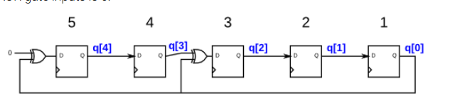

具体举个LFSR例子:

假设我们有一个 3 位的 LFSR（3 个寄存器），初始值是 `101`，生成规则是：

- **反馈规则**：用寄存器的第 1 位和第 3 位做 XOR，结果填到第 1 位（空位）。
- 每次移位，右边最末的位就“掉出”了。

- **过程演示**：
初始值是 `101`，我们开始按规则移位：

1. 当前状态是 `101`。  
   - 第 1 位和第 3 位：`1 XOR 1 = 0`。  
   - 新状态是 `010`（右移，左边空位填上 `0`）。

2. 当前状态是 `010`。  
   - 第 1 位和第 3 位：`0 XOR 0 = 0`。  
   - 新状态是 `001`。(右移，左边空位填上 `0`)

3. 当前状态是 `001`。  
   - 第 1 位和第 3 位：`0 XOR 1 = 1`。  
   - 新状态是 `100`。(右移，左边空位填上 `1`)

4. 当前状态是 `100`。  
   - 第 1 位和第 3 位：`1 XOR 0 = 1`。  
   - 新状态是 `110`。

5. 当前状态是 `110`。  
   - 第 1 位和第 3 位：`1 XOR 0 = 1`。  
   - 新状态是 `011`。

6. 当前状态是 `011`。  
   - 第 1 位和第 3 位：`0 XOR 1 = 1`。  
   - 新状态是 `101`。
 **循环出现了！**
最终，序列变成了 `101 → 010 → 001 → 100 → 110 → 011 → 101`，它会不断重复这个循环，周期是 6（循环长度）。
这是一个斐波那契LFSR.


还有Galois LFSR, 伽瓦罗线性反馈移位寄存器:Galois LFSR 是一种特殊的移位寄存器(多个D触发器(通过导线或者门电路)首尾相连)，其中称为“抽头”的那些与输出位进行异或以产生其下一个值，而没有抽头移位的位位置。如果仔细选择抽头位置，则可以使 LFSR 成为“最大长度”。 n 位的最大长度 LFSR 在重复之前会循环经过 2 n -1 个状态（永远不会达到全零状态）。
下图是一个5bit的[最大长度]`Galois LFSR`, 其`抽头`位设为第`5`位和第`3`个D触发器.(请注意，为了保持一致性，我在位置 5 处绘制了异或门，但异或门输入之一为 0。)

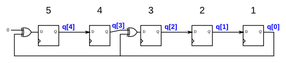
构建这个 LFSR。这 reset 应将 LFSR 重置为` 5'b0_0001`。

```verilog
//找着电路图连接即可. 一个<=语句实际上即为实例化一个dff.
module lfsr5(
    input clk,
    input reset,    // Active-high synchronous reset to 5'h1
    output [4:0] q);
    always @(posedge clk)begin
        if(reset)   q<=5'b1;    //将5个D触发器同步复位为1
        else begin
            q[4]<= 1'd0^q[0];   //连接第5个dff和第1个dff
            q[3]<=      q[4];   //连接第4个dff和第5个dff
            q[2] <= q[3] ^ q[0] ;
            q[1] <= q[2] ;
            q[0] <= q[1] ;
            end
        end
endmodule
```

```verilog
//为了清晰, 我们也可以自己例化一个个dff然后连接它们来实现相同的电路.
module top_module(
    input clk,
    input reset,    // Active-high synchronous reset to 5'h1
    output [4:0] q);
    
    //1st dff instantiation
    mydff dff1(
        .clk(clk),
        .reset1(reset),
        .d(q[1]),
        .q(q[0])
    );

    //2st dff instantiation
    mydff dff2(
        .clk(clk),
        .reset2(reset),
        .d(q[2]),
        .q(q[1])
    );

    //3st dff instantiation
    mydff dff3(
        .clk(clk),
        .reset2(reset),
        .d(q[3]^q[0]),
        .q(q[2])
    );

    //4st dff instantiation
    mydff dff4(
        .clk(clk),
        .reset2(reset),
        .d(q[4]),
        .q(q[3])
    );
    
    //5st dff instantiation
    mydff dff5(
        .clk(clk),
        .reset2(reset),
        .d(q[0]^1'b0),
        .q(q[4])
    );   
endmodule

// 一个dff模块. rst行为为sync, high effective, 输出复位为1(reset1)或2(reset2).
module mydff(input clk, reset1, reset2, d, output reg q);
    always @(posedge clk) begin
        if(reset1)          q<=1'b1;
        else if(reset2)     q<=0;
        else  q<=d;
    end
endmodule
```
   
   
   #### 3.2.3.5 LFSR试题
  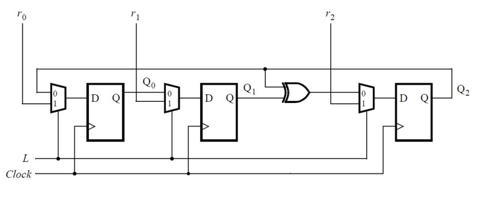
  为该时序电路编写 Verilog 代码（子模块可以，但顶层必须命名 top_module ）。假设您要在 DE1-SoC 板上实现该电路。连接 R 输入到 SW 开关，将时钟连接到 KEY[0] ， 和 L 到 KEY[1] 。连接 Q 输出到红灯 LEDR 。

这题只是简单的连线而已. 实现起来没有任何难度
  ```verilog
  module top_module (
	input [2:0] SW,      // R
	input [1:0] KEY,     // L and clk
	output [2:0] LEDR);  // Q

    reg r0,r1,r2,L,clk,Q0,Q1,Q2;
    assign r0=SW[0];
    assign r1=SW[1];
    assign r2=SW[2];
    assign L=KEY[1];
    assign clk=KEY[0];
    
    assign LEDR[0] = Q0;
    assign LEDR[1] = Q1;
    assign LEDR[2] = Q2;

    mydff dff1(
        .clk(clk),
        //.reset1(r0),
        //.reset0(Q2),
        .d(L ? r0 : Q2),
        .q(Q0)
    );

    mydff dff2(
        .clk(clk),
        //.reset1(r0),
        //.reset0(Q2),
        .d(L ? r1 : Q0),
        .q(Q1)
    );
    mydff dff3(
        .clk(clk),
        //.reset1(r0),
        //.reset0(Q2),
        .d(L ? r2 : Q1^Q2),
        .q(Q2)
    );

endmodule


// 一个dff模块. rst行为为sync, high effective, 输出复位为1(reset1)或2(reset2).
module mydff(input clk, reset1, reset0, d, output reg q);
    always @(posedge clk) begin
        if(reset1)          q<=1'b1;
        else if(reset0)     q<=0;
        else  q<=d;
    end
endmodule

  ```
  
  
   #### 3.2.3.6 LFSR32
See Lfsr5 for explanations.

Build a 32-bit Galois LFSR with taps at bit positions 32, 22, 2, and 1.
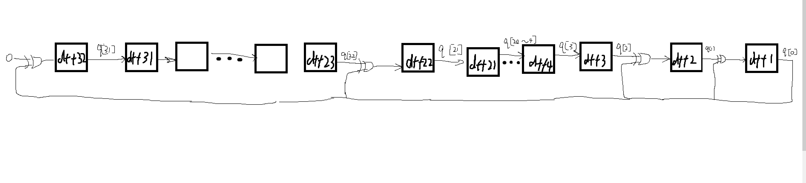
本题和LFSR5同理.

```verilog
module top_module(
    input clk,
    input reset,    // Active-high synchronous reset to 32'h1
    output [31:0] q
); 
//本题的tap位即要求:
//q[i]<=q[i+1] if (i!=31)&(i!=21)&(i!=1)&(i!=0)

//q[31]<=q[0]^0
//q[21]<=q[22]^q[0]
//q[1]<=q[2]^q[0]
//q[0]<=q[1]^q[0]

    always @(posedge clk) begin
        if(reset)   q<=32'h1;
        else begin
            for(int i=0;i<32;i++)begin
                if((i!=31)&(i!=21)&(i!=1)&(i!=0))   q[i]<=q[i+1];
            end
            q[31]<=q[0]^0;
            q[21]<=q[22]^q[0];
            q[1]<=q[2]^q[0];
            q[0]<=q[1]^q[0];
        end            
    end
endmodule
```


   #### 3.2.3.7 LFSR试题
  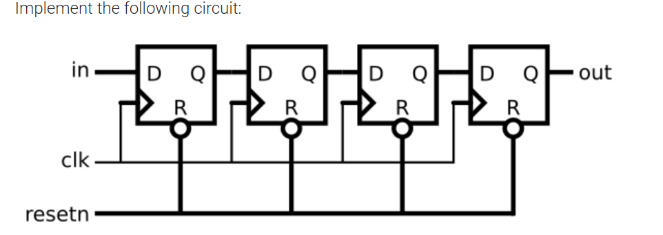

```verilog
//直接利用<=实现dff
module top_module (
    input clk,
    input resetn,   // synchronous reset
    input in,
    output out);

    reg [4:0]q;
    assign q[4]=in;
    assign out=q[0];

    always @(posedge clk) begin
        if(~resetn) q[3:0]<=3'b000;
        else begin
            for(int i=0;i<4;i++)begin
                q[i]<=q[i+1];
            end
        end
    end
endmodule
```

```verilog
//子模块法
module top_module (
    input clk,
    input resetn,   // synchronous reset
    input in,
    output out);

    reg [4:0] q;//restore intermediate signal
    assign out = q[0];
    assign q[4]= in;
    mydff dff1(clk,resetn,q[1],q[0]);//右数第一个dff
    mydff dff2(clk,resetn,q[2],q[1]);
    mydff dff3(clk,resetn,q[3],q[2]);
    mydff dff4(clk,resetn,q[4],q[3]);
endmodule

module mydff(input clk, resetn, d, output reg q);
    always @(posedge clk) begin
        if(~resetn)         q<=1'b0;
        else                q<=d;
    end
endmodule

```

   #### 3.2.3.8 SR试题
Consider the n-bit shift register circuit shown below:
考虑如下所示的n位移位寄存器电路：

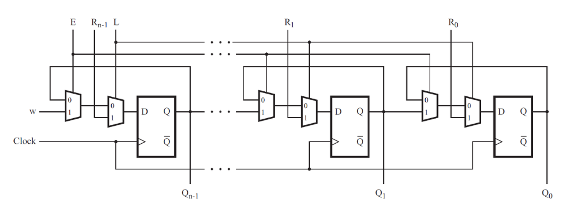

Write a top-level Verilog module (named top_module) for the shift register, assuming that n = 4. Instantiate four copies of your MUXDFF subcircuit in your top-level module. Assume that you are going to implement the circuit on the DE2 board.
为移位寄存器编写一个顶层 Verilog 模块（名为 top_module），假设n = 4。在顶层模块中实例化 MUXDFF 子电路的四个副本。假设您要在 DE2 板上实现该电路。

Connect the R inputs to the SW switches,
将R输入连接到SW开关，
clk to KEY[0],
clk到KEY[0] ，
E to KEY[1],
E至KEY[1] ，
L to KEY[2], and
L到KEY[2] ，以及
w to KEY[3].
w到KEY[3] 。
Connect the outputs to the red lights LEDR[3:0].
将输出连接到红灯LEDR[3:0] 。   
先自己编写子模块: 带mux的dff,这很容易. 

```verilog
module top_module (
    //顶层模块只需要连线而已.
    input [3:0] SW,
    input [3:0] KEY,
    output [3:0] LEDR
); //

    reg [3:0]R;
    reg clk,E,L,w;
    reg [3:0]Q;
    assign R=SW;
    assign clk=KEY[0];
    assign E =KEY[1];
    assign L=KEY[2];
    assign w=KEY[3];
    assign LEDR=Q;
    MUXDFF muxdff4(clk,w,     R[3],E,L,Q[3]);
    MUXDFF muxdff3(clk,Q[3],  R[2],E,L,Q[2]);
    MUXDFF muxdff2(clk,Q[2],  R[1],E,L,Q[1]);
    MUXDFF muxdff1(clk,Q[1],  R[0],E,L,Q[0]);
endmodule

//子模块mux_dff
module MUXDFF (
    input clk,
    input w, R, E, L,
    output reg Q
);
    wire temp;
    wire d;
    //mux
    assign temp = (E)?w:Q;
    assign d = (L)?R:temp;

    //DFF
    always @(posedge clk)begin
       Q<=d; 
    end
endmodule
```

   #### 3.2.3.9 移位寄存器实现LUT
In this question, you will design a circuit for an 8x1 memory, where writing to the memory is accomplished by shifting-in bits, and reading is "random access", as in a typical RAM. You will then use the circuit to realize a 3-input logic function.
在本题中，您将为 8x1 存储器设计一个电路，其中写入存储器是通过移入位来完成的，读取是“随机访问”，就像在典型的 RAM 中一样。然后，您将使用该电路来实现 3 输入逻辑功能。

First, create an 8-bit shift register with 8 D-type flip-flops. Label the flip-flop outputs from Q[0]...Q[7]. The shift register input should be called S, which feeds the input of Q[0] (MSB is shifted in first). The enable input controls whether to shift. Then, extend the circuit to have 3 additional inputs A,B,C and an output Z. The circuit's behaviour should be as follows: when ABC is 000, Z=Q[0], when ABC is 001, Z=Q[1], and so on. Your circuit should contain ONLY the 8-bit shift register, and multiplexers. (Aside: this circuit is called a 3-input look-up-table (LUT)).
首先，创建一个带有 8 个 D 型触发器的 8 位移位寄存器。标记 Q[0]...Q[7] 的触发器输出。移位寄存器输入应称为S ，它馈入 Q[0] 的输入（MSB 首先移入）。使能输入控制是否移位。然后，扩展电路以具有 3 个附加输入A 、 B 、 C和一个输出Z 。电路的行为应如下：当 ABC 为 000 时，Z=Q[0]，当 ABC 为 001 时，Z=Q[1]，依此类推。您的电路应仅包含 8 位移位寄存器和多路复用器。 （旁白：该电路称为 3 输入查找表 (LUT)）。

补充: RAM中的"random"并不是随机的意思, 而是可以"访问任意位置".
* **随机访问（Random Access）**：就像你可以直接通过一个地址读取任何一块内存，不管它是存储在内存的开始位置还是末尾位置。
* **顺序访问（Sequential Access）**：则要求你必须从某个起始位置开始，依次读取每个位置，直到你找到所需的数据（比如老式的磁带存储）。
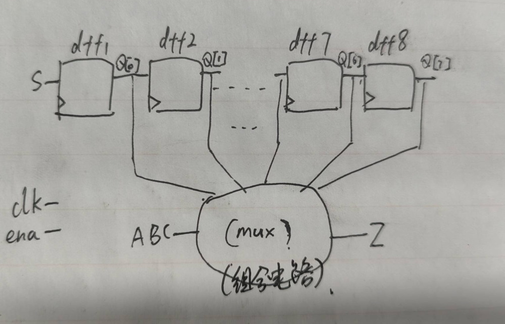
```verilog
module top_module (
    input clk,
    input enable,
    input S,
    input A, B, C,
    output reg Z ); 

    reg [7:0]q;
    
    assign Z = (A == 0 && B == 0 && C == 0) ? q[0] :
    (A == 0 && B == 0 && C == 1) ? q[1] :
    (A == 0 && B == 1 && C == 0) ? q[2] :
    (A == 0 && B == 1 && C == 1) ? q[3] :
    (A == 1 && B == 0 && C == 0) ? q[4] :
    (A == 1 && B == 0 && C == 1) ? q[5] :
    (A == 1 && B == 1 && C == 0) ? q[6] :
    q[7];
    always @(posedge clk) begin
        if(enable)begin
            q[7]<=q[6];
            q[6]<=q[5];
            q[5]<=q[4];
            q[4]<=q[3];
            q[3]<=q[2];
            q[2]<=q[1];
            q[1]<=q[0];
            q[0]<=S;
            /*
            case ({A,B,C})	//这样不对, 延后了. 题目的意思是Z即时读取Q的值
                3'b000: Z <= q[0];
                3'b001: Z <= q[1];
                3'b010: Z <= q[2];
                3'b011: Z <= q[3];
                3'b100: Z <= q[4];
                3'b101: Z <= q[5];
                3'b110: Z <= q[6];
                3'b111: Z <= q[7];
                default: Z <= 0;
            endcase
                */
        end
    end
endmodule

```

   #### rule90
[Rule 90](https://en.wikipedia.org/wiki/Rule_90) is a one-dimensional cellular automaton with interesting properties.  
[规则 90](https://en.wikipedia.org/wiki/Rule_90)是一个具有有趣特性的一维元胞自动机。

The rules are simple. There is a one-dimensional array of cells (on or off). At each time step, the next state of each cell is the XOR of the cell's two current neighbours. A more verbose way of expressing this rule is the following table, where a cell's next state is a function of itself and its two neighbours:  
规则很简单。有一个一维单元格数组（开或关）。在每个时间步，每个单元的下一个状态是该单元的两个当前邻居的异或。下表是表达此规则的更详细方式，其中细胞的下一个状态是其自身及其两个邻居的函数：

| Left | Center | Right | Center's next state |
|------|--------|-------|---------------------|
| 1    | 1      | 1     | 0                   |
| 1    | 1      | 0     | 1                   |
| 1    | 0      | 1     | 0                   |
| 1    | 0      | 0     | 1                   |
| 0    | 1      | 1     | 1                   |
| 0    | 1      | 0     | 0                   |
| 0    | 0      | 1     | 1                   |
| 0    | 0      | 0     | 0                   |

(The name "Rule 90" comes from reading the "next state" column: 01011010 is decimal 90.)  
（“规则 90”这个名称来自于读取“下一个状态”列：01011010 是十进制的 90。）

  
In this circuit, create a 512-cell system (q\[511:0\]), and advance by one time step each clock cycle. The load input indicates the state of the system should be loaded with data\[511:0\]. Assume the boundaries (q\[-1\] and q\[512\]) are both zero (off).  
在此电路中，创建一个 512 单元系统（ q\[511:0\] ），并且每个时钟周期前进一个时间步。这 load 输入指示应加载的系统状态 data\[511:0\] 。假设边界 ( q\[-1\] 和 q\[512\] ) 均为零（关闭）。

这题很简单.
```verilog
module top_module(
    input clk,
    input load,
    input [511:0] data,
    output [511:0] q ); 
    always @(posedge clk) begin
        if(load)    q <= data;
        else begin            
            for(int i=0;i<512;i++)begin
                if(i==0)        q[i]<= q[i+1]^0;
                else if(i==511) q[i]<= 0     ^q[i-1];
                else            q[i]<= q[i+1]^q[i-1];
            end
        end
    end
endmodule
```


   #### rule110
Rule 110 is a one-dimensional cellular automaton with interesting properties (such as being Turing-complete).
规则 110是一个一维元胞自动机，具有有趣的属性（例如图灵完备）。

There is a one-dimensional array of cells (on or off). At each time step, the state of each cell changes. In Rule 110, the next state of each cell depends only on itself and its two neighbours, according to the following table:
有一个一维单元格数组（开或关）。在每个时间步，每个细胞的状态都会发生变化。在规则 110 中，每个单元的下一个状态仅取决于其自身及其两个邻居，如下表所示：

| Left | Center | Right | Center's next state |
|------|--------|-------|---------------------|
| 1    | 1      | 1     | 0                   |
| 1    | 1      | 0     | 1                   |
| 1    | 0      | 1     | 1                   |
| 1    | 0      | 0     | 0                   |
| 0    | 1      | 1     | 1                   |
| 0    | 1      | 0     | 1                   |
| 0    | 0      | 1     | 1                   |
| 0    | 0      | 0     | 0                   |
我们先看这个真值表, 把这个
(The name "Rule 110" comes from reading the "next state" column: 01101110 is decimal 110.)
（“规则 110”这个名称来自于读取“下一个状态”列：01101110(也就是上表的最后一列) 是十进制的 110。）

In this circuit, create a 512-cell system (q[511:0]), and advance by one time step each clock cycle. The load input indicates the state of the system should be loaded with data[511:0]. Assume the boundaries (q[-1] and q[512]) are both zero (off).
在此电路中，创建一个 512 单元系统（ q[511:0] ），并且每个时钟周期前进一个时间步。这 load 输入指示应加载的系统状态 data[511:0] 。假设边界 ( q[-1] 和 q[512] ) 均为零（关闭）。

```verilog
module top_module(
    input logic clk,
    input logic load,
    input logic [511:0] data,
    output logic [511:0] q
); 
    always_ff@(posedge clk) begin
        if(load)  q <= data ;
        else begin
              // 利用卡诺图从真值表得到逻辑关系化简.
                  q <= ~q&{q[510:0],1'b0} |
                       ~{1'b0,q[511:1]}&q |
                       q&~{q[510:0],1'b0} ;
        end
    end
endmodule
```


   #### conway生命游戏
作为前两题的升级版，本题的变换工作在一个二维矩阵上，是一个二维序列生成器。

游戏规则如下：元素的下一个状态取决于当前状态九宫格中的 8 个邻居元素中 1 的个数，当邻居有 n 个 1 时：

0-1 ，元素变为 0
2 ，元素保持不变
3 ，元素变为 1
4+ ，元素变为 0
方便做题起见，本题中的这个二维矩阵设定为 16x16，广义上可以是无限的。

为了让事情变得更加有趣，这个16x16 矩阵的边界进行循环处理，回卷到对边，打个比方，上边界的上一行为下边界，左边界的左一列为右边界。


所以对元素 (0,0) 来说，共有 8 个邻居 : (15,1), (15,0), (15,15), (0,1), (0,15), (1,1), (1,0) 以及 (1,15)。

这个 16x16 矩阵表示为 256bit 长度的向量 q，其中 q[15:0] 代表第一行，q[31:16] 代表第二行，以此类推。

HDLBit 支持使用 SystemVerilog，所以你也可以使用二维向量表示这个矩阵。load 信号有效时，更新 q 信号值为初始值 data, q 每个周期变换一次。

```verilog


```
  
  ### 3.2.4 有限状态机finite state machine

   #### 3.2.4.1 摩尔状态机 moore fsm
This is a Moore state machine with two states, one input, and one output. Implement this state machine. Notice that the reset state is B. 异步复位.
这是一个具有两个状态、一个输入和一个输出的摩尔状态机。实现这个状态机。请注意，重置状态为 B。
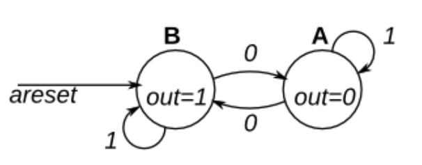

状态机 (Finite State Machine, FSM) 是一种数学模型，它表示系统可以处于的一组有限状态，以及状态之间的转换规则。

状态机通常由以下几个部分组成：

1.  **状态 (States)**：系统可以处于的不同状态。
2.  **输入 (Inputs)**：触发状态转换的外部信号。
3.  **输出 (Outputs)**：根据当前状态决定的输出值（在 Moore 状态机中，输出仅依赖当前状态）。
4.  **状态转换规则 (Transitions)**：根据输入信号从一个状态切换到另一个状态的规则。
5.  **复位状态 (Reset State)**：系统启动或复位时的初始状态。

题目中的状态机说明:

1.  **状态**：
    
    -   状态 `A`（输出 `out=0`）。
    -   状态 `B`（输出 `out=1`）。
2.  **输入**：
    
    -   一个输入信号（`1` 或 `0`）。
    -   一个异步复位信号 `areset`，用于强制将状态机复位到状态 `B`。
3.  **输出**：
    
    -   在状态 `A` 时，`out=0`。
    -   在状态 `B` 时，`out=1`。
4.  **状态转换**：
    
    -   当复位信号 `areset` 为 `1` 时，状态直接变为 `B`（异步复位）。
    -   在状态 `B`，如果输入信号为 `1`，保持在状态 `B`；如果输入信号为 `0`，切换到状态 `A`。
    -   在状态 `A`，如果输入信号为 `0`，保持在状态 `A`；如果输入信号为 `1`，切换到状态 `B`。


```verilog
//一个简单的FSM.
//有两个状态A和B，(状态)输入in，输出out。
//当输入为1时，状态保持不变，当输入为0时，状态在下个时钟周期切换。(状态转移规则)
//当state为A时，out为1，当state为B时，out为0。(状态输出规则)

	//a FSM is usually coded in 3 parts: 
	//1.state register 状态寄存器
	//2.state transform logic 状态转移逻辑(combinational logic)
	//3.state output logic 状态输出逻辑(sequence logic)

module top_module (
	input clk,
	input in,
	input areset,//asynchronous reset
	output reg out
);

	//1.state register. assign states.(give name and value)
    parameter A=666,B=233;//it doesnt matter what value we give to each state, as long as they are different.
	//but if assigning large values, the state register may need more bits.(此处因为用了666这样的搞怪数字，所以state和next_state需要很多位)
	reg [10:0]state,next_state;//`state` and `next_state` register. Used to store the current state and the next state.
	

	//2.state transform logic.
	//given the current `state` and the `input`, calculate the `next state`.
	always @(*)begin
		case(state)
			A: next_state = in ? A : B;
			B: next_state = in ? B : A;
		endcase
	end

	always @(posedge clk or posedge areset)begin
		if(areset)	state <= B;//reset to state B
		else state <= next_state;//otherwise, update the state.
	end


	//3.state output logic.	
	//A: out = 0; 
	//B: out = 1;
	always @(*)begin
		case(state)
			A: out = 1'b0;
			B: out = 1'b1;
		endcase
	end
endmodule
```

   #### 3.2.4.3 两输入moore fsm
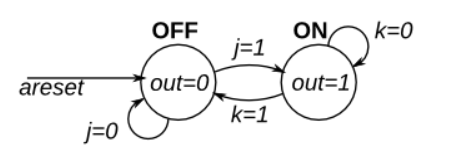   
```verilog
module top_module (
	input clk,
	input j,k,
	input areset,//asynchronous reset
	output reg out
);
	//1.state register. assign states.(give name and value)
    parameter OFF=0,ON=1;
	reg state,next_state;
	
	//2.state transform logic.
	always @(*)begin
		case(state)
            ON: next_state = (k==0) ? ON : OFF;
            OFF: next_state = (j==0) ? OFF : ON;
		endcase
	end

	always @(posedge clk or posedge areset)begin
        if(areset)	state <= OFF;//reset to state B
		else state <= next_state;//otherwise, update the state.
	end

	//3.state output logic.	
	//OFF: out = 0; 
	//ON: out = 1;
	always @(*)begin
		case(state)
			OFF: out = 1'b0;
			ON: out = 1'b1;
		endcase
	end
endmodule
```

   #### 3.2.4.4 one-hot fsm
其实就是每个状态编码只有一个位为 1，而其余的位为 0，这就是 "one-hot"（单热）的含义。用十进制来看就是状态编码只能是`2^n`.

###
   ###


## 3.3 building larger circuits

# 4 testbenches


# 杂项

* if 和 else 块是否需要 begin 和 end (相当于C中的`{}`)包围，取决于代码块中是否包含多条语句, 单条语句的话可以省略begin和end. 即使只有一条语句，出于代码晰性和可维护性的考虑，也推荐始终为 if 和 else 块添加 begin 和 end。

* There is no logical-XOR operator!!!


#