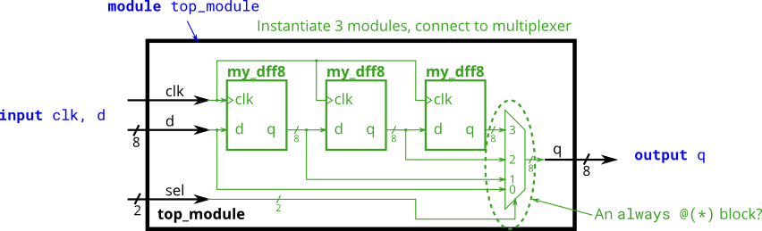
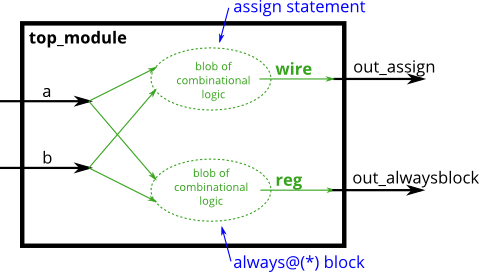
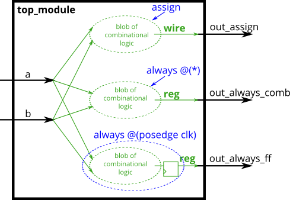
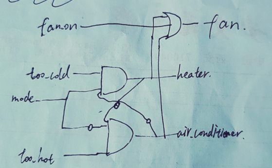
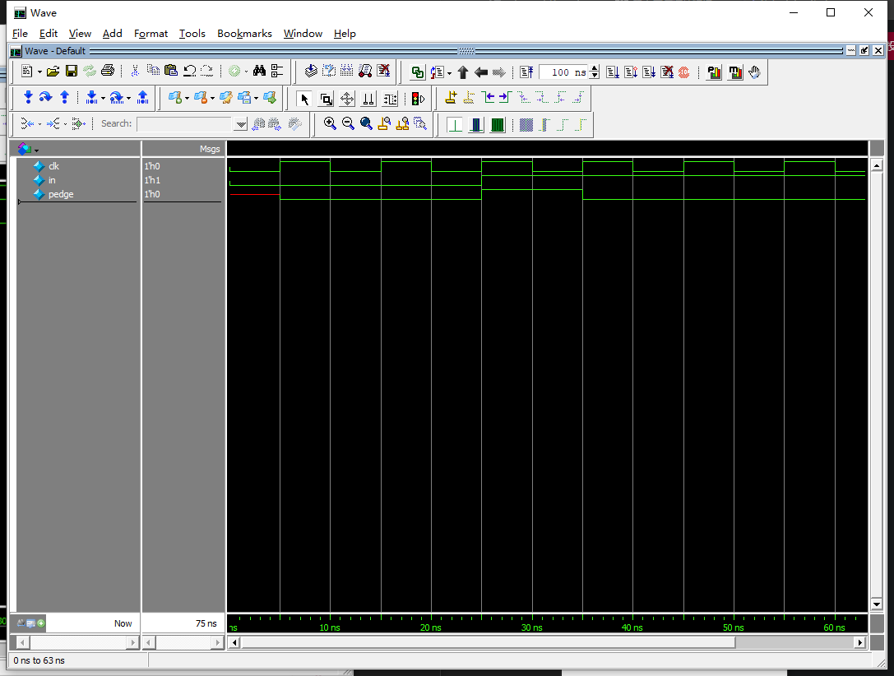
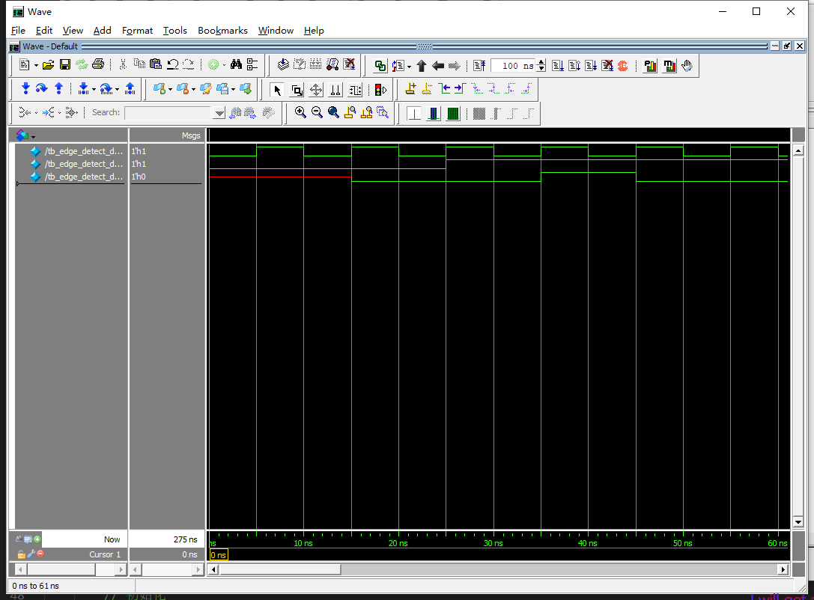
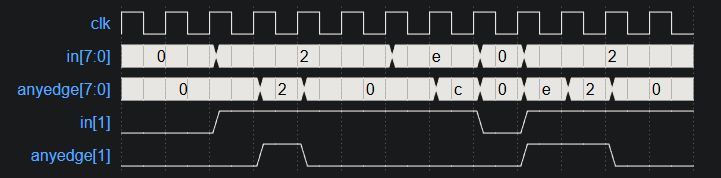

https://hdlbits.01xz.net/wiki/Main_Page


# 2.verilog language 

## 2.3 modules:hierarchy

### 2.3.4   3modules
You are given a module my_dff with two inputs and one output (that implements a D flip-flop). Instantiate three of them, then chain them together to make a shift register of length 3. The clk port needs to be connected to all instances.

The module provided to you is: module my_dff ( input clk, input d, output q );

Note that to make the internal connections, you will need to declare some wires. Be careful about naming your wires and module instances: the names must be unique.


```verilog
module top_module ( input clk, input d, output q );
    wire internal_q1,internal_q2;
    
    my_dff dff1(
        .clk(clk),
        .d(d),
        .q(internal_q1)
    );
    
    my_dff dff2(
        .clk(clk),
        .d(internal_q1),
        .q(internal_q2)
    );
    
    my_dff dff3(
        .clk(clk),
        .d(internal_q2),
        .q(q)
    );
endmodule

```

### 2.3.5 modules and vectors
This exercise is an extension of module_shift. Instead of module ports being only single pins, we now have modules with vectors as ports, to which you will attach wire vectors instead of plain wires. Like everywhere else in Verilog, the vector length of the port does not have to match the wire connecting to it, but this will cause zero-padding or trucation of the vector. This exercise does not use connections with mismatched vector lengths.

You are given a module my_dff8 with two inputs and one output (that implements a set of 8 D flip-flops). Instantiate three of them, then chain them together to make a 8-bit wide shift register of length 3. In addition, create a 4-to-1 multiplexer (not provided) that chooses what to output depending on sel[1:0]: The value at the input d, after the first, after the second, or after the third D flip-flop. (Essentially, sel selects how many cycles to delay the input, from zero to three clock cycles.)

The module provided to you is: module my_dff8 ( input clk, input [7:0] d, output [7:0] q );

The multiplexer is not provided. One possible way to write one is inside an always block with a case statement inside. (See also: mux9to1v)

```verilog
module top_module ( 
    input clk, 
    input [7:0] d, 
    input [1:0] sel, 
    output [7:0] q 
);
    wire [7:0] q1;
    wire [7:0] q2;
    wire [7:0] q3;
    
    my_dff8 dff1(
        .clk(clk),
        .d(d),
        .q(q1)
    );
    
    my_dff8 dff2(
        .clk(clk),
        .d(q1),
        .q(q2)
    );
    
    my_dff8 dff3(
        .clk(clk),
        .d(q2),
        .q(q3)
    );    
    
    multiplexer multiplexer1(
        .in1(d),
        .in2(q1),
        .in3(q2),
        .in4(q3),
        .sel(sel),
        .out(q)
    );
endmodule


module multiplexer(
    input [7:0] in1, in2, in3, in4,
    input [1:0] sel,
    output reg [7:0] out	//out必须是reg 
);
    
    //we can directly use 3元操作符`?` to achieve `if` 组合逻辑:
    
    
    assign out = (sel == 2'b00) ? in1:
        (sel == 2'b01) ? in2:
        (sel == 2'b10) ? in3:
        (sel == 2'b11) ? in4:
        8'b0;	//default value
   
    
    
    //也可以使用always内的if或case[行为逻辑], 实现`if`时序逻辑. `@*` automately detect all the relative signal.
    //虽然always块是专门设计给时序逻辑赋值用的, always赋值称为`过程赋值`, 包括`阻塞`(给组合逻辑用,不常见)和`非阻塞`(给组合逻辑用,常见)两个子类. 
    //该程序只涉及组合逻辑赋值. 可以在always块使用阻塞赋值.
    /*
    always @* begin
        case(sel)
            2'b00: out = in1;   // 阻塞赋值. 输出 in1
            2'b01: out = in2;  // 输出 in2
            2'b10: out = in3;  // 输出 in3
            2'b10: out = in4;  // 输出 in4
            default: out = 8'b0;	//default
        endcase
    end     
    */
endmodule
```


### 2.3.7 Module fadd(full adder) 用多个一位全加器连接成多位全加器
In this exercise, you will create a circuit with two levels of hierarchy. Your top_module will instantiate two copies of add16 (provided), each of which will instantiate 16 copies of add1 (which you must write). Thus, you must write two modules: top_module and add1.

Like module_add, you are given a module add16 that performs a 16-bit addition. You must instantiate two of them to create a 32-bit adder. One add16 module computes the lower 16 bits of the addition result, while the second add16 module computes the upper 16 bits of the result. Your 32-bit adder does not need to handle carry-in (assume 0) or carry-out (ignored).

Connect the add16 modules together as shown in the diagram below. The provided module add16 has the following declaration:

module add16 ( input[15:0] a, input[15:0] b, input cin, output[15:0] sum, output cout );

Within each add16, 16 full adders (module add1, not provided) are instantiated to actually perform the addition. You must write the full adder module that has the following declaration:

module add1 ( input a, input b, input cin, output sum, output cout );

Recall that a full adder computes the sum and carry-out of a+b+cin.

In summary, there are three modules in this design:

top_module — Your top-level module that contains two of...
add16, provided — A 16-bit adder module that is composed of 16 of...
add1 — A 1-bit full adder module.

If your submission is missing a module add1, you will get an error message that says Error (12006): Node instance "user_fadd[0].a1" instantiates undefined entity "add1".


```verilog
//就比2.3.6多了一个全加器add1而已:
//全加器add1
module add1(
	input a,b,cin,
    output cout,sum
);
    assign {cout, sum} = a + b + cin; // 直接利用 Verilog 的位拼接
endmodule
```


### 2.3.9 Module addsub(adder-substractor, 加减法器)
Adder-Subtractor（加减法器）是一种可以同时执行加法和减法运算的数字电路。它的实现基于一个可控的操作符号（通常称为 op 或 mode 信号），通过简单的电路设计，可以用一个模块实现两个功能。
工作原理：
加法和减法的关系基于二进制数的**补码**表示：
加法:A+B
减法:A+(-B)
负数-B等价于对B按位取反再+1, 这也即B的补码.
通过一个 XOR 门实现按位取反，结合控制信号，可以轻松实现 B 的补码计算。
An adder-subtractor can be built from an adder by optionally negating one of the inputs, which is equivalent to inverting the input then adding 1. The net result is a circuit that can do two operations: (a + b + 0) and (a + ~b + 1). See Wikipedia if you want a more detailed explanation of how this circuit works.

Build the adder-subtractor below.

You are provided with a 16-bit adder module, which you need to instantiate twice:

module add16 ( input[15:0] a, input[15:0] b, input cin, output[15:0] sum, output cout );

Use a 32-bit wide XOR gate to invert the b input whenever sub is 1. (This can also be viewed as b[31:0] XORed with sub replicated 32 times. See replication operator.). Also connect the sub input to the carry-in of the adder.


```verilog
//该模块利用两个add16写了一个加减法器.
module top_module(
    input [31:0] a,
    input [31:0] b,
	input sub,
    output [31:0] sum
);

	wire add1_cout;
	wire [15:0] add1_sum;
	wire [15:0] add2_sum;
	
	wire [31:0] b_comp = (sub==1'b0) ? b 
		: ~b+1;	//b的补码complement

	
	add16 add1(
		.a(a[15:0]),
		.b(b_comp[15:0]),
		.cin(1'b0),
		.cout(add1_cout),
		.sum(add1_sum)
	);
	
	add16 add2(
        .a(a[31:16]),
        .b(b_comp[31:16]),
		.cin(add1_cout),
		.cout(),	//ignore
		.sum(add2_sum)
	);
	assign sum = {add2_sum, add1_sum};
endmodule
```

## 2.4 Procedures (程序, 即always块, 包括always组合逻辑块和always时序逻辑快)


### 2.4.1 Always block (combinational) always组合逻辑块
Since digital circuits are composed of logic gates connected with wires, any circuit can be expressed as some combination of modules and assign statements. However, sometimes this is not the most convenient way to describe the circuit. Procedures (of which always blocks are one example) provide an alternative syntax for describing circuits.

For synthesizing hardware, two types of always blocks are relevant:

Combinational: always @(*)
Clocked: always @(posedge clk)
Combinational always blocks are equivalent to assign statements, thus there is always a way to express a combinational circuit both ways. The choice between which to use is mainly an issue of which syntax is more convenient. The syntax for code inside a procedural block is different from code that is outside. Procedural blocks have a richer set of statements (e.g., if-then, case), cannot contain continuous assignments*, but also introduces many new non-intuitive ways of making errors. (*Procedural continuous assignments do exist, but are somewhat different from continuous assignments, and are not synthesizable.)

For example, the assign and combinational always block describe the same circuit. Both create the same blob of combinational logic. Both will recompute the output whenever any of the inputs (right side) changes value. 
assign out1 = a & b | c ^ d;
always @(*) out2 = a & b | c ^ d;

For combinational always blocks, always use a sensitivity list of (*). Explicitly listing out the signals is error-prone (if you miss one), and is ignored for hardware synthesis. If you explicitly specify the sensitivity list and miss a signal, the synthesized hardware will still behave as though (*) was specified, but the simulation will not and not match the hardware's behaviour. (In SystemVerilog, use always_comb.)
对于组合的always块，


始终使用敏感度列表 (*) 。明确列出信号很容易出错（如果您错过了一个），并且在硬件综合中会被忽略。如果您显式指定敏感度列表并错过信号，则合成硬件的行为仍会像 (*) 已指定，但模拟不会也不匹配硬件的行为。 （在 SystemVerilog 中，使用 always_comb .)

A note on wire vs. reg: The left-hand-side of an assign statement must be a net type (e.g., wire), while the left-hand-side of a procedural assignment (in an always block) must be a variable type (e.g., reg). These types (wire vs. reg) have nothing to do with what hardware is synthesized, and is just syntax left over from Verilog's use as a hardware simulation language.
关于wire 与reg 的注释：分配语句的左侧必须是网络类型（例如， wire ），而过程赋值的左侧（在always块中）必须是变量类型（例如， reg ）。这些类型（wire 与 reg）与合成的硬件无关，只是 Verilog 作为硬件模拟语言使用时遗留下来的语法。

A bit of practice 一点练习
Build an AND gate using both an assign statement and a combinational always block. (Since assign statements and combinational always blocks function identically, there is no way to enforce that you're using both methods. But you're here for practice, right?...)
使用分配语句和组合的always块构建AND门。 （由于赋值语句和组合总是块功能相同，因此无法强制您使用这两种方法。但是您来这里是为了练习，对吧？...）
```verilog
module top_module(
    input a, 
    input b,
    output wire out_assign,
    output reg out_alwaysblock
);
    assign out_assign = a&b;      
    always @(*) out_alwaysblock = a&b;


endmodule
```


### 2.4.2 Always block (clocked) always时序逻辑块
For hardware synthesis, there are two types of always blocks that are relevant:

Combinational: always @(*)
Clocked: always @(posedge clk)
Clocked always blocks create a blob of combinational logic just like combinational always blocks, but also creates a set of flip-flops (or "registers") at the output of the blob of combinational logic. Instead of the outputs of the blob of logic being visible immediately, the outputs are visible only immediately after the next (posedge clk).

Blocking vs. Non-Blocking Assignment
There are three types of assignments in Verilog:

Continuous assignments (assign x = y;). Can only be used when not inside a procedure ("always block").
Procedural blocking assignment: (x = y;). Can only be used inside a procedure.
Procedural non-blocking assignment: (x <= y;). Can only be used inside a procedure.
In a combinational always block, use blocking assignments. In a clocked always block, use non-blocking assignments. A full understanding of why is not particularly useful for hardware design and requires a good understanding of how Verilog simulators keep track of events. Not following this rule results in extremely hard to find errors that are both non-deterministic and differ between simulation and synthesized hardware.

A bit of practice
Build an XOR gate three ways, using an assign statement, a combinational always block, and a clocked always block. Note that the clocked always block produces a different circuit from the other two: There is a flip-flop so the output is delayed.

```verilog
module top_module(
    input clk,
    input a,
    input b,
    output wire out_assign,
    output reg out_always_comb,
    output reg out_always_ff   //为啥叫ff(触发器)? 事实上, 当我写一个个的always时序逻辑赋值时, 我将要在硬件里实现一个个触发器, 触发器本身就是完成非阻塞赋值嘛.
    );
    
    assign out_assign = a^b;
    always @(*) out_always_comb = a^b;
    always @(posedge clk) out_always_ff = a^b;  

endmodule
```


### 2.4.3 if
An if statement usually creates a 2-to-1 multiplexer, selecting one input if the condition is true, and the other input if the condition is false.


always @(*) begin
    if (condition) begin
        out = x;
    end
    else begin
        out = y;
    end
end
This is equivalent to using a continuous assignment with a conditional operator:

assign out = (condition) ? x : y;
However, the procedural if statement provides a new way to make mistakes. The circuit is combinational only if out is always assigned a value.

A bit of practice
Build a 2-to-1 mux that chooses between a and b. Choose b if both sel_b1 and sel_b2 are true. Otherwise, choose a. Do the same twice, once using assign statements and once using a procedural if statement.

sel_b1	sel_b2	out_assign
out_always
0	0	a
0	1	a
1	0	a
1	1	b

```verilog
// synthesis verilog_input_version verilog_2001
module top_module(
    input a,
    input b,
    input sel_b1,
    input sel_b2,
    output wire out_assign,
    output reg out_always   ); 
    
    assign out_assign = (sel_b1&sel_b2==1'b1) ? b
        : a;
    
    always @(*) begin
        if(sel_b1&sel_b2==1'b1) begin
            out_always=b;
        end
        else begin
            out_always=a;
        end
    end
endmodule

```


### 2.4.4 没有else的常见错误
A common source of errors: How to avoid making latches
常见的错误来源：如何避免制作锁存器
When designing circuits, you must think first in terms of circuits:
设计电路时，首先要从电路方面来思考：

I want this logic gate
我想要这个逻辑门
I want a combinational blob of logic that has these inputs and produces these outputs
我想要一个具有这些输入并产生这些输出的逻辑组合块
I want a combinational blob of logic followed by a set of flip-flops
我想要一个组合逻辑块，后面跟着一组触发器
What you must not do is write the code first, then hope it generates a proper circuit.
您不能先编写代码，然后希望它生成正确的电路。

If (cpu_overheated) then shut_off_computer = 1;
如果（cpu_overheated）则shut_off_computer = 1；
If (~arrived) then keep_driving = ~gas_tank_empty;
如果（~到达）则 keep_driven = ~gas_tank_empty;
Syntactically-correct code does not necessarily result in a reasonable circuit (combinational logic + flip-flops). The usual reason is: "What happens in the cases other than those you specified?". Verilog's answer is: Keep the outputs unchanged.
语法正确的代码不一定会产生合理的电路（组合逻辑+触发器）。通常的原因是：“除了您指定的情况之外，会发生什么情况？”。 Verilog 的答案是：保持输出不变。

This behaviour of "keep outputs unchanged" means the current state needs to be remembered, and thus produces a latch. Combinational logic (e.g., logic gates) cannot remember any state. Watch out for Warning (10240): ... inferring latch(es)" messages. Unless the latch was intentional, it almost always indicates a bug. Combinational circuits must have a value assigned to all outputs under all conditions. This usually means you always need else clauses or a default value assigned to the outputs.
这种“保持输出不变”的行为意味着需要记住当前状态，从而产生锁存器。组合逻辑（例如逻辑门）无法记住任何状态。留意 Warning (10240): ... inferring latch(es)" 消息。除非闩锁是故意的，否则它几乎总是表明存在错误。组合电路必须在所有条件下为所有输出分配一个值。这通常意味着您始终需要 else 子句或分配给输出的默认值。

Demonstration 示范
The following code contains incorrect behaviour that creates a latch. Fix the bugs so that you will shut off the computer only if it's really overheated, and stop driving if you've arrived at your destination or you need to refuel.
以下代码包含创建锁存器的不正确行为。修复错误，以便只有在计算机确实过热时才关闭计算机，并在到达目的地或需要加油时停止驾驶。


This is the circuit described by the code, not the circuit you want to build.
这是代码描述的电路，而不是您要构建的电路。
```
always @(*) begin
    if (cpu_overheated)
       shut_off_computer = 1;
end

always @(*) begin
    if (~arrived)
       keep_driving = ~gas_tank_empty;
end
```

```verilog
module top_module (
    input      cpu_overheated,
    output reg shut_off_computer,
    input      arrived,
    input      gas_tank_empty,
    output reg keep_driving  ); //

    always @(*) begin
        if (cpu_overheated) begin
           shut_off_computer = 1;
    	end
    	else begin
        	shut_off_computer = 0;
    	end  
    end
//如果没有else语句,导致当cpu_overheated为0时程序不知道做什么, shut_off_computer信号将申请latch.
    always @(*) begin
        if (~arrived) begin
           keep_driving = ~gas_tank_empty;
    	end else begin
           keep_driving = 0; 
        end
    end
endmodule
```


### 2.4.5 case块
Case statements in Verilog are nearly equivalent to a sequence of if-elseif-else that compares one expression to a list of others. Its syntax and functionality differs from the switch statement in C.

always @(*) begin     // This is a combinational circuit
    case (in)
      1'b1: begin 
               out = 1'b1;  // begin-end if >1 statement
            end
      1'b0: out = 1'b0;
      default: out = 1'bx;
    endcase
end
The case statement begins with case and each "case item" ends with a colon. There is no "switch".
Each case item can execute exactly one statement. This makes the "break" used in C unnecessary. But this means that if you need more than one statement, you must use begin ... end.
Duplicate (and partially overlapping) case items are permitted. The first one that matches is used. C does not allow duplicate case items.
A bit of practice
Case statements are more convenient than if statements if there are a large number of cases. So, in this exercise, create a 6-to-1 multiplexer. When sel is between 0 and 5, choose the corresponding data input. Otherwise, output 0. The data inputs and outputs are all 4 bits wide.

Be careful of inferring latches (See.always_if2)
```verilog
module top_module ( 
    input [2:0] sel, 
    input [3:0] data0,
    input [3:0] data1,
    input [3:0] data2,
    input [3:0] data3,
    input [3:0] data4,
    input [3:0] data5,
    output reg [3:0] out   );//

    always@(*) begin  // This is a combinational circuit
        case(sel)
            3'b0:out=data0;
            3'b1:out=data1;
            3'b10:out=data2;
            3'b11:out=data3;
            3'b100:out=data4;
            3'b101:out=data5;
            default:out=0;
        endcase
    end
endmodule
```


### 2.4.6 优先级编码
A priority encoder is a combinational circuit that, when given an input bit vector, outputs the position of the first 1 bit in the vector. For example, a 8-bit priority encoder given the input 8'b10010000 would output 3'd4, because bit[4] is first bit that is high.
优先级编码器是一个组合电路，当给定输入位向量时，它输出第一个的位置 1 向量中的位。例如，给定输入的 8 位优先级编码器 8'b10010000 会输出 3'd4 ，因为 bit[4] 是第一个高位。

Build a 4-bit priority encoder. For this problem, if none of the input bits are high (i.e., input is zero), output zero. Note that a 4-bit number has 16 possible combinations.
构建 4 位优先级编码器。对于这个问题，如果没有一个输入位为高（即输入为零），则输出为零。
```verilog
// synthesis verilog_input_version verilog_2001
module top_module (
    input [3:0] in,
    output reg [1:0] pos  );
    always @(*) begin
        if (in[0])   
            pos = 2'd0;
        else if (in[1])  
            pos = 2'd1;
        else if (in[2])  
            pos = 2'd2;
        else if (in[3])  
            pos = 2'd3;
        else
            pos = 2'd0;  
    end

endmodule
```


### 2.4.7 casez块
casez相比case的区别就是允许你用`z`进行通配符匹配, 可以匹配`0`,`1`,`z`,`?`(未定态和高阻态)

```verilog
// synthesis verilog_input_version verilog_2001
module top_module (
    input [7:0] in,
    output reg [2:0] pos );
    always @(*)begin
        casez(in)
            8'b zzzzzzz1:pos= 3'd0 ; 
            8'b zzzzzz1z:pos=  3'd1;
            8'b zzzzz1zz:pos=3'd2;
            8'b zzzz1zzz:pos=  3'd3;
            8'b zzz1zzzz:pos=  3'd4;
            8'b zz1zzzzz:pos=  3'd5;
            8'b z1zzzzzz:pos=  3'd6;
            8'b 1zzzzzzz:pos=  3'd7;
            default: pos=0;
        endcase
    end
endmodule
```

### 2.4.8 避免组合逻辑中出现latch
这需要留意给if或者case块的所有情况留出default. 一种方法是**先赋值再覆盖**.
Suppose you're building a circuit to process scancodes from a PS/2 keyboard for a game. Given the last two bytes of scancodes received, you need to indicate whether one of the arrow keys on the keyboard have been pressed. This involves a fairly simple mapping, which can be implemented as a case statement (or if-elseif) with four cases.

Scancode [15:0]	Arrow key
16'he06b	left arrow
16'he072	down arrow
16'he074	right arrow
16'he075	up arrow
Anything else	none
Your circuit has one 16-bit input, and four outputs. Build this circuit that recognizes these four scancodes and asserts the correct output.

To avoid creating latches, all outputs must be assigned a value in all possible conditions (See also always_if2). Simply having a default case is not enough. You must assign a value to all four outputs in all four cases and the default case. This can involve a lot of unnecessary typing. One easy way around this is to assign a "default value" to the outputs before the case statement:

always @(*) begin
    up = 1'b0; down = 1'b0; left = 1'b0; right = 1'b0;
    case (scancode)
        ... // Set to 1 as necessary.
    endcase
end
This style of code ensures the outputs are assigned a value (of 0) in all possible cases unless the case statement overrides the assignment. This also means that a default: case item becomes unnecessary.

Reminder: The logic synthesizer generates a combinational circuit that behaves equivalently to what the code describes. Hardware does not "execute" the lines of code in sequence.
```verilog
// synthesis verilog_input_version verilog_2001
module top_module (
    input [15:0] scancode,
    output reg left,
    output reg down,
    output reg right,
    output reg up  ); 

    always @(*) begin
        left = 0;
        down = 0;
        right = 0;
        up = 0;
        case(scancode)
            16'he06b	:left = 1;
			16'he072	:down = 1;
			16'he074	:right = 1;
			16'he075	:up = 1;
        endcase
    end    
endmodule
```

## 2.5 more features

### 2.5.1 conditional 条件运算符
Verilog has a ternary conditional operator ( ? : ) much like C:
Verilog 有一个三元条件运算符 (?:)，很像 C：

(condition ? if_true : if_false)

This can be used to choose one of two values based on condition (a mux!) on one line, without using an if-then inside a combinational always block.
这可用于根据一行上的条件（多路复用器！）选择两个值之一，而无需在组合的always块内使用if-then。

Examples:  例子：

(0 ? 3 : 5)     // This is 5 because the condition is false.
(sel ? b : a)   // A 2-to-1 multiplexer between a and b selected by sel.

always @(posedge clk)         // A T-flip-flop.
  q <= toggle ? ~q : q;

always @(*)                   // State transition logic for a one-input FSM
  case (state)
    A: next = w ? B : A;
    B: next = w ? A : B;
  endcase

assign out = ena ? q : 1'bz;  // A tri-state buffer

((sel[1:0] == 2'h0) ? a :     // A 3-to-1 mux
 (sel[1:0] == 2'h1) ? b :
                      c )
A Bit of Practice 一点练习
Given four unsigned numbers, find the minimum. Unsigned numbers can be compared with standard comparison operators (a < b). Use the conditional operator to make two-way min circuits, then compose a few of them to create a 4-way min circuit. You'll probably want some wire vectors for the intermediate results.
给定四个无符号数，求最小值。无符号数可以与标准比较运算符 (a < b) 进行比较。使用条件运算符创建两路最小电路，然后组合其中的一些电路以创建四路最小电路。您可能需要一些线向量作为中间结果。

Expected solution length: Around 5 lines.
预期解决方案长度：大约 5 行。
```verilog
module top_module (
    input [7:0] a, b, c, d,
    output [7:0] min);//
    // assign intermediate_result1 = compare? true: false;
    wire [7:0]min1 = (a<b)? a :b;
    wire [7:0]min2 = (c<d)? c :d;
    assign min = (min1<min2)? min1:min2;
endmodule
```

### 2.5.2 reduction 归约运算符
You're already familiar with bitwise operations between two values, e.g., a & b or a ^ b. Sometimes, you want to create a wide gate that operates on all of the bits of one vector, like (a[0] & a[1] & a[2] & a[3] ... ), which gets tedious if the vector is long.
您已经熟悉两个值之间的按位运算，例如， a & b 或者 a ^ b 。有时，您想要创建一个对一个向量的所有位进行操作的宽门，例如 (a[0] & a[1] & a[2] & a[3] ... ) ，如果向量很长，这会变得乏味。

The reduction operators can do AND, OR, and XOR of the bits of a vector, producing one bit of output:
归约运算符可以对向量的位进行 AND、OR 和 XOR，产生一位输出：

& a[3:0]     // AND: a[3]&a[2]&a[1]&a[0]. Equivalent to (a[3:0] == 4'hf)
| b[3:0]     // OR:  b[3]|b[2]|b[1]|b[0]. Equivalent to (b[3:0] != 4'h0)
^ c[2:0]     // XOR: c[2]^c[1]^c[0]
These are unary operators that have only one operand (similar to the NOT operators ! and ~). You can also invert the outputs of these to create NAND, NOR, and XNOR gates, e.g., (~& d[7:0]).
这些是只有一个操作数的一元运算符（类似于 NOT 运算符 ! 和 ~）。您还可以反转它们的输出以创建 NAND、NOR 和 XNOR 门，例如， (~& d[7:0]) 。

Now you can revisit 4-input gates and 100-input gates.
现在您可以重新访问4 输入门和100 个输入门。

A Bit of Practice 一点练习
Parity checking is often used as a simple method of detecting errors when transmitting data through an imperfect channel. Create a circuit that will compute a parity bit for a 8-bit byte (which will add a 9th bit to the byte). We will use "even" parity, where the parity bit is just the XOR of all 8 data bits.
奇偶校验通常用作通过不完善的通道传输数据时检测错误的简单方法。创建一个电路来计算 8 位字节的奇偶校验位（这将向该字节添加第 9 位）。我们将使用“偶”奇偶校验，其中奇偶校验位只是所有 8 个数据位的 XOR。

Expected solution length: Around 1 line.
预期解决方案长度：大约 1 行。
```verilog
module top_module (
    input [7:0] in,
    output parity); 
    assign parity=^in;
endmodule
```

### 2.5.3 reduction2


Build a combinational circuit with 100 inputs, in[99:0].
构建一个具有 100 个输入的组合电路， in[99:0] 。

There are 3 outputs:  有3个输出：

out_and: output of a 100-input AND gate.
out_and：100 个输入与门的输出。
out_or: output of a 100-input OR gate.
out_or：100 个输入或门的输出。
out_xor: output of a 100-input XOR gate.
out_xor：100 输入异或门的输出。
```verilog
module top_module( 
    input [99:0] in,
    output out_and,
    output out_or,
    output out_xor 
);
    assign out_and = &in;
    assign out_or = |in;
    assign out_xor = ^in;
endmodule

```

### 2.5.4 reverse vector(组合逻辑循环1)
Given a 100-bit input vector [99:0], reverse its bit ordering.

Module Declaration
module top_module( 
    input [99:0] in,
    output [99:0] out
);
Hint...
A for loop (in a combinational always block or generate block) would be useful here. I would prefer a combinational always block in this case because module instantiations (which require generate blocks) aren't needed.


```verilog
module top_module( 
    input [99:0] in,
    output [99:0] out
);
    integer i;
    always @(*) begin
        for(i=0;i<100;i++)begin
            out[i]=in[99-i];
        end
    end
endmodule
```


### 2.5.5 popular counter(组合逻辑循环2)

```verilog
//法一: 使用reg类型的out, 配合always块中的for循环.
module top_module( 
    input [254:0] in,
    output reg [7:0] out
);
    always @(*) begin
        out = 8'd0; // 初始化 out. 这一步不可省略...不然波形图里整个out会变成未定义
        for (int i = 0; i < 255; i = i + 1) begin
            out = out + in[i]; // 累加
        end
    end
endmodule
```

```verilog
//错误: 使用wire类型的out, 利用always块中的for进行assign. 这会导致同时有多个信号试图改变wire类型变量out, 引发多驱动错误.
module top_module( 
    input [254:0] in,
    output [7:0] out
);
    always @(*)begin
        assign out=out+in[i];//错误: Error (10028): Can't resolve multiple constant drivers for net "out[7]" at top_module.v(7) File: 
    end
endmodule
```

```verilog
//如果支持systemverilog, 可以直接使用内置函数`$countones`.
module top_module( 
    input [254:0] in,
    output [7:0] out
);
    assign out = $countones(in);
endmodule
```

### 2.5.6 先构造一个一位全加器, 然后用generate块实例化一百个并拼接为一个一百位全加器. 为了证明你真的实例化了一百个全加器, 要求输出每个全加器的cout.
```verilog
module top_module( 
    input [99:0] a, b,
    input cin,
    output [99:0] cout,
    output [99:0] sum 
);

    generate
        genvar i;
        for(i=0;i<100;i++)begin:adders
            if (i==0) begin
                adder my_first_adder(
                    .a(a[0]),
                    .b(b[0]),
                    .sum(sum[0]),
                    .cin(cin),
                    .cout(cout[0])
                );
            end else begin
                adder my_adder(
                    .a(a[i]),
                    .b(b[i]),
                    .sum(sum[i]),
                    .cin(cout[i-1]),
                    .cout(cout[i])
                );
            end
        end
    endgenerate
endmodule

module adder(
    input a,
    input b,
    input cin,
    output sum,
    output cout
);
    //偷懒的写法:assign {cout,sum} = a+b+cin;

    //正宗的全加器写法: (你是电路工程师不是程序员!不许用`+`了!)
    assign sum=a^b^cin; //异或逻辑. `a^b^cin`即按位异或, 意味着要求当且仅当有`奇数`个`1`异或时输出`1`.
    assgin cout=(a&b)|(cin&(a^b)); //要想有进位, 要麽a和b都为1(a&b), 要麽必须a,b其中一个为1且cin为1.    
endmodule
```

### 2.5.7 bcd add 100
You are provided with a BCD one-digit adder named bcd_fadd that adds two BCD digits and carry-in, and produces a sum and carry-out.

module bcd_fadd (
    input [3:0] a,
    input [3:0] b,
    input     cin,
    output   cout,
    output [3:0] sum );
Instantiate 100 copies of bcd_fadd to create a 100-digit BCD ripple-carry adder. Your adder should add two 100-digit BCD numbers (packed into 400-bit vectors) and a carry-in to produce a 100-digit sum and carry out.

BCD编码列表:
十进制:   0    1    2    3    4   5    6    7    8    9
BCD:   0000 0001 0010 0011 0100 0101 0110 0111 1000 1001

```verilog
module top_module( 
    input [399:0] a, b,
    input cin,
    output cout,
    output [399:0] sum 
);
    
    wire [100:0] carry;//记录中间100个加法器的101个进位信息(第编号i个加法器给第i+i个的进位)

    assign carry[0]=cin;
    assign cout=carry[100];
    
    generate
        genvar i;
        for(i=0;i<100;i++)begin:adders
            bcdadd(
                .a(a[4*i+3:4*i]),
                .b(b[4*i+3:4*i]),
                .sum(sum[4*i+3:4*i]),
                .cout(carry[i+1]),
                .cin(carry[i])
            );
        end
    endgenerate
endmodule

module bcdadd(
    input [3:0]a,
    input [3:0]b,
    input cin,
    output cout,
    output [3:0]sum
);
    wire [4:0] temp_sum;	//储存带进位的加法
    assign temp_sum=a+b+cin;
    
    assign cout=(temp_sum>4'b1001)?1	//进位判断, 当大于10时进位.
        :0;
  
    assign sum=(cout)?(temp_sum-4'b1010)	//根据进位调整加法输出
        :temp_sum; 
endmodule
```


# 3 circuits 电路

## 3.1 combinational logiv 组合逻辑电路

  ### 3.1.1 basic gates 基本门电路

   #### 3.1.1.14 thermo stat
A heating/cooling thermostat controls both a heater (during winter) and an air conditioner (during summer). Implement a circuit that will turn on and off the heater, air conditioning, and blower fan as appropriate.
加热/冷却恒温器控制加热器（冬季）和空调（夏季）。实施一个电路，根据情况打开和关闭加热器、空调和鼓风机。

The thermostat can be in one of two modes: heating (mode = 1) and cooling (mode = 0). In heating mode, turn the heater on when it is too cold (too_cold = 1) but do not use the air conditioner. In cooling mode, turn the air conditioner on when it is too hot (too_hot = 1), but do not turn on the heater. When the heater or air conditioner are on, also turn on the fan to circulate the air. In addition, the user can also request the fan to turn on (fan_on = 1), even if the heater and air conditioner are off.
恒温器可以处于两种模式之一：加热（ mode = 1 ）和冷却（ mode = 0 ）。在制热模式下，当天气太冷（ too_cold = 1 ）时打开加热器，但不要使用空调。制冷模式下，太热时（ too_hot = 1 ）打开空调，但不要打开暖气。当暖气或空调打开时，还要打开风扇使空气流通。此外，即使加热器和空调关闭，用户也可以请求打开风扇（ fan_on = 1 ）。

Try to use only assign statements, to see whether you can translate a problem description into a collection of logic gates.
尝试仅使用assign语句，看看是否可以将问题描述转换为逻辑门的集合。


Expected solution length: Around 3 lines.
预期解决方案长度：大约 3 行。

```verilog
module top_module (
    input too_cold,
    input too_hot,
    input mode,
    input fan_on,
    output heater,
    output aircon,
    output fan
); 
    assign heater = too_cold&mode&(~aircon);
    assign aircon = too_hot&(~mode)&(~heater);
    assign fan = fan_on|heater|aircon;

endmodule
```

   #### 3.1.1.16 gates and vectors
You are given a four-bit input vector in[3:0]. We want to know some relationships between each bit and its neighbour:

out_both: Each bit of this output vector should indicate whether both the corresponding input bit and its neighbour to the left (higher index) are '1'. For example, out_both[2] should indicate if in[2] and in[3] are both 1. Since in[3] has no neighbour to the left, the answer is obvious so we don't need to know out_both[3].
out_any: Each bit of this output vector should indicate whether any of the corresponding input bit and its neighbour to the right are '1'. For example, out_any[2] should indicate if either in[2] or in[1] are 1. Since in[0] has no neighbour to the right, the answer is obvious so we don't need to know out_any[0].
out_different: Each bit of this output vector should indicate whether the corresponding input bit is different from its neighbour to the left. For example, out_different[2] should indicate if in[2] is different from in[3]. For this part, treat the vector as wrapping around, so in[3]'s neighbour to the left is in[0].

```verilog
// 我的笨方法: always块内for遍历.
module top_module( 
    input [3:0] in,
    output [2:0] out_both,
    output [3:1] out_any,
    output [3:0] out_different );
    
    always @(*)begin
        for(int i=0;i<4;i++)begin
            
            if(i!=3)begin
            out_both[i]=in[i]&in[i+1];
            end
            
            if(i!=0)begin
            	out_any[i]=in[i]|in[i-1];
            end
            
            out_different[i]=(i!=3)?in[i]^in[i+1]:in[3]^in[0];
        end
    end
```

```verilog
//参考答案的牛逼写法. 用优美的向量运算.
module top_module (
	input [3:0] in,
	output [2:0] out_both,
	output [3:1] out_any,
	output [3:0] out_different
);

	// Use bitwise operators and part-select to do the entire calculation in one line of code
	// in[3:1] is this vector:   					 in[3]  in[2]  in[1]
	// in[2:0] is this vector:   					 in[2]  in[1]  in[0]
	// Bitwise-OR produces a 3 bit vector.			   |      |      |
	// Assign this 3-bit result to out_any[3:1]:	o_a[3] o_a[2] o_a[1]

	// Thus, each output bit is the OR of the input bit and its neighbour to the right:
	// e.g., out_any[1] = in[1] | in[0];	
	// Notice how this works even for long vectors.
	assign out_any = in[3:1] | in[2:0];

	assign out_both = in[2:0] & in[3:1];
	
	// XOR 'in' with a vector that is 'in' rotated to the right by 1 position: {in[0], in[3:1]}
	// The rotation is accomplished by using part selects[] and the concatenation operator{}.
	assign out_different = in ^ {in[0], in[3:1]};
	
endmodule
```


## 3.2 sequential logic 时序逻辑电路

  ### 3.2.1 latches and flip-flop 锁存器和触发器


   #### 3.2.1.15 边缘检测
For each bit in an 8-bit vector, detect when the input signal changes from 0 in one clock cycle to 1 the next (similar to positive edge detection). The output bit should be set the cycle after a 0 to 1 transition occurs.

Here are some examples. For clarity, in[1] and pedge[1] are shown separately.


注意上图给出的波形图中, 要求output延后一个周期. 而网站题目判定却是要求output同周期.
先给出同周期的代码和modelsim仿真波形:
```verilog
module edge_detect (
    input clk,
    input in,
    output reg pedge
);
    reg [7:0] prev_in;//存储之前的in状态.对每一位有 pedge=(prev_in==0&in==1) , 这等价于pedge=~prev_in*in 

    //notice: 非阻塞赋值语句是parallel的. 顺序无关紧要.
    always @(posedge clk)begin
        pedge <= ~prev_in & in; // 检测从 0 -> 1 的跳变
        prev_in <= in;         // 更新前一周期输入状态
    end

endmodule

// Testbench 模块
module tb_edge_detect();
    reg clk;          // 生成时钟
    reg in;      
    wire pedge;     
    	
    // 实例化被测试模块
    edge_detect uut (
        .clk(clk),
        .in(in),
        .pedge(pedge)
    );
    
    // 生成时钟信号，每 5ns 翻转一次（10ns周期 -> 100MHz时钟）
    initial begin
        clk = 0;
        forever #5 clk = ~clk;
    end
    
    // 生成测试信号 
    initial begin
        // 初始化
        in = 0; 

        #25 in = 1; 
               
        // 等待几个时钟周期观察波形
        #50;
        
        // 结束仿真
        $stop;
    end
endmodule
```


然后给出延后一周期的代码(对上述代码进行打拍即可)和波形图.
```verilog
//在edge_detect的基础上对输出打一拍. 对比两个项目的波形图可以看出， 打拍导致output信号延后了一个周期。
//打拍操作很简单.只需要让原变量在always块中进行var_delay<=var;就可以了.
//原理也很简单:在第i次时钟周期上沿时, 开始执行[active event], 包括`var_delay记录此时的var值`, 即`非阻塞赋值的右值读取`. 这件事之后, 才进行各种左值更新, 从而实现var_delay读取到的是var上个周期的值.
//注意打拍的时候不要对var进行阻塞赋值. 因为`阻塞赋值`和`非阻塞赋值的右值读取`都是[活动事件], 但是`阻塞赋值`拥有更高的优先级!
module edge_detect_delay (
    input clk,
    input in,
    output reg pedge
);
    reg prev_in;//存储之前的in状态.有 pedge=(prev_in==0&in==1) , 这等价于pedge=~prev_in*in 

	reg pedge_tmp;//中间变量, 其值和in同步变化, 用来打拍.
	
    //notice: 非阻塞赋值语句是parallel的. 顺序无关紧要.
    always @(posedge clk)begin
        pedge_tmp <= ~prev_in & in; // 检测从 0 -> 1 的跳变
        prev_in <= in;         // 更新前一周期输入状态
		
		//进行一次打拍.
		pedge<=pedge_tmp;
    end

endmodule

// Testbench 模块(未修改激励)
module tb_edge_detect_delay();
    reg clk;          // 生成时钟
    reg in;      
    wire pedge;     
    	
    // 实例化被测试模块
    edge_detect_delay uut (
        .clk(clk),
        .in(in),
        .pedge(pedge)
    );
    
    // 生成时钟信号，每 5ns 翻转一次（10ns周期 -> 100MHz时钟）
    initial begin
        clk = 0;
        forever #5 clk = ~clk;
    end
    
    // 生成测试信号 
    initial begin
        // 初始化
        in = 0; 

        #25 in = 1; 
               
        // 等待几个时钟周期观察波形
        #50;
        
        // 结束仿真
        $stop;
    end
endmodule
```



   #### 3.2.1.16 双边检测
For each bit in an 8-bit vector, detect when the input signal changes from one clock cycle to the next (detect any edge). The output bit should be set the cycle after a 0 to 1 transition occurs.

Here are some examples. For clarity, in[1] and anyedge[1] are shown separately

注意提供的波形图里, 激励信号是在上升沿后"隔了一小段时间"才变化, 这其实是在表达激励信号使用非阻塞赋值,也就是说prev_in<=in的操作就可以进行一次打拍, 而不是需要再来一次perv2<=prev_in.如果你自己写tb仿真, tb把in进行阻塞赋值, 那麽第一次打拍得到的prev_in是和in同步的, 必须再打拍一次哦.
```verilog
module top_module (
    input wire [7:0] in,
    input clk,
    output reg [7:0] anyedge
);
    reg [7:0] prev_in;
    
    always @(posedge clk) begin  
        prev_in<=in;            //即打拍. prev_in信号是in的往前平移一个周期, 如果in没有阻塞赋值的话.
        anyedge <= in^prev_in;  //双边检测.
    end
endmodule
```
 


   #### rule90
[Rule 90](https://en.wikipedia.org/wiki/Rule_90) is a one-dimensional cellular automaton with interesting properties.  
[规则 90](https://en.wikipedia.org/wiki/Rule_90)是一个具有有趣特性的一维元胞自动机。

The rules are simple. There is a one-dimensional array of cells (on or off). At each time step, the next state of each cell is the XOR of the cell's two current neighbours. A more verbose way of expressing this rule is the following table, where a cell's next state is a function of itself and its two neighbours:  
规则很简单。有一个一维单元格数组（开或关）。在每个时间步，每个单元的下一个状态是该单元的两个当前邻居的异或。下表是表达此规则的更详细方式，其中细胞的下一个状态是其自身及其两个邻居的函数：

| Left | Center | Right | Center's next state |
|------|--------|-------|---------------------|
| 1    | 1      | 1     | 0                   |
| 1    | 1      | 0     | 1                   |
| 1    | 0      | 1     | 0                   |
| 1    | 0      | 0     | 1                   |
| 0    | 1      | 1     | 1                   |
| 0    | 1      | 0     | 0                   |
| 0    | 0      | 1     | 1                   |
| 0    | 0      | 0     | 0                   |

(The name "Rule 90" comes from reading the "next state" column: 01011010 is decimal 90.)  
（“规则 90”这个名称来自于读取“下一个状态”列：01011010 是十进制的 90。）

  
In this circuit, create a 512-cell system (q\[511:0\]), and advance by one time step each clock cycle. The load input indicates the state of the system should be loaded with data\[511:0\]. Assume the boundaries (q\[-1\] and q\[512\]) are both zero (off).  
在此电路中，创建一个 512 单元系统（ q\[511:0\] ），并且每个时钟周期前进一个时间步。这 load 输入指示应加载的系统状态 data\[511:0\] 。假设边界 ( q\[-1\] 和 q\[512\] ) 均为零（关闭）。

这题很简单.
```verilog
module top_module(
    input clk,
    input load,
    input [511:0] data,
    output [511:0] q ); 
    always @(posedge clk) begin
        if(load)    q <= data;
        else begin            
            for(int i=0;i<512;i++)begin
                if(i==0)        q[i]<= q[i+1]^0;
                else if(i==511) q[i]<= 0     ^q[i-1];
                else            q[i]<= q[i+1]^q[i-1];
            end
        end
    end
endmodule
```


   #### rule110
Rule 110 is a one-dimensional cellular automaton with interesting properties (such as being Turing-complete).
规则 110是一个一维元胞自动机，具有有趣的属性（例如图灵完备）。

There is a one-dimensional array of cells (on or off). At each time step, the state of each cell changes. In Rule 110, the next state of each cell depends only on itself and its two neighbours, according to the following table:
有一个一维单元格数组（开或关）。在每个时间步，每个细胞的状态都会发生变化。在规则 110 中，每个单元的下一个状态仅取决于其自身及其两个邻居，如下表所示：

| Left | Center | Right | Center's next state |
|------|--------|-------|---------------------|
| 1    | 1      | 1     | 0                   |
| 1    | 1      | 0     | 1                   |
| 1    | 0      | 1     | 1                   |
| 1    | 0      | 0     | 0                   |
| 0    | 1      | 1     | 1                   |
| 0    | 1      | 0     | 1                   |
| 0    | 0      | 1     | 1                   |
| 0    | 0      | 0     | 0                   |
我们先看这个真值表, 把这个
(The name "Rule 110" comes from reading the "next state" column: 01101110 is decimal 110.)
（“规则 110”这个名称来自于读取“下一个状态”列：01101110(也就是上表的最后一列) 是十进制的 110。）

In this circuit, create a 512-cell system (q[511:0]), and advance by one time step each clock cycle. The load input indicates the state of the system should be loaded with data[511:0]. Assume the boundaries (q[-1] and q[512]) are both zero (off).
在此电路中，创建一个 512 单元系统（ q[511:0] ），并且每个时钟周期前进一个时间步。这 load 输入指示应加载的系统状态 data[511:0] 。假设边界 ( q[-1] 和 q[512] ) 均为零（关闭）。

```verilog
module top_module(
    input logic clk,
    input logic load,
    input logic [511:0] data,
    output logic [511:0] q
); 
    always_ff@(posedge clk) begin
        if(load)  q <= data ;
        else begin
              // 利用卡诺图从真值表得到逻辑关系化简.
                  q <= ~q&{q[510:0],1'b0} |
                       ~{1'b0,q[511:1]}&q |
                       q&~{q[510:0],1'b0} ;
        end
    end
endmodule
```


   #### conway生命游戏
作为前两题的升级版，本题的变换工作在一个二维矩阵上，是一个二维序列生成器。

游戏规则如下：元素的下一个状态取决于当前状态九宫格中的 8 个邻居元素中 1 的个数，当邻居有 n 个 1 时：

0-1 ，元素变为 0
2 ，元素保持不变
3 ，元素变为 1
4+ ，元素变为 0
方便做题起见，本题中的这个二维矩阵设定为 16x16，广义上可以是无限的。

为了让事情变得更加有趣，这个16x16 矩阵的边界进行循环处理，回卷到对边，打个比方，上边界的上一行为下边界，左边界的左一列为右边界。


所以对元素 (0,0) 来说，共有 8 个邻居 : (15,1), (15,0), (15,15), (0,1), (0,15), (1,1), (1,0) 以及 (1,15)。

这个 16x16 矩阵表示为 256bit 长度的向量 q，其中 q[15:0] 代表第一行，q[31:16] 代表第二行，以此类推。

HDLBit 支持使用 SystemVerilog，所以你也可以使用二维向量表示这个矩阵。load 信号有效时，更新 q 信号值为初始值 data, q 每个周期变换一次。

```verilog


```
  
  

###
###


## 3.3 building larger circuits

# 4 testbenches

# 杂项

* if 和 else 块是否需要 begin 和 end (相当于C中的`{}`)包围，取决于代码块中是否包含多条语句, 单条语句的话可以省略begin和end. 即使只有一条语句，出于代码晰性和可维护性的考虑，也推荐始终为 if 和 else 块添加 begin 和 end。

* There is no logical-XOR operator!!!


