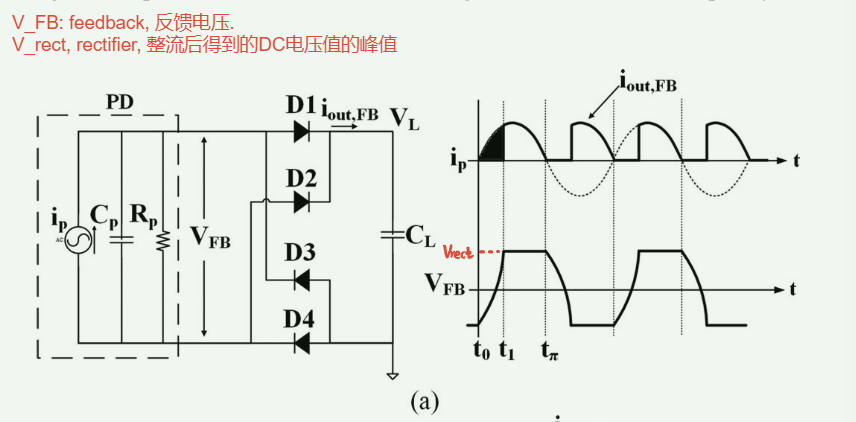
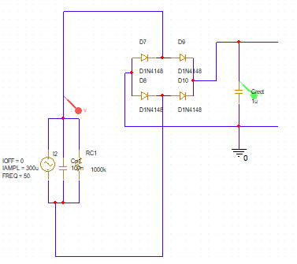
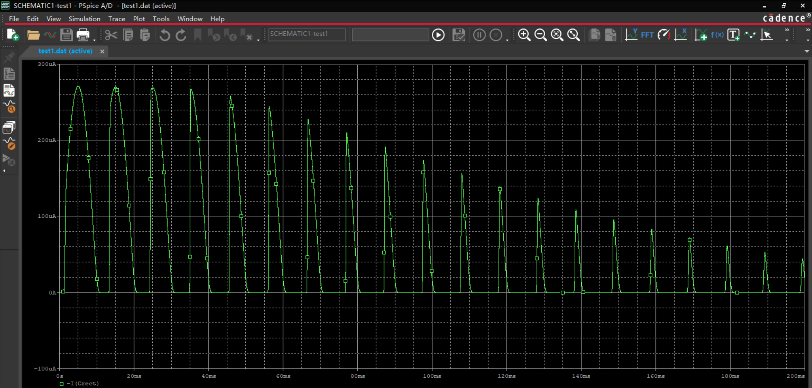
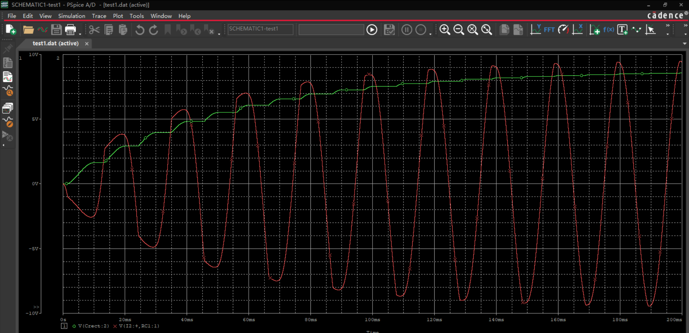
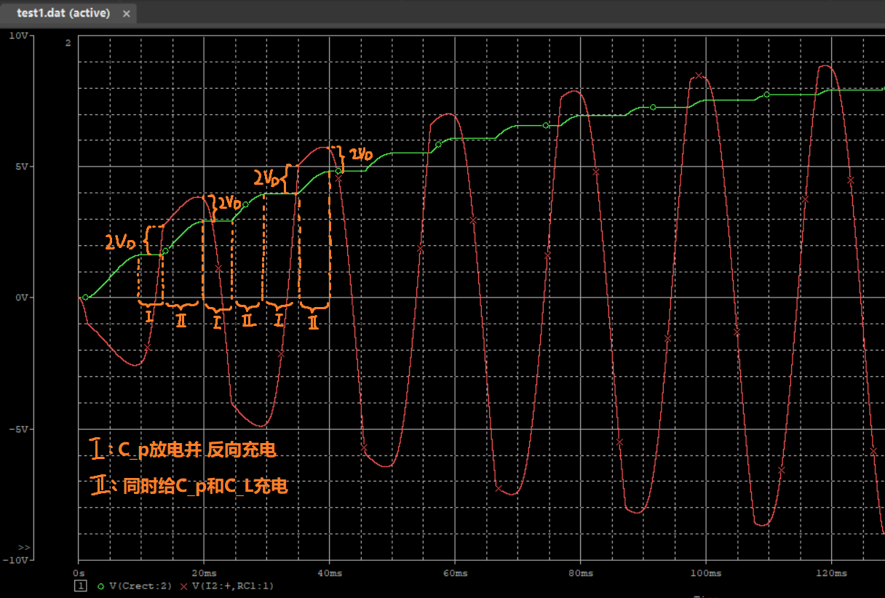
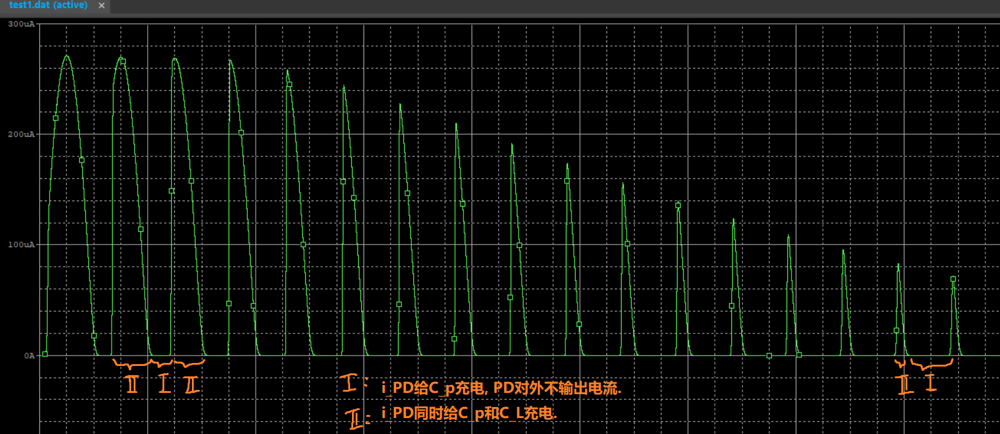

##

##

## full_wave

其中:
- $V_{FB}$: feedback, 反馈电压. 
- $V_{rect}$, rectifier, 整流后得到的DC电压值的峰值

实际上的仿真结果:
电路图:

$i_L$曲线:

$V_L(green)$ & $V_{FB}(red)$曲线

全波整流下, 每次PD想要给$C_L$充电时, 首先需要克服整流电桥的$2V_D$导通电压; 其次需要输出电压$V_{FB}$达到和当前$C_L$储存电压的高度, 才可以开始给$C_L$充电.

然而发现, $V_{FB}$同时也是$C_p$两端电压, 也就是说, 每次PD想要给$C_L$充电时, 都需要先将$C_p$充电到$±(C_L+2V_D)$, 才能开始给$C_L$充电.

可以看出, 该电路下1u的电容大概300ms充分充电. 而$V_{rect}$是一个简化的概念, 即认为Ⅱ阶段的$V_{FB}$

## voltage doubler

##

##

