# 0. ???

# 1. 计算机组成.

## 1.0 杂项

### 1.0.1 大端序(big-endian) & 小端序(little-endian)

指的是数据在内存中, **以字节为单位的**的存放数据.

但是在一个字节(8bit)内部, 永远是小端序.

* 小端序(x86, ARM, RISCV...):
低地址放低字节, 高地址放高字节.


* 小端序(TCP等协议):
低地址放低字节, 高地址放高字节.


例如有一个32bit数: `0x12345678`

对应4个字节分别存放`0x12`, `0x34`, `0x56`, `0x78`

小端序:

|地址 |  数据 (1字节)|
|--|--|
|0x1000 | 78   <- 最低有效字节|
|0x1001  |56|
|0x1002  |34|
|0x1003  |12   <- 最高有效字节|


我们在汇编语言无需在意, 默认小端序就可以了.

## 1.1 概述

组成计算机的5个经典部件:

* **输入**(键盘, 鼠标, LCD(带电容来触摸), 摄像头...)和**输出**(LCD(带电容来触摸), 音响...). 统称为**I/O设备**
* 存储器
* 数据通路(**运算器**)和**控制器** (合称为**处理器/中央处理单元/CPU**)
  * 数据通路(datapath)


## 1.2 内存

* **DRAM**(动态随机访问存储器. 易失性) 作为计算机的内存. 存储程序运行时的信息. 如DDR4/5内存条. 目前的主流DRAM技术是**D DR S DRAM(double datarate sync DRAM)**: 双倍数据速率-同步-DRAM. SDRAM是一次重大革新, 它给DRAM加入了时钟, 实现同步通信, 速度变快很多. DDR技术则进一步在时钟上下沿都传输数据, 实现速度翻倍.

* **SRAM**(静态随机访问存储器, 易失性)比DRAM更快, 集成度更低. 用在CPU/GPU的寄存器堆; 一些SoC也有片上SRAM作为快速工作内存. 最多几MB.

* **高速缓存**(cache memory)一般作为普通内存的缓冲.
* 主存: 可以理解为DRAM, 计算机的内存.
* 闪存/固态硬盘/SSD: 非易失性半导体存储. 更慢更便宜.  写入一定次数后损坏.
* 磁盘/硬盘/机械硬盘: 旋转盘片的磁介质材料非易失性存储. 


## 1.3 **ISA**/指令系统体系结构/体系结构/instruction set architecture/architecture/指令集架构

它是一本协议手册. 是硬件和软件之间的接口, 或者说契约. 它包含了程序员写二进制机器语言所需要的全部信息. 


操作系统封装了一些低级的功能, 提供给程序员基本指令系统和操作系统接口, 合称为**应用二进制接口(application binary interface, ABI)**.

ABI也是一本手册. 它规定:
-   **调用约定**：函数参数怎么传（寄存器？栈？），返回值放哪。 
-   **系统调用接口**：比如 Linux 的 `read()`、`write()` 系统调用号。  
-   **二进制格式**：可执行文件用 ELF 还是 PE。
-   **数据布局**：结构体、对齐方式、字节序。

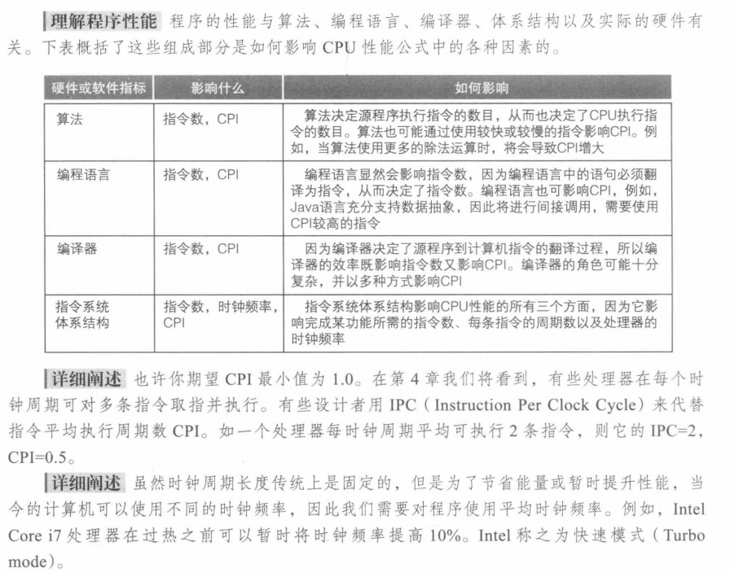


## 1.4 计算机系统的状态机模型


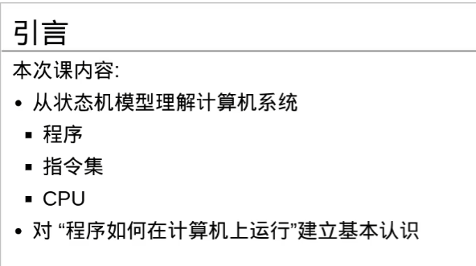


简单回忆一下状态机

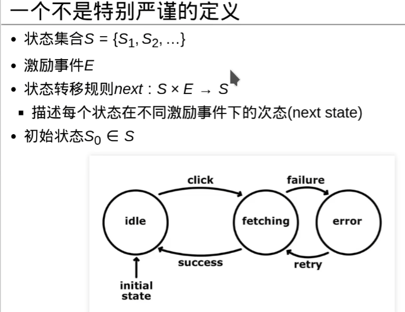


**程序是个状态机.**


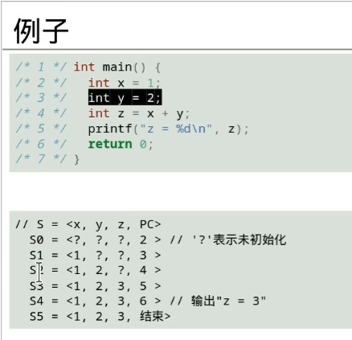

事实上, C程序并不是从main()第一条指令开始, return指令结束的.
main函数其实也是有其他函数调用的.

main函数的第一次调用来自OS/运行时环境, 这个就是宿主环境.

之后的函数调用都是程序内部调用.

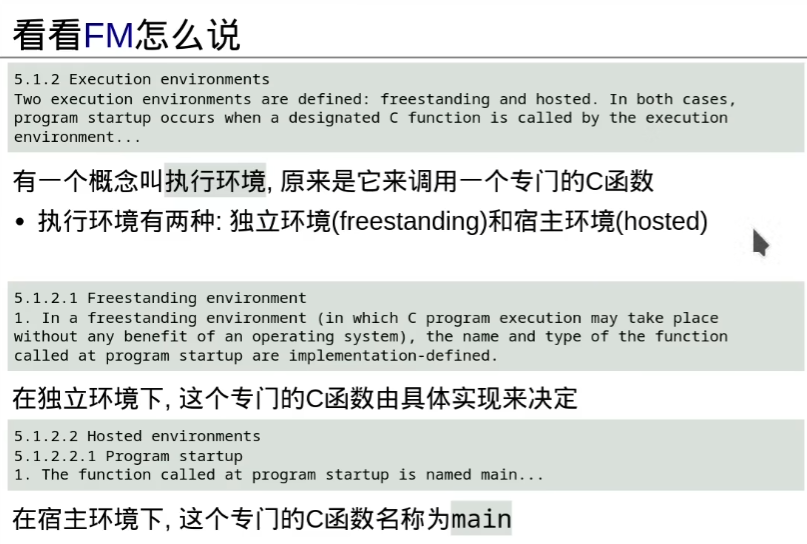

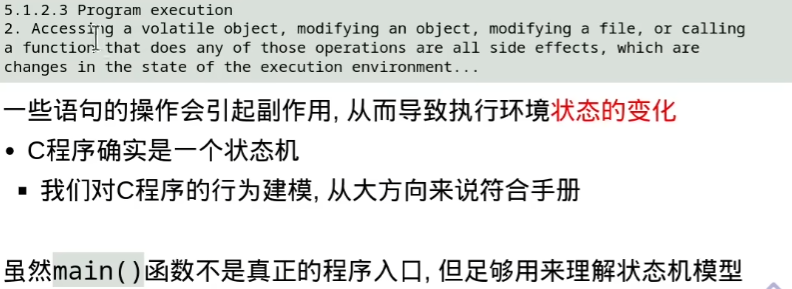


**CPU是个状态机**.

这是显然的, 数字电路是状态机.

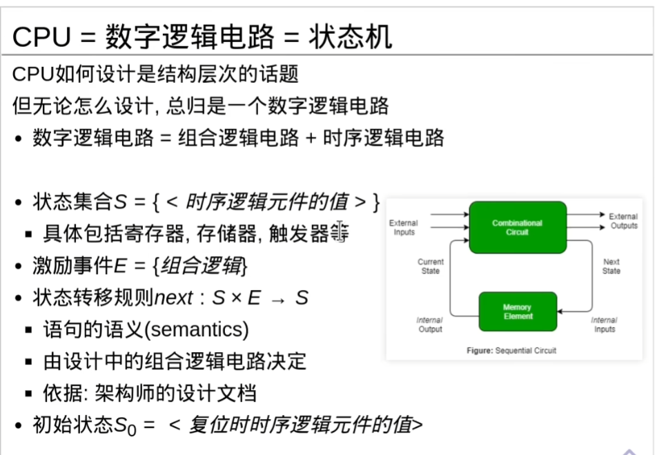

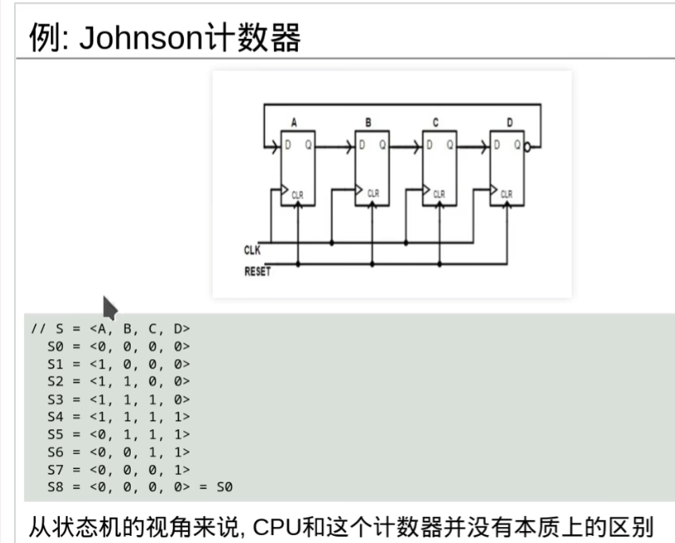


**指令集是个状态机**.


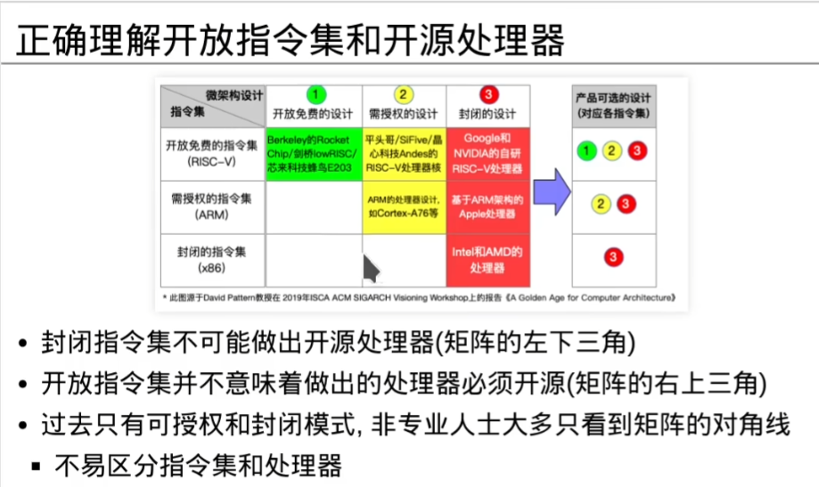


👇下面的指令集状态机是简化版本的指令集. 真正的指令集不但有指令, 还有很多内存管理, I/O, 中断, 异常等等部分, 是状态更复杂, 转移规则更复杂(考虑I/O也作为规则等等)的状态机.

>R即寄存器; 包括PC和(RISC-V)32个通用整数寄存器;
>M即内存.
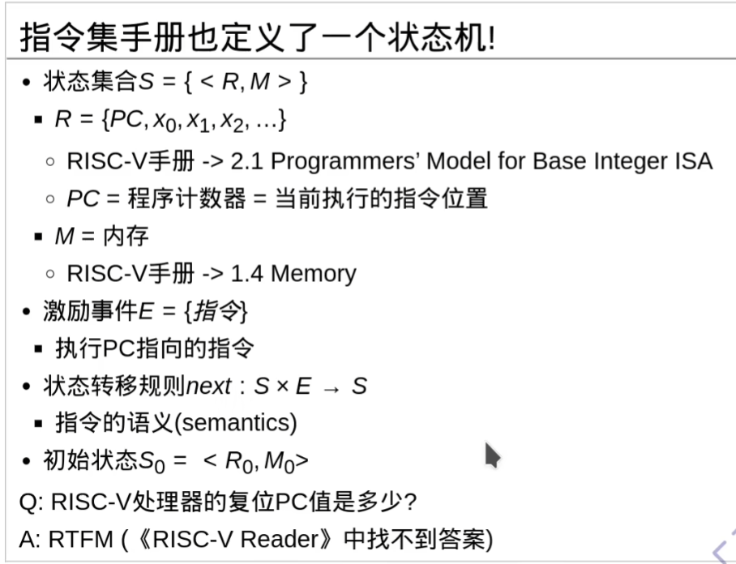


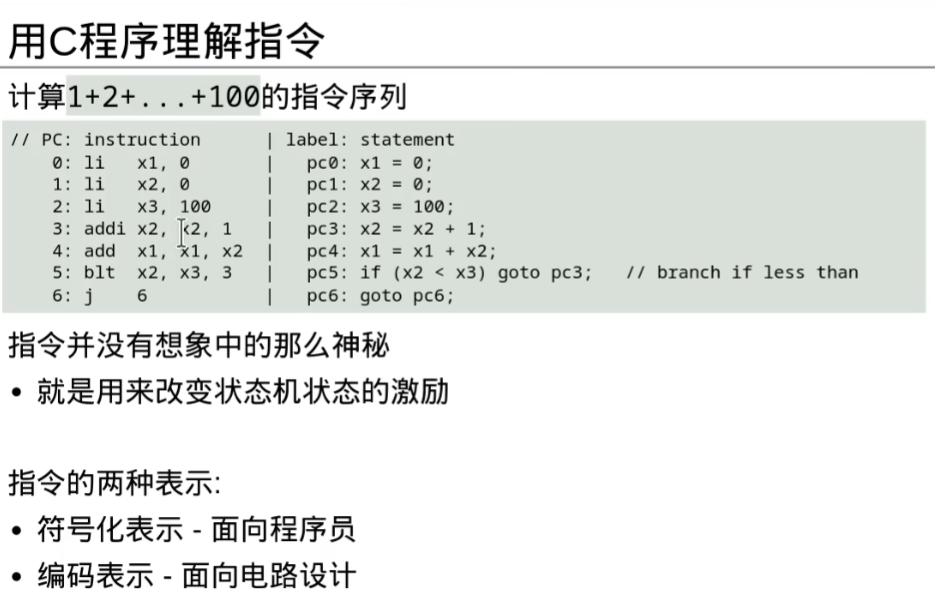

**程序, 指令, CPU状态机如何联系在一起?**
编译器实现这件事.

* **程序运行状态机**和**指令状态机**的转换: **编译器**
  * $s_{compile}$: 这个映射将描述程序运行的一组状态(即程序计数器和所有程序内变量的值)一一映射为指令集的一组状态(即寄存器+内存单元的值)
  * $e_{compile}$:这个映射将程序状态机的激励时间(函数语句)一一映射为汇编指令.
* **指令状态机**和**CPU状态机**的转换: 这个就是简单的数字电路一一对应咯


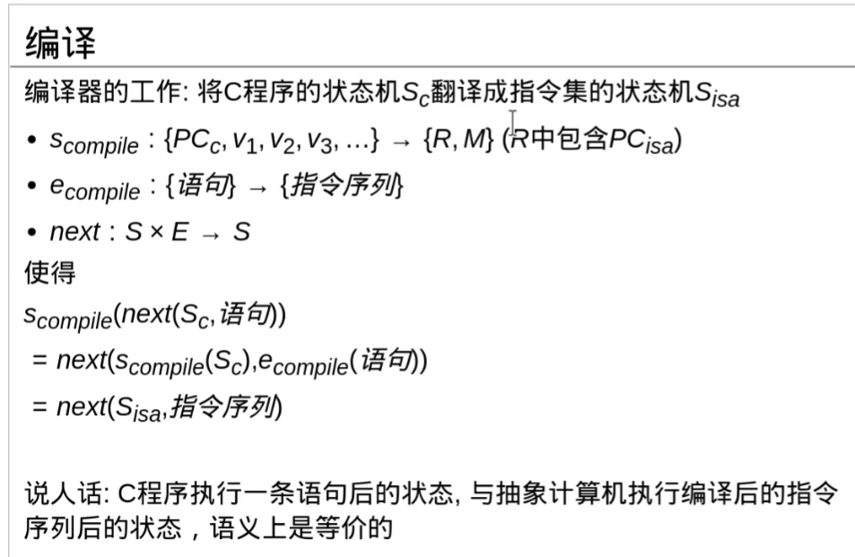


程序在CPU上运行的完整步骤:

| 步骤 | 内容 |
|------|------|
| 1 | 根据指令集手册的功能描述，画一张 CPU 的电路图 → **结构设计** |
| 2 | 用 RTL 代码描述 CPU 电路图 → **RTL 设计** |
| 3 | 根据 RTL 代码生成版图文件 → **后端物理设计** |
| 4 | 根据版图文件生产芯片 → **制造生产** |
| 5 | 编写程序 → **软件编程** |
| 6 | 将程序翻译成指令集手册中描述的指令序列 → **编译** |
| 7 | 程序在 CPU 上执行 = 指令序列控制 CPU 芯片电路进行状态转移 |
| 8 | 三个状态机产生联系：Sc ~ Sisa ~ Scpu |

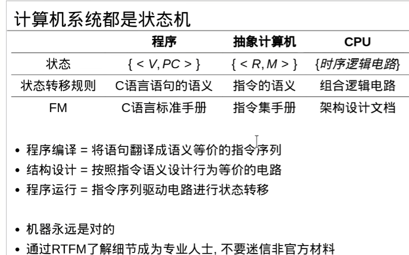


## 1.5 程序的执行和模拟器

### 1.5.0 引言


### 1.5.1 交叉编译器 riscv64-unknown-elf-gcc交叉编译器

#### 1.5.1.0 前言: 本地编译和交叉编译的区别

它是相对于**本地编译**来说的.

##### 1.本地编译:

你在一台 **x86 的电脑**上写了 `a.c`，然后用普通的 `gcc` 编译：
```bash
gcc a.c -o a.out
```
编译器生成的 `a.out` 就是 **能在这台 x86 电脑上直接运行**的程序。  

👉 源代码和目标程序运行的环境（架构、系统）是一样的。

##### 2.  交叉编译(cross compilation)* 
你还是在 **x86 的电脑**上写 `a.c`，但是这次你想要它在 **RISC-V CPU** 上运行。  
那你得用一个“交叉编译器”：
    

```bash
riscv64-unknown-elf-gcc a.c -o a.elf
```
这个编译器不是生成 x86 机器码，而是生成 **RISC-V 的机器码**。  
👉 源代码和目标程序运行的环境 **不一样**。

换句话说：
-   编译发生在 x86 电脑上    
-   运行发生在 RISC-V 芯片（或者 QEMU 模拟的 RISC-V CPU）上
    
这就叫 **交叉编译**。

* 🚩 为什么要交叉编译？

  因为很多时候目标环境太弱（比如嵌入式开发板、微控制器）：
  -   它可能根本跑不动编译器   
  -   或者内存/存储不足  
      所以只能在 PC 上编译好程序，然后“交叉编译”成目标机器能跑的二进制，再烧进去或放进去运行。

#### 1.5.1.1 使用 riscv64-unknown-elf-gcc

***
我们选择交叉编译器`riscv64-unknown-elf-gcc`.
  -   **`riscv64`** → 目标架构是 RISC-V 64-bit（但它也能编译出 32-bit 的代码，加参数就行）    
  -   **`unknown`** → 没有指定具体厂商/平台（通用）    
  -   **`elf`** → 目标文件格式是 ELF（Executable and Linkable Format，Linux/嵌入式常用的可执行文件格式）   
  -   **`gcc`** → 编译器前端，C/C++ 源码编译器


安装它.
```bash
sudo apt install gcc-riscv64-unknown-elf
```

---
---

使用它.

```bash
riscv64-unknown-elf-gcc a.c -o a.elf
```
* 使用默认选项, RV64来编译.


**RV32裸机开发时的编译选项:**
```bash
riscv64-unknown-elf-gcc -march=rv32i -mabi=ilp32 -ffreestanding -nostdlib -Wl,-Ttext=0x80000000 -O2 a.c -o a.out
```


-   `-march=rv32i` → 目标架构是 RV32I 基础指令集    
-   `-mabi=ilp32` → ABI（应用二进制接口），使用 32-bit 寄存器宽度    
-   `-ffreestanding` → 告诉编译器这是裸机环境，不依赖标准库    
-   `-nostdlib` → 不链接 C 标准库（因为裸机没 libc）    
-   `-Wl,-Ttext=0x80000000` → 链接选项，把程序`_start()`入口点地址设为虚拟地址`0x80000000`。   
-   `-O2` → 优化等级    
-   `-o a.out` → 输出文件名


#### 1.5.1.2 riscv64-linux-gnu工具链


### 1.5.2 架构模拟器 QEMU(Quick EMUlator)

QEMU是一个开源的 **硬件模拟器**。

它能在你的 PC 上虚拟出各种 CPU 架构和硬件（x86、ARM、RISC-V、MIPS…），这样你就能：

-   在没有 RISC-V 硬件的情况下，模拟一台 RISC-V 板子；    
-   把你编译好的 **裸机程序** 或 **操作系统内核** 在 QEMU 里跑起来。
-   你需要写好程序源码(.c文件), 然后使用


在ubuntu上安装它.
```bash
sudo apt update
sudo apt install qemu-system-misc
```

安装完以后，你就有了很多命令，比如：
-   `qemu-system-riscv32` → 模拟 32 位 RISC-V 系统  
-   `qemu-system-riscv64` → 模拟 64 位 RISC-V 系统


注意qemu是一个大框架, 包含很多可执行程序:
qemu-system-<架构>

比如：
-   `qemu-system-x86_64` → 模拟 64 位 x86    
-   `qemu-system-arm` → 模拟 ARM    
-   `qemu-system-riscv32` → 模拟 RISC-V 32 位    
-   `qemu-system-riscv64` → 模拟 RISC-V 64 位

查看其中每个模拟器的版本:

```bash
azazel@DESKTOP-NJKSK6O:~/test$ qemu-system-riscv32 --version
QEMU emulator version 6.2.0 (Debian 1:6.2+dfsg-2ubuntu6.26)
Copyright (c) 2003-2021 Fabrice Bellard and the QEMU Project developers
```


### 1.5.3 程序运行在什麽环境?? 一个例子: 一个裸机(freestanding)环境C程序

程序运行在裸机环境(freestanding)或操作系统环境.

***

**选择qemu-system-riscv32作为freestanding环境,
riscv64-unknown-elf-gcc作为交叉编译器.**

***

0x10000000是qemu-system-riscv32中virt机器模型的串口地址.


***
**实验步骤:**
***
1. 写一个在逻辑环境中运行的_start()函数`a.c`
```c
#include <stdio.h>
void _start(){
    volatile uint8_t *p = (uint8_t *)(uintptr_t)0x10000000;
    *p = 'A';
    while(1);
}
```

2. 使用编译指令:
```bash
riscv64-unknown-elf-gcc -march=rv32i -mabi=ilp32 \
    -ffreestanding -nostdlib -Wl,-Ttext=0x80000000 -O2 \
    a.c -o a.out
```


-   `-march=rv32i` → 目标架构是 RV32I 基础指令集    
-   `-mabi=ilp32` → ABI（应用二进制接口），使用 32-bit 寄存器宽度    
-   `-ffreestanding` → 告诉编译器这是裸机环境，不依赖标准库    
-   `-nostdlib` → 不链接 C 标准库（因为裸机没 libc）    
-   `-Wl,-Ttext=0x80000000` → 链接选项，把程序`_start()`入口点地址设为虚拟地址`0x80000000`。   
-   `-O2` → 优化等级    
-   `-o a.out` → 输出文件名


3. 使用qemu模拟一个riscv32架构来运行它:


```bash
qemu-system-riscv32 -nographic -M virt -bios none -kernel a.out
```

-   **`qemu-system-riscv32`** → 启动 32 位 RISC-V 的 QEMU 模拟器    
-   **`-nographic`** → 不开图形界面，用终端输出（方便调试）    
-   **`-M virt`** → 模拟一台 “virt” 虚拟开发板（常见的通用机型）    
-   **`-bios none`** → 不加载 BIOS（因为你是 `-ffreestanding -nostdlib`，直接跑裸机程序）    
-   **`-kernel a.out`** → 把你刚刚编译好的 ELF 程序加载到虚拟机内存并执行

结果:顺利打印出A然后进入死循环.

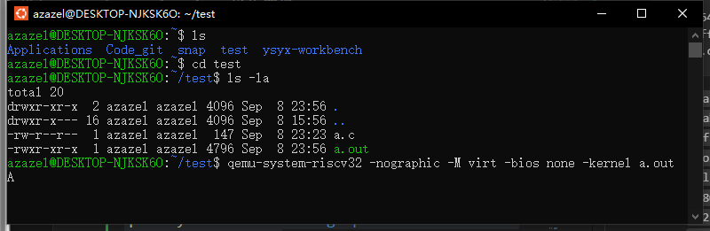


***

4. 然后我们来看看这个程序的汇编指令: (使用`riscv64-unknown-elf`交叉编译器工具链(安装见1.5.-1)内提供的objdump命令)

```bash
riscv64-unknown-elf-objdump -d a.out
```

输出:


```bash

a.out:     file format elf32-littleriscv


Disassembly of section .text:

80000000 <_start>:
80000000:       100007b7                lui     a5,0x10000
80000004:       04100713                li      a4,65
80000008:       00e78023                sb      a4,0(a5) # 10000000 <_start-0x70000000>
8000000c:       0000006f                j       8000000c <_start+0xc>
```

*** 

每一行是一条汇编指令.  以`80000000:       100007b7                lui     a5,0x10000
`为例, 
-   **`80000000:`**    
    -   这是这条指令所在的内存地址（PC = Program Counter）。        
    -   意味着 `_start` 函数的第一条指令位于 `0x80000000`。
        
-   **`100007b7`**    
    -   这是这条指令的 **机器码（十六进制编码）**。        
    -   RISC-V 每条指令固定 32 位（4 字节），所以 `0x100007b7` 就是这条 `lui` 的编码形式。        
    -   CPU 实际执行的就是这个机器码。
        
-   **`lui`**    
    -   这是指令助记符（Mnemonic），是人类可读的汇编指令。        
    -   `lui` = Load Upper Immediate（把立即数放到寄存器的高 20 位）。
        
-   **`a5,0x10000`**    
    -   指令的操作数。        
    -   表示：把立即数 `0x10000` 加载到寄存器 `a5` 的高 20 位。        
    -   执行后 `a5 = 0x10000 << 12 = 0x10000000`。


***
***

**三条指令的意思:**

* 1\. `80000000: 100007b7 lui a5,0x10000`
  -   `lui` = Load Upper Immediate    
  -   把 `0x10000` 放到寄存器 `a5` 的高 20 位    
  -   结果：`a5 = 0x10000 << 12 = 0x10000000`  
      （正好是你代码里写的 `0x100000` 地址，只是 C 编译器用 `lui` 搞成 32 位完整地址）
    

* * *

* 2\. `80000004: 04100713 li a4,65`
  -   `li` = Load Immediate（伪指令）    
  -   实际上等价于：`addi a4, x0, 65`   
  -   所以 `a4 = 65 = 0x41 = 'A'`
    

* * *

* 3\. `80000008: 00e78023 sb a4,0(a5)`
  -   `sb` = store byte    
  -   把 `a4` 中的 65 (`'A'`) 存到 `[a5 + 0]` 地址里   
  -   因为 `a5 = 0x10000000`   
  -   实际操作： `*0x10000000 = 'A'`
    

也就是往内存/外设写入一个 ASCII 字母 A。  
这一步就是你代码里 `*p = 'A';`

* * *

* 4\. `8000000c: 0000006f j 8000000c`
  -   `j` = jump，无条件跳转    
  -   直接跳回自己，形成死循环    
  -   对应 C 代码里的 `while(1);`
    

* * *

* 总结
1.  程序从 `0x80000000` 开始运行   
2.  准备了地址 `0x10000000`  
3.  往那个地址写入 `'A'`    
4.  程序停在死循环


### 1.5.4 程序怎麽结束? 一个例子:

阅读C99手册:
***
5.1.2.1 Freestanding environment
2 The effect of program termination in a freestanding environment is implementation-defined(由实现定义的).
***
在裸机环境下, 程序终止并没有一个标准的函数来结束, 需要根据具体硬件提供的方式来退出.


我们同样使用`riscv-unknown-elf-gcc`作为交叉编译器, `QEMU`作为架构模拟器, 进行裸机C开发.

**QEMU virt 机器的退出机制**
- 在 QEMU 的 `virt` 机器模型上，提供了一个**模拟的硬件设备(映射到32bit宽寄存器)**来接收退出信号。
- 这个设备被映射到内存中的一个特殊地址`0x100000`。向这个地址写入一个特定的“魔法数字 (magic number)(`0x5555`)”，QEMU 监视器就会捕获到这个操作，并认为用户请求退出，从而优雅地关闭整个模拟器.
-  它检测其32位寄存器的低16位是否为0x5555(即`if ((written_value & 0xFFFF) == 0x5555)`)


1. 我们写一个`b.c`
```c
#include <stdin.h>

void_start(){
  //向QEMU的串口地址的第一个8字节写一个"A". 注意到该模拟串口是8bit位宽的设备(只支持8bit的ASCII码).
  volatile uint8_t *p = (uint8_t *)(uintptr_t)0x10000000;
  *p = 'A';

  //向虚拟退出设备对应内存写一个0x5555. 该虚拟机是32位的, 
  volatile uint32_t *exit = (uint32_t *)(uintptr_t)0x100000;
  *exit = 0x5555; //对该地址写入魔法数字0x5555

  _start();//正常情况下, 不会执行到这一句. 因为上一条指令已经导致 QEMU 退出了。如果因为某种原因退出失败，这会导致程序无限递归，重新尝试退出。
}

```

2. 然后交叉编译它得到可以在rv32架构上跑的可执行文件:
```bash
riscv64-unknown-elf-gcc -ffreestanding -nostdlib -Wl,-Ttext=0x80000000 -O2 b.c -o b.out
```
* 注意如果没有加freestanding选项, 编辑器就不会自带一个最小的内置头文件集合, 会报错找不到stdint.h.

3. 然后再QEMU上运行它:
```bash
qemu-system-riscv32 -nographic -M virt -bios none -kernel b.out
```


4. 看看反汇编:
```bash
azazel@DESKTOP-NJKSK6O:~/test$ riscv64-unknown-elf-objdump -d b.out

b.out:     file format elf64-littleriscv


Disassembly of section .text:

0000000080000000 <_start>:
    80000000:   100007b7                lui     a5,0x10000
    80000004:   04100713                li      a4,65
    80000008:   00e78023                sb      a4,0(a5) # 10000000 <_start-0x70000000>
    8000000c:   6795                    lui     a5,0x5
    8000000e:   00100737                lui     a4,0x100
    80000012:   55578793                addi    a5,a5,1365 # 5555 <_start-0x7fffaaab>
    80000016:   c31c                    sw      a5,0(a4)
    80000018:   8082                    ret
```

* `0000000080000000 <_start>:` 表示`_start`符号在可执行文件的虚拟地址(VA) `0000000080000000`. 这是因为我们编译时用的命令为`riscv64-unknown-elf-gcc -ffreestanding -nostdlib -Wl,-Ttext=0x80000000 -O2 b.c -o b.out`, 其中`-Wl,-Ttext=0x80000000`即告诉链接器把 .text 段（代码段）放到虚拟地址 0x80000000 开始。
* **第1条指令**: `80000000:   100007b7                lui     a5,0x10000`
  * `80000000:` 表示该指令的内存地址. noted: rescv32模拟下, 内存地址是按byte寻址的, 所以一条指令为32/8=4byte, 下一条指令应该在`80000004`.
  * `100007b7` 该指令的32位机器码内容对它反汇编, 就得到了注记符人类可读形式的指令: `lui a5, 0x10000`. 它是**U-type**指令.
    * 高20位正好是`0x10000`, 对应lui指令的imm[31:12] . 
    * 再低5位是`01111`即`0x15`, 对应寄存器x15(a5).
    * 最低7位是`011 0111`, 对应指令`lui`.
  * 这条指令将寄存器`x15`存入数据`0x10000000`. 这是QEMU的模拟串口基地址.
* **第2条指令**: `li      a4,65`
  * 将`x14`寄存器存入`65`, 即'A'
* **第3条指令**: `sb      a4,0(a5) # 10000000 <_start-0x70000000>`
  * 注释表示: `a5`寄存器内的值, 以及其相对于`_start`地址的偏移量为`-0x70000000`. 
  * 该指令往`a5`寄存器的值地址`10000000`写入了寄存器`a4`的低8位数据, 即写入了'A'(或者说`0x65`)
* **第4条指令**: `lui     a5,0x5`
  * 向`a5`寄存器写入`0x5<<12`, 即写入`0x5000`. 这是退出魔法数字`0x5555`的高位. 一会儿指令6会用addi补全低位.  
  * 覆盖了`a5`刚刚存储的写入数据地址`10000000`, 因为已经用完了.
* **第5条指令**: `lui a4,0x100`
  * 向`a4`写入`0x100 000`. 这是一会让要写入魔法数字的地址.
* **第6条指令**: `addi a5,a5,1365 # 5555`
  * 把`a5`增加`1365(dec)=0x555`, 最终结果是`a5=0x5555`. 注释提示最终结果. 这就构造好了魔法数字.
* **第7条指令**: ` sw a5,0(a4)`
  * 写入魔法数字. 把`a5`的32bit直接写入`a4`地址. 
* **第8条指令**: `ret`
  * 伪指令. 展开为`jalr x0, ra, 0`. 因为裸机开发时程序入口点是`_start`, 它不是别的函数调用的. 此时ra未定义, 这条指令会跳到奇怪的地方. 不过正常情况下第七条指令就结束了, 本指令不会运行.


## 1.6 RISCV架构

### 1.6.0 RISCV架构的寄存器

它有32个32bit宽的通用寄存器x0~x32, 其中x0永远为0x0, 

    **读取 x0** → 永远得到 `0`  

    **写入 x0** → 指令执行了，但结果会被丢弃，不会改变 x0 的值。

**它们有约定的用途.**

| 名称        | ABI Mnemonic/注记符/别名    | 用途  | preserved across calls?       |
| --------- | -------- | ------------------------------ |-- |
| `x0`      | `zero`   | 永远为 0      |   --(immutable)      |
| `x1`      | `ra`     | return address，函数返回地址|no          |
| `x2`      | `sp`     | stack pointer，栈指针   | yes          |
| `x3`      | `gp`     | global pointer，全局指针    |--(unallocatable)        |
| `x4`      | `tp`     | thread pointer，线程指针  |--(unallocatable)          |
| `x5–x7`   | `t0–t2`  | 临时寄存器（调用者保存） |no                  |
| `x8`      | `s0/fp`  | saved register / frame pointer |yes|
| `x9`      | `s1`     | saved register   |yes      |
| `x10–x17` | `a0–a7`  | 参数/返回值寄存器       |no               |
| `x18–x27` | `s2–s11` | 被调用者保存寄存器   | yes                   |
| `x28–x31` | `t3–t6`  | 临时寄存器           | no               |

preserved across calls? 这一项描述一个函数(caller)调用另一个函数(callee)时, 对该寄存器的操作/

* yes: callee-saved, 被调用者保存. 
  * 如果callee想用这个寄存器, 必须先把它的原先值保存(写到栈内存里维护起来)再覆写. 该callee函数运行结束后, **必须将其恢复原状**, 以供回到caller函数继续运行时使用.
* no: caller-saved, 调用者保存.
  * 调用一个子函数后, callee可能直接覆写这个寄存器, 把里面的内容抹除. caller必须保证不往里面存储调用callee结束后自己可能还要使用的数据, 或者自己做好内容保存后再调用callee.
* x3, x4不可以随便分配覆写, 故不讨论. x0≡0没有讨论意义. 


# 3 流水线

## 3.0 流水线的硬件结构

RISCV使用**五级流水线**：取指 (IF,instruction fetch) → 译码 (ID, instruction decode) → 执行 (EX, instruction execute) → 存储访问 (MEM, memory) → 写回 (WB, write back)。 这也继承了经典的MIPS(是的这个架构已经死了)风格.

这意味着一块RISCV架构的CPU有5个功能独立的单元:
| 阶段  | 硬件    | 功能           |
| --- | -------------- | ------------ |
| IF  | 取值器| 从指令存储器取出指令，同时 PC 自增 +4 |
| ID  | 译码器 | 解析指令，**同时读寄存器堆**，生成控制信号 |
| EX  | ALU  | ALU 运算、分支计算、乘法等   |
| MEM | 访存器| 访问**数据存储器(内存)**（load/store）|
| WB  | 写回器| 将结果写回**寄存器**   |

理想情况下, 在每个时钟周期, 每个单元都能处理一条完整的指令.

***
一些指令不涉及内存, 比如`ADD x3, x1, x2   ;x3 <= x1 + x2`

所以在流水线中, MEM阶段会空转.
***

现在考虑**分支**情况(跳转指令)

假设我在**3级流水线结构**运行一段程序, 其中有一个跳转指令J.
从某刻开始计时, 第一个时钟周期时, J指令进入到IF.

| 周期 | IF        | ID    | EX       | 说明                                                |
| -- | --------- | ----- | -------- | ------------------------------------------------- |
| 1  | J         | J-4     | J-8        | J 取指                                              |
| 2  | J+4  | J     | J-4        | J 译码；顺序下一条取指                                      |
| 3  | J+8 | J+4    | J (计算目标) | **J 执行改变 PC** , 向下游IF, ID发送**冲刷信号**.         |
| 4  | target 指令 | I1 冲刷 | -        | PC 已更新 → 从跳转目标取指；I1 因为没依赖没必要执行，但如果有流水线机制可能也会丢弃/忽略 |

* 在流水线CPU里, 每一级用触发器连接, 确保每一级的输入/输出都对其在时钟边沿.
* 在周期**3**:
  * `EX`执行`J`导致`PC`被修改. 这个结果存在寄存器里, 下一个时钟边沿才会真正写入PC, 所以在周期**3**, `IF`尝试取指还是会读取`PC`取到`J+8`这条指令.
  * `PC`被修改后, 发送**冲刷flush信号**给`EX`的所有上游模块, 即`IF`和`ID`. 它是一个`NOP`信号, 即拒绝 储存这些模块的运行结果的 **触发器** 在下个时钟周期边沿尝试输出. *`IF`, `ID`的工作结果被丢弃了.*
* 在周期**4**: 
  * `EX`输出工作结果(改变`PC`值). 因为没有接收到上一级`ID`输出, 本周期什麽也不做.
  * `ID`丢弃工作结果(对指令`J+4`的译码). 因为没有接收到上一级`IF`输出, 本周期什麽也不做.
  * `IF`丢弃工作结果(对指令`J+8`取指). 作为底层模块, 它读取`PC`在本周期的值(即跳转后), 然后取这个新地址的指令`target`.


## 3.1 冒险 (Hazard) 和解决方式

### 3.1.0 流水线冒险和其他冒险

3.1之后的冒险特指流水线冒险, 是**指令级**的问题.

还有一些其他场合的冒险, 如:

时序冒险: **电路级**的物理问题, 即一个复杂的组合逻辑会因为不同路信号速度不一样, 输出稳定之前发生尖峰毛刺等杂波.


流水线里多个指令重叠执行，但有时候会互相干扰，就叫**冒险**。

流水线级数越高, 冒险越复杂. 通过下面的例子就可以理解为什麽.

冒险主要分三种.

### 3.1.1  **结构冒险 (Structural Hazard)**
- 硬件资源不够导致冲突。 例如：取指和访存同时都要访问内存，但 CPU 只有一个端口，冲突了。  

### 3.1.2  **数据冒险 (Data Hazard)**

-  后面指令用到前面指令的结果，但结果还没准备好。  这一办法 
-  例如考虑一个**5级流水线 IF-ID-EX-MEM-WB** 的arm架构发生数据冒险:
    
```asm
ADD x1, x2, x3   # x1 = x2 + x3 
SUB x4, x1, x5   # 这里立刻用到x1，但ADD结果还没写回
SUB X6, X1, X5   # 
```  
分析时间线:

| 周期 | ADD 指令  | SUB1 指令   |SUB2 指令|
| -- | -------- | -------- |--|
| 1  | IF       |    --      |--          |
| 2  | ID       | IF       |--            |
| 3  | EX       | ID        |IF           |
| 4  | MEM(空转) | **EX(计算了过时的`x1`!)**       |ID|
| 5  | WB (写x1) | MEM      |**EX(计算了过时的`x1`!)**|
| 6  |   --     | WB (写x4) |MEM            |

* 在周期4, 
  * `ADD`指令进入MEM阶段. 因为`ADD`不需要对内存访问, 该阶段空转.
  * `SUB1`进入EX阶段. ALU访问寄存器进行减法操作. 此时`ADD`指令还未进行到WB把结果写回到寄存器, 所以**SUB1访问到的`x1`还是未进行`ADD`的值**. 出现错误.
* 在周期5,
  * `ADD`执行WB, 写回`x1`. 这个结果要在下一个时钟上沿才更新. 但是已经晚了, `SUB1`已经读了早先的`x1`.
  * `SUB2`进入EX阶段. 同样地, 也取了旧的x1值, 出现错误.

### 3.1.3 数据前递/旁路转发(Forwarding/Bypassing)

**数据冒险的解决常用办法.** 

ALU的**输入端**有一个多路选择器, 选择:
* 来自前一条(用一个触发器延时), 前前一条(用两个触发器延时)...指令的ALU输出
* 寄存器堆读口值(也就是本来应该拿的ID部分解码出来的对应寄存器值)

当**旁路逻辑检测到相近的指令会发生数据冒险**时, 发送控制信号决定ALU的输入端.

比如我们的数据冒险例子里, 旁路检测逻辑发现SUB1和SUB2都会和ADD发生数据冒险.


于是:
* 在周期4, 旁路转发阻止ALU读取寄存器堆, 而是直接读取上个周期的输出信号.
* 在周期5, 旁路转发阻止ALU读取寄存器堆, 而是直接读取上上个周期的输出信号.

### 3.1.4 气泡stall法: 流水线暂停几个周期，等数据准备好再继续。

解决数据冒险, 如果没有旁路电路, 就只能...

识别到指令序列出现数据冒险, 就插入空泡. 也就是识别到SUB1会和ADD冒险时, 在中间插入两个**空指令**.


### 3.1.5  **控制冒险 (Control Hazard)**

和数据冒险很像. 只不过此时读取到旧的寄存器是**PC**. 

**相比32个通用寄存器, PC拥有更特殊的电路:**

* 自加电路: 任何一个指令执行IF时, PC+4.
* 快速更新: 设计PC改变的指令(如J指令)**在EX环节就更新PC**, 而不是等到WB环节. 
* 其他跳转机制: PC有很多捕获其他中断异常信号然后改变值的旁路逻辑.

**对J指令来说, MEM和WB阶段都什麽也不用做.**

可是即使是三级流水线也会出现距离为1的指令之间数据冒险.

对于五级流水线, J指令之后的那条指令J+4会被流水线执行:


| 周期 | J 指令  | J+4 指令   | J+8 指令| J+12指令
| -- | -------- | -------- |--|--|
| 1  | IF       |    --      |--  |--|
| 2  | ID       | **IF**     |--  |--|
| 3  | **EX(发出PC跳转信号. 发出flush信号.)** | ID  |**IF**  |--|
| 4  | MEM(空转) | **EX**       |ID, **收到flush信号. 指令终止.**|--(PC已变, 读不到了)|
| 5  | WB (空转) | MEM|--|--|
| 6  |   --     | WB  |--|--|


五级流水线会导致J后面的J+4被流水线执行.


### 3.1.6 分支延迟槽 Branch Delay Slot

这是**控制冒险的解决办法** .

首先这个机制已经过时. 现代CPU使用**分支预测**代替.

**分支延迟槽其实就是我不管**. 执行J+4. 把它叫做**分支延迟槽**.

也就是说五级流水线结构(其实显然三级也一样)会带来**1条分支延迟槽**.

编译器会主动帮你思考这件事, 在J指令后面安排一个本来就要执行的命令, 或者安排一个空指令.

如果程序员自己写汇编, 那就只好记得`J`后面有分支延迟槽了.


### 3.1.7 **分支预测(Branch Prediction)**

这是**控制冒险的解决办法** .

一句话: **分支预测 = 在分支结果未知时，猜测方向和目标，让流水线不断流动。预测错了就 flush，预测对了就几乎没有开销。**

分支预测分为**静态预测**和**动态预测**.


#### 3.1.7.1 **静态预测 (Static Prediction)**
    
    -   不依赖历史信息，编译期或硬件用固定规则决定。
        
    -   常见策略：
        
        -   总是预测“不跳转”
            
        -   后退跳 (loop) 预测“跳转”，前进跳预测“不跳转”       
#### 3.1.7.2 **动态预测 (Dynamic Prediction)**
    
    -   硬件根据运行时的历史信息来预测，能适应程序实际行为。
        
    -   核心思想：分支往往有**局部性**（loop 内连续多次 taken / not-taken）。
        
    -   常见方法：
        
        -   **1-bit predictor**：用一个比特记录上一次分支结果 → 缺点是遇到 loop 的边界（最后一次 not-taken）会预测错。
            
        -   **2-bit predictor**：用两位状态机，必须连续错两次才切换预测方向 → 大幅降低 loop 边界预测失败。

#### 3.1.7.3. **🔹 更高级的预测**

-   **BTB (Branch Target Buffer)**：一个小缓存，记录跳转目标地址，下次遇到同一分支就能马上给出目标。
    
-   **Gshare / Gselect**：利用全局分支历史（多个分支的 taken/not-taken pattern）来预测。
    
-   **Tournament Predictor**：结合多个预测器，动态选择哪个更准。
    
-   现代 CPU（比如 Intel、AMD）甚至用神经网络预测（perceptron-based predictor）。
 


### 3.1.8 lw风险(取数-使用型冒险)

lw(load word)总是最棘手的指令之一. 它在5级流水线里, 直到MEM阶段才产生可用数据. 当lw后面接着一个其他需要它的数据的指令, 比如:

```asm
lw x5, 0(x1)      ; 从内存加载数据到 x5
add x6, x5, x2    ; 使用 x5 的值进行加法
```

**🚧 为什么这个冒险特别？**
* 对于一般的算术指令（如 add），结果在 EX 阶段就可以产生并通过**旁路转发(forwarding)** 解决冒险
* 但 lw 的结果直到 MEM 阶段才可用，无法在 EX 阶段前递给下一条指令
* 所以，必须插入一个气泡（bubble）或停顿一个周期(unable上一级寄存器墙)，让 lw 的结果准备好后再执行 add


##


## 1.8 尝试自己写一个支持RV32的freestanding环境!

QEMU 虽然是个开源项目，但还挺复杂，不利于我们理解细节  
- 25000+ 个源文件，110000+ 行源代码  


### 1.8.1 先设计框架:
让我们来设计一个面向 RISC-V 程序的简单 freestanding 运行时环境！  
- 程序从地址 0 开始执行  
- 只支持两条指令  
  - addi 指令  
  - ebreak 指令  
    - 寄存器 a0 = 0 时，输出寄存器 a1 低 8 位的字符  
    - 寄存器 a0 = 1 时，结束运行  
    - ABI Mnemonic

我们尝试写一个运行在这个环境上的程序.

prog.c
```c

//ebreak()接受两个立即数arg0, arg1, 并把它们分别放进寄存器a0, a1, 然后执行ebreak指令.(注意不是递归执行自己这个函数而是RV的ebreak指令)
static void ebreak(long arg0, long arg1){
  //asm()内联汇编函数. 每一行""内是一条汇编指令. volatile关键字不允许编译器优化掉这断汇编.
  //%0, %1是占位符, 代表后面输入的参数arg0, arg1.
  //汇编代码之后, 第一个`:`后面是输出操作数, 第二个`:`后面是输入操作数.
  //"i"表示立即数约束: 要求该参数是一个编译时常量.
  //"r"表示寄存器约束: 该参数可以放在任意寄存器中.
  asm volatile(
    "addi a0, x0, %0;"
    "addi a1, x0, %1;"
    "ebreak"
    : 
    : "i"(arg0), "i"(arg1)
  );
}


//即令a0=0, a1=ch, 然后执行ebreak指令. 约定当a0=0时表示打印字符.  
static void putch(char ch){ebreak(0, ch);}

//即令a0=1, a1=code, 然后执行ebreak指令. 约定当a0=1时表示程序结束, a1是返回码. 之后进入死循环.
static void halt(char code){ebreak(1, code); while(1);}

void _start(){
  putch('A');
  halt(0);
}

```

这程序显然不能在qemu模拟器上直接运行, 也不能在windows/linux上直接运行.


### 1.8.2 搭配我们的蜜汁Makefile!
```Makefile
# 给riscv'-unknown-elf-gcc写的Makefile. 
# 裸机开发QEMU模拟RISC-V环境下的freestanding程序.

# 用法: make SRC=your_source.c OUT=your_output.out
# Makefile - RISC-V freestanding: 支持编译当前目录下的多个 .c 文件


# 用法举例：
#   make                # 编译所有 *.c -> *.out
#   make SRC=foo.c      # 只编译 foo.c -> foo.out
#   make foo.out        # 直接以目标名编译
#   make clean          # 删除所有 *.out
#   make clean SRC=foo.c    # 删除 foo.out
#   make clean FILE=foo.out # 删除 foo.out
#   make -B SRC=foo.c   # 强制重建
#   make -n SRC=foo.c   # 只显示将执行的命令（dry-run）


CC = riscv64-unknown-elf-gcc

MODE =   # qemu 或 yemu

# 编译选项
CFLAGS = -march=rv32i -mabi=ilp32 -ffreestanding -nostdlib -O2
CFLAGS_qemu = -march=rv32i -mabi=ilp32 -ffreestanding -nostdlib -O2

# 链接选项
# 裸机开发必须指定程序的起始地址, 0x80000000是QEMU默认的加载地址.
LDFLAGS = -Wl,-Ttext=0x80000000
LDFLAGS_qemu = -Wl,-Ttext=0x80000000
LDFLAGS_yemu = -Wl,-Ttext=0x80000000


# 如果在命令行传入 SRC=xxx.c 则只编译那个文件，否则编译当前目录下所有 .c
SRC ?=
# wildcard *.c 得到当前目录所有.c文件名字, 用空格连接.
C_SOURCES := $(wildcard *.c)

# 如果SRC是空的(输入命令没指定SRC), 则SRCS表示所有.c文件.
# strip()去掉变量值的前后空格.
# :=表示立即替换. =表示用到这个变量的时候才替换.
ifeq ($(strip $(SRC)),)
  SRCS := $(C_SOURCES)
# 如果指定了SRC, SRCS=SRC, 只编译这个文件.
else
  SRCS := $(SRC)
endif

# OUTS表示所有要生成的.out文件. 
# patsubst()是替换函数. 把SRCS字符串中的`.c`替换成`.out`
OUTS := $(patsubst %.c,%.out,$(SRCS))


# 默认目标为all, 依赖为OUTS中的所有.out文件. 
# 比如`make`时, OUTS对应当前目录下所有.c文件的.out文件, 执行all, 生成所有.out.
# 比如`make SRC=foo.c`时, OUTS对应foo.out, 执行all, 生成foo.out.
.PHONY: all 
all: $(OUTS)


# 通用模式规则. %是占位符, 会被替换为make后面的参数. 只用在target:prerequisite这两段中. 这两段用了%的话. 这条规则(即完整的三段式)也叫做`模式规则`. 否则叫做普通规则, 比如`all`和`clean`就是普通规则.
# 比如`make foo.out`时, %.out就是foo.out, %.c就是foo.c(如果foo.c在当前目录存在), $<就是foo.c, $@就是foo.out.  默认编译为qemu可运行的.out文件. 请自行查看编译和连接选项.
# 使用方式: make MODE=你想要的编译模式 SRC=your_source.c
# 或者 make MODE=你想要的编译模式 your_source.c.
# 请注意ifeq后面必须加一个空格. ifeq (...,...)
%.out: %.c
ifeq ($(MODE),)
	@echo  "havent specified compile MODE, default to MODE=qemu."
	$(CC) $(CFLAGS) $(LDFLAGS) $< -o $@
else ifeq ($(MODE),qemu)
	$(CC) $(CFLAGS_qemu) $(LDFLAGS_qemu) $< -o $@
else ifeq ($(MODE),yemu)
	$(CC) $(CFLAGS_yemu) $(LDFLAGS_yemu) $< -o $@
else 
	$(error "Unknown MODE: $(MODE). Use 'qemu' or 'yemu'.")
endif


# 这是一个普通规则. 用来编译可供QEMU模拟器运行的.out文件. 使用方法是`make gcc_rv32_qemu SRC=your_source.c`
# 已弃用, 请使用`make MODE=qemu SRC=your_source.c`
.PHONY: gcc_rv32_qemu
gcc_rv32_qemu_file.out: $(SRCS)
	$(CC) $(CFLAGS_qemu) $(LDFLAGS_qemu) $< -o $@


# 这是一个普通规则. 用来编译可供我的yemu运行的.out文件. 使用方法是`make gcc_rv32_yemu SRC=your_source.c`
# 已弃用, 请使用`make MODE=yemu SRC=your_source.c`
.PHONY: gcc_rv32_yemu
gcc_rv32_yemu_file.out: $(SRCS)
	$(CC) $(CFLAGS_yemu) $(LDFLAGS_yemu) $< -o $@


# clean 规则：
# - 若指定 FILE=xxx 则删除 FILE
# - 否则若指定 SRC=foo.c 则删除 foo.out
# - 否则删除所有 *.out
# 注意: Makefile可以不声明变量直接用. 比如这里的FILE, 如果用户没指定, $(FILE)就是空字符串.
.PHONY: clean
clean:
#如果 FILE 变量非空, 则删除 FILE 指定的文件.
ifneq ($(strip $(FILE)),)
	rm -f $(FILE)
else
# 如果SRC变量非空, 则删除对应的.out文件. 对应命令`make clean SRC=foo.c`
ifneq ($(strip $(SRC)),)
	rm -f $(patsubst %.c,%.out,$(SRCS))
# 如果只运行`make clean`没有指定SRC或FILE, 则删除所有.out
else
	rm -f *.out
endif
endif


# 反汇编规则.
# 使用方法: make dump BIN=yourfile.out 或者 make dump BIN=yourfile.out ALIASES=no(不使用别名, 展示原生指令)
BIN ?=
# 默认不使用-M no-aliases选项.
ALIASES ?= yes
.PHONY: dump
dump:
# 如果没有指定 BIN 变量, 则提示用户如何使用.
ifeq ($(strip $(BIN)),)
	@echo "请使用: make dump BIN=yourfile.out"
else
ifeq ($(ALIASES),no)
	riscv64-unknown-elf-objdump -M no-aliases -d $(BIN)
else
	riscv64-unknown-elf-objdump -d $(BIN)
endif
endif


#QEMU规则. 用法: make qemu BIN=yourfile.out
.PHONY: qemu
qemu:  qemu-system-riscv32 -nographic -M virt -bios none -kernel $(BIN)


.PHONY: help
help:
	@echo "Makefile usage:"
	@echo "  make                 # build all .c -> .out"
	@echo "  make SRC=foo.c       # build only foo.c -> foo.out"
	@echo "  make foo.out         # build by target"
	@echo "  make clean           # remove all .out"
	@echo "  make clean SRC=foo.c # remove foo.out"
	@echo "  make clean FILE=foo.out # remove foo.out"
	@echo "  make -B SRC=foo.c    # force rebuild"
	@echo "  make -n SRC=foo.c    # dry-run (show commands)"


```

### 1.8.3 两条指令的程序实现

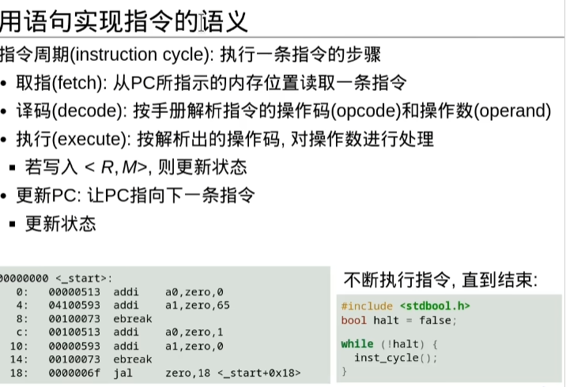


指令循环函数实现: 
```c
void inst_cycle() {
    uint32_t inst = *(uint32_t *)&M[PC];  //取出一条32bit指令
    if (
      ((inst & 0x7f) == 0x13) && ((inst >> 12) & 0x7) == 0  // 判断是addi
      ) { 
      //第二操作数是否为x0, 是的话忽略写入x0.
        if (((inst >> 7) & 0x1f) != 0) {
            R[(inst >> 7) & 0x1f] = R[(inst >> 15) & 0x1f] + 
                (((inst >> 20) & 0x7ff) - ((inst & 0x80000000) ? 4096 : 0));
        }
    } else if (inst == 0x00100073) { // 判断是ebreak
        if (R[10] == 0) {
            putchar(R[11] & 0xff);
        } else if (R[10] == 1) {
            halt = true;
        } else {
            printf("Unsupported ebreak command\n");
        }
    } else {
        printf("Unsupported instruction\n");
    }
    pc += 4;
}
```

初始状态:
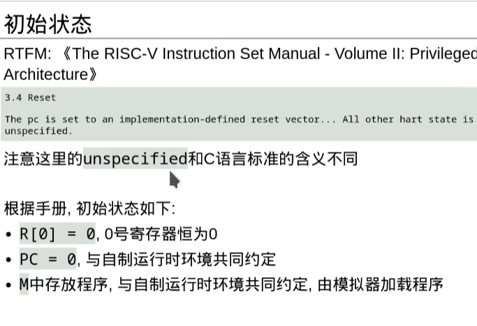


### 1.8.4 YEMU V1.0!!


内存M中存储的指令:

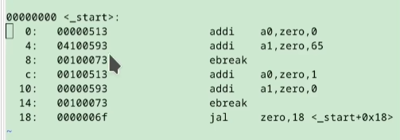

```c
#include <stdio.h>
#include <stdint.h>
#include <stdbool.h>

//PC寄存器.
uint32_t R[32], PC;

//我们分配出64byte的内存. 是的, 这非常小.
//它存放的数据就是那个最简单的_start()函数的汇编指令, 一共7条. 它输出一个A然后结束.
uint8_t M[64] = {
    0x13, 0x05, 0x00, 0x00, 0x93, 0x05, 0x10, 0x04, 0x73, 0x00, 0x10, 0x00,
    0x13, 0x05, 0x10, 0x00, 0x93, 0x05, 0x00, 0x00, 0x73, 0x00, 0x10, 0x00,
    0x67, 0x00, 0x00, 0x00
};

bool halt = false;

void inst_cycle() {
    uint32_t inst = *(uint32_t *)&M[PC];
    if ((inst & 0x7f) == 0x13 && ((inst >> 12) & 0x7) == 0) { // addi
        if (((inst >> 7) & 0x1f) != 0) {
            R[(inst >> 7) & 0x1f] = R[(inst >> 15) & 0x1f] + 
                (((inst >> 20) & 0x7ff) - ((inst & 0x80000000) ? 4096 : 0));
        }
    } else if (inst == 0x00100073) { // ebreak
        if (R[10] == 0) { 
            putchar(R[11] & 0xff); 
        } else if (R[10] == 1) { 
            halt = true; 
        } else { 
            printf("Unsupported ebreak command\n"); 
        }
    } else { 
        printf("Unsupported instruction\n"); 
    }
    PC += 4;
}

int main() {
    PC = 0; 
    R[0] = 0; // can be omitted since uninitialized global variables are initialized with 0 in C.
    while (!halt) { 
        inst_cycle(); //指令循环
    }
    return 0;
}


```


# 4. 缓存

## 4.0 局部性原理

* 时间局部性：当前被访问的数据有可能很快再次被访问。
  * 程序中的循环结构体现时间局部性.
* 空间局部性：当前被访问数据地址相近的数据有可能很快被访问.
  * 程序中的顺序执行指令体现空间局部性.

例子: FIR滤波器
```c
for (i=0, f=0; i<N; i++)
 f = f + c[i] * x[i];
```
***
```asssemble
      ; loop initiation code
      MOV r0, #0 
      MOV r8, #0
      ADR r2, N 
      LDR r1, [r2]
      MOV r2, #0 
      ADR r3, c
      ADR r5, x
      ; loop body
Loop LDR r4, [r3, r8] 
      LDR r6, [r5, r8]
      MUL r7, r4, r6
      ADD r2, r2, r7
      ; update counter and index
      ADD r8, r8, #4 
      ADD r0, r0, #1 
      ; test for exit
      CMP r0, r1
      BLT loop 
loopend ...
```
* 时间局部性: 存储i和f的寄存器在循环中被反复访问.
* 空间局部性: x和c数组被按索引访问.


## 4.1 冯诺依曼架构和哈佛架构

冯·诺依曼 1945 年提出：
-   既然 **程序本质上也是一串指令（数字）**，为什么不把它和数据一样放进存储器？
-   CPU 从存储器里读指令，就能决定做什么运算；读数据，就能操作对象。
-   这样一来，换个程序就是换内存内容，不需要改电路。
这就是 **存储程序计算机（Stored-program Computer）**。

冯诺依曼的"共用总线", 指的是:
不考虑存在流水线, 指令执行需要IF->ID->EX, 是一个单车道.

即使有了MIPS的5级流水线架构, 冯诺依曼瓶颈并没有消失.

此时, 从电路图上看, 

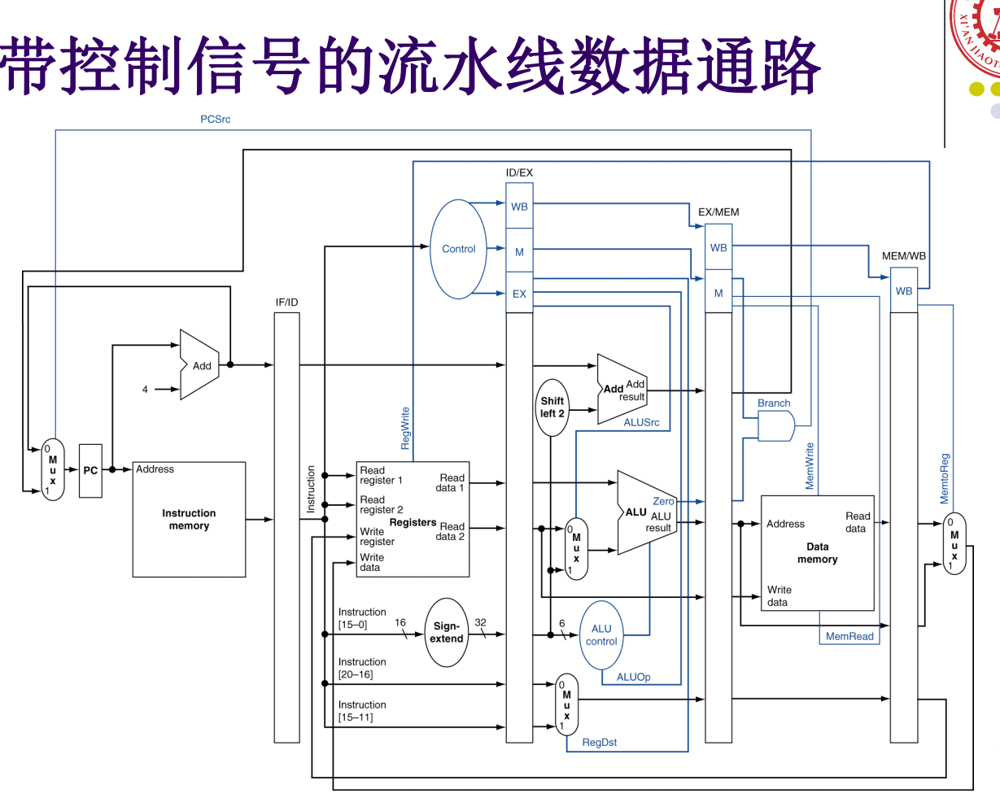

有很多通路, 但是无论如何, 一条指令的ID, ID, EX仍然需要从左到右, 是一个单行道. 

CPU访问内存(不考虑cache)时: (换句话说, 即ALU, PC, REG等等部件要访问MEM时), 只有一条总线: 


这条总线有3*32bit(不考虑两条蓝色的读写控制信号)通道, 里面的数据流分别是:
* 指令中的内存地址Address
* 要往内存写的数据Write data
* 内存中读出来的数据Read data


harvard arch哈佛架构:


在常见的简单CPU教学框图里, 我们发现内存其实已经被分割成了两块:

* instruction memory
* data memory


**数据和指令分离, 可以在同一时钟周期被读取, 其实这已经是一种哈佛架构处理了.**

现代CPU通常使用改进哈佛架构. 
* 虽然在外部主内存DRAM中, 指令和数据仍然是统一的内存地址空间形成的一条长数组(冯诺依曼架构). 
* 但是CPU内部有多级cache, **CPU内部属于哈佛架构**, 指令和data在物理上是分开存储的.


教学图中的:
* `instruction memory`实际上是`L1指令缓存`
* `Data memory`实际上是`L1数据缓存`

详见缓存章节.

***
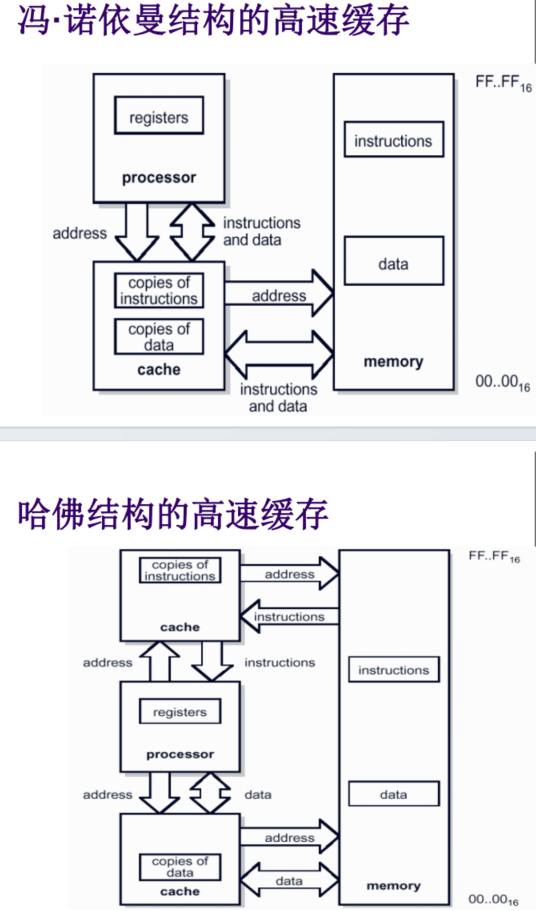

**可以看出, 哈佛架构其实就是缓存分为指令和数据两块, 用两条总线和主存连接.**


## 4.2 缓存的几个基本概念


* **数据块(data block)**：数据传送的最小单元, 典型值为**64Byte**.也称为cache line。以下概念是等价的:
  * 缓存块大小
  * 内存块大小
  * 缓存和内存交互的最小单位
  * 缓存行中data部分的大小
缓存命中(cache hit)：被请求的数据在缓存中。
* **缓存未命中(cache miss)**：被请求的数据不在缓存中. 一般分为三种未命中:
  * 强制性未命中（compulsory miss）：
    * 也称为冷未命中（cold miss）, 发生在存储单元第一次被访问时, 缓存还是空的.
  * 容量未命中（capacity miss）：
    * 由于工作集过大造成的缓存未命中。
  * 冲突未命中（conflict miss）：
    * 由于两个地址映射到高速缓存的同一个单元. 详见具体缓存架构, 如直接映射缓存.


* **工作集(working set)**：CPU在最近一段时间内访问的活动单元集合. 它没有严格的界定. 
  * 如果某个进程产生了很大的工作集, 远远超过缓存大小, 运行效果就会很差...
* 平均内存访问时间:
  * 一级缓存模型：
    $$t_{av} = ht_{cache} + (1-h)t_{main}$$
    * $t_{cache}$是L1 cache访问时间;
    * $t_{main}$是主存(内存)访问时间;
    * h是缓存命中率(hit rate)
  * 类似地. 多(2)级缓存模型:
  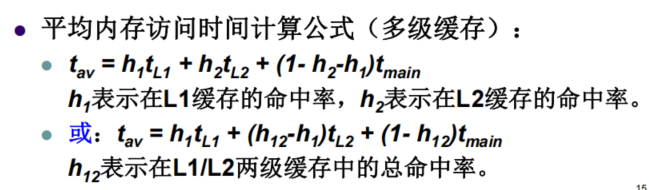


## 4.3 缓存的寻址方式: 三种寻址架构


*  直接映射（Direct Mapped）高速缓存；
*  全相联（Fully Associative）高速缓存；
*  组相联（Set Associative）高速缓存。

### 4.3.1 直接映射缓存

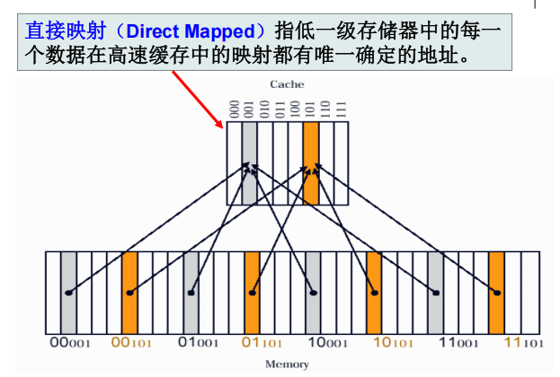

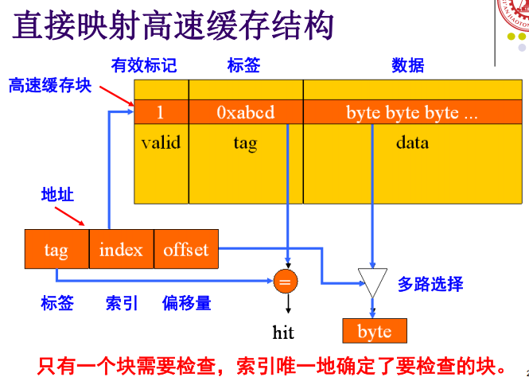

高速缓存由若干个缓存块组成.


除了data部分, 缓存块还有控制部分: valid域和tag域.

所以实际上一个缓存块的寄存器大小是大于64B的.

*  有效标记(valid)：1bit. 表示该缓存块内容是否有效
*  标签(tag)：主存的高位部分. 指示这一块缓存代表哪个主存单元
*  数据域(data)：保存相应内存区域的内容


*  直接映射高速缓存的地址包含三部分：
*  标签、索引、偏移量
   *  标签(tag)： 用来与被索引选中的缓存块的标签值进行比较，如果相同，则表明这个缓存块包含所需要的内存数据。内存中有2t个块映射到同一个缓存块中。
   *  索引(index)：**索引整个缓存中的缓存块**. 直接映射高速缓存有2c个缓存块的索引。
   *  偏移量(offset)：**索引一个缓存块中data的地址.** 比如一个缓存块有32byte的数据， 则需要5bit的offset索引(默认最小寻址单元为1byte)

***
***

**例子:**

* 考虑32位机器, L1缓存-直接映架构.
* 主存为4GB=2^32Byte.
* L1 cache块大小为64B, 总块数为64块. 缓存容量为64*64=4KiB.
* 此时, 主存有4GB/64B=250M个数据块.

***

一个内存物理字节被划分为三个字段:
* Block Offset
  * 因为块大小为64B, 块内索引需要log2(64)=6位.
* Index
  * 因为有64行缓存块, 块间索引需要log2(64)=6位.
* Tag
  * 剩下的位数全部分配给Tag: 32-6-6=20位.


此模型下, 一个缓存行(真实缓存会有更多控制位...)包括:
* data: 64Byte=512bit
* valid: 1bit
* Tag: 20bit

此时**缓存开销**为21/512=4.1%. 即, 为了存储这64B数据, 缓存还需要
额外付出4.1%的成本来管理它们.

***

现在考虑一个物理地址`0x12345678 = 0001 0010 0011 0100 0101 0110 0111 1000`

* 最低6bit为块内索引Block Offset: `11 1000`
* 再高六位为块间索引Index: `0110 01`
* 剩下高位均为Tag: `0001 0010 0011 0100 0101`

***

直接映射意味着, 所有`xxxx xxxx xxxx xxxx xxxx 0110 01xx xxxx`的物理内存地址, 只可以存在这个Index=`0110 01`的缓存行. 有`2^20`段物理内存共用这个缓存行, 同时只能有一段占据.

当CPU要访问物理地址`0x12345678`时:

* 首先根据Index=`0110 01=dx30`去访问第30行cache行.
* 查看该行有效位valid bit. 如果为`0`, 说明这个缓存块是空的. **未命中**.
* 如果缓存块有效, 查看该缓存行的Tag是否正好为想找的物理地址的前20bit`0001 0010 0011 0100 0101`. 如果不是, **未命中**.
* 如果Tag也对上了, **缓存命中**. 取出数据. 


### 4.3.2 全相联缓存

#### 4.3.2.0 直接映射缓存的缺点 & 全相联缓存改进

直接映射要求主存中任意一个块(64B), 只能放在唯一一个指定位置(即Index所对应的那个位置).

这导致问题:

* **频繁的冲突未命中**: 如果两个频繁访问的地址正好有一样的`index`, 在直接映射里它们要被送到指定的同一块缓存行, 发生争抢, 频繁未命中->重写缓存.

全相联缓存: 

取消index限制, 每个内存块可以放到任意一个缓存行. 代价是: 读取时, 对所有(valid的)缓存行都核对tag.

***
***

#### 4.3.2.1 一个全相联例子

##### 4.3.2.1.1 架构


* 考虑32位机器, L1缓存-**全相联**架构.
* 主存为 4GB=2^32Byte.
* L1 cache块大小为 64B , 总块数为64块. 缓存容量为64*64=4KiB.

***

一个内存物理字节被划分为2个字段:
* Block Offset
  * 因为块大小为64B, 块内索引需要log2(64)=6位.
* Tag
  * 剩下的位数全部分配给Tag: 32-6=26位.


##### 4.3.2.1.2 全相联的缓存模块开销:

此模型下, 一个缓存行包括:
* data: 64Byte=512bit
* valid: 1bit
* Tag: 26bit
* 脏位: 1bit(用于**写回策略**. 表示这个块最近有没有修改过)
* ...

此时**缓存开销**为21/512=4.1%. 即, 为了存储这64B数据, 缓存还需要
额外付出4.1%的成本来管理它们.


##### 4.3.2.1.3 cpu访问过程

***

现在考虑一个物理地址`0x12345678 = 0001 0010 0011 0100 0101 0110 0111 1000`

* 最低6bit为块内索引Block Offset: `11 1000`
* 剩下高位均为Tag: `0001 0010 0011 0100 0101 0110 01`

***

当CPU要访问物理地址`0x12345678`时:

* 查看所有valid的缓存行的tag, 寻找有没有物理地址的高26位`0001 0010 0011 0100 0101 0110 01`. 找到了即命中.


### 4.3.3 组相联缓存

#### 4.3.3.0 全映射缓存的缺点 & 组相联缓存改进

全相联每次查询需要查询所有缓存行, 这需要巨大的比较器阵列开销.

组相联选择了折中.

组相联: 将cache行分成多个**组**, 每个组有多路cache行. 工程经验一般是**4路**.

**Index用于选择组**. 假设64块缓存的4路组相联, 有16组->index为4bit.

对每个主存块有一定的映射限制: 该主存块的地址中被划分为index的部分决定了它必须被分配在那个组里, 但是可以自由选择4路缓存块存在哪个块.

寻址时, 先对地址`A`截取index部分, 找到那个组后, 并行查找组内4个缓存行的`tag`是否匹配.


    


#### 4.3.3.1 组相联物理架构

* 考虑32位机器, L1缓存-**4路组相联**架构.
* 主存为 4GB=2^32Byte.
* L1 cache块大小为 64B , 总块数为64块, 分为4路16组. 缓存容量为64*64=4KiB.

现在考虑一个物理地址`0x12345678 = 0001 0010 0011 0100 0101 0110 0111 1000`

* 最低6bit为块内索引Block Offset: `11 1000`
* 再高4位为组索引Index `10 01`
* 剩下高位均为Tag: `0001 0010 0011 0100 0101 01`


***
##### 4.3.3.1.2 组相联的缓存模块开销:


组相联的地址划分为

32位地址 = Tag (22位) | Index (4位) | Offset (6位)


##### 4.3.3.1.3 cpu访问过程
当CPU要访问物理地址`0x12345678=0001 0010 0011 0100 0101 0110 0111 1000`时:

* 块内偏移为低六位`11 1000`
* 截取地址的Index部分: `10 01`. 前往这个组, 该组有4路缓存行.
* 查看4路缓存行的tag, 寻找有没有物理地址的高22位`0001 0010 0011 0100 0101 0110 01`. 找到了即命中.


## 4.4 缓存的写操作

缓存的处理逻辑在“读”和“写”时有着根本性的不同. 写操作要复杂得多.

读操作(读取地址`A`的内容)很简单, 寻址后直接读取就结束了.

写操作(将地址`A`的内容写入为`data`)就比较复杂了:

**写命中: 要写入的【那个内存地址所在的数据块】在缓存里。**


当CPU要写入数据时，面临两个问题：

1.  **写到哪里？** 是只更新缓存，还是必须更新主存？
    
2.  **如果缓存不命中怎么办？** 是要先把数据块读进来再写，还是直接写到主存？

这引出了两种写策略:
* 写回
* 写直达


### 4.4.1 写直达策略

CPU 要写入地址 `A`.

它同时更新主存和缓存: 在缓存和主存里查找地址`A`. 在缓存查找的具体方式在上述三种缓存架构分别分析了. 然后写入. 

在缓存里也写入并不服务于更快实现写操作. 只是为了同步维护: 让之后的读操作不会**在缓存中读到该地址内旧值**导致出错. 

CPU要等待这两个过程都执行完.

如果在缓存里发生了写缺失(缓存里没有存这个地址的数据块), **可选**:
* **写分配**: 等数据写入主存后, 顺便将主存数据块读到缓存里.
* **非写分配**: 直接忽视.


写直达策略的缓存, 写入过程完全是cpu直接访问该主存地址`A`的过程. 没有任何帮助. 超级慢.


### 4.4.2 写回策略

**写回的核心规则: 对主存的写入，仅在缓存块被替换时发生。在此之前的任何CPU写操作，都只修改缓存副本. 这意味着，在很长一段时间内，缓存中的数据与主存中对应的数据是不一致的。**
***

CPU 要写入地址 `A`.

cpu先在缓存中寻找地址`A`的块.

* **如果写命中**, 对缓存块data覆写, 并**设置脏位为1**. 不对主存操作. 主存此时存储旧数据.

* **如果写缺失**: 去主存访问地址`A`. 然后将该内存块放入缓存. (放入方式根据映射规则: 直接映射/全相联/组相联 来具体实现. 由LRU等算法选出一个最不常用的行作为牺牲行.). 被替换的缓存行称为**牺牲行**. 丢弃时检查其脏位：

  * 脏位为`0`:
    * 说名该行是干净的, 从主存中拷贝出来后从未被更改过, 和主存中的副本一样. 
    * 控制器直接简单地丢弃它即可.
  * 脏位为`1`:
    * 改行已经被更改过, 存着最新的数据块, 而对应主存的数据块是未更新的旧数据.
    * 控制器必须先去相应主存地址更新数据, 然后再丢弃这个缓存行.

  丢弃牺牲行后, 对缓存块data覆写, 并**设置脏位为1**, 结束.

## 4.5 缓存的替换算法

当使用 **全相联/组相联** 的缓存寻址架构时, 会遇到需要选择一个最不常用的缓存行替换的情况. 

### 4.5.1 LRU(least recently used)算法

就是每个缓存行都维护一个**时间戳**. 每次访问都会更新时间戳. 替换时间戳最老的那个.

* 全相联缓存:
  在所有缓存行里, 替换最老的那个.
* 4路组相联缓存:
  在目标地址所属组的4个缓存行里, 替换最老的那个.

纯LRU的硬件实现: 维护时间戳, 太过昂贵, 没有可行性.

实际上使用LRU位算法, 伪LRU等折中:


#### PLRU(伪LRU)算法

用二叉树来近似LRU.

对于一个有N=4路组相联的缓存, 每个组用一颗4-1=3个节点的二叉树表示:


```
树结构：
     M0
   /    \
  M1    M2
 / \    / \
W0 W1 W2 W3
```

* `W0 W1 W2 W3`代表四个缓存行. 
* `M0, M1, M2`是三个节点. 每个节点有一个1bit标志位, **指定搜索方向**: 
  * `1`表示搜索右边子树. 
  * `0`表示左边. 
  * 初始状态全部为`0`.
  * 每次访问时, 根据当前的节点位选择`Wx`. 同时, 此次走过的路径的节点位均**反转**.
* 每次写入未命中, 就需要选择牺牲行. 例如:
  * 第1次需要写入这个组的时, 因为`M0=0, M1=0, M2=0`, 走到`W0`. 
  * 第2次需要往这个组写入时, 因为`M0 M1`翻转为`1`, 会走到`W2`作为牺牲行.
  * 第3次需要往这个组写入时, 因为`M0=0, M1=1, M2=1`, 走到`W1`.
  * 第4次需要往这个组写入时, 因为`M0=1, M1=0, M2=1`, 走到`W3`.
  * 第5次需要往这个组写入时, 因为`M0=0, M1=0, M2=0`, **覆写**`W0`.


### 4.5.2 LFU(least frequently used)算法

每个缓存行维护一个访问次数计数器. 访问次数最低的会被替换.

### 4.5.3 FIFO 先进先出

这个裁决原则就是替换掉最先放进去的那块.

FIFO就是大砍版的LRU: 每个缓存行写入的时候标记一个时间戳, 但是访问的时候不会更新它.

**所以FIFO肯定效果没有LRU好, 但是硬件实现更容易.**
...

## 4.6 缓存的预取方法

#### **1\. 下一行预取**

-   **策略**：当访问一个缓存行时，预取器**自动将下一个顺序的缓存行**也加载进来。
    
-   **原理**：适用于顺序访问的程序代码和数据（如遍历数组）。
    
-   **实现**：非常简单，硬件开销小。
    

#### **2\. stride预取**

-   **策略**：预取器会检测内存访问的“步长”。例如，如果发现程序依次访问了地址A, A+S, A+2S...，它就会预测并预取 A+3S。
    
-   **原理**：适用于有固定间隔的访问模式（如访问矩阵的某一列）。
    
-   **实现**：比下一行预取复杂，需要硬件记录之前的访问地址并计算步长。
    

#### **3\. 多级/自适应预取**

-   **策略**：现代高性能CPU（如Intel、AMD）集成了复杂的预取器，能够同时识别多种访问模式，并根据运行时的程序行为动态调整策略。
    
-   **原理**：结合了多种简单预取器的优点，更加智能。


## 4.7 内存控制器: DRAM的局限性

***
***
***
总述: 用来接收来自cpu的内存访问请求, 管理DRAM的时序(行激活, 预充电, 刷新...).

```
CPU---缓存---内存控制器---DDRS DRAM(主存)
```
***
***
***


我们说, 最简单的L1 cache模型下, 考虑缓存块典型值64Byte,

CPU访问主存的最小粒度应该是64Byte.

现在考虑一个新的现实因素[DRAM的局限性], 然后用[内存控制器]解决它, 从而封装这些实现, 不影响我们上述的抽象.

实际的DRAM物理结构是行充电. 它必须一次激活一个DRAM行(一般为8KB大小), 读出整个DRAM行的大小.

具体工作示例:

假设CPU要读取地址`0x4000`的缓存行（64字节）：

1.  **接收请求**：内存控制器通过AXI总线收到读请求
    
2.  **地址解码**：`0x4000` → Bank 1, Row 5, Column 0x10
    
3.  **调度决策**：
    
    -   检查Bank 1的行缓冲区当前是Row 3
        
    -   需要先预充电Bank 1（关闭Row 3）
        
    -   然后激活Bank 1的Row 5
        
    -   最后读取Column 0x10开始的连续数据


## 4.8 万物皆缓存

对比缓存和虚拟地址(页转换), 我们可以发现有很大的对称性.

它们都有预存取和替换策略.


| 特性 | **缓存系统 (Cache System)** | **虚拟内存系统 (Virtual Memory System)** |
|------|-------------------------------|--------------------------------------------|
| **核心目标** | 弥补 **CPU 与主存（DRAM）** 之间的速度差距，提高指令与数据访问性能。 | 弥补 **主存与磁盘（硬盘）** 之间的容量差距，使系统看起来拥有更大的“逻辑内存”。 |
| **快速部件** | SRAM Cache（一级 L1、二级 L2、三级 L3 缓存） | DRAM 主内存（物理内存）。 |
| **慢速部件** | DRAM 主内存 | 磁盘或 SSD 上的交换空间（Swap Space）。 |
| **管理单元** | **缓存行 (Cache Line)**，通常为 32B / 64B / 128B 大小。 | **页 (Page)**，通常为 4KB（或更大，如 2MB、1GB 的大页）。 |
| **映射机制** | 根据 **物理地址** 进行索引映射（直接映射、组相联、全相联等）。 | 通过 **页表 (Page Table)** 将虚拟地址映射为物理地址。 |
| **“缓存”结构** | 缓存本身存放主存中被频繁访问的数据。 | **TLB (Translation Lookaside Buffer)** 充当页表的缓存，用于加速地址翻译。 |
| **TLB 的含义** | — | TLB 是 **页表项缓存**，存储最近使用的虚拟页 → 物理页映射。 |
| **替换算法** | 常用策略：**LRU**（最近最少使用）、**FIFO**、**Random**。 | 常用策略：**LRU**、**FIFO**、**Clock（近似LRU）**。 |
| **预取策略** | 可预测的访问模式触发 **数据预取（Prefetching）**，提前加载缓存行。 | 操作系统可执行 **页预取（Page Prefetching）**，提前加载相邻页入内存。 |
| **缺失惩罚** | Cache Miss → 从主存取数，延迟几十到几百个时钟周期。 | Page Fault → 从磁盘取页，延迟数百万个时钟周期（极慢）。 |
| **管理主体** | 由 **硬件自动管理**（CPU 缓存控制器）。 | 由 **操作系统与硬件协同管理**（MMU + 内核页表）。 |
| **透明性** | 对程序员透明，访问逻辑与缓存存在与否无关。 | 虚拟内存对程序完全透明，程序认为自己拥有连续地址空间。 |

---


# 6 地址转换与虚拟内存

## 6.0 虚拟内存引入

在不考虑地址转换的L1 cache 四路组相联缓存模型的基础上:

考虑直接使用物理内存的问题:

* 安全隔离:
  * 如果一个程序不小心写入操作系统核心内存, 会导致整个系统崩溃.
* 内存管理:
  * 内存碎片化问题.
* 简化编程问题:
  * 程序员**希望自己的每个程序都认为自己独占了整个内存空间, 从0开始的一大片连续内存, 不希望关心和维护实际上再用物理内存的哪些角落.**

于是引入虚拟内存抽象层.

## 6.1 存储管理单元MMU(memory management unit)

* 在远古时代, 内存价格昂贵, 物理内存地址远小于寻址空间. MMU的作用就是将物理内存分为多个独立的地址空间, 来同时运行多个程序.
* 如今物理内存地址已经完全够用. MMU的作用是**实现虚拟地址管理**.


## 6.2 段地址转换

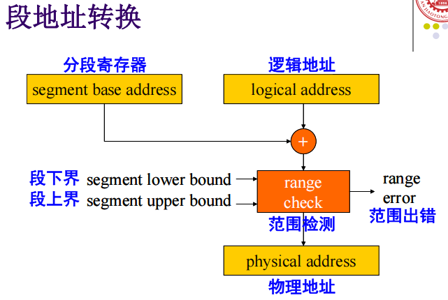


将写的程序分为若干个逻辑上的段. 一般为:
* 代码段
* 数据段
* 堆栈段
* ...


每个段在物理内存中是一个独立的、连续的区域，但各个段本身不必相邻。

**核心概念：**
-   **段寄存器**：CPU内部有专门的段寄存器（如CS, DS, SS等），用来存放**段选择子**。   
-   **段描述符**：描述一个段属性的数据结构，存放在**全局描述符表（GDT）** 或**局部描述符表（LDT）** 中。    
-   **段描述符表**：可以看作是一个数组，里面存放了所有的段描述符。    
-   **段选择子**：可以看作是GTD或LDT这个“数组”的**索引**。


### 段地址转换例子

在程序中, cpu要访问虚拟地址`DS:0X200`


缺点:

段之间的空闲空间就是难以利用的外部碎片了.


## 6.3 页地址转换

### 6.3.1 页地址转换...引子


页地址转换就是把虚拟内存空间和物理内存空间都分为紧密相连的4KB大小的块(称为页), 一个虚拟页映射到一个物理页. 

一般把物理内存页称为`页框/页帧`, 虚拟内存页称为`页`.


**RISC-V的设计哲学是 简洁和现代化。它认为x86的 段页混合 内存管理是一个历史包袱，复杂且并非最优解。**
**RISCV 32/64 使用单纯的页转换: SV32(对应riscv32)方案 / SV39(对应risec64).**

最典型的SV32方案对应rv32架构:

* 32位虚拟地址、
* 32位物理地址、
* 4KB页大小、
* 两级页表


### 6.3.2 页表结构, PTE(page table entry), 页表项

**页表**是一个映射规则表, 存储每个**虚拟页**映射到哪个到**物理页**. 一个页表是**物理内存中连续的4KB区域**. 它由多个PTE(page table entry), **页表项**组成. 每个PTE记录一个**虚拟页**映射到到一个**物理页**的信息, 占32bit(**4字节**)

* PPN(physical page number), 物理页号.
* VPN(virtual page number), 虚拟页号.
* PA(physical address (width)), 物理地址宽度.
* VA(virtual address (width)), 虚拟地址宽度.

标准情况下, PPN和VPN都应该等于$log2 (物理寻址空间=虚拟寻址空间=2^32B=4GB)/(页容量=4KB) = 20bit$.

但是实际上PTE给PPN预留了22bit的空间. 高2bit在使用32bit地址的时候是保留恒为`0`的.

事实上, riscv32支持物理地址拓展到34bit(见). 此时就可以用到高2bit了.

***
***
***

**PTE结构:**

一个PTE页表项由22bit的`PPN`和10bit的FLAGS组成:

```
31        10 9 8 7 6 5 4 3 2 1 0
+------------+------------------+
|   PPN      - - D A G U X W R V|
+------------+------------------+
```

***   
-   **bits 31..20** : `PPN[1]`（12 bit）其中高2位是保留位, 用来兼容34位扩展物理地址.  PPN被分成两段只是为了兼容其他体系(Sv39、Sv48、Sv57), 这里不展开了.
-   **bits 19..10** : `PPN[0]`（10 bit）  
-   **bits 9..8** : `RSW`（2 bit）——保留给软件（Reserved for Software）    
-   **bit 7** : `D`（Dirty）——页是否被写过   
-   **bit 6** : `A`（Accessed）——页是否被访问过（读或写/执行）  
-   **bit 5** : `G`（Global）——对所有地址空间全局有效 
-   **bit 4** : `U`（User）——用户态可访问  
***   
-   **bit 3** : `X`（Execute）——可执行权限   
-   **bit 2** : `W`（Write）——可写权限   
-   **bit 1** : `R`（Read）——可读权限  
***   
-   **bit 0** : `V`（Valid）——PTE 是否有效（0 表示无效／不使用）
***   


***
***

**页表项的叶子态和非叶子态:**

这个规定在多级页表结构(比如二级页表)才会用到. 我们先来看人为定义:

| 条件                 | 类型      | 含义                                         |
| ------------------ | ------- | ------------------------------------------ |
| `V=1, R=W=X=0(没有一切权限)`     | 非叶子 PTE | 表示这个 PTE **不是实际物理页映射**，而是 **指向下一级页表的物理地址** |
| `V=1, (R=1 或 X=1(可读或可执行))` | 叶子 PTE  | 表示这个条目 **指向实际物理页（内存页）**，可以直接用于地址转换         |


### 6.3.3 二级页表的结构

单级页表结构，即**一个页表,由多个PTE组成**

还不能直接使用到整个物理内存空间. 毕竟现代cpu同时有很多进程在运行. 

所以进一步引入二级页表的结构. 将4GB空间分为`2^10=1024`个块.
用两级页表结构, 把32bit虚拟地址看成10bit**一级页表索引**+10bit+12bit表内索引.  

* **一个一级页表就是cpu当前`satp.ppn`对应的物理页. 它在物理内存中连续分布, 占据一个物理页(4KB). 每个进程都维护一个根页表. cpu通过satp切换到对应进程的物理页数, 实现进程切换.**
  * 例子6.4.5: 假设此时cpu的`satp.ppn`=`0x123`, 那麽此时系统一级页表起始地址为`PTBR`(page table base reg) = `satp.ppn`<<12 = `0x123000`. 一级页表即为`0x123000`~`0x123FFF`, 共**4KB**, **1024页PTE1**.
  * 第一级页表是这样一个映射: 把10bit一级索引映射到`2^10=1024`个页表目录(也就是一个PTE); 
  $$
  \{satp, VPN[1]\}->PTE1->PPN1
  $$

* **一个二级页表就是某个`PTE`->`PPN1`->`ADDR1`对应的1024个`PTE2`块, 它在物理内存中连续分布, 占据一个物理页(4KB). 同时存在1024个二级页表.**
  * 例子6.4.5: 假设有个PPN1=`0x200`, 那麽它对应一个二级页表. 起始物理地址为`0x200 << 12`=`0x200000`, 终点为`0x200FFF`, 共**4KB**, **1024页PTE2**.
  * 第二级页表是这样一个映射: 把当前PPN1中包含的1024个PPN2, 根据索引VPN[0]选出想要的那一块PPN2.
  $$
  \{PPN1, VPN[0]\}->PTE2->PPN2
  $$


**名词查找:**
***************************************
* `PTE1`: 一个一级页表项. 一个一级页表里有1024个`PTE1`. 存在存在`ADDR1`. 32bit.(4B)
* `PTE2`: 一个二级页表项. 一个二级页表里有1024个`PTE2`. 存在一个`ADDR2`. 32bit.(4B)
***************************************
* `PPN1`: **下一级(二级)页表所在的物理页号**. 22bit. 配合`VPN[1]`(10bit)拼接为`ADDR1`.
  * `PPN1`=`PTE1`[31:10].  
* `PPN2`: **最终物理页所在的物理页号**. 22bit. 配合`VPN[0]`(10bit)拼接为`ADDR2`.
  * `PPN2`=`PTE2`[31:10].  
***************************************
* `PTBR`(page table base reg, 根页表物理基址): **一级页表的基址**.
  * `PTBR` = `satp.ppn<<12`
*  *二级页表因为有1024个, 所以没有专门的寄存器记录基址.  随取随用.*
***************************************
* `ADDR1`: **一级页表项PTE1的物理地址**.   **34bit**.
  * `ADDR1` = (`satp.ppn` << 12) + `VPN[1]` * 4
* `ADDR2`: **二级页表项PTE2的物理地址**.   **34bit**.
  * `ADDR2` = (`PTE1.ppn` << 12) + `VPN[0]` * 4
***************************************
* `PA`: 物理地址. **34bit**.
  * `PA` = (`PPN2` << 12) | `offset`
***************************************

***
***

### 6.3.4 satp(supervisor address translaation & protection reg)寄存器(页表基寄存器/监管者地址转换和保护寄存器)

它就是**根页表基址寄存器**. 该寄存器保存着**当前进程的根页表基址**.

cpu中存在一个satp(supervisor address translaation & protection reg)寄存器. 它的结构:

-   **MODE**： 高4位，决定当前使用的地址转换方案。  
    -   对于SV32，`MODE = 1`。     
-   **ASID**： 接下来的22位，是地址空间标识符，用于区分不同进程的快表TLB条目（高级话题，可先忽略. 见`6.3.9`）。   
-   **PPN(physical page number)**： 低22位，这是**一级页表（根页表）的物理页号**. satp.PPN是22bit, 它左移12bit后即为**物理页表基地址**.
    -   这样设计是因为RV32架构考虑扩展后, 最多支持34bit的物理地址. 高22bit即为页表基地址, 低12位补0, 对应表(4KB)内偏移offset.

cpu的`satp.PPN`指向的物理页号, 就是当前进程(比如程序A)正在使用的一级页表所在物理内存页. 事实上, 操作系统正是**通过改变satp寄存器来实现切换进程**.


### 6.3.5 二级页表结构的地址转换例子: riscv32 页地址转换

现在程序A运行在该架构的cpu上. 它独享32bit的虚拟地址空间: `0x0000 0000 ~ 0xffff ffff`

现在程序A中的一条指令`lw a0, [0x12345678]`试图从虚拟地址 `0x12345678` 加载一个数据到`a0`.


#### 6.4.5.1. MMU分解虚拟地址


MMU分解虚拟地址`0x12345678`为三部分:
* **Offset**(页内偏移) = 低12位`0x678`
* **VPN**(虚拟页号): 高20位`0x12345` . 再截断为两部分:
  * **VPN[1]**： 取VPN的最高10位 `0x12345 >> 10 = 0x48`   为**一级索引**, 表示选择一级页表的第几个`PTE1`. 
    * 也就是说, 该虚拟地址所属的**页表的物理地址**, 就是**根页表物理基址**加上(4*一级索引).
  * **VPN[0]**： 取VPN的最低10位 `0x12345 & 0x3FF = 0x345` 为**二级索引**, 表示选择二级页表的第几个`PTE2`.


***
***
***

#### 6.4.5.2. 一级页表(根页表root)查找: 读取并解析第一级页表项PTE1

先查找当前根页表在哪里. 它在物理地址: PTBR = `satp.ppn << 12 = 0x123000`这里. 它占据4KB, 1024条. 

现在利用**虚拟地址的一级索引`VPN[1]`**, 选择根页表的第`VPN[1]`条. 

***
***
***
对应具体计算:

* 根页表物理基址
  * 假设现在cpu的`satp.PPN`= `0x123`. 表示指向一级页表的第`0x123`页.
  * 那麽**根页表物理基址(PTBR)** = `satp.ppn << 12 = 0x123000`.
    * 注意2^12=4*2^10=4KB.

* 虚拟地址的一级索引
  * 即为VPN[1].

于是可以计算PTE1的物理地址:

**PTE1地址 = 根页表物理基址 + 一级索引 * 4 = (satp.ppn<<12) + VPN[1] * 4 = `0x123000` + (`0x48`)*4 = `0x123120`**


访问物理内存`0x123120`,得到页表项PTE1.

假设读到PET1为:

`PTE1 = 0x00080001`. 将PTE1页表项内容拆解:

-  PPN1 = PTE1[31:10] = `0x00080001 >> 10` = `0x200`. 
- `V=1`(有效)
- `R=W=X=0` → 不可读不可执行, **非叶子条目，指向下一页表**。
 

解析了PTE1, 可以继续寻找PTE2了.

***
***
***

#### 6.4.5.3. 二级页表查找: 读取并解析第二级PTE2

我们需要通过**二级页表物理基址** 和 **虚拟地址的二级索引** 来计算出PTE2的物理地址在哪里, 从而访问它.

* 二级页表物理基址:
  * 对PPN1 << 12(**其实就是*4096**), 得到**二级页表物理基址**: `0x200 << 12` = `0x200000`
* 虚拟地址的二级索引
  * 即为VPN[0].

于是可以计算PTE2的物理地址: 

**PTE2地址 = 二级页表物理基址 + 二级索引 * 4 = (PPN<<12) + VPN[0] * 4 = `0x200000` + (`0x345`) * 4 = `0x200D14`**

访问该虚拟地址对应的**二级页表地址**. 即访问物理内存`0x200D14`, 得到页表项PTE2.

假设读到页表项PTE2为:

PTE2 = `0x150C84D7`. 将PTE2页表项内容拆解:

-    PPN2 = `0x150C84D7 >> 10` = `0x54321`
-    V = 1 → 有效  
-    R = 1 → 可读  
-    W = 1 → 可写   
-    X = 0 → 不可执行   
-    A = 1 → 已访问   
-    D = 1 → 已写脏

因为可读|可写, 所以是叶子PTE, **它直接映射到物理页**. 

解析了PTE2, 可以继续寻找**物理页PTE**了.

***
***
***

#### 6.4.5.4. 物理页查找

我们需要通过**物理页基址** 和 **物理页基址偏移量** 来计算出**物理页PTE**的物理地址在哪里, 从而访问它.

* 物理页基址
  * **物理页基址**为PPN2 << 12 = `0x54321 << 12` = `0x54321000`
* 物理页基址偏移量
  * 即虚拟地址的offset段 = `0x678`

于是可以计算**物理页PTE**的物理地址: 

**物理页PTE地址 = 物理页基址 + 物理页基址偏移量 = (PPN2<<12) + offset = `0x54321000` | `0x678` = `0x54321678`**

于是得到该虚拟地址对应的物理地址转换:

**VA `0x12345678`  →  PA `0x54321678`**


***
***

##### 总结杂项

页表的好处:

-   **对程序透明**：程序A完全不知道自己的 `0x12345678` 被映射到了物理内存的 `0x00ABC678`。它始终认为自己在使用从0开始的连续内存。
    
-   **隔离性**：如果另一个程序B也访问自己的 `0x12345678`，操作系统会为它配置不同的页表，将其映射到另一个物理地址（如 `0x005DE678`），实现了完美的隔离。
    
-   **权限控制**：页表项中还有R(读)、W(写)、X(执行)等权限位。如果程序A试图写入一个标记为只读的页，MMU在查询PTE时会触发异常，从而保护内存。


小提示:
* 虚拟地址的含义被**人为**规定为**一级索引VPN[1]**, **二级索引VPN[0]**, **物理页基址偏移量offset**.
* 虚拟地址的一级索引和二级索引部分VPN[0], VPN[1]的意思是页表的PTE偏移量, 单位都是"一个PTE", 在分别用来计算PTE1和PTE2的地址的时候这个数字要*4才是字节. 
* 虚拟地址的offset的意思是**物理页基址偏移量**, 单位就是字节, 所以计算最终物理地址的时候, offset是直接和基址相加的.


### 6.3.6 超页superpage


Sv32同时允许分配一块连续的4MB大小的大页.


此时, 虚拟地址`A`对应的一级页表项`PTE1`的flag位被设置为叶子位. 

这时候拿到`ADDR1`=`PTE`[31:20]<<12 | `VPN[1]`, 它指向的就是超页的起始.

`VPN[0]`就不参与列表索引了. **它也被用作超页内偏移**. 也就是此时VA的划分为

```
VA = [VPN[1] |    page_offset]
PA = [PTE1.PPN |  page_offset]
```


### 6.3.7 请求分页

`页地址转换`的一种动态加载策略.


并不是在程序启动的时候就把所有页加载到物理内存里.

发生在: 当程序第一次访问某个虚拟页, 但是该虚拟页没有对应映射的物理内存.

对单个进程 A 来说，**虚拟地址空间（0x00000000..0xFFFFFFFF）通常在逻辑上完整可用，但物理页并不会一次性全部分配**。物理内存通常是按需分配（demand-paged）：当程序真的访问某个虚拟页且该页当前没有对应的物理帧时，会触发缺页（page fault），操作系统再分配/装入物理页并建立映射。

触发条件与流程概述如下：

1.  **硬件阶段（MMU）**
    
    -   CPU 执行一条指令，MMU 用 satp 和页表走访（walk）来转换虚地址到物理地址。
        
    -   若在任一级页表中遇到 PTE 的 `V/valid` 位为 0（指示该条目当前未映射或不允许访问），或者访问权限（R/W/X）不允许当前访问类型，就 **产生异常（page fault / load/store/inst page fault）**，把控制转到内核（trap）。
        
2.  **内核处理（trapped into kernel）内核处理（陷入内核）**
    
    -   内核查看进程的虚拟内存数据结构（在 Linux 中类似 `vm_area_struct`）来判断：
        
        -   这个虚地址**本应该有映射**（例如是合法的堆/堆栈/映射文件区域），还是
            
        -   这是非法访问（segfault）？
            
    -   如果合法且只是“页不在内存”：
        
        -   查找 backing store（文件、或 swap slot、或 anonymous zero page）。查找 backing store（文件、或交换槽、或匿名零页）。
            
        -   分配物理页框（`alloc_page()`）。
            
        -   若 file-backed：从磁盘读入页面内容到该物理页；若 anonymous demand-zero：把页清零。
            
        -   更新相应的 PTE（写入新的 PPN，设置 Valid、R/W/X 等位）。
            
        -   如果原有页表页不存在（level-0 page table），内核先 `alloc_page()` 分配一个页表页，写入根页表对应 PTE，然后继续更新 leaf PTE。
            
    -   最后刷新 TLB（或执行 `sfence.vma` 或局部无效化），返回用户态并重新执行导致 page fault 的指令——这次 MMU 能得到有效的物理地址，指令成功完成。
        
3.  **如果访问不合法**（例如访问未映射区域或权限不允许）
    
    -   内核会向进程发送 SIGSEGV（或等价异常/终止）。


### 6.3.8 虚拟内存的替换算法

现代计算机中:

就像全相联/组相联缓存一样, 页地址转换虚拟内存也存在替换问题:


有时候虚拟页会被替换掉. 类似**缓存的写回策略**的通过**脏位**来管理一样, 每一个页的PTE记录中的脏位就是为了备份而服务的.

* 当cpu**写入一个内存页**(指要执行一个写命令, 目标是虚拟页VP_a, 它已经被MMU映射到了物理页框`PP_a`)时, MMU将该映射对应的PTE2(最后一级页表项, 因为前面的页表项比如PTE1没有控制位的概念, 它单纯用来引导指向下一级PTE.)脏位设置为1.
* 当该物理页框`PP_a`被替换时, MMU会检查其PTE2脏位:
  * 1: 必须将该页内容写回硬盘.
  * 0: 直接丢掉.


现代计算机的主存需要依靠**硬盘**中划出一块特殊区域(交换分区/交换文件), 就像`缓存-主存`的关系一样, 作为主存的备份. 维护方式也是**写回策略**. 

相应地, 替换策略也有RLU, FIFO等. 和`缓存-主存`的替换原则是一样的.


* 简单嵌入式系统和无盘系统中一般没有硬盘, 所以无法实现虚拟内存, 或者简单使用直接映射虚拟内存(看名字就大概知道如何实现了, 总之比段地址转换和页地址转换要简陋的多了.)


### 6.3.9 快表 TLB(translation lookaside) 和ASID(address space identifier), 地址空间标识符

它是一个专门用于加速虚拟地址到物理地址转换的小型高速缓存.

它具体存储了: 虚拟页号->物理页框号的映射关系.

我們在上面已經看到, satp寄存器中存儲了`ASID`位段. 

它儲存最近使用過的頁錶項PTE. 每當需要進行一次虛擬地址轉換(程序訪問虛擬内存地址`VP_a`), MMU都會先嘗試在`TLB`中查找:

-   **TLB命中**：直接在TLB中获得物理页号，转换极快（通常1个周期）。
-   **TLB缺失**：才需要去遍历内存中的页表，找到后不仅完成转换，还会将这个新的映射关系装入TLB。


我们显然意识到, 上述没有考虑ASID的简单模型下, 发生进程切换后, 进程B的页表和A完全不同, 虚拟地址映射全部变化了. 原来在进程A的TLB缓存全是错的, 需要清空, 称为**TLB冲刷**. B进程刚开始运行时, 所有地址转换均**TLB缺失**, 必须查询慢速的主存中的页表, 带来巨大性能损失, 称为**切换后减速**.

***
***
***
***

ASID就是为了解决上述问题产生的.

cpu给每个进程分配一个标识符. TLB的一个缓存行中同时存储(Sv39(虚拟地址长度为39bit)为例子):
* 虚拟页号: 39-12(因为一页是2^12=4KB)=27bit
* ASID: 22bit
* 物理页号: (以56bit物理内存空间为例) 56-12=44bit
* 一些状态/权限/有效位: ~8bit

一个TLB缓存行大概长度为**100bit**.


*** 
*** 
*** 
*** 

* 注意区分**ASID(硬件层面的进程标签)**和**PID(软件层面的进程标签)**:

嗯...我还是觉得PID的作用和ASID重复了, 完全可以用ASID担任PID的功能, 毕竟ASID相比PID还能延迟回收...

解答:

-   **PID (Process Identifier) - 软件的全局唯一标识**
    
    -   **职责**：在**操作系统层面**唯一地、永久地标识一个进程的**生命周期**。
        
    -   **特性**：
        
        -   **全局唯一性**：在系统运行期间，一个PID一旦被释放，通常不会立即重用，以避免混淆（例如，一个进程向一个刚结束的进程发信号）。
            
        -   **信息丰富**：PID通常从0开始线性增长或在一定范围内循环，它本身隐含了进程创建的先后顺序信息。
            
        -   **管理需要**：操作系统需要稳定、长期的句柄来管理进程，而不受硬件资源限制的干扰。
            
-   **ASID (Address Space Identifier) - 硬件的可重用标签**
    
    -   **职责**：在**CPU MMU硬件层面**，为当前驻留在TLB中的地址转换条目打上一个临时标签，以区分不同进程的映射。
        
    -   **特性**：
        
        -   **可快速重用**：如前所述，ASID是一个被池化管理的缓存资源，进程退出后其ASID会很快被回收并分配给新进程。
            
        -   **硬件资源受限**：ASID的位数是硬件固定的（如22位），它是一个**稀缺的硬件资源**。而PID在软件层面可以是32位甚至64位，是“无限”的。
            
        -   **性能驱动**：它的存在只有一个目的——提升TLB性能。


## 6.4 虚拟地址内存布局

在已经用虚拟内存包装好底层后, 我们来看一个进程A面对的虚拟空间`0x0`~`0xffff ffff`.

事实上, 一个进程的虚拟空间不是统统自由的:

以经典32bit linux进程内存布局为例:


```
    0XFFFF_FFFF +----------------------+
                |  内核空间 (禁止访问)  | <-- 地址越界！用户进程无权访问
 高地址(最高1GB) +----------------------+
                |        栈            |
                |          |           |
                |          v           |
                |                      |
                |          ^           |
                |          |           |
                |        堆            |
                +----------------------+
                |   未初始化的数据      |
                +----------------------+
                |    已初始化的数据     |
                +----------------------+
                |       代码段          |
    低地址(0x0) +----------------------+

```

内核空间部分的虚拟地址对应的页表项PTE2的有效位均为0, 不允许访问.


## 6.5 riscv32的可选扩展: **物理内存保护PMP(physical memory protection)**

RV32 的 VA 固定 32 bit. 但是:

理论上, riscv32的可选扩展: **物理内存保护PMP**支持 **34bit 的 PA**.

PMP是RISC-V架构中一个可选的特性，主要用于在没有MMU（即没有虚拟内存）的系统中实现内存保护。它允许机器模式（最高特权模式）为不同的物理内存区域设置访问权限（读、写、执行），从而保护关键内存区域不被错误地访问。


## 4.10 练习


# 7. 总线和带宽分析

## 7.0 基础概念

### 7.0.1.常用总线协议:
* AXI4:
  * 芯片内部常用总线. 具体就是`芯片内部的金属走线+约定协议`. `CPU`, `L1Cache`, `GPU核内部元件`, `PCIe控制器`, `内存控制器`之间的通信都使用AXI4总线.
  * 该协议是通过时钟沿握手->传输数据实现.
* PCIe:
  * 芯片外部常用总线. 具体就是`主板上的PCB走线和插槽`. `显卡`, `网卡`, `NVMeSSD`
  * 该协议的数据都会被打包成`事务层数据包`然后通过复杂串行链路传输.


### 7.0.2. 握手协议

握手协议是一类协议, 它们遵从握手思想:

**通信双方都要确认彼此准备好了，才开始数据传输。**

这类协议常用于**异步通信或松散同步系统**（没有统一时钟或时序不同步的设备之间）.

四周期握手协议:

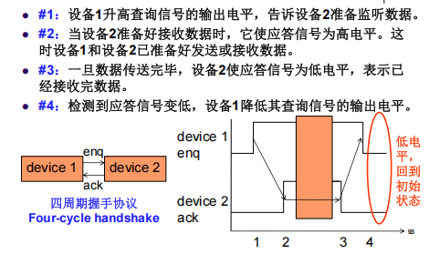

### 7.0.3. 端口映射I/O和存储器映射I/O

要考虑两种cpu组织架构:

####  端口映射I/O(独立编址);


I/O布线是焊死的, 插在这个插槽上的I/O设备的存储器会被唯一分配到一个寻址空间. 


cpu指令集有专门的I/O指令. 在x86上就是`IN`和`OUT`. 执行这些指令会激活一些信号线, 告诉主板切换访问方式: 在`主存地址空间`和`I/O地址空间`中切换. 

**实际上现代CPU都在用存储器映射I/O，对于所有高性能计算场景，事实确实如此。 独立编址的I/O空间在现代系统中更像一个x86为了兼容而需要维护的“历史遗迹”。**

之后的章节我们都考虑存储器映射I/O. 包括PCIe总线协议, 它们都是现代的存储器映射I/O. 

####  存储器映射I/O(统一编址)

CPU的寻址空间被分为主存地址空间和I/O地址空间. 

外设自带的存储器被映射到`I/O地址空间`. **这是CPU自由动态映射的**. 具体见PCIe章节的硬件实现.

访问I/O外设的存储器对CPU来说和访问主存没什麽区别, 只要访问那个物理地址就可以了.

cpu指令集没有什麽I/O指令. 通过普通的MOV(lw, st)指令去访问设备.

### 7.0.4. 枚举:

cpu沿着总线向所有可能的I/O插槽发送询问信号. 在PCIe总线结构中, (除了中断事件)`RC`是枚举的发起者. 它询问该PCIe网络中所有的`endpoint`.

显然枚举只发生在存储器映射I/O.


### 7.0.5. 同步通信和异步通信

前面所说的握手协议是一种`通信协议`, 它既可以应用在异步电路中，也可以应用在同步电路中.


同步通信和异步通信的区别:


| 特性维度 | **同步通信** | **异步通信** |
|-----------|---------------|---------------|
| **核心特征** | 有统一的参考时钟，所有操作与时钟边沿同步。 | 没有统一时钟，通信由事件（信号跳变）触发。 |
| **依赖关系** | 依赖时钟信号的周期性振荡（如 ACLK）。 | 依赖发送方的请求信号（Request）与接收方的应答信号（Acknowledge）。 |
| **时序控制方式** | 通过控制时钟频率、建立/保持时间来满足时序约束。 | 通过握手信号的往返交互来自适应对方时序。 |
| **典型实现方式** | 时钟驱动的寄存器-组合逻辑-寄存器结构。 | 自定时电路、异步 FIFO、事件驱动模块间通信。 |
| **优点** | 设计简单，时序分析清晰，易实现高性能流水线。 | 无需全局时钟分布，功耗低，天然支持不同模块速率。 |
| **缺点** | 时钟偏移（Clock Skew）与时钟树功耗较高；不同频率模块间需使用复杂的 CDC（Clock Domain Crossing）电路。 | 控制逻辑复杂，握手往返带来额外延迟，峰值性能受限。 |
| **典型协议/总线** | AXI4、TileLink、AHB、APB。 | 异步 FIFO、四相/两相握手通信、QDI（Quasi Delay Insensitive）网络。 |

---

**握手协议在两种通信中的角色**

| 场景 | 是否存在时钟 | 握手协议的角色 | 类比 |
|------|----------------|------------------|------|
| **纯异步通信** | ❌ 无全局时钟 | 握手协议是**核心协调机制**。用于双方同步动作，如：发送方发出 Request → 接收方处理后返回 Acknowledge → 再撤销 Request。 | 🧭 两人摸黑传递物品：必须通过“接好了吗？”“接好了！”的确认来防止丢失。 |
| **AXI4 等同步通信** | ✅ 有统一时钟（ACLK） | 握手是**流控（Flow Control）机制**，确保在双方都准备好（VALID=1, READY=1）时才传输数据。运行在统一时钟上。 | ⚙️ 工厂流水线：传送带（时钟）固定速度运行，每个工位（从设备）用按钮（READY）控制自己是否接收物料（VALID）。 |

---


| 特性 | 说明 |
|------|------|
| **同步性来源** | AXI4 所有信号均由全局时钟 ACLK 采样。同步定义在时钟边沿。 |
| **握手意义** | VALID/READY 提供流量控制


## 7.2 PCIe总线

### 7.2.0 PCIe的角色定义

在PCIe的世界里，角色是由其在拓扑结构中的位置和功能**硬性规定**的，一个设备不能随意改变角色。
1.  **RC (Root Complex), 系统主机**
    
    -   **这是系统的主机端**。它通常是CPU芯片组的一部分，或者集成在SoC中。
        
    -   **它是PCIe树状拓扑结构的“根”**。
        
    -   **它是所有PCIe交易的发起者和管理者**。CPU通过RC来访问PCIe设备。
        
    -   **它是总线枚举过程的执行者**。枚举就是由RC代表CPU来完成的。
        
    -   **一个系统通常只有一个RC**。     
2.  **Endpoint, 从机设备**
    
    -   **这是典型的“从机”**，也就是我们通常所说的“PCIe设备”。
        
    -   例如：显卡、网卡、NVMe SSD。
        
    -   **它的主要功能是响应来自RC的请求，或者向RC发起中断等通知**。
        
    -   **它不能主动去访问另一个Endpoint或RC的内存**（除了通过DMA，但那也是由RC配置的）。       
3.  **Switch, 路由中断/扩展总线**
    
    -   这是一个**扩展器**，用于将一个PCIe端口扩展成多个端口。
        
    -   它在协议中扮演着**路由器的角色**，既不是纯粹的主机也不是纯粹的从机。它对上游（靠近RC的一方）表现为一个Endpoint，对下游（连接设备的一方）表现为一个RC。
        
    -   它的存在使得多个设备可以共享同一个CPU的PCIe通道。


-   **发起请求的一方称为 Requester**。 RC总是requester, 除非在endpoint发起中断时.
-   **响应请求的一方称为 Completer**。endpoint总是completer,  除非在endpoint发起中断时.
-   当我们说`PCIe设备`, `PCIe从机`的时候, 指的就是一个`endpoint`.

### 7.2.1 PCIe的具体硬件实现


#### 7.2.1.1 **PCIe配置空间**

所有**遵循PCIe协议的从机设备**, 都有一个寄存器块(256B~4KB), 称为PCIe配置空间.


#### 7.2.1.2 **BAR, base addr reg, 基址寄存器**

BAR是PCIe配置空间的一部分. 有很多个, 位数即为CPU寻址位数. **一个BAR对应这个设备需要使用的一块内存空间大小.** 

BAR是这样告诉CPU它的需求的:
* 系统启动时, 会往每个从机设备的每个BAR寄存器写全`1`. 
* 然后BAR会将这个值改变,  **BAR会将需要用到的低位地址置零**.
*  然后CPU读取它, 记录并分配一块寻址空间.
*  然后覆写BAR, 将BAR变为**对应的基地址**.

* **注意**: 这里cpu分配的是**寻址空间的地址段**, 是抽象的东西, cpu本身并没有付出什麽资源(cpu的主存一般不会占满寻址空间, 多出来的可以分配给I/O内存空间映射.) 具体物理实现是要设备使用自己的内存器.
* **注意**: CPU给PCIe从机分配的地址空间都是**物理地址空间**, 不涉及虚拟地址转换.

***
***
***

### 7.2.3 一个PCIe从机的例子:

假设我们有一个简单的以太网控制器，要把它接到32bit的RISC SoC(寄存器映射I/O)上. 

它身上有两块存储器: `控制寄存器`(4KB)和`数据缓冲区`(64KB), 所以有两个需要映射的区域：

1.  **控制寄存器区**：需要4KB寻址空间。
    
2.  **数据缓冲区**：需要64KB寻址空间。
    
这块网卡有一个PCIe配置空间寄存器组. 其中有两个BAR：`BAR0`和`BAR1`。

-   **系统启动时**：
    1.  操作系统向BAR0写`0xFFFF_FFFF`，读回`0xFFFF_F000`。这表明它需要4KB（低12位为0）对齐的空间。
    2.  向BAR1写`0xFFFF_FFFF`，读回`0xFFFF_0000`。这表明它需要64KB（低16位为0）对齐的空间。     
-   **系统分配后**：  
    1.  操作系统决定将`控制寄存器`映射到物理地址 `0x4000_0000`~`0x4001_0000`，于是将基址`0x4000_0000` 写入BAR0。
    2.  将`数据缓冲区`映射到物理地址 `0x5000_0000`~`0x5000_1000`，于是将 `0x5000_0000` 写入BAR1。   
-   **驱动程序工作**：  
    现在，设备驱动程序知道了：
    -   要读取网卡的状态，就去访问地址 `0x4000_0000 + 偏移量`   
    -   要发送一个数据包，就去访问地址 `0x5000_0000 + 偏移量` 
        所有这些访问都是通过普通的存储器读写指令（如RISC-V的`ld`/`sd`，x86的`mov`）完成的。


## 7.3 AXI4总线

这个总线协议是业界广泛应用的高性能片上总线标准, 值得学习.


| 特性维度 | AXI4 (AXI4-Full) 特性概述 |
|-----------|-----------------------------|
| **协议定位** | 面向高性能、高带宽的存储器映射型通信协议，用于主从设备间的高效数据传输。 |
| **通道结构** | 共5个独立通道：<br>① 读地址通道（AR）<br>② 读数据通道（R）<br>③ 写地址通道（AW）<br>④ 写数据通道（W）<br>⑤ 写响应通道（B）。 |
| **握手机制** | 所有通道均采用 `VALID` / `READY` 双向握手机制，确保数据与地址在双方准备好时安全传输。 |
| **突发传输 (Burst)** | 支持突发传输模式：主设备仅提供起始地址，即可连续传输多个数据拍。<br>支持类型包括 `FIXED`、`INCR`、`WRAP` 三种突发类型。 |
| **事务组织** | 每个事务由一次突发传输组成，可包含1~256个数据拍（beats）。每个数据拍在握手后独立确认。 |
| **数据宽度支持** | 支持 32-bit、64-bit、128-bit、256-bit、512-bit 等多种数据总线宽度，可根据系统带宽需求配置。 |
| **地址支持** | 支持 32-bit 或 64-bit 地址空间，可灵活寻址不同存储区域。 |
| **乱序与并发** | 支持事务 ID（`ARID` / `AWID`）机制，可在主设备与从设备之间实现多事务乱序执行与响应重排。 |
| **互联支持** | 通过 AXI Interconnect 实现多主多从拓扑结构，可配置仲裁与路由策略，保证系统可扩展性。 |
| **写响应机制** | 每次写事务结束时，由从设备通过 B 通道返回写完成响应（OKAY、SLVERR、DECERR等）。 |
| **主要应用场景** | 高带宽模块，如 DDR 控制器、DMA 控制器、GPU/AI 加速器、片上互联（NoC）等。 |
| **典型对比** | AXI4-Lite 为简化版本（仅单拍传输，无突发）；AXI4-Stream 用于高速数据流传输（无地址信号）。 |


## 7.5 I/O设备--I/0接口--I/O控制器

一般是一个IP核, 硬件模块. 功能:

-   **接收CPU命令**：CPU通过总线向控制器的命令寄存器写入指令。  
-   **数据缓冲**：拥有数据缓冲区，暂存要发送或接收的数据。   
-   **协议实现**：根据接口标准，生成或解析底层的物理信号。    
-   **中断生成**：当操作完成或有事件发生时，向CPU发出中断信号。  
-   **支持DMA**：高性能控制器内置DMA引擎，可直接与内存交换数据，无需CPU参与。

对软件程序员可见. CPU通过读写I/O控制器内部的寄存器来控制外设.


```
CPU---I/O控制器---I/O接口---I/O设备
```

## 7.6 I/O端口

**端口**指的就是**寄存器**. **可以寻址的寄存器组**. 如果你愿意, 你可以说整块主存是"**CPU需要的所有内部数据的端口**", 一个内存地址就是一个**数据端口号**.

I/O端口指的就是I/O设备工作要用的寄存器. 包括:

* 命令（控制）端口: 一个只写的I/O寄存器. cpu写入该寄存器, 来命令I/O设备执行某个操作.

* 数据端口: 该I/O寄存器内存储用于在CPU和I/O之间传输的数据.

* 状态端口: 只读I/O寄存器. CPU通过读取它来得到I/O设备的当前状态.


***
***
***
那麽这些寄存器在哪里呢? 


首先, 每个外设都自带寄存器阵列. 
* 比如一个1bit的就绪状态寄存器, 可以用一个DFF实现; 
* 一个8bit数据寄存器可以用8个DFF实现.


RISC的cpu启动后, 会对PCIe总线进行**枚举**.


# 8 RISCV 扩展

## 8.2 P扩展

RISCV为了蚕食DSP市场推出的.

一个集成了DSP扩展的RISC-V CPU，相比独立的“通用CPU + 专用DSP”组合，在系统复杂度、成本和功耗上更具优势。

## 8.3 V扩展

向量化计算扩展.


## 8.4 matrix扩展


##


# 9 ARM架构

## 9.0 概述


### 9.0.1 arm架构的寄存器: 15个通用寄存器 + 1个PC + CSPR + SPSR

ARM A32有16个通用寄存器(R0~R15). 不同于riscv32, 现在寄存器只需要4bit来寻址了.


| 寄存器  | 用途 / 特性  | 备注   |calling convention函数调用约定|
| ------- | -------- | ------ |--|
| **R0–R3**    | 通用寄存器 | 用于函数参数传递、临时运算，可自由使用  | caller-saved |
| **R4–R11**   | 通用寄存器 / 保存寄存器  | 一般在函数调用中用于保存局部变量，调用者负责保存  | callee-saved|
| **R12 (IP)** | Intra-Procedure-call scratch register | 用作函数调用中间寄存器（临时），可用于跳转地址计算  |caller-saved|
| **R13 (SP)** | Stack Pointer（栈指针）  | 指向当前堆栈顶，用于 push/pop、堆栈操作     |--|
| **R14 (LR)** | Link Register（返回地址寄存器）   | 函数调用返回地址保存寄存器，执行 `BL` 指令会自动写入   |--|
| **R15 (PC)** | Program Counter（程序计数器）  | 指向下一条要执行的指令，读取写入时要注意流水线偏移 (+8)  |--|
| **CPSR**  | Current Program Status Register   | 包含 NZCV 条件标志位、模式位、中断屏蔽等，不是通用寄存器. |--|
| **SPSR**     | Saved Program Status Register  | 保存模式切换前的 CPSR，用于异常/中断返回，只有特权模式有. |--|

* callee saved: 被调用的函数必须负责在返回前恢复原状.
* caller saved: 父函数必须负责里面东西自己保存好.(被调用函数可以随便改)


### 9.0.2  ARM 汇编的大小写敏感性
-   **ARM 汇编指令（Mnemonic）本身是大小写不敏感的**。   
    -   `ADD r0, r1, r2` ✅        
    -   `add r0, r1, r2` ✅        
    -   `AdD r0, r1, r2` ✅        
-   汇编器（比如 GNU as，或者 ARM 自家的 armasm）都会接受大小写混用。    
-   但 **寄存器名** 也一样大小写不敏感：`R0` 和 `r0` 都行。    
-   **符号/标签** 则依赖汇编器：GNU as 默认是大小写敏感的（`Label` ≠ `label`）。


### 9.0.3 arm指令的条件执行码{cond}

虽然不同类型的arm指令结构不同, **但每条arm指令都分配了4bit的`{cond}`域.** 可以在指令名之后加上如下的条件执行码字母, 手动设置`{cond}`域, 从而实现条件执行该指令. 

当运行到该指令时, 查看CPSR寄存器的NZCV四个位, 从而判断是否执行该指令.

如果没有设置, 默认{cond}=AL=`1110`.


| 条件码     | 二进制编码  | 含义    | 触发条件                     |
| ------- | ------ | ---------- | ------ |
| `EQ`    | `0000` | equal  | Z=1     |
| `NE`    | `0001` | not equal   | Z=0      |
| `CS/HS` | `0010` | carry set / higher or same | C=1   |
| `CC/LO` | `0011` | carry clear / lower        | C=0|
| `MI`    | `0100` | negative                   | N=1 |
| `PL`    | `0101` | positive (plus)            | N=0                      |
| `VS`    | `0110` | overflow set               | V=1                      |
| `VC`    | `0111` | overflow clear             | V=0                      |
| `HI`    | `1000` | higher (unsigned)          | C=1, Z=0                 |
| `LS`    | `1001` | lower or same (unsigned)   | C=0 or Z=1               |
| `GE`    | `1010` | greater or equal (signed)  | N=V                      |
| `LT`    | `1011` | less than (signed)         | N≠V                      |
| `GT`    | `1100` | greater than (signed)      | Z=0 and N=V              |
| `LE`    | `1101` | less or equal (signed)     | Z=1 or N≠V               |
| `AL`    | `1110` | always                     | 无条件（默认）                  |
| （保留）    | `1111` | 通常未定义/保留                   | ARMv7 里 `NV`（never），后来弃用 |


示例:
```
TST     r0, #1      ; 无条件，测试最低位是否为1
TSTEQ   r0, #1      ; 只有 Z=1 时才测试（即前一条指令结果为0时）
TSTNE   r0, #1      ; 只有 Z=0 时才测试
```

### 9.0.4 CPSR寄存器 NZCV标志位 {S}后缀

* NZCV是 **CPSR（Current Program Status Register）** 里的四个条件标志位.

* CPSR在**带{S}后缀的指令**或者**比较/测试类指令(CMP, TST, CMN, TEQ, ...)**运行后更新结果. (后者这几个指令可以认为永远隐式包含{S}后缀.)

| 标志     | 含义    | 什么时候置位？  |
| ---- | -------- | ------------------------------ |
| **N** (Negative) | 结果是否为负数   | 如果结果最高位=1   |
| **Z** (Zero)     | 结果是否为零            | 如果结果=0                         |
| **C** (Carry)    | 无借位(减法), 无进位(加法)| 如果 `Rn >= Operand2`，C=1；否则 C=0 |
| **V** (Overflow) | 有符号数运算结果溢出 | **加法溢出**: 最高位操作数同号结果异号. **减法溢出**: 最高位操作数异号，结果符号和被减数不同。|


## 9.1 数据处理 指令
 
### 9.1.0 数据处理指令概述和结构

数据处理指令可以大体分为三类: **寄存器传送/比较/运算**.

**数据处理指令** 有统一的 **指令结构**:
-   \[31:28\] 条件码 (cond)    
-   \[27:26\] `00` → 表示数据处理类    
-   \[25\] I → `second operand`是否使用立即数.` I=1`->是立即数. `I=0`->是寄存器.    
-   \[24:21\] opcode → 运算类型（ADD/SUB/AND/ORR/MOV/CMP 等）    
-   \[20\] S → 是否更新标志位   
-   \[19:16\] Rn → 第一个操作数寄存器   
-   \[15:12\] Rd → 结果寄存器   
-   \[11:0\] Operand2 → 第二个操作数（寄存器或立即数）


### 9.1.1 寄存器传送指令


**功能**：算术、逻辑、比较、寄存器传送等。  
**格式**（32 位）：


| 指令名   | 指令语法  | 作用 | 主要字段（编码概要） | 常见示例 | 说明 / 注意  | 
|--|--|---| -- |-- |--- |
| **MOV**（Move，寄存器/立即数传送）           | `MOV{cond}{S} Rd, Operand2`     |             `Rd = Operand2`（忽略 Rn 字段） | data-processing `opcode=1101`，Rn 通常不使用        | `MOV r0, r1` ; `MOV r0, #0xFF`      | `S=1` 时会更新标志（注意影响 CPSR）                           |
| **MVN**（Move Not，取反并传送）           | `MVN{cond}{S} Rd, Operand2`     |               `Rd = ~Operand2`（忽略 Rn） | data-processing `opcode=1111`                 | `MVN r0, r1`                        | 等同 `Rd = NOT Op2`                                 |


### 9.1.2 寄存器比较指令

| 指令名   | 指令语法  | 作用 | 主要字段（编码概要） | 常见示例 | 说明 / 注意  | 
|--|--|---| -- |-- |--- |
| **CMP**（Compare，比大小）              | `CMP{cond} Rn, Operand2`        | 计算 `Rn - Operand2`，**只更新 NZCV，不写 Rd** | data-processing `opcode=1010`，S 位隐含为 1（不写 Rd） | `CMP r0, #0`                        | 用于条件分支判断（BEQ/BNE/…）                               |
| **CMN**（Compare Negative，加对比）     | `CMN{cond} Rn, Operand2`        |           计算 `Rn + Operand2`，只更新 NZCV | data-processing `opcode=1011`                 | `CMN r0, #1`                        | 常用于检测溢出/相加后的标志                                    |
| **TST**（Test，按位与测试）               | `TST{cond} Rn, Operand2`        |           计算 `Rn & Operand2`，只更新 NZCV | data-processing `opcode=1000`                 | `TST r0, #1`                        | 用于测试某些位是否为 1                                      |
| **TEQ**（Test Equivalence，按位异或测试）  | `TEQ{cond} Rn, Operand2`        |           计算 `Rn ^ Operand2`，只更新 NZCV | data-processing `opcode=1001`                 | `TEQ r0, #0xFF`                     | 用于测试相等性的位层面差异                                     |


### 9.1.2 寄存器运算指令


| 指令名   | 指令语法  | 作用 | 主要字段（编码概要） | 常见示例 | 说明 / 注意  |  
|--|--|---| -- |-- |--- |
| **ADD**| `ADD{cond}{S} Rd, Rn, Operand2` | `Rd = Rn + Operand2` | data-processing（如上） `opcode=0100`  | `ADD r0, r1, r2` ; `ADD r0, r0, #1` | `S=1` 时更新 NZCV；Operand2 可为移位寄存器或立即数（imm8+rotate） | 
| **ADC** (Add with Carry, 带进位加)| `ADC{cond}{S} Rd, Rn, Operand2` |              `Rd = Rn + Operand2 + C` | data-processing `opcode=0101`                 | `ADC r2, r3, r4`                    | 用于多字长加法（结合 C 标志）                                  |
| **SUB**（Subtract，减法）              | `SUB{cond}{S} Rd, Rn, Operand2` |                  `Rd = Rn - Operand2` | data-processing `opcode=0010`                 | `SUB r0, r1, #4`                    | `S=1` 时影响 NZCV                                   |
| **SBC**（Subtract with Carry，带借位减） | `SBC{cond}{S} Rd, Rn, Operand2` |        `Rd = Rn - Operand2 - (1 - C)` | data-processing `opcode=0110`                 | `SBC r0, r1, r2`                    | 用于多字长减法                                          |
| **RSB**（Reverse Subtract，反向减）     | `RSB{cond}{S} Rd, Rn, Operand2` |                  `Rd = Operand2 - Rn` | data-processing `opcode=0011`                 | `RSB r0, r1, #0`（可做取反）              | 常用于快速求 `-Rn`（例如 `RSB r0, r0, #0` 得到 `-r0`）       |
| **RSC**（Reverse SBC，反向带借位减）       | `RSC{cond}{S} Rd, Rn, Operand2` |        `Rd = Operand2 - Rn - (1 - C)` | data-processing `opcode=0111`                 | `RSC r0, r1, r2`                    | 较少用，配合 C 标志做多字长运算                                 |
| **AND**（按位与）                      | `AND{cond}{S} Rd, Rn, Operand2` |                  `Rd = Rn & Operand2` | data-processing `opcode=0000`                 | `AND r0, r1, r2`                    | `S=1` 可用于测试位（但 TST 更常用）                           |
| **ORR**（Logical OR，按位或）           | `ORR{cond}{S} Rd, Rn, Operand2` |                             \`Rd = Rn | Operand2\`                                    | data-processing `opcode=1100`       | `ORR r0, r1, #0xFF`                               |
| **EOR**（Exclusive OR，按位异或）        | `EOR{cond}{S} Rd, Rn, Operand2` |                  `Rd = Rn ^ Operand2` | data-processing `opcode=0001`                 | `EOR r0, r1, r2`                    | 常用于翻转掩码位                                          |
| **BIC**（Bit Clear，位清除）            | `BIC{cond}{S} Rd, Rn, Operand2` |                 `Rd = Rn & ~Operand2` | data-processing `opcode=1110`?（注：实际opcode固定）  | `BIC r0, r1, #0x1`                  | 用于清除位，等价 `AND Rn, ~Op2`                           |


其他寄存器运算指令:

* ADR
  * 伪指令. 实现方式取决于上下文.


#### SWP

```
`SWP{B}{cond} Rd, Rm, [Rn]`
```
-   `SWP`：交换 word (32-bit)   
-   `SWPB`：交换 byte (8-bit)   
-   `Rd` ← 从内存 `[Rn]` 读出的数据   
-   `[Rn]` ← 写入 `Rm` 的数据   
-   `cond`：条件执行码

**SWP实现信号量操作**

-   `SWP` 常用于 **多处理器 / 中断环境下的原子操作**（比如实现自旋锁）。  
-   在 ARMv6 之后，`SWP/SWPB` 被 **弃用 (deprecated)**，推荐使用新的 **LDREX / STREX** 指令对来实现原子交换。

#### 


## 9.2 [单]数据传输 指令(load/store)

**数据传输指令指令** 在 **寄存器** 和 **内存**之间搬运数据.

-   \[31:28\] cond   
-   \[27:26\] `01` → 表示 load/store   
-   \[25\] I → 偏移是立即数还是寄存器   
-   \[24\] P → 前/后变址    
-   \[23\] U → 加/减偏移   
-   \[22\] B → 是否字节（1=byte, 0=word）   
-   \[21\] W → 是否写回基址    
-   \[20\] L → 1=LDR, 0=STR    
-   \[19:16\] Rn → 基址寄存器    
-   \[15:12\] Rd → 数据寄存器    
-   \[11:0\] offset → 偏移量
   


| 指令名（缩写/中文）                                     | 指令                      |                         作用 | 主要字段（编码概要）                                                                                                           | 常见寻址语法（示例）                                             | 说明 / 注意                                           |
| ---------------------------------------------- | ----------------------- | -------------------------: | -------------------------------------------------------------------------------------------------------------------- | ------------------------------------------------------ | ------------------------------------------------- |
| **LDR**（Load Register，加载寄存器）                   | `LDR Rd, [Rn, #offset]` |   从内存加载一个 32-bit word 到 Rd | `cond(31:28)` `01(27:26)` `I(25)` `P(24)` `U(23)` `B(22)` `W(21)` `L(20)=1` `Rn(19:16)` `Rd(15:12)` `offset12(11:0)` | `LDR r0, [r1]` ; `LDR r0, [r1,#8]` ; `LDR r0, [r1,r2]` | `P/U/W` 控制前/后/写回；`I=0` 表示寄存器偏移（移位可用），`I=1` 表示立即偏移 |
| **STR**（Store Register，存寄存器）                   | `STR Rd, [Rn, #offset]` |           将 Rd 的 word 存到内存 | 同上，`L(20)=0`                                                                                                         | `STR r2, [r3,#4]` ; `STR r4, [r5],#8`                  | `STR r, [rn,#off]!` 表示前变址并写回（Rn 更新）               |
| **LDRB / STRB**（Load/Store Byte，字节）            | `LDRB/STRB`             |            读/写 8-bit（byte） | 与 `LDR/STR` 格式相同，`B(22)=1`                                                                                           | `LDRB r0, [r1,#3]`                                     | 只传/存 1 字节                                         |
| **LDRH / STRH**（Load/Store Halfword，半字）        | `LDRH/STRH`             |       读/写 16-bit（halfword） | 半字/字节也有“特定编码变体”（halfword/byte-transfer 格式），语法类似                                                                      | `LDRH r0, [r1,#2]` ; `STRH r1, [r0,#2]!`               | 半字访问建议对齐到偶地址；`LDRSH/LDRSB` 会符号扩展到 32-bit          |
| **LDRSB / LDRSH**（Load Signed Byte/Half，带符号加载） | `LDRSB/LDRSH`           | 加载带符号的 byte/halfword 并符号扩展 | 类似 `LDRH` 的特殊格式                                                                                                      | `LDRSB r0, [r1,#5]`                                    | 将 8/16 位符号扩展为 32 位放到 Rd                           |


## 9.3 [块]数据传输 指令(LDM(load motiple)/STM)

| 指令名（缩写/中文）    | 指令   |作用 | 主要字段（编码概要）| 语法（示例）       | 说明 / 注意  |
| ---------- | ------- | ------: | --------- | ------- | ---- |
| **LDM**（Load Multiple，多寄存器加载） | `LDM{cond} Rn{!}, <register_list>` |  从内存一次加载多个寄存器（load multiple） | `cond(31:28)` `100(27:25)` `P(24)` `U(23)` `S(22)` `W(21)` `L(20)=1` `Rn(19:16)` `register_list(15:0)` | `LDM r13!, {r0-r3, r12, pc}`            | `register_list` 是 16-bit 掩码 (bit0->R0 ... bit15->R15)；`W`=1 表示写回（常用于弹栈）                    |
| **STM**（Store Multiple，多寄存器存） | `STM{cond} Rn{!}, <register_list>` | 把一组寄存器一次写回内存（store multiple） | 与 `LDM` 类似，`L(20)=0`                                                        | `STM r13!, {r4-r7, lr}`     | 常用于函数前保存寄存器（入栈）      |
| **寻址顺序 IA/IB/DA/DB**（寻址模式说明）  | 跟在LDM, STM后排列组合  |                 决定传输的地址计算和顺序 | 映射：IA (P=0,U=1), IB (P=1,U=1), DA (P=0,U=0), DB (P=1,U=0)                                              | `LDMIA r0!, {...}` 等价于 `LDM r0!, {...}` | IA = Increment After；IB = Increment Before；DA/DB = Decrement variants。影响寄存器传输的先后顺序（关键于栈操作） |
| **PUSH / POP**（伪指令，栈操作）       | `PUSH {regs}` / `POP {regs}`       |            汇编伪指令：把寄存器推入/从栈弹出 | `PUSH {regs}` -> `STMDB sp!, {regs}` ; `POP {regs}` -> `LDMIA sp!, {regs}`                             | `PUSH {r4-r7,lr}` ; `POP {r4-r7,pc}`    | `POP` 中包含 `pc` 时会把 `pc` 载入并跳转（作为返回）；DB/IA 组合常用于约定的栈生长方向   |
* STM和LDM的写入顺序: 和寄存器列表无关. 寄存器列表总是按寄存器号升序排序后，依次存入内存。
  * `STMIA r0!, {r6, r1, r3}  ; 寄存器列表顺序是 r3, r1, r6`
  * 该指令会往R0及上方依次写入`r1, r3, r6`, `r6`在地址最高点.
  * 如果改为`STMDA r0!, {r6, r1, r3}`, 则`r6`在地址最低点.


* **寻址顺序 IA/IB/DA/DB**
  * 如果不指定寻址顺序 IA/IB/DA/DB, 直接使用LDM, STM, 默认都是先写入再向上滑动指针(**IA**):
    * LDM==LDMIA
    * STM==STMIA

  ***
  ***

  * IA/IB/DA/DB的区别:

    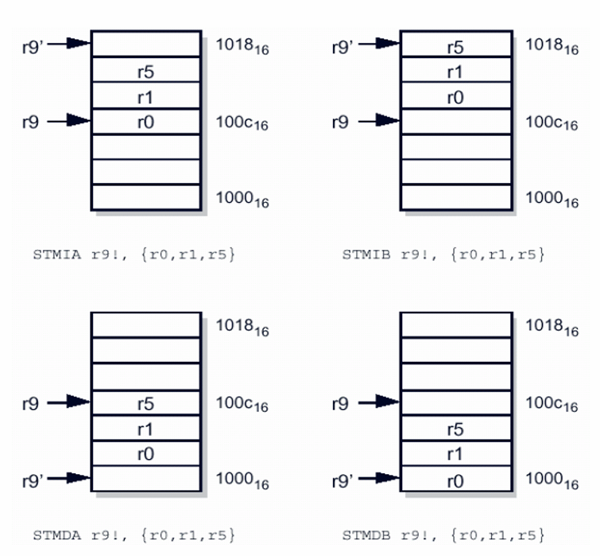

    A: 先写入再滑动指针.
    B: 先滑动指针再写入.

  * 寻址顺序的**旧写法**: **FA, FD, EA, ED**
    * F(full)对应A(after), 意为让内存块存满数据再移动地址, 即操作完后, 基地址会指向最后一个...
    * E(empty)对应B{before)
    * A(ascending)对应I(increament)
    * D(descending)对应D(decreament)

* `{!}`的作用: 协会基址寄存器Rn. 例如:
  * `STMIA r0, {r1,r2}` 
    * 把`r1`写入内存`mem[r0]`
    * 把`r2`写入内存mem[r0+4].
  * `STMIA r0!, {r1,r2}` 
    * 把`r1`写入内存`mem[r0]`
    * 把`r2`写入内存mem[r0+4]
    * 然后`r0=r0+8`.


## 9.4 分支/控制流转移 指令

**控制流转移** 指的就是会改变PC值的指令.

| 指令名 | 指令格式 | 功能说明  | 常见语法 | 主要编码概要   |
| ----- | ---- | ------- | --- | --------- |
| **B(branch)**                        | `B{cond}`      | 跳转到指定 PC 相对偏移                      | `B label` ; `BEQ loop` | `cond(31:28)` + `101` + `offset(23:0)` |
| **BL(Branch with Link)**              | `BL{cond}`     | 跳转并保存返回地址到 `LR`(link reg, 一般是`r14`)             | `BL func` (func是一个label, 一个函数的起始指令地址)              | 同 `B`，但 `L(24)=1`                      |
| **Branch and Exchange**           | `BX Rm`        | 跳转到寄存器 `Rm` 指定的地址，并切换 ARM/Thumb 状态 | `BX lr` ; `BX r3`      | `cond` + `000100101111111111110001 Rm` |
| **Branch with Link and Exchange** | `BLX`          | 子程序调用，跳转到寄存器或立即数地址，同时可能切换 Thumb    | `BLX r3` ; `BLX label` | 两种编码变体（寄存器型/立即数型）                      |
| **Supervisor Call**               | `SVC` (以前 SWI) | 触发软中断，陷入内核/OS 调用                   | `SVC #imm`             | `cond` + `1111` + `imm24`              |
| 使用MOV指令实现跳转: **MOV PC, Rm**                    | -              | 把寄存器值装进 `PC`，相当于间接跳转               | `MOV pc, r0`           | 数据处理类，目的寄存器是 `PC`                      |
| 使用LDR指令实现跳转: **LDR PC, \[addr]**               | -              | 从内存加载地址到 `PC`，相当于间接跳转              | `LDR pc, [r0]`         | 单数据传输类，目的寄存器是 `PC`                     |
| **POP {..., PC}**                 | -              | 从栈中弹出 PC，实现子程序返回                   | `POP {r4-r7, pc}`      | 多寄存器加载（LDM/POP 的语法糖）                   |


常用条件跳转:

* BLE(Less than or Equal)
* BEQ(Equal)
* 


## 9.5 协处理器 指令
包括:


MCR, MRC, CDP

## 9.6 常用arm伪指令汇总


### 9.6.1 LDR伪指令

注意区分LDR非伪指令.


格式: `LDR   r, =[label/addr]`

例如:

```asm
LDR   r3, =0xff0
; 0xff0是合法立即数(8bit旋转可得), 所以直接翻译为:


```

### 9.6.2 LTORG

声明一个**文字池**.

#### 文字池(literal pool):


### DCB/DCD 伪指令

## 9.7 伪操作

### INFO

### ASSERT

## 9.6 四种指令寻址

| 寻址方式    | 指令给出的内容 | 实际操作数来源      | 例子                |
| ------- | ------- | ------------ | ----------------- |
| 立即数寻址   | 常数      | 直接使用该常数      | `MOV R0, #5`      |
| 寄存器寻址   | 寄存器编号   | 寄存器中的内容      | `ADD R0, R1, R2`  |
| 直接寻址    | 内存地址    | 指定地址的内存内容    | `LDR R0, =0x2000` |
| 寄存器间接寻址 | 地址寄存器   | `[寄存器]`指向的内存 | `LDR R0, [R1]`    |


### 9.2.1 立即数寻址

- 操作数是立即数. 直接写在指令里，不需要去寄存器或内存再取。  
- 比如`MOV r0, #5      ; 把立即数 5 送到 r0`

### 9.2.2 寄存器寻址

也就是操作数是寄存器~

`ADD r2, r1, r0      ; r2 = r1 + r0`

### 9.2.3 寄存器间接寻址

-   指令的操作数写作`[寄存器]`，这个寄存器存放内存地址. CPU 再去这个地址取真正的操作数。    
-   典型用法就是访问数组、指针。   
-   例如ARM 里 LDR/STR 指令格式经常使用间接寻址:  
```assemble
LDR R0, [R1]     ; R0 = mem[R1] 
STR R2, [R3]     ; mem[R3] = R2
```    
-   还可以带一个**12bit**的立即数偏移offset. 分为**前变址**写法和**后变址**写法. 
```asm
LDR R0, [R1]        ; R0 = mem[R1+4]. R1不变. 无变址, 
LDR R0, [R1, #4]    ; R0 = mem[R1+4], R1不变. 前变址. 
LDR R0, [R1, #4]!   ; R0 = mem[R1+4], 然后R1 = R1+4. 前变址+写回.
LDR R0, [R1], #4    ; R0 = mem[R1], 然后R1 = R1+4. 后变址.
```

* `!` **写回标志**表示：**同时把计算后的地址写回基地址 Rn（自动更新基地址）**。 必须用在`[]`后面. 


* 寄存器间接寻址的**自动寻址**

指的是一些间接寻址命令下, ARM帮你改变基地址寄存器的情况, 而少写一条`ADD rn, rn, offset`指令.

  * 通过自己写附带偏移实现自动寻址: `LDR R1, [R0], #4` 该命令做:
    * R1 ← MEM[0x1000]
    * R0 ← 0x1000 + 4
    * 不需要再写一条`ADD R0, R0, #4`了, 称为自动寻址.
  * 使用STM/LDM命令时ARM自动进行寻址, 帮你一个一个填好.


### 9.2.4 直接寻址(罕见)

`LDR r0, =0x2000     ; 把地址 0x2000 装入 r0`


## 9.7 ARM流水线

**📌 ARM 的流水线发展**
-   ARM7：3 级流水线（取指/译码/执行）。  
-   ARM9/ARM10：5 级流水线（增加访存、写回阶段）。   
-   Cortex-A 系列（现代 ARM）：更长（8~14 级甚至更深），支持乱序执行。

和riscv的差异:

-   **RISC-V**：    
    -   PC 自动管理，不暴露给汇编程序员。       
    -   流水线存在，但对汇编代码透明。       
    -   更“干净”的设计。
        
-   **ARM**：    
    -   PC 可以当作普通寄存器显式使用。       
    -   流水线会影响 PC 的值（取到的是地址 + 偏移）。      
    -   程序员要额外小心，特别是在写裸机或手写汇编时。

###

###


# 2. RISCV 指令集

## 2.0 一些基本概念


### 2.0.2 字节, 字,
**字节(byte)**
几乎所有现代计算机架构里（包括 x86 和 RISC-V），1 个字节 = 8 bit。

这是国际标准，基本不会变。

**字(word)**
-   **字(word)** 的含义：和机器架构紧密相关，通常指 **处理器自然操作的数据宽度**。在不同架构里，“word”的大小可能不同：     
    -   在 **RISC-V RV32/64**：一个字 = 32 bit（= 4 字节）           
    -   在早期 **x86（16 位 8086）**：一个字 = 16 bit      
    -   在现在 **x86-64**：虽然是 64 位处理器，但很多文档里仍把 word 定义成 16 bit，为了兼容历史（所以才有 `word`\=16b, `dword`\=32b, `qword`\=64b 的奇怪叫法 😂）。

-   **XLEN** 指的是一个具体 RISC-V 处理器实现中 **原生整数寄存器的位宽 (Native Integer Register Width)**.
    -   risc-v32， XLEN=32
    -   risc-v64， XLEN=64
     

### 2.0.3 RISCV 指令语法; 操作数和立即数


* **操作数(operand)**: 在计算机指令里, 操作数就是指令要处理的数据. 它的物理存在就是寄存器. 
* **立即数**: 指的是指令里写的常数. 
    * 例如下面两条指令中:
      * 第一条指令中, a称为**目标操作数**, b,c称为**源操作数**
      * 第二条指令中, 1,2是**立即数**.
      * 操作数a, b, c是`x0`~`x31`32个**通用整数寄存器**之一. 对RV32架构, 它们是32bit宽的寄存器, 对RV64架构, 它们是64bit宽的寄存器.

```
add a. b. c    //将变量b,c相加, 其和放入a.
sub a. 2. 1    //将常数1-2, 其和放入a.
```

* 每个RISC-V算术指令只执行一个操作, 并且只有三个变量.
* 每行只能包含一条指令.
* 用//注释.
* 当我们说寄存器的时候, 一般默认指的是RISC-V架构下的那**32个通用整数寄存器（x0 - x31）**。而且，**只有它们可以直接作为算术和逻辑运算指令的操作数。**
* 更多的大量数据被存储在内存中. 需要**数据传输指令**把它们放到寄存器去里运算.
* 对于复杂指令集(CISC), 有时允许直接把内存地址A的值和内存地址B的值相加存到内存地址C. 这在RISC-V中不被允许. 所有算数必须先把数据搬到这32个寄存器里.


下面是一些常用数据传输指令:
```
-   `lw x1, (a)` // 载入指令Load word: 将内存地址A处的**字（Word）** 加载到寄存器x1。  
-   `lw x2, (b)` // 载入指令Load: 将内存地址B处的**字（Word）** 加载到寄存器x2。    
-   `add x3, x1, x2` // 运算指令: 在寄存器x1和x2上进行加法运算。  
-   `sw x3, (c)` // 存储指令Store word: 将寄存器x3中的结果**存储**回内存地址C。
```


* RISCV架构下(事实上所有架构特点都如此), 只有32个寄存器 


```
add a. b. c    //将变量b,c相加, 其和放入a.


//若想将四个变量b,c,d,e相加, 放入a中:
add a. b. c     //将b,c相加放入a
add a. a. d     //将a,d相加放入a
add a. a. e     
```


***
例题

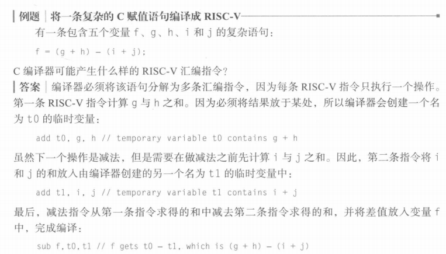
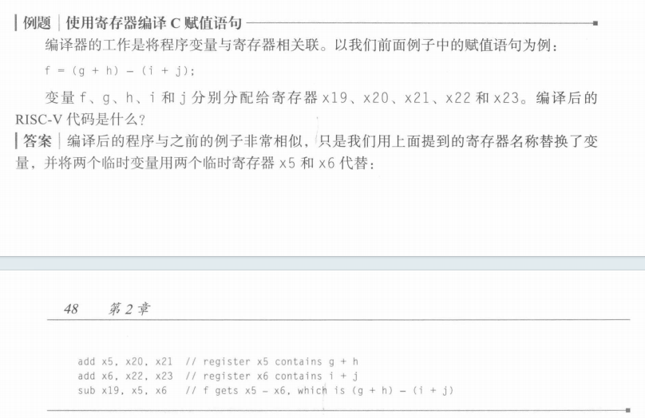


### 2.0.4 解释器

我们熟悉的C是这样运作的:(省略预处理环节)
C源文件 → (编译器compiler) → 汇编代码 → (汇编器assembler) → 机器码 → (链接器linker) → 可执行文件

但是大多数其他高级语言如python, java, 追求**跨平台**(跨架构(X86, ARM, RISC-V...), 跨操作系统).

它们需要一个**解释器**. (一个软件. 它针对不同**操作系统**和**硬件架构**)而不同.

这些语言的源代码经过它们的**编译器**后, 生成**字节码bytecode**(`.class` 文件). 这个文件不是某个架构的汇编语言. 是一种中间语言, 它被设计为跨平台的东西. 事实上它是一个虚拟的指令集(也写成一条条指令的样子, 虽然它并不能直接被任何架构读取...)

这些字节码文件通过解释器得到可执行程序.

实际操作上, 解释器被集成在**JVM(Java Virtual Machine，Java虚拟机)**中. 可以认为JVM对应C中的`编译为汇编指令,链接`任务.


java程序多种运行方式:
-   **纯解释执行 (Interpreter mode)**   
    -   JVM 直接逐条把字节码解释成机器指令运行。        
    -   优点：启动快，不需要额外编译。        
    -   缺点：运行效率低，因为每条字节码都要被“现场翻译”一次。
        
-   **JIT 编译执行 (Just-In-Time)**
    
    -   JVM 在运行过程中，发现某段代码经常被调用，就会 **动态把那部分字节码编译成本地机器码**。        
    -   这样后续运行时就直接执行机器码，不再解释。        
    -   优点：热点代码性能接近 C 程序。        
    -   缺点：第一次编译会有额外开销，所以启动稍慢。
        
-   **AOT (Ahead-Of-Time) 编译**（新一些的技术，比如 GraalVM 支持）  
    -   在运行前，就直接把 Java 字节码提前编译成本地机器码。        
    -   优点：启动快，性能稳定。        
    -   缺点：失去了一些跨平台和动态优化的灵活性。


## 2.1 B-type Branch-type 分支跳转

### 2.1.0 B指令格式和目录


B type的32bit指令格式:

```
imm[12]   imm[10:5]   rs2   rs1   funct3   imm[4:1]   imm[11]   opcode
 1 bit      6 bits    5bits 5bits  3 bits    4 bits     1 bit     7 bits
```

-   **opcode**: 固定为 `1100011`，表示分支指令    
-   **funct3**: 区分具体分支类型   
    -   `000` → BEQ(equal). rs1==rs2时跳转.        
    -   `001` → BNE(not equal). rs1≠rs2时跳转. 
    -   `100` → BLT(less than). 有符号比较, r1 < r2时跳转.        
    -   `101` → BGE(greater than). 有符号比较, r1 <>
    -   `110` → BLTU(less than, unsigned). 无符号比较.        
    -   `111` → BGEU(greater than, unsigned). 同上
        
-   **rs1, rs2**: 两个源寄存器（用来比较）  
-   **imm**: 分支偏移量，组成时要注意 bit 顺序比较绕：   
    -   imm\[12\] = 指令\[31\]       
    -   imm\[10:5\] = 指令\[30:25\]     
    -   imm\[4:1\] = 指令\[11:8\]       
    -   imm\[11\] = 指令\[7\]       
    -   最后在低位补 `0`（因为分支目标地址必须是 2 字节对齐）


### 2.1.1


## 2.2 J-type 无条件跳转


#### jal (jump and link)

`jal ra, offset`   #将PC设置为PC+offset，同时把下一条指令地址(即`PC+4`)写入 ra.

由约定, ra一般选为x1.


#### jalr (jump and link reg)

`JALR ra, offset(rs1)`

跳转到一个存储在寄存器中的地址（加上一个小的偏移量），同时将返回地址保存到 ra 中。


#### J [伪指令]

无条件跳转到一个目标地址(PC=PC+offset)

`j offset` = `jal x0, offset`. 


## 2.3 S-type store储存

包括
* sb
* sh
* sw
* sd (RV64才有)

#### sb(store byte)

将寄存器`rs2`内低8bit存储到内存地址`rs1 + offset`内. offset是偏置, 一个立即数. 

格式:
`sb rs2, offset(rs1)`

例如我想往内存地址0x12345678内存2个ASCII字符'A','B':

```asm
//先构造基地址寄存器, 这里选x1
li x1, 0x12345678

//往x2, x3内分别写入这两个字符
li x2, 'A'
li x3, 'B'

//用sb命令存储
sb x2, 0(x1)
sb x3, 1(x1)
```


#### sw(store word) 

和sb指令语法类似.

`sw rd offset(rs)`


## 2.4 I-type 立即数运算

I-type的标准编码结构:
```
[31:20]  [19:15]  [14:12]  [11:7]   [6:0]
imm[11:0]   rs1     funct3     rd     opcode
```


包括
    * addi
    * adddiw(RV64专有)
    * ECALL, EBREAK(虽然不是立即数运算指令, 但是属于I-type格式.)


#### addi(add immediate)

将rs1加上一个12bit的立即数后存入rd.

格式: 
```
addi rd, rs1, imm12

```

#### ECALL

全称为Environment Calal环境调用. 是RISCV的软中断指令/自陷指令.

-   `imm[11:0]` = `000000000000`   
-   `rs1` = `00000`   
-   `funct3` = `000` 
-   `rd` = `00000`  
-   `opcode` = `1110011`（SYSTEM 操作码）

是软件中断(自陷)指令. 

* 现代操作系统为了安全, 将执行环境分为**用户态**和**内核态**. 应用程序运行在权限较低的用户态, 不能直接执行硬件操作(**读写文件, 分配内存, 网络通信**). 
* 如果程序需要执行硬件操作(比如fopen等), 必须发出切换到内核态的请求. 
* 该请求汇编指令即为`ECALL`(riscv)/`SVC`(arm)/`INT`(x86).
* 执行到该内陷指令时, CPU会保存当前上下文, 并跳转到内核的处理程序, 执行完后回来.


## 2.5 U-type 大立即数加载类

包括
    * lui
    * auipc


#### lui(load upper immediate)

将这个 *低12bit补零的32bit立即数* 放到指定寄存器. 

* 配合`addi`补低位, 可以构造任意32bit数.

#### auipc(add upper immediate to PC) 

将这个 *低12bit补零的32bit立即数* **和当前PC(32bit寄存器)值相加**, 再放到指定寄存器.

* 通常它实现得到相对地址, 或和 `addi` 配合，得到一个变量或函数的绝对地址。


#### li(load immediate) [伪指令]

将一个不大于20bit的立即数放到指定寄存器.


如果数值很小<=12bit(比如`li a4, 65`), addi指令就可以处理, 会翻译为:

```
addi a4, x0, 65
```

如果数值在12~32bit(比如`li a4, value`), 会翻译为:
```
lui a4, high20(value)
addi a4, a4, low12(value)
```
这是riscv独有的一种格式, **用来加载大立即数**.
其格式为:

```less
imm[31:12] | rd[11:7] | opcode[6:0]
```

* 可以看到其高12位为`imm[31:12]`, U-type指令将要加载的大立即数即为一个32bit的数:`imm[31:12]+0x000`. 低12位补0.
* 再往下5位是`rd[11:7]`, 表示目标寄存器(对riscv32, 正好是2^5个通用寄存器)
* 最低7位是`opcode[6:0]`, 表示操作码(具体哪一个U-type指令).
  * lui=0110111 
  * auipc=0010111


## 2.6 其他RISCV指令

#### ret(return) [伪指令]

它会被展开为`jal`或`jalr`, 把返回地址存进寄存器ra

#### ecall(environment call)

RISCV架构定义的系统控制指令. 触发一个系统调用.


#### ebreak(environment break)

RISCV架构定义的系统控制指令. 触发一个断点异常.


###


###


## 2.7 RISCV 常用指令块

### 2.3.1 开辟栈:

栈空间会在函数开头开辟:

RV32中, 约定栈指针(stack pointer, **sp**)为`x2`.

```
addi sp, sp, -16   # 即x2自减0x16, 开辟 16 byte栈
sw ra, 12(sp)      # 保存返回地址
```
这样 [sp]、[sp+4]、[sp+8]… [sp+12] 就成了函数能用的局部空间。

假设原来 sp = `0x80001000`，

执行 addi sp, sp, -16 后, sp = `0x80000FF0`

那么地址 `0x80000FF0` ~ `0x80000FFF` 就是新开的栈帧。

进入函数时:
```
addi sp, sp, -16   # 开16字节栈
sw ra, 12(sp)      # 保存返回地址
sw s0, 8(sp)       # 保存寄存器 s0
```

离开函数时:
```
lw ra, 12(sp)      # 恢复返回地址
lw s0, 8(sp)       # 恢复寄存器 s0
addi sp, sp, 16    # 回收栈
ret
```


## 2.8 RISCV 编译器指令优化

### 2.4.1 尾优化

例如我的程序最后递归调用自己:
```c
void myfun(){
  //...
  myfun();
}
```

最后一句调用自己, 本来应该处理为:
`jal ra, _start   #跳转到 _start，同时把返回地址写到 ra`

如果编译器发现这是当前函数最后一句, 没有别的操作了. 就会把这条指令优化为j指令`j _start`, 直接跳转, 不保存返回地址.

## 2.9 trap 异常和中断

**RISCV的异常类型**分为两大类, 同步异常称为(exception), 异步异常称为interrupt(中断). 使用`scause`/`mcause`寄存器记录exception/interrupt.


###  2.9.1 **exception/同步异常/内部异常**: 

同步指的是由当前正在执行的指令本身引起的异常. 包括:
* **Fault（故障）**
   -   **定义**：指令执行过程中检测到错误，但**还未完成执行**；处理完后通常**可重新执行该指令**。  
   -   **可恢复性**：可恢复（可以重试）   
   -   **典型例子**：  
       -   **Page fault**（页错误）  
           → 当访问的虚拟地址未映射到物理内存时触发，由操作系统装载页面后重试该指令。       
       -   **Alignment fault**（对齐错误）  
           → 某些架构要求特定数据类型按地址对齐，不满足时触发。      
       -   **Protection fault**（保护错误）  
           → 访问受保护区域或权限不符时触发。
*  **Abort（中止）**
    -   **定义**：指令执行时检测到严重错误，**无法恢复或重试**，系统通常会终止任务或崩溃。  
    -   **可恢复性**：不可恢复。 
    -   **典型例子**：   
        -   **Machine check abort**（机器检查错误）  
            → 检测到硬件故障、总线错误或 ECC 内存校验失败。       
        -   **Double fault**（双重故障）  
            → 处理前一个异常时又发生新的异常，无法恢复。
* **illegal instruction**
   -   **定义**：指令编码无效，或在当前特权级下禁止执行的指令。
   -   **类型归属**：通常被归入「fault」或单独列为同步异常的一种。   
   -   **处理方式**：触发异常处理程序，常用于软件仿真未实现的指令。
   *  ebreak(断点breakpoint). 运行到打断点的指令时, **由调试硬件触发**, 但是仍然是同步trap(因为逻辑上和当前指令严格同步运行), 不归在中断, 也就不是硬件中断. 可以称为调试器产生的硬件异常.
* **Trap（自陷）**
   -   **定义**：指令**执行完毕后**，有意或无意引发的陷入；控制流跳转到异常处理程序。   
   -   **可恢复性**：通常可恢复，返回执行**下一条指令**。  
   -   **典型例子**：   
       -   **ecall（Environment Call）**  
           → 用户态程序请求操作系统服务（系统调用）。        
       -   **ebreak（断点指令）**  
           → 用于调试时设置的断点。虽然由调试硬件触发，但逻辑上**与该指令同步执行**，所以是同步异常而不是异步中断。       
       -   **软件触发 trap 指令**（如 ARM 的 `svc`、x86 的 `int`）。
***
***
###  2.9.2 **interrupt/异步异常/外部异常**. 指的是外部事件异常, 和当前指令无关. 
1.  软中断/软件中断: 通过cpu内部相应控制寄存器(CSR)写入实现.
2.  硬中断/硬件中断: 通过外设/总线信号发送中断请求.
3.  定时器中断: 通过cpu内部定时器发送请求.


# 4. GPU


CU对应SM;
对应GPC;

# 6. SoC

##


## 6.4 SoC的低功耗设计


##


##


###


# 7. 蜂鸟E203实验


# 10. 发展趋势


## 10.1


# 8. 杂项

## 集成电路的成本

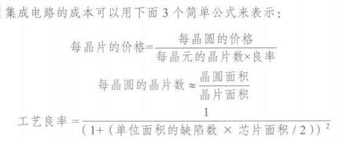

## 计算机的性能


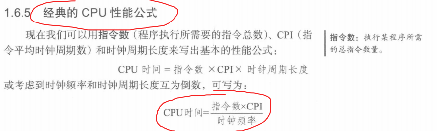


## "栈"的词义演化

* 最基本的含义: 运算受限的线性表, LIFO, 后进先出。

* 函数运行的"栈区": 调用一个函数时, 计算机需要保存:
  -   返回地址（函数结束要跳回哪里）  
  -   局部变量  
  -   参数

    调用函数时, 要存这些数据, 如果这个函数调用期间又调用其他的函数, 还要存进去新函数的这些数据. 当一个函数返回时, 就可以清除它的数据. 这是一个LIFO结构, 所以我们把存储这些数据的区域称为**栈区**.
  -   调用函数 = `push`  
  -   函数返回 = `pop`

* 软件栈: 
这里的栈不再指代LIFO这种结构, 仅仅是一个层层堆叠的比喻. 
    -   在软件系统里，经常会有多层结构叠加：
    -   **应用程序**（App, 比如浏览器） 
    -   **标准库**（比如 C 标准库）  
    -   **操作系统接口**（系统调用）   
    -   **ISA / 硬件接口**（CPU指令集）

    这些层次就像一摞摞积木往上堆，**高层依赖低层**，因此大家习惯称它为**软件栈**.


## IEEE的浮点数格式

| 类型          | 总位数  | 符号位 | 指数位 | 尾数位 | 偏置值（bias） |
| ----------- | ---- | --- | --- | --- | --------- |
| 单精度（float）  | 32 位 | 1   | 8   | 23  | 127       |
| 双精度（double） | 64 位 | 1   | 11  | 52  | 1023      |


假设有一个 32 位浮点数：

```

0 10000001 01000000000000000000000
```
1️⃣ **符号位 sign = 0** → 正数  
2️⃣ **指数 exponent = 10000001₂ = 129₁₀**  
　指数值 = 129 - 127 = 2  
3️⃣ **尾数 mantissa = 1.01₂ = 1.25₁₀**

于是：
$$
value\ = (+1) \times 1.25 \times 2^2 = 5.0
$$
✅ 所以这串二进制表示的数就是 **5.0**.


***
***

特殊情况喵:
| exponent | mantissa | 表示的值                      |
| -------- | -------- | ------------------------- |
| 全 0      | 全 0      | 0                         |
| 全 0      | 非 0      | 非正规数（denormalized number） |
| 全 1      | 全 0      | ±∞（无穷大）                   |
| 全 1      | 非 0      | NaN（不是一个数）                |


# 11. embedded intelligent system and computer architecture

essential of computer system

Pengju Ren

http://gr.xjtu.edu.cn/web/pengjuren


AI三驾马车: 大数据, 算力, 算法


