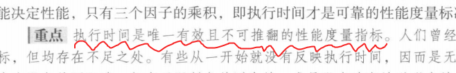

# 1. 计算机组成.


## 1.1 概述

组成计算机的5个经典部件:

* **输入**(键盘, 鼠标, LCD(带电容来触摸), 摄像头...)和**输出**(LCD(带电容来触摸), 音响...). 统称为**I/O设备**
* 存储器
* 数据通路(**运算器**)和**控制器** (合称为**处理器/中央处理单元/CPU**)
  * 数据通路(datapath)


## 1.2 内存

* **DRAM**(动态随机访问存储器. 易失性) 作为计算机的内存. 存储程序运行时的信息. 如DDR4/5内存条. 

* **SRAM**(静态随机访问存储器, 易失性)比DRAM更快, 集成度更低. 用在CPU/GPU的寄存器堆; 一些SoC也有片上SRAM作为快速工作内存. 最多几MB.

* **高速缓存**(cache memory)一般作为普通内存的缓冲.
* 主存: 可以理解为DRAM, 计算机的内存.
* 闪存/固态硬盘/SSD: 非易失性半导体存储. 更慢更便宜.  写入一定次数后损坏.
* 磁盘/硬盘/机械硬盘: 旋转盘片的磁介质材料非易失性存储. 


## 1.3 指令系统体系结构/体系结构/instruction set architecture/architecture/ISA/指令集架构

它是一本协议手册. 是硬件和软件之间的接口, 或者说契约. 它包含了程序员写二进制机器语言所需要的全部信息. 


操作系统封装了一些低级的功能, 提供给程序员基本指令系统和操作系统接口, 合称为**应用二进制接口(application binary interface, ABI)**.

ABI也是一本手册. 它规定:
-   **调用约定**：函数参数怎么传（寄存器？栈？），返回值放哪。 
-   **系统调用接口**：比如 Linux 的 `read()`、`write()` 系统调用号。  
-   **二进制格式**：可执行文件用 ELF 还是 PE。
-   **数据布局**：结构体、对齐方式、字节序。


## 1.4 计算机系统的状态机模型


简单回忆一下状态机


**程序是个状态机.**


事实上, C程序并不是从main()第一条指令开始, return指令结束的.
main函数其实也是有其他函数调用的.

main函数的第一次调用来自OS/运行时环境, 这个就是宿主环境.

之后的函数调用都是程序内部调用.


**CPU是个状态机**.

这是显然的, 数字电路是状态机.


**指令集是个状态机**.


👇下面的指令集状态机是简化版本的指令集. 真正的指令集不但有指令, 还有很多内存管理, I/O, 中断, 异常等等部分, 是状态更复杂, 转移规则更复杂(考虑I/O也作为规则等等)的状态机.

>R即寄存器; 包括PC和(RISC-V)32个通用整数寄存器;
>M即内存.


**程序, 指令, CPU状态机如何联系在一起?**
编译器实现这件事.

* **程序运行状态机**和**指令状态机**的转换: **编译器**
  * $s_{compile}$: 这个映射将描述程序运行的一组状态(即程序计数器和所有程序内变量的值)一一映射为指令集的一组状态(即寄存器+内存单元的值)
  * $e_{compile}$:这个映射将程序状态机的激励时间(函数语句)一一映射为汇编指令.
* **指令状态机**和**CPU状态机**的转换: 这个就是简单的数字电路一一对应咯


程序在CPU上运行的完整步骤:

| 步骤 | 内容 |
|------|------|
| 1 | 根据指令集手册的功能描述，画一张 CPU 的电路图 → **结构设计** |
| 2 | 用 RTL 代码描述 CPU 电路图 → **RTL 设计** |
| 3 | 根据 RTL 代码生成版图文件 → **后端物理设计** |
| 4 | 根据版图文件生产芯片 → **制造生产** |
| 5 | 编写程序 → **软件编程** |
| 6 | 将程序翻译成指令集手册中描述的指令序列 → **编译** |
| 7 | 程序在 CPU 上执行 = 指令序列控制 CPU 芯片电路进行状态转移 |
| 8 | 三个状态机产生联系：Sc ~ Sisa ~ Scpu |


## 1.5 程序的执行和模拟器

### 1.5.0 引言


### 1.5.1 交叉编译器 riscv64-unknown-elf-gcc交叉编译器

#### 1.5.1.0 前言: 本地编译和交叉编译的区别

它是相对于**本地编译**来说的.

##### 1.本地编译:

你在一台 **x86 的电脑**上写了 `a.c`，然后用普通的 `gcc` 编译：
```bash
gcc a.c -o a.out
```
编译器生成的 `a.out` 就是 **能在这台 x86 电脑上直接运行**的程序。  

👉 源代码和目标程序运行的环境（架构、系统）是一样的。

##### 2.  交叉编译(cross compilation)* 
你还是在 **x86 的电脑**上写 `a.c`，但是这次你想要它在 **RISC-V CPU** 上运行。  
那你得用一个“交叉编译器”：
    

```bash
riscv64-unknown-elf-gcc a.c -o a.elf
```
这个编译器不是生成 x86 机器码，而是生成 **RISC-V 的机器码**。  
👉 源代码和目标程序运行的环境 **不一样**。

换句话说：
-   编译发生在 x86 电脑上    
-   运行发生在 RISC-V 芯片（或者 QEMU 模拟的 RISC-V CPU）上
    
这就叫 **交叉编译**。

* 🚩 为什么要交叉编译？

  因为很多时候目标环境太弱（比如嵌入式开发板、微控制器）：
  -   它可能根本跑不动编译器   
  -   或者内存/存储不足  
      所以只能在 PC 上编译好程序，然后“交叉编译”成目标机器能跑的二进制，再烧进去或放进去运行。

#### 1.5.1.1 使用 riscv64-unknown-elf-gcc

***
我们选择交叉编译器`riscv64-unknown-elf-gcc`.
  -   **`riscv64`** → 目标架构是 RISC-V 64-bit（但它也能编译出 32-bit 的代码，加参数就行）    
  -   **`unknown`** → 没有指定具体厂商/平台（通用）    
  -   **`elf`** → 目标文件格式是 ELF（Executable and Linkable Format，Linux/嵌入式常用的可执行文件格式）   
  -   **`gcc`** → 编译器前端，C/C++ 源码编译器


安装它.
```bash
sudo apt install gcc-riscv64-unknown-elf
```

---
---

使用它.

```bash
riscv64-unknown-elf-gcc a.c -o a.elf
```
* 使用默认选项, RV64来编译.


**RV32裸机开发时的编译选项:**
```bash
riscv64-unknown-elf-gcc -march=rv32i -mabi=ilp32 -ffreestanding -nostdlib -Wl,-Ttext=0x80000000 -O2 a.c -o a.out
```


-   `-march=rv32i` → 目标架构是 RV32I 基础指令集    
-   `-mabi=ilp32` → ABI（应用二进制接口），使用 32-bit 寄存器宽度    
-   `-ffreestanding` → 告诉编译器这是裸机环境，不依赖标准库    
-   `-nostdlib` → 不链接 C 标准库（因为裸机没 libc）    
-   `-Wl,-Ttext=0x80000000` → 链接选项，把程序`_start()`入口点地址设为虚拟地址`0x80000000`。   
-   `-O2` → 优化等级    
-   `-o a.out` → 输出文件名


#### 1.5.1.2 riscv64-linux-gnu工具链


### 1.5.2 架构模拟器 QEMU(Quick EMUlator)

QEMU是一个开源的 **硬件模拟器**。

它能在你的 PC 上虚拟出各种 CPU 架构和硬件（x86、ARM、RISC-V、MIPS…），这样你就能：

-   在没有 RISC-V 硬件的情况下，模拟一台 RISC-V 板子；    
-   把你编译好的 **裸机程序** 或 **操作系统内核** 在 QEMU 里跑起来。
-   你需要写好程序源码(.c文件), 然后使用


在ubuntu上安装它.
```bash
sudo apt update
sudo apt install qemu-system-misc
```

安装完以后，你就有了很多命令，比如：
-   `qemu-system-riscv32` → 模拟 32 位 RISC-V 系统  
-   `qemu-system-riscv64` → 模拟 64 位 RISC-V 系统


注意qemu是一个大框架, 包含很多可执行程序:
qemu-system-<架构>

比如：
-   `qemu-system-x86_64` → 模拟 64 位 x86    
-   `qemu-system-arm` → 模拟 ARM    
-   `qemu-system-riscv32` → 模拟 RISC-V 32 位    
-   `qemu-system-riscv64` → 模拟 RISC-V 64 位

查看其中每个模拟器的版本:

```bash
azazel@DESKTOP-NJKSK6O:~/test$ qemu-system-riscv32 --version
QEMU emulator version 6.2.0 (Debian 1:6.2+dfsg-2ubuntu6.26)
Copyright (c) 2003-2021 Fabrice Bellard and the QEMU Project developers
```


### 1.5.3 程序运行在什麽环境?? 一个例子: 一个裸机(freestanding)环境C程序

程序运行在裸机环境(freestanding)或操作系统环境.

***

**选择qemu-system-riscv32作为freestanding环境,
riscv64-unknown-elf-gcc作为交叉编译器.**

***

0x10000000是qemu-system-riscv32中virt机器模型的串口地址.


***
**实验步骤:**
***
1. 写一个在逻辑环境中运行的_start()函数`a.c`
```c
#include <stdio.h>
void _start(){
    volatile uint8_t *p = (uint8_t *)(uintptr_t)0x10000000;
    *p = 'A';
    while(1);
}
```

2. 使用编译指令:
```bash
riscv64-unknown-elf-gcc -march=rv32i -mabi=ilp32 \
    -ffreestanding -nostdlib -Wl,-Ttext=0x80000000 -O2 \
    a.c -o a.out
```


-   `-march=rv32i` → 目标架构是 RV32I 基础指令集    
-   `-mabi=ilp32` → ABI（应用二进制接口），使用 32-bit 寄存器宽度    
-   `-ffreestanding` → 告诉编译器这是裸机环境，不依赖标准库    
-   `-nostdlib` → 不链接 C 标准库（因为裸机没 libc）    
-   `-Wl,-Ttext=0x80000000` → 链接选项，把程序`_start()`入口点地址设为虚拟地址`0x80000000`。   
-   `-O2` → 优化等级    
-   `-o a.out` → 输出文件名


3. 使用qemu模拟一个riscv32架构来运行它:


```bash
qemu-system-riscv32 -nographic -M virt -bios none -kernel a.out
```

-   **`qemu-system-riscv32`** → 启动 32 位 RISC-V 的 QEMU 模拟器    
-   **`-nographic`** → 不开图形界面，用终端输出（方便调试）    
-   **`-M virt`** → 模拟一台 “virt” 虚拟开发板（常见的通用机型）    
-   **`-bios none`** → 不加载 BIOS（因为你是 `-ffreestanding -nostdlib`，直接跑裸机程序）    
-   **`-kernel a.out`** → 把你刚刚编译好的 ELF 程序加载到虚拟机内存并执行

结果:顺利打印出A然后进入死循环.


***

4. 然后我们来看看这个程序的汇编指令: (使用`riscv64-unknown-elf`交叉编译器工具链(安装见1.5.-1)内提供的objdump命令)

```bash
riscv64-unknown-elf-objdump -d a.out
```

输出:


```bash

a.out:     file format elf32-littleriscv


Disassembly of section .text:

80000000 <_start>:
80000000:       100007b7                lui     a5,0x10000
80000004:       04100713                li      a4,65
80000008:       00e78023                sb      a4,0(a5) # 10000000 <_start-0x70000000>
8000000c:       0000006f                j       8000000c <_start+0xc>
```

*** 

每一行是一条汇编指令.  以`80000000:       100007b7                lui     a5,0x10000
`为例, 
-   **`80000000:`**    
    -   这是这条指令所在的内存地址（PC = Program Counter）。        
    -   意味着 `_start` 函数的第一条指令位于 `0x80000000`。
        
-   **`100007b7`**    
    -   这是这条指令的 **机器码（十六进制编码）**。        
    -   RISC-V 每条指令固定 32 位（4 字节），所以 `0x100007b7` 就是这条 `lui` 的编码形式。        
    -   CPU 实际执行的就是这个机器码。
        
-   **`lui`**    
    -   这是指令助记符（Mnemonic），是人类可读的汇编指令。        
    -   `lui` = Load Upper Immediate（把立即数放到寄存器的高 20 位）。
        
-   **`a5,0x10000`**    
    -   指令的操作数。        
    -   表示：把立即数 `0x10000` 加载到寄存器 `a5` 的高 20 位。        
    -   执行后 `a5 = 0x10000 << 12 = 0x10000000`。


***
***

**三条指令的意思:**

* 1\. `80000000: 100007b7 lui a5,0x10000`
  -   `lui` = Load Upper Immediate    
  -   把 `0x10000` 放到寄存器 `a5` 的高 20 位    
  -   结果：`a5 = 0x10000 << 12 = 0x10000000`  
      （正好是你代码里写的 `0x100000` 地址，只是 C 编译器用 `lui` 搞成 32 位完整地址）
    

* * *

* 2\. `80000004: 04100713 li a4,65`
  -   `li` = Load Immediate（伪指令）    
  -   实际上等价于：`addi a4, x0, 65`   
  -   所以 `a4 = 65 = 0x41 = 'A'`
    

* * *

* 3\. `80000008: 00e78023 sb a4,0(a5)`
  -   `sb` = store byte    
  -   把 `a4` 中的 65 (`'A'`) 存到 `[a5 + 0]` 地址里   
  -   因为 `a5 = 0x10000000`   
  -   实际操作： `*0x10000000 = 'A'`
    

也就是往内存/外设写入一个 ASCII 字母 A。  
这一步就是你代码里 `*p = 'A';`

* * *

* 4\. `8000000c: 0000006f j 8000000c`
  -   `j` = jump，无条件跳转    
  -   直接跳回自己，形成死循环    
  -   对应 C 代码里的 `while(1);`
    

* * *

* 总结
1.  程序从 `0x80000000` 开始运行   
2.  准备了地址 `0x10000000`  
3.  往那个地址写入 `'A'`    
4.  程序停在死循环


### 1.5.4 程序怎麽结束? 一个例子:

阅读C99手册:
***
5.1.2.1 Freestanding environment
2 The effect of program termination in a freestanding environment is implementation-defined(由实现定义的).
***
在裸机环境下, 程序终止并没有一个标准的函数来结束, 需要根据具体硬件提供的方式来退出.


我们同样使用`riscv-unknown-elf-gcc`作为交叉编译器, `QEMU`作为架构模拟器, 进行裸机C开发.

**QEMU virt 机器的退出机制**
- 在 QEMU 的 `virt` 机器模型上，提供了一个**模拟的硬件设备(映射到32bit宽寄存器)**来接收退出信号。
- 这个设备被映射到内存中的一个特殊地址`0x100000`。向这个地址写入一个特定的“魔法数字 (magic number)(`0x5555`)”，QEMU 监视器就会捕获到这个操作，并认为用户请求退出，从而优雅地关闭整个模拟器.
-  它检测其32位寄存器的低16位是否为0x5555(即`if ((written_value & 0xFFFF) == 0x5555)`)


1. 我们写一个`b.c`
```c
#include <stdin.h>

void_start(){
  //向QEMU的串口地址的第一个8字节写一个"A". 注意到该模拟串口是8bit位宽的设备(只支持8bit的ASCII码).
  volatile uint8_t *p = (uint8_t *)(uintptr_t)0x10000000;
  *p = 'A';

  //向虚拟退出设备对应内存写一个0x5555. 该虚拟机是32位的, 
  volatile uint32_t *exit = (uint32_t *)(uintptr_t)0x100000;
  *exit = 0x5555; //对该地址写入魔法数字0x5555

  _start();//正常情况下, 不会执行到这一句. 因为上一条指令已经导致 QEMU 退出了。如果因为某种原因退出失败，这会导致程序无限递归，重新尝试退出。
}

```

2. 然后交叉编译它得到可以在rv32架构上跑的可执行文件:
```bash
riscv64-unknown-elf-gcc -ffreestanding -nostdlib -Wl,-Ttext=0x80000000 -O2 b.c -o b.out
```
* 注意如果没有加freestanding选项, 编辑器就不会自带一个最小的内置头文件集合, 会报错找不到stdint.h.

3. 然后再QEMU上运行它:
```bash
qemu-system-riscv32 -nographic -M virt -bios none -kernel b.out
```


4. 看看反汇编:
```bash
azazel@DESKTOP-NJKSK6O:~/test$ riscv64-unknown-elf-objdump -d b.out

b.out:     file format elf64-littleriscv


Disassembly of section .text:

0000000080000000 <_start>:
    80000000:   100007b7                lui     a5,0x10000
    80000004:   04100713                li      a4,65
    80000008:   00e78023                sb      a4,0(a5) # 10000000 <_start-0x70000000>
    8000000c:   6795                    lui     a5,0x5
    8000000e:   00100737                lui     a4,0x100
    80000012:   55578793                addi    a5,a5,1365 # 5555 <_start-0x7fffaaab>
    80000016:   c31c                    sw      a5,0(a4)
    80000018:   8082                    ret
```

* `0000000080000000 <_start>:` 表示`_start`符号在可执行文件的虚拟地址(VA) `0000000080000000`. 这是因为我们编译时用的命令为`riscv64-unknown-elf-gcc -ffreestanding -nostdlib -Wl,-Ttext=0x80000000 -O2 b.c -o b.out`, 其中`-Wl,-Ttext=0x80000000`即告诉链接器把 .text 段（代码段）放到虚拟地址 0x80000000 开始。
* **第1条指令**: `80000000:   100007b7                lui     a5,0x10000`
  * `80000000:` 表示该指令的内存地址. noted: rescv32模拟下, 内存地址是按byte寻址的, 所以一条指令为32/8=4byte, 下一条指令应该在`80000004`.
  * `100007b7` 该指令的32位机器码内容对它反汇编, 就得到了注记符人类可读形式的指令: `lui a5, 0x10000`. 它是**U-type**指令.
    * 高20位正好是`0x10000`, 对应lui指令的imm[31:12] . 
    * 再低5位是`01111`即`0x15`, 对应寄存器x15(a5).
    * 最低7位是`011 0111`, 对应指令`lui`.
  * 这条指令将寄存器`x15`存入数据`0x10000000`. 这是QEMU的模拟串口基地址.
* **第2条指令**: `li      a4,65`
  * 将`x14`寄存器存入`65`, 即'A'
* **第3条指令**: `sb      a4,0(a5) # 10000000 <_start-0x70000000>`
  * 注释表示: `a5`寄存器内的值, 以及其相对于`_start`地址的偏移量为`-0x70000000`. 
  * 该指令往`a5`寄存器的值地址`10000000`写入了寄存器`a4`的低8位数据, 即写入了'A'(或者说`0x65`)
* **第4条指令**: `lui     a5,0x5`
  * 向`a5`寄存器写入`0x5<<12`, 即写入`0x5000`. 这是退出魔法数字`0x5555`的高位. 一会儿指令6会用addi补全低位.  
  * 覆盖了`a5`刚刚存储的写入数据地址`10000000`, 因为已经用完了.
* **第5条指令**: `lui a4,0x100`
  * 向`a4`写入`0x100 000`. 这是一会让要写入魔法数字的地址.
* **第6条指令**: `addi a5,a5,1365 # 5555`
  * 把`a5`增加`1365(dec)=0x555`, 最终结果是`a5=0x5555`. 注释提示最终结果. 这就构造好了魔法数字.
* **第7条指令**: ` sw a5,0(a4)`
  * 写入魔法数字. 把`a5`的32bit直接写入`a4`地址. 
* **第8条指令**: `ret`
  * 伪指令. 展开为`jalr x0, ra, 0`. 因为裸机开发时程序入口点是`_start`, 它不是别的函数调用的. 此时ra未定义, 这条指令会跳到奇怪的地方. 不过正常情况下第七条指令就结束了, 本指令不会运行.


## 1.6 RISCV架构

它有32个32bit宽的通用寄存器x0~x32, 其中x0永远为0x0, 

    **读取 x0** → 永远得到 `0`  

    **写入 x0** → 指令执行了，但结果会被丢弃，不会改变 x0 的值。

**它们有约定的用途.**

| 名称        | ABI Mnemonic/注记符/别名    | 用途  | preserved across calls?       |
| --------- | -------- | ------------------------------ |-- |
| `x0`      | `zero`   | 永远为 0      |   --(immutable)      |
| `x1`      | `ra`     | return address，函数返回地址|no          |
| `x2`      | `sp`     | stack pointer，栈指针   | yes          |
| `x3`      | `gp`     | global pointer，全局指针    |--(unallocatable)        |
| `x4`      | `tp`     | thread pointer，线程指针  |--(unallocatable)          |
| `x5–x7`   | `t0–t2`  | 临时寄存器（调用者保存） |no                  |
| `x8`      | `s0/fp`  | saved register / frame pointer |yes|
| `x9`      | `s1`     | saved register   |yes      |
| `x10–x17` | `a0–a7`  | 参数/返回值寄存器       |no               |
| `x18–x27` | `s2–s11` | 被调用者保存寄存器   | yes                   |
| `x28–x31` | `t3–t6`  | 临时寄存器           | no               |

preserved across calls? 这一项描述一个函数(caller)调用另一个函数(callee)时, 对该寄存器的操作/

* yes: callee-saved, 被调用者保存. 
  * 如果callee想用这个寄存器, 必须先把它的原先值保存(写到栈内存里维护起来)再覆写. 该callee函数运行结束后, **必须将其恢复原状**, 以供回到caller函数继续运行时使用.
* no: caller-saved, 调用者保存.
  * 调用一个子函数后, callee可能直接覆写这个寄存器, 把里面的内容抹除. caller必须保证不往里面存储调用callee结束后自己可能还要使用的数据, 或者自己做好内容保存后再调用callee.
* x3, x4不可以随便分配覆写, 故不讨论. x0≡0没有讨论意义. 


## 1.7 尝试自己写一个支持RV32的freestanding环境!

QEMU 虽然是个开源项目，但还挺复杂，不利于我们理解细节  
- 25000+ 个源文件，110000+ 行源代码  


### 1.7.1 先设计框架:
让我们来设计一个面向 RISC-V 程序的简单 freestanding 运行时环境！  
- 程序从地址 0 开始执行  
- 只支持两条指令  
  - addi 指令  
  - ebreak 指令  
    - 寄存器 a0 = 0 时，输出寄存器 a1 低 8 位的字符  
    - 寄存器 a0 = 1 时，结束运行  
    - ABI Mnemonic

我们尝试写一个运行在这个环境上的程序.

prog.c
```c

//ebreak()接受两个立即数arg0, arg1, 并把它们分别放进寄存器a0, a1, 然后执行ebreak指令.(注意不是递归执行自己这个函数而是RV的ebreak指令)
static void ebreak(long arg0, long arg1){
  //asm()内联汇编函数. 每一行""内是一条汇编指令. volatile关键字不允许编译器优化掉这断汇编.
  //%0, %1是占位符, 代表后面输入的参数arg0, arg1.
  //汇编代码之后, 第一个`:`后面是输出操作数, 第二个`:`后面是输入操作数.
  //"i"表示立即数约束: 要求该参数是一个编译时常量.
  //"r"表示寄存器约束: 该参数可以放在任意寄存器中.
  asm volatile(
    "addi a0, x0, %0;"
    "addi a1, x0, %1;"
    "ebreak"
    : 
    : "i"(arg0), "i"(arg1)
  );
}


//即令a0=0, a1=ch, 然后执行ebreak指令. 约定当a0=0时表示打印字符.  
static void putch(char ch){ebreak(0, ch);}

//即令a0=1, a1=code, 然后执行ebreak指令. 约定当a0=1时表示程序结束, a1是返回码. 之后进入死循环.
static void halt(char code){ebreak(1, code); while(1);}

void _start(){
  putch('A');
  halt(0);
}

```

这程序显然不能在qemu模拟器上直接运行, 也不能在windows/linux上直接运行.


### 1.7.2 搭配我们的蜜汁Makefile!
```Makefile
# 给riscv'-unknown-elf-gcc写的Makefile. 
# 裸机开发QEMU模拟RISC-V环境下的freestanding程序.

# 用法: make SRC=your_source.c OUT=your_output.out
# Makefile - RISC-V freestanding: 支持编译当前目录下的多个 .c 文件


# 用法举例：
#   make                # 编译所有 *.c -> *.out
#   make SRC=foo.c      # 只编译 foo.c -> foo.out
#   make foo.out        # 直接以目标名编译
#   make clean          # 删除所有 *.out
#   make clean SRC=foo.c    # 删除 foo.out
#   make clean FILE=foo.out # 删除 foo.out
#   make -B SRC=foo.c   # 强制重建
#   make -n SRC=foo.c   # 只显示将执行的命令（dry-run）


CC = riscv64-unknown-elf-gcc

MODE =   # qemu 或 yemu

# 编译选项
CFLAGS = -march=rv32i -mabi=ilp32 -ffreestanding -nostdlib -O2
CFLAGS_qemu = -march=rv32i -mabi=ilp32 -ffreestanding -nostdlib -O2

# 链接选项
# 裸机开发必须指定程序的起始地址, 0x80000000是QEMU默认的加载地址.
LDFLAGS = -Wl,-Ttext=0x80000000
LDFLAGS_qemu = -Wl,-Ttext=0x80000000
LDFLAGS_yemu = -Wl,-Ttext=0x80000000


# 如果在命令行传入 SRC=xxx.c 则只编译那个文件，否则编译当前目录下所有 .c
SRC ?=
# wildcard *.c 得到当前目录所有.c文件名字, 用空格连接.
C_SOURCES := $(wildcard *.c)

# 如果SRC是空的(输入命令没指定SRC), 则SRCS表示所有.c文件.
# strip()去掉变量值的前后空格.
# :=表示立即替换. =表示用到这个变量的时候才替换.
ifeq ($(strip $(SRC)),)
  SRCS := $(C_SOURCES)
# 如果指定了SRC, SRCS=SRC, 只编译这个文件.
else
  SRCS := $(SRC)
endif

# OUTS表示所有要生成的.out文件. 
# patsubst()是替换函数. 把SRCS字符串中的`.c`替换成`.out`
OUTS := $(patsubst %.c,%.out,$(SRCS))


# 默认目标为all, 依赖为OUTS中的所有.out文件. 
# 比如`make`时, OUTS对应当前目录下所有.c文件的.out文件, 执行all, 生成所有.out.
# 比如`make SRC=foo.c`时, OUTS对应foo.out, 执行all, 生成foo.out.
.PHONY: all 
all: $(OUTS)


# 通用模式规则. %是占位符, 会被替换为make后面的参数. 只用在target:prerequisite这两段中. 这两段用了%的话. 这条规则(即完整的三段式)也叫做`模式规则`. 否则叫做普通规则, 比如`all`和`clean`就是普通规则.
# 比如`make foo.out`时, %.out就是foo.out, %.c就是foo.c(如果foo.c在当前目录存在), $<就是foo.c, $@就是foo.out.  默认编译为qemu可运行的.out文件. 请自行查看编译和连接选项.
# 使用方式: make MODE=你想要的编译模式 SRC=your_source.c
# 或者 make MODE=你想要的编译模式 your_source.c.
# 请注意ifeq后面必须加一个空格. ifeq (...,...)
%.out: %.c
ifeq ($(MODE),)
	@echo  "havent specified compile MODE, default to MODE=qemu."
	$(CC) $(CFLAGS) $(LDFLAGS) $< -o $@
else ifeq ($(MODE),qemu)
	$(CC) $(CFLAGS_qemu) $(LDFLAGS_qemu) $< -o $@
else ifeq ($(MODE),yemu)
	$(CC) $(CFLAGS_yemu) $(LDFLAGS_yemu) $< -o $@
else 
	$(error "Unknown MODE: $(MODE). Use 'qemu' or 'yemu'.")
endif


# 这是一个普通规则. 用来编译可供QEMU模拟器运行的.out文件. 使用方法是`make gcc_rv32_qemu SRC=your_source.c`
# 已弃用, 请使用`make MODE=qemu SRC=your_source.c`
.PHONY: gcc_rv32_qemu
gcc_rv32_qemu_file.out: $(SRCS)
	$(CC) $(CFLAGS_qemu) $(LDFLAGS_qemu) $< -o $@


# 这是一个普通规则. 用来编译可供我的yemu运行的.out文件. 使用方法是`make gcc_rv32_yemu SRC=your_source.c`
# 已弃用, 请使用`make MODE=yemu SRC=your_source.c`
.PHONY: gcc_rv32_yemu
gcc_rv32_yemu_file.out: $(SRCS)
	$(CC) $(CFLAGS_yemu) $(LDFLAGS_yemu) $< -o $@


# clean 规则：
# - 若指定 FILE=xxx 则删除 FILE
# - 否则若指定 SRC=foo.c 则删除 foo.out
# - 否则删除所有 *.out
# 注意: Makefile可以不声明变量直接用. 比如这里的FILE, 如果用户没指定, $(FILE)就是空字符串.
.PHONY: clean
clean:
#如果 FILE 变量非空, 则删除 FILE 指定的文件.
ifneq ($(strip $(FILE)),)
	rm -f $(FILE)
else
# 如果SRC变量非空, 则删除对应的.out文件. 对应命令`make clean SRC=foo.c`
ifneq ($(strip $(SRC)),)
	rm -f $(patsubst %.c,%.out,$(SRCS))
# 如果只运行`make clean`没有指定SRC或FILE, 则删除所有.out
else
	rm -f *.out
endif
endif


# 反汇编规则.
# 使用方法: make dump BIN=yourfile.out 或者 make dump BIN=yourfile.out ALIASES=no(不使用别名, 展示原生指令)
BIN ?=
# 默认不使用-M no-aliases选项.
ALIASES ?= yes
.PHONY: dump
dump:
# 如果没有指定 BIN 变量, 则提示用户如何使用.
ifeq ($(strip $(BIN)),)
	@echo "请使用: make dump BIN=yourfile.out"
else
ifeq ($(ALIASES),no)
	riscv64-unknown-elf-objdump -M no-aliases -d $(BIN)
else
	riscv64-unknown-elf-objdump -d $(BIN)
endif
endif


#QEMU规则. 用法: make qemu BIN=yourfile.out
.PHONY: qemu
qemu:  qemu-system-riscv32 -nographic -M virt -bios none -kernel $(BIN)


.PHONY: help
help:
	@echo "Makefile usage:"
	@echo "  make                 # build all .c -> .out"
	@echo "  make SRC=foo.c       # build only foo.c -> foo.out"
	@echo "  make foo.out         # build by target"
	@echo "  make clean           # remove all .out"
	@echo "  make clean SRC=foo.c # remove foo.out"
	@echo "  make clean FILE=foo.out # remove foo.out"
	@echo "  make -B SRC=foo.c    # force rebuild"
	@echo "  make -n SRC=foo.c    # dry-run (show commands)"


```

### 1.7.3 两条指令的程序实现


指令循环函数实现: 
```c
void inst_cycle() {
    uint32_t inst = *(uint32_t *)&M[PC];  //取出一条32bit指令
    if (
      ((inst & 0x7f) == 0x13) && ((inst >> 12) & 0x7) == 0  // 判断是addi
      ) { 
      //第二操作数是否为x0, 是的话忽略写入x0.
        if (((inst >> 7) & 0x1f) != 0) {
            R[(inst >> 7) & 0x1f] = R[(inst >> 15) & 0x1f] + 
                (((inst >> 20) & 0x7ff) - ((inst & 0x80000000) ? 4096 : 0));
        }
    } else if (inst == 0x00100073) { // 判断是ebreak
        if (R[10] == 0) {
            putchar(R[11] & 0xff);
        } else if (R[10] == 1) {
            halt = true;
        } else {
            printf("Unsupported ebreak command\n");
        }
    } else {
        printf("Unsupported instruction\n");
    }
    pc += 4;
}
```

初始状态:


### 1.7.4 YEMU V1.0!!


内存M中存储的指令:


```c
#include <stdio.h>
#include <stdint.h>
#include <stdbool.h>

//PC寄存器.
uint32_t R[32], PC;

//我们分配出64byte的内存. 是的, 这非常小.
//它存放的数据就是那个最简单的_start()函数的汇编指令, 一共7条. 它输出一个A然后结束.
uint8_t M[64] = {
    0x13, 0x05, 0x00, 0x00, 0x93, 0x05, 0x10, 0x04, 0x73, 0x00, 0x10, 0x00,
    0x13, 0x05, 0x10, 0x00, 0x93, 0x05, 0x00, 0x00, 0x73, 0x00, 0x10, 0x00,
    0x67, 0x00, 0x00, 0x00
};

bool halt = false;

void inst_cycle() {
    uint32_t inst = *(uint32_t *)&M[PC];
    if ((inst & 0x7f) == 0x13 && ((inst >> 12) & 0x7) == 0) { // addi
        if (((inst >> 7) & 0x1f) != 0) {
            R[(inst >> 7) & 0x1f] = R[(inst >> 15) & 0x1f] + 
                (((inst >> 20) & 0x7ff) - ((inst & 0x80000000) ? 4096 : 0));
        }
    } else if (inst == 0x00100073) { // ebreak
        if (R[10] == 0) { 
            putchar(R[11] & 0xff); 
        } else if (R[10] == 1) { 
            halt = true; 
        } else { 
            printf("Unsupported ebreak command\n"); 
        }
    } else { 
        printf("Unsupported instruction\n"); 
    }
    PC += 4;
}

int main() {
    PC = 0; 
    R[0] = 0; // can be omitted since uninitialized global variables are initialized with 0 in C.
    while (!halt) { 
        inst_cycle(); //指令循环
    }
    return 0;
}


```

## 1.9 ARM架构

### 1.9.0 概述

ARM A32有16个通用寄存器(R0~R15). 不同于riscv32, 现在寄存器只需要4bit来寻址了.


### 1.9.1 数据处理指令


-   \[31:28\] 条件码 (cond)    
-   \[27:26\] `00` → 表示数据处理类    
-   \[25\] I → `second operand`是否使用立即数.` I=1`->是立即数. `I=0`->是寄存器.    
-   \[24:21\] opcode → 运算类型（ADD/SUB/AND/ORR/MOV/CMP 等）    
-   \[20\] S → 是否更新标志位   
-   \[19:16\] Rn → 第一个操作数寄存器   
-   \[15:12\] Rd → 结果寄存器   
-   \[11:0\] Operand2 → 第二个操作数（寄存器或立即数）


### 1.9.2 单数据传输格式(load/store)

-   \[31:28\] cond   
-   \[27:26\] `01` → 表示 load/store   
-   \[25\] I → 偏移是立即数还是寄存器   
-   \[24\] P → 前/后变址    
-   \[23\] U → 加/减偏移   
-   \[22\] B → 是否字节（1=byte, 0=word）   
-   \[21\] W → 是否写回基址    
-   \[20\] L → 1=LDR, 0=STR    
-   \[19:16\] Rn → 基址寄存器    
-   \[15:12\] Rd → 数据寄存器    
-   \[11:0\] offset → 偏移量


### 1.9.3 块数据传输格式(LDM/STM)


### 1.9.4 分支格式

### 1.9.5 协处理器格式

### 1.9.6 四种指令寻址

| 寻址方式    | 指令给出的内容 | 实际操作数来源      | 例子                |
| ------- | ------- | ------------ | ----------------- |
| 立即数寻址   | 常数      | 直接使用该常数      | `MOV R0, #5`      |
| 寄存器寻址   | 寄存器编号   | 寄存器中的内容      | `ADD R0, R1, R2`  |
| 直接寻址    | 内存地址    | 指定地址的内存内容    | `LDR R0, =0x2000` |
| 寄存器间接寻址 | 地址寄存器   | `[寄存器]`指向的内存 | `LDR R0, [R1]`    |


#### 1.9.2.1 立即数寻址

-   操作数是立即数. 直接写在指令里，不需要去寄存器或内存再取。  
-   ARM 指令里, 立即数用 `#number` 表示。
-   ARM 指令中的立即数只能是8bit数+偶数旋转得到的32bit数. 例如:
    -   0000 0000 0000 0000 0000 0000 1000 0001
    -   0000 0000 0000 0000 0000 1111 1111 0000
    -   0000 0000 0000 0000 0001 1111 1110 0000


#### 1.9.2.2 寄存器寻址


#### 1.9.2.3 寄存器间接寻址
-   指令里给出寄存器，这个寄存器存放的是内存地址，CPU 再去这个地址取操作数。    
-   典型用法就是访问数组、指针。   
-   ARM 里 LDR/STR 支持：  
```assemble
LDR R0, [R1]     ; R0 = mem[R1] 
STR R2, [R3]     ; mem[R3] = R2
```    
-   还可以带偏移： 
```asm
LDR R0, [R1, #4] ; R0 = mem[R1+4] 
LDR R0, [R1], #4 ; 取完再更新 R1 = R1+4（后递增）
```

##### 1.9.2.3.1 **前变址 (Pre-indexed addressing)**

-   在访问内存**之前**，先对基址寄存器 `Rn` 加上偏移量，结果作为访问的内存地址。   
-   写法：`[Rn, #offset]!`   
-   那个 `!` 表示：**同时把计算后的地址写回 Rn（自动更新）**。   
-   例子：
```asm
LDR R0, [R1, #4]!   ; R1 = R1+4，再用新地址取内存到 R0
```

对比没有前变址的写法:

```asm
LDR R0, [R1, #4]    ; 取 mem[R1+4]，但 R1 不变
```
##### 1.9.2.3.2 **后变址 (Post-indexed addressing)**

-   先用寄存器 `Rn` 原本的内容当地址，访问内存；   
-   访问完成后，再对 `Rn` 加上偏移量，更新 Rn。   
-   写法：`[Rn], #offset`   
-   例子：
    
```asm
LDR R0, [R1], #4   ; R0 = mem[R1]，再更新 R1 = R1+4
```
    
-   常用于顺序访问数组。


#### 1.9.2.4 直接寻址(罕见)


###

###

###


# 2. 指令

## 2.0 一些基本概念

冯·诺依曼 1945 年提出：
-   既然 **程序本质上也是一串指令（数字）**，为什么不把它和数据一样放进存储器？
-   CPU 从存储器里读指令，就能决定做什么运算；读数据，就能操作对象。
-   这样一来，换个程序就是换内存内容，不需要改电路。
这就是 **存储程序计算机（Stored-program Computer）**。

**如今所有现代计算机都采用冯诺依曼架构, 是存储程序计算机.**


**字节(byte)**
几乎所有现代计算机架构里（包括 x86 和 RISC-V），1 个字节 = 8 bit。

这是国际标准，基本不会变。

**字(word)**
-   **字(word)** 的含义：和机器架构紧密相关，通常指 **处理器自然操作的数据宽度**。在不同架构里，“word”的大小可能不同：     
    -   在 **RISC-V RV32/64**：一个字 = 32 bit（= 4 字节）           
    -   在早期 **x86（16 位 8086）**：一个字 = 16 bit      
    -   在现在 **x86-64**：虽然是 64 位处理器，但很多文档里仍把 word 定义成 16 bit，为了兼容历史（所以才有 `word`\=16b, `dword`\=32b, `qword`\=64b 的奇怪叫法 😂）。

-   **XLEN** 指的是一个具体 RISC-V 处理器实现中 **原生整数寄存器的位宽 (Native Integer Register Width)**.
    -   risc-v32， XLEN=32
    -   risc-v64， XLEN=64
     


* **操作数(operand)**: 在计算机指令里, 操作数就是指令要处理的数据. 它的物理存在就是寄存器. 
* **立即数**: 指的是指令里写的常数. 
    * 例如下面两条指令中:
      * 第一条指令中, a称为**目标操作数**, b,c称为**源操作数**
      * 第二条指令中, 1,2是**立即数**.
      * 操作数a, b, c是`x0`~`x31`32个**通用整数寄存器**之一. 对RV32架构, 它们是32bit宽的寄存器, 对RV64架构, 它们是64bit宽的寄存器.

```
add a. b. c    //将变量b,c相加, 其和放入a.
sub a. 2. 1    //将常数1-2, 其和放入a.
```

* 每个RISC-V算术指令只执行一个操作, 并且只有三个变量.
* 每行只能包含一条指令.
* 用//注释.
* 当我们说寄存器的时候, 一般默认指的是RISC-V架构下的那**32个通用整数寄存器（x0 - x31）**。而且，**只有它们可以直接作为算术和逻辑运算指令的操作数。**
* 更多的大量数据被存储在内存中. 需要**数据传输指令**把它们放到寄存器去里运算.
* 对于复杂指令集(CISC), 有时允许直接把内存地址A的值和内存地址B的值相加存到内存地址C. 这在RISC-V中不被允许. 所有算数必须先把数据搬到这32个寄存器里.


下面是一些常用数据传输指令:
```
-   `lw x1, (a)` // 载入指令Load word: 将内存地址A处的**字（Word）** 加载到寄存器x1。  
-   `lw x2, (b)` // 载入指令Load: 将内存地址B处的**字（Word）** 加载到寄存器x2。    
-   `add x3, x1, x2` // 运算指令: 在寄存器x1和x2上进行加法运算。  
-   `sw x3, (c)` // 存储指令Store word: 将寄存器x3中的结果**存储**回内存地址C。
```


* RISCV架构下(事实上所有架构特点都如此), 只有32个寄存器 


```
add a. b. c    //将变量b,c相加, 其和放入a.


//若想将四个变量b,c,d,e相加, 放入a中:
add a. b. c     //将b,c相加放入a
add a. a. d     //将a,d相加放入a
add a. a. e     
```


***
例题


## 2.1 解释器是啥?

我们熟悉的C是这样运作的:(省略预处理环节)
C源文件 → (编译器compiler) → 汇编代码 → (汇编器assembler) → 机器码 → (链接器linker) → 可执行文件

但是大多数其他高级语言如python, java, 追求**跨平台**(跨架构(X86, ARM, RISC-V...), 跨操作系统).

它们需要一个**解释器**. (一个软件. 它针对不同**操作系统**和**硬件架构**)而不同.

这些语言的源代码经过它们的**编译器**后, 生成**字节码bytecode**(`.class` 文件). 这个文件不是某个架构的汇编语言. 是一种中间语言, 它被设计为跨平台的东西. 事实上它是一个虚拟的指令集(也写成一条条指令的样子, 虽然它并不能直接被任何架构读取...)

这些字节码文件通过解释器得到可执行程序.

实际操作上, 解释器被集成在**JVM(Java Virtual Machine，Java虚拟机)**中. 可以认为JVM对应C中的`编译为汇编指令,链接`任务.


java程序多种运行方式:
-   **纯解释执行 (Interpreter mode)**   
    -   JVM 直接逐条把字节码解释成机器指令运行。        
    -   优点：启动快，不需要额外编译。        
    -   缺点：运行效率低，因为每条字节码都要被“现场翻译”一次。
        
-   **JIT 编译执行 (Just-In-Time)**
    
    -   JVM 在运行过程中，发现某段代码经常被调用，就会 **动态把那部分字节码编译成本地机器码**。        
    -   这样后续运行时就直接执行机器码，不再解释。        
    -   优点：热点代码性能接近 C 程序。        
    -   缺点：第一次编译会有额外开销，所以启动稍慢。
        
-   **AOT (Ahead-Of-Time) 编译**（新一些的技术，比如 GraalVM 支持）  
    -   在运行前，就直接把 Java 字节码提前编译成本地机器码。        
    -   优点：启动快，性能稳定。        
    -   缺点：失去了一些跨平台和动态优化的灵活性。


## 2.2 常用指令

### 2.2.1 B-type指令 分支跳转

### 2.2.2 UJ-type指令 长跳转


#### jal(jump and link)

`jal ra, offset`   #将PC设置为PC+offset，同时把下一条指令地址(即`PC+4`)写入 ra.

由约定, ra一般选为x1.


#### jalr(jump and link reg)

`JALR ra, offset(rs1)`

跳转到一个存储在寄存器中的地址（加上一个小的偏移量），同时将返回地址保存到 ra 中。


#### J [伪指令]

无条件跳转到一个目标地址(PC=PC+offset)

`j offset` = `jal x0, offset`. 


### 2.2.3 S-type指令 储存

包括
    * sb
    * sh
    * sw
    * sd(RV64才有)

#### sb(store byte)

将寄存器`rs2`内低8bit存储到内存地址`rs1 + offset`内. offset是偏置, 一个立即数. 

格式:
`sb rs2, offset(rs1)`

例如我想往内存地址0x12345678内存2个ASCII字符'A','B':

```asm
//先构造基地址寄存器, 这里选x1
li x1, 0x12345678

//往x2, x3内分别写入这两个字符
li x2, 'A'
li x3, 'B'

//用sb命令存储
sb x2, 0(x1)
sb x3, 1(x1)
```


#### sw(store word) 

和sb指令语法类似.

`sw rd offset(rs)`


### 2.2.4 I-type指令 立即数运算

包括
    * addi
    * adddiw(RV64专有)
#### addi(add immediate)

将rs1加上一个12bit的立即数后存入rd.

格式: 
`addi rd, rs1, imm12`

### 2.2.5 U-type指令 大立即数加载类

包括
    * lui
    * auipc


#### lui(load upper immediate)

将这个 *低12bit补零的32bit立即数* 放到指定寄存器. 

* 配合`addi`补低位, 可以构造任意32bit数.

#### auipc(add upper immediate to PC) 

将这个 *低12bit补零的32bit立即数* **和当前PC(32bit寄存器)值相加**, 再放到指定寄存器.

* 通常它实现得到相对地址, 或和 `addi` 配合，得到一个变量或函数的绝对地址。


#### li(load immediate) [伪指令]

将一个不大于20bit的立即数放到指定寄存器.


如果数值很小<=12bit(比如`li a4, 65`), addi指令就可以处理, 会翻译为:

```
addi a4, x0, 65
```

如果数值在12~32bit(比如`li a4, value`), 会翻译为:
```
lui a4, high20(value)
addi a4, a4, low12(value)
```
这是riscv独有的一种格式, **用来加载大立即数**.
其格式为:

```less
imm[31:12] | rd[11:7] | opcode[6:0]
```

* 可以看到其高12位为`imm[31:12]`, U-type指令将要加载的大立即数即为一个32bit的数:`imm[31:12]+0x000`. 低12位补0.
* 再往下5位是`rd[11:7]`, 表示目标寄存器(对riscv32, 正好是2^5个通用寄存器)
* 最低7位是`opcode[6:0]`, 表示操作码(具体哪一个U-type指令).
  * lui=0110111 
  * auipc=0010111


### 2.2.6 其他

#### ret(return) [伪指令]

它会被展开为`jal`或`jalr`, 把返回地址存进寄存器ra

#### ecall(environment call)

RISCV架构定义的系统控制指令. 触发一个系统调用.


#### ebreak(environment break)

RISCV架构定义的系统控制指令. 触发一个断点异常.


###


###


## 2.3 常用指令块

### 2.3.1 开辟栈:

栈空间会在函数开头开辟:

RV32中, 约定栈指针(stack pointer, **sp**)为`x2`.

```
addi sp, sp, -16   # 即x2自减0x16, 开辟 16 byte栈
sw ra, 12(sp)      # 保存返回地址
```
这样 [sp]、[sp+4]、[sp+8]… [sp+12] 就成了函数能用的局部空间。

假设原来 sp = `0x80001000`，

执行 addi sp, sp, -16 后, sp = `0x80000FF0`

那么地址 `0x80000FF0` ~ `0x80000FFF` 就是新开的栈帧。

进入函数时:
```
addi sp, sp, -16   # 开16字节栈
sw ra, 12(sp)      # 保存返回地址
sw s0, 8(sp)       # 保存寄存器 s0
```

离开函数时:
```
lw ra, 12(sp)      # 恢复返回地址
lw s0, 8(sp)       # 恢复寄存器 s0
addi sp, sp, 16    # 回收栈
ret
```


## 2.4 编译器指令优化

### 2.4.1 尾优化

例如我的程序最后递归调用自己:
```c
void myfun(){
  //...
  myfun();
}
```

最后一句调用自己, 本来应该处理为:
`jal ra, _start   #跳转到 _start，同时把返回地址写到 ra`

如果编译器发现这是当前函数最后一句, 没有别的操作了. 就会把这条指令优化为j指令`j _start`, 直接跳转, 不保存返回地址.

##


# 5. 大规模集成电路设计 VLSI(very large scale intergration circuit)


## 5.0


### CPSR(current program status reg)寄存器(当前程序状态寄存器)

它定义cpu现在在做什麽.

### SPSR(saved)寄存器(保存的程序状态寄存器)

它是一个影子寄存器.[ ]
R13一般用于栈指针;


# 7. 并行计算机体系结构


MPP(大规模并行处理)


# 8. 杂项

## 集成电路的成本


## 计算机的性能




## "栈"的词义演化

* 最基本的含义: 运算受限的线性表, LIFO, 后进先出。

* 函数运行的"栈区": 调用一个函数时, 计算机需要保存:
  -   返回地址（函数结束要跳回哪里）  
  -   局部变量  
  -   参数

    调用函数时, 要存这些数据, 如果这个函数调用期间又调用其他的函数, 还要存进去新函数的这些数据. 当一个函数返回时, 就可以清除它的数据. 这是一个LIFO结构, 所以我们把存储这些数据的区域称为**栈区**.
  -   调用函数 = `push`  
  -   函数返回 = `pop`

* 软件栈: 
这里的栈不再指代LIFO这种结构, 仅仅是一个层层堆叠的比喻. 
    -   在软件系统里，经常会有多层结构叠加：
    -   **应用程序**（App, 比如浏览器） 
    -   **标准库**（比如 C 标准库）  
    -   **操作系统接口**（系统调用）   
    -   **ISA / 硬件接口**（CPU指令集）

    这些层次就像一摞摞积木往上堆，**高层依赖低层**，因此大家习惯称它为**软件栈**.


