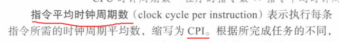

# 1. 计算机抽象.

组成计算机的5个经典部件:

* **输入**(键盘, 鼠标, LCD(带电容来触摸), 摄像头...)和**输出**(LCD(带电容来触摸), 音响...). 统称为**I/O设备**
* 存储器
* 数据通路(**运算器**)和**控制器** (合称为**处理器/中央处理单元/CPU**)
  * 数据通路(datapath)

## 1.2 内存

* **DRAM**(动态随机访问存储器. 易失性) 作为计算机的内存. 存储程序运行时的信息. 如DDR4/5内存条. 

* **SRAM**(静态随机访问存储器, 易失性)比DRAM更快, 集成度更低. 用在CPU/GPU的寄存器堆; 一些SoC也有片上SRAM作为快速工作内存. 最多几MB.

* **高速缓存**(cache memory)一般作为普通内存的缓冲.
* 主存: 可以理解为DRAM, 计算机的内存.
* 闪存/固态硬盘/SSD: 非易失性半导体存储. 更慢更便宜.  写入一定次数后损坏.
* 磁盘/硬盘/机械硬盘: 旋转盘片的磁介质材料非易失性存储. 

## 1.3 指令系统体系结构/体系结构/instruction set architecture/architecture/ISA/指令集架构

它是一本协议手册. 是硬件和软件之间的接口, 或者说契约. 它包含了程序员写二进制机器语言所需要的全部信息. 

操作系统封装了一些低级的功能, 提供给程序员基本指令系统和操作系统接口, 合称为**应用二进制接口(application binary interface, ABI)**.

ABI也是一本手册. 它规定:
-   **调用约定**：函数参数怎么传（寄存器？栈？），返回值放哪。 
-   **系统调用接口**：比如 Linux 的 `read()`、`write()` 系统调用号。  
-   **二进制格式**：可执行文件用 ELF 还是 PE。
-   **数据布局**：结构体、对齐方式、字节序。

# 2. 指令

冯·诺依曼 1945 年提出：
-   既然 **程序本质上也是一串指令（数字）**，为什么不把它和数据一样放进存储器？
-   CPU 从存储器里读指令，就能决定做什么运算；读数据，就能操作对象。
-   这样一来，换个程序就是换内存内容，不需要改电路。
这就是 **存储程序计算机（Stored-program Computer）**。

**如今所有现代计算机都采用冯诺依曼架构, 是存储程序计算机.**

# 6. 杂项

## 集成电路的成本

## 计算机的性能

## "栈"的词义演化

* 最基本的含义: 运算受限的线性表, LIFO, 后进先出。

* 函数运行的"栈区": 调用一个函数时, 计算机需要保存:
  -   返回地址（函数结束要跳回哪里）  
  -   局部变量  
  -   参数

    调用函数时, 要存这些数据, 如果这个函数调用期间又调用其他的函数, 还要存进去新函数的这些数据. 当一个函数返回时, 就可以清除它的数据. 这是一个LIFO结构, 所以我们把存储这些数据的区域称为**栈区**.
  -   调用函数 = `push`  
  -   函数返回 = `pop`

* 软件栈: 
这里的栈不再指代LIFO这种结构, 仅仅是一个层层堆叠的比喻. 
    -   在软件系统里，经常会有多层结构叠加：
    -   **应用程序**（App, 比如浏览器） 
    -   **标准库**（比如 C 标准库）  
    -   **操作系统接口**（系统调用）   
    -   **ISA / 硬件接口**（CPU指令集）

    这些层次就像一摞摞积木往上堆，**高层依赖低层**，因此大家习惯称它为**软件栈**.

