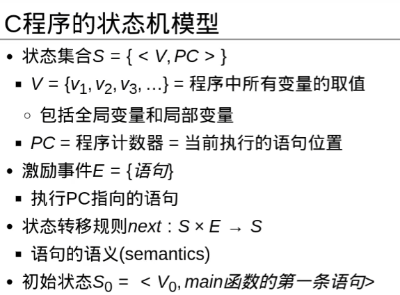

# 1. 计算机抽象.

组成计算机的5个经典部件:

* **输入**(键盘, 鼠标, LCD(带电容来触摸), 摄像头...)和**输出**(LCD(带电容来触摸), 音响...). 统称为**I/O设备**
* 存储器
* 数据通路(**运算器**)和**控制器** (合称为**处理器/中央处理单元/CPU**)
  * 数据通路(datapath)


## 1.2 内存

* **DRAM**(动态随机访问存储器. 易失性) 作为计算机的内存. 存储程序运行时的信息. 如DDR4/5内存条. 

* **SRAM**(静态随机访问存储器, 易失性)比DRAM更快, 集成度更低. 用在CPU/GPU的寄存器堆; 一些SoC也有片上SRAM作为快速工作内存. 最多几MB.

* **高速缓存**(cache memory)一般作为普通内存的缓冲.
* 主存: 可以理解为DRAM, 计算机的内存.
* 闪存/固态硬盘/SSD: 非易失性半导体存储. 更慢更便宜.  写入一定次数后损坏.
* 磁盘/硬盘/机械硬盘: 旋转盘片的磁介质材料非易失性存储. 


## 1.3 指令系统体系结构/体系结构/instruction set architecture/architecture/ISA/指令集架构

它是一本协议手册. 是硬件和软件之间的接口, 或者说契约. 它包含了程序员写二进制机器语言所需要的全部信息. 


操作系统封装了一些低级的功能, 提供给程序员基本指令系统和操作系统接口, 合称为**应用二进制接口(application binary interface, ABI)**.

ABI也是一本手册. 它规定:
-   **调用约定**：函数参数怎么传（寄存器？栈？），返回值放哪。 
-   **系统调用接口**：比如 Linux 的 `read()`、`write()` 系统调用号。  
-   **二进制格式**：可执行文件用 ELF 还是 PE。
-   **数据布局**：结构体、对齐方式、字节序。


## 1.4 计算机系统的状态机模型


简单回忆一下状态机


**程序是个状态机.**




事实上, C程序并不是从main()第一条指令开始, return指令结束的.
main函数其实也是有其他函数调用的.

main函数的第一次调用来自OS/运行时环境, 这个就是宿主环境.

之后的函数调用都是程序内部调用.


**CPU是个状态机**.

这是显然的, 数字电路是状态机.


**指令集是个状态机**.


👇下面的指令集状态机是简化版本的指令集. 真正的指令集不但有指令, 还有很多内存管理, I/O, 中断, 异常等等部分, 是状态更复杂, 转移规则更复杂(考虑I/O也作为规则等等)的状态机.

>R即寄存器; 包括PC和(RISC-V)32个通用整数寄存器;
>M即内存.


**程序, 指令, CPU状态机如何联系在一起?**
编译器实现这件事.

* **程序运行状态机**和**指令状态机**的转换: **编译器**
  * $s_{compile}$: 这个映射将描述程序运行的一组状态(即程序计数器和所有程序内变量的值)一一映射为指令集的一组状态(即寄存器+内存单元的值)
  * $e_{compile}$:这个映射将程序状态机的激励时间(函数语句)一一映射为汇编指令.
* **指令状态机**和**CPU状态机**的转换: 这个就是简单的数字电路一一对应咯


程序在CPU上运行的完整步骤:

| 步骤 | 内容 |
|------|------|
| 1 | 根据指令集手册的功能描述，画一张 CPU 的电路图 → **结构设计** |
| 2 | 用 RTL 代码描述 CPU 电路图 → **RTL 设计** |
| 3 | 根据 RTL 代码生成版图文件 → **后端物理设计** |
| 4 | 根据版图文件生产芯片 → **制造生产** |
| 5 | 编写程序 → **软件编程** |
| 6 | 将程序翻译成指令集手册中描述的指令序列 → **编译** |
| 7 | 程序在 CPU 上执行 = 指令序列控制 CPU 芯片电路进行状态转移 |
| 8 | 三个状态机产生联系：Sc ~ Sisa ~ Scpu |


## 1.5 程序的执行和模拟器


### 1.5.-1 交叉编译

它是相对于**本地编译**来说的.

#### 1.本地编译:

你在一台 **x86 的电脑**上写了 `a.c`，然后用普通的 `gcc` 编译：
```bash
gcc a.c -o a.out
```
编译器生成的 `a.out` 就是 **能在这台 x86 电脑上直接运行**的程序。  

👉 源代码和目标程序运行的环境（架构、系统）是一样的。

#### 2.  交叉编译(cross compilation)* 
你还是在 **x86 的电脑**上写 `a.c`，但是这次你想要它在 **RISC-V CPU** 上运行。  
那你得用一个“交叉编译器”：
    

```bash
riscv64-unknown-elf-gcc a.c -o a.elf
```
这个编译器不是生成 x86 机器码，而是生成 **RISC-V 的机器码**。  
👉 源代码和目标程序运行的环境 **不一样**。

换句话说：
-   编译发生在 x86 电脑上    
-   运行发生在 RISC-V 芯片（或者 QEMU 模拟的 RISC-V CPU）上
    
这就叫 **交叉编译**。

* 🚩 为什么要交叉编译？

  因为很多时候目标环境太弱（比如嵌入式开发板、微控制器）：
  -   它可能根本跑不动编译器   
  -   或者内存/存储不足  
      所以只能在 PC 上编译好程序，然后“交叉编译”成目标机器能跑的二进制，再烧进去或放进去运行。

***
我们选择交叉编译器`riscv64-unknown-elf-gcc`.
  -   **`riscv64`** → 目标架构是 RISC-V 64-bit（但它也能编译出 32-bit 的代码，加参数就行）    
  -   **`unknown`** → 没有指定具体厂商/平台（通用）    
  -   **`elf`** → 目标文件格式是 ELF（Executable and Linkable Format，Linux/嵌入式常用的可执行文件格式）   
  -   **`gcc`** → 编译器前端，C/C++ 源码编译器


安装它.
```bash
sudo apt install gcc-riscv64-unknown-elf
```

### 1.5.0 QEMU(Quick EMUlator)

就是一个开源的 **硬件模拟器**。

它能在你的 PC 上虚拟出各种 CPU 架构和硬件（x86、ARM、RISC-V、MIPS…），这样你就能：

-   在没有 RISC-V 硬件的情况下，模拟一台 RISC-V 板子；    
-   把你编译好的 **裸机程序** 或 **操作系统内核** 在 QEMU 里跑起来。
-   你需要写好程序源码(.c文件), 然后使用


在ubuntu上安装它.
```bash
sudo apt update
sudo apt install qemu-system-misc
```

安装完以后，你就有了很多命令，比如：
-   `qemu-system-riscv32` → 模拟 32 位 RISC-V 系统  
-   `qemu-system-riscv64` → 模拟 64 位 RISC-V 系统


注意qemu是一个大框架, 包含很多可执行程序:
qemu-system-<架构>

比如：
-   `qemu-system-x86_64` → 模拟 64 位 x86    
-   `qemu-system-arm` → 模拟 ARM    
-   `qemu-system-riscv32` → 模拟 RISC-V 32 位    
-   `qemu-system-riscv64` → 模拟 RISC-V 64 位

查看其中每个模拟器的版本:

```bash
azazel@DESKTOP-NJKSK6O:~/test$ qemu-system-riscv32 --version
QEMU emulator version 6.2.0 (Debian 1:6.2+dfsg-2ubuntu6.26)
Copyright (c) 2003-2021 Fabrice Bellard and the QEMU Project developers
```


### 1.5.1 程序运行在什麽环境??


#### 1.5.1.1 一个例子: 一个逻辑开发C程序

***

**选择qemu-system-riscv32作为freestanding环境,
riscv64-unknown-elf-gcc作为交叉编译器.**

***

0x10000000是qemu-system-riscv32中virt机器模型的串口地址.

写一个在逻辑环境中运行的_start()函数`a.c`
```c
#include <stdio.h>
void _start(){
    volatile uint8_t *p = (uint8_t *)(uintptr_t)0x10000000;
    *p = 'A';
    while(1);
}
```

使用编译指令:
```bash
riscv64-unknown-elf-gcc -march=rv32i -mabi=ilp32 \
    -ffreestanding -nostdlib -Wl,-Ttext=0x80000000 -O2 \
    a.c -o a.out
```


-   `-march=rv32i` → 目标架构是 RV32I 基础指令集    
-   `-mabi=ilp32` → ABI（应用二进制接口），使用 32-bit 寄存器宽度    
-   `-ffreestanding` → 告诉编译器这是裸机环境，不依赖标准库    
-   `-nostdlib` → 不链接 C 标准库（因为裸机没 libc）    
-   `-Wl,-Ttext=0x80000000` → 链接选项，把程序加载地址设为 `0x80000000`   
-   `-O2` → 优化等级    
-   `-o a.out` → 输出文件名


交叉编译完成后, 我们使用qemu模拟一个riscv32架构来运行它:


```bash
qemu-system-riscv32 -nographic -M virt -bios none -kernel a.out
```

-   **`qemu-system-riscv32`** → 启动 32 位 RISC-V 的 QEMU 模拟器    
-   **`-nographic`** → 不开图形界面，用终端输出（方便调试）    
-   **`-M virt`** → 模拟一台 “virt” 虚拟开发板（常见的通用机型）    
-   **`-bios none`** → 不加载 BIOS（因为你是 `-ffreestanding -nostdlib`，直接跑裸机程序）    
-   **`-kernel a.out`** → 把你刚刚编译好的 ELF 程序加载到虚拟机内存并执行

结果:顺利打印出A然后进入死循环.


***

然后我们来看看这个程序的汇编指令: (使用`riscv64-unknown-elf`交叉编译器工具链(安装见1.5.-1)内提供的objdump命令)

```bash
azazel@DESKTOP-NJKSK6O:~/test$ riscv64-unknown-elf-objdump -d a.out
```

输出:


```bash

a.out:     file format elf32-littleriscv


Disassembly of section .text:

80000000 <_start>:
80000000:       100007b7                lui     a5,0x10000
80000004:       04100713                li      a4,65
80000008:       00e78023                sb      a4,0(a5) # 10000000 <_start-0x70000000>
8000000c:       0000006f                j       8000000c <_start+0xc>
```

*** 

每一行是一条汇编指令.  以`80000000:       100007b7                lui     a5,0x10000
`为例, 
-   **`80000000:`**    
    -   这是这条指令所在的内存地址（PC = Program Counter）。        
    -   意味着 `_start` 函数的第一条指令位于 `0x80000000`。
        
-   **`100007b7`**    
    -   这是这条指令的 **机器码（十六进制编码）**。        
    -   RISC-V 每条指令固定 32 位（4 字节），所以 `0x100007b7` 就是这条 `lui` 的编码形式。        
    -   CPU 实际执行的就是这个机器码。
        
-   **`lui`**    
    -   这是指令助记符（Mnemonic），是人类可读的汇编指令。        
    -   `lui` = Load Upper Immediate（把立即数放到寄存器的高 20 位）。
        
-   **`a5,0x10000`**    
    -   指令的操作数。        
    -   表示：把立即数 `0x10000` 加载到寄存器 `a5` 的高 20 位。        
    -   执行后 `a5 = 0x10000 << 12 = 0x10000000`。


# 2. 指令

## 2.0 一些基本概念

冯·诺依曼 1945 年提出：
-   既然 **程序本质上也是一串指令（数字）**，为什么不把它和数据一样放进存储器？
-   CPU 从存储器里读指令，就能决定做什么运算；读数据，就能操作对象。
-   这样一来，换个程序就是换内存内容，不需要改电路。
这就是 **存储程序计算机（Stored-program Computer）**。

**如今所有现代计算机都采用冯诺依曼架构, 是存储程序计算机.**


**字节(byte)**
几乎所有现代计算机架构里（包括 x86 和 RISC-V），1 个字节 = 8 bit。

这是国际标准，基本不会变。

**字(word)**
-   **字(word)** 的含义：和机器架构紧密相关，通常指 **处理器自然操作的数据宽度**。在不同架构里，“word”的大小可能不同：     
    -   在 **RISC-V RV32/64**：一个字 = 32 bit（= 4 字节）           
    -   在早期 **x86（16 位 8086）**：一个字 = 16 bit      
    -   在现在 **x86-64**：虽然是 64 位处理器，但很多文档里仍把 word 定义成 16 bit，为了兼容历史（所以才有 `word`\=16b, `dword`\=32b, `qword`\=64b 的奇怪叫法 😂）。

-   **XLEN** 指的是一个具体 RISC-V 处理器实现中 **原生整数寄存器的位宽 (Native Integer Register Width)**.
    -   risc-v32， XLEN=32
    -   risc-v64， XLEN=64
     


* **操作数(operand)**: 在计算机指令里, 操作数就是指令要处理的数据. 它的物理存在就是寄存器. 
* **立即数**: 指的是指令里写的常数. 
    * 例如下面两条指令中:
      * 第一条指令中, a称为**目标操作数**, b,c称为**源操作数**
      * 第二条指令中, 1,2是**立即数**.
      * 操作数a, b, c是`x0`~`x31`32个**通用整数寄存器**之一. 对RV32架构, 它们是32bit宽的寄存器, 对RV64架构, 它们是64bit宽的寄存器.

```
add a. b. c    //将变量b,c相加, 其和放入a.
sub a. 2. 1    //将常数1-2, 其和放入a.
```

* 每个RISC-V算术指令只执行一个操作, 并且只有三个变量.
* 每行只能包含一条指令.
* 用//注释.
* 当我们说寄存器的时候, 一般默认指的是RISC-V架构下的那**32个通用整数寄存器（x0 - x31）**。而且，**只有它们可以直接作为算术和逻辑运算指令的操作数。**
* 更多的大量数据被存储在内存中. 需要**数据传输指令**把它们放到寄存器去里运算.
* 对于复杂指令集(CISC), 有时允许直接把内存地址A的值和内存地址B的值相加存到内存地址C. 这在RISC-V中不被允许. 所有算数必须先把数据搬到这32个寄存器里.


下面是一些常用数据传输指令:
```
-   `lw x1, (a)` // 载入指令Load word: 将内存地址A处的**字（Word）** 加载到寄存器x1。  
-   `lw x2, (b)` // 载入指令Load: 将内存地址B处的**字（Word）** 加载到寄存器x2。    
-   `add x3, x1, x2` // 运算指令: 在寄存器x1和x2上进行加法运算。  
-   `sw x3, (c)` // 存储指令Store word: 将寄存器x3中的结果**存储**回内存地址C。
```


* RISCV架构下(事实上所有架构特点都如此), 只有32个寄存器 


```
add a. b. c    //将变量b,c相加, 其和放入a.


//若想将四个变量b,c,d,e相加, 放入a中:
add a. b. c     //将b,c相加放入a
add a. a. d     //将a,d相加放入a
add a. a. e     
```


***
例题


## 2.1 解释器是啥?

我们熟悉的C是这样运作的:(省略预处理环节)
C源文件 → (编译器compiler) → 汇编代码 → (汇编器assembler) → 机器码 → (链接器linker) → 可执行文件

但是大多数其他高级语言如python, java, 追求**跨平台**(跨架构(X86, ARM, RISC-V...), 跨操作系统).

它们需要一个**解释器**. (一个软件. 它针对不同**操作系统**和**硬件架构**)而不同.

这些语言的源代码经过它们的**编译器**后, 生成**字节码bytecode**(`.class` 文件). 这个文件不是某个架构的汇编语言. 是一种中间语言, 它被设计为跨平台的东西. 事实上它是一个虚拟的指令集(也写成一条条指令的样子, 虽然它并不能直接被任何架构读取...)

这些字节码文件通过解释器得到可执行程序.

实际操作上, 解释器被集成在**JVM(Java Virtual Machine，Java虚拟机)**中. 可以认为JVM对应C中的`编译为汇编指令,链接`任务.


java程序多种运行方式:
-   **纯解释执行 (Interpreter mode)**   
    -   JVM 直接逐条把字节码解释成机器指令运行。        
    -   优点：启动快，不需要额外编译。        
    -   缺点：运行效率低，因为每条字节码都要被“现场翻译”一次。
        
-   **JIT 编译执行 (Just-In-Time)**
    
    -   JVM 在运行过程中，发现某段代码经常被调用，就会 **动态把那部分字节码编译成本地机器码**。        
    -   这样后续运行时就直接执行机器码，不再解释。        
    -   优点：热点代码性能接近 C 程序。        
    -   缺点：第一次编译会有额外开销，所以启动稍慢。
        
-   **AOT (Ahead-Of-Time) 编译**（新一些的技术，比如 GraalVM 支持）  
    -   在运行前，就直接把 Java 字节码提前编译成本地机器码。        
    -   优点：启动快，性能稳定。        
    -   缺点：失去了一些跨平台和动态优化的灵活性。


# 6. 杂项

## 集成电路的成本


## 计算机的性能


## "栈"的词义演化

* 最基本的含义: 运算受限的线性表, LIFO, 后进先出。

* 函数运行的"栈区": 调用一个函数时, 计算机需要保存:
  -   返回地址（函数结束要跳回哪里）  
  -   局部变量  
  -   参数

    调用函数时, 要存这些数据, 如果这个函数调用期间又调用其他的函数, 还要存进去新函数的这些数据. 当一个函数返回时, 就可以清除它的数据. 这是一个LIFO结构, 所以我们把存储这些数据的区域称为**栈区**.
  -   调用函数 = `push`  
  -   函数返回 = `pop`

* 软件栈: 
这里的栈不再指代LIFO这种结构, 仅仅是一个层层堆叠的比喻. 
    -   在软件系统里，经常会有多层结构叠加：
    -   **应用程序**（App, 比如浏览器） 
    -   **标准库**（比如 C 标准库）  
    -   **操作系统接口**（系统调用）   
    -   **ISA / 硬件接口**（CPU指令集）

    这些层次就像一摞摞积木往上堆，**高层依赖低层**，因此大家习惯称它为**软件栈**.


