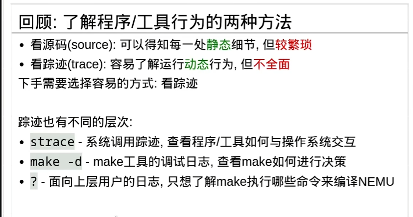
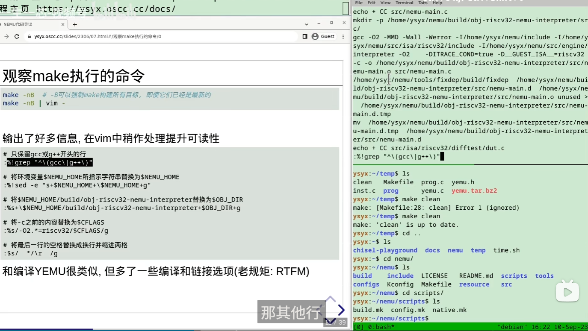
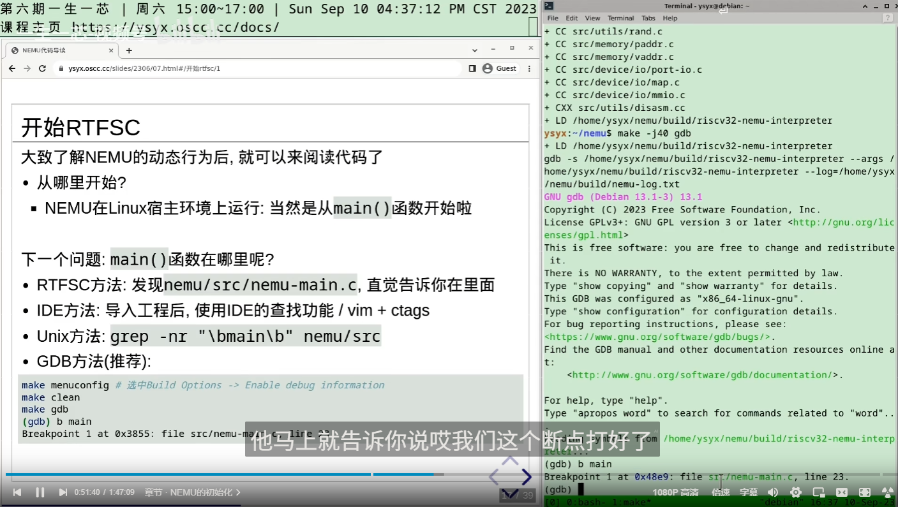

# 0. 常用命令&环境变量


* $(nproc)
  * Number of PROCessors


# 1.小工具

## 1.1 nano

**nano 的设计哲学：**

-   **所见即所得** - 直接输入文字
    
-   **无模式切换** - 不需要在普通模式、插入模式之间切换
    
-   **快捷键组合** - 所有功能都用 Ctrl/Alt 组合键完成


#### 基本导航

-   **光标移动**：直接使用方向键
    
-   **转到文件开头**：`Alt+\` 或 `Alt+Home`
    
-   **转到文件结尾**：`Alt+/` 或 `Alt+End`
    
-   **转到行首**：`Ctrl+A`
    
-   **转到行尾**：`Ctrl+E`
    

#### 编辑操作

-   **撤销**：`Alt+U`
    
-   **重做**：`Alt+E`
    
-   **复制**：`Alt+6` 或 `Ctrl+6`（先标记，然后移动光标选择区域）
    
-   **剪切**：`Ctrl+K`
    
-   **粘贴**：`Ctrl+U`
    

#### 搜索和替换

-   **搜索**：`Ctrl+W`
    
-   **替换**：`Ctrl+\`
    

#### 文件操作

-   **保存**：`Ctrl+O`
    
-   **退出**：`Ctrl+X`
    

#### 帮助

-   **显示帮助**：`Ctrl+G` - 所有快捷键都会显示在屏幕底部


## 1.2ccache

ubuntu自装. 在`/usr/lib/ccache/`

配置:

先确定装了没有:
```bash
which ccache
```

在./.bashrc最后加入`export PATH="/usr/lib/ccache:$PATH"`


原理:`/usr/lib/ccache/gcc`是一个和gcc同名的脚本文件.

在PATH的开头插入该路径, 导致用户输入`gcc`命令的时候优先选择`/usr/lib/ccache/gcc`, 劫持了真正的gcc编译器. 而前者就是ccache设计的包装器. 它自动管理什麽时候用缓存, 什麽时候调用gcc重新编译.

类似的劫持做法:

-   **ccache**：劫持 gcc, g++, clang 等编译命令
    
-   **virtualenv**：劫持 python, pip 命令
    
-   **nvm**：劫持 node, npm 命令
    
-   **conda**：劫持各种科学计算命令


```
ccache确实跳过了完全重复的编译过程, 发挥了加速的作用. 如果和多线程编译共同使用, 编译速度还能进一步加快!

在开发项目的过程中, 有时确实会需要在清除编译结果后进行全新的编译(fresh build). 到了PA的后期, 你可能会多次编译一些包含数百个文件的库, 在这些场合下, ccache能够极大地节省编译的时间, 从而提高项目开发的效率.
```

## 1.3 fceux-am

这是一个红白机模拟器项目...


## 1.4 strace

这是 Linux 下的一个系统调用跟踪工具，它能记录程序执行过程中所有的系统调用（比如 open、read、write、mmap、execve 等）。

也就是说，它能看到程序“和内核之间都说了啥”。 

例子:

`strace -f -o strace.log make --debug=v`

| 选项               | 含义                                              |
| ---------------- | ----------------------------------------------- |
| `-f`             | 跟踪所有由主进程创建的子进程（比如 `make` 会 fork 出许多编译子进程）       |
| `-o strace.log`  | 把输出保存到 `strace.log` 文件中，而不是直接打印到终端              |
| `make --debug=v` | 执行 `make` 命令，并启用 **verbose 模式**，显示 make 的详细调试输出 |


# 3.系统调用 syscall

操作系统内核掌控了所有硬件资源（文件、内存、网络、设备等）。  
普通程序（比如 `make`、`gcc`）不能直接访问这些资源，必须通过**系统调用**来请求内核帮忙。

例如`write`, 实际上是一段汇编指令:

```asm
write:
    mov eax, 1        ; 系统调用号 1 对应 write
    mov edi, 1        ; 第一个参数 fd=1
    mov rsi, msg      ; 第二个参数 buffer
    mov edx, 5        ; 第三个参数 length
    syscall            ; 🚪 触发系统调用，进入内核
    ret
```

在C语言中, 有关内核调用的函数都是一个**陷阱接口**(wrapper).


| 调用名                                           | 作用                         | 举例说明                                                 |
| :-------------------------------------------- | :------------------------- | :--------------------------------------------------- |
| `read(fd, buf, count)`                        | 从文件描述符 `fd` 里读数据到缓冲区 `buf` | 比如从文件或终端输入读取内容                                       |
| `write(fd, buf, count)`                       | 向文件描述符 `fd` 写数据            | 比如向屏幕（stdout=1）打印输出                                  |
| `close(fd)`                                   | 关闭文件描述符                    | 类似 C 语言里的 `fclose()`                                 |
| `openat(dirfd, path, flags, mode)`            | 打开文件（新版的 open）             | 比如 `openat(AT_FDCWD, "main.c", O_RDONLY)` 打开当前目录下的文件 |
| `newfstatat(dirfd, path, statbuf, flags)`     | 获取文件的元信息（大小、时间戳、权限等）       | `make` 用它来判断「文件是否比目标新」                               |
| `brk(addr)`                                   | 改变进程的堆（heap）边界，用来申请或释放堆内存  | 类似 `malloc()` 在底层调用的东西                               |
| `mmap(addr, length, prot, flags, fd, offset)` | 申请一段内存映射区域                 | 比如加载共享库或大块文件                                         |
| `fcntl(fd, cmd, arg)`                         | 操作文件描述符的属性（比如非阻塞模式、锁）      | `gcc` 或 shell 常用它控制文件句柄                              |
| `execve(path, argv, envp)`                    | 执行一个新程序                    | `make` 用它启动 `gcc` 或其他命令                              |
| `clone()` / `fork()`                          | 创建子进程                      | make 会用来并行执行多个任务                                     |
| `exit_group(code)`                            | 结束整个进程组                    | 程序正常退出时调用的系统调用                                       |


# 4. 思想

## 4.1



## 4.2



# 2 nemu

## 2.0 初探框架代码


框架代码内容众多, 其中包含了很多在后续阶段中才使用的代码. 随着实验进度的推进, 我们会逐渐解释所有的代码. 因此在阅读代码的时候, 你只需要关心和当前进度相关的模块就可以了, **不要纠缠于和当前进度无关的代码, 否则将会给你的心灵带来不必要的恐惧.**


```
ics2024
├── abstract-machine   # 抽象计算机
├── am-kernels         # 基于抽象计算机开发的应用程序
├── fceux-am           # 红白机模拟器
├── init.sh            # 初始化脚本
├── Makefile           # 用于工程打包提交
├── nemu               # NEMU
└── README.md


nemu
├── configs                    # 预先提供的一些配置文件
├── include                    # 存放全局使用的头文件
│   ├── common.h               # 公用的头文件
│   ├── config                 # 配置系统生成的头文件, 用于维护配置选项更新的时间戳
│   ├── cpu
│   │   ├── cpu.h
│   │   ├── decode.h           # 译码相关
│   │   ├── difftest.h
│   │   └── ifetch.h           # 取指相关
│   ├── debug.h                # 一些方便调试用的宏
│   ├── device                 # 设备相关
│   ├── difftest-def.h
│   ├── generated
│   │   └── autoconf.h         # 配置系统生成的头文件, 用于根据配置信息定义相关的宏
│   ├── isa.h                  # ISA相关
│   ├── macro.h                # 一些方便的宏定义
│   ├── memory                 # 访问内存相关
│   └── utils.h
├── Kconfig                    # 配置信息管理的规则
├── Makefile                   # Makefile构建脚本
├── README.md
├── resource                   # 一些辅助资源
├── scripts                    # Makefile构建脚本
│   ├── build.mk   #编译规则. 包含源文件和头文件的依赖关系. 由gcc的-MMD选项生成, 通过fixdep工具处理.
│   ├── config.mk
│   ├── git.mk                 # git版本控制相关
│   └── native.mk   # 一些用于运行和清除编译结果的.PHONY目标
├── src                        # 源文件
│   ├── cpu
│   │   └── cpu-exec.c         # 指令执行的主循环
│   ├── device                 # 设备相关
│   ├── engine
│   │   └── interpreter        # 解释器的实现
│   ├── filelist.mk
│   ├── isa                    # ISA相关的实现
│   │   ├── mips32
│   │   ├── riscv32
│   │   ├── riscv64
│   │   └── x86
│   ├── memory                 # 内存访问的实现
│   ├── monitor                #监视器.
│   │   ├── monitor.c
│   │   └── sdb                # 简易调试器
│   │       ├── expr.c         # 表达式求值的实现
│   │       ├── sdb.c          # 简易调试器的命令处理
│   │       └── watchpoint.c   # 监视点的实现
│   ├── nemu-main.c            # 你知道的...
│   └── utils                  # 一些公共的功能
│       ├── log.c              # 日志文件相关
│       ├── rand.c
│       ├── state.c
│       └── timer.c
└── tools                      # 一些工具
    ├── fixdep                 # 依赖修复, 配合配置系统进行使用
    ├── gen-expr
    ├── kconfig                # 配置系统
    ├── kvm-diff
    ├── qemu-diff
    └── spike-diff

```


NEMU主要由4个模块构成: 
* monitor, 
  * Monitor(监视器)模块是为了方便地监控客户计算机的运行状态而引入的. 它除了负责与GNU/Linux进行交互(例如读入客户程序)之外, 还带有调试器的功能, 为NEMU的调试提供了方便的途径. 从概念上来说, monitor并不属于一个计算机的必要组成部分, 但对NEMU来说, 它是必要的基础设施. 如果缺少monitor模块, 对NEMU的调试将会变得十分困难.
* CPU, 
* memory, 
* 设备. 


我们已经在上一小节简单介绍了CPU和memory的功能, 设备会在PA2中介绍.


这个页面对上述API进行了整理, 供将来查阅使用, 目前你无需完全明白它们的作用. "抽象"是计算机系统中一个非常重要的概念, 如果你现在不明白抽象的意义, 不必担心, 在PA的后续内容中, 你会一次又一次地遇到它.

https://ysyx.oscc.cc/docs/ics-pa/nemu-isa-api.html


###  2.0.1 配置系统 kconfig

```
在一个有一定规模的项目中, 可配置选项的数量可能会非常多, 而且配置选项之间可能会存在关联, 比如打开配置选项A之后, 配置选项B就必须是某个值. 直接让开发者去管理这些配置选项是很容易出错的, 比如修改选项A之后, 可能会忘记修改和选项A有关联的选项B. 配置系统的出现则是为了解决这个问题.
```

NEMU中的配置系统位于`nemu/tools/kconfig`, 它来源于GNU/Linux项目中的kconfig, 我们进行了少量简化. kconfig定义了一套简单的语言, 开发者可以使用这套语言来编写"配置描述文件". 在"配置描述文件"中, 开发者可以描述:

-   配置选项的属性, 包括类型, 默认值等
-   不同配置选项之间的关系
-   配置选项的层次关系

在NEMU项目中, "配置描述文件"的文件名都为`Kconfig`, 如`nemu/Kconfig`. 当你键入`make menuconfig`的时候, 背后其实发生了如下事件:

-   检查`nemu/tools/kconfig/build/mconf`程序是否存在, 若不存在, 则编译并生成`mconf`
-   检查`nemu/tools/kconfig/build/conf`程序是否存在, 若不存在, 则编译并生成`conf`
-   运行命令`mconf nemu/Kconfig`, 此时`mconf`将会解析`nemu/Kconfig`中的描述, 以菜单树的形式展示各种配置选项, 供开发者进行选择
-   退出菜单时, `mconf`会把开发者选择的结果记录到`nemu/.config`文件中
-   运行命令`conf --syncconfig nemu/Kconfig`, 此时`conf`将会解析`nemu/Kconfig`中的描述, 并读取选择结果`nemu/.config`, 结合两者来生成如下文件:
    -   可以被包含到C代码中的宏定义(`nemu/include/generated/autoconf.h`), 这些宏的名称都是形如`CONFIG_xxx`的形式
    -   可以被包含到Makefile中的变量定义(`nemu/include/config/auto.conf`)
    -   可以被包含到Makefile中的, 和"配置描述文件"相关的依赖规则(`nemu/include/config/auto.conf.cmd`), 为了阅读代码, 我们可以不必关心它
    -   通过时间戳来维护配置选项变化的目录树`nemu/include/config/`, 它会配合另一个工具`nemu/tools/fixdep`来使用, 用于在更新配置选项后节省不必要的文件编译, 为了阅读代码, 我们可以不必关心它


## 2.1 开始阅读代码: main

main在哪里? 

在nemu/src/nemu-main.c


//如何找一个项目的main? 最好的方法: gdb在main符号处打断点




