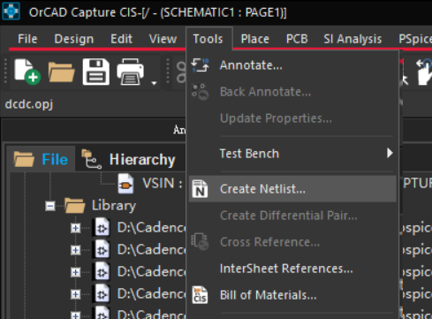

# 1.软件指南
(22.1版本)
集成在cadence里. 安装cadence后, 有很多很多应用程序...

电路仿真流程: 先用**Capture CIS**画原理图; 然后使用**PSpice**对其仿真.
- Capture CIS这个程序. 它用来画原理图。
- pspice AD这个程序. 它用来做模拟/数字电路的仿真.

## 1.1 Capture CIS

打开`Capture CIS`, 即`D:\Cadence\SPB_22.1\tools\bin\Capture.exe` 
双击运行后弹出选择suite界面, 选择启动模块为`OrCAD Capture CIS`.或者`Allegro Design Authoring`

### 1.1.1 capture cis的项目文件结构:

(这是打开.dsn后在应用程序里的视图, 然而实际文件夹视图似乎不是这样...)
简单说一下项目文件夹内的文件结构:

- Design Resources
	- <项目名>.dsn(工程文件)
		- SCHEMATIC1(第一份电路)
			-PAGE1(第一张电路图)
			-PAGE2
			-...
		- Design Cache(缓存.)
	- Library(元件库.里面放着很多.olb(Orcad lib)文件, 即元件库文件.如果你添加元件时没法搜索到你想要的，它可能不在这些路径里，要自己手动添加到这里哦.)
		-D:\Cadence\SPB_22.1\tools\capture\library\pspice\analog.olb(模拟器件)
		-D:\Cadence\SPB_22.1\tools\capture\library\pspice\breakout.olb(?)
		-D:\Cadence\SPB_22.1\tools\capture\library\pspice\source.olb(电源)
		-D:\Cadence\SPB_22.1\tools\capture\library\pspice\sourcestm.olb(电源?)
		-D:\Cadence\SPB_22.1\tools\capture\library\pspice\special.olb(?)
- layout
- Outputs(仿真结果,波形文件)
- PSpice Resources(仿真资源)
	- Include Files(外部的.lib文件)
	- Model Libraries(PSpice要用到的模型库, 比如三极管模型, OP-AMP模型)
	- Simulation Profiles(仿真配置. 时间;分析类型(DC, Transient, AC Sweep等))
	- Stimulus Files(激励文件, 即输入波形)
- Logs(日志)

### 1.1.2 软件界面

#### Online DRCs

它是下方超有用的功能区.
DRC = Design Rule Check
Online DRCs = 实时设计规则检查

当你在电路图中放置元件、连接电线的时候，软件自动检查你的设计有没有“低级错误”，比如没连好线、管脚悬空、短路、错误模型等～

它会立刻在下方 Online DRCs 界面列出这些“违规信息”，帮你发现隐患喵！

### 1.1.3 元件选型

#### 1.1.3.1 元件库
常用的library有:
bipolar(各种型号二极管)
ANALOG
SOURCE
BREAKOUT
SOURCSTM
SPECIAL

#### 1.1.3.2 常用元件

选择元件的几种方法:
右侧菜单栏place part;
顶部菜单栏place->part;
顶部菜单栏place->Pspice part;

* `G`放置GND
* `W`放置wire

#### 1.1.3.3 器件的参数设置:
* 法一: 双击器件显示完整的属性表.
* 法二: 双击器件名称/参数数字, 弹出简略的属性表.

PSpice 有它自己的默认单位体系.

想表达的意思 | 正确写法 | 错误写法
|-|-|-|
频率 50 Hz | 50Hz 或 50（默认单位是 Hz） | ❌ 50HZ（PSpice区分大小写）
50kHz | 50kHz or 50k |-- 
电压 5 V | 5V | ❌ 5v（可能会被当成变量）
电容 10 μF | 10u | ❌ 10μ（希腊字母 μ 不识别）
电阻 1kΩ | 1k | ❌ 1K（大写 K 代表 Kelvin）

单位 | 缩写
|-|-|
f | femto = 10⁻¹⁵ | 
p | pico = 10⁻¹² | 
n | nano = 10⁻⁹ | 
u | micro = 10⁻⁶ （注意：用 u 不是 μ！） | 
m | milli = 10⁻³ | 
k | kilo = 10³ | 
Meg | Mega = 10⁶ | 
G | Giga = 10⁹ | 

**常用电源**
请查阅:
https://blog.csdn.net/impossible1224/article/details/81837955

* `交流电流源IAC`(用在AC sweep分析)
	ACMAG|ACPHASE |DC 
	|----------|------------|------------|
	交流幅值 |相位|直流分量

* `ISIN`(用在transient analysis)
	属性 | 全称 | 含义 | 举例 | 对仿真类型的作用
	|---|---|---|---|---|
	VOFF | Offset Voltage | 偏置电压（正弦波的中轴线） | 0V、1V | 控制波形上下移动
	VAMPL | Amplitude | 振幅（从中轴上下跳的量） | 5V | 控制波峰、波谷距离
	FREQ | Frequency | 频率，单位 Hz | 1k (1kHz) | 控制波每秒震几次
	AC | AC Magnitude | AC Sweep时的交流幅值 | 1 | 只对 AC 分析有用！瞬态不看这个喵！❌

* Diode的属性:
* `Implementation`即"改元建在仿真中绑定的模型名". value即为模型名. 比如, 如果value=`Dbreak` 表示用的是理想二极管模型, value=`D1N4148`表示用的是D1N4148 二极管. 如果你改的value模型名字在当前库找不到, 会在下方DRG界面warning.

找不到的型号可以通过在place part界面的search(选择path默认为所有本地library的目录).
再找不到就自己做或者官网找.

## 1.2 PSpice仿真:
电路搭建后需要选择tools->create netlist(如果灰色, 说明没有在资源管理器处design resource->选中你的项目文件(./[你的项目名称].dsn))
需要Create Netlist（生成网表）是一个关键的功能，主要用于将你的电路图转换为 PSpice 仿真所需的数据格式。

### 1. transient analysis 瞬态分析

瞬态分析（Transient Analysis）是：
在一段时间内，模拟电路所有节点的电压、电流随时间怎么变化的过程。

通俗点说就是：

从 T = 0s 开始，一直模拟到 T = Xs， 中间每个时刻都算出电压/电流是多少，画成波形图 📈.

如果想进行瞬态分析, 想加入一个正弦电流源, 不能用`IAC`器件:

它是频域分析专用交流源, **不是随时间震荡的信号**. 事实上, 它用作**频域分析(AC sweep)**.

对于transient analysis, 应当选择:
`VSIN`/`ISIN`; `VPULSE`/`IPULSE`; `VEXP`/`IEXP`.

### 2. AC sweep 频域分析

即看频率响应. 输出增益/相位曲线.

### 3. DC bias 静态分析

即看电路稳定点. 输出是所有电压电流的固定数值.

