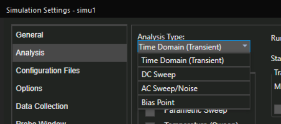

# 1.软件指南
(22.1版本)
集成在cadence里. 安装cadence后, 有很多很多应用程序...

电路仿真流程: 先用**Capture CIS**画原理图; 然后使用**PSpice**对其仿真.
- Capture CIS这个程序. 它用来画原理图。
- pspice AD这个程序. 它用来做模拟/数字电路的仿真.

## 1.1 Capture CIS

打开`Capture CIS`, 即`D:\Cadence\SPB_22.1\tools\bin\Capture.exe` 
双击运行后弹出选择suite界面, 选择启动模块为`OrCAD Capture CIS`.或者`Allegro Design Authoring`

### 1.1.1 capture cis的项目文件结构:

(这是打开.dsn后在应用程序里的视图, 然而实际文件夹视图似乎不是这样...)
简单说一下项目文件夹内的文件结构:

- Design Resources
	- <项目名>.dsn(工程文件)
		- SCHEMATIC1(第一份电路)
			-PAGE1(第一张电路图)
			-PAGE2
			-...
		- Design Cache(缓存.)
	- Library(元件库.里面放着很多.olb(Orcad lib)文件, 即元件库文件.如果你添加元件时没法搜索到你想要的，它可能不在这些路径里，要自己手动添加到这里哦.)
		-D:\Cadence\SPB_22.1\tools\capture\library\pspice\analog.olb(模拟器件)
		-D:\Cadence\SPB_22.1\tools\capture\library\pspice\breakout.olb(?)
		-D:\Cadence\SPB_22.1\tools\capture\library\pspice\source.olb(电源)
		-D:\Cadence\SPB_22.1\tools\capture\library\pspice\sourcestm.olb(电源?)
		-D:\Cadence\SPB_22.1\tools\capture\library\pspice\special.olb(?)
- layout
- Outputs(netlist, 仿真结果,波形文件)
  - pstxnet.dat	(Netlist 数据文件	包含了电路的“网络连接”信息，哪些引脚和哪些线相连)
  - pstxprt.dat	(元件属性文件	描述了你用的每一个元件的名字、属性（比如值、模型名）等)
  - pstchip.dat	(封装/引脚映射文件	主要用于 PCB 布局，描述芯片的封装、引脚映射等数据)

- PSpice Resources(仿真资源)
	- Include Files(外部的.lib文件)
	- Model Libraries(PSpice要用到的模型库, 比如三极管模型, OP-AMP模型)
	- Simulation Profiles(仿真配置. 时间;分析类型(DC, Transient, AC Sweep等))
    	- SCHEMATIC1-bias 这是默认生成的仿真文件.
    	- SCHEMATIC1-<your_simuname> 你自己生成的仿真文件在这里.
    	- ...
	- Stimulus Files(激励文件, 即输入波形)
- Logs(日志)

		#### lib介绍
		说明:本介绍包含了\capture\library\pspice和capture\library\pspice\advanls目录下所有库,但由于作者水平有限,介绍得也比较简单,有些说明可能不一定对.请高手指正.谢谢！

		1.1_SHOT              : 10个杂项器件,其中有54，74，CD的
		2.7400~74S            : 74系列的器件
		3.AA_IGBT             : IGBT是强电流、高压应用和快速终端设备用垂直功率MOSFET
		4.AA_MISC             : 杂项DIODE MOSFET
		5.ABM                 : 各种数学运算单元,如cos,sin,log,hipass,lowpass等,还有E/F/H/G等元件.
		6.ADV_LIN             : ALD系列的线性放大器
		7.ANA_SWIT            : 模拟开关
		8.ANALOG和ANALOG_P    : 通用模拟器件,R，C，L
		9.ANL_MISC            : 杂项模拟器件,如三相变压器，555，RELAY，SWITCH，VCO
		10.ANLG_DEV           : AD公司放大器,电压参考器件，
		11.APEX               : APEX公司PA/AM 系列运放
		12.APEX_PWM           : APEX公司系列PWM控制器
		13.ASW                : DG系列模拟开关
		14.BIPOLAR~BJPD       : 三极管
		15.BREAKOUT           : 用于最坏情况分析的元件。RAM,ROM,DA8/10/12,AD/8/10/12,R,SWITCH,Q,POT  (                       滑动变阻器),M,X(TRANSFORER)
		16.BUF & BUFF_BRN     : BUFFERS
		17.CD4000             : CD系列器件
		18.CEL                : NE系三极管
		19.COMLINR            : CLC系列BUFF,OPA
		20.CONTROLLER         : 电源控制电路，DC TO DC
		21.CORES              : 磁芯
		22.DARLNGTN           : EPITAXIAL SILICON TRANSISTOR
		23.DATACONV           : AD,DA
		24.DI                 : DIODE
		25.DIF                : DIODE BRIDGE
		26.DIG_ECL            : D Flip-Flop
		28.DIG_GAL            : Generic Array Logic
		29.DIG_MISC           : mixed digital device
		30.DIG_PAL            : programable Array Logic
		31.DIG_PRIM           : Generic digitial device: and,add,Flip_Flop
		32.DIH                : diode pull-up and pull-down network
		33.DIODE              : diode
		34.DIV                : diode v
		35.DIZ                : diode z
		36.DRI                : MIXED
		37.EBIPLOAR           : bipolar
		38.EDIODE             : diode
		39.ELANTEC            : ELANTEC半导体公司器件,运放,门电路等
		40.EPCOS              : EPCOS公司器件,磁珠,压每电阻,NTC等。
		41.EPWRBJT            : bjt
		42.FAIRCHILD          : fairchild device
		43.FILTSUB            : mixed
		44.FUNCTION           : 函数器件
		44.FWBELL             : FWBELL 公司的霍尔元件
		45.HARRIS             : HARRIS公司相关产品
		46.IGBT               : IGBT管
		47.INFINEON~INFINEON_SIGCXXT120 : INFINEON产品
		48.IXYS                         : IXYS公司的功率管产品
		49.JBIPOLAR                     : 日本产品,三极管
		50.JDIODE                       : 日本产品,二极管
		51.JFET                         : 日本产品,FET
		52.JFN                          : 日本产品,NFET
		53.JFP                          : 日本产品,PFET
		54.JJFET                        : 日本产品,JJFET
		55.JOPAMP                       : 日本产品,运放
		56.LIN_TECH                     : LINEAR 公司产品,主要是运放,也有reference
		57.LINEDRIV                     : LINEAR 公司产品,主要是门电路
		58.MAGNETIC                     :MAGNETIC公司磁芯

		59.MAXIM                        :  MAXIM公司产品
		60.MFN                          : Fairchild,IR等公司N型功率MOS
		61.MFP                          : Fairchild,IR等公司P型功率MOS
		62.MIX_MISC                     : 4046,Relay等
		63.MOTOR_RF                     : 飞思卡尔射频三极管
		64.MOTORSEN                     : 飞思卡尔压力传感器
		65.NAT_SEMI                     : 国半产品
		66.NEC_MOS                      : NEC产品
		67.ON_AMP~ON_PWM                : ON产品,依次是三极管,二极管,MOS管,开关电源控制芯片 (                                 MC33363,MC44608,NCP1200
		68.OPA & OPAMP                  : 常用运放
		69.OPT                          : 光耦
		70.OPTO                         : 光耦
		71.PHIL_BJT~PHIL_RF             : 飞利浦器件
		72.POLYFET                      : POLYFET公司的MOS管
		73.PSPICE_ELEM                  : 用pspiceAA分析的元件,L,R,C,I,V,变压器绕线
		74.PWRBJT                       : 功率三极管
		75.PWRMOS                       : 功率MOS管
		76.RFBJN                        : 射频三极管N
		77.RFBJP                        : 射频三极管P
		78.RFDIO                        : 射击频二极管
		79.SAH                          : HA2420,HA5320,LF398H高速精密采样保持放大器,
		80.SHINDNGN                     : SHINDENGEN公司整流桥,二极管
		81.SOURCE                       : 各种源
		82.SOURCESTM                    : 数字仿真信号源
		83.SPE~SPECIAL                  : 特殊元件。print,param,IC,nodeset,VARIABLES,lib,include等很多(                                 与仿真功能、设置等相关的
		84.SPICE_ELEM                   : 流控,压控,电池,微/积分,零/极点,加减乘除等

		85.SWIT_RAV                     : 开关电源仿真所用到的通用开关器件模型,分电流/电压型,CCM/DCM,(                                 大/小信号模型
		86.SWIT_REG                     : microsemi公司的SG系列开关电源芯片如SG1844等
		87.TEX_INST                     : TI的系列运放和它的TL431,但不全,新运放还得从TI网站上下.
		88.THY1                         : ST,飞思卡尔等公司的可控硅。
		89.THYRISTR                     : 同样是可控硅,与上面有些不同,更全一点.
		90.TLINE                        : 传输线
		91.TYCO_ELEC                    : Tyco公司压敏电阻
		92.TZB                          : 单双向二极管,有常用的P6KE68A等
		93.VD                           : 电压检测器,MC33064,S8054ALR等

		94.VR                           : Voltage regulator，如常用的7805,TL431等。
		95.XTAL                         : 晶振
		96.ZETEX                        : zetex公司三极管等.
		97.以osram开头的15个库          : osram公司的发光二极管等 

### 1.1.2 软件界面

#### Online DRCs

它是下方超有用的功能区.
DRC = Design Rule Check
Online DRCs = 实时设计规则检查

当你在电路图中放置元件、连接电线的时候，软件自动检查你的设计有没有“低级错误”，比如没连好线、管脚悬空、短路、错误模型等～

它会立刻在下方 Online DRCs 界面列出这些“违规信息”，帮你发现隐患喵！

### 1.1.3 元件选型

#### 1.1.3.1 元件库
常用的library有:
bipolar(各种型号二极管)
ANALOG
SOURCE
BREAKOUT
SOURCSTM
SPECIAL

#### 1.1.3.2 常用元件

选择元件的几种方法:
右侧菜单栏place part;
顶部菜单栏place->part;
顶部菜单栏place->Pspice part;

* `G`放置GND
* `W`放置wire

#### 1.1.3.3 器件的参数设置:
* 法一: 双击器件显示完整的属性表.
* 法二: 双击器件名称/参数数字, 弹出简略的属性表.

PSpice 有它自己的默认单位体系.

想表达的意思 | 正确写法 | 错误写法
|-|-|-|
频率 50 Hz | 50Hz 或 50（默认单位是 Hz） | ❌ 50HZ（PSpice区分大小写）
50kHz | 50kHz or 50k |-- 
电压 5 V | 5V | ❌ 5v（可能会被当成变量）
电容 10 μF | 10u | ❌ 10μ（希腊字母 μ 不识别）
电阻 1kΩ | 1k | ❌ 1K（大写 K 代表 Kelvin）

单位 | 缩写
|-|-|
f | femto = 10⁻¹⁵ | 
p | pico = 10⁻¹² | 
n | nano = 10⁻⁹ | 
u | micro = 10⁻⁶ （注意：用 u 不是 μ！） | 
m | milli = 10⁻³ | 
k | kilo = 10³ | 
Meg | Mega = 10⁶ | 
G | Giga = 10⁹ | 

**常用电源**

请查阅:
https://blog.csdn.net/impossible1224/article/details/81837955

* `交流电流源IAC`(用在AC sweep分析. 没有freq属性, 在transient瞬态分析中没有用, 会被当作一个直流为DC值得直流源! `VAC`同理!!❌)
	ACMAG|ACPHASE |DC 
	|----------|------------|------------|
	交流幅值 |相位|直流分量

--------------

* `ISIN`(用在transient analysis)
	属性 | 全称 | 含义 | 举例 | 对仿真类型的作用
	|---|---|---|---|---|
	VOFF | Offset Voltage | 偏置电压（正弦波的中轴线） | 0V、1V | 控制波形上下移动
	VAMPL | Amplitude | 振幅（从中轴上下跳的量） | 5V | 控制波峰、波谷距离
	FREQ | Frequency | 频率，单位 Hz | 1k (1kHz) | 控制波每秒震几次
	AC | AC Magnitude | AC Sweep时的交流幅值 | 1 | 只对 AC 分析有用！瞬态不看这个喵！❌

-----------

* `VPULSE`脉冲电压源
	| 参数名                  | 含义            | 举例说明                             |
	| -------------------- | ------------- | -------------------------------- |
	| `V1`                 | 初始电压（Low 电平）  | 脉冲没来时的电压，例如 `0 V`                |
	| `V2`                 | 峰值电压（High 电平） | 脉冲电平跳起后的电压，例如 `5 V`              |
	| `TD` *(Time Delay)*  | 延迟时间          | 从仿真开始到第一个脉冲上升沿出现的时间，如 `1 ms`     |
	| `TR` *(Rise Time)*   | 上升沿持续时间       | 脉冲从 `V1` 升到 `V2` 所用时间，如 `10 ns`  |
	| `TF` *(Fall Time)*   | 下降沿持续时间       | 脉冲从 `V2` 降到 `V1` 所用时间，如 `10 ns`  |
	| `PW` *(Pulse Width)* | 脉冲宽度          | 电压维持在 `V2` 的时间（高电平持续时间），如 `1 ms` |
	| `PER` *(Period)*     | 脉冲周期          | 从一个上升沿到下一个上升沿的总时间，如 `2 ms`       |

---------------

* Diode
  * `Implementation`即"改元建在仿真中绑定的模型名". value即为模型名. 比如, 如果value=`Dbreak` 表示用的是理想二极管模型, value=`D1N4148`表示用的是D1N4148 二极管. 如果你改的value模型名字在当前库找不到, 会在下方DRG界面warning.

--------------

* NPN
  * `Implementation`
    * QbreakN: 理想NPN
    * Q2N3906: 2N3906NPN

---------------

* PNP
  * `Implementation`
    * QbreakP: 理想PNP
    * Q2N3904: 2N3904PNP

找不到的型号可以通过在place part界面的search(选择path默认为所有本地library的目录).
再找不到就自己做或者官网找.

## 1.2 PSpice仿真:

**生成网表**
电路搭建后需要选择tools->create netlist(如果灰色, 说明没有在资源管理器处design resource->选中你的项目文件(./[你的项目名称].dsn))
需要Create Netlist（生成网表）是一个关键的功能，主要用于将你的电路图转换为 PSpice 仿真所需的数据格式。

也可以点击这个按钮生成网表.

生成网表后, 在`outputs`里会显示
- pstxnet.dat	(Netlist 数据文件	包含了电路的“网络连接”信息，哪些引脚和哪些线相连)
- pstxprt.dat	(元件属性文件	描述了你用的每一个元件的名字、属性（比如值、模型名）等)
- pstchip.dat	(封装/引脚映射文件	主要用于 PCB 布局，描述芯片的封装、引脚映射等数据)

生成网表后, 点击`run pspice`进行仿真.

或者在顶部选项卡`PSpice`选择`run`

**生成仿真文件**

在上方选项卡`PSpice`中选择`new simulation profile`来创建一个新的仿真文件.

然后弹出simulation settings:

有四个分析模式选择:
- Time Domain (Transient) 瞬态分析
- DC Sweep 直流扫描
- AC Sweep 交流扫描/噪声
- Bias Point 直流工作点分析(稳态分析)

### 1. transient analysis 瞬态分析

瞬态分析（Transient Analysis）是：
在一段时间内，模拟电路所有节点的电压、电流随时间怎么变化的过程。

通俗点说就是：

从 T = 0s 开始，一直模拟到 T = Xs， 中间每个时刻都算出电压/电流是多少，画成波形图 📈.

如果想进行瞬态分析, 想加入一个正弦电流源, 不能用`IAC`器件:

它是频域分析专用交流源, **不是随时间震荡的信号**. 事实上, 它用作**频域分析(AC sweep)**.

对于transient analysis, 应当选择:
`VSIN`/`ISIN`; `VPULSE`/`IPULSE`; `VEXP`/`IEXP`.

### 2. AC sweep 频域分析

即看频率响应. 输出增益/相位曲线.

### 3. DC bias 静态分析

即看电路稳定点. 输出是所有电压电流的固定数值.

