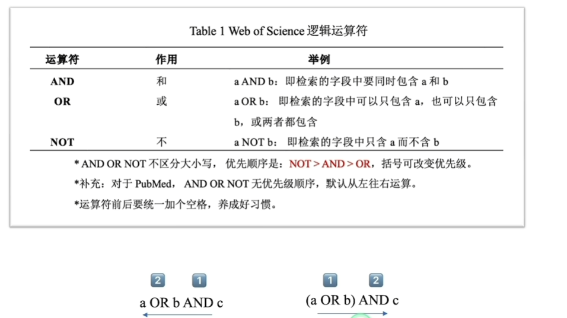
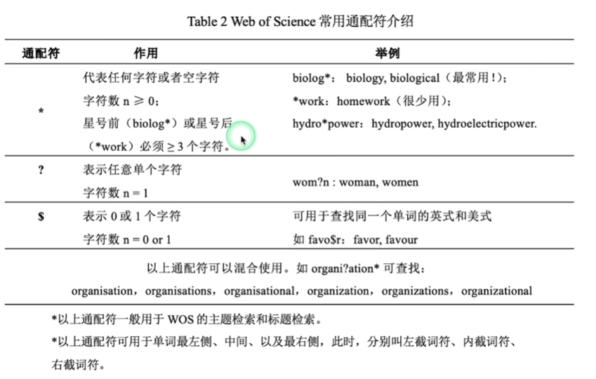
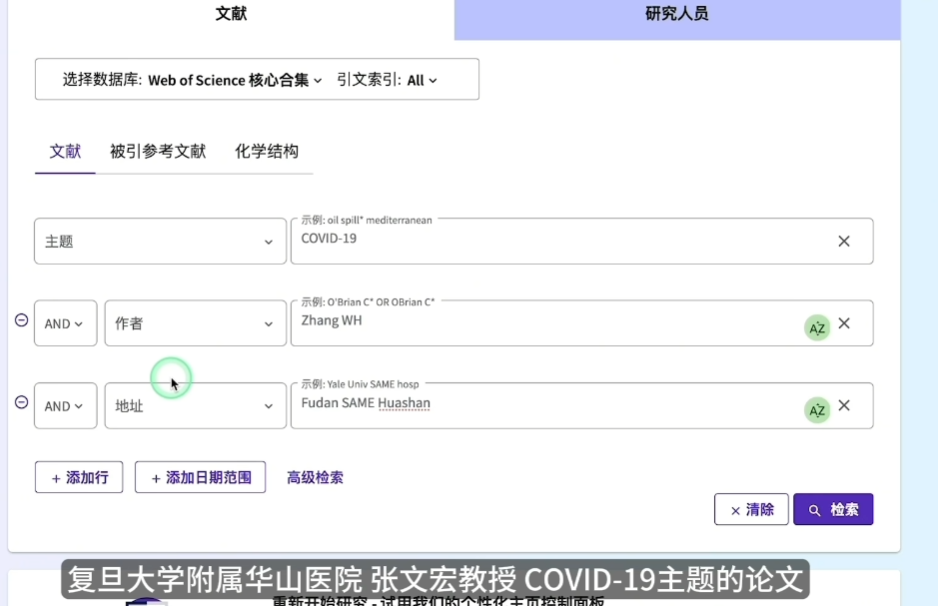
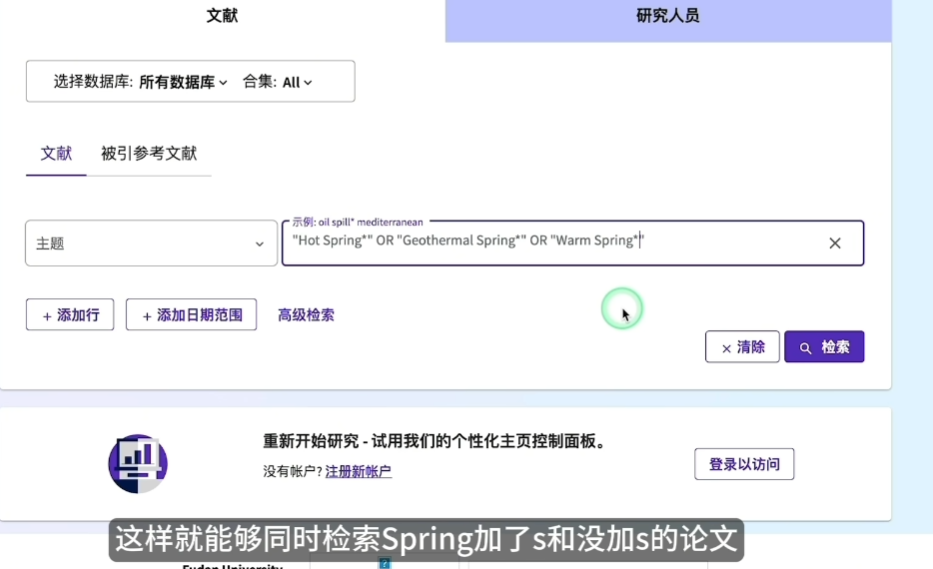
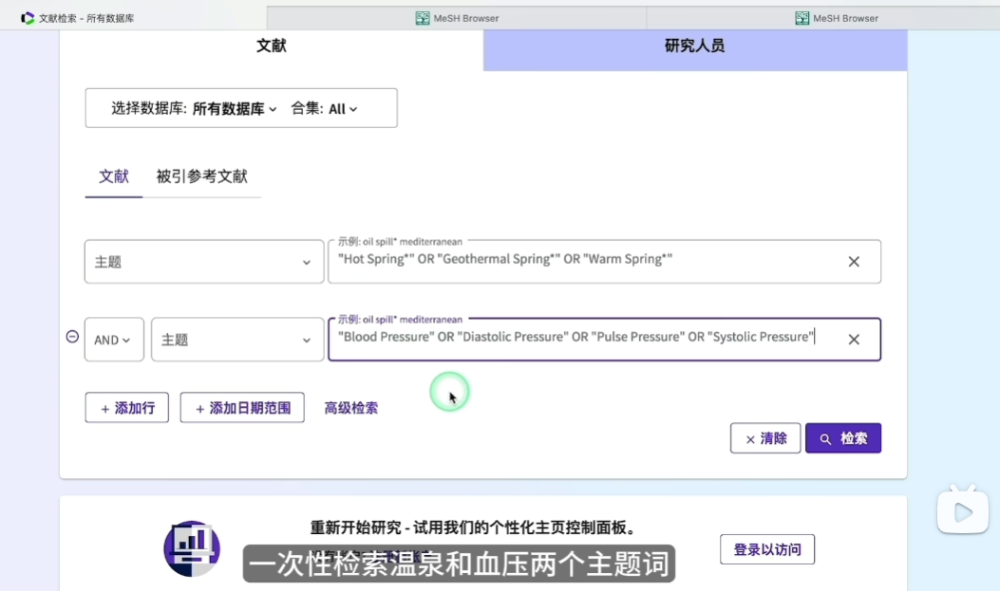

# 核心检索规则

* WOS不区分字母大小写
* 布尔逻辑运算

* 通配符
  

* 短语检索

"a short word" 双引号内的内容会被看为一个整体而不会被空格分割影响.

# 检索界面

三种检索方式:

* 基本检索
* 被引参考文献检索
* 高级检索

## 1. 基本检索

选择数据库为
Web of Science Core Collection

**字段**可以选择
* topic: 检索的范围为: 标题+摘要+作者关键词
* title
* 出版物(期刊)
* 作者

例如:

例子:

## 2. 高级检索

会话检索式:
这里记录了在此session中的历史检索式.
勾选其中几项后, 可以点阿吉组配检索式, 用AND或OR连接这些字段.

# 文献下载

全文数据库: 提供全文下载, 如知网
文摘数据库: 不提供全文下载, 如WOS, PubMed

对于那些无法免费阅读的, 可以用sci-hub复制DOI检索

# 结果过滤和排序

# 分析检索结果

万方的查询教程
https://www.bilibili.com/video/BV1dgqCY1Ekt?spm_id_from=333.788.player.switch&vd_source=4665566d92a194d3e4867c96fe3441c0