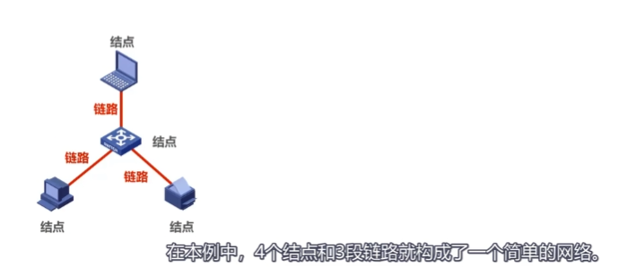
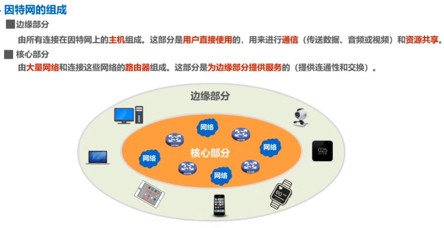
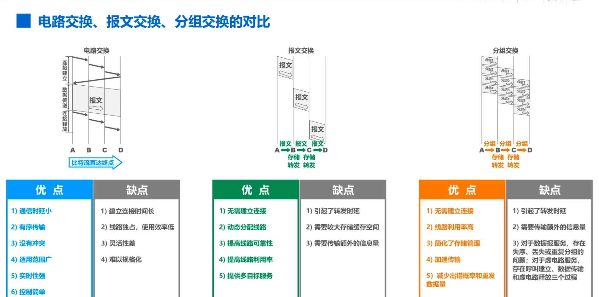

### 1.2 因特网概述

* **网络** = 若干**结点node**  + 若干**链路link**(有线链路/无线链路).

* **互联网(internet)** = 多个网络通过**路由器**互连起来, 是网络的网络.
* **因特网(Internet)** = 目前全球最大的互联网络, 采用TCP/IP协议作为通信规则, 其前身是每过ARPANET.
* **主机(host)** = 连接在Internet上的计算机. 是网络中的一个结点.

#### Internet历史
>1969年, 美国第一个分组交换网ARPANET
>1983年, TCP/IP协议称为ARPANET标准协议, 标志着Internet诞生.
>1985年, NSF围绕六个大型计算机中心,  建设了NSFNET(主干网,地区网和校园网)
>1991年, 美国政府将因特网交给私人经营经营
>1993年, NSFNET被若干个商用因特网主干网替代, 政府机构不负责运营, 而让各种 **因特网服务提供者(ISP,Internet Service Provider)** 来运营.
* 我国主要的ISP是中国电信, 中国联通, 中国移动.
>1995年, NSFNET停止运作, Internet彻底商业化.

#### 基于ISP的三层结构的Internet

### 1.3 三种交换方式
#### 电路交换(circuit switching)
是物理上的电路交换. 座机就是使用电路交换.
电话交换机, 其实就是一个开关, 可以控制哪两个线路联通.

#### 报文交换
相比分组交换, 不把一个报文拆为分组+报头, 一整个交换. 也需要路由器缓存转发. 已过时.

#### 分组交换(Packet Swictching)
路由器是最重要的分组交换机.
通过路由器的两主机的一次报文传输:
>发送方: 构造,发送分组
>路由器: 缓存,转发分组
>接收方: 接收,还原分组

#### 总结:
>A, B, C, D为传输路径上所要经过的4个结点, 纵坐标↓为时间.

### 1.5 计算机网络的性能指标
>速率: 主机在数字信道上传送比特的速率. 例: 某段链路的发送速率为100Mbps.
>带宽:   
- [模电]信号所包含的不同频率成分, 即频带宽度.(Hz)    
- [计网]两点之间传输的最高速率.(B/s)
- 事实上, 一条通信线路的频带宽度越高, 最高速率也越高.
>吞吐量: 单位时间通过某个网络/接口的数据量, 吞吐量最高就是带宽.
>时延: 延迟. 贡献自 发送时延, 传播时延,  处理时延
>时延带宽积: 
>往返时间: 
>利用率: 
>丢包率:  
>
>
>
>

