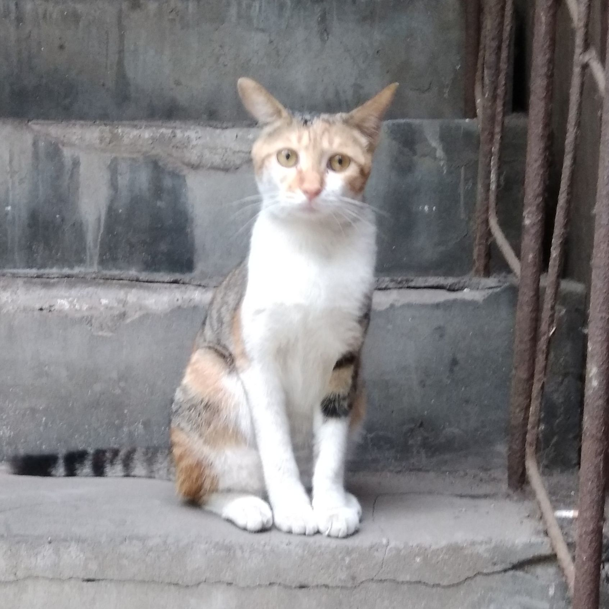

<table>
	<tr style="height: 50px;">
		<td style="font-size: 1.8em;"><strong>王淙豫👨‍💻</strong></td>
		<!-- <td style="font-size: 1.5em;"><strong>求职意向：xxx</strong></td> -->
		<td rowspan="5">
			
		</td>
	</tr>
	<tr>
		<td>工作经验：一年</td>
		<td>电话：13663801701</td>
	</tr>
	<tr>
		<td>出生年月：2003年1月</td>
		<td>邮箱：azazelplusplusplus@gmail.com</td>
	</tr>
	<tr>
		<td>现住址：陕西西安</td>
		<td>教育背景：2021届 西安交通大学大学 本科 电子科学与技术方向</td>
	</tr>
	<tr>
		<!-- 
        <td><a href="https://juejin.cn/user/4182956056773160/posts">博客主页</a></td> 
        -->
		<td><a href="https://github.com/azazelplus">GitHub主页</a></td>
	</tr>
</table>

### ==😎专业技能==

- 熟悉 **C** 、**C++** 和 **面向对象编程**，熟悉 **linux** 和服务器基础知识。掌握 **python** 和 **matlab** 处理批量数据。
- 熟悉 **verilog、vivado、vitis** 等常用硬件设计语言和流程，熟悉 **zynq** 系列等常用开发流程。
- 了解 **java** 数据库 **HTML** 的基本知识。
<!
<!-- - [稀土掘金](https://juejin.cn/user/4182956056773160/posts) 优秀创作者，[CSDN](https://blog.csdn.net/little_stick_i?type=blog) 万粉博主，个人公众号 程序员阿杆，**全网阅读量超 80W** -->
- 本科期间有10余次省级及以上学科竞赛获奖经历

<!-- ### ==🏢工作经历==

<h4 style="display: flex;justify-content: space-between;">
一、公司名称 - 部门Web后台研发2023.04 - 至今
</h4>

- 公司应用的功能版本迭代、开发上线、公共组件库维护、软件技术文档编写；
- 线上故障定位和解决、性能优化、模块代码重构。

<h4 style="display: flex;justify-content: space-between;">
二、公司名称 - 部门Java后台开发实习2022.08 - 2022.12
</h4>

- 根据实际情况填写根据实际情况填写根据实际情况填写根据实际情况填写根据实际情况填写

### ==💻工作项目==

> ps：工作项目的内容都是我瞎写的，仅作为模板参考，并不是真实的项目经历。

<h4 style="display: flex;justify-content: space-between;">
一、微信小程序主力开发2024.02 - 2024.04
</h4>
项目背景及描述：

- 对公司现有的APP应用开发一款微信小程序，实现了主要的业务功能，提升用户体验和业务效率。

我的工作内容：

- 从 0 到 1 进行项目功能设计、开发、备案、运维、上线等所有工作；
- 接入微信开放平台和微信商户平台，支持 **微信登录、微信支付**；
- 接入阿里云OSS，实现服务端签名、客户端直传、服务端接收回调通知的应用方式；
- 设计并实现 **消息系统**，支持消息群发和单独发送，群发状态下仅存储一条主体消息，节省存储空间。

<h4 style="display: flex;justify-content: space-between;">
二、根据实际情况填写协作开发2023.10 - 2024.01
</h4>
项目描述：

- 根据实际情况填写根据实际情况填写根据实际情况填写根据实际情况填写根据实际情况填写
- 根据实际情况填写根据实际情况填写根据实际情况填写根据实际情况填写根据实际情况填写

我的工作内容：

- 根据实际情况填写根据实际情况填写根据实际情况填写根据实际情况填写根据实际情况填写
- 根据实际情况填写根据实际情况填写根据实际情况填写根据实际情况填写根据实际情况填写
- 根据实际情况填写根据实际情况填写根据实际情况填写根据实际情况填写根据实际情况填写
- 根据实际情况填写根据实际情况填写根据实际情况填写根据实际情况填写根据实际情况填写

<h4 style="display: flex;justify-content: space-between;">
三、其他2023.05 - 至今
</h4>

- 优化“xxx”应用，对慢SQL和复杂查询进行排查和优化，**p95延时从4000ms降低到了50ms**；
- 根据自己实际情况填写

 -->

### ==🚀个人项目==

<h4 style="display: flex;justify-content: space-between;">
一、基于FPGA的声场相机小组开源项目2022.03 - 2022.07
</h4>

> 该项目利用16路数字麦克风阵列采集声信号，利用**波束形成算法**进行声源定位。

- 使用**ZYNQ7020**作为主控芯片，基于**I2S**协议与麦克风通信，基于**HDMI**协议和串口协议与用户端通信。除主控芯片以外的大量硬件设备，均由小组自主设计
- PL端，基于两条360MHz的高速全吞吐流水线，我们以纯电路的形式实现了波束形成算法。对于传统处理器，波束形成算法运算量大，实时性差。而依托于FPGA强大的并行计算能力，我们的系统有着超强的实时性。在每个采样周期内，都可以实现一次定位结果的全面刷新。
- PS端，我们充分发挥ZYNQ器件的灵活性，为用户提供了可交互的友好界面，用户不但可以读出声源方位，还可以实时调节声源定位的灵敏度。并且我们还提供了自动调节功能，帮助用户快速锁定不稳定的声源。。
- 该项目获得该年全国大学生嵌入式芯片与系统设计竞赛 国赛一等奖 和 本届最佳创意奖。

<!-- 
<h4  style="display: flex;justify-content: space-between;">
二、项目名称个人开源项目2024.04 - 至今
</h4>

> 基于 SpEL 的参数校验包，也是 javax.validation 的扩展增强包，用于简化参数校验。**<u>GitHub Star 70+</u>，[开源地址](https://github.com/stick-i/spel-validator)**。

- 提供强大的参数校验功能，几乎支持任何场景下的参数校验。扩展自 javax.validation 包，只新增不修改，无缝集成到项目中；
- 基于 SpEL（Spring Expression Language） 表达式，支持复杂的校验逻辑。支持调用 Spring Bean，可在表达式中使用注入的 Bean 对象；
- 简单易用，使用方式几乎与 javax.validation 一致，学习成本低，上手快；
- 无需额外的异常处理，校验失败时会上报到 javax.validation 的异常体系中；
- 支持自定义校验注解，可根据业务需求自定义校验逻辑。

 
-->

### ==🏆获奖经历==

- 2024年全国大学生嵌入式芯片与系统设计竞赛  - 国赛一等奖 - 本届最佳创意奖
- 软件著作权一项
- 国励奖学金三项、校级奖学金两项

