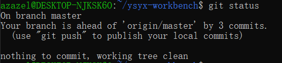

# bash命令 
linux中输入的命令行即为bash命令。每个bash命令是一个可执行程序(在/bin中储存). 创建一个可执行的bash命令行文件, 即为bash脚本script.


## man 
想要搜索的外部命令名可以跳转到该命令的man界面. 如果想查看bash内部命令, 比如cd, pwd, 使用help即可.
man -k <keyword>可以输出所有简介中包含关键字的man条目供你选择, 而不是直接进入某个具体的man条目.

 
## find
find /指定路径下 -type f -name "filename" 
输出查找到的文件的路径. \
其中选项-type的参数为: -f(regular file), -d(directory), -l(symbolic link)等. -name可以替换为-iname, 即不区分大小写.
find经常和grep一起使用. find的结果|到grep中进行更细致的名称筛选. 比如find ~ -iname "my_first_program"和命令find ~ | grep -i "my_first_program"是等价的, 运行速度也几乎一样.

## grep
格式为**grep -E "chars"**， 输出-E选项开启扩展正则表达式(ERE), 若没有这个选项, 系统会用基本正则表达式(BRE)来识别""内的字符. 
- 注意: BRE和ERE有不同: ERE支持 **|** 符号为"或", 而BRE需要用转义字符搭配 **/|** 为"或".


cat /etc/centos-release	查看centos版本。即cat显示命令和centos的版本信息存储地址.


## xargs (extended arguments, 扩展参数)
- UNIX/Linux 命令的设计原则：
**命令行参数**：专门用于传递文件名或其他参数。
**标准输入stdin**：用于传递数据流。
函数根据不同的输入来源（命令行参数或标准输入）来采取不同的处理方式。命令行参数传递的是文件名，而标准输入传递的是数据流，这是 UNIX 命令处理输入的一种惯例和规范。 对大多数函数,如cat, wc, 如果没有指定命令行输入文件(即参数没有填), 它会将'input_desc'设置为'STDIN_FILENO',从标准输入(通常来自管道符|)中读取stdin. 而标准输入stdin是一个文本, 如果标准输入是一串参数(如一个读取出来的文件列表), 需要使用xargs将其转化为命令行参数. 例子:

```bash
azazel@DESKTOP-NJKSK6O:~/test/test$ wc -l testfile4.h
6 testfile4.h
azazel@DESKTOP-NJKSK6O:~/test/test$ vim testfile4.h
azazel@DESKTOP-NJKSK6O:~/test/test$ find . | grep ".c" | wc -l
2
azazel@DESKTOP-NJKSK6O:~/test/test$ find . | grep ".c" | xargs wc -l
0 ./testfile3.c
0 ./testfile1.c
0 total
```


## wc (word count,词数统计)
**wc -l file**  输出file文件的行数(对一行的一句话,即显示字母数).\
-w：显示单词数。\
-m：显示字符数（与 -c 类似，但在处理多字节字符时有所不同）。\
-c：显示字节数。


## motion
[motion]包括 hjkl(四向), w(下一个word开头), e(下一个word ending), 0(当前line开头), ^(当前line不为空格的开头.), $(当前line ending), G(文档ending), gg(文档开头)等，即cursor移动操作。


## ud (disk usage磁盘使用情况)
- 格式:
**du -sc 路径**

- 选项 -s(--summarize), 只显示每个参数的总和, 不显示每个子目录的用量. 
- 选项 -c(--total), 最后加上一个总计.

## df (disk free, 显示文件系统的磁盘空间占用情况)
- 选项 -h (human-readable) 将输出格式化为易于阅读的形式，如以 KB、MB、GB 等单位显示，而不是以字节数显示。
- example
  ```bash
  df -h | tee disk_usage.txt    #将磁盘使用情况输出在终端上,并且存入文件disk_usage中
  ```

## sort (数据排序工具)
经常以pipe(|)接前一个函数的输出流, 以达到整理后使输出更加美观/易读的目的.
- 格式: **sort -nr 文件(一般以某个路径下的全部(用通配符实现)子文件/.../*表示)**
- 选项 -n(numerical), 按数值排序
- 选项 -r(reverse), 降序. 

## more & less
- more, 用于分页显示文件内容或输入。它一次显示一页内容，用户可以按空格键查看下一页，按 q 键退出。
- 格式: **more filename**
- 示例: 
```bash
more AVeryVeryLongDocument.txt
```

- less,比 more 更强大的逐屏查看文件内容工具。其命名是一个笑话(less>more). 常用操作：

    - 按空格键（Space）滚动到下一屏。
    - 按 b(back) 键滚动到上一屏。
    - 按回车键（Enter）滚动一行。
    - 按 k 键向上滚动一行。
    - 按 j 键向下滚动一行。
    - 按 / 键进入搜索模式，输入要搜索的字符串，按 Enter 键搜索。
    - 按 q 键退出。

## gcc(GNU compiler Collection, GNU 编译器套装")
- 格式:     
  <span style="color: red;"> 
  **gcc [选项] [源文件] -o [输出文件]**</span>,

  或者    <span  style="color: red;">  
   **gcc [选项]  -o [输出文件] [源文件] </span> (只要-o后面跟着输出文件命名, 源文件放在前面和最后都是可以的)** 
   
   这命令将源(文本)文件.c编译为可执行文件'输出文件'.
- 选项-o表示输出文件的名称(如果不加-o [输出文件], 则在则会默认生成名为a.out的文件, 它的含义是assembler output)
- 选项-O:优化代码. 有-O1(一级优化), -O2(二级优化), -O3(三级优化)三个等级.
- 选项 -g

## tee(这个名字来自字母T, 一个三向接口, 寓意数据分流)
这个命令读取标准输入, 并将数据输出到多个目标中.
- 语法:
```bash
command | tee [options] [file...]
```
- 选项: 
  - -a 将内容append到文件最后, 而不是直接覆写文件. 
- example:

  ```bash
   ls -la | tee output.txt  #将当前文件列表显示在终端,同时保存在文件output.txt中
  ```
  ```bash
   echo "a new line" | tee -a file  #将新的一行文字append到file结尾, 同时在终端显示这行文字.
  ```


## objdump(object dump, 对象转储)
用于显示和分析二进制文件的内容。在软件开发和逆向工程中，objdump 常用于反编译和查看程序的汇编代码。
格式为**objdump <选项> <file>**
- 选项: 用于switch显示什麽信息(所以至少要填一个选项)
  - -S Intermix source code with disassembly,将源代码和反汇编代码混合显示.
  - -d disassembly, 反汇编所有可执行的节.
- example
  ```bash
  objdump -d myprog > disassembly_of_myprog.txt #将可执行程序myprog反汇编,将反汇编内容存储在disassembly_of_myprog.txt中.
  ```

## time 
在命令前面加上time , 可以在执行命令后, 输出该命令的执行时间，包括 总耗时（real）、用户时间（user） 和 系统时间（sys）


## curl
**curl**用来从网络上获取数据. -s选项是silence模式,级不显示进度信息.
```bash
curl -s $URL
```


# 重定向 (< , > , &, >>)
\>符号表示将左边的命令的标准输出stdin写入右边的文档中, 称为重定向.
如果加上&, 即&> 这个符号表示将标准输出stdin和<span style="color: red">
标准错误stderr
</span>
都重定向.
而>>表示把内容append到文件里而不是覆写.
\>符号同理.

## 一些应用:
- ```bash
  > newfile #创建一个新文档newfile. (即,将'空'重定向到newfile中) 它和touch newfile不同在于后者更安全: 如果存在名字为newfile的文件, > newfile删除了其全部文件, 而touch newfile不会进行任何操作.
  ```

 - ```bash
   cat file1 > file2 #复制file1文档到file2文档. (即, 显示file1的文档内容, 将内容重定向到file2) 它和cp file1 file2效果大部分时候相同, 但事实上后者可以保留文件权限和元数据.

   ```
   
 - ```bash
   ./myprog < data.txt  #如果myprog需要从键盘上读入大量数据(例如一个图的拓扑结构), 当你需要反复对myprog进行测试的时候, 你需要多次键入大量相同的数据. 只需要将myprog读入的数据一次性输入到文件data中, myprog就会从文件data中读入数据, 节省了大量的时间.
   ```
   - ```bash
    

     ```


# make命令和Makefile
make命令利用Makefile(一个txt)工作, 用于自动化编译和构建程序的过程。使用方法是在项目文件夹中同时放入源文件和一个名为Makefile的文本文件,然后在当前项目文件夹目录下直接键入命令make.

Makefile是一个特定格式(见下文)的文本文件, 由一组规则组成，其中每个规则通常包含三个部分：目标、先决条件（或依赖项）和配方（要执行的命令）。

Makefile 的一般格式:
目标(target)：要创建或更新的文件或对象。这通常是可执行文件或目标文件。

先决条件(dependencies/Prerequisites)：目标所依赖的文件。如果这些文件中的任何一个发生更改，目标将被重建。

Recipe : make 将执行的命令来创建或更新目标。这些命令必须使用制表符（而不是空格）缩进。
```bash
#一个规则的构成:
target: prerequisites
	recipe  #注意是/t而不是空格
```
例子:
```bash
hello:hello.c
	gcc hello.c -o hello	

.PHONY: clean  
 #.PHONY: targetName是一种特殊的指令，用于告诉 make，clean 是一个伪目标（也就是不与某个具体文件相关的目标）。这可以防止有同名文件时的冲突。
 #在 Makefile 中，目标（target）通常对应于要生成的文件，例如可执行文件或编译后的目标文件。但有时，目标可能不会生成一个文件，而是用于执行某个动作，比如清理编译生成的文件。这些目标就是伪目标（phony targets）。
 #如果你在当前目录下有一个名字叫 clean 的文件，而你在 Makefile 中也有一个 clean 目标，那么 make clean 时，Makefile 可能会认为目标已经满足，而不会执行清理操作。使用 .PHONY 可以告诉 make 这个目标是伪造的，不要检查同名文件是否存在。

clean:
	rm hello	
```
每次运行make命令时, make会检查源文件和目标文件(如果已经存在同名目标文件)的时间戳. 如果发现目标文件已经存在, 并且时间戳新于所有依赖源文件, 那麽会停止命令, 并且输出"make: 'hello' is up to date."(没有需要更新的文件)


# linux的用户(组)管理
linux的权限管理包括用户和用户组, 两者权限系统互相独立, 一个用户可以存在在多个用户组中， 但必须至少存在在一个用户组中。

## 用户组管理
###  创建用户组 groupadd 命令(可能需要sudo)
```bash
groupadd newgroup
```
### 删除用户组  groupdel 命令
```bash
groupdel group
```
### 查看用户组  cat /etc/group 即可.

## 用户管理
### 添加用户 adduser 命令
```bash
useradd -g groupName -d homePath userName
#添加一个用户.
# -g 选项用于将新用户添加到某个已经存在的用户组中. 如果没有-g 选项, 会默认创建一个和新用户名同名的新用户组, 并把新用户放进去. 
# -d 选项用于指定用户的home文件夹位置. 若没有 -d 选项,会将用户的home文件夹默认放在/home中.
```
### 删除用户 userdel 命令
```bash
userdel -r userName
#删除一个用户.
# -r 选项用于删除用户的home目录. 否则将保留其目录和内部文件.
```

### 查看用户所属组 id 命令
```bash
id userName
#如果不输入userName, 直接id, 默认查看当前用户的信息.
```


各个组的常见用途：
- adm：管理员组，通常用于授予访问系统日志文件的权限。
- sudo：允许用户执行需要超级用户权限的命令。
- dialout：允许用户访问串口设备（如调制解调器）。
- cdrom、floppy、audio：这些组允许访问相应的硬件设备（如光驱、软盘驱动器和音频设备）。
- video：允许访问视频设备。
- plugdev：允许用户访问即插即用设备（如 USB 设备）。
- netdev：通常用于网络设备管理。


### 修改用户所属组 usermod 命令
```bash
usermod -aG groupName userName
#  -aG选项即append group, 在不改变$userName当前所属组的前提下将其添加到$groupName中. 
#  若没有则会把$userName当前所属的组剔除, 并将其加到$groupName组. 
```


### 查看本系统所有用户名单 cat /etc/passwd 即可.


## 修改文件(夹)的权限信息 chmod (change mode)命令 
```bash
chmod [-R] 权限(r/w/x) 
# -R表示递归操作, 即对文件夹内的全部内容应用.
# u(user), g(group), o(other)
#例子:
chmod u=rwx, g=rx, o=x hello.txt
```
除了上述符号模式参数, 也可以用数字模式参数:
数字模式中的每一位都代表用户 (user)、用户组 (group) 和其他人 (others) 的权限。权限用一个三位数来表示：

>r (读权限) = 4\
>w (写权限) = 2\
>x (执行权限) = 1\
>无权限 = 0\
从而, 7=rwx, 6=rw-, 4=r--,...
数字模式的权限是通过将这些值相加来确定的。
```bash
#为了确保 SSH 能正常工作，你需要设置文件的权限.
chmod 600 ssh_key #等同于chmod u=rw-, g=---, o=--- ssh_key
chmod 604 ssh_key #
```
## 修改文件(夹)的所属用户(组) chown (change owner)
只能以root用户执行.
```bash
chown [-R] [user]:[group] file

# 例子:
chown azazel hello.txt #将hello.txt所属用户改为azazel
chown :sudo hello.txt #将hello.txt的所属用户组改为sudo
chown -R root:root hello #将文件夹hello内所有文件所属用户和用户组改为root.
```
# 万用字符(REGEX)

Bash中的万用字符(wildcards)(*通配符就是一种万用字符.)
#### *（星号）：
匹配任意数量的字符（包括零个字符）。
例子：*.txt 匹配所有扩展名为 .txt 的文件。

#### ?（问号）：
匹配任意单个字符。
例子：file?.txt 匹配 file1.txt、fileA.txt 等，但不匹配 file.txt。

#### [ ]（方括号）：
匹配方括号中的任何一个字符。
例子：file[1-3].txt 匹配 file1.txt、file2.txt 和 file3.txt。

#### {}（花括号）：
匹配花括号中的多个选项之一。
例子：file{1,2,3}.txt 匹配 file1.txt、file2.txt 和 file3.txt.

## 正则表达式
正则表达式是一种比bash的万用字符更复杂的模式匹配工具("增强版通配符")，通常用于文本处理。正则表达式在Bash中主要用于工具如 grep、sed 和 awk 中。它提供了更多的匹配功能.\
*正则表达式在线测试工具：https://regex101.com/


## 限定符(quantifiers)
#### .（点）
匹配任意单个字符。(即万用字符中的?)
例子：a.b 匹配 aab、acb，但不匹配 ab。

#### *（星号）
匹配零个或多个前面的字符。(即a\*意味着a可以没有可以有很多连在一起)
例子：a\*b 匹配 b、ab、aab、aaab 等。

#### +（加号）
匹配一个或多个前面的字符。(即a*意味着a必须出现,可以多次)\ 

例子：a+b 匹配 ab、aab、aaab, **但不匹配 b** 。
如果想匹配abababab,可用"(ab)+". 其中圆括号()在正则表达式中表示分组和优先级, 和数学括号一样.

#### ?（问号）
匹配零个或一个前面的字符。(即a?意味着a可以有可以没有)
例子：a?b 匹配 b 和 ab。

#### {} 花括号
{m,n}:匹配m~n个前面的字符.(即a{0~1}等价于a?, a{5}等价于aaaaa)

#### \b
\b是单词边界(word boundary)匹配符, 匹配单词边界,具体来说是
- 单词和空格之间
- 单词和标点符号之间
- 单词和字符串开头或结尾之间

####　^ 和 $

^　表示行的开始，$ 表示行的结束。\
例子:
- ^star 匹配start,但不匹配 bastard.
- end$  匹配以 theend, 但不匹配 ending.


在［］内的＾则表达**不匹配**身后的字符的单个字符.
例子:
- [^a] 匹配不是a的任意一个单个字符.
- [^0-9] 匹配所有非数字的单字符.
- 

## 或运算(OR operators)

#### |
| 即为或. 如"a (cat|dog)"可以匹配到"a cat"和"a dog".

#### 字符类(character classes)
[ ]（方括号）：
匹配方括号中的任何一个字符。
例子：

[abc] 匹配 a、b 或 c.
[a-z] 匹配 所有的单个小写字母.
[a-zA-Z0-9]+ 匹配所有的大写字母小写字母数字组成的单词(以空格为界).

#### 元字符(meta characters)
- \d    数字字符, 等于[0-9]
- \w    单词字符, 等于[0-9a-zA-Z_-]所有数字&大小写单词&上下划线.
- \s    空白符, 包括tab&换行符
- \D    非数字字符, 等于[^0-9]
- \W    非单词字符, 等于[^(0-9a-zA-Z-_)]
- \S    非空白字符

#### 贪婪与懒惰匹配
比如当希望在<html><body>Hello</body></html>中匹配到每个html标签,如果使用正则表达式<.+>  (回忆.+即为对任意一个字符取任意次出现), 由于+默认匹配尽可能最大的结果,会导致匹配结果为<html><body>Hello</body></html>这一整块.

可以使用?来切换匹配模式:

- ?作为量词修饰符

当 ? 紧跟在其他量词, 如 __\* , + , {n,m}__ 之后时，它将这些量词从贪婪模式切换到非贪婪模式（也称为惰性模式）。在这种模式下，正则表达式会尽可能少地匹配字符。
例如，.+? 和 .*? 都是非贪婪模式。

- ?作为量词
  
即单独使用?表示匹配前面字符0~1次, 这个用法上面已经介绍过.

上面的例子里,使用<.+?>去匹配

``` <html><body>Hello</body></html> ```

即可得到四个标签了.


#### 一些正则表达式例子

- 匹配16进制颜色编码:
    - 待匹配文本: (第一个和最后一个是不符合要求的)\
    ```
    #00
    #ffffff
    #ffaaff
    #e8hhee
    #aabbcc
    #ee0e0e
    #ffffffff
    ```
    匹配正则表达式:  
    ```
    #[0-9a-fA-F]{6}\b
    ```      
    
    几点说明: 若没有\b来识别单词边界,最后一个#ffffffff的前面部分也会被识别到.

    <br>
- ipv4地址匹配:
    - 待匹配文本:
    ```
    123
    255.255.255.0
    192.168.0.1
    0.0.0.0
    256.1.1.1
    This is a string.
    123.123.0
    ```

    匹配正则表达式:   
    ```python
    ((25[0-5]|2[0-4]\d|[01]\d\d|\d\d?)\.){3}(25[0-5]|2[0-4]\d|[01]\d\d|\d\d?)
    ```
 几点说明: .作为特殊字符, 需要用转义字符\连接使用表达匹配特殊字符本身.

 ```python
     25[0-5]|2[0-4]\d|[01]\d\d
 ```
 这段表示匹配三位数表示的000-255数字;
 ```
    \d\d?
 ```
这段表示匹配两位或一位数表示的00-99和0-9数字.

- 在本markdown文件中匹配所有的一级标题,即匹配单次出现的#:
 ```bash
    
 ```


# 杂项

## 路径结尾加不加/?    
在路径的结尾加上 / 并不影响操作，但它可以帮助明确指示目标路径的类型。如果你在路径的结尾加上 /，通常是为了明确指出这是一个目录。例如：cp ~/note .和cp ~/note ./效果都是把~/note复制粘贴到当前目录中.

## 在当前路径检索时加上./是好习惯.
有些Linux发行版系统默认情况下并不查找当前目录, 这是因为Linux下有大量的标准工具(如test等), 很容易与用户自己编写的程序重名, 不搜索当前目录消除了命令访问的歧义.   在操作当前目录文件时,路径开头不要省略./是好习惯.

## 过滤输出
一种实现过滤输出的方式为将内容输出到 **/dev/null** 中. 任何试图输出到这个特殊文件的信息都会被丢弃, 而读取它则总是返回 EOF (End of File) . 

*这是由一个简单的设备驱动程序实现的。这个驱动程序处理所有对该文件的 I/O 请求。对于写入操作，它直接丢弃数据，而对于读取操作，它返回零字节（EOF）。
- example:
```bash
time ./myprog < data.txt >/dev/null #希望测试myprog读取数据运行的时间, 此时我不关心他的输出,  可以将其丢到/dev/null中.
```

## ? 变量
**?** 是一个重要的环境变量(which also means, 不要把自己的变量取名叫?!), 它用来储存上一个命令执行后的退出状态 (exit status). 在unix/linux系统中, 几乎每一个命令都会返回一个退出状态码, 一般情况下**0** 表示成功执行,  其他非0值表示各种类型的错误情况. 
- 例如**ping** 命令:
>**0** : 成功

>**1** : 一般错误 (General Error)\
这是一个通用错误码, 表达ping命令遇到了一些问题, 但不是具体的网络问题. 可能是命令选项使用不当或者系统问题.

>**2** : 分配内存错误　(Allocation Failure).  这错误很少见, 除非系统内存资源非常有限...

>**68** :　目标不可达 (Destination Unreachable).\
网络配置问题, 防火墙阻止了ICMP包, 或者目标主机根本不存在. 这个错误码是ICMP协议提供的.

>**69** : Timeout.

>**70** : Time Exceeded.

使用$?来表示上一个命令的退出状态码的值.

## 条件运算符

**-eq** 是一个用于比较整数的条件运算符，表示 "equal"（等于）。在 if 语句中，你可以使用它来比较两个整数是否相等。

**-eq**：表示 "等于"。
**-ne**：表示 "不等于"。
其他类似的运算符还有 **-lt**（小于），**-le**（小于等于），**-gt**（大于），**-ge**（大于等于）。


## source命令以及环境变量

`source` 命令（在某些 shell 中也可以使用 `.` 符号）在 Unix 和 Linux 系统的 shell 环境中用于执行文件中的命令，通常是 shell 脚本或配置文件。它的主要作用是在当前 shell 会话中执行文件的内容，而不是启动一个新的 shell。

### 使用场景

1. **加载环境变量**：
   `source` 命令常用于加载和应用环境变量设置。这在你修改了 `.bashrc`、`.bash_profile` 或其他配置文件后特别有用。例如：
   ```bash
   source ~/.bashrc
   这会重新加载 .bashrc 文件，使得你对环境变量的更改立即生效，而无需重新登录或启动新的 shell 会话。

2.  **执行脚本：**
   source 命令可以用来执行 shell 脚本中的命令，并且不会启动新的 shell。这样脚本中的变量和函数可以直接影响当前的 shell 环境。例如：
   ```bash
   source myscript.sh
   ```
   这会执行 myscript.sh 文件中的所有命令，使得脚本中定义的变量和函数在当前 shell 中可用。


# 一些实例   

# git

* 将一个文件夹myfile初始化为仓库并导入azazelplus账号的git在线仓库：
首先在在该目录下运行git bash.
```bash
git init  #初始化仓库, 生成.git目录.

git add . #将目录下所有文件放入暂存区, 等待commit.

git commit -m "first commit"  #第一次提交到本地仓库.

#如果还没有设定身份,需要先设定身份(我的github.com网站的用户名和邮箱.)
git config user.name "azazelplus"
git config user.email "azazelplusplusplus@gmail.com"

#commit成功运行时, 会显示create mode xxxxx (yourFileName)

git log #查看一下提交日志, 应该是只有一条刚刚的第一次提交.

git remote add origin <url>
#git remote add命令用于为 当前本地git仓库 添加一个名为origin的新的远程仓库. (惯例取名origin) 
#远程仓库的url可以使用http协议, 也可以使用ssh协议. 要先在github.com中新建一个仓库, 然后复制新仓库的url, 粘贴在这里.
#在github.com创建远程仓库时取的别名可能和这里的名字不同, 这没有影响, 在git bash中继续使用惯例origin来引用这个仓库.
#不同的本地仓库完全可以都这么干, 都叫origin是允许的, git是以一个仓库为单位管理的, 不会混淆.

git push -u origin master #将本地仓库的分支`master`推送到
# -u选项会设定远程仓库`origin`为本地仓库分支`master`的该本地仓库将会和该远程仓库默认绑定, 默认push和pull的时候就是他俩之间的交互.

#到此成功创建本地仓库, 并创建对应远程仓库.
```

* 每次修改完本地文件, 存档到本地仓库和远程仓库:
```bash
git add . #把所有文件放到暂存区

git commit -n "i did something-2024-08-15"  #提交快照到本地仓库

git push  #将本地提交推送到 本地仓库所默认的 远程仓库.
# 即可完成一次存档.
```


## 查看历史 git log
```bash
git log #显示当前仓库所有提交历史

git log -n 3 #显示最近的三次提交.

git log -n 3 --oneline #--oneline选项将每个提交略缩为一行简洁信息显示.

git log --since="2 weeks ago" #显示过去两周内的提交记录.

git log <filename> #只显示文件夹中某个文件的提交历史.


git log | less  #分页查看日志, 可用Page Up/Page Down查看大量信息.

git log <branch-name> #显示某个分支的所有提交.

git log --auther="name" #过滤掉某个作者的提交显示.

git log --grep="bug fix"  #提交信息过滤, 过滤出包含"bug fix"的更新日志.
```

## 显示状态 git status
```bash
git status #显示当前仓库状态, 包括这些信息: 
#Unstaged changes(那些已经被修改, 但是未添加到暂存区的文件); 
#Staged changes(被添加到暂存区, 但是还没被提交的文件); 
#Untracked files(那些在工作目录中, 但是还没被git跟踪, 即添加到暂存区的文件)

```



上述示例表示你在`master`分支上, 本地分支`master`相比于远程仓库`origin`的`master`分支, 多了三次提交. 这三次提交只存在于你的本地, 还没有被push到远程仓库. 提示你用`git push`命令push.
同时, 工作目录是clean的, 没有任何暂存更改和为跟踪的文件, 所有更改都提交到了本地的`master`分支.
## 保存到本地仓库 git commit
```bash
git commit #当前文件夹进行一个commit.

git commit -m "Add feature xxx" #进行一个commit, 同时附带一条message("Add feature xxx")在该次提交上用来简要描述提交.

git commit -a #好像等于先执行了一个git add .

git commit --allow-empty  #该选项允许无改动提交.
```
## 推送到远程仓库 git push

```bash
git push  #把本地仓库提交到远程仓库.

git push origin master  #把当前分支推送到远程仓库`origin`的`master`分支. 实际上`origin`是默认的远程仓库名称. `master`是默认的主分支名称.

git push -u origin master #-u选项会将本地分支与远程分支关联起来, 今后直接使用git push会默认指定的远程仓库分支.

git push --force  #强制推送,覆盖远程分支上的内容, 谨慎使用.

```
## git reflog
这个指令显示最近在**当前本地仓库**中对`head`(当前分支的指针)所做的操作记录.
这些记录仅存在于本地仓库, 不会被推送到远程仓库.

当你进行`commit`, `checkout`, `pull` 时, git系统会记录下这些操作.


这些输出的意思:
```git
49d4be5 (HEAD -> master, origin/master) HEAD@{0}: pull origin master: Fast-forward
```
>`49d4be5`: 这是一个提交 ID，标识了当前 `HEAD` 指向的提交，也就是 git pull 操作后指向的提交。
>`HEAD -> master`: 表示当前 HEAD 指向的是 `master` 分支。
>`origin/master`: 说明这个提交同时也是远程仓库 `origin` 的 `master` 分支的最新提交。
>`HEAD@{0}`: 表示这是你最近的一次操作，索引值为 `0`。
>`pull origin master: Fast-forward`: 说明最近的一次操作是 `git pull`，并且通过 “Fast-forward” 模式合并了远程 `master` 分支的更改到本地 `master` 分支。

```git
9bf2b3c (testbranch) HEAD@{1}: checkout: moving from testbranch to master
```
>这是倒数第二次操作, 操作为`checkout`,将分支从`testbranch`切换到了`master`.

## 从远程仓库合并到本地 git pull
```bash
git pull  #将默认远程仓库的
```

## 将文件加入跟踪列表 git add
```bash
git add ./somefolder/new_file  #将指定路径下的new_file加入跟踪列表

git add -A #将所有未被跟踪文件加入跟踪列表. 这可能会跟踪一些不必要的文件, 例如编译产生的.o文件, 和最后产生的可执行文件. 而事实上只需要跟踪 代码源文件. 
#可以编辑./.gitignore 文件, 在里面给出git需要忽略的文件(类型).

git add . #将当前目录中所有的文件加入跟踪列表. 效果即和`git add -A`相同.
```
## 回档 git reset
`git rest`用于改变`HEAD`指针及其相关引用, 达到回退版本的效果.
发生意外后的chronos.
```bash
git reset --选项 <commit> 
#其中`<commit>`可以是是欲返回的存档的hash code的前缀(前几位或更多,只要他们在仓库中唯一就被允许, git会自动匹配); 可以是相对引用: `HEAD~1`(表示上一次提交), `HEAD~2~(上上次提交), `HEAD^`(当前提交的父提交); 可以是分支名,如`master`

#hard模式下, 移动`HEAD`指针, 重置暂存区和工作目录.
#soft模式下, 移动`HEAD`指针, 但不改变暂存区和工作目录.
#mix(默认)模式下, 移动`HEAD`指针, 重置工作目录, 但不重置暂存区.

```


## branch管理

### 使用branch的标准流程:
* 在开始一个新的大型改动之前, new a branch `try`, 检查一下 然后在该分支上code.
* 完成修改后, 合并分支`try`到`master`, 然后回到`master`进行检查.

### 语法
```bash
git branch  #查看当前仓库的所有分支.

git checkout -b pa0 #-b选项是创建分支.  创建一个名为pa0的分支,并立即切换到这个分支.

git checkout master #切换到master分支.
```


## 从网上clong仓库
```bash
git clone <url>
```
## others
```bash
git ls-files  #列出暂存区的文件.
 
```

	


a