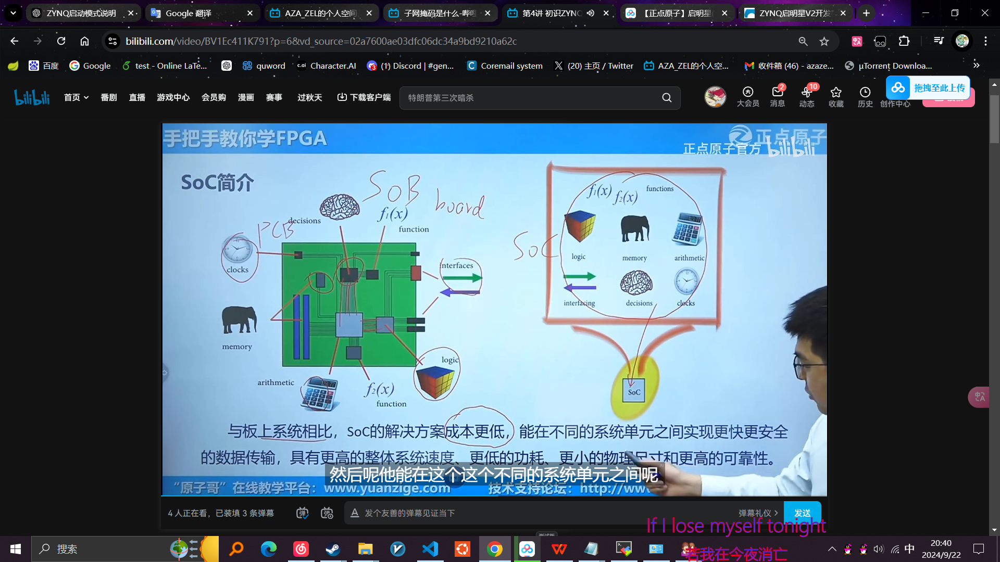

### Processing System (PS):
Zynq SoC的PS部分包含一个或多个 ARM 处理器内核、内存控制器、I/O接口（如USB、UART、I2C等），以及网络接口（网口）。
PS网口是处理系统内部的 Ethernet Controller，负责通过网线进行数据的收发，通常用于普通的网络通信，例如以太网连接。
#### PS网口的作用：
它允许Zynq SoC中的ARM处理器通过网络进行通信，比如访问互联网、局域网中的设备、传输数据等。
PS网口的配置与普通的网络接口类似，可以通过常见的 Linux 命令（如 ifconfig、ip）进行IP地址配置、状态查看等。
常见的使用场景包括与主机进行通信、远程登录（SSH）、数据流传输等。
#### PL（Programmable Logic）网口：
在对比下，Zynq中的 PL网口 是指通过可编程逻辑部分实现的自定义网络接口，通常用于特殊需求的网络加速、定制通信协议等。与PS网口不同，它需要开发者通过硬件描述语言（如VHDL或Verilog）来定义和实现。

PS和PL通过AXI协议(一种总线协议)互联.
#### PS网口
指的是 Processing System（PS）网络接口，这是在像 Xilinx Zynq SoC 这样的处理器架构中使用的术语。Zynq SoC 将可编程逻辑（PL，Programmable Logic）和处理系统（PS，Processing System）集成在同一块芯片上。

## ZYNQ简介

ZENC是基于arm硬盒(闭源,赛灵思的护城河)的SoC.
全可编程指的是拥有PS(硬件可编程)和PL(软件可编程).
### SoC简介

#### ASIC SoC
ASIC（Application-Specific Integrated Circuit）是一种**专用**集成电路，主要设计用于执行特定应用或任务。与通用集成电路（如 CPU、GPU）不同，ASIC 的设计目标是优化性能、功耗和面积，以满足特定需求。

通常用于执行特定的、重复性的任务，如信号处理、数据加密、视频编解码等。因此，它们在处理这些特定应用时比通用处理器更高效。

由于 ASIC 是为特定任务优化的，因此在执行该任务时，它们通常能提供比通用处理器更高的性能和更低的功耗。

ASIC 设计可以在**功耗**方面进行优化，特别适合对**能耗**敏感的应用，如移动设备、嵌入式系统和物联网设备。

一旦制造完成，ASIC 的功能是固定的，无法重新编程或更改，这与 FPGA（现场可编程门阵列）不同，后者可以在硬件层面上进行重新配置。

虽然 ASIC 在量产时的单个成本较低，但开发和制造 ASIC 的初始成本相对较高，因此通常只在大规模生产的应用中经济有效。
应用实例:
* 比特币挖矿：专为挖矿算法设计的 ASIC。
* 网络设备：用于处理特定网络协议的 ASIC。
* 消费电子：如智能手机中的图像处理器、视频编解码器等。
#### SOPC
system-on programable chip, 可编程片上系统, 其实就是FPGA(Field Programmable Gate Array,现场可编程门阵列.).
#### APSoC
All-Programable SoC, 全可编程片上系统, SOPC再加上类似arm盒来提供操作系统, 实现软件编程. 即ZYNQ.

### FPGA简介
Field Programmable Gate Array, 现场可编程门阵列. 是**数字电路**为主的集成电路芯片, 术语可编程逻辑芯片(Programmable Logic Device, PLD)的一种.

* 和单片机的对比:
单片机也是集成电路芯片, 是ASIC.

* 应用领域:
  * 通信领域. 中兴/华为.
  * 验证领域: 用FPGA进行IC原型验证, 降低ASIC流片失败风险. 
  * 图像处理领域. 海康威视
  * 人工智能领域: 硬件加速.
  * 汽车自动驾驶.
  * 赛灵思发明并且几乎垄断了高端FPGA.
  * 国产:紫光同创,安路科技,高云半导体,复旦微电子,智多晶,遨格芯,华微科技..

八个ff即类似DQ寄存器，可以寄存单个比特。
`CLB`即`可编程逻辑单元`.

