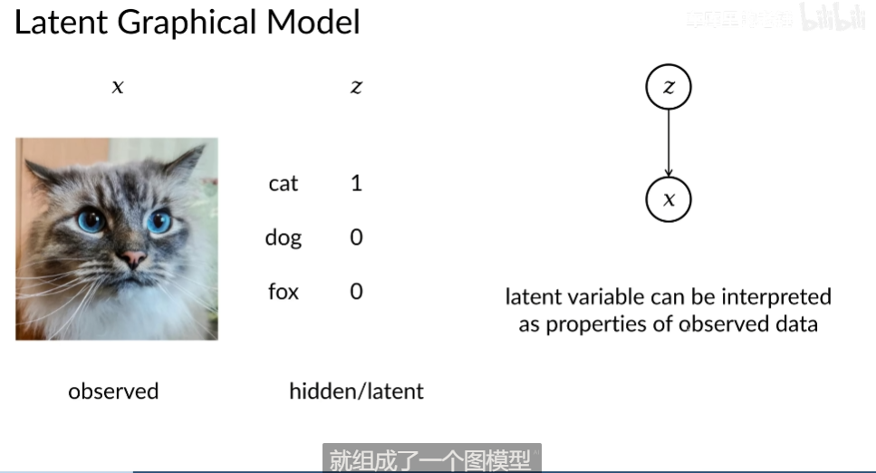

## 一个简单的神经网络例子.

### 简单神经网络例子：前向传播与反向传播

假设我们有一个非常简单的两层神经网络：

- **输入层** $x = (x_1, x_2)$
- **第一层**：有两个神经元，权重为 $W_1 = \begin{pmatrix} w_{11} & w_{12} \\ w_{21} & w_{22} \end{pmatrix}$，偏置为 $b_1 = (b_{11}, b_{12})$
- **输出层**：有一个神经元，权重为 $W_2 = (w_{31}, w_{32})$，偏置为 $b_2$

损失函数 $L$ 是均方误差（MSE），假设真实标签是 $y$，我们要最小化损失 $L = \frac{1}{2} (\hat{y} - y)^2$，其中 $\hat{y}$ 是网络的预测值。

### 1. 前向传播：

#### 输入层到第一层的计算：

假设输入是 $x = (x_1, x_2) = (1, 2)$，权重为：
$$
W_1 = \begin{pmatrix} 0.5 & -0.5 \\ 0.3 & 0.8 \end{pmatrix}, \quad b_1 = (0.1, -0.2)
$$

第一层的计算是：
$$
z_1 = W_1 \cdot x + b_1 = \begin{pmatrix} 0.5 & -0.5 \\ 0.3 & 0.8 \end{pmatrix} \cdot \begin{pmatrix} 1 \\ 2 \end{pmatrix} + \begin{pmatrix} 0.1 \\ -0.2 \end{pmatrix}
$$
$$
z_1 = \begin{pmatrix} 0.5 \cdot 1 + (-0.5) \cdot 2 + 0.1 \\ 0.3 \cdot 1 + 0.8 \cdot 2 - 0.2 \end{pmatrix} = \begin{pmatrix} -0.9 \\ 1.7 \end{pmatrix}
$$

然后应用激活函数（例如 ReLU）：
$$
a_1 = \text{ReLU}(z_1) = \begin{pmatrix} \max(0, -0.9) \\ \max(0, 1.7) \end{pmatrix} = \begin{pmatrix} 0 \\ 1.7 \end{pmatrix}
$$

#### 第一层到输出层的计算：

输出层的计算是：
$$
z_2 = W_2 \cdot a_1 + b_2 = (0.2, -0.4) \cdot \begin{pmatrix} 0 \\ 1.7 \end{pmatrix} + 0.5
$$
$$
z_2 = (0.2 \cdot 0 + (-0.4) \cdot 1.7) + 0.5 = -0.68 + 0.5 = -0.18
$$

然后应用激活函数（假设没有激活函数，即线性输出）：
$$
\hat{y} = -0.18
$$

#### 损失函数计算：

真实标签 $y = 1$，所以损失是：
$$
L = \frac{1}{2} (\hat{y} - y)^2 = \frac{1}{2} (-0.18 - 1)^2 = \frac{1}{2} (1.18)^2 = 0.697
$$

### 2. 反向传播：

现在我们需要计算损失函数 $L$ 对每个参数（如 $w_{11}, w_{12}, w_{31}$ 等）的偏导数。

#### 步骤1：计算输出层的梯度

首先，计算损失函数 $L$ 对输出 $\hat{y}$ 的导数：
$$
\frac{\partial L}{\partial \hat{y}} = \hat{y} - y = -0.18 - 1 = -1.18
$$

然后，计算损失对 $z_2$ 的导数（因为 $z_2$ 是计算 $\hat{y}$ 的输入）：
$$
\frac{\partial L}{\partial z_2} = \frac{\partial L}{\partial \hat{y}} \cdot \frac{\partial \hat{y}}{\partial z_2} = -1.18 \cdot 1 = -1.18
$$

计算损失对权重 $W_2$ 的梯度：
$$
\frac{\partial L}{\partial W_2} = \frac{\partial L}{\partial z_2} \cdot a_1^T = -1.18 \cdot \begin{pmatrix} 0 \\ 1.7 \end{pmatrix} = \begin{pmatrix} 0 \\ -2.006 \end{pmatrix}
$$

计算损失对偏置 $b_2$ 的梯度：
$$
\frac{\partial L}{\partial b_2} = \frac{\partial L}{\partial z_2} = -1.18
$$

#### 步骤2：计算第一层的梯度

我们需要计算第一层的梯度。首先，计算损失对 $a_1$ 的导数：
$$
\frac{\partial L}{\partial a_1} = W_2^T \cdot \frac{\partial L}{\partial z_2} = \begin{pmatrix} 0.2 \\ -0.4 \end{pmatrix} \cdot (-1.18) = \begin{pmatrix} -0.236 \\ 0.472 \end{pmatrix}
$$

然后，计算损失对 $z_1$ 的导数（因为 $z_1$ 是 $a_1$ 的输入）：
$$
\frac{\partial L}{\partial z_1} = \frac{\partial L}{\partial a_1} \cdot \frac{\partial a_1}{\partial z_1}
$$

因为我们使用的是 ReLU 激活函数，$\frac{\partial a_1}{\partial z_1}$ 会是 1 或 0。对于 $a_1 = \begin{pmatrix} 0 \\ 1.7 \end{pmatrix}$，我们有：
$$
\frac{\partial L}{\partial z_1} = \begin{pmatrix} 0 \\ 0.472 \end{pmatrix}
$$

计算损失对权重 $W_1$ 的梯度：
$$
\frac{\partial L}{\partial W_1} = \frac{\partial L}{\partial z_1} \cdot x^T
$$

假设输入 $x = \begin{pmatrix} 1 \\ 2 \end{pmatrix}$，那么：
$$
\frac{\partial L}{\partial W_1} = \begin{pmatrix} 0 \\ 0.472 \end{pmatrix} \cdot \begin{pmatrix} 1 & 2 \end{pmatrix} = \begin{pmatrix} 0 & 0 \\ 0.472 & 0.944 \end{pmatrix}
$$

计算损失对偏置 $b_1$ 的梯度：
$$
\frac{\partial L}{\partial b_1} = \frac{\partial L}{\partial z_1} = \begin{pmatrix} 0 \\ 0.472 \end{pmatrix}
$$

### 3. 更新参数：

根据计算的梯度，可以使用梯度下降法来更新参数：
$$
W_1 \leftarrow W_1 - \alpha \cdot \frac{\partial L}{\partial W_1}, \quad W_2 \leftarrow W_2 - \alpha \cdot \frac{\partial L}{\partial W_2}, \quad b_1 \leftarrow b_1 - \alpha \cdot \frac{\partial L}{\partial b_1}, \quad b_2 \leftarrow b_2 - \alpha \cdot \frac{\partial L}{\partial b_2}
$$

## 归一化层

### **1\. 什么是 batch？**

在神经网络训练中，我们通常不会一次性输入整个数据集，而是**分批（batch）输入**，这样可以提高计算效率，并利用梯度下降优化参数。

#### **举个例子**

假设你有一个 10000 张图片的数据集：

-   **全数据（全部样本）训练**：把 10000 张图片一次性输入神经网络进行训练，这会导致内存消耗过大。
-   **小批量（mini-batch）训练**：把数据集拆分成多个小批次，比如每次输入 32 张图片（batch size = 32）。
-   **单样本（stochastic）训练**：每次只输入 1 张图片（batch size = 1）。

batch 就是**一次输入神经网络的一组样本**，例如：

-   如果 batch size = 32，表示**每次训练输入 32 张图片**。
-   如果 batch size = 64，表示**每次训练输入 64 张图片**。

batch 主要用于：

1.  **减少内存占用**，避免一次性处理整个数据集。
2.  **加速梯度计算**，因为 mini-batch 计算均值和梯度更加稳定。
3.  **提高优化器的效果**，像 SGD（随机梯度下降）在 mini-batch 里计算梯度时更加高效。

* * *

### **2\. 什么是归一化层？（Normalization Layer）**

归一化（Normalization）就是对输入数据进行标准化，使其数值分布更加均匀，从而**加速收敛，提高泛化能力**。

#### **2.1 为什么要归一化？**

神经网络训练时，输入的数据如果数值范围相差太大，网络容易出现以下问题：

-   **梯度消失/梯度爆炸**：如果输入数据过大或过小，经过多个层传递后，梯度可能会变得很小（学习变慢）或很大（不稳定）。
-   **训练不稳定**：不同层之间的数值分布变化过大，导致训练时权重更新不均衡。

归一化层的作用是：

1.  **调整数据分布**，让输入数据均值接近 0，方差接近 1，避免梯度问题。
2.  **加速收敛**，让训练更快、更稳定。
3.  **减少对初始化的敏感性**，让神经网络更容易训练。

* * *

### **3\. 归一化层的几种类型**

归一化层的核心思想是**对输入数据进行标准化**，常见的归一化方法有：

1.  **Batch Normalization（BN）**（按 batch 归一化）
2.  **Instance Normalization（IN）**（按单个样本归一化）
3.  **Layer Normalization（LN）**（按特征层归一化）
4.  **Group Normalization（GN）**（按多个通道归一化）

#### **3.1 Batch Normalization（BN，批量归一化）**

**归一化范围**：在一个 batch 里的**相同通道上**计算均值和标准差。

假设 batch size = 32，每个样本是 3 通道（RGB）的 32×32 图片：

-   计算**整个 batch 里的每个通道**的均值和标准差。
-   **所有样本在同一个通道上的数值会一起归一化**。

##### **数学公式**

给定某个 batch 的输入 xn,c,h,wx\_{n,c,h,w}xn,c,h,w​，它表示：

-   第 nnn 个样本（batch size 内）
-   第 ccc 个通道（如 RGB 的 R 通道）
-   高度 hhh，宽度 www

BN 计算公式：

1.  **计算均值和标准差（在 batch 维度上计算）**
    $$
    μc\=1N⋅H⋅W∑n\=1N∑h\=1H∑w\=1Wxn,c,h,w\\mu\_c = \\frac{1}{N \\cdot H \\cdot W} \\sum\_{n=1}^{N} \\sum\_{h=1}^{H} \\sum\_{w=1}^{W} x\_{n,c,h,w}μc​\=N⋅H⋅W1​n\=1∑N​h\=1∑H​w\=1∑W​xn,c,h,w​ σc2\=1N⋅H⋅W∑n\=1N∑h\=1H∑w\=1W(xn,c,h,w−μc)2\\sigma\_c^2 = \\frac{1}{N \\cdot H \\cdot W} \\sum\_{n=1}^{N} \\sum\_{h=1}^{H} \\sum\_{w=1}^{W} (x\_{n,c,h,w} - \\mu\_c)^2σc2​\=N⋅H⋅W1​n\=1∑N​h\=1∑H​w\=1∑W​(xn,c,h,w​−μc​)2
    $$
    -   **计算整个 batch 的某个通道的均值和方差**，让同一通道的所有样本归一化。
2.  **归一化**
    
    x^n,c,h,w\=xn,c,h,w−μcσc2+ϵ\\hat{x}\_{n,c,h,w} = \\frac{x\_{n,c,h,w} - \\mu\_c}{\\sqrt{\\sigma\_c^2 + \\epsilon}}x^n,c,h,w​\=σc2​+ϵ​xn,c,h,w​−μc​​
3.  **加入可训练参数**
    
    yn,c,h,w\=γcx^n,c,h,w+βcy\_{n,c,h,w} = \\gamma\_c \\hat{x}\_{n,c,h,w} + \\beta\_cyn,c,h,w​\=γc​x^n,c,h,w​+βc​
    -   γc\\gamma\_cγc​ 和 βc\\beta\_cβc​ 是**可训练参数**，用于调整归一化后的数据。

**特点**：

-   适用于大 batch 训练（batch size 越小，均值和标准差计算越不稳定）。
-   用于 CNN 任务，如分类、检测等。

* * *

#### **3.2 Instance Normalization（IN，实例归一化）**

**归一化范围**：对**单个样本的每个通道**计算均值和标准差，而**不考虑 batch 之间的关系**。

##### **数学公式**

1.  **计算均值和标准差（在单个样本内的单个通道计算）**
    
    μn,c\=1H⋅W∑h\=1H∑w\=1Wxn,c,h,w\\mu\_{n,c} = \\frac{1}{H \\cdot W} \\sum\_{h=1}^{H} \\sum\_{w=1}^{W} x\_{n,c,h,w}μn,c​\=H⋅W1​h\=1∑H​w\=1∑W​xn,c,h,w​ σn,c2\=1H⋅W∑h\=1H∑w\=1W(xn,c,h,w−μn,c)2\\sigma\_{n,c}^2 = \\frac{1}{H \\cdot W} \\sum\_{h=1}^{H} \\sum\_{w=1}^{W} (x\_{n,c,h,w} - \\mu\_{n,c})^2σn,c2​\=H⋅W1​h\=1∑H​w\=1∑W​(xn,c,h,w​−μn,c​)2
2.  **归一化**
    
    x^n,c,h,w\=xn,c,h,w−μn,cσn,c2+ϵ\\hat{x}\_{n,c,h,w} = \\frac{x\_{n,c,h,w} - \\mu\_{n,c}}{\\sqrt{\\sigma\_{n,c}^2 + \\epsilon}}x^n,c,h,w​\=σn,c2​+ϵ​xn,c,h,w​−μn,c​​
3.  **加入可训练参数**
    
    yn,c,h,w\=γcx^n,c,h,w+βcy\_{n,c,h,w} = \\gamma\_c \\hat{x}\_{n,c,h,w} + \\beta\_cyn,c,h,w​\=γc​x^n,c,h,w​+βc​

**特点**：

-   适用于风格迁移、医学图像等任务。
-   不受 batch size 影响。

# 神经网络的各种层

## 上采样 upsampling
指的是把低分辨率的数据转换为高分辨率的数据，在计算机视觉中主要用于恢复图像细节、提高分辨率。上采样通常在解码器（Decoder）或者生成模型（如 GAN）中使用，以便从小的特征图生成大尺寸的输出。
事实上**上采样**和**下采样**都可以归为图像的**重采样resample**.

常见的上采样方法:

- **插值interpolation**

    插值层一般没有可学习的参数. 是固定的生成.
  - **最近邻插值（Nearest Neighbor Interpolation）**：复制最近的像素值。
  - **双线性/双三次插值（Bilinear/Bicubic Interpolation）**：使用加权平均法插值。

- **转置卷积（Transpose Convolution，或反卷积）**：学习一个**可训练的卷积核**，用于恢复空间尺寸。

### 反卷积数学实现:

---

### **(2) 3D 逆卷积（Transpose Convolution）的数学计算**
在**转置卷积**中，我们希望执行卷积的**逆操作**，从 \( Y \) 反推 \( X \)。

其实就是有一个2\*2卷积核, 它对(比如说2\*2大小的)input每个像素进行逆卷积(也就是卷积核每个元素都和这个input元素相乘, 得到一个2\*2的逆卷积结果. 然后这些2\*2的逆卷积结果拼起来得到3\*3的输出.) 我们可以看到这个过程反过来就是卷积.

---

# 时间序列分析

## 自回归过程 ARP

> "假设当前数据点用过去数据点的线性组合估计未来."

### AutoRegressive Process (AR)

#### 定义：
一个 p 阶 AR 过程（AR(p)）的表达式：
$$
Y_t = \mu + \sum_{i=1}^{p} \phi_i Y_{t-i} + u_t
$$
- $\mu$: 常数项 (Constant)
- $Y_{t-i}$: 过去时间的数据点
- $\phi_i$: 自回归系数
- $u_t$: 噪声项，通常假设服从 **零均值正态分布** ~$N(0, \sigma^2)$

---

### 例子：天气预测
假设**过去几天的气温**为 \( Y_t \)，
如果我们使用 **二阶 AR 模型 (AR(2))**，则：
$$
Y_t = \mu + \sum_{i=1}^{2} \phi_i Y_{t-i} + U_t
$$

---

### 训练过程：
1. 每天多次拟合一次（或者使用过往数据）。
2. 可以选择简单的损失函数 最小化均方误差（MSE）：
$$
\sum ( \hat{Y} - Y )^2
$$

# 变分推理

这是从物理学中的`变分`概念得到的. 即让一个函数去逼近另一个函数, 在数学上是同一件事: 是自变量为函数的求最小值问题(泛函问题). 我们一点一点解释...

### 1.隐变量图模型:
首先解释一下隐变量(隐变量图模型).
隐变量就是(计算机)无法直接观测的变量. 比如如下场景:
有很多小动物图片向量x. 它们所属于的动物物种看作onehot特征向量z, 则是隐变量: 必须训练一个好的分类器来得到x->z.

x为输入图片(被观测变量); z为表示分类的onehot向量(类别为猫). 它是隐变量(无法直接`观测`到, 需要从被观测变量x中推理.). 于是z和x组成`隐变量图模型`.

又或者:
假设你是一个视频网站的用户，平台希望给你推荐新电影。
观测变量x: 你看过的电影、评分。
隐变量z: 你的兴趣类别，比如你更喜欢科幻片还是喜剧片？

一般, 隐变量的分布p(z)没有办法直很容易直接得到.

更加复杂的现实情况:

### 2.**高斯混合模型（GMM）**
>把这K个高斯分布换成其他复杂的由几个参数决定的分布的线性组合, 便称为更普遍的混合变分模型.

我们有很多数据点(简单起见,一维数值.), 假设它们是从好几个高斯分布$N_1(μ_1,σ_1^2), N_2(μ_2,σ_2^2), N_3(μ_3,σ_3^2),...,N_K(μ_K,σK^2)$中抽取出来的, 但是我们不知道具体$x_i$是哪个分布出来的. 
或者说, 不知道p(z). 即任意一个点是从z=i个高斯分布中来的概率.
于是我们可以认为每个点来自的高斯分布序号是个**隐变量z**, z=1,2,3...

于是, 由全概率公式,

$p(x)=\sum_{z=1}^K​ p(x∣z)p(z)$

令z=i的概率$p(i) = \pi_i$, 则有:

$p(x)=\sum_{z=1}^K​ p(x∣z)\pi_i$

$\pi_i$是第i个高斯分布$N_i$的权重系数. 于是p(x)被表示为多个高斯分布的线性组合. 

>开始训练!

现在只需要选个损失函数开始训练, 学习$\pi_i$这些权重系数, 最后得到一组$\pi_i$, 即得到了p(z)这个隐变量分布.

**↓↓几种概率解释**:
---
**后验概率**: $p(z|x)=\frac{p(x,z)}{p(x)} = \frac{p(x|z)p(z)}{p(x)}$, 是x的函数.

即"得到特定图像x后, 它属于哪种类别小动物的概率". 

__这正是图像处理中我们最终想要的东西.__

---
**先验概率**: 即$p(z)$.

它即为"各种类别小动物在整个图片库中的分布", 也是我们要学习的一组参数.

---
**联合分布**: 即$p(x,z)$.

### 2.自编码器, AE, autoencoder
它主要包含两个部分: 
    **编码器 encoder** 
        将输入数据x(图片向量)映射到一个低维隐空间Z(图片的种类onehot空间). 即: $z=f_{enc}(x), Z->X$
    **解码器 decoder**
        从隐空间Z中恢复出一个输入数据x'. 即: 即: $x=f_{dec}(z), X->Z$

损失函数一般选择**最小化重构误差**: 
$L = ||x−x′||^2$

### 3.变分自编码器, VAE, variational autoencoder
普通的AE的隐变量z没有**概率分布的约束**.

**VAE:**
* 强制隐变量z的后验分布$p(z|x)$服从一个分布$q_{\phi}(z|x)$, 而不是简单的定值. (一般是标准正态分布)
* 然后用变分推理来学习𝑧的概率分布, 而不是直接学习一个固定的隐变量z(x)。

即: 学习那个分布$q_{\phi}(z|x)$的参数φ. 

比如可以让$q_{\phi}(z|x) = N(\mu(\phi), σ^2(\phi))$, 其中$μ(φ)$可简单取: $μ(φ)=φ$, 

于是$q_{\phi}(z|x)$就是一个包含参数φ的分布了.

---
于是:

**VAE**的**encoder**输出不再是一个z, 而是一个z的概率分布$q_(z|x)$.
然后从这个分布中随机采样一个z, 放入解码器:
$x'=f_{dec}(z)$

VAE的损失函数称为**变分下界Evidence Lower Bound**:

$ELBO = L=L_{recon} + L-{KL}$.
* $L_{recon}$为重构损失. 让x'尽可能接近x
* $L_{KL}$为KL散度. 让后验分布$q_{\phi}(z|x)$接近真实后验分布分布.

#### **1. ELBO 的来源**
在概率建模中，我们通常想找到一个**最可能解释数据**的模型，也就是最大化**对数边缘似然 (log marginal likelihood)**：
$$
\log p(x)
$$
但这个公式通常**难以直接计算**，因为：
$$
p(x) = \int p(x, z) dz = \int p(x | z) p(z) dz
$$
这里的积分在高维空间上可能很难求解，因此我们**无法直接优化** \( \log p(x) \)。

于是，我们引入一个**近似分布 \( q_{\phi}(z | x) \)** 来逼近真实的后验分布 \( p(z | x) \)，并利用**变分推理**来优化它。

---

#### **2. ELBO 的推导**
我们从对数边缘似然开始：
$$
\log p(x) = \log \int p(x, z) dz
$$
在这个公式中，我们加上一个辅助的**近似后验分布** \( q_{\phi}(z | x) \) 并重写：
$$
\log p(x) = \log \int q_{\phi}(z | x) \frac{p(x, z)}{q_{\phi}(z | x)} dz
$$
利用 Jensen’s Inequality（Jensen 不等式），我们得到：
$$
\log p(x) \geq \mathbb{E}_{q_{\phi}(z | x)} \left[ \log p(x, z) - \log q_{\phi}(z | x) \right]
$$
这个不等式右侧的部分就是**ELBO（变分下界）**：
$$
\text{ELBO} = \mathbb{E}_{q_{\phi}(z | x)} [\log p(x | z)] - D_{\text{KL}}(q_{\phi}(z | x) || p(z))
$$

---

#### **3. ELBO 直观理解**
ELBO 由两项组成：
1. **重构误差**：
   $$
   \mathbb{E}_{q_{\phi}(z | x)} [\log p(x | z)]
   $$
   - 这个项衡量 \( z \) 生成的 \( x \) 有多接近原始数据，类似 VAE 的重构损失。

2. **KL 散度**：
   $$
   D_{\text{KL}}(q_{\phi}(z | x) || p(z))
   $$
   - 这个项让近似后验 \( q_{\phi}(z | x) \) 逼近先验 \( p(z) \)，防止隐变量 \( z \) 变得太自由（避免 overfitting）。

最终，**优化 ELBO 既可以让 VAE 生成的数据更逼近真实数据，又能保持 \( z \) 具有良好的先验分布**。

---

#### **4. ELBO 在扩散模型中的作用**
虽然扩散模型不像 VAE 那样显式地引入隐变量 \( z \)，但它也用到了类似的 ELBO 公式：
$$
L = \mathbb{E}_{q(x_t | x_0)} \left[ \log p(x_0 | x_t) \right] - D_{\text{KL}}(q(x_T) \parallel p(x_T))
$$
这里：
- \( q(x_t | x_0) \) 是加噪过程，相当于变分推理中的近似分布 \( q_{\phi}(z | x) \)。
- \( p(x_0 | x_t) \) 是去噪网络的估计，相当于 VAE 中的解码器 \( p_{\theta}(x | z) \)。
- KL 散度项保证了模型学习的逆扩散过程符合数据分布。

所以，**ELBO 在 VAE 和扩散模型中都扮演了优化目标的角色，只是方式不同**。

## DDPM, 去噪扩散概率模型, 扩散模型.

##
