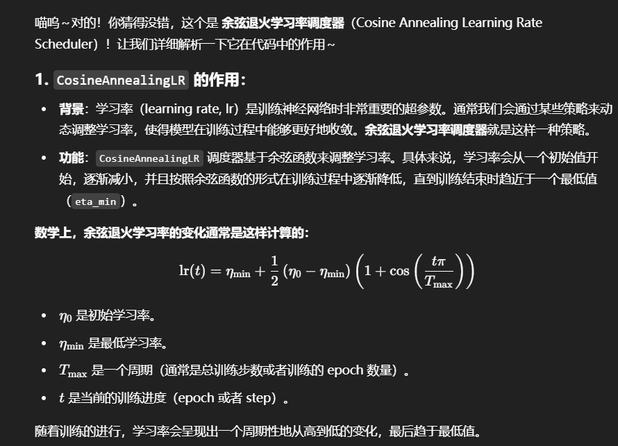
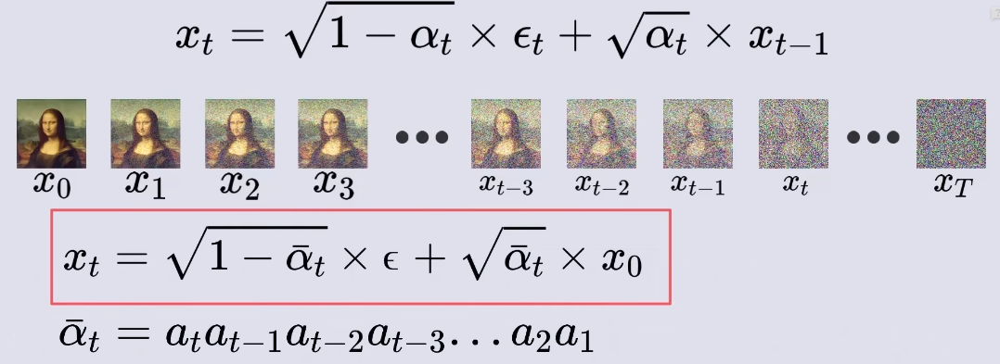
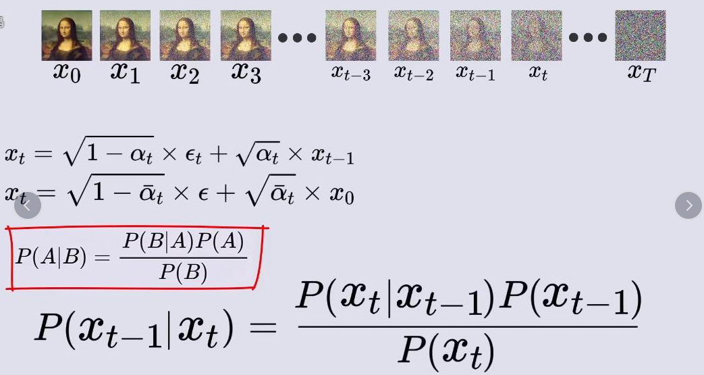
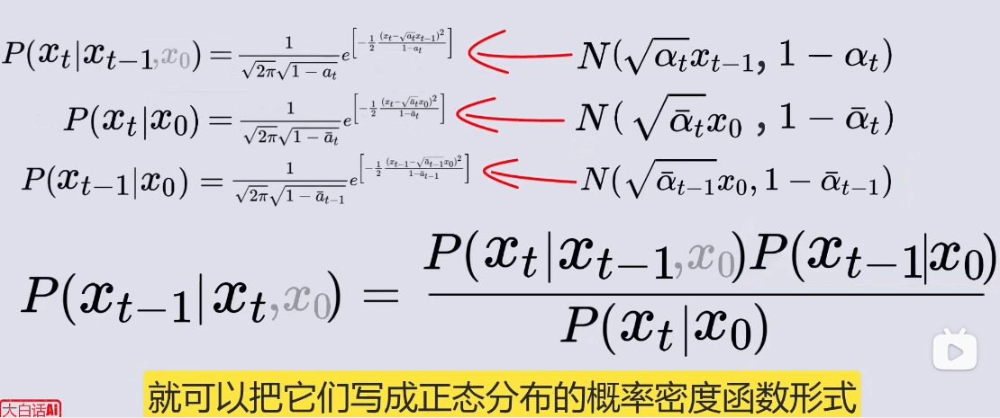
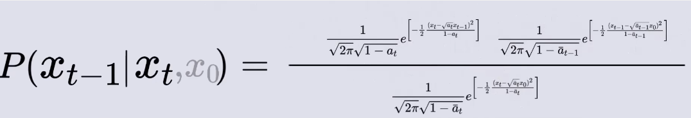
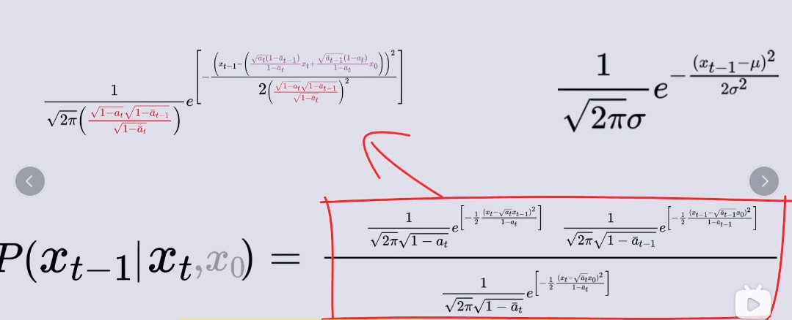
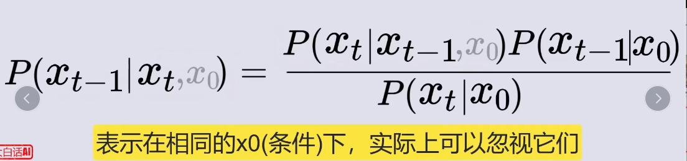
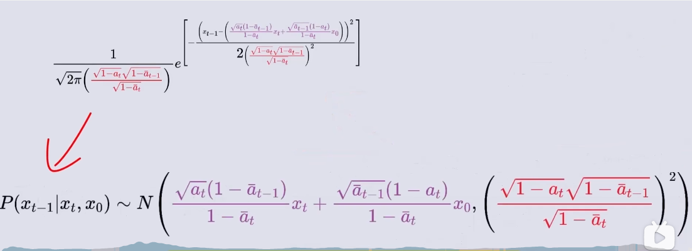
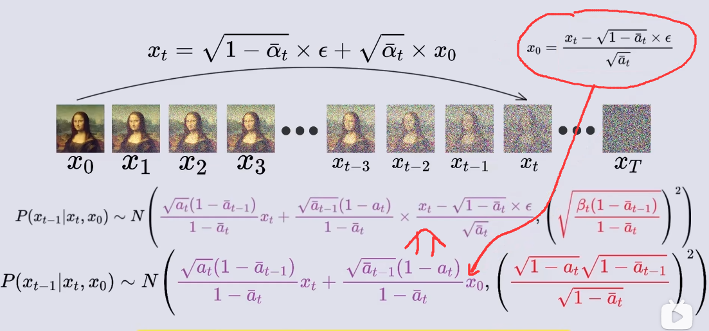

# 0.搭建简单的神经网络
## 1.1一个简单的神经网络例子.

### 简单神经网络例子：前向传播与反向传播

假设我们有一个非常简单的两层神经网络：

- **输入层** $x = (x_1, x_2)$
- **第一层**：有两个神经元，权重为 $W_1 = \begin{pmatrix} w_{11} & w_{12} \\ w_{21} & w_{22} \end{pmatrix}$，偏置为 $b_1 = (b_{11}, b_{12})$
- **输出层**：有一个神经元，权重为 $W_2 = (w_{31}, w_{32})$，偏置为 $b_2$

损失函数 $L$ 是均方误差（MSE），假设真实标签是 $y$，我们要最小化损失 $L = \frac{1}{2} (\hat{y} - y)^2$，其中 $\hat{y}$ 是网络的预测值。

### 1. 前向传播：

#### 输入层到第一层的计算：

假设输入是 $x = (x_1, x_2) = (1, 2)$，权重为：
$$
W_1 = \begin{pmatrix} 0.5 & -0.5 \\ 0.3 & 0.8 \end{pmatrix}, \quad b_1 = (0.1, -0.2)
$$

第一层的计算是：
$$
z_1 = W_1 \cdot x + b_1 = \begin{pmatrix} 0.5 & -0.5 \\ 0.3 & 0.8 \end{pmatrix} \cdot \begin{pmatrix} 1 \\ 2 \end{pmatrix} + \begin{pmatrix} 0.1 \\ -0.2 \end{pmatrix}
$$
$$
z_1 = \begin{pmatrix} 0.5 \cdot 1 + (-0.5) \cdot 2 + 0.1 \\ 0.3 \cdot 1 + 0.8 \cdot 2 - 0.2 \end{pmatrix} = \begin{pmatrix} -0.9 \\ 1.7 \end{pmatrix}
$$

然后应用激活函数（例如 ReLU）：
$$
a_1 = \text{ReLU}(z_1) = \begin{pmatrix} \max(0, -0.9) \\ \max(0, 1.7) \end{pmatrix} = \begin{pmatrix} 0 \\ 1.7 \end{pmatrix}
$$

#### 第一层到输出层的计算：

输出层的计算是：
$$
z_2 = W_2 \cdot a_1 + b_2 = (0.2, -0.4) \cdot \begin{pmatrix} 0 \\ 1.7 \end{pmatrix} + 0.5
$$
$$
z_2 = (0.2 \cdot 0 + (-0.4) \cdot 1.7) + 0.5 = -0.68 + 0.5 = -0.18
$$

然后应用激活函数（假设没有激活函数，即线性输出）：
$$
\hat{y} = -0.18
$$

#### 损失函数计算：

真实标签 $y = 1$，所以损失是：
$$
L = \frac{1}{2} (\hat{y} - y)^2 = \frac{1}{2} (-0.18 - 1)^2 = \frac{1}{2} (1.18)^2 = 0.697
$$

### 2. 反向传播：

现在我们需要计算损失函数 $L$ 对每个参数（如 $w_{11}, w_{12}, w_{31}$ 等）的偏导数。

#### 步骤1：计算输出层的梯度

首先，计算损失函数 $L$ 对输出 $\hat{y}$ 的导数：
$$
\frac{\partial L}{\partial \hat{y}} = \hat{y} - y = -0.18 - 1 = -1.18
$$

然后，计算损失对 $z_2$ 的导数（因为 $z_2$ 是计算 $\hat{y}$ 的输入）：
$$
\frac{\partial L}{\partial z_2} = \frac{\partial L}{\partial \hat{y}} \cdot \frac{\partial \hat{y}}{\partial z_2} = -1.18 \cdot 1 = -1.18
$$

计算损失对权重 $W_2$ 的梯度：
$$
\frac{\partial L}{\partial W_2} = \frac{\partial L}{\partial z_2} \cdot a_1^T = -1.18 \cdot \begin{pmatrix} 0 \\ 1.7 \end{pmatrix} = \begin{pmatrix} 0 \\ -2.006 \end{pmatrix}
$$

计算损失对偏置 $b_2$ 的梯度：
$$
\frac{\partial L}{\partial b_2} = \frac{\partial L}{\partial z_2} = -1.18
$$

#### 步骤2：计算第一层的梯度

我们需要计算第一层的梯度。首先，计算损失对 $a_1$ 的导数：
$$
\frac{\partial L}{\partial a_1} = W_2^T \cdot \frac{\partial L}{\partial z_2} = \begin{pmatrix} 0.2 \\ -0.4 \end{pmatrix} \cdot (-1.18) = \begin{pmatrix} -0.236 \\ 0.472 \end{pmatrix}
$$

然后，计算损失对 $z_1$ 的导数（因为 $z_1$ 是 $a_1$ 的输入）：
$$
\frac{\partial L}{\partial z_1} = \frac{\partial L}{\partial a_1} \cdot \frac{\partial a_1}{\partial z_1}
$$

因为我们使用的是 ReLU 激活函数，$\frac{\partial a_1}{\partial z_1}$ 会是 1 或 0。对于 $a_1 = \begin{pmatrix} 0 \\ 1.7 \end{pmatrix}$，我们有：
$$
\frac{\partial L}{\partial z_1} = \begin{pmatrix} 0 \\ 0.472 \end{pmatrix}
$$

计算损失对权重 $W_1$ 的梯度：
$$
\frac{\partial L}{\partial W_1} = \frac{\partial L}{\partial z_1} \cdot x^T
$$

假设输入 $x = \begin{pmatrix} 1 \\ 2 \end{pmatrix}$，那么：
$$
\frac{\partial L}{\partial W_1} = \begin{pmatrix} 0 \\ 0.472 \end{pmatrix} \cdot \begin{pmatrix} 1 & 2 \end{pmatrix} = \begin{pmatrix} 0 & 0 \\ 0.472 & 0.944 \end{pmatrix}
$$

计算损失对偏置 $b_1$ 的梯度：
$$
\frac{\partial L}{\partial b_1} = \frac{\partial L}{\partial z_1} = \begin{pmatrix} 0 \\ 0.472 \end{pmatrix}
$$

### 3. 更新参数：

根据计算的梯度，可以使用梯度下降法来更新参数：
$$
W_1 \leftarrow W_1 - \alpha \cdot \frac{\partial L}{\partial W_1}, \quad W_2 \leftarrow W_2 - \alpha \cdot \frac{\partial L}{\partial W_2}, \quad b_1 \leftarrow b_1 - \alpha \cdot \frac{\partial L}{\partial b_1}, \quad b_2 \leftarrow b_2 - \alpha \cdot \frac{\partial L}{\partial b_2}
$$

## 1.2归一化层

### **1\. 什么是 batch？**

在神经网络训练中，我们通常不会一次性输入整个数据集，而是**分批（batch）输入**，这样可以提高计算效率，并利用梯度下降优化参数。

#### **举个例子**

假设你有一个 10000 张图片的数据集：

-   **全数据（全部样本）训练**：把 10000 张图片一次性输入神经网络进行训练，这会导致内存消耗过大。
-   **小批量（mini-batch）训练**：把数据集拆分成多个小批次，比如每次输入 32 张图片（batch size = 32）。
-   **单样本（stochastic）训练**：每次只输入 1 张图片（batch size = 1）。

batch 就是**一次输入神经网络的一组样本**，例如：

-   如果 batch size = 32，表示**每次训练输入 32 张图片**。
-   如果 batch size = 64，表示**每次训练输入 64 张图片**。

batch 主要用于：

1.  **减少内存占用**，避免一次性处理整个数据集。
2.  **加速梯度计算**，因为 mini-batch 计算均值和梯度更加稳定。
3.  **提高优化器的效果**，像 SGD（随机梯度下降）在 mini-batch 里计算梯度时更加高效。

* * *

### **2\. 什么是归一化层？（Normalization Layer）**

归一化（Normalization）就是对输入数据进行标准化，使其数值分布更加均匀，从而**加速收敛，提高泛化能力**。

#### **2.1 为什么要归一化？**

神经网络训练时，输入的数据如果数值范围相差太大，网络容易出现以下问题：

-   **梯度消失/梯度爆炸**：如果输入数据过大或过小，经过多个层传递后，梯度可能会变得很小（学习变慢）或很大（不稳定）。
-   **训练不稳定**：不同层之间的数值分布变化过大，导致训练时权重更新不均衡。

归一化层的作用是：

1.  **调整数据分布**，让输入数据均值接近 0，方差接近 1，避免梯度问题。
2.  **加速收敛**，让训练更快、更稳定。
3.  **减少对初始化的敏感性**，让神经网络更容易训练。

* * *

### **3\. 归一化层的几种类型**

归一化层的核心思想是**对输入数据进行标准化**，常见的归一化方法有：

1.  **Batch Normalization（BN）**（按 batch 归一化）
2.  **Instance Normalization（IN）**（按单个样本归一化）
3.  **Layer Normalization（LN）**（按特征层归一化）
4.  **Group Normalization（GN）**（按多个通道归一化）

#### **3.1 Batch Normalization（BN，批量归一化）**

**归一化范围**：在一个 batch 里的**相同通道上**计算均值和标准差。

假设 batch size = 32，每个样本是 3 通道（RGB）的 32×32 图片：

-   计算**整个 batch 里的每个通道**的均值和标准差。
-   **所有样本在同一个通道上的数值会一起归一化**。

##### **数学公式**

给定某个 batch 的输入 xn,c,h,wx\_{n,c,h,w}xn,c,h,w​，它表示：

-   第 nnn 个样本（batch size 内）
-   第 ccc 个通道（如 RGB 的 R 通道）
-   高度 hhh，宽度 www

BN 计算公式：

1.  **计算均值和标准差（在 batch 维度上计算）**
    $$
    μc\=1N⋅H⋅W∑n\=1N∑h\=1H∑w\=1Wxn,c,h,w\\mu\_c = \\frac{1}{N \\cdot H \\cdot W} \\sum\_{n=1}^{N} \\sum\_{h=1}^{H} \\sum\_{w=1}^{W} x\_{n,c,h,w}μc​\=N⋅H⋅W1​n\=1∑N​h\=1∑H​w\=1∑W​xn,c,h,w​ σc2\=1N⋅H⋅W∑n\=1N∑h\=1H∑w\=1W(xn,c,h,w−μc)2\\sigma\_c^2 = \\frac{1}{N \\cdot H \\cdot W} \\sum\_{n=1}^{N} \\sum\_{h=1}^{H} \\sum\_{w=1}^{W} (x\_{n,c,h,w} - \\mu\_c)^2σc2​\=N⋅H⋅W1​n\=1∑N​h\=1∑H​w\=1∑W​(xn,c,h,w​−μc​)2
    $$
    -   **计算整个 batch 的某个通道的均值和方差**，让同一通道的所有样本归一化。
2.  **归一化**
    
    x^n,c,h,w\=xn,c,h,w−μcσc2+ϵ\\hat{x}\_{n,c,h,w} = \\frac{x\_{n,c,h,w} - \\mu\_c}{\\sqrt{\\sigma\_c^2 + \\epsilon}}x^n,c,h,w​\=σc2​+ϵ​xn,c,h,w​−μc​​
3.  **加入可训练参数**
    
    yn,c,h,w\=γcx^n,c,h,w+βcy\_{n,c,h,w} = \\gamma\_c \\hat{x}\_{n,c,h,w} + \\beta\_cyn,c,h,w​\=γc​x^n,c,h,w​+βc​
    -   γc\\gamma\_cγc​ 和 βc\\beta\_cβc​ 是**可训练参数**，用于调整归一化后的数据。

**特点**：

-   适用于大 batch 训练（batch size 越小，均值和标准差计算越不稳定）。
-   用于 CNN 任务，如分类、检测等。

* * *

#### **3.2 Instance Normalization（IN，实例归一化）**

**归一化范围**：对**单个样本的每个通道**计算均值和标准差，而**不考虑 batch 之间的关系**。

##### **数学公式**

1.  **计算均值和标准差（在单个样本内的单个通道计算）**
    
    μn,c\=1H⋅W∑h\=1H∑w\=1Wxn,c,h,w\\mu\_{n,c} = \\frac{1}{H \\cdot W} \\sum\_{h=1}^{H} \\sum\_{w=1}^{W} x\_{n,c,h,w}μn,c​\=H⋅W1​h\=1∑H​w\=1∑W​xn,c,h,w​ σn,c2\=1H⋅W∑h\=1H∑w\=1W(xn,c,h,w−μn,c)2\\sigma\_{n,c}^2 = \\frac{1}{H \\cdot W} \\sum\_{h=1}^{H} \\sum\_{w=1}^{W} (x\_{n,c,h,w} - \\mu\_{n,c})^2σn,c2​\=H⋅W1​h\=1∑H​w\=1∑W​(xn,c,h,w​−μn,c​)2
2.  **归一化**
    
    x^n,c,h,w\=xn,c,h,w−μn,cσn,c2+ϵ\\hat{x}\_{n,c,h,w} = \\frac{x\_{n,c,h,w} - \\mu\_{n,c}}{\\sqrt{\\sigma\_{n,c}^2 + \\epsilon}}x^n,c,h,w​\=σn,c2​+ϵ​xn,c,h,w​−μn,c​​
3.  **加入可训练参数**
    
    yn,c,h,w\=γcx^n,c,h,w+βcy\_{n,c,h,w} = \\gamma\_c \\hat{x}\_{n,c,h,w} + \\beta\_cyn,c,h,w​\=γc​x^n,c,h,w​+βc​

**特点**：

-   适用于风格迁移、医学图像等任务。
-   不受 batch size 影响。

# 1.一些术语

学习率策略:

# 2.神经网络的各种层

## 上采样 upsampling
指的是把低分辨率的数据转换为高分辨率的数据，在计算机视觉中主要用于恢复图像细节、提高分辨率。上采样通常在解码器（Decoder）或者生成模型（如 GAN）中使用，以便从小的特征图生成大尺寸的输出。
事实上**上采样**和**下采样**都可以归为图像的**重采样resample**.

常见的上采样方法:

- **插值interpolation**

    插值层一般没有可学习的参数. 是固定的生成.
  - **最近邻插值（Nearest Neighbor Interpolation）**：复制最近的像素值。
  - **双线性/双三次插值（Bilinear/Bicubic Interpolation）**：使用加权平均法插值。

- **转置卷积（Transpose Convolution，或反卷积）**：学习一个**可训练的卷积核**，用于恢复空间尺寸。

### 反卷积数学实现:

---

### **(2) 3D 逆卷积（Transpose Convolution）的数学计算**
在**转置卷积**中，我们希望执行卷积的**逆操作**，从 \( Y \) 反推 \( X \)。

其实就是有一个2\*2卷积核, 它对(比如说2\*2大小的)input每个像素进行逆卷积(也就是卷积核每个元素都和这个input元素相乘, 得到一个2\*2的逆卷积结果. 然后这些2\*2的逆卷积结果拼起来得到3\*3的输出.) 我们可以看到这个过程反过来就是卷积.

---

# 3.时间序列分析

## 3.1自回归过程 AutoRegressive Process, ARP

> "假设当前数据点用过去数据点的线性组合估计未来."
#### 定义：
一个 p 阶 AR 过程（AR(p)）的表达式：
$$
Y_t = \mu + \sum_{i=1}^{p} \phi_i Y_{t-i} + u_t
$$
- $\mu$: 常数项 (Constant)
- $Y_{t-i}$: 过去时间的数据点
- $\phi_i$: 自回归系数
- $u_t$: 噪声项，通常假设服从 **零均值正态分布** ~$N(0, \sigma^2)$

---

#### 例子：天气预测
假设**过去几天的气温**为 \( Y_t \)，
如果我们使用 **二阶 AR 模型 (AR(2))**，则：
$$
Y_t = \mu + \sum_{i=1}^{2} \phi_i Y_{t-i} + U_t
$$

---
**训练过程：**
1. 每天多次拟合一次（或者使用过往数据）。
2. 可以选择简单的损失函数 最小化均方误差（MSE）：
$$
\sum ( \hat{Y} - Y )^2
$$

# 4.概率建模

## 4.1 `概率建模`是一种`生成模型`. 
机器学习中, 任务大致分为:
* **判别模型(discriminator)**
  * 任务是接收输入x, 给出一个判别输出y.
* **生成模型(generator)**
  * 任务是自动地(或者接收一些参数输入后)生成`优质`的输出x(比如图像).
* 其他的. 比如AE(autoencoder)自编码器. 它算是一个**重建任务**.

我们常见的各种用损失函数L的判别/分类模型就是判别器; GAN模型就是一个判别器D一个生成器G.

`概率生成器`/`概率建模任务`, 它是**生成模型**的一种. 

**概率建模**大致分为两类:

* **1.显式概率建模**
  * 从样本空间`X`中, 试图学习一个概率分布$p_φ(x)$,  例如**高斯混合模型GMM**.
  * 使它和真正的$p(x)$非常接近, 我们可以从训练好的概率分布p中采样.
  * 最终能: **得到模仿整个样本空间的输出**.
  * 显式概率建模的**目标函数**一般为数据的`最大化对数似然, MLE`:
    * $$MLE = \max_θ \sum_i^N logp_θ(x_i)$$
    * 其思路容易理解: MLE越大, 可以近似认为:
    * $$\sum_i^N p_θ(x_i)$$
    * 即把所有输入变量填入我们训练的概率分布, 概率和越大. 显然, 只有

* **2.隐式概率建模(更常见)**
  * 样本空间`X`存在一个能描述x的特征的隐变量空间`Z`. 比如, 看似多样的小动物图片集X, 每个图片都属于具体的小动物类别. 我们试图学习一个**带隐变量**的分布$p_φ(x|z)$. 例如**VAE, GMM, DDPM**.
  * 使它和真正的$p_φ(x|z)$非常接近. 给出我们期望的隐变量$z=z_0$, 从$p_φ(x|z)$中采样得到期望的隐变量为$z=z_0$时的输出x. 
  * 最终能: 模型在人为指定隐变量z_0(比如输入提示词`dog`)后, 生成模仿整个样本空间中那些满足z(x_0)=z_0的x_0
  
(其中φ是可以训练的参数. 模型训练好开始用的时候, φ是常数定值.)

**例如**:

 **图片生成模型就是一个隐变量概率建模.**:(输入`dog`, 生成小狗图像, 输入`cat`, 生成小猫图像...)可以看成一个隐变量概率建模问题: 所有的小狗图像为样本空间X, 所有的提示词为隐变量空间Z. 给出$z=z_0$后, 模型$p_φ(x|z)$会从$p_φ(x|z_0)$这个分布中采样, 给你返回采样的结果图片.

## 4.2 显式概率建模

### 4.2.1对显式概率建模: 使用MLE为目标函数
我们已经预设了一个确定形式的含参数的概率分布函数$p_θ(x)$.

我们可以取概率建模的目标函数为**最大对数似然MLE**. 核心思想: 找到最可能生成训练数据的分布p.

提醒一下,  一般的显式概率建模, 比如最简单的,x服从一个未知μ, σ的高斯分布. 本质上是一个统计建模任务, 是基础的机器学习, 没有神经网络. 我们所要做的就是:
* 取一个样本集{x_i}, 
* 然后求此时的L(θ)的最大值,
* 得到对应的$\hatθ$, 就是我们的极大似然估计参数. 于是整个模型结束了.
求L(θ)极大值, 显然就是求"选一个θ, 让`我再抽一个相同容量样本, 结果和这个训练集样本完全一样的概率`最大". 这样显然意味着此时的分布模型$p_θ$可以最好代表我们的训练集样本.

### 4.2.* (补)maximum likelihood estimator, 极大似然估计, MLE

>likelihood function,  似然函数

设总体为X. 先验地认为$X~p_θ(x)$. 取出一个容量为n的样本$\{x_i\}$.

则, 这个样本被取出的概率(换句话说, 我们再抽一个容量为n的样本,和这个一样的概率为):
$$
L(θ)=\prod_i^n p(x_i|θ)
$$
称其为**似然函数**.

极大似然估计的思想就是想让这个$L(θ)$最大. 

**意味着最能表现我们到目前为止的抽样.**

$L(θ)$这个连乘很难算所以我们一般取个对数 ,于是也就成了对数极大似然估计.

## 4.3 隐变量概率建模-原理:`变分推理`

### 4.3.* 概率probability和似然likelihood的区别:
概率是P(x|θ), 给定参数θ后样本x发生的概率
似然是L(θ|x), 给定样本x, 求`参数θ让这个x出现`的概率.

### 4.3.1 隐变量概率建模的目标函数

在隐变量情境下, 描述整个样本空间的结构, 其实是x和z的联合分布p(x,z).

(描述整个图片集的结构, 既有每个图片x向量, 又有每个图片属于哪个小动物的onehot向量z.) 

在隐变量概率建模中, 我们如果也取**目标函数**为**对数似然 (log marginal likelihood)**: (N为训练集样本容量)
$$
\max_θ \sum^N_i \log p_θ(x_i)
$$
会发现此时这个公式通常**难以直接计算**，因为：

在隐变量建模中,p(x)
$$
p(x) = \int p(x, z) dz = \int p(x | z) p(z) dz
$$
这里的积分在高维空间上可能很难求解，因此我们**无法直接优化** \( \log p(x) \)。

于是，我们引入一个**近似分布 \( q_{\phi}(z | x) \)** 来逼近真实的后验分布 \( p(z | x) \)，并利用**变分推理**来优化它。

  #### 4.3.1.*变分下界 ELBO, `隐变量`概率建模中重要的目标函数
我们看到上面的好多个模型, VAE,
---

#### 4.4.2. ELBO 的推导
我们从对数边缘似然开始：
$$
\log p(x) = \log \int p(x, z) dz
$$
在这个公式中，我们加上一个辅助的**近似后验分布** \( q_{\phi}(z | x) \) 并重写：
$$
\log p(x) = \log \int q_{\phi}(z | x) \frac{p(x, z)}{q_{\phi}(z | x)} dz
$$
利用 Jensen’s Inequality（Jensen 不等式），我们得到：
$$
\log p(x) \geq \mathbb{E}_{q_{\phi}(z | x)} \left[ \log p(x, z) - \log q_{\phi}(z | x) \right]
$$
这个不等式右侧的部分就是**ELBO（变分下界）**：
$$
\text{ELBO} = \mathbb{E}_{q_{\phi}(z | x)} [\log p(x | z)] - D_{\text{KL}}(q_{\phi}(z | x) || p(z))
$$

---

#### 4.4.2. ELBO 直观理解
ELBO 由两项组成：
1. **重构误差**：
   $$
   \mathbb{E}_{q_{\phi}(z | x)} [\log p(x | z)]
   $$
   - 这个项衡量 \( z \) 生成的 \( x \) 有多接近原始数据，类似 VAE 的重构损失。

2. **KL 散度**：
   $$
   D_{\text{KL}}(q_{\phi}(z | x) || p(z))
   $$
   - 这个项让近似后验 \( q_{\phi}(z | x) \) 逼近先验 \( p(z) \)，防止隐变量 \( z \) 变得太自由（避免 overfitting）。

最终，**优化 ELBO 既可以让 VAE 生成的数据更逼近真实数据，又能保持 \( z \) 具有良好的先验分布**。

## 4.4 隐变量概率推理-几种模型

首先`概率建模`是大框架, `变分推理`是`概率建模`的其中一个思想:

首先概率建模(如VAE, GMM, DDPM)干的事: 建模输入数据的概率分布p(x)或者带隐变量

这是从物理学中的`变分`概念得到的. 即让一个函数去逼近另一个函数, 在数学上是同一件事: 是自变量为函数的求最小值问题(泛函问题). 我们一点一点解释...

### 5.1 隐变量图模型:
首先解释一下隐变量(隐变量图模型).
隐变量就是(计算机)无法直接观测的变量. 比如如下场景:
有很多小动物图片向量x. 它们所属于的动物物种看作onehot特征向量z, 则是隐变量: 必须训练一个好的分类器来得到x->z.

x为输入图片(被观测变量); z为表示分类的onehot向量(类别为猫). 它是隐变量(无法直接`观测`到, 需要从被观测变量x中推理.). 于是z和x组成`隐变量图模型`.

又或者:
假设你是一个视频网站的用户，平台希望给你推荐新电影。
观测变量x: 你看过的电影、评分。
隐变量z: 你的兴趣类别，比如你更喜欢科幻片还是喜剧片？

一般, 隐变量的分布p(z)没有办法直很容易直接得到.

更加复杂的现实情况:

### 5.2 高斯混合模型（GMM）
>把这K个高斯分布换成其他复杂的由几个参数决定的分布的线性组合, 便称为更普遍的混合分布模型.

我们有很多数据点(简单起见,一维数值.), 假设它们是从好几个高斯分布$N_1(μ_1,σ_1^2), N_2(μ_2,σ_2^2), N_3(μ_3,σ_3^2),...,N_K(μ_K,σK^2)$中抽取出来的, 但是我们不知道具体$x_i$是哪个分布出来的. 
或者说, 不知道p(z). 即任意一个点是从z=i个高斯分布中来的概率.
于是我们可以认为每个点来自的高斯分布序号是个**隐变量z**, z=1,2,3...

于是, 由全概率公式,

$p(x)=\sum_{z=1}^K​ p(x∣z)p(z)$

令z=i的概率$p(i) = \pi_i$, 则有:

$p(x)=\sum_{z=1}^K​ p(x∣z)\pi_i$

$\pi_i$是第i个高斯分布$N_i$的权重系数. 于是p(x)被表示为多个高斯分布的线性组合. 

>开始训练!

现在只需要选个损失函数开始训练, 学习$\pi_i$这些权重系数, 最后得到一组$\pi_i$, 即得到了p(z)这个隐变量分布.

事实上**GMM**不是典型的隐变量概率模型问题, 因为虽然说是隐变量, 但是p(x)已经可以解析地表达成含参数的具体分布了, 隐变量z的地位已经退化为了$p_θ(x)$的参数. 我们对`GMM`不需要变分原理, 直接把z看成参数, 求z的极大似然分布即可.

#### **↓↓隐变量模型中, 几种概率解释**:
---
**后验概率**: $p(z|x)=\frac{p(x,z)}{p(x)} = \frac{p(x|z)p(z)}{p(x)}$, 是x的函数.

即"得到特定图像x后, 它属于哪种类别小动物的概率". 

__p(z|x)的具体形式__

__这正是图像处理中我们最终想要的东西.__

---
**先验概率**: 即$p(z)$.

这个分布是在观察数据𝑥之前就假设的，所以称为 **先验(Prior)**

p(z)即为"各种类别小动物在整个图片库中的分布", 也是我们要学习的一组参数.

---
**联合分布**: 即$p(x,z)$.

**边缘概率**: 即$p(x)$. 概率论中从p(x,y)积分(或全概率加起来)掉其中一个变量后就称为x或y的边缘概率:
* $p(x) = \int p(x,y)dy$
* $p(y) = \int p(x,y)dx$

### 5.3. VAE的引子: 自编码器, AE, autoencoder

#### AE的数学结构
它主要包含两个部分: 
    **编码器 encoder** 
        将输入数据x(图片向量)映射到一个隐空间Z(图片的种类onehot空间). 即: $z=f_{enc}(x), Z->X$
    **解码器 decoder**
        从隐空间Z中恢复出一个输入数据x'. 即: 即: $x=f_{dec}(z), X->Z$

损失函数一般选择**最小化重构误差**: 
$L = ||x−x′||^2$

#### AE能干啥?
从数学结构上, AE干的事是从输入数据中学到一个确定的隐变量向量z, 然后可以用这个固定的z还原出一个"输出图片". 这个过程只是个**压缩重建**模型, 属于**重建任务**, 一般不称为**生成模型**. 毕竟它没有进行概率建模, 生成的数据是固定的. 如果设计z向量很长, 比如是输入图形x的一半, AE此时就是一个**图片压缩-解压器**.

### 5.4.变分自编码器VAE, variational autoencoder
普通的AE的隐变量z没有**概率分布的约束**.

**VAE:**
* 强制隐变量z的后验分布$p(z|x)$服从一个分布$q_{\phi}(z|x)$, 而不是简单的定值. (一般是标准正态分布)
* 然后用变分推理来学习𝑧的概率分布, 而不是直接学习一个固定的隐变量z(x)。

即: 学习那个分布$q_{\phi}(z|x)$的参数φ. 

比如可以让$q_{\phi}(z|x) = N(\mu(\phi), σ^2(\phi))$, 其中$μ(φ)$可简单取: $μ(φ)=φ$, 

于是$q_{\phi}(z|x)$就是一个包含参数φ的分布了.

---
于是:

**VAE**的**encoder**输出不再是一个z, 而是一个z的概率分布$q_(z|x)$.
然后从这个分布中随机采样一个z, 放入解码器:
$x'=f_{dec}(z)$

VAE的损失函数称为**变分下界Evidence Lower Bound**:

<!-- $ELBO = L=L_{recon} -{KL}$.
* $L_{recon}$为重构损失. 让x'尽可能接近x
* $L_{KL}$为KL散度. 让后验分布$q_{\phi}(z|x)$接近真实后验分布. -->

---

#### **4. ELBO 在扩散模型中的作用**
虽然扩散模型不像 VAE 那样显式地引入隐变量 \( z \)，但它也用到了类似的 ELBO 公式：
$$
L = \mathbb{E}_{q(x_t | x_0)} \left[ \log p(x_0 | x_t) \right] - D_{\text{KL}}(q(x_T) \parallel p(x_T))
$$
这里：
- \( q(x_t | x_0) \) 是加噪过程，相当于变分推理中的近似分布 \( q_{\phi}(z | x) \)。
- \( p(x_0 | x_t) \) 是去噪网络的估计，相当于 VAE 中的解码器 \( p_{\theta}(x | z) \)。
- KL 散度项保证了模型学习的逆扩散过程符合数据分布。

所以，**ELBO 在 VAE 和扩散模型中都扮演了优化目标的角色，只是方式不同**。
$$
L = 1/2||ε_{θ}(x_t, t)- ε||^2 \\

x0

x_t-1-> x_t
$$

### 5.6 自回归 AR, autoregressive 

`自回归`在机器学习中, 指当前输出依赖于先前输出.

比如马尔可夫过程显然是一种自回归.
  * 马尔可夫过程定义为这样的过程: 第t+1步状态只和第t步状态有关, 和过去状态无关. 概率论上就是一组随机变量序列${s_t}^∞_0$, 它满足:每个随机变量的条件概率只会包含上一个. \
  即: $P(s_{t+1}|s_t, s_{t-1},...,s_0) = P(s_{t+1}|s_t)$

# 6 DDPM, 去噪扩散概率模型, 扩散模型.

## 数学过程:

### 1.前向加噪

取x0为输入图像. T为总步长, 一般设置为T=1000.

我们进行T步加噪. 每一步采样一个正态噪声ε, 然后按照系数β_t累加到上一步给出的图像:
$$

x_t=\sqrt{β_t} ε_t + \sqrt{1-β_t} x_{t-1}

$$

其中β_t的选择一般是0<β_1<β_2<...<β_T<1. 即扩散速度越来越快了!

上述递推公式不断展开, 得到: 

* 注意到两个独立的随机变量相加, 可以卷积起来成为一个新的随机变量. 两个独立的正态随机变量有: $N(μ_1, σ^2_1) + N(μ_2, σ^2_2) = N(μ_1 + μ_2, σ^2_1 + σ^2_2)$

$$

\begin{aligned}

x_t &= \sqrt{β_t} ε_t + \sqrt{1-β_t} x_{t-1}\\
&= \sqrt{β_t} ε_t + \sqrt{1-β_t} (\sqrt{β_t} {ε_t-1} + \sqrt{1-β_{t-1}} x_{t-2})\\
&= \dots\\
&= \sqrt{1-\bar α_t}ε + \sqrt{\bar α_t}x_0\\

\end{aligned}

\\[10pt]

其中α_t ≡ β_t,\\
\bar α_t ≡ \prod_i^t a_i
$$

### 2.反向去噪

上式为了严谨， 加上条件x0(x0相同的时候, 可以忽视x0)

带入具体概率密度函数:

于是我们得到了给定xt时,xt-1的概率分布

将x0用xt和一个正态分布随机变量ε替换:

最终得到不含x0的, 已知xt时xt-1的概率分布.

$$
P\bigl(x_{t+1} \mid x_t, x_0\bigr) \;\sim\; \mathcal{N}\!\Biggl(
\sqrt{\frac{\alpha_t\,\bigl(1 - \bar{\alpha}_{t-1}\bigr)}{\,1 - \bar{\alpha}_t\,}}\;x_t
\;+\;
\sqrt{\frac{\bar{\alpha}_{t-1}\,\bigl(1 - \alpha_t\bigr)}{\,1 - \bar{\alpha}_t\,}}\;x_0
\;-\;
\sqrt{\frac{\,1 - \bar{\alpha}_t\,}{\,\bar{\alpha}_t\,}}\;\epsilon
\;,\;
\Bigl(\tfrac{\beta_t\,\bigl(1 - \bar{\alpha}_{t-1}\bigr)}{\,1 - \bar{\alpha}_t\,}\Bigr)^{2}
\Biggr).
$$

有了上式, 我们得到了从已知x_t推测x_t-1的概率分布. 

实际上, 有了`x_t`后, 只要我们知晓当初从`x_0`添加噪声变成`x_t`的那个噪声`ε`, 就可以确定出此时x-t=1的分布(注意还不能唯一确定).

* 后向去噪中, 从x_T抽样到x_0的过程中,  这个正态分布:  
  $$
      P\bigl(x_{t+1} \mid x_t, x_0\bigr) \;\sim\; \mathcal{N}\!\Biggl(
      \sqrt{\frac{\alpha_t\,\bigl(1 - \bar{\alpha}_{t-1}\bigr)}{\,1 - \bar{\alpha}_t\,}}\;x_t
      \;+\;
      \sqrt{\frac{\bar{\alpha}_{t-1}\,\bigl(1 - \alpha_t\bigr)}{\,1 - \bar{\alpha}_t\,}}\;x_0
      \;-\;
      \sqrt{\frac{\,1 - \bar{\alpha}_t\,}{\,\bar{\alpha}_t\,}}\;\epsilon
      \;,\;
      \Bigl(\tfrac{\beta_t\,\bigl(1 - \bar{\alpha}_{t-1}\bigr)}{\,1 - \bar{\alpha}_t\,}\Bigr)^{2}
      \Biggr).
    $$
    的方差会越来越小, 直到接近`0`; 期望中心则从`原点0`渐渐偏移到`x_0`.

### 3.构建神经网络
现在有了:
* 前向加噪: **用一个正态分布抽样噪声`ε`即可从`x_0`变为`x_t`;**
  * $$
    \begin{aligned}
    x_t = \sqrt{1-\bar α_t}ε + \sqrt{\bar α_t}x_0\\
    \end{aligned}
    $$

* 后向去噪: **只要知道`x_t`和让它从`x_0`变成`x_t`的噪声`ε`, 就可以得到`x_t-1`的概率分布;**
  * $$
      P\bigl(x_{t+1} \mid x_t, x_0\bigr) \;\sim\; \mathcal{N}\!\Biggl(
      \sqrt{\frac{\alpha_t\,\bigl(1 - \bar{\alpha}_{t-1}\bigr)}{\,1 - \bar{\alpha}_t\,}}\;x_t
      \;+\;
      \sqrt{\frac{\bar{\alpha}_{t-1}\,\bigl(1 - \alpha_t\bigr)}{\,1 - \bar{\alpha}_t\,}}\;x_0
      \;-\;
      \sqrt{\frac{\,1 - \bar{\alpha}_t\,}{\,\bar{\alpha}_t\,}}\;\epsilon
      \;,\;
      \Bigl(\tfrac{\beta_t\,\bigl(1 - \bar{\alpha}_{t-1}\bigr)}{\,1 - \bar{\alpha}_t\,}\Bigr)^{2}
      \Biggr).
    $$
  
我们可以训练一个神经网络(一般选用UNET.)

* 这个网络的输入输出:
  * 输入$x_t$
  * 输出预测噪声$ε_t$
  * (内部拟合结构暂时黑箱)

* **这个网络的`训练`过程:**
  * 设定 `T=1000`，确定常数 $\{α_t\}$。

  * **数据准备：**
    - 取一个训练样本 $x_0$（如一张小猫图片）。
    - 从均匀分布中随机采样 `t ∈ {1, 2, ..., T}`。
    - 采样一个标准高斯噪声 $ε_t ∼ N(0, I)$，然后利用 **前向扩散公式**：
      $$
      x_t = \sqrt{\bar α_t} \, x_0 + \sqrt{1 - \bar α_t} \, ε
      $$
      生成 $x_t$（即 $x_0$ 的部分加噪版本）。

  * **模型前向传播：**
    - 输入 $x_t$ 和 $t$ 到模型 $ε_θ(x_t, t)$。
    - 模型的目标是 **预测噪声** $ε_t$，即：
      $$
      ε_θ(x_t, t) \approx ε_t
      $$

  * **计算损失函数：**
    - 采用 **均方误差（MSE）** 损失：
      $$
      L = \mathbb{E}_{x_0, t, ε} \left[ \| ε - ε_θ(x_t, t) \|^2 \right]
      $$

  * **反向传播更新模型中的参数.**
  * **一轮训练结束**。

* **这个网络的`使用`过程**
  * 采样一个高斯噪声当作$x_T$.
  * 开始对$x_T$逐步去噪: 将其作为输入给到模型. 模型输出$ε_T$. 
    利用公式
      $$
        P\bigl(x_{t+1} \mid x_t, x_0\bigr) \;\sim\; \mathcal{N}\!\Biggl(
        \sqrt{\frac{\alpha_t\,\bigl(1 - \bar{\alpha}_{t-1}\bigr)}{\,1 - \bar{\alpha}_t\,}}\;x_t
        \;+\;
        \sqrt{\frac{\bar{\alpha}_{t-1}\,\bigl(1 - \alpha_t\bigr)}{\,1 - \bar{\alpha}_t\,}}\;x_0
        \;-\;
        \sqrt{\frac{\,1 - \bar{\alpha}_t\,}{\,\bar{\alpha}_t\,}}\;\epsilon
        \;,\;
        \Bigl(\tfrac{\beta_t\,\bigl(1 - \bar{\alpha}_{t-1}\bigr)}{\,1 - \bar{\alpha}_t\,}\Bigr)^{2}
        \Biggr)
      $$
    得到$P\bigl(x_{T} \mid x_{T-1}, x_0\bigr)$, 对其抽样得到一个$x_{T-1}$.
  * 然后把得到的$x_{T-1}$输入给模型, 模型输出$ε_{T-1}$.
  * 继续操作...直到抽样得到一个$x_0$.
  * $x_0$就是生成的图片了.

现在我们来看模型UNET具体的结构.

### 4.UNET模型

**扩散模型（Denoising Diffusion Probabilistic Model, DDPM）属于`隐变量概率建模`的一种**。它的核心思想是引入**一个隐变量** \( z_t \)（可以看作是噪声注入的中间状态），并通过逐步去噪的方式恢复数据 \( x \)。

---

#### **DDPM 如何符合隐变量概率建模框架？**

隐变量概率建模的核心是**学习一个联合分布** $p_{\phi}(x, z)$ ，然后通过 **条件概率** $p_{\phi}(x \mid z)$生成样本。

在 DDPM 里，我们可以把整个**前向过程（加噪）和逆向过程（去噪）**看作是在一个**隐变量空间** $\{z_t\}_{t=0}^{T}$ 中进行变换：

1. **前向扩散过程（加噪）：**
   - 这是一个**马尔可夫过程**.
   - 给定真实数据 \( x_0 \)，我们逐步加入噪声，使其变成一个标准正态分布的随机变量 \( z_T \)。
   - 这可以理解为**定义了一个隐变量模型**，其中 \( x_0 \) 是最终目标， $z_T$ 是最强噪声状态：
$$
    
     q(z_t \mid x_0) = \mathcal{N}(z_t; \sqrt{\bar{\alpha}_t} x_0, (1 - \bar{\alpha}_t) I)
    
$$
   - 其中$\alpha_t$是一个控制噪声水平的参数。

1. **逆向去噪过程（解码）：**
   - 我们训练一个神经网络来学习**去噪过程**，即**估计每一步的条件概率** \( p_{\phi}(z_{t-1} \mid z_t) \)：
     \[
     p_{\phi}(z_{t-1} \mid z_t) = \mathcal{N}(z_{t-1}; \mu_{\phi}(z_t, t), \Sigma_{\phi}(t))
     \]
   - 这个过程可以理解为，我们在尝试**重建 \( x_0 \)**，类似于 VAE 的解码过程。

最终，我们可以从一个随机噪声 \( z_T \sim \mathcal{N}(0, I) \) 开始，按照 \( p_{\phi}(z_{t-1} \mid z_t) \) 逐步去噪，最终生成一个样本 \( x_0 \)。

---

#### **DDPM vs. VAE**
|   | VAE | DDPM |
|---|---|---|
| **隐变量** | 低维 \( z \)（通常是 64D-256D） | 高维 \( z_t \)（与数据维度相同） |
| **隐变量分布** | \( p(z) = \mathcal{N}(0, I) \) | \( p(z_T) = \mathcal{N}(0, I) \) |
| **生成方式** | 直接从 \( p(x \mid z) \) 采样 | 通过逐步去噪 \( p(z_{t-1} \mid z_t) \) 生成 |
| **优化目标** | 变分下界 ELBO | 变分下界 ELBO + 逐步去噪的误差 |

---

#### **结论**
是的！**DDPM 符合隐变量概率建模的定义**，它的隐变量 \( z_t \) 代表不同噪声水平的数据状态，最终目标是从一个标准正态分布（\( z_T \sim \mathcal{N}(0, I) \)）逐步还原出目标数据 \( x_0 \)。

不同于 VAE 直接在低维隐变量 \( z \) 上建模，**DDPM 在数据的高维空间里直接建模一个** **马尔可夫链的隐变量过程**，这也是它生成质量更高的原因之一。

##

# 还没归纳的草稿:

## 问题一, 隐变量一般是啥, 为啥p(z)是先验的, 一开始就认为规定它的分布?

**因为不这样就没法进行下去了...**

现实中的图像生成模型，**最终感兴趣的确实是 p(x∣z)p(x|z)p(x∣z)**，因为我们希望**根据用户提供的 zzz** 来生成对应的图片。

但你的直觉——“输入`dog`然后生成狗的图片”——其实不是直接使用`dog`这个标签，而是**模型隐式地把某些潜在变量的方向学成了‘狗’的概念**。

* * *

### **1\. 现实中的生成模型如何使用 p(x∣z)p(x|z)p(x∣z)**

**我们关心的其实是：**

p(x∣z)\=“给定隐变量 z，生成图像 x 的概率”p(x | z) = \\text{“给定隐变量 \\( z \\)，生成图像 \\( x \\) 的概率”}p(x∣z)\=“给定隐变量 z，生成图像 x 的概率”

这意味着：

-   如果我们能控制 zzz，就能控制生成的图片 xxx。
-   但 **zzz 不是直接的文本标签，而是高维的潜在变量！**
-   **现代模型让 zzz 自动学习如何表示“dog”这个概念，而不是手动规定。**

* * *

### **2\. 为什么你会觉得“提示词 = z”？**

你的直觉很合理！因为：

-   **现实中的图像生成模型（如 DALL·E、Stable Diffusion）确实支持“输入文本 -> 生成图片”**
-   **但它们不是简单地把“dog”当作 zzz，而是用了一个文本编码器（如 CLIP），把“dog”变成一个高维向量 zzz**
-   **这个 zzz 进入 p(x∣z)p(x|z)p(x∣z)，然后生成对应的图片**

所以在 **文本到图像的模型**（如 Stable Diffusion）中：

-   **用户输入的文本 `dog` 并不是直接的 zzz，而是通过文本编码器得到一个 ztextz\_{\\text{text}}ztext​**
-   这个 **ztextz\_{\\text{text}}ztext​ 是连续的，不是离散的类别变量**
-   生成模型最终学习到 **“某些方向的 ztextz\_{\\text{text}}ztext​ 代表‘狗’”**

换句话说，你输入 `dog`，其实是 **把它转换成一个“狗相关的潜在变量 zzz”**，然后用 p(x∣z)p(x|z)p(x∣z) 采样图片。

* * *

### **3\. 现实中的 p(x∣z)p(x|z)p(x∣z) 是怎么工作的？**

不同模型实现 p(x∣z)p(x|z)p(x∣z) 的方式不同：

生成模型

隐变量 zzz

解释

**VAE**

zzz 是一个高斯分布的连续向量

编码 xxx 为 zzz，再从 ( p(x

**GAN**

zzz 是一个随机高斯向量

直接用 zzz 作为输入，生成 xxx

**DDPM**

zzz 是噪声

通过去噪迭代生成 xxx

**Stable Diffusion**

zzz 是“文本编码” + 视觉噪声

结合文本信息，引导去噪，生成 xxx

所以： ✅ **我们最终关心的是 p(x∣z)p(x|z)p(x∣z)**，因为这决定了“如何根据 zzz 生成 xxx”  
✅ **zzz 不是离散类别标签，而是高维潜变量（可以是风格、内容、构图信息等）**  
✅ **在文本到图像的任务中，文本会被转换成一个潜变量 ztextz\_{\\text{text}}ztext​，然后用于控制 p(x∣z)p(x|z)p(x∣z)**

* * *

### **4\. 总结**

-   **你的思路“输入`dog`，然后生成狗的图片”是对的，但 `dog` 本身不会直接成为隐变量 zzz**
-   **现实中，`dog` 会被文本编码器转换成一个高维向量 ztextz\_{\\text{text}}ztext​，然后进入 p(x∣z)p(x|z)p(x∣z)**
-   **我们感兴趣的是 p(x∣z)p(x|z)p(x∣z)，因为它定义了“如何根据 zzz 生成 xxx”**
-   **现代生成模型学到的是：“zzz 的某个方向 ≈ 狗的概念”**，而不是手工设定“狗 = zzz 的某个值”

#