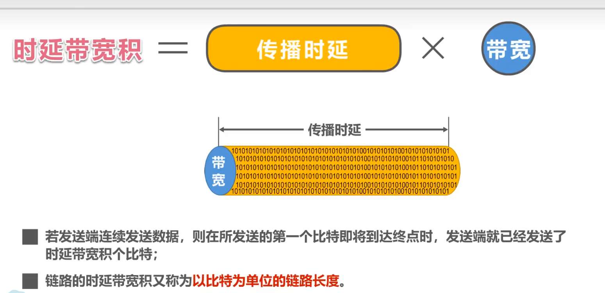
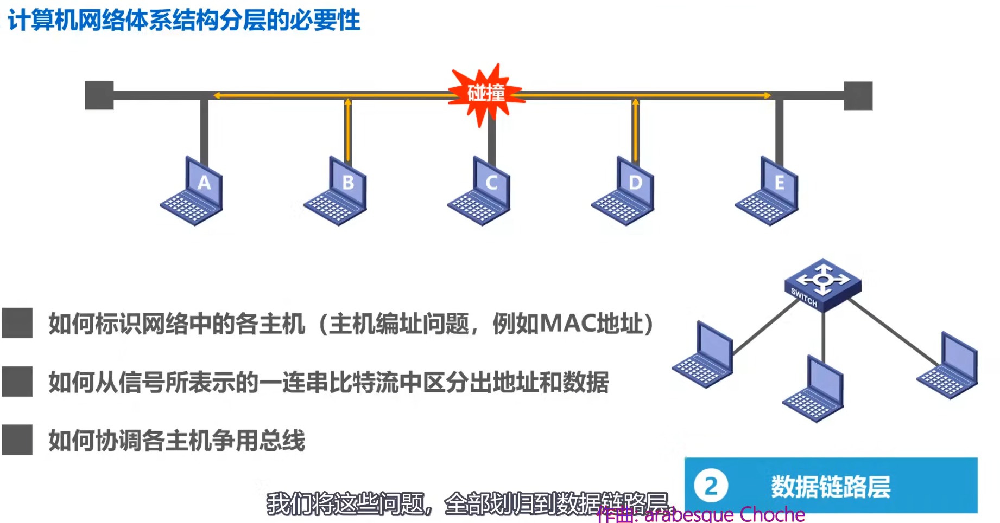
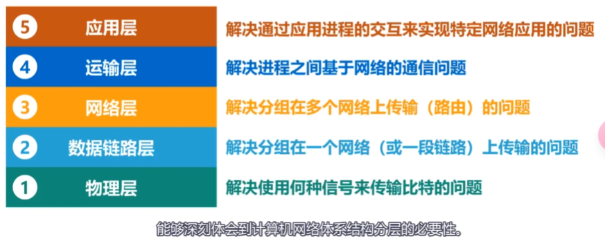
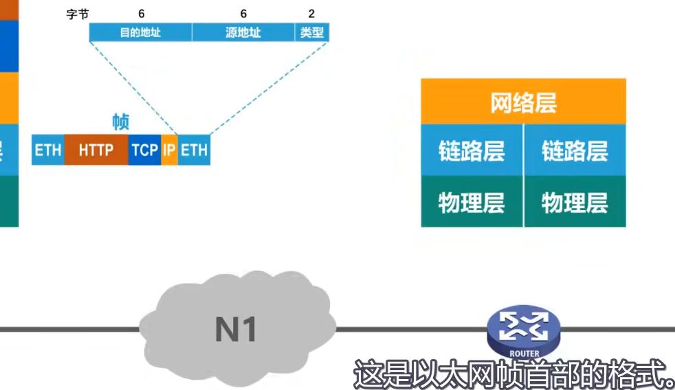
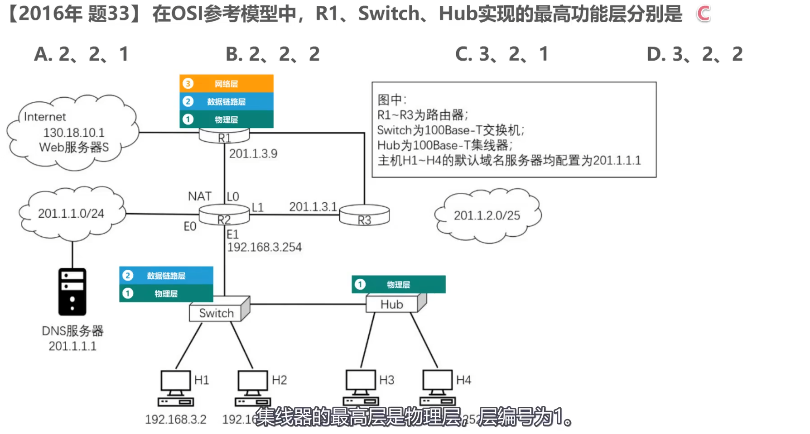
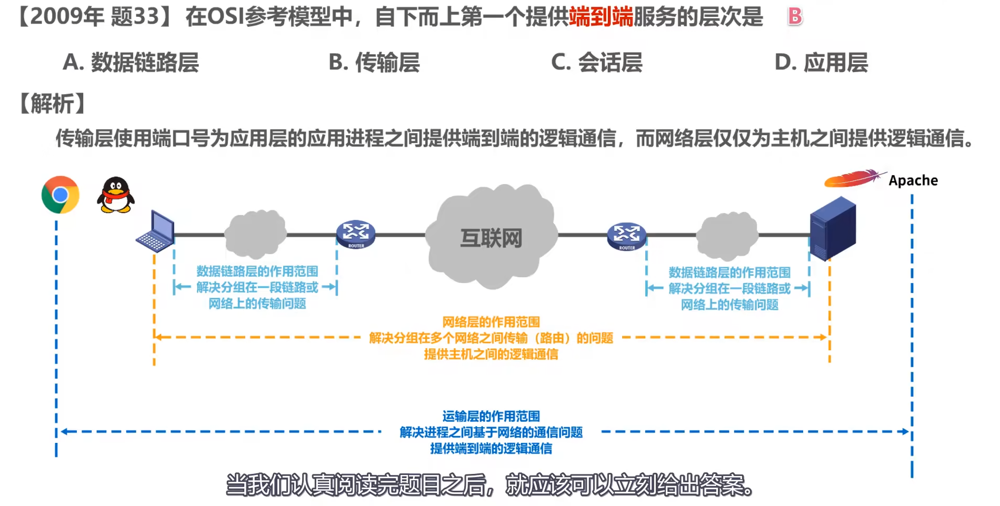

## 1.概述
### 1.2 因特网概述

* **网络** = 若干**结点node**  + 若干**链路link**(有线链路/无线链路).

* **互联网(internet)** = 多个网络通过**路由器**互连起来, 是网络的网络.
* **因特网(Internet)** = 目前全球最大的互联网络, 采用TCP/IP协议作为通信规则, 其前身是每过ARPANET.
* **主机(host)** = 连接在Internet上的计算机. 是网络中的一个结点.
#### 1.2.1 Internet历史
>1969年, 美国第一个分组交换网ARPANET
>1983年, TCP/IP协议称为ARPANET标准协议, 标志着Internet诞生.
>1985年, NSF围绕六个大型计算机中心,  建设了NSFNET(主干网,地区网和校园网)
>1991年, 美国政府将因特网交给私人经营经营
>1993年, NSFNET被若干个商用因特网主干网替代, 政府机构不负责运营, 而让各种 **因特网服务提供者(ISP,Internet Service Provider)** 来运营.
* 我国主要的ISP是中国电信, 中国联通, 中国移动.
>1995年, NSFNET停止运作, Internet彻底商业化.

#### 1.2.2基于ISP的三层结构的Internet

### 1.3 三种交换方式
#### 1.3.1 电路交换(circuit switching)
是物理上的电路交换. 座机就是使用电路交换.
电话交换机, 其实就是一个开关, 可以控制哪两个线路联通.

#### 报文交换
相比分组交换, 不把一个报文拆为分组+报头, 一整个交换. 也需要路由器缓存转发. 已过时.

#### 1.3.2 分组交换(Packet Swictching)
路由器是最重要的分组交换机.
通过路由器的两主机的一次报文传输:
>发送方: 构造,发送分组
>路由器: 缓存,转发分组
>接收方: 接收,还原分组

#### 总结:
>A, B, C, D为传输路径上所要经过的4个结点, 纵坐标↓为时间.

### 1.5 计算机网络的性能指标
>速率: 主机在数字信道上传送比特的速率. 例: 某段链路的发送速率为100Mbps.
>带宽:   
- [模电]信号所包含的不同频率成分, 即频带宽度.(Hz)    
- [计网]两点之间传输的最高速率.(B/s)
- 事实上, 一条通信线路的频带宽度越高, 最高速率也越高.
>吞吐量: 单位时间通过某个网络/接口的数据量, 吞吐量最高就是带宽.
>**时延**: 延迟. 贡献自 
- 发送时延($\frac{分组长度(b)}{发送速率(b/s)}$). 发送速率可以近似看为信道带宽.
- 传播时延(\frac{传送距离}{介质光速 }) 
- 处理时延(排队时延+处理时延)
>时延带宽积: 即 **时延*带宽** . 其大小的物理意义是[在传输中的数据]大小.

(下图横坐标为时间)

>往返时间(RTT, round-trip time): 两个主机一次双向交互所需时间.
>利用率: 
- 信道利用率: 某信道有百分之几的时间是有数据通过的.
- 网络利用率: 某时刻全网络有百分之几的信道正在有数据通过.
* 根据排队论, 信道利用率越大, 其时延也迅速增加. 信道利用率不能超过50%.
* 
>丢包率:  即分组的丢失率. 可大致分为两种情况:
1.这个分组在传输中出现误码, 从而被下个结点丢弃.
2.这个分组到达一个队列已满的分组交换机, 从而被丢弃. (此时即发生了网络拥塞.)
- 接口丢包率
- 节点丢包率
- 链路丢包率
- 路径丢包率
- 网络丢包率

### 1.6 计算机网络体系结构.

OSI标准体系冗杂, 而且没有及时占领市场, 故失败.
* TCP/IP协议相当于去掉了OSI结构的**会话层**, **表示层**, 合并了**物理层**和**数据链路层**为**网络接口层**,  把**网络层**称为**网际层**(TCP/IP协议在网络层应用IP协议, 即Internet Protocol网际协议)
* 路由器一般只包含网络**接口层**和**网际层**. 
   - 事实上网络接口层并没有限制各种接口, 所以实际上TCP/IP协议只有三层, 其中IP层(网际层)是核心协议. 它将网络接口层互联(称为IP over everything), 并向其上的TCP协议和UDP协议提供网络互连服务(称为everything over IP). 
   - TCP/UDP运输层再向应用层提供传输服务(TCP提供可靠传输服务, UDP提供不可靠传输服务.)
* 运输层协议主要有 
  - TCP(Transmission Control Protocol), 在传输数据之前通过三次握手建立一个可靠的连接. 确保数据发送和接收端都有序完整.
  - UDP(UserDatagram Protocol), 无连接的协议, 即建立连接, 数据直接发送, 也不管发到没有, 丢包没有, 反正就是从本地发送出去. 因此也无法提供错误检查, 重传, 流量控制功能. 数据包可能丢失/重复/乱序到达, 应用程序自己处理这些问题.
* 应用层协议主要有HTTP, SMTP, DNS, RTP, POP3(接收邮件)SSH(是的, http和ssh都是一种TCP/IP协议的应用层协议.)
不同应用层协议使用不同的下层服务(TCP或UDP).

* 由此可见这其实是一个庞大的协议族, 取其中最重要的TCP和IP协议, 将整个协议族取名为TCP/IP协议.
* 在嵌入式开发领域, TCP/IP协议族 常称为TCP/IP协议栈.
  

#### 1.6.1 物理层

物理层要解决的问题是如何在两头传输01信号.
#### 1.6.2 数据链路层

数据链路层要解决的问题是标识一个网络(无论是有限还是无线)的各设备(主机), 协调各主机. 
我们说物理层对数据链路层是**透明**的, 即数据链路层的工作不需要知道物理层是如何实现的, 也不需要知道, 只需要享受物理层的工作结果.
#### 1.6.3 网际层

如图是一个由三个路由器, 四个网络互连起来的小型互联网.
网络层(网际层)的任务是标识各网络和主机, 以及帮助路由器选择合适的路径转发分组.
如, 使用IP协议, 每台主机的IP地址中, 前三个数字用来标识网络, 而后一个数字用来标识该网络的主机.
  
至此,可以实现分组(回忆, 分组指的就是报文的分尸带上报头)在网络之间(或者说不同局域网之间)的传输问题.
  
网际层除了IP协议,还有

- **PPP(点对点协议)**
  -  属于TCP/IP体系结构网络接口层, 可以直接为IP协议提供服务.
- **ICMP(网际控制报文协议)**
  - 使用ICMP协议封装的协议数据单元, 需要用IP协议封装为IP数据报才能发送. 即IP协议直接为ICMP协议提供服务.

#### 1.6.4 运输层
但是, 例如在一个**客户端主机**主机上同时运行着两个**进程**(google浏览器和qq), 当**服务器主机进程apache**向该主机发送qq消息报文的时候, 客户端主机如何区分该呈给哪个进程呢?--->运输层协议要解决的问题.

#### 1.6.5 应用层
在上述基础上, 只需要制定各种应用层协议, 按照协议编写应用程序, 就可以在应用进程的交互来完成具体到分组的交互.

#### 1.6.6 summery

#### 1.6.7 实际情况;

当我们在浏览器上访问某个网站时, 其实是两个主机的两个应用进程之间的信息交换.

- 首先, 浏览器应用进程按照http协议,生成一个http请求文本.

- 该请求文本在运输层加上TCP协议报头, 成为TCP报文段.

TCP报文段在网络层上按照IP协议加上IP报头, 成为IP数据报.

- IP数据报交付给数据链路层, 将IP数据报加上一个首部和一个尾部, 称为**帧**.  我们假设我们所在的局域网是一个以太网, 以太网的帧如下图.

- 物理层将整个信号加上前导码, 变为01信号后进一步变为可传输信号输出给路由器.

- 路由器接收到信号, 在物理层将其解析并去掉前导码, 去掉TCP报头, 使之成为IP数据报给网络层.
网络层查找IP数据报, 查找自身路由表确定转发端口, 然后加上新的数据链路层成为帧, 然后成为物理层发送出去.
最终服务器主机收到报文, 一步步向上解析为HTTP报文, 传给Web服务器进程, 进程得到消息并且输出html文档.然后再一圈回去.

#### 1.6.8 以太网
以太网是一种有限系统. 属于LAN(局域网), 工作在TCP/IP模型下的网络接口层, 或者说OSI模型的物理层+数据链路层.  以太网当前的标准为**IEEE 802.3**.  以太网可以兼容市面上大多数物理层+数据链路层协议.
- 物理层:
    - 线缆(最初是同轴电缆, 如今使用双绞线电缆, 其最新型号为6类, 6A类, 7类)
         - 型号: 
             - CAT 5/5e 100Mb/s           (CAT->categoty)
             - CAT 6    1Gb/s
             - CAT 6a   10Gb/s
             - CAT 7    10Gb/s 
         - 线头: 配备RJ45  八针连接器, 有半双工, 全双工(即两个半双工啦.) 两个模式.
             - 半双工: 一次沿一个方向传输数据.
             - 全双工: 允许养两个方向同时传输数据.
    - 设备:即包括计算机和各种具有内部NIC(网络接口卡)的设备组成.
     
    网关/网桥将多个以太网连接在一起. 
     - 网关连接不同协议的局域网.
     - 网桥连接相同协议的局域网.
     
- 数据链路层. 
  - 逻辑链路控制(LLC)
  - 介质访问控制(MAC) 
  - 以太网在数据链路层中使用协议**CSMA/CD(Carrier Sense Multiple Access with Collosion Detection载波侦听多路访问/冲突检测)**来传输数据包.
  - * CSMA/CD协议的工作梗概:
          - 先检查网络上是否有数据
          - 若无,发送一部分数据, 看看是否发生冲突
          - 若传输成功, 发送更多数据.
          - 若发送失败, 计算等待时间然后发送数据.

#### 1.6.9 一些专用术语
分为
- **实体**: 任何可发送或接受信息的硬件/软件进程.
  - 对等实体:收发双方相同层次(一般按照TCP/IP模型)中的实体.
    - 例如: 你的谷歌浏览器进程和目标Web服务器进程是应用层的对等实体.
- **协议**: 控制两个对等实体进行逻辑通信的规则的集合.   
  之所以成为逻辑通信, 是因为这种直接通信并不存在, 参见上节的一个具体例子中, 信息传输是一层一层加报头去报头实现的, 除了物理层外, 两个层之间没有直接联系.
  - 协议的三要素：
    - 语法: 即约定好所交换信息由哪些字段以何种顺序构成.
    - 语义: 即约定好收发双方要完成什么操作.
      - 比如一个http请求报文定义了要求Web服务器发送一个特定html文档.
    - 时序: 即约定收发双方的时序关系.
     
     这是一个IP数据报. 其中的小格子称为**字段**或**域** 语法就是约定好这些小格子有多少种, 有多长和先后顺序. 
       - 例如TCP协议的三次握手, 就定义出了时序关系:
           
- **服务**: 两个对等实体间的逻辑通信使得本层能够向上一层提供服务. 例如网络层向运输层提供服务.
  
  - 服务访问点: 指在同一系统中, 相邻两层实体交换信息的(逻辑)接口.例如:
    - **数据链路层**(面向网络层)的服务访问点为**帧**的 **"类型"字段**,
    - **网络层**(面向运输层)的服务访问点为**IP数据报**首部中的 **"协议字段"**.
    - **运输层**(面向应用层)的服务访问点为**端口号**.
  - 服务原语: 上层使用下层服务必须通过与下层交换一些命令, 这些命令称为 **服务原语**.
  - 协议数据单元PDU: 对等层之间传送的数据包, 称为该层的协议数据单元.
    - 例如网络层之间逻辑通信的数据包称为IP数据报或分组(packet). 具体如下图.
    - 
  - 服务数据单元(SDU): 层与层之间交换的数据包.
  - 服务分为
    - 数据报服务: 一种无连接的服务，每个数据包（或数据报）独立地在网络中传输，彼此之间没有关联。数据包可以选择不同的路径到达目的地。
    - 虚电路服务: 一种面向连接的服务，类似于电话通信中的电路交换。在传输数据之前，必须先建立一条虚电路，这条电路在通信过程中保持活跃。
#### 1.6.10 网络互连设备
- 路由器(R1/2/...)
  - 是一个三层的主机.  
- 交换机(Switch)
  - 是一个两层的主机.
- 集线器(Hub)
  - 是一个只有物理层的主机.

### 1.7习题
- 
 端到端服务不仅仅是从一个主机到另一个主机的传递，还包括数据准确地传送到目标主机上的特定应用进程，这就是传输层的工作。端即IP+端口.
 因此，传输层是TCP/IP模型中第一个真正提供端到端服务的层级，因为它确保了数据能够可靠地传送到目标主机的正确应用进程，处理了所有与数据传输相关的复杂性.
-  

# 2.物理层

###  传输媒体:
* 传输媒体在物理层之下, 所以不属于计算机网络结构中任何一层.
- 有线(引导型传输媒体)
  - 同轴电缆(old)
  - 双绞线(保证全双工),
    - 绞合的作用: 可以减少相邻导线和外界的电磁干扰.
  - 光纤
    - 多个光纤可以组成光缆, 更粗更耐操.
  - 电力线(即利用已有的本来用于传输电能的线路, 利用PLC(Power Line Communication)技术实现.)

- 无线(非引导型传输媒体)  
  - 微波传输(2~40GHz)
  - 红外波段(≈300,000 GHz) 传输距离短, 速率低.
    - 一些智能手机保留了红外接口, 可以对有红外遥控器接口的家电进行遥控
    - ISM(Industrial, Scientific, Medical)

- 可见光通信(LI-FI)
  LED灯每秒上万次有规律闪烁传递信号. 显然传输距离短不能穿墙

### 物理层主要任务

### 传输媒体

#
#

