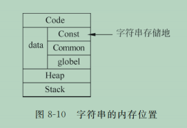
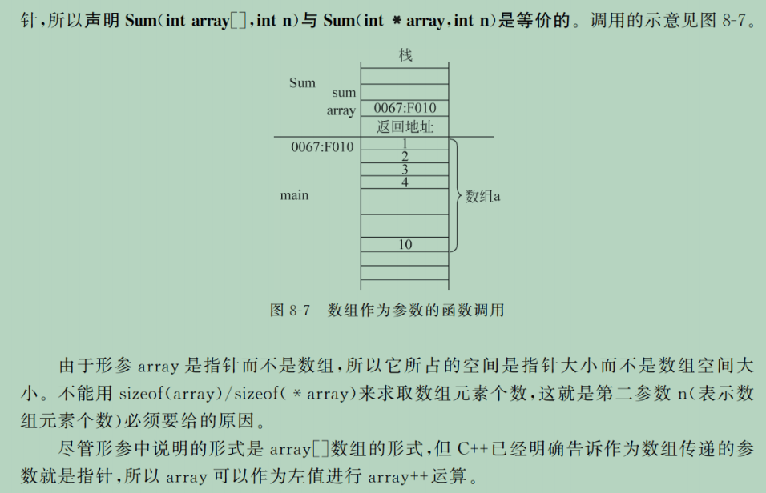
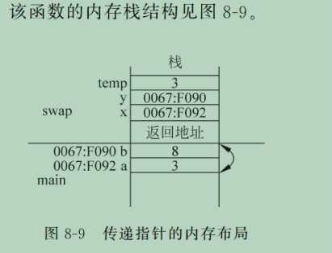

## 基础语法

### 数据类型

#### char* 字符串/字符指针/字符数组名
- char* 字符串一般为**C风格的字符串**, 即以`\0`作为结尾标志. 使用cout时, 编译器若识别到**C风格的字符串**, 不会打印出指针地址, 而是打印这个字符串. 如果你希望编译器把这个**字符数组名**当作指针看待, 打印出指针地址, 那你需要把他显示转化为void*再打印.
  
  
由于字符串作为特殊的指针的特殊地址属性, 两个**同样的字符串**, 其地址并不相等.
```cpp
if("azazel"=="azazel")
cout<<"相等"<<endl;
else
cout<<"不相等"<<endl;
//输出不相等.
```
- 没错, 一个字符串`"hello"`其实是一个地址. 完全可以`char* ptr="hello"`

#### double 双精度浮点数
在C中, 形如`2.56`的小数是double类型. 语句`float a = 2.55`是不恰当的, 实际上进行了一次double类型`2.55`到float类型的隐式转换. 恰当的方式是写为`float a = 2.55f`.

### 头文件
```cpp
#include <iostream>
using namespace std;//如果不声明使用的函数命名空间,则需要在使用std内的函数和保留字时格式为:std::cin >>n    std::endl(类似于python中的是否import 某函数  from 某module一样.)
```
####　常用头文件：
```cpp
#include<bits/stlc++.h>	//万能头文件
#include<iostream>
#include<string>
#include<stdio.h>
#include<string.h>
#include<queue>
#include<algorithm>
using namespace std
```
* 在C中.h去掉前面加上c即可,如:<string.h>在c++中换成<cstring>

### STL C++标准模板库
#### 容器
通用的方法:
容器.size()返回容器的大小.
#### list(链表)

####　pair()
当想要将两个元素绑在一起作为一个合成元素,又不想要因此定义结构体时,使用 pair 可以很方便地作为一个代替品.
在头文件#include<iostream>中.
创建:pair<数据类型first,数据类型second> mypair[50];//创建了一个全是(0,0)的pair数组.
访问:mypair[i].first或second;//表达式返回的是相应的第一个元素或者第二个元素.一般为了方便可以#define x first;#define y second;

#### vector(动态数组,可变长数组)
在头文件`#include <vector>`中.

其结构类似于:
```cpp
template <typename T>
class Vector{

private:
	T* data;			//指向动态分配的数组. T是元素的数据类型.
	size_t size;		//当前元素数量
	size_t capacity;	//已分配内存的容量

public:
	Vector() : data(nullptr)

	void reserve(size_t new_cap)
	{
		if(new_cap > capacity)	//如果需要分配的数量已经大于

	}
}


```

```cpp
vector <type> name;		//声明. 得到一个空的`type`类型可变数组`name`, `此时name.size()=0

vector <int> a(n[,x0])		//建立一个size为n的都为x0(默认为0)的数组.
a[1]=5;//动态数组的访问和数组一样.
vector的方法:
a.size()			//返回vector的大小
a.resize(n);		//重新分配数组大小,此时a.size()=n
a.push_back(新元素值);	//压入一个新元素，size也+1
```
*二维vector，即vector<vector<int>>erweiv;
*vector的传递：直接传递vector的名字即可实现按值传递.如果用const vector<int>& myvec则为常引用,在函数体内参数变量是只可读的(适用于写类似void show()的函数.)


#### map(地图,键值对)
在头文件#include<map>中;map内部有序(自动排序，单词时按照字母序排序),查找时间复杂度为O(logn)。
创建: map<键数据类型,值数据类型> mymap;//该语句创建一个键值对数据类型确定的空的map.
操作方法:
mymap.insert(key,value);//往mymap中加入一个(key,value)的键值对.
mymap.find(key);//该表达式返回mymap中键key对应的value.


#### priority_queue(优先序列,也称为堆,一个容器.本质是用一个数组去模拟的完全二叉树.可以拿出优先级最大的元素.)
头文件为#include<queue>
定义:priority_queue <数据类型,容器类型,比较方法>,默认容器类型为vector<数据类型>,默认比较方法为less<数据类型>
greater<数据类型>则为小顶堆.
priority_queue <int> myque;	//生成了一个int类型大顶堆,即值越大优先级越高.
priority_queue <int,vector<int>,greater<int>> myque;	//生成了一个小顶堆.
操作方法:
myque.size()	//返回长度
myque.push(x)	//插入元素x
myque.pop()	//删除优先级最高的元素(称为堆顶.)
myque.top()	//访问堆顶(返回堆顶元素)
myque.empty()	//判断是否为空.

#### 容器的for加强循环：
C++提供类似python的容器迭代方式,即for(循环变量:容器)
```cpp
//字符串的遍历:
string str="DieScatten";
for(char i : str)	//类似python中的for char in str:
{
	cout<<i<<" ";
	i="a"	//不能修改,没有用的语句
}
for(char& i : str)	//在声明时使用的&为[引用运算符],任何其他&的使用是地址操作符.在这里实际上是每次遍历都声明了str内一个字符的引用i,并操作i.
{
	cout<<i<<" ";
	i="a"	//将字符串str变成aaaaaaaaaa
}
```
同理,vector的遍历也类似.

迭代器:		//提供一个对任何容器统一的遍历方式.

### 符号和关键字
#### 条件运算符:
(条件表达式)?(为真时表达式的值):(为假时表达式的值)
如x==3?0:1

#### 双冒号::
叫做用域区分符.指明一个函数/数据属于哪个类.


杂项
- C++定义常量`const int a=3.14`和C中的预处理`#define a 3.14`不同:后者在编译预处理时把整个程序的a全部替换成3.14,a不存在了,不是一个只读变量名.(不过实际使用区别不体现.)
#### operator 关键字 运算符函数
`operator`用于定义或重载**运算符函数**.
基本形式:
`return_type operator symbol (parameters){//实现}
例子: 我们来重载`+`, 使得两个复数类`complex`可以相加运算
```cpp
//这是我们的complex类定义(我们需要一个自己的类来展示运算重载符.)
class Complex
	private

```
#### explicit 显式关键字

####

### 函数

#### 函数的声明
C++允许隐式声明, 即还没有写函数体{}, 先声明函数. 你甚至可以先声明一个函数, 不给形参起名字, 如`void print(char*[]);`表示一个需要传递一个字符串数组的的函数. 在后面完整的定义里, 你还是要声明形参名字的:
```cpp
void print(char*[]);
int main(){
	char* name[]={"azazel", "chronos", "tasvidus", NULL}

	myprint(name);

	void myprint(char* arr[]){
		for(;*arr!=NULL;arr++)	//输出各个字符串和其地址数字
			cout<<(int)*arr<<" "<<*arr<<endl;
	}
}
```

#### 一些函数介绍

##### typeid 察看变量类型:
`typeid(d).name()`返回值是一个`char const *`
当d为int/double/char时打印出来是int/double/char
当d为string时打印出来```class std::basic_string<char,struct std::char_traits<char>,class std::allocator<char> >一大坨...```

##### 函数system 
功能： 发出一个DOS命令 
用法： ```int system(char *command);```
system函数已经被收录在标准c库中，可以直接调用。
例:```system("pause");```该语句使程序在此处暂停，按任意键继续.
##### cin
cin慢是有原因的，其实默认的时候，cin与stdin总是保持同步的，也就是说这两种方法可以混用，而不必担心文件指针混乱，同时cout和stdout也一样，两者混用不会输出顺序错乱。正因为这个兼容性的特性，导致cin有许多额外的开销，如何禁用这个特性呢？只需一个语句
```std::ios::sync_with_stdio(false);```
这样就可以取消cin于stdin的同步了。
* 注意按值传递时,参数列表有一个int a,可以写成const int &a.对于一个很大的vector更经常如此:本来可以写成
##### sort函数介绍
(void) sort (起始地址,结束地址[,比较器])

例1(数组):
int arr[10]={5,3,6,0,2,8,2,6,9,11};
sort(arr,arr+10);

例2(可变数组):
vector <int> vec={5,3,6,0,2,8,2,6,9,11};
sort(vec.begin(),vec.end());	// 可变数组名.begin()/.end()表达式给出数组第一个元素和最后一个元素的地址.

例3⚠️(结构体):实现对结构体多个成员变量的多关键字排序,需要用到sort的第三个参数,一个布尔值.
```cpp
//声明结构体
struct List
{
int a;
int b;
string c;
};
//欲对StuList[50]进行a为第一关键字,b为第二关键字,c为第三关键字升序排序.
为了获得第三个参数,需要比较函数:
bool cmp(List A,List B)
{
if (A.a!=B.a)
	{return A.a<B.a;}
else
	{
	if(A.b!=B.b)
		return A.b<B.b;
	else
		{return A.c<B.c;}
	}
}
```
此时使用命令sort(StuList,Stulist+50,cmp);即可.第三个参数是比较函数的名字,不用加括号.

##### typedef
为一个已有的类型名提供同义词.
例:
```cpp
typedef int INT,integer;//这样就可以用INT或者integer来代替int啦
```

#### 函数模板
C++ 中的一种特性，它允许你编写一个**对数据类型**通用的函数，而不必针对不同的数据类型编写多个函数版本。定义函数模板时，使用 `template` 关键字。
STL中提供的的多种类都是函数模板, 如`vector`.

简单示例
```cpp
#include <iostream>
using namespace std;
//一个通用的add加法函数模板, 可以处理int和double数据.

template <typename T>//T是一个数据类型占位符.
T add(T a, T b)
{
	return a+b;
}

int main(int argc, char* argv)
{
	cout << add(5, 3) << endl;
	return 0;
}
```


#### 形式参数和实际参数
在一个函数中, 参数分为形式参数(函数接收的参数)和实际参数(函数体内定义的参数).
```cpp
int myfun(int a, int b){
	int c = a + b;
	return c;
	//在这个简单的例子里, a, b是myfun的形式参数, c是myfun的实际参数.
}
```
##### const形式参数
可以在形式参数前面加上关键字`const`, 表达这个传进来的参数在该函数体内部不可被改变. 
```cpp
int myfun(const int a)//在函数体内的变量a作为一个常数不可被修改.
{
	//函数实现
}
```
这是一个常见的功能, 在传入某个真实数据时一般传入const 形式参数, 防止函数体内不小心把这个参数改变了.

#### cin cout I/O流控制    	
流,即输入或输出的那一系列字节.
```cpp
cin >> n  //等价于scanf(%d,&n)
cout << a<< b<<c   //等价于printf("%d%d%d",a,b,c),其中a,b,c也可以为"\n"即换行,等价于endl(保留字end of line)
C++默认的流输出数值有效位为6.
输出流的格式控制:用控制符manipulators实现,需要#include<iomanip>
int pi=3.14159;
cout<<setprecision(2)<<pi;//setprecision(n)设置后方流的输出有效数字.结果为两位有效位输出得3.1
cout<<setw(n)<<setfill('char')<<pi;//按照n宽度输出,用char(默认为空格)补充空位.若要输出的值本身超过了n,则放弃该格式控制而输出整个值(这点和py的{:*5}.format(pi)一样.)
cout<<setfill('*')
       <<setw(10)
       <<pi
```

* n++表达式若看作一个函数,进行的是n=n+1,返回值是n(相加前的数)
* ++n表达式做看作一个函数,进行的是n=n+1,返回值是n+1(相加后的书)


### 循环变量
c++中允许在for循环中定义循环变量,即可以写
```cpp
for(int i=0;i<5;i++){}
```     
这点和python中
```python
for i in range(n)很像.
```
string类型字符串变量:
是动态数组，可以声明string a;
和python中的char类似,允许进行拼接a+b
函数getline(test_string)相当于gets_s(a),a为对应C中的字符串数组.

字符串面向对象:
```str.length()```返回字符串str的长度,一个整数.
```str.substr(m[,n])```截取:返回字符串str的序号为m位开始,长度为n(默认则包含后面所有的)的子串.


C++允许在定义结构体```struct Student{xxxx}```后,直接```Student A```;来创建结构体变量而不加`struct`关键字.


### 类class
* 注意类成员函数在类外声明时,需要写在类的下方,写在类的上方会报错.

#### 静态 static
- class中可以提供静态成员变量(即属于类而不是具体的某个实例, 通过某个实例访问这个静态变量, 其实都是同一个变量)和静态方法(静态变量的函数). 
- 使用关键字`static`实现.
- 不能在类的定义内直接为静态成员变量赋初值. 因为静态成员变量属于整个类，而不是某个具体的对象。编译器需要在类的外部为静态成员变量分配内存空间，因此初始化必须在类外进行。
```cpp
//演示一个简单的类,他只有一个自己的属性var, 也不封装就先都放在public演示了.
class Myclass{
	public:
		static int count;	//这是一个常见的静态变量,用来计数一共生成了多少个该类的实例.
		int var = 0;
		Myclass(int v): var(v)
		{count++;}		//每调用一次构造函数, count++

		static void showCount(){
			cout << "Total objects: " << count << endl;	//一个静态方法, 打印出count
		}
}
//在类外定义并初始化静态成员变量.
int MyClass::count = 0;

int main(){
	MyClass obj1;
	MyClass obj2;
	MyClass obj3;
	MyClass::showCount();//调用静态成员函数,显示"Total objects: 3"
	return 0;
}

```

#### 构造函数
- 是类的特殊成员函数.
- 函数名和class名相同, 没有返回值.
- 在创建对象时自动调用该函数.
##### 构造函数格式
```cpp
class Student
{
public:
    Student(string _name="null",int _age=0,int _score=0)	//类的构造函数(方便初始化)
    {
        name = _name;
        age = _age;
        score = _score;
    }
    void display()	//展示打印信息的函数
    {
        cout << "name=\"" << name << "\""
            << ",age:" << age
            << ",score:" << score;
    }
protected:
    string name;
    int age;
    int score;
};
```
然后我们可以对一个Student Student1("mike",19,100);来初始化声明一个对象Student1.

* 注意类成员函数在类外声明时,需要写在类的下方,写在类的上方会报错.
* 构造函数一般放在public, 而属性值一般放在private或者protected.
##### 构造函数重载
大多数情况下, 类提供多种方式接收参数并初始化, 这要求构造函数**重构**, 从而能自动匹配输入的参数是什么, 对应初始化方式.

```cpp

class Rectangle{
	public: 
	//定义一个矩形有多种方式.
	//第一种是默认构造函数, 不接受参数, 默认长宽都是0. 如果用户声明一个变量的时候没有输入参数, 就会调用这个构造函数.
	Rectangle()
		: width(0), height(0)
		{}

	//第二种构造函数. 当接收两个参数的时候, 选用该构造函数.
	Rectangle(double w, double h) 
		: width(w), height(h)
		{}

	//第三种. 只接受一个参数(即边长, 此时为正方形)时, 选用该构造函数.
	Rectangle(double w)
		: width(w)m height(w)

	//用于显示对象的要素的显示函数
	void disp(){
		cout << "width:" << width << ", Height: " << height << "\n";
	}

	private:
		double width, height;	//矩形类有两个要素, 长和宽.
}

```

#### 析构函数
构造函数对应着析构函数.  当**对象**的结束, 或者显式调用`delete`操作符删除动态分配的对象时, 析构函数被自动调用.
- 析构函数也是类的一种特殊函数, 函数名为类名前加`~`.
- 也没有返回值, 不接受参数, 作用是进行清理工作. 
- 不带指针的类, 多半不需要写析构函数.

#### 继承
即可以从一个已存在的类(称为**基类/父类/超类/base class**)中继承属性和方法,创建一个子类(**derived class**).
- 用`:`符号表示继承, 即`class Derived_Class_name : [访问控制修饰符] Base_Class_name{...}` . <br> 其中可选**访问控制修饰符**用来决定子类对基类的成员的访问权限. 可以为:
  - public (即公共继承), 子类对父类的属性和方法保持`public`访问权限.
  - protected (即受保护继承), 保持`protected`访问权限.
  - private (即私有继承),  无法直接访问父类. 此关系通常用于组合而不是继承...

```cpp
//基类. 可以吃饭
class Animal {
	public:
		void eat(){
			cout << "numnumnumnum" << endl;
		}
};

//派生类. 可以狗叫
class Dog : Animal{
	public:
		void bark(){
			cout << "worf worf worf" << endl;
		}
}

int main(){
	Dog myDog;
	myDog.eat();	//调用基类函数
	myDog.bark();	//调用自己的函数
	return 0;
}

```

### 指针

#### 概述
- 在指针定义中,一个*只能表示一个指针.即``int * ptr1,ptr2;``
该语句声明了一个整形指针ptr1和一个整形ptr2.
- 在执行语句中, *在指针变量前为**间接引用符**, 如`*iptr=5;`表示将该指针所指变量的值赋值为5.
- 在定义语句中, *在数据类型后为**指针定义符**, 如`int* iptr;`表示声明一个悬空指针.
- **void\*** 称为**通用指针**或空类型指针. 
  - 它可以指向任何类型的数据. 函数malloc()就返回通用指针. 
    - 显然, 空指针**不可**进行间接引用`*nulptr`, 也**不可**进行指针运算`nulptr++`.
    - 空指针可以显式转换.`ptr=(int*)nulptr`. 不可被隐式转换(右值):`int *ptr=nulptr	 //error`
    - 空指针的一个应用:**mecpy()函数**
      - 这函数**从源数组中拷贝n个字节到目标数组中**. 或者说, **从一个内存位置(指针source_arr)复制指定数量(n)的字节到另一个内存位置(指针destination_arr)**。返回空指针destination_arr.
      - 原型:`void* memcpy(void* destination_arr, const void* source_arr, int n)`
```cpp
#include <iostream>
#include <string.h>//memcpy()在该头文件内.
using namespace std;
////////////////////////////////////////////
int main(){
	char source_string[11]="azazelplus";
    //字符串字面量会自动在末尾添加一个空字符 `\0`, 也称为 null-terminator, 用于标识字符串的结束.
	char destination_string[10];
    destination_string[6]='\0'; //手动添加终止符
	memcpy(destination_string,source_string, 6);
    cout<< destination_string <<endl;
	//输出为'azazel'
	//也可以利用memcpy的返回值:
	ptr=(char*)memcpy(destination_string,source_string, 6);
	cout<< ptr <<endl;
    return 0;
    
}
```
- 不同数据类型的变量, 在内存中(即使使用相同的字节如`int`和`float`)读取方式是不同的. 不同数据类型指针之间可以强制转换, 但这是危险而不寻常的. 用不同类型的指针读取同一块内存, 会解析出不同的结果. 下面是一个危险的例子.
```cpp
int a=5;
int* p;
p = &a;
double * q;
q=(double*)&a;

cout << p << "\n" << q << "\n" << endl;
cout << *p << "\n" << *q << endl;
//输出:
//0x61fe0c
//0x61fe0c
//
//5
//8.00687e-307
```
- 注意指针数据类型不是整数.
-  注意区分下面两个概念. (有时会混用)
   -  **常量指针/指向常量的指针/pointer to const**: 指向常量的指针. 其间接引用是常量, 无法作左值, 而指针本身可以更改. 事实上`指向常量的指针`只是限定了不允许通过间接引用该指针赋值, 不改变那个变量本身的可变性. 如果那个变量是非常量, 你可以直接对那个变量赋值.
  ```cpp
  int x = 5;
  const int* ptr = &x;//不允许对*ptr赋值, 但可以直接对x赋值.
  int y=10;
  ptr=&y;//可以修改这个"指向常量的指针".	
  ```
   -  **指针常量/const pointer**: 不可更改的指针. 如数组名.
  ```cpp
  const int* ptr
  ```
   -  当然也可以声明一个**常量**指针**量常**.

#### 指针运算
指针可以进行`+`, `-`运算. 指针运算就是在操作数组. **数组名**(没有方括号/下标)就是一个指针.
显然, 指针的`+`, `-`即为看作整数时(单位为字节), ±了`$对应数据类型所占字节数`. 如`int*`类型的`++`操作, 其实就是字节数+2.
```cpp
int a[5];
int* ptr = &a[0];	//此时ptr和a是同一个指针. 这个句子和int* ptr=a; 相同
ptr++; 		//此时ptr==&a[1]
ptr-2; 		//此时ptr==&a[-1], 发生越界访问, 危险.
*ptr=666;	//越界改写, 危险!!!
```

#### 堆内存分配
**堆(heap)**是一个较大的内存区域, 用于动态内存分配. 速度比栈慢. 
- 用`new`, `malloc`等函数请求内存.
- 用`delete`, `free`等函数释放内存.
##### malloc函数
  - 原型:`void* malloc(size_t size)`

```cpp
//例子:从堆中获取一个整数数组, 然后赋值打印.

# include <iostream>
# include <cstdlib>	//malloc（）函数中在c-std-lib头文件中。
using namespace std;
int main(){
	cout<<"输入数组大小"<<endl;
	int aSize;//数组大小
	cin>>aSize;
	int* aptr=(int*)malloc(aSize*sizeof(int));	//申请动态内存空间, 开辟数组.
	//malloc()的返回类型是void*, 需要进行一次隐式转换, 故开头加上(int*).
	//malloc()函数输入要开辟的字节数量(int或unsigned). sizeof()函数输出一个int, 即某种数据据类型占用内存字节数量.

	//如果malloc分配失败了, 会返回一个NULL指针(新版本多了数据类型nullptr, 它和NULL是一样的). 而指针作为布尔判断时, NULL为0, 其他指针为1.
	if(!aptr){
		cout<<"无法分配更多内存了. 程序终止.\n"<<endl;
		return 1;
	}
	else{
			cout << "分配成功"<<endl;
		}
		
	//得到了数组, 赋值打印出来看看.
	for(int cnt=0; cnt<aSize; cnt++)
		aptr[cnt]=cnt*2;
	for(int cnt=0; cnt<aSize; cnt++)
		cout<<aptr[cnt]<<" "<<endl;
	free(aptr);	//释放堆内存, 该动态分配的数组将不复存在了.
	return 0;
}
// 效果:
// 输入数组大小
// 8
// 分配成功
// 0
// 2
// 4
// 6
// 8
// 10
// 12
// 14
```
##### new()和delete()
C++专有的操作符, 不需要头文件声明, 比malloc更简练. 它直接返回你想要的指针类型, 这显然靠函数模板实现. 只需给new指明什麽数据类型和要按多少元素即可, 形如`new int[5]`. 
```cpp
int aSize;
cin >> aSize;

//malloc()实现开辟数组
int* aptr = (int*)malloc(sizeof(int)*aSize);
//free实现内存释放
free(aptr);

//new()实现开辟数组
int* aptr = new int[aSize];
//delete()实现内存释放
delete[] aptr;
```

#### 指针和函数

##### 传递一个指针(数组)给函数
-  格式: 
   -  `Sum(int array[])` 
   -  `Sum(int* array)` 
     
	是完全等价的. 前者可读性似乎好一些.
- 一旦把数组作为参数传递到了函数中, 则**在栈上定义了指针**.
  
- 传递一个指针(或者说数组)给函数, 实际上是传递了一个原指针的副本, 而原数组的数据仍然在原来的地方存放着. 这个指针副本可以访问原数组, 也可以在函数体内被更改, 不影响原指针.

```cpp
//下面的函数, 传递一个数组然后求和.

int Sum(int array[], int aSize){
	int sum = 0;
	for(int i=0; i<aSize, i++){
		sum+ = *array;
		array++;
	}
	return sum;
}
```

下一个例子.
```cpp
//写一个实现两个int的swap函数
void swap(int* x,int* y){
	int temp = *x;
	*x=*y;
	*y=temp;
}
```

* 指针的灵活是以破坏函数的黑盒特性为代价.
  * **调试难度和安全.**<br>它使函数可以访问函数的栈空间以外的的内存区域, 范围扩大, 跟踪错误也更复杂. 同时错误现象从简单的不能得到相应返回结果, 扩展到系统破坏甚至死机.
  * **重用性破坏.** <br>调用接收指针的函数, 依赖于整个外部内存空间的环境.  这样的函数难以作为公共的函数模块来使用.

##### 指针函数
即返回值为指针.
* 当然, 你**不应该**返回一个在该函数内部声明的一个地址(这个地址作为局部作用域, 指向**栈STACK**中的内存.). 这样的指针在该函数作用结束后会被自动栈管理而释放内存. 总之,可以返回堆地址, 全局或静态变量地址, 但不要返回局部变量的地址.

##### 堆和栈
- 区分程序何时使用堆分配内存,何时使用栈分配.
  - 堆分配:
    - 全局变量;
    - 动态内存分配(使用new()和malloc()声明的指针)
  - 栈分配:
    - 函数内的局部变量.
    - 形参.

##### 用指针使用堆分配
写程序时，如果想声明一个对象（无论他是结构体/数组/整数等等），可以:

* 直接声明一个对象, 比如`struct Your_struct new_struct`; 这样实际上是在栈中自动管理其内存。

这个对象是在栈中分配的。栈内存是自动管理的，意味着当函数返回时，这些变量会自动销毁，不需要你手动管理。栈的优点是分配和释放都非常快，但它的缺点是存储空间有限，不能用来存储大型数据或需要在多个函数间共享的数据。

* 声明一个对象指针, 比如`struct Your_struct* newstruct = new(struct Your_struct)`; 这样实际上是在堆上手动分配内存.

这个对象是在堆中分配的。堆内存允许你手动控制对象的生命周期，但你需要自己负责释放它 (`delete` 或 `free`)。堆的优点是可以分配大量内存，但代价是分配和释放较慢，而且如果你忘记释放，就可能造成内存泄漏。


#### 指针数组
- 即一个数组中每个元素都是一个指针. 其数组名是指针的指针, 二级指针.
- 最简单的, 一个**字符串数组**,或者说**字符指针数组**,就是一个**指针数组**.
下面的代码定义一个字符指针数组并初始化.
```cpp
char* name[]=
```

#### NULL指针
是一个指针值, 任何类型的指针都可以赋予.

#### 函数指针
程序运行时, 
  - 局部变量存放在**栈区**。
  - 申请的动态空间, 全局变量存放在**堆区**。
  - 函数代码存放在**代码区(code)**。

每个函数都有地址. 指向函数地址的指针就是函数指针. 通过函数指针可以调用相应的函数.


- 函数指针的定义语句:
```cpp
int (*func_name)(args...)
//注意, ()优先级大于*, 所以下面的语句是函数的定义而不是函数指针的定义:
int *func(args...)//这个函数返回一个int*指针.
```
正如不含[]下标访问的**数组名**是一个指针(地址),
不含()函数调用的也是一个指针(地址).


### 数据类型转换  
在c++中提供多种方式进行数据类型强制转换.

- 传统C风格强制转换, 使用括号`()`, 不安全, 没有类型检查, 容易引发错误.
```cpp
int a = 10;
double b = (double)a;
```
- C++风格类型转换运算符
  - `sstatic_cast` 
	用来执行常规的数据转换.
```cpp
int a = 10;
double b = static_cast<double>(a);
```
  - `dynamic_cast` 
	- 用来在继承体系中进行安全的类型转换(向下转换). 
	- 只能用于指针或引用类型. 
	- 如果转换失败, 指针类型将返回`nullptr`, 引用类型将抛出`bad_cast`异常.
```cpp


```


### 文件读取
C使用`FILE`结构体(在标准库stdio.h中)实现管理文件的读写.

常用函数:
#####  `fopen` 
用于打开一个文件夹. 返回一个`FILE`指针. 

在c中, 需要先使用 fopen 函数打开文件，得到一个文件指针（FILE *），然后才能用这个指针来调用 fread 读取文件内容。

- 在使用 `fopen` 函数时，需要指定文件的打开模式。常见的模式包括：

  - "r": 只读模式。如果文件名不存在，则返回`NULL`指针.
  - "w": **覆写**模式。如果文件存在，**会被截断为零长度**；如果文件名不存在，则创建新文件。
  - "a": 追加模式。传回的文件指针此时是文件的末尾处, 写入的数据会追加到文件末尾。如果文件不存在，则创建新文件。
  - "r+": 读写模式。文件必须存在。
  - "w+": 读写模式。如果文件存在，会被截断为零长度；如果文件不存在，则创建新文件。
  - "a+": 读写模式。写入的数据会追加到文件末尾。如果文件不存在，则创建新文件。
```cpp
FILE *file = fopen("example.txt", "r")
```

##### `fclose`
用于关闭一个打开的文件夹.
**刷新缓冲区**：当你用 `fwrite` 或其他方式向文件写入数据时，操作系统通常会使用缓冲机制，将数据先写入内存而不是立即写入磁盘。fclose 会确保这些缓冲区的数据被刷新（即写入磁盘），避免数据丢失。

**释放资源**：文件指针是操作系统的一个资源。每打开一个文件，操作系统会分配一些资源，比如文件描述符。`fclose` 会将这些资源释放掉，确保不会发生资源泄漏。如果不关闭文件，系统的文件句柄可能会耗尽，导致无法打开新的文件。

**断开文件与进程的关联**：`fclose` 不仅销毁fopen返回的那个指针，还会关闭文件流，断开该文件与程序的关联。在调用 `fclose` 之后，文件指针不再有效，试图再使用它会导致错误。


##### `fseek`
fseek函数用于在文件中移动文件指针的位置, 从而能从文件的任意位置开始读取或写入数据. 移动成功时返回`0`, 否则返回`-1`.
原型:`int fseek(FILE *stream, long offset, int whence);`
第一个参数是要操作的文件指针.
第二个参数offset是偏移量, 表示要移动的字节数(正数表示向文件末尾移动.)
第三个参数whence是起始位置, 有以下已定义常量可以直接使用:
  * `SEEK_SET` 文件的开头.
  * `SEEK_CUR` 文件的当前光标位置.
  * `SEEK_END` 文件的末尾.

##### `rewind`
`rewind(file);`效果和`fseek(file, 0, SEEK_SET);`一样, 即将文件指针放到文件开头.


##### `ftell`
返回当前文件指针相对于文件开头的偏移量, 也就是当前位置. 以字节为单位. 
显然可以配合fseek得到文件大小:
```cpp
FILE *file = fopen("filename","r");
fseek(file, 0, SEEK_END);//指针移动到文件末尾
long file_size = ftell(file);//得到文件字节大小.
```

##### `fread`
这个函数将一个**文件指针**中的内容读取到一个**内存指针**中.
原型为
```cpp
size_t fread(void *ptr, size_t size, size_t count, FILE *stream);
```
>第一个参数是要把读取的数据存到的位置指针.
>第二个参数是要读取的每个元素的大小.
>第三个参数是要读取的元素数.
>第四个参数是要读取的文件的指针.

>返回值为`count`, 即读取的元素数.


例子:
```cpp
#include <stdio.h>
#include <stdlib.h>
#include <assert.h>
//这个C程序从当前目录读取名为file的文件, 把其中存储的数字作为字符串打印出来.
int main(int argc, char* argv[])
{

	//打开文件
	FILE *file = fopen("file","r");
	assert(file);
	
	//找到文件大小
	fseek(file, 0, SEEK_END);//指针移动到文件末尾
	long file_size = ftell(file);//ftell得到当前位置, 即文档的字节大小
	rewind(file);//文件指针返回文件开头.

	
	//分配内存和
	char *buffer = (char*)malloc(
			(file_size + 1)*sizeof(char)
				);//分配一个动态内存buffer来存读取的文件内容.这个动态内存快的大小比读取文件多一个字节, 用来装'\0', 将buffer组装为标准C风格字符串.
	
	//读取文件内容到buffer
	size_t read_size = fread(buffer, sizeof(char), file_size, file);
	if(read_size != file_size)//如果读取成功， fread函数返回值即为成功读取的元素个数file_size.
		{
			perror("Failed to read the COMPLETE file!!");
			free(buffer);
			fclose(file);
			return 1;
		}

	//打印读取的内容
	printf("File content: %s\n", buffer);
	
	//清理动态内存, 关闭打开的文件
	free(buffer);
	fclose(file);
	
	return 0;
}

```

##### `fwright`
参数结构和`fread`相同. 做相反的事, 将**内存指针**的内容写入**文件指针**.

##### `fflush`
用于刷新文件流的缓冲区, 将缓冲区的数据写入到文件中. 
实际使用中一般是用于写入本地文件后加一句`fflush(file)`来保证更安全.
函数原型为`int fflush(FILE *stream);`
返回值为`0`(成功), `-1`(失败).


## 数据结构

#### 堆heap
C++程序的内存格局通常分为四个区:
>**全局数据区data area**		存放全局变量,静态数据,常量

>**代码区code area**		存放类成员函数,非成员函数

>**栈区stack area(弹夹	)**		存放运行函数分配的局部变量,函数参数,返回数据,返回地址

>**堆区(自由存储区)heap area(队列)**	


对于数组,结构体(数组)等(连续的一段内存空间)当作形参传入函数时,使用其开头指针(一个结构体名字就是他的第一个成员变量的地址,一个结构体数组的名字就是它第一个结构体的第一个成员变量的地址.)就可以了.
例:
```cpp
struct Stu
{
string name;
int score;
};	//声明结构体

 Stu Test[5]={ {"jone",123},{"david",144},{"jasen",91},{"peter",120},"mike",150};	//初始化一个结构体数组
//构建一个显示该类型结构体数组信息(显示学生名单)的函数
void show(Stu* stu,int n)	//传入一个Stu类型的结构体变量指针stu和数组长度n
{
	for(int i=0;i<n;i++)
		{
		cout<<stu[i].name<<" "<<stu[i].score<<endl;
		}
}

show(Test,5);	
/*该语句可以打印出:
jone 123
david 144
jasen 91
peter 120
mike 150
*/	
```


## 参数传递
分为pass by value(按值传递)和pass by reference(按引用传递).
```cpp
void NotModifyValue(int a){
	a =10;
}//修改的是传入的变量的一个副本.

void ModifyValue(int &a){
	a =10;
}//修改了传入的变量的值.

```
编写程序时, 应该尽量选择pass by reference.
#### 引用类型
引用是一种类型，它为变量创建了一个别名。使用引用可以让函数参数或变量像指针那样操作，但语法更简洁且更安全。
```cpp
int a = 10;
int 
```
pass by referebce to const既想要速度快, 又不希望原变量数值被改动.


## 算法
### 贪心算法
为什么贪心是正确的？

#### Exchange Argument（交换论证法）
- (问题类型:消耗体力去交易行动(每个行动为proji(input(消耗体力),output(获得报酬)==c)),取得最大output.)||每个行动收益等价,取最简单的行动开始.
假设proji被选入了当前方案，而projj没有被选入当前方案，且outputi>outputj，此时总的体力花费为Δx
交换proji、projj，使得projj被选入而proji没有，此时方案中output保持不变，但是体力花费变为了Δx＋(inputi-inputj)<Δx
发现方案变得更好了!

- (问题类型:消耗体力去交易行动(每个行动为proji(input==c(消耗体力),output(获得报酬))),取得最大output.)||每个行动付出等价,取收获最高的开始.

- (问题类型:消耗体力去交易行动(每个行动为proji(input==c(消耗体力),output(获得报酬))),取得最大output.)||每个行动付出等价,取收获最高的开始.

- (问题类型:求最小代价,每个元素有(处理该元素用时,等待的代价),需要排出所有元素.)
假设挨在一起最前面的两个A1(t1,cost1),A2(t2,cost2)(类似冒泡排序,这样做的重点是这两个元素交换不影响后面的元素产生代价.),交换前这两个元素会产生代价t1cost2,交换后产生代价t2cost1,从而我们得知用每个元素的t/cost作为判据排序处理.

- (问题类型:集合问题)
在一个数轴上取一段距离，有一些线段，希望得到线段放进去最多的放法
从左往右放线段.每放入一个线段后删除掉不合要求的->剩下的右边最短选择第二个线段.

- (问题类型:求最大的最小值)
一条数轴有起点0点和终点n+1点,中间有n个点.欲去掉m个点,使剩下的n+1-m个间隔的最小值(关于去掉m个点的方法)最大.
解:用贪心策略。让每次选取的位置后后面的距离尽可能的长，而判断最大最小距离就用枚举法枚举出所有距离找到符合条件的最大最小值。但是普通枚举所有距离时间复杂度太长，因此我们用二分法枚举，当距离太长时则缩小距离，距离太短则放大距离。

### 二分查找
代码实现：
```cpp
#include <iostream>
#include <algorithm>
using namespace std;
//二分查找：在数组a中查找等于k的ai的i索引值。(如果数组a没有排序,则sort(a,a+n);即可.)
//要查的数组为a[],升序,长度为n,要寻找的值为k.
int binary_search(int a[],int n,int k) {
	int left = 0, right = n - 1,mid;
	bool find=false;			//棋子

	while (left<=right)//当左边界小于右边界时继续查找
	{
		mid = (left + right) / 2;
		if (a[mid] > k)//当中间值大于k时,则往左边找
		{
			right = mid-1;
			mid = (left + right) / 2;

		}
		if (a[mid] < k)//当中间值小于k时往右边找
		{

			left = mid+1;
			mid = (left + right) / 2;

		}
		if (a[mid] == k)//找到了
		{
			find = true;
			return mid;
		}
	}
	//当left>right还没返回时,查找结束,没找到
	return -1;
}
void main()
{
	int a[50];
	int n,k;
	cin >> n>>k;
	for (int i = 0; i < n; i++)
	{
		cin >> a[i];
	}
	cout<<binary_search(a, n, k);
	//测试用例:
	//5 16
	//1 13 16 40 88
	//运行输出2即为16的正向递增序号.
}
```


### stl提供模板：
 binary_search(arr[],arr[]+size,index)	//第一个参数传要查找的数组(也就是开头指针)，第二个传数组+size(也就是末尾指针),第三个参数是要查找的值.
lower_bound()

upper_bound


### 二分答案
最小的最大值/最大的最小值问题,需要把复杂度从n变为log
经典例题:农民约翰有 C ≤ 105 只牛，然后他有 n ≤ 105 个隔间，每个隔间都有自己的 x
坐标位置，如何安排把牛安排进隔间才能使牛两两之间距离的最小值最大，求
最大的最小值.(n个点中选c个点,使得每两个点之间的最小距离最大,求这个最大的最小值.)
考虑最终答案为最大的最小值x,则:大于x时,选不出c个点,小于x时需要更多点补充.
造一个check函数:贪心地选,判断能否选够c个点
()

###　分巧克力:
有N块巧克力,长宽为Li,Wi,
切出k块边长为l的正方形巧克力,求l的最大值.
可能的边长为1~(Li和Wi的最小值),二分可能的边长.
判断的check函数:


### DP


## 设计模式 design pattern
design pattern是在软件工程中，为解决常见设计问题而总结出的最佳实践。这些模式不是具体的代码，而是解决某类问题的一种通用方法。设计模式可以帮助开发者更有效地构建可维护、可扩展的代码。
### singleton 单例模式
确保一个类只有一个实例, 并提供一个全局访问点来访问该实例. 典型用途是在系统中有某些对象要被**全局唯一地访问**, 如配置文件管理器, 日志等.
```cpp
class A {
	public:
		static A& getInstance();
		setup(){} 
	private:
		A();
		A(const A& rhs);
	A& A::getInstance(){
		static A a;
		return a;
	}

}

```

### 命令行参数
一个C++编译exe程序是操作系统调用的函数.
在CLI中, 我们输入字符串, 作为参数传递给特定的系统内置(bin里)函数的主函数.
因此, 这些main的形式为:
```cpp
int main(int argc, char* argv[]){
	//...
}
```
其中, argc(arg count)是参数个数, argv(arg vector)是具体的参数向量.
假设你有一个名为 `myProgram` 的可执行文件，在命令行中运行如下命令：

```bash
myProgram arg1 arg2 arg3
```
此时，`argc` 的值为 `4`（程序名 `myProgram` 也算一个参数），`argv` 数组中的内容为：
```
argv[0] -> "myProgram"
argv[1] -> "arg1"
argv[2] -> "arg2"
argv[3] -> "arg3"
```

## 好习惯
- 对于不期望改变变量值的函数(如类中的显示函数), 应在()和{}之间加上关键字const.
```cpp
class A{
	public:
		A(int v1)
		: var1(v1)
		{}
		void disp() const {return var1}//const确保函数只能读取,    不被允许写入.
	private:
		int var1;
} 

//如果没有对只读函数加上const, 在进行下方操作时会报错:
const A a1(5);	//使用者要求创建一个const的A类
cout << a1.disp();	//此处会报错, 编译器认为非const函数disp()有可能改变a1的属性, 故不允许这样做.
```

## 杂项

#### else if写法
在c++中, `else if` 本质上就是 `else { if } `的缩写。
编译器会正确地解析 `else if`，并且理解 `else` 后面只影响**紧跟**着的 `if` 语句,而不是所有后续代码。
```cpp
if(/*judgement1*/)
	{
		/*command1*/;
		/*command2*/;
		/*...*/;
	}else{
		if(/*judgement2*/)
		{
			/*command3*/
			/*command4*/
		}
	}

//上面的代码和下面的等价.

if(/*judgement1*/)
	{
		/*command1*/;
		/*command2*/;
		/*...*/;
	}else if(/*judgement2*/)
		{
			/*command3*/
			/*command4*/
		}
```

#### `char arg[]`, `char* arg`, `char* arg[]`的区别

* `char arg[]`和`char* arg`均表示声明了一个名称为arg的字符指针, 也可以理解为名称为arg的字符串.

* `char* arg[]`表示声明了一个字符串数组. 它和`char** arg`效果一样.

#### i++还是++i?
对整数`i` 使用 `++i`，这是一个习惯性优化。虽然对简单的整数来说，`++i` 和 `i++` 的性能差异可以忽略不计，但在更复杂的类型上，后置递增`i++`会涉及创建一个临时对象（保存递增之前的状态），因此效率稍低。前置递增`++i`-则不会创建临时对象。

### 注意事项

## 

##
