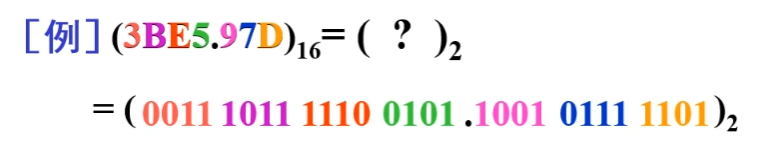
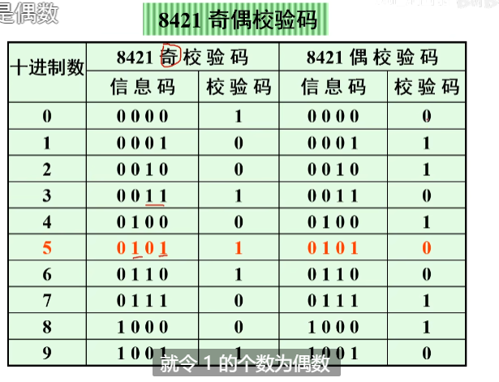
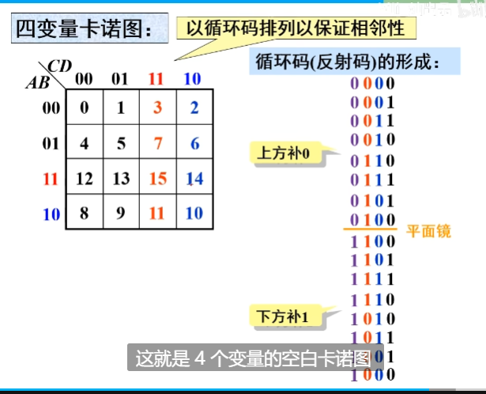
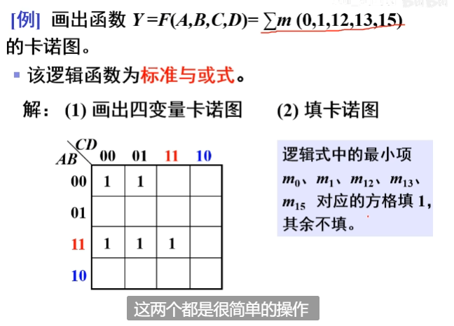
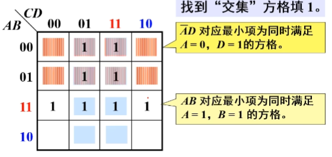
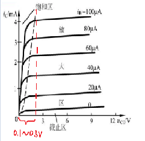
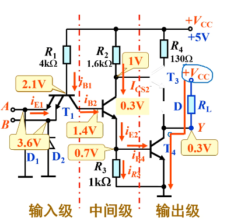

# 1.逻辑代数基础

## 1.1概述

* 电路设计方法:
  * 传统设计方法: 自下而上, 人工组装, 调试验证修改. 可靠性差, 设计周期长.
  * 现代设计方法: EDA(Electronics Design Automation)技术. 自上而下, 硬件设计软件化. 借助软件设计平台完成仿真布线, 最后下载到芯片. 
    * 常见软件: xilinx公司的foundation.
    * 设计方法:
      * 原理图;
      * verilog HDL硬件语言;
      * 状态机设计

* 数字集成电路的分类:
  * 按照对输入信号响应规则:
    * 组合逻辑电路
    * 时序逻辑电路
  * 按照电路形式
    * 集成电路
    * 分立电路
  * 按照器件
    * TTL电路
    * CMOS电路
  * 按照规模
    * 小规模SSI(10个左右门)
    * 中规模MSI(10~100)
    * 大规模LSI(~1k)
    * 超大规模VLSI(~1w)
    * 甚大规模ULSI(>10w)

* 集成度: 一块芯片所包含门电路的个数.

* 三极管工作状态: 
  * 模拟电路: 线性放大区
  * 数字电路: 饱和/截止.

* 基本数字电路:
  * 组合逻辑电路;
  * 时序逻辑电路(寄存器,计数器,脉冲发生器,脉冲整形电路)
  * A/D转换器, D/A转换器 (这也是基本模拟电路, ofcourse)

## 1.2进制
只提一下转换常用算法.

## 1.3码制
`编码`即用数字的特定组合表达特定信息. 比如unicode编码.
  ### 1.3.1 常用二进制到十进制编码(BCD)

  ### 1.3.2 可靠性编码
即缀在某个编码后面用来确保编码传输后顺序仍然正确.

## 1.4 逻辑运算
与或非,自行复习

* 芯片选取:
  * a
  * a
  * a
  * a
  * 与非门:74LS00

## 1.5 逻辑代数(布尔代数)

  ### 1.5.1定义

布尔代数是一个具有两个元素 `{0, 1}` 的`半环`，定义
* 加法`+`(或`or`运算$\lor$):
  * 0+0 = 0
  * 0+1 = 1+0 =1
  * 1+1 = 1
* 乘法`*`(与`and`运算\land):
  * 0*0 = 0
  * 0\*1 = 1\*0 = 0
  * 1*1 = 1

事实上,`乘法`可以利用`加法`定义出来,两个运算的关系是:
$$
x + y = x * y + 1\\
或者说\\
x * y = x + y + 1
$$

布尔代数的运算满足`加法`和`乘法`的`分配律`、`结合律`和`交换律`，同时存在`加法的单位元0`和`乘法的单位元1`， **但是注意不存在加法逆元和乘法逆元，无法定义减法和除法。**

在这个域的基础上定义了一个运算为`取反` $\urcorner$ , $\urcorner1 := \overline{1} := 0$ , $\urcorner0 := \overline{0} := 1$ ;

#### 1.5.1. 异或

定义运算`异或`$\oplus$

$$A\oplus B := \overline{A}B+A\overline{B}$$

异或符合`交换律`,`结合律`.(证略)

有:
* **和与的分配律**: $A*(B\oplus C)=(AB)\oplus(BC)$
* **和常量有关的运算**:
   $\\ 
   A\oplus1=\overline{A}\\ A\oplus0=A\\  
   A\oplus A=0\\
   A\oplus\overline{A}=0\\
   真值表易证.$
* **因果互换律**:
   $\\若A\oplus B=C, 则有\\
   A\oplus C=B\\
   B\oplus C=A$

#### 1.5.1. 同或

定义运算`同或`$\odot$

$A\odot B\\ 
:= \overline{\overline{A}B+A\overline{B}}\\
:=\overline{A}\,\overline{B}+AB$(见习题1.5.2.5)
同或符合`交换律`.`结合律`.(证略)
显然`异或`和`同或`的关系为互为取反.

在此基础上可以推导出一些常用的结果.
* **同一律**
  
$$
x + x = x
\\
x*x = x
$$

* **互补律**

$$
x + \neg x = 1
\\
x * \neg x = 0
$$

* **德摩根律**
$$
\overline{x*y}=\overline{x}+\overline{y}
\\
\overline{x+y}=\overline{x}*\overline{y}
$$
可用真值表证明.

* **吸收律**

$$
1+x=x
$$
易证, 在与运算中只要有一个1, 结果就一定为1.

  ### 1.5.2 逻辑代数例题和常见定理

#### 1.5.2.1 证明$\quad (x+y)(x+z) = x + yz.$

证明:
$$

\text{LHS} = x^2 + xy + xz + yz \\
= x + xy + xz + yz \\
= x(1+y+z) + yz \\
= \text{(吸收律)} \quad x + yz
$$

#### 1.5.2.2 证明冗余律: $xy + \neg xz + yz = xy + \neg xz$ 

证明:
$$
LHS=xy+\neg xz+yz(x+\neg x) \qquad 同一律\\
=xy+\neg xz+xyz+\neg xyz\\
=xy(1+z)+\neg xz(1+y)\\
=xy+\neg xz \qquad 吸收律\\
$$

*欲使用冗余律化简, 检查成对的x和¬x.*

#### 1.5.2.3 证明冗余律推广:$xy + \neg xz + yzm = xy + \neg xz$

证明:
$$
LHS=(xy+\neg xz)+yzm\\
= (xy+ \neg xz+yz)+yzm \qquad 冗余律\\
= xy+\neg xz+yz(1+m)\\
= xy+\neg xz+yz \qquad 吸收律\\
= xy+\neg xz \qquad 冗余律\\
$$

#### 1.5.2.4 证明吸收律2: $x+\neg xy=x+y$

证明:
$$
LHS=(x)+\neg xy\\
=(x+xy+x\neg x)+\neg xy \  逆吸收律\\
=x^2+xy+x\neg x+\neg xy\\
=(x+y)(x+\neg x)\\
=x+y
$$

#### 1.5.2.5 证明同或拆解式: 
$\overline{A\overline{B}+\overline{A}B}=\overline{A} \,\overline{B}+AB$

事实上 $\overline{A\overline{B}+\overline{A}B}$即为 **同或** $\odot$,

=$A\odot B$

或者说是**亦或(⊕)非**

=$\overline{A\oplus B}$

*证明*:
$$
LHS=\overline{A\overline{B}}*\overline{\overline{A}B} \qquad 德摩根律\\
=(\overline{A}+\overline{\overline{B}})
*
(\overline{\overline{A}}+\overline{B})  \qquad 德摩根律\\
=(\overline{A}+B)(A+\overline{B})\\
=A\overline{A}
+\overline{A} \,\overline{B}
+BA
+B\overline{B}\\
=\overline{A} \,\overline{B}+AB \quad 同一律
$$

  ### 1.5.3 反演规则和对偶规则

显然反演规则其实就是摩根律.

#### 1.5.3.2对偶规则

对于任何一个逻辑表达式F，如果将式中所有的“·”换成“+”，“+”换成“·”，“0”换成“1”，“1”换成“0”，有**F=F'**，表达式F'称为F的**对偶式**。

* 对偶规则的证明：
  

## 1.6逻辑函数的表示方法和转换

  ### 1.6.1 先看一个例子
栗子:

  ### 1.6.2 逻辑函数的表示

   #### 1.6.2.1 逻辑表达式

显然,他们可以通过摩根定律相互转换.

* 与-或表达式最常见, 如常用的**标准与或表达式**.
* 与非-或非表达式也很常见, 因为这样写可以节省芯片门数量.

##### 最小项和最小项(正交)表达式(标准与或表达式)

* 真值表到逻辑式的转换: 利用**最小项表达式**:

   #### 1.6.2.2 逻辑图

   #### 1.6.2.3 波形图

  ### 1.6.3 逻辑函数的化简

   #### 1.6.3.1 化简概述

不同形式的逻辑式有不同的最简式.一般先求**最简与或式**, 然后变换得到所需的最简式.

* **最简与或式** 要求:
  * **乘积项个数**最少,使与门个数最少.
  * **乘积项变量**最少,使与门输入端最少.

* **最简与非-与非式** 要求:
  *  **非号个数**最少, 使与非门个数最少.
  *  **每个非号中变量**最少, 使与门最少.

   #### 1.6.3.2 公式化简法
就是直接在逻辑表达式上进行化简. 缺点是直观性差, 不能保证看出来是最简的.

> 能合并(加法分配律)的合并, 
> 能使用吸收律($1+x=x, x+\neg xy=x+y$)/冗余律($xy + \neg xz + yzm = xy + \neg xz$)就用. 
> 可尝试使用: $*(x+\neg x)$, 使用德摩根率拆解或合并,;
> 不能合或者拆, 就使用冗余律多出来一个冗余项试一试 .
> 

 
 
   ##### 1.6.3.3 卡诺图化简法

用卡诺图化简得到的结果一定是最简的.

   ###### 1.空白卡诺图的画法
空白卡诺图就是一个表格, 每个格子对应一个最小项, 且相邻格子要求只有一个变量互为反变量.

* 相邻最小项

* 卡诺图组成

* 有些书本纵向画三变量卡诺图.

一个空白卡诺图卡诺图的目的就是在表中填入n变量的$2^n$个最小项, 使**相邻项**满足**相邻性**(只有一个变量互为反变量,其他相同)

   ###### 2.把一个具体的逻辑函数填入到卡诺图中

* 这里找交集实际上就和你×个$(C+\overline{C})(D+\overline{D})$化成标准最小式是一样的.

   ###### 3. 用填好的卡诺图化简逻辑函数 

* 化简两个1

* 化简四个1

* 化简八个1

* 实例:

变量和反变量的卡诺图，`0`和`1`互换. 所以,如果卡诺图中全是1, 0很少, 可以先求出来反变量, 把0画出卡诺圈.

  ### 1.6.4 有约束逻辑变量

 
* 有约束逻辑变量的化简

# 2.门电路

## 2.0 概述, 以及模电复习

---
---
---
---

* 补充思路1: **BJT导通的条件判断**:
  * 1.最基础的: 发射结正偏集电结反偏.
    * BJT的工作状态:  (导通)
      * 放大: 发射结导通, 集电结截止
      * 饱和: 发射结和集电结都导通.
      * 截止: 发射结和集电结都截止.
      * 倒置: 发射结截止, 集电结导通.

  * 2.看ib. (即从输出特性ic-uce曲线出发) 如果ib足够大, 那麽此时管子一定导通了.
      

* 补充思路2: **判断二极管导通顺序**
最简单的, 初始时管压降大的先导通.
如果某条支路串了两个二极管, 那麽它们初始时假设**平均分压**.

* 补充思路3: **uce或者说ubc的大小是多少?**

BJT的集电结电压大小取决于工作状态. 因为导通情况下, uce是一个变量. 但是在饱和区, uce有一个所谓的典型值uces, 它约等于**0.1v--0.3v**.

这在输出特性曲线上很容易理解:

* 补充思路4: **用数电思维来看三极管**
即, 数电中的BJT一般所谓`导通`就是`深度饱和`, 或者`断开`就是`截止`. 

前者可以看成ce极几乎拉平(uce≈0.1v), 后者可以看成bce三个端子都断开.

---
---
---
---

## 2.2 基本逻辑门电路(与或非)

## 2.3 TTL集成门电路
`Transistor-Transistor-Logic`
输入端和输出端都用三极管的逻辑门电路.
即MOS管互补对称构成的逻辑门电路.

  ### 2.3.1 TTL与非门

   #### 1.结构图：

TTL与非门的结构可以分为三部分来分析。
* **输入级**
  
  

* **中间级**和**输出级**

T2管起到**倒相**作用: 其C极和E极输出相反的信号.

   #### 2.工作原理
* 假设导通时,BJT有发射结管压降Ube=0.7V, Uce=0.3V, **深度饱和**时(基极电流ib有够大, 已经比集电极电流ic大好多)Uces不再是0.3V, 而是uces=0.1V. 同时忽略D1, D2(他们只是保护作用)

分析:

##### Ⅰ当输入端AB其中至少一个为低电平0.3v(这一共包含三种情况)时:

我们假设T1(任何一个)导通, 
AB端电平更低的那个发射结优先导通,
ube=0.7v, **钳位效应得到T1管ub≡0.3v+0.7v=1v.** 也就是说这三种情况是相同的. 

例如, 如果ua=0.3v, ub=3.6v, A端发射结导通后钳位效应使得b端发射结截止, 但没关系, 有一个导通, 即可视为导通了.

继续分析. 可得R1两端压降4V, 产生T1管的ib=1mA, 这是很大的电流, T1管此时深度饱和导通, uces=0.1v, 从而得到T2管的ub2=0.4v.

由于T2管子此时即使没有其他电流分压, ube也只=ub2=0.4v < 0.7v, 所以T2管此时无法导通. 或者说, T2发射结想导通, 回路路线:
   * 要么经过R3到GND(这条路需要T2的ub至少(R3不分压)为0.7v). 
   * 要么经过T4发射结到GND(这条路需要T2的ub至少为0.7+0.7v)
所以现在T2的ub只有0.4v, 无法导通.

由于T4是T2发射极控制的(因为T4的导通条件是, 要求ube>0.7v, 而T4的ube即为T2的ue), 现在**T2截止, 即bce三端都断开了**, ue低电压, 所以T4也截止了.

再往右看. 该电路中**R2被设计得非常小, 分压可以忽略.** 从而T3的ub ≈ VCC = 5V.

此时T3显然满足
  * 发射结正偏(可以假设输出端接个负载接地, 还没通电流时无压降, T4的ue=0), 
  * 集电结反偏(ubc≈0-)
所以T3导通.

于是得到输出端电压为UY≈5v-0.7v(T3发射结)-0.7v(二极管压降)=3.6v , 即输出高电平1.

##### Ⅱ 当输入端AB均为3. :

此时AB端可以看成一个端子, 然后简化为一个3.6v源.

和Ⅰ不同的是, 此时T1发射结初始时两端电压为5v-3.6v=1.4v, 不再是优先导通的了:
(实际上我们忽略了Ⅰ中判断T步骤)

先分析初始时导通顺序.考虑两条支路:
  * VCC-R1-AB
    * T1两端压降为1.4v.
  * VCC-R1-T2发射结-R3=GND
    * T2两端压降为5v. 
  

于是**T2发射结先导通**, 并**钳位**ube=0.7v, 

此瞬时, T3发射结两端电压为5-0.7=4.3v, 仍然大于T1管子, 所以**按顺序第二个导通的是T3**.  

T3也导通后, 钳位ube=0.7v, 于是T2,T3一起导通, 并且**把ub2电压钳位为0.7+0.7=1.4v**

接下来, T1管子的发射结和集电结争夺顺序, 集电结两端电压更大(5v-1.4v)>1.4v, 于是接下来T1集电结导通, 并**钳位ucb=0.7v**.

此时查看`GND-T3发射结-T2发射结-T1集电结`这条支路, 可知它们三个二极管导通并将ub1钳位为0.7*3=2.1v.

于是T1发射结现在只有ube=2.1-3.4=-1.3v, 无法导通了--**T1发射结反偏, 集电极正偏, 进入了倒置放大状态.**.

事实电路设计上, 此时查看`GND-T3发射结-T2发射结-T1集电结`这条支路, VCC给T2和T3足够的电压, 两个管子均进入**深度饱和**.

最后查看T3管发射结和集电结, 可发现都截止, 

* T3管最后分析, 因为**它必须需经T4才能接地形成回路**, 需要先分析T4才能分析T3.

由于T4饱和, 立即得到uce大概为0.3v, 即**输出低电平.**

此时T4的集电极电流只能由外电路提供, 故称为**灌电流(拉电流)**.

  #### *2.3.1.4 TTL与非门的电气特性

中间是等效电路, 其中BE2, BE4即为T2, T4管的发射结等效二极管.

  ### 2.3.2 TSL门(three-state logic) TTL三态门

   #### 2.3.2.1 TSL电路分析
   * 事实上很多种门都有其三态形式, 大多是在原电路上添加一部分.
   * 三态门有两种:`使能端低电平有效`和`使能端高电平有效`, 我们取低电平有效就是底下有一个非门, 高电平有效的情况就是有俩非门(等效于没有非门).
   * EN信号即为使能(enable)信号. $\overline{EN}$即表示需要输入0才能使EN=1, 即低电平有效.  使能信号的作用是, 当其为`0`时, 使输出为第三态:`高阻态`.
   * `∇`表示`三态`, 和普通的与非门区别.
   * 可以看出, TSL门在TTL与非门的基础上添加了一个使能信号电路(红色部分).
  

##### Ⅰ使能信号为0(低电平)

当使能信号为0(Q点为0.3v低电平)时, 无论AB输入, 都使T1**深度饱和导通**.
**(事实上, T1管子本身就是一个`与`逻辑.)**

T1的导通, 把T2基极拉到低电平(≈直接连接EN), 于是**T2截止**.

再看下方的使能信号电路:

T5因为经过电阻连着VCC, 故**T5导通**.

(*数电默认发射结导通就是导通, 而且没有其他例外的话就是饱和导通 (集电结也导通) , ce可以看为近乎短路*)

T5的导通, 使C极也被拉到低电平(uce≈0), 于是**T6截止**.

T7同T4, 因为经过电阻连着VCC, 故**T7导通**.

T7的导通. 拉低了T3基极电压, 导致**T3断开**.

再看最后剩下的T4. 因为T2, T3都断开, T4已经悬空(即三端都断开), **T4断开**.

现在因为T3,T4断开, **输出端是悬空的**. 这种状态称为**高阻态**, 既为`Y=Z`. 即可以认为输出端和地之间有极大的电阻, 直接测量输出端的电压得到`0`.

##### Ⅱ 使能信号为1(高电平)

此时(我不知道为什麽,可能是器件参数人为匹配好了吧) **T5处于倒置**, 从而集电结导通.

同时(器件参数人为匹配好保证), T6基极此时电压还足够0.7v, **T6导通**.

T6的导通把T7基极拉到低电位, 从而**T7截止**.

于是此时下方的使能电路不会影响上方了, **电路退化为TTL与非门**.

   #### 2.3.2.2 TSL门的应用 

   
## 2.4 CMOS集成门电路

* `TTL门电路`相对`COMS集成门电路`的缺点, 其实就是`BJT`相比`MOSFET`的缺点.
  * 老调重弹: 功耗高, 器件电路复杂, 

# 3.组合逻辑电路
包含加法器, 编码器, 译码器, 分配器, 选择器

# 4.触发器 Flip Flop
是一个具有记忆功能的器件.

# 5.时序逻辑电路
和组合逻辑电路的区别就是有没有触发器, 和时间有关. 多出来的部件有 计数器, 寄存器.

时序, 即`CP`(cyclic prefix,循环前缀)

## 5. 触发器

定义: 
  * 要求有两个稳定的状态(`0`,`1`), 来表示存储内容.
  * 能够`接收`,`保存`,`输出`信号. 

分类:
* 按照电路结构
  * 基本
  * 同步
  * 边沿
* 按照逻辑功能
  * RS
  * JK
  * D
  * T(T')

  ### 基本RS触发器(基本触发器)
实际上就是来自`双稳态电路`.

现态和次态:
* `现态`即触发器接收输入信号之前的01状态
* `次态`即触发器接收输入信号之后的01状态.

# 6.脉冲产生与整形电路