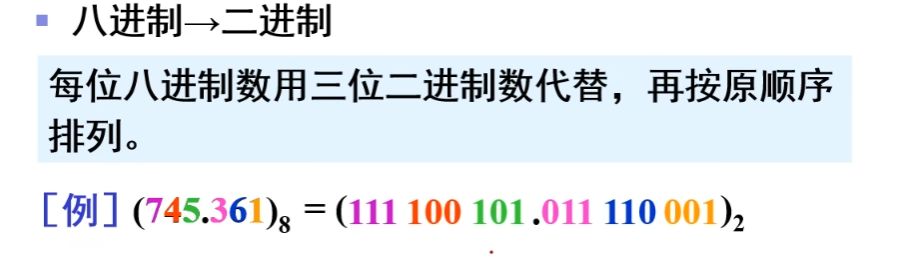
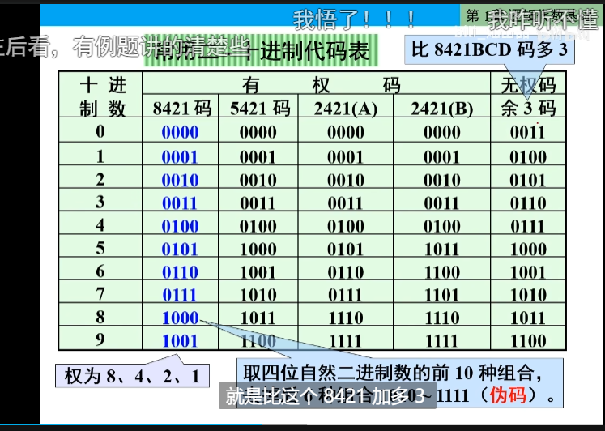
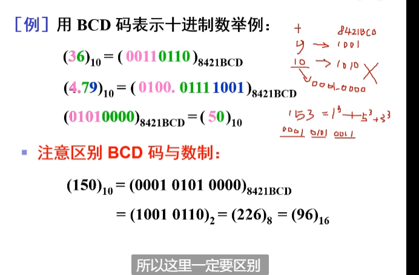
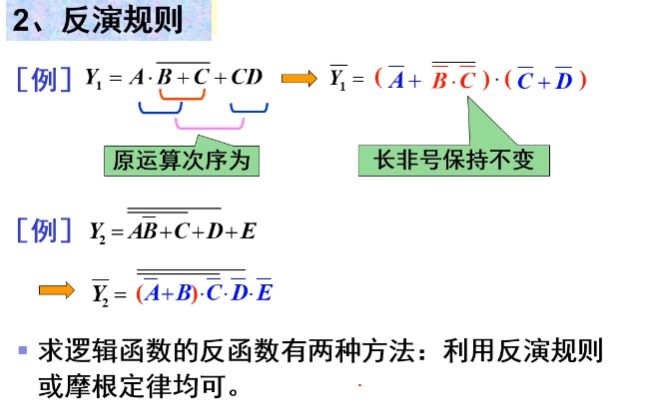
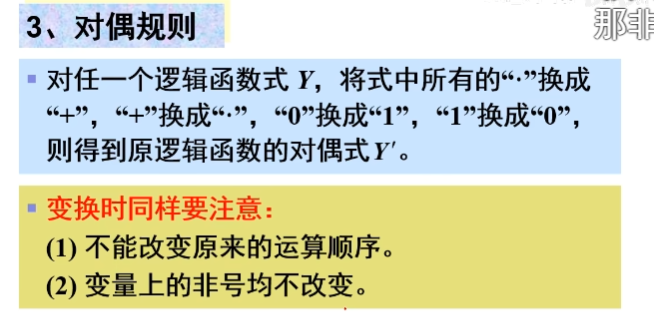
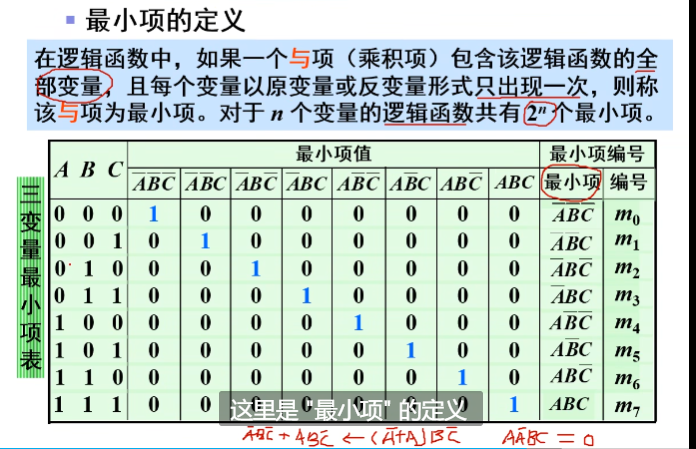
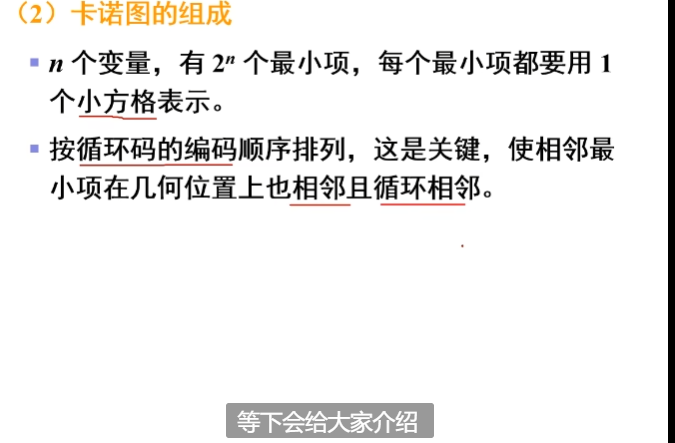
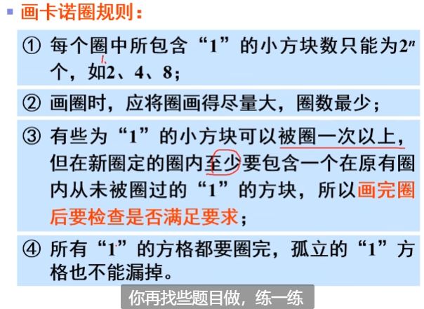
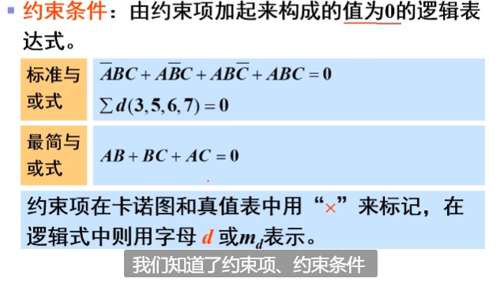

# 1.逻辑代数基础

## 1.1概述

* 电路设计方法:
  * 传统设计方法: 自下而上, 人工组装, 调试验证修改. 可靠性差, 设计周期长.
  * 现代设计方法: EDA(Electronics Design Automation)技术. 自上而下, 硬件设计软件化. 借助软件设计平台完成仿真布线, 最后下载到芯片. 
    * 常见软件: xilinx公司的foundation.
    * 设计方法:
      * 原理图;
      * verilog HDL硬件语言;
      * 状态机设计

* 数字集成电路的分类:
  * 按照对输入信号响应规则:
    * 组合逻辑电路
    * 时序逻辑电路
  * 按照电路形式
    * 集成电路
    * 分立电路
  * 按照器件
    * TTL电路
    * CMOS电路
  * 按照规模
    * 小规模SSI(10个左右门)
    * 中规模MSI(10~100)
    * 大规模LSI(~1k)
    * 超大规模VLSI(~1w)
    * 甚大规模ULSI(>10w)

* 集成度: 一块芯片所包含门电路的个数.

* 三极管工作状态: 
  * 模拟电路: 线性放大区
  * 数字电路: 饱和/截止.

* 基本数字电路:
  * 组合逻辑电路;
  * 时序逻辑电路(寄存器,计数器,脉冲发生器,脉冲整形电路)
  * A/D转换器, D/A转换器 (这也是基本模拟电路, ofcourse)

## 1.2进制
只提一下转换常用算法.

## 1.3码制
`编码`即用数字的特定组合表达特定信息. 比如unicode编码.
  ### 1.3.1 常用二进制到十进制编码(BCD)

  ### 1.3.2 可靠性编码
即缀在某个编码后面用来确保编码传输后顺序仍然正确.

## 1.4 逻辑运算
与或非,自行复习

* 芯片选取:
  * a
  * a
  * a
  * a
  * 与非门:74LS00

## 1.5 逻辑代数(布尔代数)

  ### 1.5.1定义

布尔代数是一个具有两个元素 `{0, 1}` 的`半环`，定义
* 加法`+`(或`or`运算$\lor$):
  * 0+0 = 0
  * 0+1 = 1+0 =1
  * 1+1 = 1
* 乘法`*`(与`and`运算\land):
  * 0*0 = 0
  * 0\*1 = 1\*0 = 0
  * 1*1 = 1

事实上,`乘法`可以利用`加法`定义出来,两个运算的关系是:
$$
x + y = x * y + 1\\
或者说\\
x * y = x + y + 1
$$

布尔代数的运算满足`加法`和`乘法`的`分配律`、`结合律`和`交换律`，同时存在`加法的单位元0`和`乘法的单位元1`， **但是注意不存在加法逆元和乘法逆元，无法定义减法和除法。**

在这个域的基础上定义了一个运算为`取反` $\urcorner$ , $\urcorner1 := \overline{1} := 0$ , $\urcorner0 := \overline{0} := 1$ ;

#### 1.5.1. 异或

定义运算`异或`$\oplus$

$$A\oplus B := \overline{A}B+A\overline{B}$$

异或符合`交换律`,`结合律`.(证略)

有:
* **和与的分配律**: $A*(B\oplus C)=(AB)\oplus(BC)$
* **和常量有关的运算**:
   $\\ 
   A\oplus1=\overline{A}\\ A\oplus0=A\\  
   A\oplus A=0\\
   A\oplus\overline{A}=0\\
   真值表易证.$
* **因果互换律**:
   $\\若A\oplus B=C, 则有\\
   A\oplus C=B\\
   B\oplus C=A$

#### 1.5.1. 同或

定义运算`同或`$\odot$

$A\odot B\\ 
:= \overline{\overline{A}B+A\overline{B}}\\
:=\overline{A}\,\overline{B}+AB$(见习题1.5.2.5)
同或符合`交换律`.`结合律`.(证略)
显然`异或`和`同或`的关系为互为取反.

在此基础上可以推导出一些常用的结果.
* **同一律**
  
$$
x + x = x
\\
x*x = x
$$

* **互补律**

$$
x + \neg x = 1
\\
x * \neg x = 0
$$

* **德摩根律**
$$
\overline{x*y}=\overline{x}+\overline{y}
\\
\overline{x+y}=\overline{x}*\overline{y}
$$
可用真值表证明.

* **吸收律**

$$
1+x=x
$$
易证, 在与运算中只要有一个1, 结果就一定为1.

  ### 1.5.2 逻辑代数例题和常见定理

#### 1.5.2.1 证明$\quad (x+y)(x+z) = x + yz.$

证明:
$$

\text{LHS} = x^2 + xy + xz + yz \\
= x + xy + xz + yz \\
= x(1+y+z) + yz \\
= \text{(吸收律)} \quad x + yz
$$

#### 1.5.2.2 证明冗余律: $xy + \neg xz + yz = xy + \neg xz$ 

证明:
$$
LHS=xy+\neg xz+yz(x+\neg x) \qquad 同一律\\
=xy+\neg xz+xyz+\neg xyz\\
=xy(1+z)+\neg xz(1+y)\\
=xy+\neg xz \qquad 吸收律\\
$$

*欲使用冗余律化简, 检查成对的x和¬x.*

#### 1.5.2.3 证明冗余律推广:$xy + \neg xz + yzm = xy + \neg xz$

证明:
$$
LHS=(xy+\neg xz)+yzm\\
= (xy+ \neg xz+yz)+yzm \qquad 冗余律\\
= xy+\neg xz+yz(1+m)\\
= xy+\neg xz+yz \qquad 吸收律\\
= xy+\neg xz \qquad 冗余律\\
$$

#### 1.5.2.4 证明吸收律2: $x+\neg xy=x+y$

证明:
$$
LHS=(x)+\neg xy\\
=(x+xy+x\neg x)+\neg xy \  逆吸收律\\
=x^2+xy+x\neg x+\neg xy\\
=(x+y)(x+\neg x)\\
=x+y
$$

#### 1.5.2.5 证明同或拆解式: 
$\overline{A\overline{B}+\overline{A}B}=\overline{A} \,\overline{B}+AB$

事实上 $\overline{A\overline{B}+\overline{A}B}$即为 **同或** $\odot$,

=$A\odot B$

或者说是**亦或(⊕)非**

=$\overline{A\oplus B}$

*证明*:
$$
LHS=\overline{A\overline{B}}*\overline{\overline{A}B} \qquad 德摩根律\\
=(\overline{A}+\overline{\overline{B}})
*
(\overline{\overline{A}}+\overline{B})  \qquad 德摩根律\\
=(\overline{A}+B)(A+\overline{B})\\
=A\overline{A}
+\overline{A} \,\overline{B}
+BA
+B\overline{B}\\
=\overline{A} \,\overline{B}+AB \quad 同一律
$$

  ### 1.5.3 反演规则和对偶规则

显然反演规则其实就是摩根律.

#### 1.5.3.2对偶规则

对于任何一个逻辑表达式F，如果将式中所有的“·”换成“+”，“+”换成“·”，“0”换成“1”，“1”换成“0”，有**F=F'**，表达式F'称为F的**对偶式**。

* 对偶规则的证明：
  

## 1.6逻辑函数的表示方法和转换

  ### 1.6.1 先看一个例子
栗子:

  ### 1.6.2 逻辑函数的表示

   #### 1.6.2.1 逻辑表达式

显然,他们可以通过摩根定律相互转换.

* 与-或表达式最常见, 如常用的**标准与或表达式**.
* 与非-或非表达式也很常见, 因为这样写可以节省芯片门数量.

##### 最小项和最小项(正交)表达式(标准与或表达式)

* 真值表到逻辑式的转换: 利用**最小项表达式**:

   #### 1.6.2.2 逻辑图

   #### 1.6.2.3 波形图

  ### 1.6.3 逻辑函数的化简

   #### 1.6.3.1 化简概述

不同形式的逻辑式有不同的最简式.一般先求**最简与或式**, 然后变换得到所需的最简式.

* **最简与或式** 要求:
  * **乘积项个数**最少,使与门个数最少.
  * **乘积项变量**最少,使与门输入端最少.

* **最简与非-与非式** 要求:
  *  **非号个数**最少, 使与非门个数最少.
  *  **每个非号中变量**最少, 使与门最少.

   #### 1.6.3.2 公式化简法
就是直接在逻辑表达式上进行化简. 缺点是直观性差, 不能保证看出来是最简的.

> 能合并(加法分配律)的合并, 
> 能使用吸收律($1+x=x, x+\neg xy=x+y$)/冗余律($xy + \neg xz + yzm = xy + \neg xz$)就用. 
> 可尝试使用: $*(x+\neg x)$, 使用德摩根率拆解或合并,;
> 不能合或者拆, 就使用冗余律多出来一个冗余项试一试 .
> 

 
 
   ##### 1.6.3.3 卡诺图化简法

用卡诺图化简得到的结果一定是最简的.

   ###### 1.空白卡诺图的画法
空白卡诺图就是一个表格, 每个格子对应一个最小项, 且相邻格子要求只有一个变量互为反变量.

* 相邻最小项

* 卡诺图组成

* 有些书本纵向画三变量卡诺图.

一个空白卡诺图卡诺图的目的就是在表中填入n变量的$2^n$个最小项, 使**相邻项**满足**相邻性**(只有一个变量互为反变量,其他相同)

   ###### 2.把一个具体的逻辑函数填入到卡诺图中

* 这里找交集实际上就和你×个$(C+\overline{C})(D+\overline{D})$化成标准最小式是一样的.

   ###### 3. 用填好的卡诺图化简逻辑函数 

* 化简两个1

* 化简四个1

* 化简八个1

* 实例:

变量和反变量的卡诺图，`0`和`1`互换. 所以,如果卡诺图中全是1, 0很少, 可以先求出来反变量, 把0画出卡诺圈.

  ### 1.6.4 有约束逻辑变量

 
* 有约束逻辑变量的化简

# 2.门电路

## 概述

## 2.2 基本逻辑门电路(与或非)

## 2.3 TTL集成门电路
`Transistor-Transistor-Logic`
输入端和输出端都用三极管的逻辑门电路.

## 2.4 CMOS集成门电路
即MOS管互补对称构成的逻辑门电路. 

# 3.组合逻辑电路
包含加法器, 编码器, 译码器, 分配器, 选择器

# 4.触发器 Flip Flop
是一个具有记忆功能的器件.

# 5.时序逻辑电路
和组合逻辑电路的区别就是有没有触发器, 和时间有关. 多出来的部件有 计数器, 寄存器.

时序, 即`CP`(cyclic prefix,循环前缀)

## 5. 触发器

定义: 
  * 要求有两个稳定的状态(`0`,`1`), 来表示存储内容.
  * 能够`接收`,`保存`,`输出`信号. 

分类:
* 按照电路结构
  * 基本
  * 同步
  * 边沿
* 按照逻辑功能
  * RS
  * JK
  * D
  * T(T')

  ### 基本RS触发器(基本触发器)
实际上就是来自`双稳态电路`.

现态和次态:
* `现态`即触发器接收输入信号之前的01状态.
* `次态`即触发器接收输入信号之后的01状态.

# 6.脉冲产生与整形电路