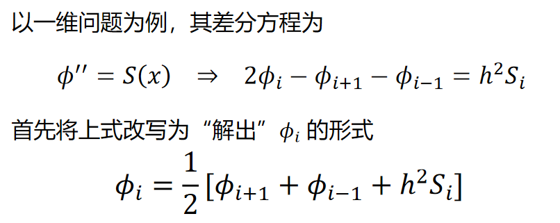
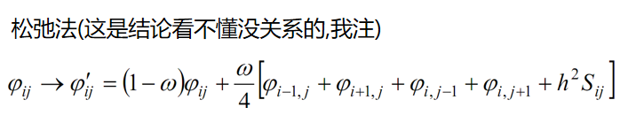

# 1 基础运算

## 1.1 插值 interpolation

### 基本问题：
给出n+1个离散的数据点$\{  (x_0,y_0),(x_1,y_1),(x_2,y_2),...,(x_n,y_n)  \}$, 求一个解析形式的插值函数满足$f(x_i)=y_i$.  
  
最常用的当然是取f为多项式。
 
### 多项式插值
设插值函数为
$$
f(x)=\sum_{i=0}^n a_ix^i  \tag{1.1}
$$

插值要求：$f(x_i)=y_i$,  
即:

$$
\begin{cases}
    a_0 + a_1x_0 + a_2x_0^2 + ... + a_nx_0^n = y_0  \\
    a_0 + a_1x_1 + a_2x_1^2 + ... + a_nx_1^n = y_1 \\
    \vdots \\
    a_0 + a_1x_n + a_2x_n^2 + ... + a_nx_n^n = y_n
\end{cases}
\tag{1.2}
$$

用矩阵表示为：
$$  
\begin{pmatrix}
1 & x_0 & x_0^2 & \dots & x_1^n \\
1 & x_1 & x_1^2 & \dots & x_2^n \\
\vdots & \vdots & \vdots & \ddots & \vdots \\
1 & x_n & x_n^2 & \dots & x_n^n
\end{pmatrix}

\cdot
\begin{pmatrix}
a_0 \\
a_1 \\
\vdots \\
a_n
\end{pmatrix}

=

\begin{pmatrix}
y_0 \\
y_1 \\
\vdots \\
y_n
\end{pmatrix}
$$
解这个关于$(a_0,a_1,...,a_n)$的n+1元n+1次方程组, 得到系数$(a_0,a_1,...,a_n)$, 插值函数$f(x)=\sum_{i=0}^n a_ix^i$也得到，问题得以解决。    

但是直接去解这个方程比较麻烦，$Lagrange$发明了更常用的计算方法，称为$lagrange$插值法。当然，他只是改进了多项式插值直接计算系数的方法，算出的多项式插值系数当然一样的。(同样,Newton插值法也是对计算方法的改进,对具体样本计算出来的多项式函数是确定的。)
### Lagrange插值法
$lagrange$给出：
$$
f(x)=\sum\limits_{i=0}^n y_iA_i(x) \tag{1.4}
$$  

其中
$$
A_i(x)≡\prod\limits_{j=0,j≠i}^n \frac{x-x_j}{x_i-x_j}
\tag{1.5}
$$  

于是求系数方程组的问题, 转变为用已有公式1.5求出n个多项式$A_i(x)$然后乘在一起，计算速度大大提高。  

非常容易验证$lagrange$给出的公式是均过样本点的：事实上，$A_i(x_j)$  实际上要构造出用来筛选的δ函数。它是定义在样本离散点取值上的δ函数$\delta_i(x)$, 满足$\delta_i(x_i)=1$,对其他的样本点为0，注意它对非样本点的x值没有意义。事实上：

$$
A_i(x_j)=\delta_{ij}\tag{1.6}
$$   

从而由式1.4,立即有

$$
f(x_i)=\sum\limits_{i=0}^n y_i \,\delta_{ij} \tag{1.7}
$$
式1.7即为插值样本条件。验证了Lagrange插值多项式的确是过所有样本点的多项式函数。
### Lagrange插值法的matlab代码实现
### Newton插值法
无论直接计算线性方程组，还是使用lagrange插值公式，当样本变动(增加或减少)时，系数将要重算一遍，很不方便。
Newton给出了另一种计算方式，可以在增加一个样本点后，插值多项式独立地增加一项。
### 样条插值 spline interpolation
前面说的插值方法直接拿来对一大段自变量区间来用，因为样本点比较多，插值多项式次数很高，必然产生龙格现象，没办法直接拿来用。  

事实上我们实际使用的都是样条插值（也就是把区间分段然后每一段给出一个(多项式)插值函数然后把它们拼接起来（成为分段函数））。  

最简单的，一次插值，或者说线性插值。就是把所有样本点用直线连起来得到的折线函数。      

实际使用中我们常用三次插值。  
  
matlab的插值命令为interp1(X, Y, Xi， method)。X,Y为样本点向量，Xi为自变量，method可以是 'linear'、'nearest'、'spline' 等。其中 'linear' 是线性插值，'nearest' 是最近邻插值，'spline' 是样条插值(指三次样条插值)，等等。

## 1.2 拟合 fitting
### 基本问题：
给出n个离散的数据点$\{  (x_1,y_1),(x_2,y_2),...,(x_n,y_n)  \}$, 求一个解析形式的拟合函数满足最小二乘原理(残差平方和最小)，即  
$f(x)$，满足$\sum\limits_{i=1} ^n [f(x_i)-y_i]^2$为最小值。  

(这个最小值是n个样本点和f(x)的约定具体形式和参数一起唯一确定的).  
### 多项式拟合 polyfit
最常见的$f(x)$当然也是多项式的形式。  
如果取$f(x)=ax+b$一次(线性)拟合，便是常见的线性最小二乘拟合。  
显然如果取f为n次多项式，那麽拟合便转化为插值(n次多项式可以令f过所有样本点，从而残差平方和为0.

matlab的 [多项式拟合] 指令为polyfit(X, Y, N)，其中X,Y是样本点向量，N为拟合多项式的最高幂次，函数返回拟合多项式的系数向量$(a_0,a_1,...,a_N)$, 于是得到拟合函数$f(x)=\sum\limits_{i=0}^N a_ix^i$

### 指数拟合 
如果试图使用
$$
y=be^{ax} \tag{1.2.1}
$$
函数来拟合n个样本点，考虑先将式1.2.1取对数得
$$
ln(y)=ax+ln(b)
$$
对样本$(x_i, ln(y_i))$进行线性(一次多项式)拟合即可。

## 1.3 数值微分 numerical differentiation&intergration

### 向前数值微分&向后数值微分&中心差分

向前/后数值微分的两点公式：

$$
\begin{cases}
 f'(x)=\frac{f(x + h) - f(x)}{h}             \,\,\,向前差分\\
 f'(x)=\frac{f(x) - f(x - h)}{h}             \,\,\,向后差分 
\end{cases}
\tag{1.3.1}
$$

中心差分
$$
f'(x)=\frac{f(x+h)-f(x-h)}{2h}
\tag{1.3.2}
$$

*注意误差随步长 h 的减小先减小再增大!   
  

利用一阶微分计算方法可以轻松得到二阶.   
如,我们经常利用 __向前微分法__ 配合 __向后微分法__ 得到二阶数值微分:
$$
f''(x)
\xlongequal{\text{向前微分}}
\frac{f'(x+h)-f(x)}{h}\\
~\\
\xlongequal{\text{向后微分}}
\frac{\frac{f(x+h)-f(x)}{h}-\frac{f(x)-f(x-h)}{h}}{h} \\
~\\
=
\frac{f(x+h)+f(x-h)-2f(x)}{h^2}
\tag{1.3.3}$$
式$1.3.3$常称作 __二阶微商应用三点差分近似__ .

### matlab实现数值微分
#### diff函数
diff函数可以用来计算符号微分或数值微分.

## 1.4 数值积分 numerical intergration
### 1.4.1基本问题
用样本形式$\{(x_i,y_i)\}$给出函数
基本思想是根据样本点,把积分区间$(a,b)$分成n个小区间$\{(x_1,x_2),(x_2,x_3),...,(x_n,x_n+1)\}$，每个区间的函数插值近似为特定解析函数，并求出小区间解析函数积分，然后所有小区间积分相加。
### 1.4.2矩形数值积分  
即零次多项式插值积分. 最简单的数值积分. 把每个区间(x_i,x_{i+1})内的函数近似为一个常数$f_i(x)≡y_i$(称为左矩形)或$f_i(x)≡y_{i+1}$(称为右矩形)

从而(左矩形)积分为：

$$
\int_a^b=\sum_{i=1}^n y_i(x_{i+1}-x_i)
$$

右矩形只需要$y_i改为y_{i+1}$即可。

### 1.4.3梯形数值积分
更精确一点的一次多项式插值积分. 把每个区间(x_i,x_{i+1})内的函数近似为直线.  

从而积分为：

$$
\int_a^b=\sum_{i=1}^n \frac{(y_i+y_{i+1})(x_{i+1}-x_i)}{2}
$$

### 1.4.4辛普生数值积分
更精确一点的二次多项式插值积分. 把每个区间(x_i,x_{i+1})内的函数近似为二次多项式.  

matlab实现数值积分:  

integral(@sin, 0.5, 0.6)  

或  f = @(x)x.^2; integral(f, 0, 1)  

或 integral(@(x)x.\2, 0, 1)  

注意：作为integral输入参数的函数句柄必须能够直接作用于矢量，如可以是@(x)x.^2，而不能是@(x)x^2  。

## 1.5 求根

### 1.5.1 基本问题
已知f(x)在区间[a,b]内有根(一般指f(a)f(b)＜0),求出这个根$x_0$. 
### 1.5.2 二分法
思想很简单,取ab中点$x=\frac{a+b}{2}$,如果f(a)f(x)＜0(即根在左半边),就令b=x,如此不断缩小范围,直到b-a小于预设的误差小量δ,即可停止迭代,输出a或b(他们已经迭代到趋于一个点了).  

<pre>
%二分求根
function x_0=BioZero(fun,a,b,epsilon)%fun为目标函数句柄,ab为求根区间,epsilon为精度要求.
while (b-a)>epsilon
    x=(a+b)/2;
    if fun(a)*fun(x)>0
        a=x;
    else
        b=x;
    end
end
x_0=x;
</pre>

一种改进:
给定初值x，初始步长h和精度ε,假设根$x_0$>x,然后往右开始找.

<pre>
%改进的二分求根
function x_0=BioZeroV2(fun,x,h,epsilon)%fun为目标函数句柄,x为求根迭代起始点(＜根x0),h为试探步长,epsilon为精度要求.
%捕获一下步长输入异常(不允许h≤0)
if h<=0
    error('步长设置错误')
end

a=x;b=x+h;  %初始化区间ab,
%接下来让它按h步长一直爬到自身包括零点. 得到一个长度为h的包括零点的区间ab,便于接下来二分求根
while fun(a)*fun(b)>0   
    b=b+h;
    a=a+h;
end
%然后是二分求根
while (b-a)>epsilon
    x=(a+b)/2;
    if fun(a)*fun(x)>0
        a=x;
    else
        b=x;
    end
end
x_0=x;
</pre>

二分法简单易用，只要函数连续就能迭代收敛得根，但是耗时较长。
### 1.5.3 牛顿法(不动点迭代法)
思路是从初始点开始不断做函数曲线切线->交于x轴$x_i$->验证$(x_i,f(x_i))$是否满足$f(x_i)≈0$，否则就从 $(x_i,f(x_i))$继续做切线.
  

  代码实现:
  <pre>
%牛顿法求根
function y=NewtonZero(fun,x1,epsilon)   
%fun是目标函数句柄,x1是迭代起始点.epsilon是精度要求

h=0.01; %设定接下来求一阶导时使用中心差分的步长.

while abs(fun(x1))>epsilon
    x1=x1-fun(x1)/((fun(x1+h)-fun(x1-h))/h);
end
y=x1;
  </pre>
    
牛顿法并不稳定,初值$x$选取不当就会迭代失败. 只有在$x$和$x_0$zhi之间的函数曲线是加速远离0时(如$x>x_0$且$f''＞0$)才能成功.

牛顿法效率最高，但是要求函数解析或者性质良好,容易计算导数。

### 1.5.4 弦割法
弦割法是前面两种方法的折衷，既有较高的效率，又不必像牛顿法那样必须计算函数 f 的导数。 如果初始猜测比较接近待求解，则其收敛速度几乎与牛顿算法一样快。  
其实就是用两个很近的点差分。以$(x_1,f(x_1)),(x_2),f(x_2)$两个点为起始点，开始递推:

$$
x_3=x_2-\frac{f(x_2)-f(x_1)}{x_2-x_1}
$$

代码实现：
<pre>
%弦割法求方程零点
function y=SecantZero(fun,x1,x2,epsilon)
%fun是目标函数句柄,x1,x2是初始点,epsilon是精度.
while abs(fun(x2))>epsilon
        x2=(fun(x2)-fun(x1))/(x2-x1);
        x1=x2;
end
y=x2;
</pre>

如果待求解附近，函数的行为不好，则牛顿法和弦割法都可能无法收敛或收敛到错误的结果。保险的做法是先用二分法初步的定出解的位置，再用牛顿法和弦割法中的一个定出解的精确位置。

### matlab求根指令
fzero() 求单变量函数的零点.
使用zeroin算法（结合了二分法、弦割法以及其它方法的一种综合方法）。

X=fzero(函数句柄，猜测的初始值或搜寻的区间)  

fzero(@sin,[3,4])   %在区间[3,4]内找零点  
fzero(@sin,3)       %从3开始找零点(一般会找到左边最近的零点.)

# 2 ODE初值问题
即给定待求函数在某个初始点上的函数值 (导数值), 求

## 2.1 euler法
### 2.1.1一阶ODE
对形如

$$
\frac{dy}{dx}=f(x,y) 
\tag{2.1.1}
$$ 

初值条件为

$$
 y(x_0)=y_0
\tag{2.1.2}
$$

求$y(x')$处的值, 或者说求这个区间$(x_0,x')$内y的值
的ODE问题, 可以用差分思想.  
将$(x_0,x')$分成n个小区间${(x_1,x_2),(x_2,x_3),...,(x_n,x_{n+1})}$,  步长为$d$.

将式2.1.1写为:

$$
\frac{y(x_{i+1})-y(x_i)}{d}=f(x_i,y_i)
\tag{2.1.3}
$$

从而得到递推关系
$$
y(i+1)=y(i)+df(x_i,y(x_i))
\tag{2.1.4}
$$

于是我们可以由初值条件一步步得到整个区间上的函数估计值$y(x_i)$,步长$d$越小结果越精确.  
代码实现:
<pre>
%定义欧拉法数值微分函数。函数输出y(x1)的值.
function result= euler_diff(f,x0,y0,x1)  % dy/dx=f(x,y); 初值条件y(x0)=y0; 求x1(x1>x0)处的y(x1).

%创建从初值条件点x0到x1的步长向量。
    x=linspace(x0,x1,h);   %创建从初值到所求位置的步长h=0.1的向量

    y=zeros(length(x),1);   %初始化y向量,然后用递推公式填充.       
    y(1)=y0;

    for i=1:(length(y)-1)       
        y(i+1)=h*f(x(i),y(i))+y(i);     %y(x_i+1)和y(x_i)的递推关系

    end
    result=y(length(y));    %输出y向量的最后一个值，即为y(x0)
end
</pre>
### 2.1.2二阶ODE
对于二阶ODE问题,

$$
\frac{d^2y}{dx^2}=f(x,y,y') 
\tag{2.1.5}
$$

初值条件为
$$
\begin{cases}
y(x_0)=y_0 \\
 y'(x_0)=y'_0
\end{cases}
\tag{2.1.6}
$$

可将其拆为一阶问题,用向量形式计算:  
设

$$

\begin{cases}
\frac{dy}{dx}=z(x,y) 
\\

\vec{Y}=
\begin{pmatrix}
y \\
z
\end{pmatrix}\\

\vec{F}=
\begin{pmatrix}
z \\
f
\end{pmatrix}
\end{cases}
\tag{2.1.7} 
$$

则原二阶ODE可写为向量形式的一阶ODE:

$$
\frac{d
\begin{pmatrix}
y \\
z
\end{pmatrix}
}{dx}=
\begin{pmatrix}
z \\
f
\end{pmatrix}
\tag{2.1.8}
$$

即:

$$
\frac{d\vec{Y}}{dx}=\vec{F}(x,y) 
\tag{2.1.9}
$$

* 约定简写$f(x_i,y_i,y'_i)≡f_i$
  
依据式2.1.3, 有差分方程:

$$
\frac{\vec{Y_{i+1}}-\vec{Y_i}}{d}=\vec{F_i} 
\tag{2.1.10}
$$

即递推公式:

$$
\begin{pmatrix}
y_{i+1} \\
z_{i+1}
\end{pmatrix}
=
\begin{pmatrix}
y_{i} \\
z_{i}
\end{pmatrix}+
d\begin{pmatrix}
z_{i} \\
f_{i}
\end{pmatrix}
\tag{2.1.11}
$$
或
$$
\vec{Y}_{i+1}=\vec{Y_i}+d\vec{F_i} 
\tag{2.1.12}
$$

而初值条件给出了$y_1,z_1,$即$\vec{Y}_1$.$\vec{F}中的z_1和f_1=f(x_1,y_1,z_1)$也是已知的 (注意z≡y') ,迭代等式2.1.12右边的于是可以迭代, $RHS=RHS(x_i,y_i,z_i)$, $LHS=LHS(x_i,y_i,z_i)$, 迭代便可以进行下去了.

代码实现:
<pre>
% 二阶(second order)ODE初值问题欧拉法函数
% (设x=y'(t).),y''(t)=f(t,y,y'),初值条件y(t0)=y0,y'(t0)=dy0=x(t0).
function y=Euler2nd(fun,y0,dy0,t)
%fun为问题中的f(t,y,y'),%y0,x0为初值条件,x为待求区间自变量的等间隔向量

%初始化
len=length(t);
x=zeros(1,len);x(1)=dy0;
y=zeros(1,len);y(1)=y0;
f=zeros(1,len);f(1)=fun(t(1),y0,dy0);
h=t(2)-t(1);    %步长

%写为向量形式
Y=[y;x];
F=[x;f];
%开始迭代
for i=1:len-1
    Y(:,i+1)=Y(:,i)+h.*F(:,i);    %向量形式的迭代公式
%需要手动更新向量.
    f(i+1)=fun(t(i+1),y(i+1),x(i+1));
    x(i+1)=Y(2,i+1);
    y(i+1)=Y(1,i+1);
    F=[x,f];    
end
</pre>

$exapmle:$  

求问题$\frac{d^2y}{dx^2}=-4y,y(0)=1,y'(0)=0$  

代码实现(利用上面编写的函数):
<pre>
%example 利用编写的Euler2nd函数,即欧拉法,
% 解二阶ODE初值问题d^2y/dx^2=-4pi^2y,初值y(0)=1,y'(0)=0,求解区间(0,10)
f=@(t,y,x) (-4*(pi^2)*y);
t=0:0.01:10;
y=Euler2nd(f,1,0,t);
plot(y);
</pre>

## 2.2 多步法Multistep methods
原理:  
事实上, 原微分方程2.1.1可以写为

$$
y_{i+1}-y_i=\int_{x_i}^{x_{i+1}} f(x) dx
\tag{2.2.1}
$$

euler法求微分方程,事实上是令上式中的f(x)为零次多项式插值,即$(x_i,x_{i+1})$区间内$f(x)=f(x_i)=const$.   
如果对f(x)使用更加复杂的高次(多项式)插值,可以得到更精确的结果.如对f(x)进行一次(线性)插值:  
利用Lagrange插值公式1.4,1.5,  

对区间$(x_i,x_{i+1})$插值得到
$$
f(x)=\sum_{i,i+1}y_nA_n(x)\\
=f_i(\frac{x-x_{i+1}}{x_i-x_{i+1}})+f_{i+1}\frac{x-x_i}{x_{i+1}-x_i}\\
=f_{i+1}\frac{x-x_i}{d}-f_i\frac{x-x_{i+1}}{d}
\tag{2.2.2}
$$

带入积分公式2.2.1,可求得y的递推公式
$$
y_{i+2}=y_i+d(\frac{3}{2}f_{i+1}-\frac{1}{2}f_i)
\tag{2.2.3}
$$

将 yn+1 不仅仅是同 yn，而且还同更早的点的函数值，如 yn-1, yn-2 等相联系,获得更高的精度!

多步法有个小麻烦：最初几个格点的启动值需要通过其它的积分法如欧拉法、泰勒级数法来获得.

### Adams-Bashforth 二步积分法

代码实现(利用上面编写的函数):
<pre>
%二阶阿当姆斯（Adams）方法数值积分函数.面对ODE问题dy/dx=func,初值条件(x0,y0),这函数接受func,初值y0,和感兴趣的自变量值的数组x(从初值x0按照步长h向右延伸到某个值),输出对应的函数值向量y.
function y = adams2nd(x, y0, func)
len=lenth(x);
y=zeros(1,len); y(1)=y0; %初始化y向量
y(2)=y(1)+h*(func(x(1),y(1)));  %用euler法先求出第二个y(2),来开启二步法.
    
    for i= 2 : len-1    %开始二步法.
        y(i + 1) = y(i) + h * (func(xi(i), y(i)) * 1.5 - func(x(i - 1), y(i - 1)) * 0.5);   %二步法递推公式
    end
end
</pre>

类似有Adams-Bashforth 四步积分法.  
思想就是对一个更大的区间$(x_i,x_{i+4})$内进行四次多项式插值.  

递推公式为(略)

## 2.3 隐式法implicit methods

## 2.4 龙格库塔Runge-Kutta法
思想：为了提高精度，多取几点的斜率值作为加权平均当作平均斜率  
即2.2.1式化为

$$
y_{i+1}-y_i=\int_{x_i}^{x_{i+1}} f(x) dx  \\
=d\overline{f}
\tag{2.2.1}
$$

其中$\overline{f}$为区间$(x_i,x_{i+1})$内y的平均斜率.  
欧拉法将$\overline{f}$取为$f(x_i,y_i)$.  

### 二阶龙格库塔法
$$
\begin{cases}
y_{n+1} = y_n + d\frac{(K_1+K_2)}{2} \\
K_1 = f(x_i, y_i) \\
K_2 = f(x_i + h, y_i + K_1d) \\
\end{cases}
$$

可以理解为使用x_i处y的斜率$K_1 = f(x_i, y_i)$和$x_{i+1}$处y的斜率$K_2 = f(x_i + h, y_i + K_1d)$  (虽然$K_2$计算中使用了$K_1$,可以理解为是$x_{i+1}$处近似的斜率) 的加权斜率$\frac{(K_1+K_2)}{2}$带入2.2.1式.

### 四阶龙格库塔法
通常认为四阶Runge-Kutta法在效率和精度间达到了最好的平衡.
$$
\begin{cases}
y_{n+1} &= y_n &+ d\frac{(K_1+2K_2+2K_3+K_4)}{6} \\
K_1 &= f(x_i,& y_i) \\
K_2 &= f(x_i + \frac{1}{2}h ,&  y_i + \frac{1}{2}K_1) \\
K_3 &= f(x_i + \frac{1}{2}h ,&  y_i + \frac{1}{2}K_2 ) \\
K_4 &= f(x_i + h ,& y_i + hK_3)
\end{cases}
$$

### 例子：四阶Runge-Kutta法处理一阶常微分方程

代码实现:
<pre>
%四阶龙格库塔函数
function y=RK4(fun,y0,x0,x1,h)
%fun指代原问题RHS:dy/dx=fun(x,y),y0,x0是初值条件,区间(x0,x1)是感兴趣的求解区间,函数输出这个区间内的函数值向量.
x=x0:h:x1;  
y=zeros(1,length(x));
y(1)=y0;
for i=1:length(x)
    K1 =fun(x(i),y(i));
    K2 =fun(x(i) + h/2, y(i) + h*K1/2 ); 
    K3 =fun(x(i) + h/2, y(i) + h*K2/2 ); 
    K4 =fun(x(i) + h, y(i) + h*K3 ); 
    y(i+1)=y(i) + 1/6*h*(K1 + 2*K2 + 2*K3 + K4 );
end
end
</pre>

## *2.5 算法的稳定性
线性差分方程的通解正是这两个指数解的一个线性组合。虽然可以精心安排初值 y0 和 y1， 使得当 x 值小时只呈现指数衰减的解，但是在递推过程中的舍入误差将会掺入一个小的“坏”解，它最后将增长到在解中占压倒地位。  
一个好的经验规则是，每当积分一个随着迭代过程急剧衰减的解时，就应当小心不稳定性和舍入误差。

# 3 ODE边值问题&本征值问题
在区间的两个端点上对待求函数各施加一个约束，这样方程的解就能唯一的确定，这类问题称为边值问题。  

在区间的两个端点上对待求函数各施加一个约束。方程存在一个待定参数，只有当待定参数取特定值的时候，方程才存在非零解，这类问题称为本征值问题。

设$\phi(x)=Asin(kx),$由边界条件$\phi(1)=Asin(k)=0$,这要求$k_n=n\pi,n=1,2,3...$对应的本征函数$\phi_n(x)=sin(k_nx).$

边值问题和本征值问题的一般形式:
$$
\frac{d^2y}{dx^2} + k^2x=
$$

## 3.1 numerov算法
可以用来解决形如

$$
\frac{d^2y}{dx^2}+k(x)y=s(x)
\tag{标准方程}
$$

初值条件为

$$
y(x_0)=y_0,  y'(x_0)=y'_0
$$

给出$y_{i+1},y_i,y_{i-1}$的递推公式：  

$$
y_{i+1} = \frac{1}{{1+k_{i+1}h^2/12}}[(s_{i+1} + 10s_i + s_{i-1})h^2/12 - (1+k_{i-1}h^2/12)y_{i-1} + 2(1-k_i5h^2/12)y_i]
$$

这个算法比四阶Runge-Kutta算法高一个精度，而且Numerov算法更有效率，因为每一步只需要在一个格点上计算 k2 和 S。

代码实现:
<pre>
%numerov法解标准方程d^2y/dx^2+k(x)y=s(x)的初值问题y(x0)=y0,y'(x0)=y'0
function y=numerov(kf,sf,y1,y2, x)
% kf, sf 均为函数句柄，其中 kf 为标准方程中的k(x)，sf 为标准方程中的 S(x)
% y1, y2 为头两个格点的函数值
% x 为自变量的等间隔序列

y(1)=y1;y(2)=y2;
h=x(2)-x(1);
s=sf(x);  k=kf(x);
 
for i = 2:length(x)-1
    y(i+1)=((s(i+1)+10*s(i)+s(i-1))*h^2/12  -   (1+k(i-1)*h^2/12)*y(i-1)  +  2*(1-k(i)*5*h^2/12)*y(i)) / ((1+k(i+1)*h^2/12));
end
</pre>

仍用当初我们在2.2欧拉法求二阶方程那里的例子,现在用我们编写好的numerov法解决:

$exapmle:$  

求问题$\frac{d^2y}{dx^2}=-4y,y(0)=1,y'(0)=0$  

代码实现(利用上面编写的函数):
<pre>
%example 利用编写的Euler2nd函数,即欧拉法,
% 解二阶ODE初值问题d^2y/dx^2=-4pi^2y,初值y(0)=1,y'(0)=0,求解区间(0,10)
f=@(t,y,x) (-4*(pi^2)*y);
t=0:0.01:10;
y=Euler2nd(f,1,0,t);
plot(y);
</pre>

## 3.3 打靶法求边值问题
考虑下面的边值问题：

$$
\begin{cases}
y''=f(y,y',x) \\
y(a)=y_a, y(b)=y_b
\end{cases}
$$

不同于常微分方程,边值问题的定解条件分散在两个端点上,无法直接启动传递递推关系进行计算$y_{i+1}=y_i$

## 3.4 打靶法求本征值问题

## 3.5 求解一维薛定谔方程

# 4 蒙特卡罗monteCarlo方法
一般来说，涉及到随机性的模拟方法都可称之为蒙特卡罗方法。通常也称为统计模拟方法。  
蒙特卡罗方法的名字来源于摩纳哥的一个城市蒙特卡罗（Monte Carlo） ，该城市以赌博业闻名。

## 4.1 蒙特卡洛法计算定积分
基本思想:

有待解决的问题:  
函数在积分区间内起伏很大时，积分误差也相应的很大。(Monte Carlo求积中的误差正比于被积函数的标准偏差。)

在这些被积函数值为0的区域撒点没有意义，浪费算力。

## 4.2特定分布的随机变量的产生

当计算pi的值时,可以简单在平面区域内均匀生成随机数. 但是在其他情况(比如蒙特卡洛法计算积分) 如果对实际上处于复杂的概率密度$\rho(x)$分布的随机变量, 简单地使用均匀抽样得到随机点进行蒙特卡洛模拟, 误差会非常大.

亟待解决的问题:  

我们想在(a,b)区间生成按照概率密度(pdf)$\rho(x)$分布的随机数.  

### 4.2.1 直接法：如果我们可以求出pdf的cdf并求反函数, 直接变量代换便解决问题.

例如希望对变量x,在(0,1)内取点的概率密度为$\rho(x)\sim e^{-x}\xrightarrow{归一化}\rho(x)=\frac{1}{1-e^{-1}} e^{-x}$  
取变量$y$,在$y\in(y(0),y(1))$内均匀产生随机数点.假设有单射$y=y(x)$, 对y生成的均匀随机数点符合我们想要的x的分布.  
则有:
$$
dy=\rho(x)dx  \\
\tag{4.2.1}
$$

从而
$$
\rho(x)=\frac{dy}{dx}\tag{4.2.2}
$$
$$
y(x)=-e^{-x}+const
$$
不妨令$y(0)=0$, 从而
$$
y(x)=-e^{-x}+1      \tag{4.2.3}
$$ 
于是$y(1)=1-e^{-1}$, 我们只需要在$y\in(0,1-e^{-1})$内均匀取随机数点,然后换算为$x=-ln(1-y)$, 问题解决.

### 4.2.2接受拒绝采样法 Accept Reject Sampling

当无法求出CDF或求出CDF后无法求出反函数时,需要另寻他法.

__接受拒绝采样法 Accept Reject Sampling__  
 基本思想: 选择$\rho(x)$主要分布的区域, 比如对标准高斯分布可以取(-100,100),当作otherwise $\rho(x)=0$ ,  对这个区域进行均匀随机数抽样得到$a$, __再加上一次接受拒绝检验__:

从$\rho(x)$的值域从0到最高点进行一次均匀随机函数值采样得到$b$, 如果
$$
\begin{cases}
\rho(a)＞b→接受随机抽样a.\\
\rho(a)＜ b→拒绝随机抽样a.\\
\end{cases}
$$

这很好理解: 由于当$a$在$\rho(x)$在波峰位置时, 有很大概率大于b从而被接受, 从而实现了令$\rho(x)$在峰值处取样权重很大的效果.  
事实上,这个方法本质上是二位平面随机取样,函数图像以下为接受域.

$$
\tag{图4.2.3}
$$  

样本接受概率便是蓝色面积/全部面积,在本例中大概是20%.

代码实现:
<pre>
%接受拒绝采样法 Accept Reject Sampling 生成特定分布的随机取样
clear all;
pdf=@(x)(exp(-(x.^2)/5)).*((3*(cos(x)).^2).*((sin(4.*x)).^2)+2*(sin(x+6)).^2);
%简单分析plot(pdf(-10:0.01:10))函数图像可知,该函数主要分布区域(-5,5),最大值大概为3.22.
pdfmax=3.22;
lower_limit = -5;    % 区间的下限
upper_limit = 5; % 区间的上限

N=1000;
x(1:N)=10 * ones(1, N);
for i=1:N
    while x(i)==10  %循环取样,直到成功一次.
        a=lower_limit+(upper_limit-lower_limit)*rand;   %在pdf主要分布区域(-5,5)区间上均匀抽样a
        b=rand*(3.22);  %在pdf值域区间上均匀抽样b
        if(pdf(a)>b)
            x(i)=a;
        end
    end
 
end
figure;
histogram(x,'NumBins',100);
hold;
plot((-10:0.01:10),pdf((-10:0.01:10)));%同时画出我们得到的x点分布直方图和函数曲线来比较效果.
</pre>

我们刚刚所做的是粗暴地用一个简单的均匀分布函数
$$
g(x)=
\begin{cases}
pdf_{max},&x\in[-5,5]\\
0,&otherwise
\end{cases}
$$
来从上方覆盖pdf,即$g(x)>pdf(x)恒成立$  
(我们这里的 $proposal~distribution~g(x)$ 和 $target~distribution~pdf(x)$是未归一化的, 不过我们的过程似乎也不需要归一化啦~)

这样做会使接受率比较低,可能产生随机数的效率不高.  
显然,如果我们能取$g(x)$满足
* 仍然像均匀分布一样易于用已有方法生成取样,比如gauss分布已经有成熟的方法生成随机数;
* 在恒大于$pdf(x)$的同时,形状和$pdf(x)$比较吻合, 从而使图4.2.3中蓝色面积(接受域)相比红色面积(拒绝域)更大;    

就可以令接受率更高,更快地产生我们需要的分布的随机数.
此时步骤为:
* 按照g(x)分布得到一个随机数a;
* 按照函数值(0,g(a))上均匀分布得到一个随机数b;
* 比较 __目标分布函数值pdf(a)__ 和 __提议分布函数值抽样b__ 的大小, 如果$pdf(a)＞b$,  接受抽样点a.
    
      

代码实现:
<pre>
%改进后的(选取了合适的高斯函数作为proposal distribution g(x))接受拒绝采样法 Accept Reject Sampling 生成特定分布的随机取样
clear all;

g=@(x)9*normpdf(x./2);
pdf=@(x)(exp(-(x.^2)/5)).*((3*(cos(x)).^2).*((sin(4.*x)).^2)+2*(sin(x+6)).^2);

%测试一下我们选的g(x)合不合适.
j=-10:0.01:10;  %画函数图像用测试向量
plot(j,g(j))
hold;
plot(j,pdf(j))
%看pdf和g函数图像可知,选取g(x)=9*normpdf(x./2)正态分布是合适的.

N=1000;
x(1:N)=10 * ones(1, N);
for i=1:N
    while x(i)==10  %循环取样,直到成功一次.
        a=randn*2;   %生成按照g(x)分布的随机数.
        b=rand*g(a);  %在(0,g(a))值域区间上均匀抽样b
        if(pdf(a)>b)
            x(i)=a;
        end
    end 
end
figure;
histogram(x,'NumBins',100);
hold;
plot((-10:0.01:10),pdf((-10:0.01:10)));%同时画出我们得到的x点分布直方图和函数曲线来比较效果.

</pre>

*有时候这种方法也称为on Neumann 舍选法.
设我们对产生在 0 和 1 之间按 $\rho(x)$ 分布的 x 有兴趣，并令 w '(x)是一个正函数，并且在积分区域上 w '(x) > w(x)。

### 4.2.3 离散化法
数值方法即把式4.2.2转化为离散化:  
取(0,1)内的均匀离散点$\{y_1,y_2,...,y_n\},其中y_i=\frac{i}{n}$  
从而4.2.2式转化为
$$
\frac{y_{i+1}-y_i}{x_{i+1}-x_i}=\rho(x_i)\tag{4.2.2}
$$
$y_i$是已知的,x_1=0,故可以开始迭代:
$$
x_{i=1}=x_i+\frac{1/n}{\rho(x_i)}
$$
从而从集合$\{y_1,y_2,...,y_n\}$中以等概率选取一个$y_i$，对应的$x_i$就是一个按$\rho(x)$ 分布的随机数。

代码实现:
<pre>

</pre>

### 4.2.4 马尔可夫链蒙特卡罗方法 MCMC Marcov chain Monte Carlo：马尔可夫链和蒙特卡洛随机抽样的结合方法, 能更有力地解决对目标分布生成随机抽样的问题!
前述的接受拒绝采样方法, 采样效率仍然不高, 有时对于尖峰很多的target distribution找不到足够好的proposal distribution.   
这是因为 __这种方法没有充分利用前期的信息__

代码实现：
<pre>
%本程序利用metropolis 算法构造概率分布为exp(-x.^2/2)./sqrt(2*pi) 的点列。
clear all
close all
clc

h=2.2;
w=@(x)exp(-x.^2/2)./sqrt(2*pi);
n = 50000;
x(1) = rand()-0.5;

for i = 1:n
    xt = x(i)+(2*rand()-1)*h;   %生成候选点 xt，它是随机数,范围在x(i)± h 范围内。
    if w(xt) >= w(x(i))         %如果xt的概率密度大于等于当前点 x(i) 的概率密度，就接受 xt 作为下一个样本点
        x(i+1) = xt;
    else
        p=w(xt)/w(x(i));
        if rand < p
            x(i+1) = xt;
        else
            x(i+1) = x(i);
        end
    end
end

hist(x, 19)

figure

c=@(L)(mean(x(1:end-L).*x(L+1:end))-mean(x).^2)/(mean(x.^2) - mean(x)^2);
len = 1:30;
for i = len
    cc(i) = c(i);
end
plot(len, cc)

figure
yy = x(1:25:n);
hist(yy,19)
</pre>

### 赝随机数

## 随机行走

代码实现：
<pre>
nsample = 5000; % 进行 nsample 次不同的随机行走。
N = 100;    % 每次行走步数为 N。

step = [1,0; -1, 0; 0, 1; 0, -1];   % 可选的四种不同的位移矢量
zuobiao_sum(1:N, 1:2) = 0;  %存储总共snample次实验中，每次实验行走的N步中每步的位移之和
r2_sum(1:N) = 0;    %存储总共snample次实验中，每次实验行走的N步中每步的位移之和

for sample =1:nsample   % 进行 nsample 次不同的随机行走。
    zuobiao = [0, 0];       % 每次行走的初始位置为原点
    for i = 1:N             % 行走 N 步
        k = ceil(4*rand); % 随机选择方向 1、2、3、4，注意，ceal(x) 函数返回不小于 x 的最小整数，如 ceal（0.4）= 1.
        zuobiao = zuobiao + step(k,:);    %更新坐标，即在上一步坐标上加上位移矢量。
        zuobiao_sum(i, :) = zuobiao_sum(i, :)+zuobiao; % 所有sample的坐标
        r2 = zuobiao(1)^2 + zuobiao(2)^2;   %本次行走目前距离原点的距离
        r2_sum(i) = r2_sum(i) + r2;
    end
end
r2_average = r2_sum/nsample;            %nsample次实验平均来说，一次行走N步中走到第i步时离原点距离为r2_average(i)
zuobiao_average = zuobiao_sum/nsample;  %nsample次实验平均来说，一次行走N步中走到第i步时处在(x,y)坐标为zuobiao_average(i,:)

% 画图
plot(zuobiao_average)
axis([0, N, -2, 2])
figure
plot(1:N,r2_average,'ro', 1:N, 1:N,'g')

%第二个实验：取单次一次1000步回避行走，画出坐标变化图
N=1000;
step = [1,0; -1, 0; 0, 1; 0, -1;1/sqrt(2),1/sqrt(2);1/sqrt(2),-1/sqrt(2);-1/sqrt(2),1/sqrt(2);-1/sqrt(2),-1/sqrt(2)];   % 可选的八种不同的位移矢量
weiyi(1:N,1:2)=0; %存储这次行走中走到第N步时的位移
K=[0,0];
for i=2:N
    k=ceil(8*rand);
    if K~=(-k)     %如果上一步和这一步不是正好相反(点又返回)才执行，否则跳过这次行走
        K=k;
        weiyi(i,:)=weiyi(i-1,:)+step(K,:);
    end
end

figure
plot(weiyi(:,1), weiyi(:,2), 'o-'); % 'o-' 表示绘制带连线的圆点
xlabel('X轴'); % 设置 x 轴标签
ylabel('Y轴'); % 设置 y 轴标签
title('二维平面自回避行走'); % 设置图表标题
</pre>

# 5 PDE
有两个独立自变量$x,y$的二阶线性PDE可写为
$$
u=u(x,y)为待求函数\\
a,b,c,d,e,f,g为已知的xy的函数\\
au_{xx}+bu_{xy}+cu_{yy}+du_x+eu_y+fu=g
$$
令判别式$D=b^2-4ac$, 可以把方程分类为:
$$ 
\begin{cases}
椭圆型,D<0;\\
抛物型,D=0;\\
双曲型,D>0.
\end{cases}
$$

有时问题是混合的,因为判别式在定义域中不同位置符号不同.

## 5.1 椭圆型方程
最典型的椭圆型方程是
### 5.1.1 $Possion$方程.
$$
\nabla^2u=u_{xx}+u_{yy}=g(x,y)
$$

二阶微分三点差分近似见式$1.3.3$
$$
f''(x)
=
\frac{f(x+h)+f(x-h)-2f(x)}{h^2}
\tag{1.3.3}
$$

先来看一维的情况:   
其实就是用矩阵来解二阶ODE啦. 
例子:
$$
u''+\frac{\pi^2}{4}u=-\frac{\pi^2}{4}
$$

代码实现:  

<pre>
% calculate the BVP:"Boundary Value Problem"，即边界值问题:
%y''+ pi^2*y/4 = -pi^2/4, 
% y(x=0) = 0; 
% y(x=1) = 1.
% difference form: y(i+1)-2*y(i)+y(i-1) + pi^2*y(i)*h^2/4 = -pi^2*h^2/4;

clear all
clc
close all

length = 1;
n = 200;h = length/n;
y0 = 0; y1 = 1;
x = 0:h:length;

A = diag(ones(n-2, 1),1) + diag(ones(n-2, 1),-1) + (-2+pi^2*h^2/4) * diag(ones(n-1, 1));
b = -pi^2*h^2*ones(n-1, 1)/4;
%给出两端特例
b(1) = b(1)-y0;
b(n-1) = b(n-1)-y1;
%c作为解向量.
c(2:n) = A\b;
%给出两端特例
c(1)=y0;
c(n+1)=y1;

%作图
clf;
%在MATLAB中clf是(clear current figure)的缩写,用于清除当前图形窗口中的内容,即清除当前的图形以准备绘制新的图形。
yyaxis left;
%yyaxis left是用于设置当前图形的 Y 轴的左侧坐标轴为活动坐标轴, 与yyaxis right一起使用.
plot(x,c,'o', x, cos(x*pi/2)+2*sin(x*pi/2)-1,'r-', 'LineWidth', 1.5);
set(gca, 'YColor', 'black')

yyaxis right;
plot(x, (c - (cos(x*pi/2)+2*sin(x*pi/2)-1)) ./ c, 'b-', 'LineWidth', 2);
set(gca, 'YColor', 'blue')
%在 MATLAB 中，set(gca, 'YColor', 'blue')的作用是将当前图形的坐标轴（gca 指代 "get current axes"，获取当前的坐标轴）的 Y 轴刻度线和标签的颜色设置为蓝色。
legend({'Numerical', 'Analytical', 'Relative Error'}, 'FontSize', 18)
set(gca, 'fontsize', 18);
</pre>

#### 松弛法（relaxation method）
当格点取得非常密时，选择矩阵求逆的方法来求解计算量是非常大的，需要寻求一种适用于更高维数的、效率更高的算法。  
注意到对Laplace 算符的离散近似只包含相邻的点，而A为稀疏矩阵.

代码实现:
<pre>
clear
close all
clc
%example-2,求解温度场:
%设正方形场域的一边温度为10℃，其余各边的温度均为0℃，求稳定的温度场
%四条边界条件为u(0,y)=0,u(x,0)=0,(u(100,y)=10;@u(x,100)=0;
u=zeros(101,101);
u(101,:)=10; %边界条件,其他三个边界条件包含在u的初始定义里
uold=u;
u(2:100,2:100)=u(2:100,2:100)+2.5; %将u矩阵除了边界那一圈的值赋为2.5
nn=0;
while max(max(abs(u-uold)))>=0.000001
%MATLAB 的 max() 函数默认只对每一列或每一行进行最大值计算。
%因此,外层的 max()函数给出矩阵中每一行的最大值向量,
%而再次使用max()函数则是用于计算这些行中的最大值,得到整个矩阵的最大值.
      uold=u;
      u(2:100,2:100)=0.25*(u(3:101,2:100)+u(1:99,2:100)+u(2:100,3:101)+u(2:100,1:99));
%本例松弛法迭代的精华,重点.它将原来的u的去除边上一圈的数值(2:100,2:100)替换为:
%这2:100,2:100区域向上下左右平移一格得到的矩阵加起来取平均(/4).
      nn=nn+1;
end
max(max(abs(u-uold)))
nn%给出最终迭代次数.

figure,surf(u)
xlabel('$x$', 'interpreter', 'latex')
%意思是用latex渲染"$x$"作为xlable.
ylabel('$y$', 'interpreter', 'latex')
zlabel('$u(x,y)$', 'interpreter', 'latex')
set(gca, 'fontsize', 18);
figure,contour(u)
%contour(u)是 MATLAB中用于绘制一个矩阵u的二维等高线图的函数
</pre>

### 5.1.2 定态$schrodinger$方程
$
$

## 5.2 抛物型方程
最典型的有
### 5.2.1 扩散(热传导)方程(一维)
$$
\begin{cases}
u=u(x,t)\\
\frac{\partial u}{\partial t} = \alpha \frac{d^2u}{dx^2} +f(x,t) \tag{5.2.1}\\
初条u(x,0)=\phi(x)\\
边条u(0,t)=\mu_1(t);~u(1,t)= \mu_2(t);\\

\end{cases}
$$
简单起见, 
* 研究$x\in[0,1]$上的解. 
* 其中f为已知热源或扩散源. 先讨论f=0.
* 假定扩散系数 α 不随空间变化，设其为1.  
* 边界条件是固定边条件，即在区间的两个端点上规定了场的值$\mu_1(t),\mu_2(t)$.

### 显示差分法  基本思路:  
按步长h,d离散化x,t.  
将区间$(0,1)$离散化为$N$个点$x_j$, 步长显然为$h=\frac{1}{N}$. 
将时间t离散化为$\{0,d,2d,...,t_n,...\}$  
现在t和x都离散网格化了.

约定写法$u_j^n=u(x_j,t_n)$
则有:
$$
u_j^{n+1}
\xlongequal{向前差分}
u_j^{n} +   d  (\frac{\partial u}{\partial t})^n_j\\
~\\
\xlongequal{由原扩散方程 }
u_j^{n} +     d\left[   \alpha (\frac{\partial^2 u}{\partial x^2})_j^{n} +  f(x_j,t_n) \right]  \\
~\\
\xlongequal{对二阶导三点差分 }
u_j^{n} +   d\left[ \alpha (\frac{u_{j+1}^{n}+u_{j-1}^{n}-2u_j^{n}}{h^2})   +   f(x_j,t_n)  \right]
\tag{5.2.3}
$$

于是如图我们可以由递推公式$5.2.3$求出所有的$\mu_j^i$.    

我们只需要:
* 先已知第一排的点($u^{t_0}_j,j=1,2,...,N$), 
* 用这一排点递推公式得到第二排除了边界两点外的点($u^{t_1}_j,j=,2,...,N-1$), 
* 再由已知边条直接补上两边已知的$u^{t_1}_1和u^{t_1}_N$, 
* 这样便得到了第二排的点, 这样一直做下去,便得到了每一排的点!
  
到此,原则上我们已经解决了这个问题.  
现在我们把过程表达矩阵化, 方便我们用matlab编程.  
设:
$$
\vec{u}^n= 
\begin{pmatrix}
u^n_1 \\
\vdots \\
u^n_N
\end{pmatrix}
$$

将二阶导项的三点差分
$$
\alpha (\frac{\partial^2 u}{\partial x^2})_j^{n}
=
\alpha (\frac{u_{j+1}^{n}+u_{j-1}^{n}-2u_j^{n}}{h^2})
$$

写为矩阵形式:

由于左边二阶导数向量的第一项和最后一项${u_{xx}}_1^n和{u_{xx}}_N^n$不具有递推关系,
我们可以先由式$5.2.3$写出矩阵除了第一排和最后一排的元素. 显然每一排有一个1,-2,1,其余为0.

$$
\begin{pmatrix}
{u_{xx}}_1^n \\
{u_{xx}}_2^n \\
\vdots \\
{u_{xx}}_N^n
\end{pmatrix} =
\begin{pmatrix}
? & ? & ? & ? & \cdots & ? \\
1 & -2 & 1 & 0 & \cdots & 0 \\
0 & 1 & -2 & 1 & \cdots & 0 \\
0 & 0 & 1 & -2 & \ddots & \vdots \\
\vdots & \vdots & \vdots & \ddots & \ddots & 1 \\
? & ? & \cdots & ? & ? & ? \\
\end{pmatrix}
\begin{pmatrix}
u_1^n \\
u_2^n \\
\vdots \\
u_N^n
\end{pmatrix}
$$

为了形式美观,不妨我们人为补齐矩阵第一排和最后一排

$$
\begin{pmatrix}
{u_{xx}}_1^n \\
{u_{xx}}_2^n \\
\vdots \\
{u_{xx}}_N^n
\end{pmatrix} =
\begin{pmatrix}
-2 & 1 & 0 & 0 & \cdots & 0 \\
1 & -2 & 1 & 0 & \cdots & 0 \\
0 & 1 & -2 & 1 & \cdots & 0 \\
0 & 0 & 1 & -2 & \ddots & \vdots \\
\vdots & \vdots & \vdots & \ddots & \ddots & 1 \\
0 & 0 & \cdots & 0 & 1 & -2 \\
\end{pmatrix}
\begin{pmatrix}
u_1^n \\
u_2^n \\
\vdots \\
u_N^n
\end{pmatrix}
\tag{5.2.5}
$$

但是这带来了${u_{xx}}_1^n和{u_{xx}}_N^n$的两个不存在的递推关系:
$$
\begin{cases}
{u_{xx}}_1^n=-2 u_1^n  & + u_2^n   \\
{u_{xx}}_N^n=u_{N-1}^n & - 2u_N^n
\end{cases}
$$

我们认为式$5.2.5$第一排和最后一排是没有意义的. 设这个三对角矩阵为$A$,

于是式$5.2.5$作为对其中一个时间离散点t_n的方程,可写为向量形式:

$$
\vec{u}^{n+1}=\vec{u}^{n}   +  d  (\frac{\alpha}{h^2}  A   \vec{u}^{n} +   \vec{f}^n)
\tag{5.2.6 }
$$

其中

$$
\vec{f}^n=
\begin{pmatrix}
f(x_1,t_n)\\
f(x_2,t_n)\\
\vdots\\
f(x_N,t_n)
\end{pmatrix}\\
~\\

\vec{u}^{n}=
\begin{pmatrix}
u_1^n\\
u_2^n\\
\vdots\\
u_N^n
\end{pmatrix}

$$

但是注意到我们这个递推公式只能正确反应向量$\vec{u}^{n}$除去第一个元素$u^n_1$和最后一个元素$u^n_N$外的元素的正确递推关系.  
故在使用式$5.2.6$递推事, 我们需要单独对$u^{n+1}_1$和 $u^{n+1}_N$赋值:  
这是容易的, 毕竟他两个在边界上(红色点),是直接已知的: (x_1, x_N即为两边界a和b)
$$
\begin{cases}
u_1^{n+1}   =   \mu_1(x_1,t_{n+1})   \\
u_N^{n+1}   =   \mu_2(x_1,t_{n+1}) 
\end{cases} 
\tag{5.2.7}
$$

这个递推关系的开头$\vec{u}^1$也是直接知道的, 这就是初值条件嘛!  
$$
\vec{u}^1=
\begin{pmatrix}
\phi(x_1)   \\
\phi(x_2)   \\
\vdots      \\
\phi(x_N)
\end{pmatrix}
\tag{5.2.8}
$$

于是我们得到式$5.2.6,~~ 5.2.7,~~ 5.2.8$了完整的递推问题:

$$
\vec{u}^{n+1}=\vec{u}^{n}   +  d  (\frac{\alpha}{h^2}  A   \vec{u}^{n} +   \vec{f}^n)\\

\begin{cases}
u_1^{n+1}   =   \mu_1(x_1,t_{n+1})   \\
u_N^{n+1}   =   \mu_2(x_1,t_{n+1}) 
\end{cases}     \\

\vec{u}^1=
\begin{pmatrix}
\phi(x_1)   \\
\phi(x_2)   \\
\vdots      \\
\phi(x_N)
\end{pmatrix}
$$

代码实现:  
代码中的u矩阵长这样子：

<pre>
%使用显示差分法求解一维扩散方程u的数值解。
clear
%题设
D=1;        %导热系数
phi=@(x)(sin(pi*x));    %初值条件函数
mu1=@(t)(1+0.0*sin(t));        
mu2=@(t)(2-0.0*sin(t));            %边界条件函数
tt=2;a=0;b=1;%  求解的时间范围是(0,tt),空间范围是(a,b)

%函数部分
h=0.02;d=0.0001;    %设定步长. 误差分析和方程稳定性上来说,x的步长应该大一点,因为它出现在分母,太小了会令某一项很大,增大误差.
x=a:h:b;    %求解长度区间向量
t=0:d:tt;    %求解时间向量
u=zeros(length(x),length(t));   %初始化函数值.u=u(xi,tj).
u(:,1)=phi(x);      %对初始条件赋值
A= -2*eye(length(x))+diag(ones(1,length(x)-1,1),1)+diag(ones(1,length(x)-1,1),-1);%构造三对角矩阵A.
%其中命令ones(1,length(x)-1,1)构造了1*(length(x)-1)的值均为1的矩阵,即一个比x短1的行向量,
%而diag(一个向量,这个向量要填充的对角线编号(如果没有这个参数默认为主对角线编号为0))命令得到了上/下方次对角线为1的矩阵.

for n=1:length(t)-1
    u(:,n+1)=u(:,n)+(D*d)/(h^2)*A*u(:,n); %递推公式
    u(1,n+1)=mu1(n+1);    
    u(end,n+1)=mu2(n+1);  %对边界条件的两个点重新赋值
    %这部分代码可以实现动态显示t离散点u向量,即随t变化棍子温度变化
    plot(x,u(:,n+1))%对t_n+1时刻画图
    getframe;
end
%可以看到棍子的温度渐渐演化为两端(1,2)温度的直线分布!

%至此问题解决.
%下面的代码可以画出总体的三维图像.
%(使用这段代码时最好关掉上面的动态迭代)
[T,X]=meshgrid(t,x);

%meshgrid() 用于创建二维平面上的网格点。
% 对于一维向量t和x,meshgrid()会生成两个二维矩阵X和T,
% 其中X中的每个元素表示在给定的x值下的横坐标,而T中的每个元素表示在给定的t值下的纵坐标。
surf(X,T,u);%作三维图像.
shading interp
%shading interp是用于绘制曲面图时的一种颜色着色方式。
% 这个命令将沿着曲面上的数据点进行颜色插值，使得颜色在数据点之间更加平滑.

</pre>

### 5.2.2 含时schrodinger方程
$$
i \hbar \frac{\partial}{\partial t} \psi = \hat{H} \psi
$$

## 5.3 双曲型方程
最典型的有
### 5.3.1 波动方程
$$

$$

