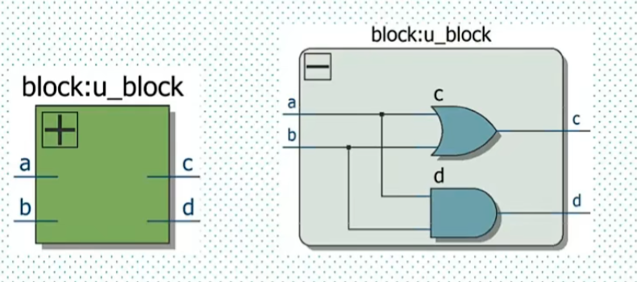

#### 模块结构
verilog的基本设计单元是模块(block). 对标C中的函数.

```verilog
module modname ([端口列表])
[端口信号声明;]
[参数声明]

//内部信号声明
//assign语句
//底层模块调用语句
//initial或always语句
//任务和函数定义
//specify块(路径延迟)


endmodule
```
例如想要实现一个简单的与门+或门模块如图:

编写代码:
```verilog
module mychip(a,b,c,d); //声明的端口默认为`wire`类型的变量.
    input a, b;
    output c, d;    //这两句进一步声明端口为input还是output.

assign c = a|b; //用assign语句给wire变量赋值
assign d = a&b;

endmodule
```


##### 新格式
现在verilog已经推行新格式, 虽然兼容旧格式.

```
module mymodule #
(
    // 参数定义部分
)
(
    // 端口定义部分
);
endmodule
```
例子: 呼吸灯实验中的模块:
```verilog
`timescale 1 ns / 1 ps

	module myip_breath_led #
	(
		// Users to add parameters here
        parameter START_FREQ_STEP = 10'd1,  //this para is used to set the breath led's frequency.
		// User parameters ends
		// Do not modify the parameters beyond this line


		// Parameters of Axi Slave Bus Interface S0_AXI
		parameter integer C_S0_AXI_DATA_WIDTH	= 32,
		parameter integer C_S0_AXI_ADDR_WIDTH	= 4
	)
	(
		// Users to add ports here
        output      led,    //this is breath led's signal.
		// User ports ends
		// Do not modify the ports beyond this line


		// Ports of Axi Slave Bus Interface S0_AXI
		input wire  s0_axi_aclk,
		input wire  s0_axi_aresetn,
		input wire [C_S0_AXI_ADDR_WIDTH-1 : 0] s0_axi_awaddr,
		input wire [2 : 0] s0_axi_awprot,
		input wire  s0_axi_awvalid,
		output wire  s0_axi_awready,
		input wire [C_S0_AXI_DATA_WIDTH-1 : 0] s0_axi_wdata,
		input wire [(C_S0_AXI_DATA_WIDTH/8)-1 : 0] s0_axi_wstrb,
		input wire  s0_axi_wvalid,
		output wire  s0_axi_wready,
		output wire [1 : 0] s0_axi_bresp,
		output wire  s0_axi_bvalid,
		input wire  s0_axi_bready,
		input wire [C_S0_AXI_ADDR_WIDTH-1 : 0] s0_axi_araddr,
		input wire [2 : 0] s0_axi_arprot,
		input wire  s0_axi_arvalid,
		output wire  s0_axi_arready,
		output wire [C_S0_AXI_DATA_WIDTH-1 : 0] s0_axi_rdata,
		output wire [1 : 0] s0_axi_rresp,
		output wire  s0_axi_rvalid,
		input wire  s0_axi_rready
	);
// Instantiation of Axi Bus Interface S0_AXI
	myip_breath_led_slave_lite_v1_0_S0_AXI # ( //这里实例化了一个名为 myip_breath_led_slave_lite_v1_0_S0_AXI_inst 的子模块，它实际上实现了与AXI4-Lite接口的具体逻辑。通过参数和信号传递，将 myip_breath_led 顶层模块的参数和端口连接到该子模块中。
	   .START_FREQ_STEP(START_FREQ_STEP),  //add instantiation of my para in the instantiation part.
		.C_S_AXI_DATA_WIDTH(C_S0_AXI_DATA_WIDTH),
		.C_S_AXI_ADDR_WIDTH(C_S0_AXI_ADDR_WIDTH)
	) myip_breath_led_slave_lite_v1_0_S0_AXI_inst (
	   .led(led),  //same reason as above.
		.S_AXI_ACLK(s0_axi_aclk),
		.S_AXI_ARESETN(s0_axi_aresetn),
		.S_AXI_AWADDR(s0_axi_awaddr),
		.S_AXI_AWPROT(s0_axi_awprot),
		.S_AXI_AWVALID(s0_axi_awvalid),
		.S_AXI_AWREADY(s0_axi_awready),
		.S_AXI_WDATA(s0_axi_wdata),
		.S_AXI_WSTRB(s0_axi_wstrb),
		.S_AXI_WVALID(s0_axi_wvalid),
		.S_AXI_WREADY(s0_axi_wready),
		.S_AXI_BRESP(s0_axi_bresp),
		.S_AXI_BVALID(s0_axi_bvalid),
		.S_AXI_BREADY(s0_axi_bready),
		.S_AXI_ARADDR(s0_axi_araddr),
		.S_AXI_ARPROT(s0_axi_arprot),
		.S_AXI_ARVALID(s0_axi_arvalid),
		.S_AXI_ARREADY(s0_axi_arready),
		.S_AXI_RDATA(s0_axi_rdata),
		.S_AXI_RRESP(s0_axi_rresp),
		.S_AXI_RVALID(s0_axi_rvalid),
		.S_AXI_RREADY(s0_axi_rready)
	);

	// Add user logic here

	// User logic ends

	endmodule
```


#### 数据类型
`verilog`的数据类型不像C一样复杂.
* `reg`(寄存器)
  * 默认初始值为`x`(不定值). 
  * `reg`类型数据只能在`always`语句和`initial`语句中被赋值. 不能创建时赋初值.
  * 如果语句描述的是`时序逻辑`, 即`always`语句带有时钟信号, 则该`reg`变量对应`触发器`.
  * 如果语句描述的是`组合逻辑`, 即`always`语句不带有时钟信号, 则该`reg`变量对应`硬件连线.`


```verilog
//reg def
reg [31:0] delay_cnt;   //定义了一个名为delay_cnt的32位宽寄存器.
reg        key_reg;     //若没有指定, 则默认位宽位1.
```


* `wire`, `tri`(线网)
  * 表示结构实体(例如`门`)之间的电气连接导线.
  * `wire`, `tri`类型的变量不能储存值. 它的值由驱动它的元件(`门`,`连续赋值语句`, `assign`语句)决定. 
  * 如果没有驱动原件连接到线网变量, 则该变量是`高阻`的, 值为`z`.

```verilog
//wire define
wire    key_flag;
```


* `parameter`(参数)
  * 类似`c`中`define`一个常量. 只是定义句法需要用`=`和`;`而已.
  * 常用于定义:
      * 状态机的状态
      * 数据位宽
      * 延迟大小


```verilog
// parameter define  LCD
parameter H_SYNC = 11'd41;      //行同步
parameter H_BACK = 11'd2;       //行显示后沿
parameter H_DISP = 11'd480      //行有效数据
parameter H_FRONT = 11'd2;      //行显示前沿
parameter H_TOTAL = 11'd525;    //行扫描周期    
```
* 上述参数解释:
    这些参数定义了与**水平扫描（Horizontal）**有关的时序设置。
    * **H_SYNC（行同步）**

        H_SYNC = 11'd41：H_SYNC 表示水平同步信号的脉冲宽度，单位通常是像素时钟周期。
        这个参数表示在每行扫描的开始时，H_SYNC 脉冲需要持续 41 个时钟周期，用于告知显示器进入行同步阶段。
    * **H_BACK（行显示后沿）**

        H_BACK = 11'd2：H_BACK 是水平后沿（Back Porch）的时长。
        它表示在行同步信号结束后，实际有效显示数据开始前的一个短暂延迟时间，为 2 个时钟周期。
    * **H_DISP（行有效数据）**

        H_DISP = 11'd480：H_DISP 表示每一行中实际有效显示数据的长度，这里为 480 个时钟周期。
        这意味着在每行扫描时，真正用于显示数据的像素有 480 个。这通常对应于屏幕的水平分辨率。
    * **H_FRONT（行显示前沿）**

        H_FRONT = 11'd2：H_FRONT 是水平前沿（Front Porch）的时长。
        它表示在有效显示数据结束后，到下一个行同步信号开始前的延迟时间，为 2 个时钟周期。
    * **H_TOTAL（行扫描周期）**

        H_TOTAL = 11'd525：H_TOTAL 是一整行扫描所需的总时长。
        这个值是所有水平时序参数的总和，即 H_SYNC + H_BACK + H_DISP + H_FRONT = 525。
        它表示每一行的总时长，从行同步开始到下一行同步的开始。

```cpp
define int my_const 5   //预处理环节声明一个常量
```


#### 运算符

##### 位运算符
  * `~`
    * `~a`: 将`a`按位取反.
  * `&`
    * `a & b`: 将`a`和`b`按位相`与`
  * `|`
    * `a|b`: 将`a`和`b`按位相`或`
  * `^` 
    * `a^b`: 将`a`和`b`按位相`XOR`

##### 移位运算符

  * `a>>b`: 将a右移b位
    * $4'b1001>>1 == 4'b100$;
  * `a<<b`: 将a左移b位
    * $4'b1001<<2 == 6'b100100$;

##### 位拼接运算符
  * `{a,b}`:  将`a`和`b`拼接起来.
```verilog
reg [3:0] a;    //四位信号a
reg [3:0] b;    
wire [7:0] result;

assign result = {a,b};
```


#### 例化
=`实例化`/`调用模块`. 

例化的作用：
例化一个模块可以让你重用模块的逻辑和功能，就像调用一个函数一样。这样，你可以在一个更大的设计中多次使用同一个模块，而不需要重复定义它。

##### 示例1
假设我们定义了一个名为 `my_module `的模块：

```verilog
module my_module(
    input a,
    input b,
    output c
);
    // 模块内部逻辑
    assign c = a & b;
endmodule
```
然后，如果你想在另一个模块中使用这个 `my_module`，就需要例化它：

```verilog
module top_module(
    input a,
    input b,
    output c
);
    // 例化 my_module
    my_module instance_name (
        .a(a), // 将top_module中的a连接到my_module的a端口
        .b(b), // 将top_module中的b连接到my_module的b端口
        .c(c)  // 将my_module的c端口连接到top_module的c
    );
endmodule
```
在上面的代码中，`my_module` 被例化为一个名为 `instance_name` 的实例。在 `top_module` 中，它将输入 `a` 和 `b` 传递给 `my_module`，然后 `my_module` 将计算结果输出到 `c`。


##### 示例2
```verilog
and #2 u1(q,a,b)  //实例化一个具有2时间单位延迟的AND门, 命名为u1. a,b为输入, q为输出.
```


##