## 0 上版流程:

#### 安装usb转串口驱动
即ch340. 驱动安装好后, 板子插`usb转串口`那个usb口. 上电后, 在电脑设备管理器-端口应当能看到ch340端口.不上电就没有. 废话!


#### 先安装keil(5.24以上版本,最好)
然后使用注册机破解它.
然后找要安装的包pack文件(即cmsis pack),双击安装.
然后就可以打开keil使用了.


#### 新建project流程:
keil里新建一个μvision project后, 在当前目录:
需要添加启动文件(`F:\aza\wokwok\STM32\野火【STM32F103开发板-指南者】资料\3-STM32官方资料(标准库固件包; hal固件包, 一些手册)\标准库固件包\STM32F10x_StdPeriph_Lib_V3.5.0\Libraries\CMSIS\CM3\DeviceSupport\ST\STM32F10x\startup\arm`)
需要添加自己的.c文件.
需要添加一个空的头文件.

#### 生成编译文件
写好后编译. 记得勾选生成hex文件.

#### (串口)下载
然后(这里用串口通信)使用串口下载软件(mcuisp):
	搜索串口,选择对应的ch340串口. bps就115200吧别太高了
	选择下载时的程序文件为生成的hex文件.(在项目文件夹的objects里)
	选择DTR低电平复位; RTS高电平进bootloader.(这个的原理可以参考野火文档-isp一键下载原理分析.)

## 1 各种外设
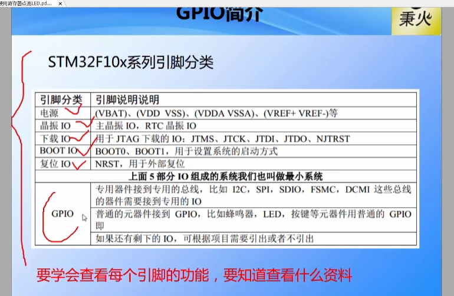
### 1.1 GPIO端口:
通用输入输出端口的简称. 也就是软件可以控制的引脚.
这个外设在APB2总线连接. 使用时复位和时钟信号要去APB2总线的对应控制寄存器打开.
一共有GPIOx, x=`ABCDE`五个端口, 每个端口有个16个引脚. 在板子上比如PB0即为GPIO的B端口0号引脚.

操作它们主要靠这几个寄存器:

#### 1.1.1 APB2总线 外设时钟使能寄存器(RCC_APB2ENR); APB2 外设复位寄存器 (RCC_APB2RSTR)
在AHB总线上. 地址为`0x4002 1000 - 0x4002 13FF`
首先是使能和复位信号. 如果想使用GPIO端口(在总线APB2连接), 则需要开启复位和时钟控制RCC. 外设的时钟和使能信号默认是关闭的.
当外设时钟没有启用时，软件不能读出外设寄存器的数值，返回的数值始终是0x0。


#### 1.1.2 GBIOx_ODR (output data reg)输出数据寄存器.
它是一个32bit寄存器. 高16位预留为0没用. 低16位控制端口0~端口15的输出电平, 0为低电平.

#### 1.1.3 GBIOx_CRL (config reg low)端口配置低寄存器.
负责Px0~Px7引脚的配置. 是32bit寄存器. 
相对于GBIOx基地址偏移为0. 复位0x4444 4444.
每个引脚占据4bit. 比如低4位为:
* MODEy[1:0] 这两位设置Px0的工作模式:
	* `00`输入模式
	* `01`输出模式，10 MHz
	* `10`输出模式，2 MHz
	* `11`输出模式，50 MHz
* CNFy[1:0] 这两位设置:
  * 当MODEY是`00`时;
    * `00`
    * `01`
    * `10`
    * `11`

#### 1.1.4 GBIOx_CRL (config reg high)端口配置高寄存器.
负责Px8~Px15引脚的配置.


* 双重模式特质adc1, adc2一起使用.
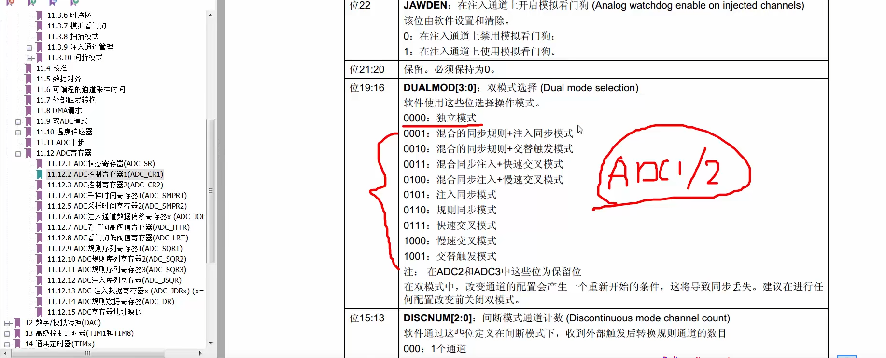

* 常用固件库函数(后面数字表示在对应头文件(ADC_开头就是`stm32f10x_adc.h`, RCC_开头就是`stm32f10x_rcc.h`等)的第几行.)
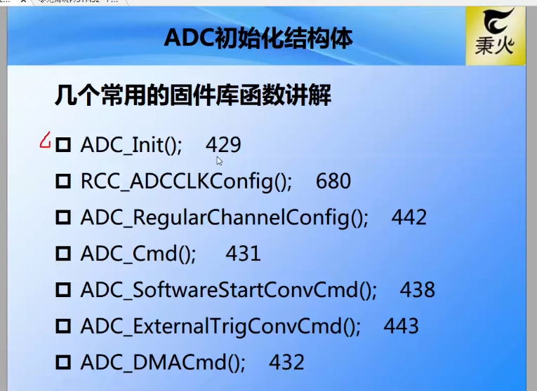


### 1.2 时钟和RCC(reset and clock control)

STM32F103 的时钟系统使用 时钟树 进行管理，所有外设（GPIO、USART、ADC 等）都需要时钟才能工作。

**HSE(High-Speed External clock), 高速外部时钟**由外部晶振提供信号.
可以通过 **PLL（锁相环）** 倍频，把 STM32 的主频提升到 72MHz.


RCC是stm32的一个外设,  负责系统复位和时钟管理.
它控制gpio, adc, usart, apb1, apb2灯外设的始终开关.
比如，RCC->APB2ENR |= (1 << 9); 用于 开启 ADC1 时钟。

时钟树:
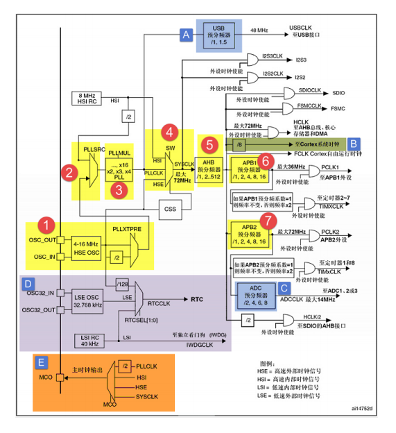

* `HSE_OSC`震荡模块配合OSC_IN, OSC_OUT引脚输入输出, 产生HSE震荡时钟信号. (stm32本身不包含一个晶振模块. `HSE_OSC`模块只是利用驱动电路来配合外部的晶振工作, 产生信号给内部模块用.)
* 紧接着的`PLLXTPRE`(PLL extended pre-divider)预分频器模块.
  * ENABLE: 将HSE信号1/2分频, 然后送入`PLL选择器`.
  * UNENABLE: HSE直接送入`PLL选择器`.
* `PLL选择器`通过PLLSRC使能, 选择(分频的)`HSE`信号或HSI信号, 传给`PLL`.
* `HSI`是内部振荡器信号. 比较简洁, 不需要晶振和控制电路, 产生8MHZ的劣质信号...
* 


### 1.4 接口的重映射
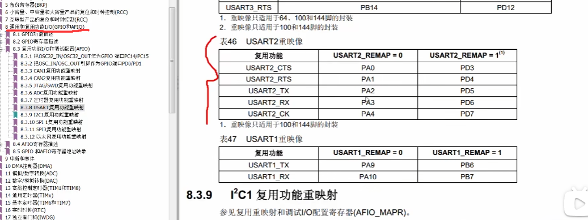
例如`USART2_TX`, 当控制重映射的寄存器USART2_REMAP=0时, 它被分配到默认物理引脚PA2.
当USART2_REMAP=1时, 它被分配到物理引脚PD5.


### 1.5 DMA (data memory access) 直接存储器访问

功能: 在两处搬运数据, 不占用cpu.
比如串口输入时, 我们把sram中的字符串数据arr先搬运到cpu暂存reg, 然后搬运到USART的DR, 然后发送.
如果能使用DMA, 只需要cpu发个命令, 让数据arr自动搬运到目的地(USART_DR), cpu可以去做别的事.

stm32f103大容量版本有两个DMA外设`DMA1`, `DMA2`.
每个DMA有7个通道. 可以实现
* P->M
* M->P
* M->M

P:外设peripheral.  
M:

注意:ADC2没有DMA功能. 可以用ADC1或ADC3.

### 1.6 TIM(timer)定时器

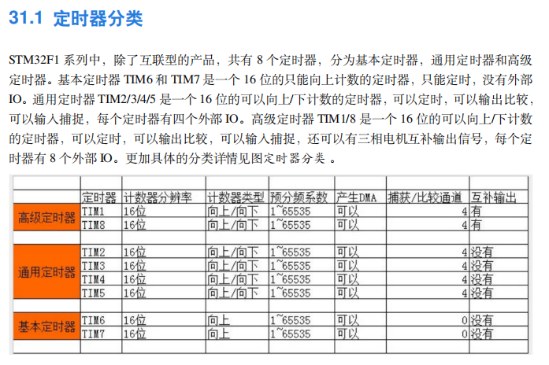

#### 1.6.1 基本定时器

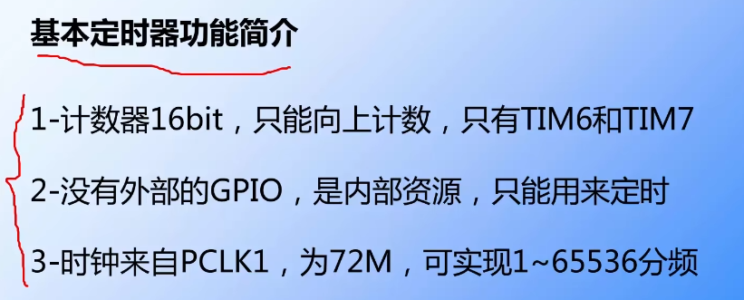

##### 时基 time base
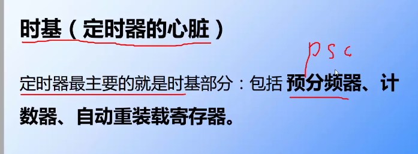
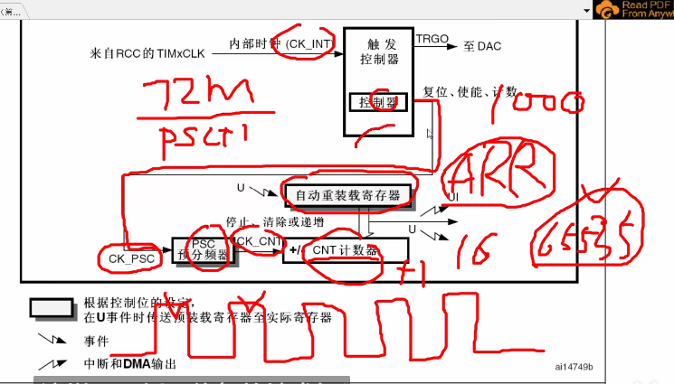
* 计时器 **CNT**
* 预分频器 **PSC**(Prescaler)
  * 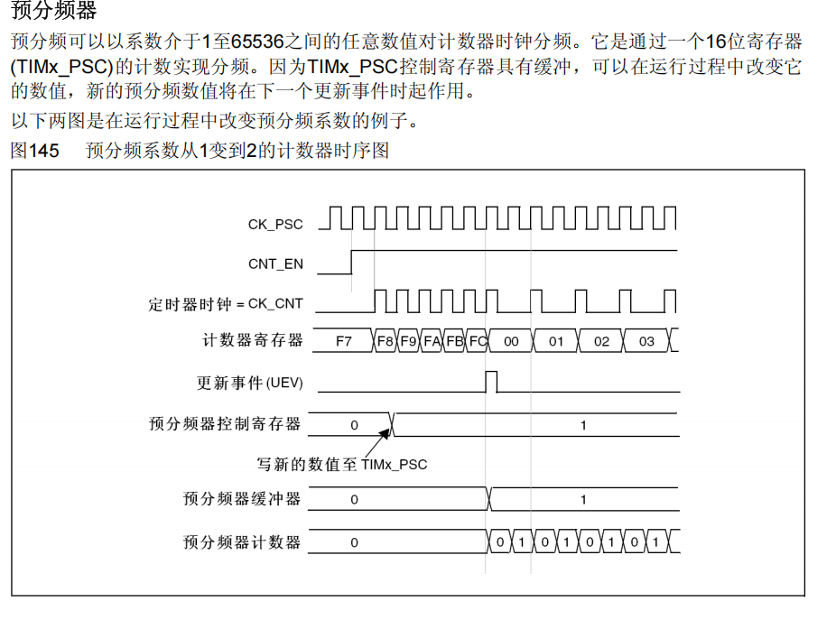
  * 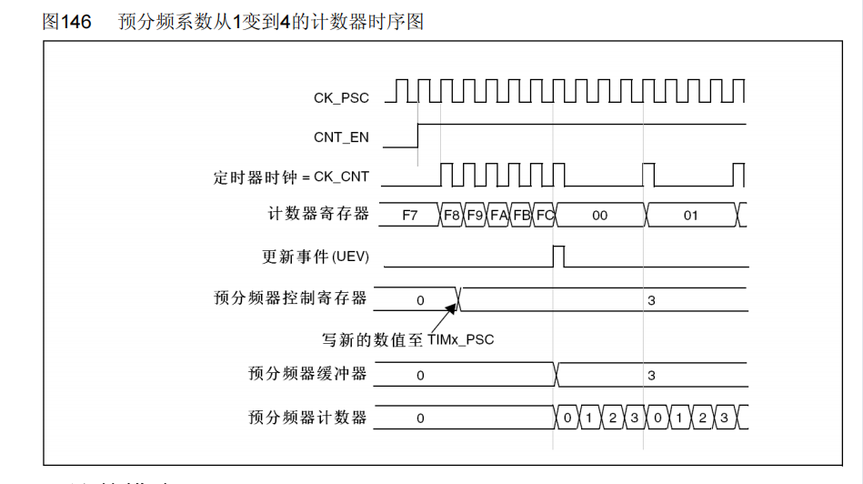
* 自动重装载寄存器 **ARR** : 计数器到达该寄存器值后自动清零.

* **影子寄存器**: 
  * PSC和ARR都有`影子寄存器`(框图中, PSC和ARR矩形有一个影子图案). 其实就是打拍. 比如ARR的影子寄存器称为称为`自动重装载预装载`, 使能在TIMx_CR1寄存器的7位`ARPE`.
    * 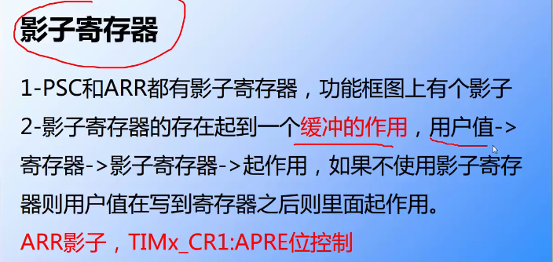
    * 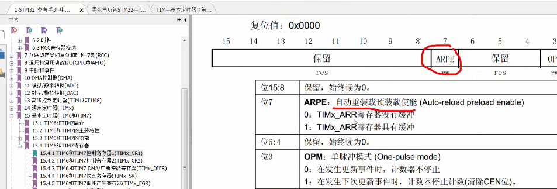

计数器时钟`CK_CNT`频率: 
$CK\_CNT=\frac{72M}{PSC+1}$
于是计数器技术一轮需要的时间为$\frac{ARR}{CK\_CNT}$

时基结构体的初始化:
```c
typedef struct{
//PSC的分频因子
uint16_t TIM_Prescaler;

//计数模式. (基本计时器TIM7,TIM8不用配, 只能向上计数)
uint16_t TIM_CounterMode;

//ARR的值, 计数周期
uint32_t TIM_Period;

//外部输入的时钟分频因子.(基本计时器没有)

//重复计时器(高级定时器专用)
//如果开启相关功能, 可以在ARR满的时候不产生中断/DMA请求, 而是清零并且让重复计时器++. 感觉没啥用...你扩倍ARR设定不就好了.
uint8_t TIM_ClockDivision;
//

} TIM_TimeBaseInitTypeDef
```

#### 1.6.2 高级定时器 TIM1, TIM8

三个功能:
* 定时
* PWM
* 捕获
  * 脉冲宽度
  * PWM

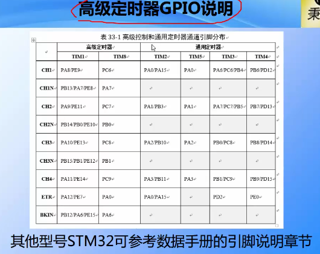


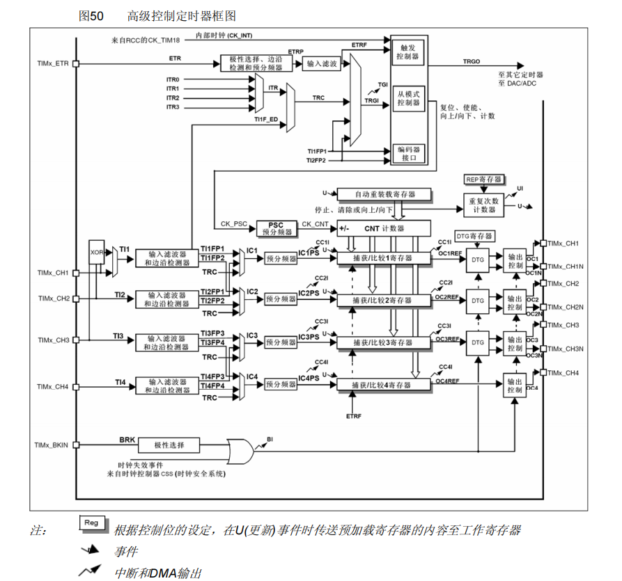
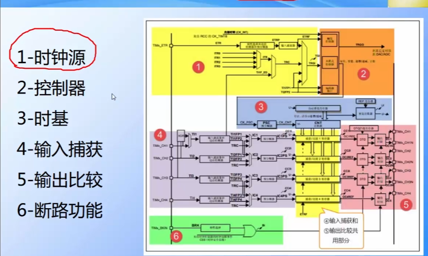


## 2 实验部分:

### 指南者板子硬件设计:
从原理图查到:
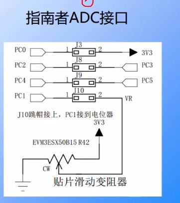
注意PC0实际上被SPI接口占用了. 别用.


### 2.1 ADC实验
整个原理图:
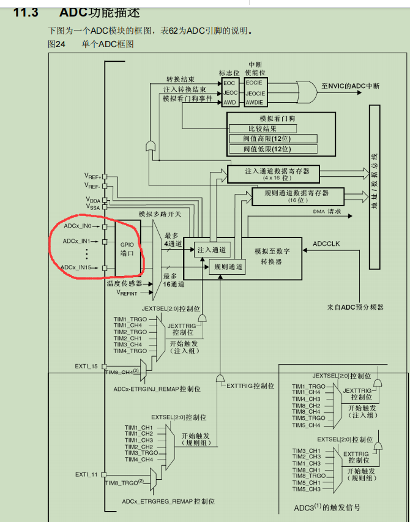
### 理论部分 


#### 引脚
VDDA(VDD(drain to drain) analog)即模拟模块的电源电压。
VSSA(VSS(source to source) analog)即模拟模块的地.
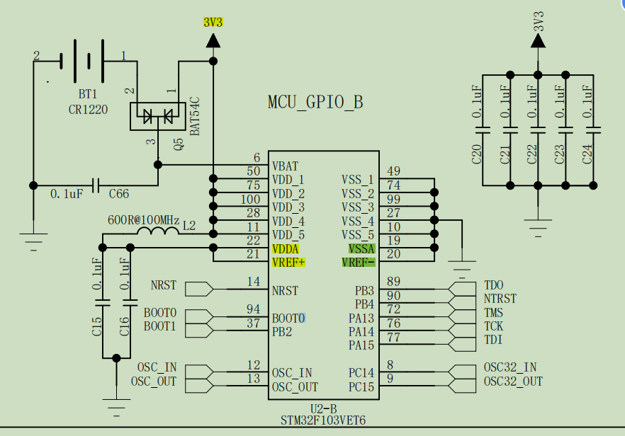

引脚分配图:
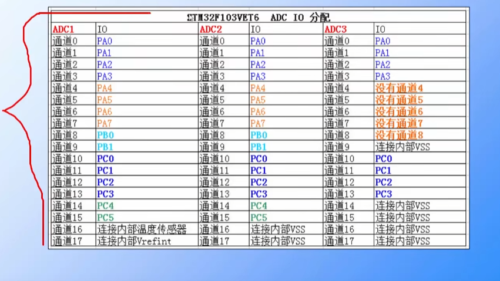


可以使用这个分压结构测量更高的电压:
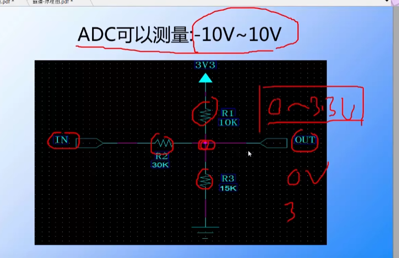
很容易导出uout和uin的线性关系:
i1=uin/(R2+R3);
i2=3v3/(R1+R3);
uout=R3(i1+i2)=R3(uin/(R2+R3)+3v3/(R1+R3)). 线性关系.

每个ADC的端口:


先看adc的16个外部通道结构:
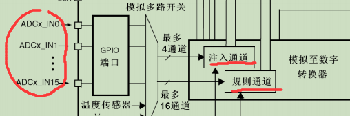
外部的16个通道在转换的时候又分为**规则通道**和**注入通道**.
其中规则通道最多有16路,注入通道最多有4路。
**规则通道**:顾名思意,规则通道就是很规矩的意思，我们平时
一般使用的就是这个通道。
**注入通道**:注入,可以理解为插入,插队的意思，是一-种不安
分的通道。它是一种在规则通道转换的时候强行插入要转换的
一种。这点跟中断程序很像,都是不安分的主。所以，注入通
道只有在规则通道存在时才会出现。


有三格寄存器来决定通道转换顺序.
#### 规则序列寄存器SQRx, x=1,2,3
  
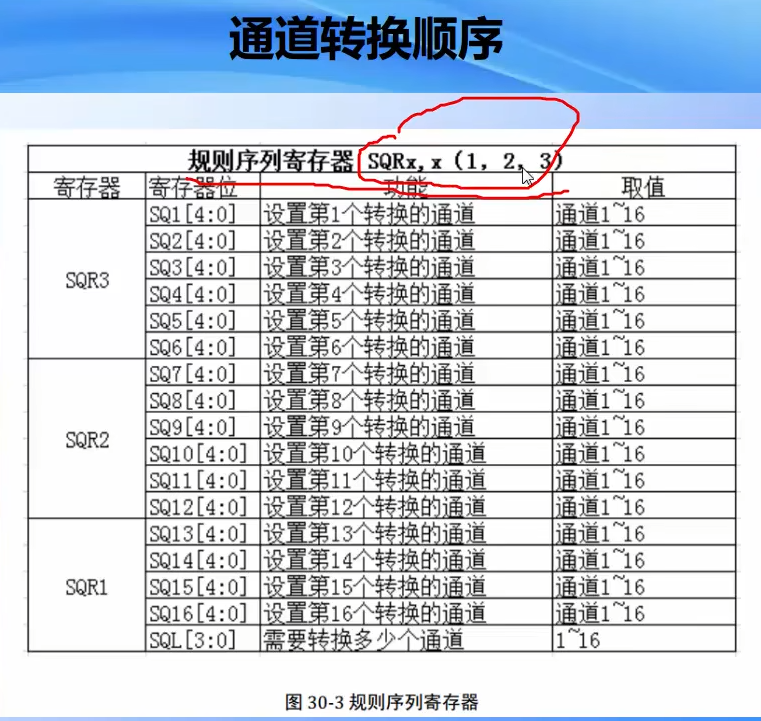
举个例子: 如果需要adc模块转换通道3,8两个通道的模拟信号并且依次将转换结果存在寄存器里等待cpu读取, 那麽SQR寄存器要设置为:
	SQR3的[4:0],即SQ1部分设置为`00011`,即`3`,表示第一个要转换的通道是3.
	SQR3的[9:5],即SQ2部分设置为`00100`,即`8`,表示第二个要转换的通道是8.
	SQR3剩下的位和SQR2,SQR1除了`SQL`部分的位均默认为`0`, 表示不转换.
	SQL部分设置为`0010`,即`2`, 表示一共要转换的通道数为2.


#### 注入序列寄存器JQR
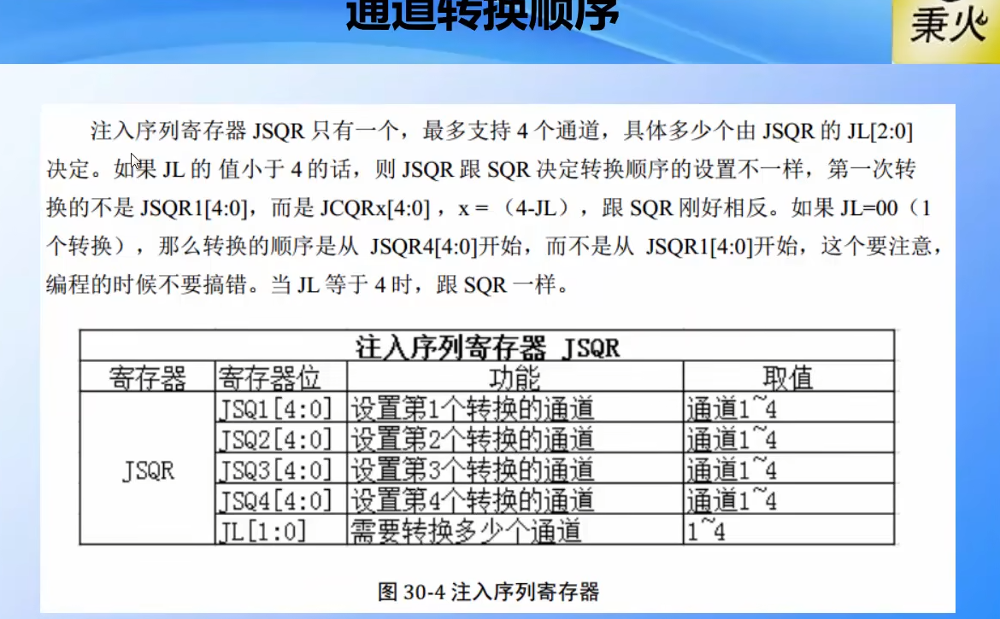


#### 触发源部分
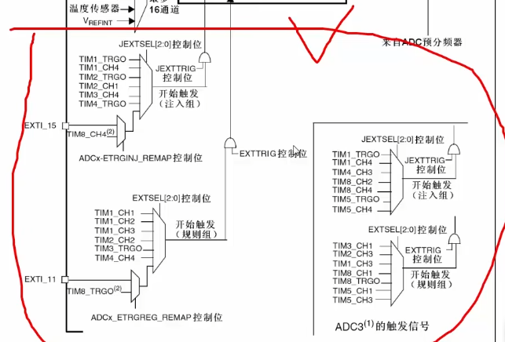
需要先设置ADON寄存器让adc模块工作, 然后:
* 1.使用软件触发: 设置SWSTART和JSWSTART寄存器.
* 2.使用外部事件触发:
ADON寄存器控制adc模块工作电压是否开启(是否开启adc.)
SWSTART寄存器,控制规则通道可以开始转换了.
JSWSTART寄存器,控制注入通道可以开始转换了.

也可以用**外部事件触发**
例如,下面的模块就是规则通道的外部触发:
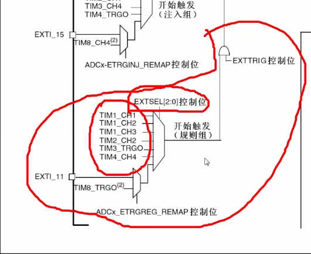
打开EXTTRIG寄存器开启规则通道的外部触发;然后
设置EXTSEL寄存器选择用哪个信号, 然后对应的那个计时器信号可以作为触发.
看模块可以知道, 可以用TIM1_CH1~TIM4_CH4这些计时器信号, 也可以用外部gpio信号`EXTI_11`.

这几个寄存器简单查一下发现都在32位寄存器`ADC_CR2`中.

#### 转换.
转换时间:

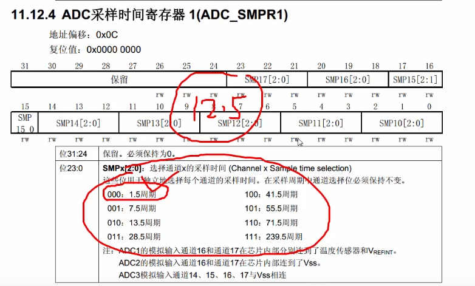


#### 转换结果:
规则组的数据放在`ADC_DR`寄存器.
注入组的数据放在`JDRx`寄存器.

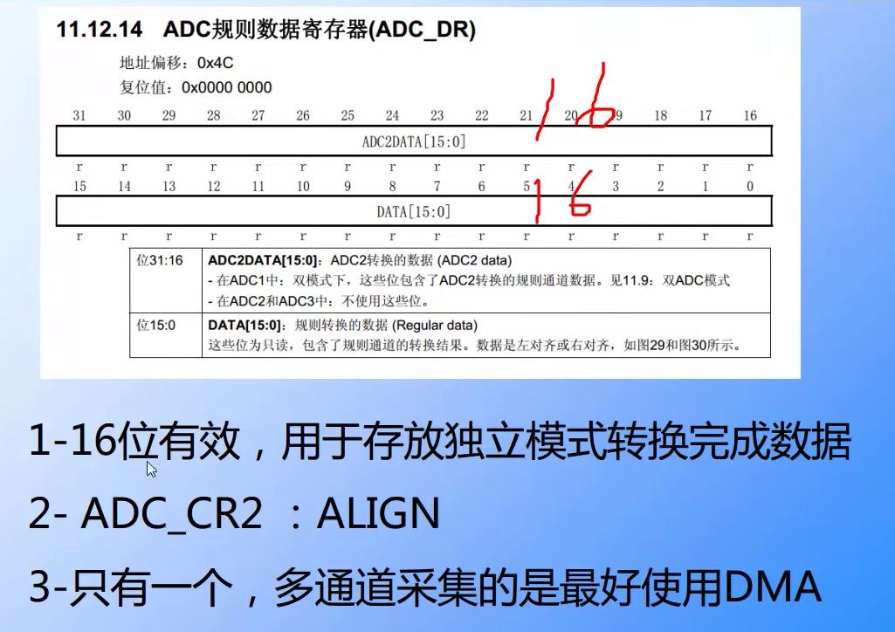

* `独立模式`: 即单独使用adc1,2,3之一时.


#### 中断
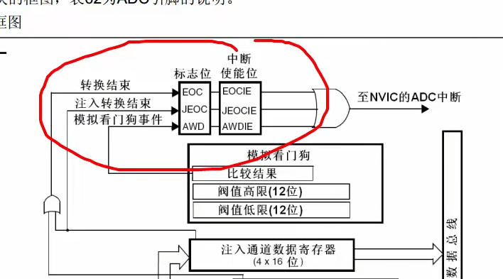

##### EOC(end of complete)中断
##### JEOC()中断
##### AWD()中断
模拟看门狗的寄存器配置:
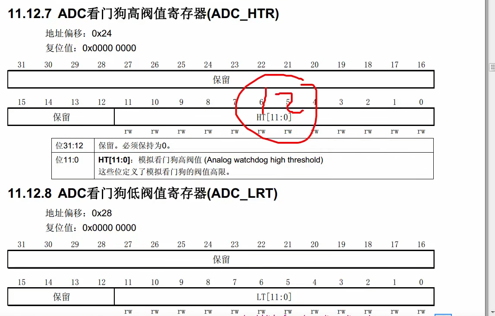


#### 数据换算关系
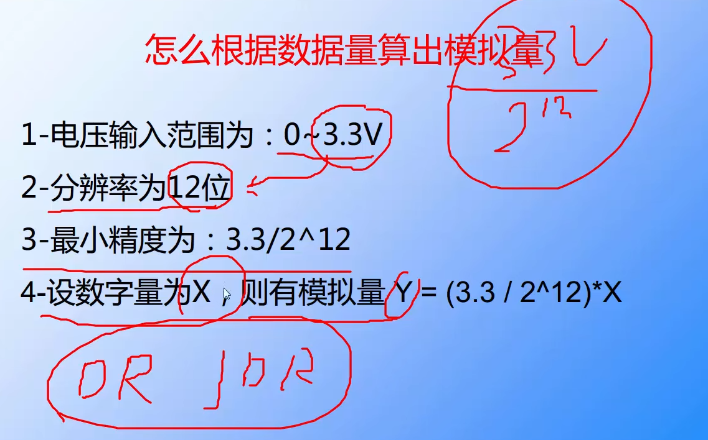


#### 初始化结构体:
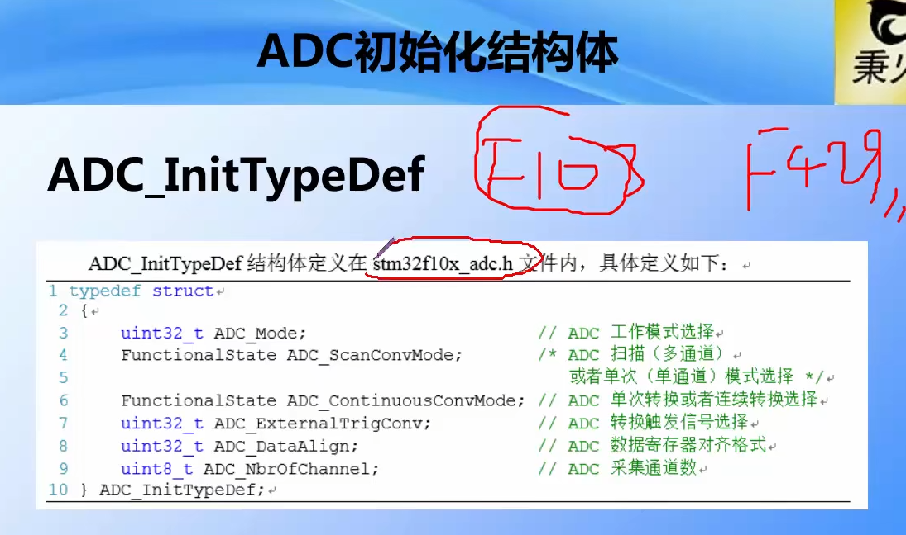


### 实验部分

首先复制一个串口实验项目`USART1接发`为基础.

改文件夹名字为ADC,开始:

在User目录新建一个adc文件夹存放驱动.
在其中新建`bsp_adc.c`和`bsp_adc.h`板级支持包文件.

##### 1.编写bsp_adc.c和bsp_adc.h
在啊keil中指定头文件路径: 魔术棒->c/c++->include paths->new(insert), 选择adc文件夹, 于是添加这个路径到头文件寻找中.

写`bsp_adc.h`. 我们要在里面写条件编译. 可以从项目的bsp_usart.h中粘贴修改.
直接抄来例程中的bsp_adc.h.

```c
#include "bsp_adc.h"
//1.初始化adc要用的gpio.
void ADCx_GPIO_Config(void){
	//直接从固件库例程里抄吧~
	//地址在F:\aza\wokwok\STM32\野火【STM32F103开发板-指南者】资料\1-程序源码_教程文档\1-[野火]《STM32库开发实战指南》(标准库源码)【优先学习】\30-ADC—电压采集\1-ADC—单通道（中断读取）
	
	
	//定义一个初始化结构体变量.
	GPIO_InitTypeDef GPIO_InitStructure;
	
	// 打开 ADC IO端口时钟
	ADC_GPIO_APBxClock_FUN ( ADC_GPIO_CLK, ENABLE );
	
	// 配置 ADC IO 引脚模式
	// 必须为模拟输入
	//GPIO.pin是结构体GPIO_InitTypeDef的成员. 表示要配置的引脚. 此处ADC_PIN在头文件宏中定义为`GPIO_Pin_1`.
	GPIO_InitStructure.GPIO_Pin = ADC_PIN;
	GPIO_InitStructure.GPIO_Mode = GPIO_Mode_AIN;	//模拟输出模式
	
	// 初始化 ADC IO. ADC_PORT在宏中定义为`GPIOC`
	GPIO_Init(ADC_PORT, &GPIO_InitStructure);		

}


//2.初始化ADC初始化结构体
void ADCx_Mode_Config(void){
	ADC_InitTypeDef ADC_InitStruct;
	
	//打开ADC时钟.(具体这个函数去rcc固件库里找.)
	ADC_GPIO_APBxClock_FUN ( ADC_GPIO_CLK, ENABLE ); 
	
	
	//先配置结构体的第一个成员:ADC_Mode. adc模式选择. 我们现在只使用一个adc, 所以选择`独立模式`.(去固件库stm32f10x_adc.h, line94找. 先在FWLB文件夹找到stm32f10x_adc.c,然后在其include的前者跳转即可.
	//en, 初始化结构体的6个成员也要在stm32f10x_adc.h里查看结构体typedef哦.
	ADC_InitStruct.ADC_Mode = ADC_Mode_Independent;
	
	//第二个成员是ADC_ScanConvMode(see stm32f10x_adc.h, line56). 是否扫描. 扫描是针对多通道的. 选择DISABLE(how can i know the options?? see .h pls.).
	ADC_InitStruct.ADC_ScanConvMode = DISABLE;
	
	//第三个成员是ADC_ContinuousConvMode, 是否连续转换, enable.
	ADC_InitStruct.ADC_ContinuousConvMode = ENABLE;
	
	
	//4th member: ADC_ExternalTrigConv, adc触发模式. choose 软件触发.(不使用外部触发, 外部触发是定时器/外部gpio)
	//选项参考.h文件, line123~138. 
	ADC_InitStruct.ADC_ExternalTrigConv = ADC_ExternalTrigConv_None;
	
	//5th: dataalign.
	ADC_InitStruct.ADC_DataAlign = ADC_DataAlign_Right;
	
	//6th: channel nember.
	ADC_InitStruct.ADC_NbrOfChannel = 1;


	//初始化结束后, 调用adc_init.该函数的作用是: 按照上述配置好的参数, 去改写各种设置adc功能的寄存器, 实现你的配置.
	//(.h, line429: `void ADC_Init(ADC_TypeDef* ADCx, ADC_InitTypeDef* ADC_InitStruct);`)
	ADC_Init(ADC_x, &ADC_InitStruct);


	//3.1配置adc时钟. 前往固件库stm32f10x_rcc.c, line766:`void RCC_ADCCLKConfig(uint32_t RCC_PCLK2)`
	//函数的形参选择: 见stm32f10x_rcc.c, line760~764处说明. 此处选择8分之一分频.
	RCC_ADCCLKConfig(RCC_PCLK2_Div8);
		
	
	
	//3.2配置`通道转换顺序`, `采样时间`
	//查看stm32f10x_adc.h, line442, 得到函数ADC_RegularChannelConfig.每个参数...
	//1.哪个adc, 
	//2.哪个通道, 
	//3.转换顺序(cause 我们这里只用一个adc通道所以它的rank就是1咯.)
	//4.采样时间. 见stm32f10x_adc.c, line579~588. 这里我们选择55.5个周期.
	ADC_RegularChannelConfig(ADC_x, ADC_CHANNEL, 1, ADC_SampleTime_55Cycles5);
	
	
	
	//4.1使能adc转换完成中断, 配置adc优先级.
	//去adc.h中找到IT(interrupt)字样的函数: void ADC_ITConfig(ADC_TypeDef* ADCx, uint16_t ADC_IT, FunctionalState NewState);
	//1.选的哪个adc
	//2.中断类型. ADC_IT_EOC, 规则通道.
	//3.enable/diable
	ADC_ITConfig(ADC_x, ADC_IT_EOC, ENABLE);
	
	
	//5.使能adc(就是打开adc), 准备开始转换.
	//(最快的编程方法: 把函数定义给ai看, 让她告诉你形参怎麽设置.)
	ADC_Cmd(ADC_x, ENABLE);
	
	
	//6.校准adc.
	// 初始化ADC 校准寄存器  
	ADC_ResetCalibration(ADC_x);
	// 等待校准寄存器初始化完成
	while(ADC_GetResetCalibrationStatus(ADC_x));
	
	// ADC开始校准
	ADC_StartCalibration(ADC_x);
	// 等待校准完成
	while(ADC_GetCalibrationStatus(ADC_x));
	
	
	//7.软件触发adc, 开始转换.
	// 由于没有采用外部触发，所以使用软件触发ADC转换 
	ADC_SoftwareStartConvCmd(ADC_x, ENABLE);
}

//8.编写终端服务函数, 读取ADC转换的数据.
//这个函数的作用是配置 ADC 的 NVIC（嵌套向量中断控制器），也就是告诉 STM32，当 ADC 触发中断时，该如何处理。
static void ADC_NVIC_Config(void)
{
	////声明一个 NVIC_InitTypeDef 结构体变量，用来配置 NVIC.
  NVIC_InitTypeDef NVIC_InitStructure;
	// 优先级分组
	NVIC_PriorityGroupConfig(NVIC_PriorityGroup_1);
	
	
	//选择要配置的中断源，这里是 ADC_IRQ（ADC 的中断）。
  NVIC_InitStructure.NVIC_IRQChannel = ADC_IRQ;
	
	//设置 抢占优先级 = 1，子优先级 = 1。
  NVIC_InitStructure.NVIC_IRQChannelPreemptionPriority = 1;
  NVIC_InitStructure.NVIC_IRQChannelSubPriority = 1;
	
	//启用 ADC 中断。
  NVIC_InitStructure.NVIC_IRQChannelCmd = ENABLE;
	
	//调用 STM32 库函数 NVIC_Init()，把上面的配置写入 NVIC。
  NVIC_Init(&NVIC_InitStructure);
}


//包装一下上面我们写的初始化函数.
void ADCx_Init(void){
	ADC_NVIC_Config();
	ADCx_GPIO_Config();
	ADCx_Mode_Config();
}


```


##### 2.编写中断服务函数.
在USER目录中编辑文件`stm32f10x_it.c`(it即interrupt. stm32官方库默认中断处理函数都定义在这个文件.)
因为这个例子里我们的项目文件是拷贝的USART接发, 所以该文件写入了串口终端服务函数. 注释掉, 写上我们要用的adc中断服务函数.
记得包含头文件`bsp_adc.h`

##### 3.编写main函数.
在USER目录中编辑文件`main.c`.


## 3 中断, NVIC模块, EXTI模块

stm32使用模块`NVIC`(nested vectored interrupt controller,内嵌向量中断控制器)管理中断.
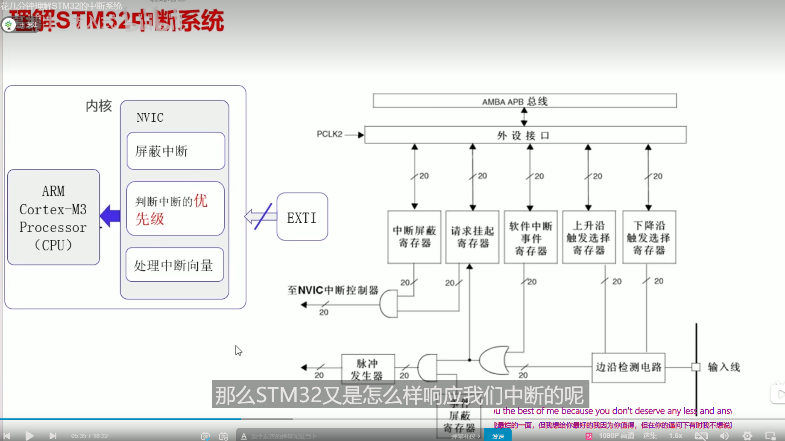
右边的框图解释:
`中断`的输入量:
* 1.外设影响某个io口电平.
  * 边沿检测电路检测到上升/下降(这个自己设置,也可以是双边)后, 会给`请求挂起寄存器`信号. 
* 2.内部软件中断事件.
  * 软件中断事件寄存器也可以给请求挂起寄存器发信号. 
`请求挂起寄存器`用或门连接软件/io口信号, 即都可接收.
然后:
* 当`中断屏蔽寄存器`允许时, `请求挂起寄存器`信号发送给`EXTI`.

**EXTI**(external interrupt controller,外部中断控制器). 管理外部中断, 然后给信号到NVIC. "秘书的秘书".

stm32拥有19个`EXTI`模块, 比如EXTI0管理的i/o口为PA0,PB0,PC0,PD0,PE0.

* 注意: stm32中, 相同编号的io口(如PA0和PB0两个引脚)使用相同的EXTI线. 不能同时设置为不同的外部中断, 会失效.


**中断向量**: 即中断服务程序所在的位置.(这里的`向量`其实就是个**指针**)
**中断嵌套**: 优先级更高的中断请求打断了正在进行的中断服务.

**优先级**:
对每一个中断请求, 需要配置其
* 抢占式优先级(如果已经有正在处理的中断请求, 抢占优先级更高的中断可以打断它.)
* 响应式优先级(用来判断cpu正常运行没有中断请求的时候的优先级.) 
两种优先级都是一个数字, 数字越低(1)越高级.

#### 中断函数的例子:
```c
//中断服务函数ISR应当写在`stm32f10x_it.c`中.

//TIM6外设的中断函数. 其中有库函数和宏:
//TIM_GetITStatus,...: stm32f10x_tim.c中的库函数.
//定时器硬件模块选择
//#define	BASIC_TIM		TIM6
//...
void  BASIC_TIM_IRQHandler (void)
{
	if ( TIM_GetITStatus( BASIC_TIM, TIM_IT_Update) != RESET ) 
	{	
		//一个全局变量.
		time++;
		//清除中断标志位
		TIM_ClearITPendingBit(BASIC_TIM , TIM_FLAG_Update);  		 
	}		 	
}
```

## 4. 串口通信(Serial Communication)
**串口**（Serial Port），通常指的是 UART（Universal Asynchronous Receiver/Transmitter，通用异步收发器），它是一种数据传输协议。
### 串口协议的硬件部分:

**在 STM32 和大多数单片机上，UART 通信默认使用 TTL 电平.**

**TTL**(transistor-transistor logic)晶体管晶体管逻辑. 

* TTL(transistor transistor level)电平: 即直接从单片机/芯片引脚里出来的电平. 高电平有5v(51单片机的gpio端口), 3.3v等.
* RS-232电平: 15v表示0, -15v表示1. RS-232标准串口一般用于工业设备直接通信. 电平转换芯片常用的有`MAX3232`,`SP3232`.
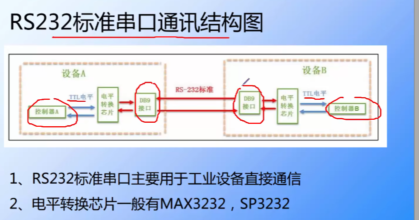
RS-232长这样子:(九根针)
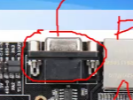

* *可以在指南者上拓展出RS232接口:*
购买一个232转TTL:
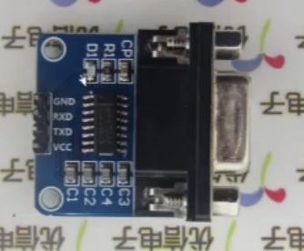
四个引脚,vcc和gnd分别接stm32提供的一个vcc和gnd即可;
rxd(收端)和txd(发端)
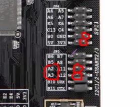


### usb转串口:
图中的控制器A即stm32. 
usb协议(即universaal serial bus,通用串行总线协议), 信号传输方式是差分信号, 且需要复杂的协议通信(枚举, 握手, 数据帧...)
#### 具体来说, stm32板子和电脑连接:
stm32指南者板子上, 信号要通过板子上的ch340芯片, 然后通过连接的usb转串口数据线. 
##### 引脚连接方式:(如图)
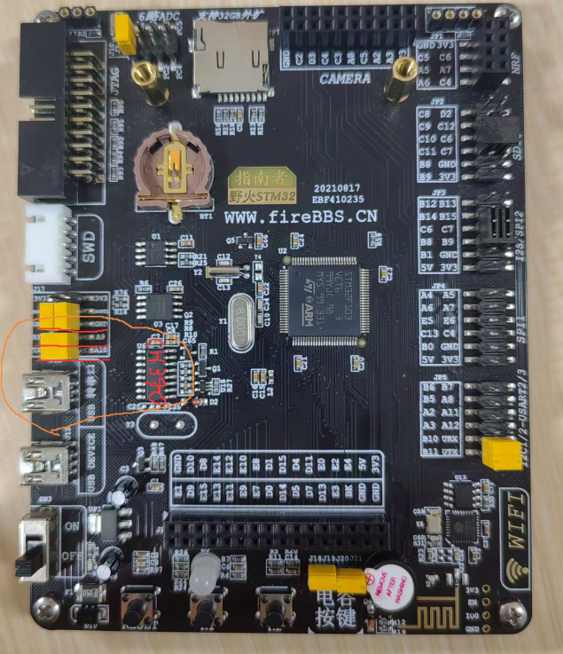
查原理图得:(查原理图第一图, 即下方标有`stm32f103vet6`, 此为cpu的引脚. 可看到PA9分配到USART1_TX, 后者即为stm32的UART发送引脚, PA10分配到USART1_RX.)
看板子上PA9和PA10分别连接RXD, TXD, 这部分属于J11框图. 于是在原理图中搜索J11框图, 查到这是usb串口转换模块, 而TXD和RXD是芯片ch340的引脚, 它们通过两个跳帽和PA9(USART1_RX), PA10(USART1_TX)相联.
* PA9表示一个物理上的唯一的引脚. 而引脚可以复用, 抽象意义的引脚USART1_RX被分配在PA9.
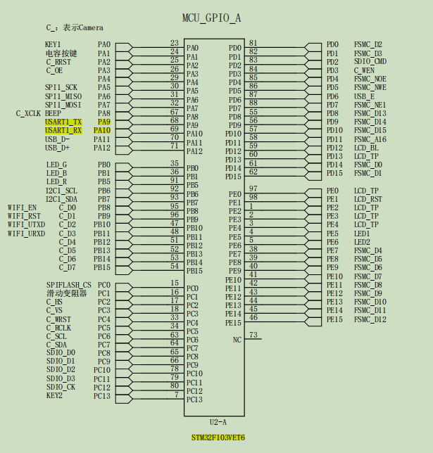
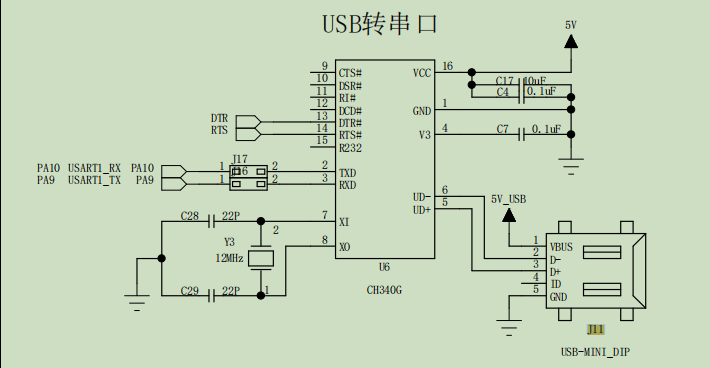
STM32 TX（即USART1_TX, 即PA9. TTL电平） → CH340 RX(即J11板块上的RXD)
STM32 RX（即USART1_RX, 即PA10. TTL电平） → CH340 TX(即J11板块上的TXD)
STM32 GND → CH340 GND
* 用 CH340 连接 STM32 和电脑时，它在做两个转换

	* USB ⇄ UART（协议转换）
	电脑用的是 USB，但 STM32 只会 UART，CH340 充当“协议翻译官”。
	* USB ⇄ TTL（电平转换）
	电脑的 USB 是 0V / 5V，STM32 的 UART 是 3.3V，CH340 还能帮忙匹配电平。
安装ch340驱动后, windows可以认识ch340, 给它分配一个com口.
TTL转usb电平的芯片常有`ch340`.
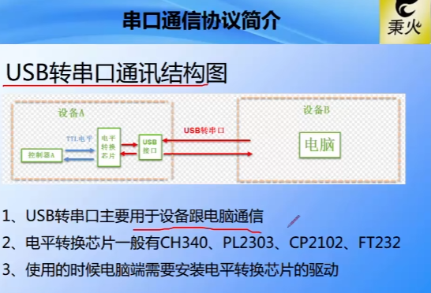

**实际电路图:**
实际上就是ch340电路图.
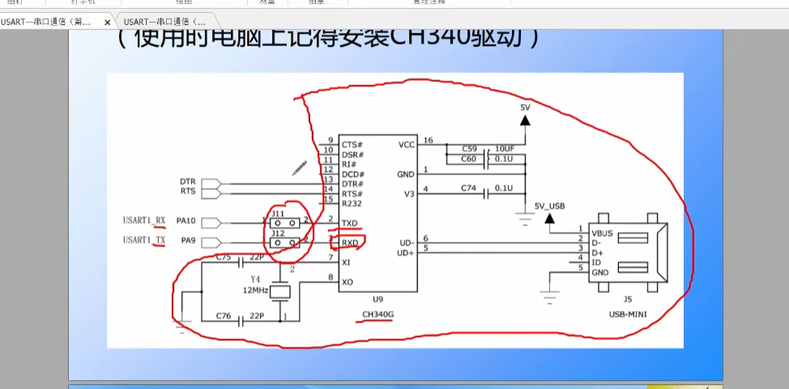

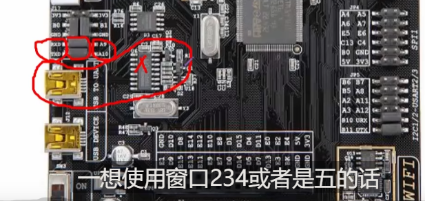

由上图, 默认ch340芯片的RXD和TXD连接的时PA9和PA10, 这两个引脚被分配在USART1的TX和RX. 所以默认使用的是USART1.

如果想要使用USART2, 可以拆掉两个跳帽, 把CH340的RXD和TXD连接到USART2外设的TX和RX上. 查表(`Table 5. High-density STM32F103xx pin definitions`)得, 
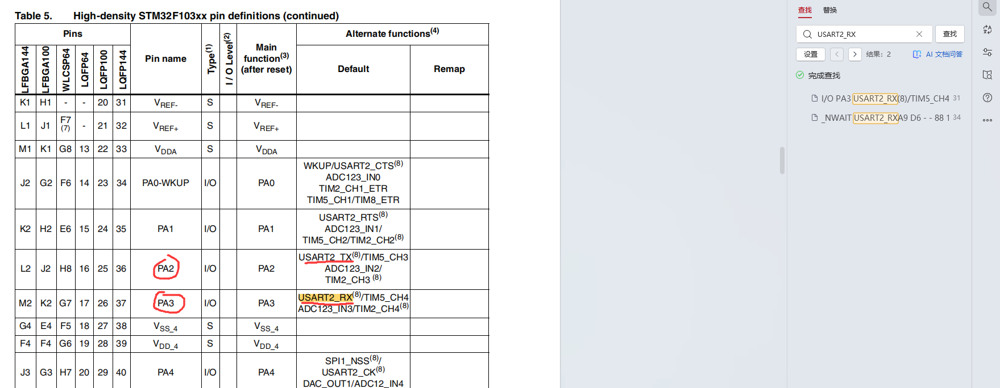
它们是:`PA3`, `PA2`. 于是我们可以用杜邦线把RXD和TXD连接到PA2和PA3.

同理, PB10, PB11默认和wifi连接, 是USART3.


### 串口协议的软件部分:
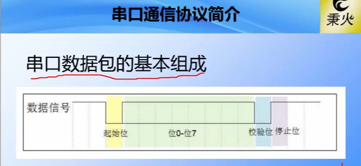
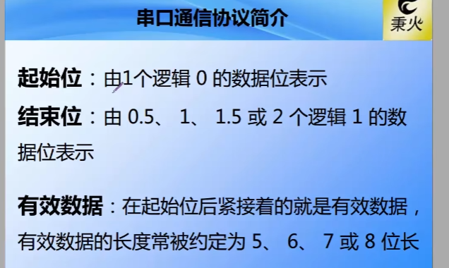
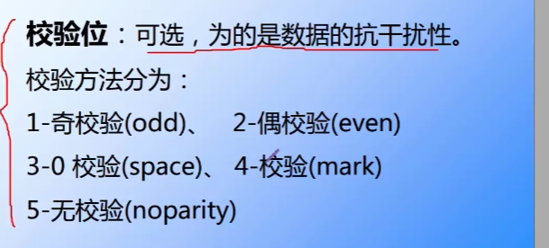
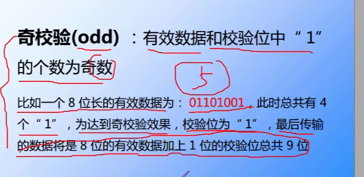
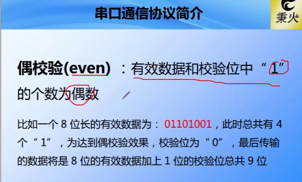
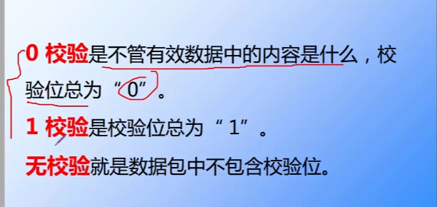


### 串口通信-功能框图

#### 1.引脚部分
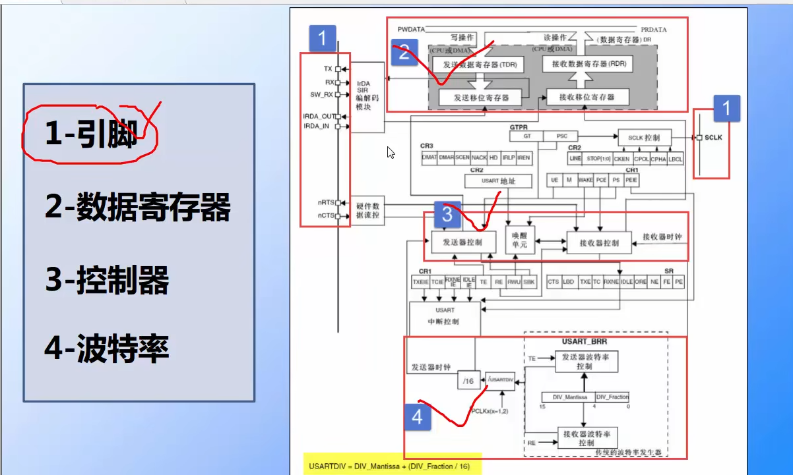

每个USART串口有五个常用引脚(IRDA_OUT和IRDA_IN是红外功能, 很少用):

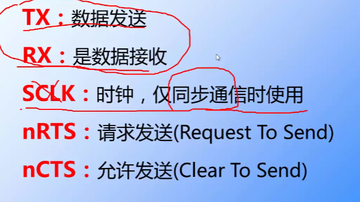
nRTS中的n表示低电平有效.
这些引脚对应的gpio: 去查询`2-STM32F103xCDE_数据手册-英文`的`pinouts and pin descriptions, table 5`.
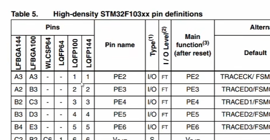
就这个表. high-density即高容量. 指南者就是高容量.
LQFP144指的是144脚的芯片,
指南者是LQFP100型号的.
但是前六列这些数字的意义? 是PCB封装引脚号.
例如如果我想找usart1的cts, 我应该搜索这个引脚名:`USART1_CTS`
然后搜索数据手册(`pinouts and pin descriptions, table 5`):
这是查询的结果.
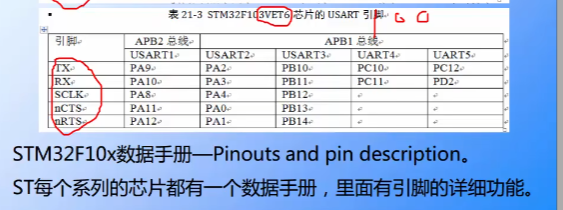


* 我们可以看到stm32指南者有5个串口模块, 其中uart1挂载在总线APB2(72M时钟)上,比较快. 剩下四个挂载在APB1总线(36M时钟).  同时也要注意写程序的时候记得打开总线时钟.

* 前三个是`USART`, 即通用同步/异步收发器. 后两个是`UART`,即通用异步收发器. 少了`SCLK`, `CTS`, `RTS`三个引脚.

#### 2.数据寄存器部分
这部分自己看寄存器文档即可.

`USART_DR`. 9位有效. 
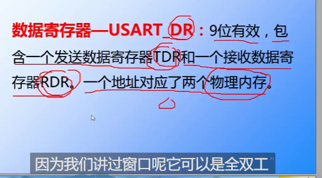
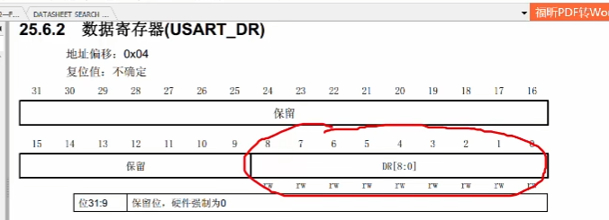

由USART_CR1的M位决定具体用几位.
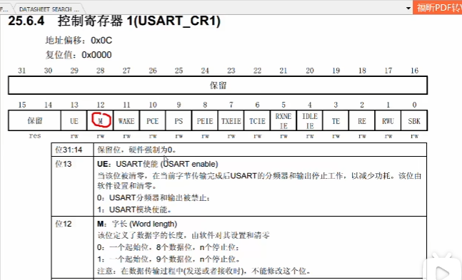


停止位由USART_CR2寄存器的相关位配置:
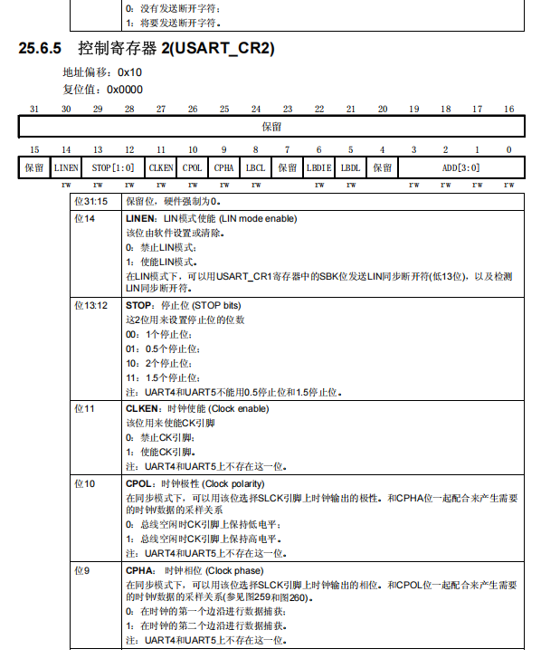
最常用:1个停止位.


想要使用usart, 首先UE(usart enable, 在CR1寄存器的13位)要置1. 如果接收, RE(也在CR1寄存器)=1. 同理发送需要TE=1.

* SR寄存器:存储状态用的. 

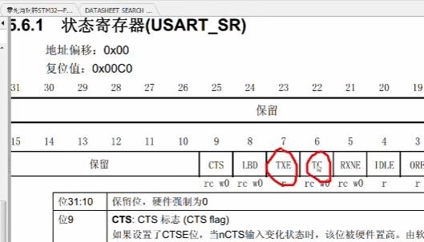


`RXNE`: 读数据寄存器非空. 该位表示:
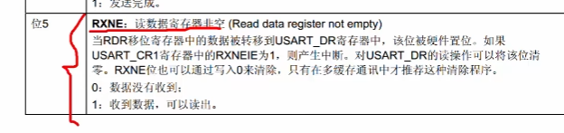

`TXEIE`: 

`USART_BRR`是波特率寄存器.
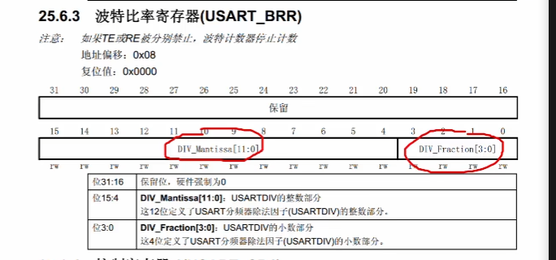


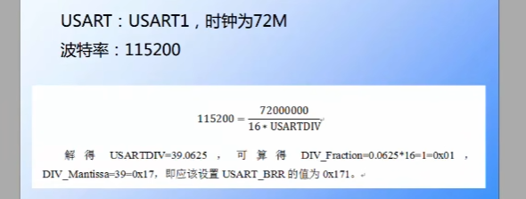

### USART编程

### 学习stm32f10x_usart.h.

## 5. 固件库编程经验**
---
根据我们的经验, 头文件大致结构为:
1. 定义初始化结构体;
2. 用宏给出结构体的成员的值的右值选项(其实就是用别名代替一个个寄存器)
3. 固件库函数. 
   1. 会有init函数, 也就是调用来初始化结构体(把填的设置写到寄存器里)
   2. ...其他常用函数. 

固件库编程中, 常用的两类结构体:
* [外设名]_InitTypeDef
  * 这个结构体用来对某个特定外设([外设名]_TypeDef类的对象)进行配置. 它储存设置用的寄存器赋值. 由用户声明, 然后作为形参传入init函数进行初始化.
* [外设名]_TypeDef
  * 这个结构体
  * 该结构体的实例由 STM32 固件库(stm32f10x.h)提供，对应 STM32 内部 USART 硬件外设的寄存器。一般用户不涉及声明新的结构体哦.
   
---


#### USART初始化结构体
有两个结构体. 它们在固件库FWLB的stm32f10x_usart.c中

```c
typedef struct
{
  uint32_t USART_BaudRate;            /*!< This member configures the USART communication baud rate.
                                           The baud rate is computed using the following formula:
                                            - IntegerDivider = ((PCLKx) / (16 * (USART_InitStruct->USART_BaudRate)))
                                            - FractionalDivider = ((IntegerDivider - ((u32) IntegerDivider)) * 16) + 0.5 */

  uint16_t USART_WordLength;          /*!< Specifies the number of data bits transmitted or received in a frame.
                                           This parameter can be a value of @ref USART_Word_Length */

  uint16_t USART_StopBits;            /*!< Specifies the number of stop bits transmitted.
                                           This parameter can be a value of @ref USART_Stop_Bits */

  uint16_t USART_Parity;              /*!< Specifies the parity mode.
                                           This parameter can be a value of @ref USART_Parity
                                           @note When parity is enabled, the computed parity is inserted
                                                 at the MSB position of the transmitted data (9th bit when
                                                 the word length is set to 9 data bits; 8th bit when the
                                                 word length is set to 8 data bits). */
 
  uint16_t USART_Mode;                /*!< Specifies wether the Receive or Transmit mode is enabled or disabled.
                                           This parameter can be a value of @ref USART_Mode */

  uint16_t USART_HardwareFlowControl; /*!< Specifies wether the hardware flow control mode is enabled
                                           or disabled.
                                           This parameter can be a value of @ref USART_Hardware_Flow_Control */
} USART_InitTypeDef;

```

如果不用使用同步功能, 不需要初始化下面这个时钟结构体咯.
```c
typedef struct {
uint16_t USART_Clock; // 时钟使能控制
uint16_t USART_CPOL; // 时钟极性(空闲的时候是高电平还是低电平.)
uint16_t USART_CPHA; // 时钟相位(第一个边沿触发还是第二个边沿触发)
uint16_t USART_LastBit; // 最尾位时钟脉冲(当 STM32 的 USART 处于 同步模式（Synchronous Mode） 时，USART 需要输出一个时钟信号 (USARTx_CK) 来同步通信。USART_LastBit 决定是否在数据帧的 最后一位 发送时再输出一个额外的时钟脉冲。)
} USART_ClockInitTypeDef;

```

#### USART固件库函数
它们在固件库FWLB的stm32f10x_usart.c中
```c
void USART_DeInit(USART_TypeDef* USARTx);//default init. 就是把某个usart硬件`USARTx`初始化为默认值.
void USART_Init(USART_TypeDef* USARTx, USART_InitTypeDef* USART_InitStruct);//初始化函数. 接受某个usart硬件`USARTx`和用户写的初始化设置结构体`USART_InitStruct`, 然后把前者用后者进行初始化.
void USART_StructInit(USART_InitTypeDef* USART_InitStruct);//把传入的初始化结构体设置为默认值.
void USART_ClockInit(USART_TypeDef* USARTx, USART_ClockInitTypeDef* USART_ClockInitStruct);//用时钟初始化结构体, 来配置某个usart的时钟. (适用于同步模式. 我们一般都使用异步模式...不需要配置时钟.)
void USART_ClockStructInit(USART_ClockInitTypeDef* USART_ClockInitStruct);//把传入的初始化结构体设置为默认值.
void USART_Cmd(USART_TypeDef* USARTx, FunctionalState NewState);//
void USART_ITConfig(USART_TypeDef* USARTx, uint16_t USART_IT, FunctionalState NewState);//中断配置. usart发送数据寄存器为空/完成发送/接受数据寄存器为空..时, 都可以产生中断.
void USART_DMACmd(USART_TypeDef* USARTx, uint16_t USART_DMAReq, FunctionalState NewState);
void USART_SetAddress(USART_TypeDef* USARTx, uint8_t USART_Address);
void USART_WakeUpConfig(USART_TypeDef* USARTx, uint16_t USART_WakeUp);
void USART_ReceiverWakeUpCmd(USART_TypeDef* USARTx, FunctionalState NewState);
void USART_LINBreakDetectLengthConfig(USART_TypeDef* USARTx, uint16_t USART_LINBreakDetectLength);
void USART_LINCmd(USART_TypeDef* USARTx, FunctionalState NewState);
void USART_SendData(USART_TypeDef* USARTx, uint16_t Data);
uint16_t USART_ReceiveData(USART_TypeDef* USARTx);
void USART_SendBreak(USART_TypeDef* USARTx);
void USART_SetGuardTime(USART_TypeDef* USARTx, uint8_t USART_GuardTime);
void USART_SetPrescaler(USART_TypeDef* USARTx, uint8_t USART_Prescaler);
void USART_SmartCardCmd(USART_TypeDef* USARTx, FunctionalState NewState);
void USART_SmartCardNACKCmd(USART_TypeDef* USARTx, FunctionalState NewState);
void USART_HalfDuplexCmd(USART_TypeDef* USARTx, FunctionalState NewState);
void USART_OverSampling8Cmd(USART_TypeDef* USARTx, FunctionalState NewState);
void USART_OneBitMethodCmd(USART_TypeDef* USARTx, FunctionalState NewState);
void USART_IrDAConfig(USART_TypeDef* USARTx, uint16_t USART_IrDAMode);
void USART_IrDACmd(USART_TypeDef* USARTx, FunctionalState NewState);
FlagStatus USART_GetFlagStatus(USART_TypeDef* USARTx, uint16_t USART_FLAG);//获取usart的状态标志位. 
// USART_FLAG_TXE	发送数据寄存器空，表示可以发送新数据
// USART_FLAG_RXNE	接收数据寄存器非空，表示有新数据可以读取
// USART_FLAG_TC	发送完成
// USART_FLAG_ORE	过载错误
// USART_FLAG_FE	帧错误
void USART_ClearFlag(USART_TypeDef* USARTx, uint16_t USART_FLAG);//手动清除 USART 标志位.
ITStatus USART_GetITStatus(USART_TypeDef* USARTx, uint16_t USART_IT);//检查 USART 的中断标志位 是否被触发，判断是否进入某个 USART 中断状态。
// USART_IT_TXE	发送寄存器空中断
// USART_IT_RXNE	接收数据寄存器非空中断
// USART_IT_TC	发送完成中断
// USART_IT_ORE	过载错误中断
// USART_IT_FE	帧错误中断
void USART_ClearITPendingBit(USART_TypeDef* USARTx, uint16_t USART_IT);//清除 USART 的中断挂起标志，即 手动清除某个中断状态，避免中断重复触发。
```


#### 编程任务和流程
* 01-初始化串口需要用到的GPIO
* 02-初始化串口, USART _InitTypeDef
* 03-中断配置(接收中断,中断优先级)
* 04-使能串口
* 05-编写发送和接收函数
* 06-编写中断服务函数

## 6.电源管理

stm32芯片的电源模块:
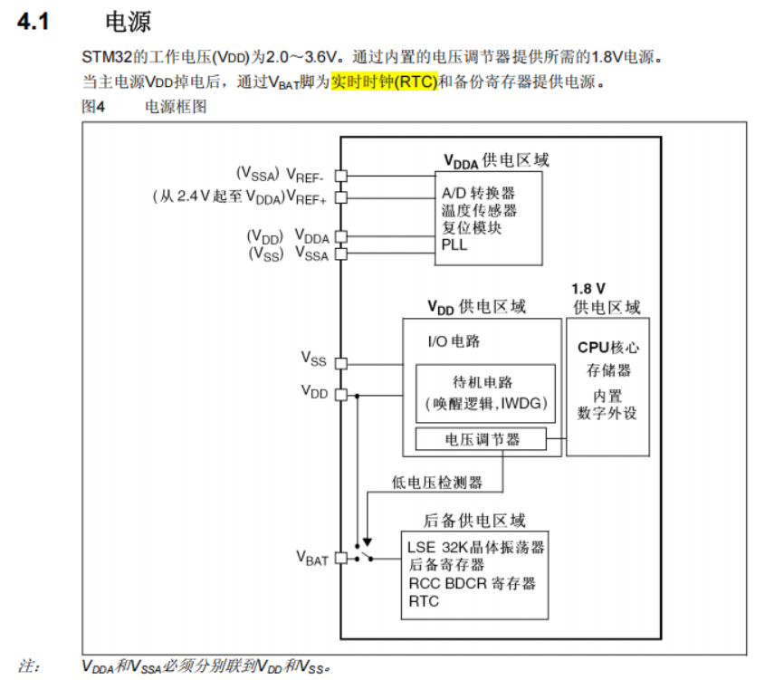

特别的,stm13f103v6(指南者)型号的usb供电模块原理图:
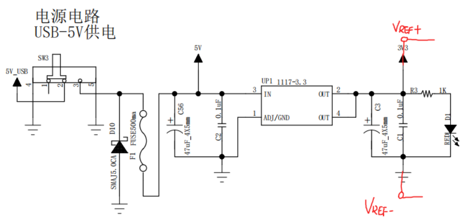


### 6.1 三种模式

模式名称	        | CPU状态	      | 时钟状态				 | 电流典型值（@72 MHz） | 说明
|------------------|--------------|--------------------|-----------------------|------|
运行模式（Run）     | 正常运行         | 所有开启（HSE、PLL） | 20～30 mA | CPU 主频全速运行，外设全开
睡眠模式（Sleep）   | CPU停止，外设继续 | 外设时钟正常 | 6～12 mA | 用 __WFI()，中断可唤醒
停止模式（Stop）    | CPU停止          | 主时钟关闭，仅低速时钟保留 | 10～100 µA | RAM 保持，唤醒稍慢，可通过 RTC 唤醒
待机模式（Standby） | 全部停止         | 所有时钟关闭 | 1～10 µA | RAM丢失，需复位唤醒，功耗最低

#### 1.睡眠模式(sleep)

通过调用_WFI()或_WFE()进入睡眠.

睡眠有两个模式: 立即和退出时. 它们主要是通过WFI()睡眠时区分的. 通过配置内核寄存器`SLEEPONEXIT`设置.

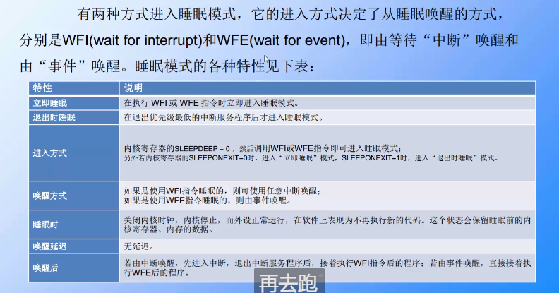

#### 2.停止模式(stop)

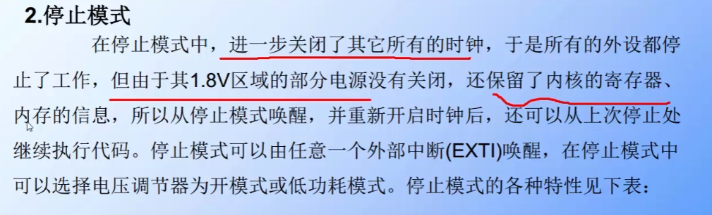
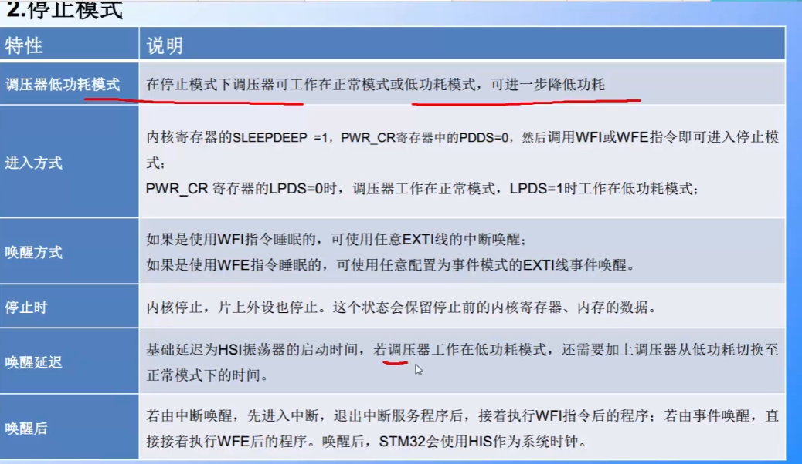


#### 3.待机模式(standby关机)

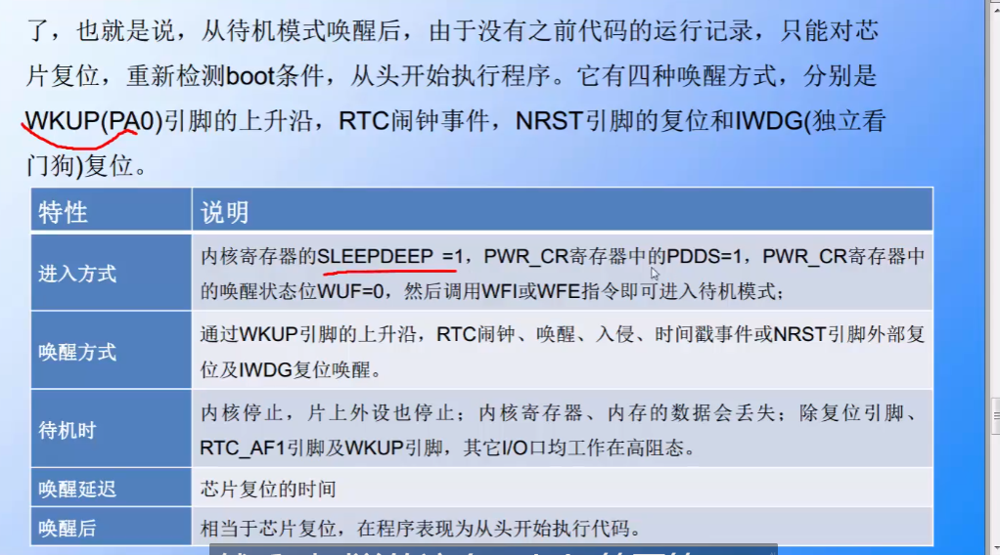


注意: 如果有备份供电(纽扣电池), `备份域`内的RTC都可以正常运行, 寄存器都可以被正常保存.

### 6.2 电源控制的寄存器(PWR_CR)和库函数

它们是arm cc编译器支持的一些指令, 是最底层的指令了. 我们不能再进一步跳转...
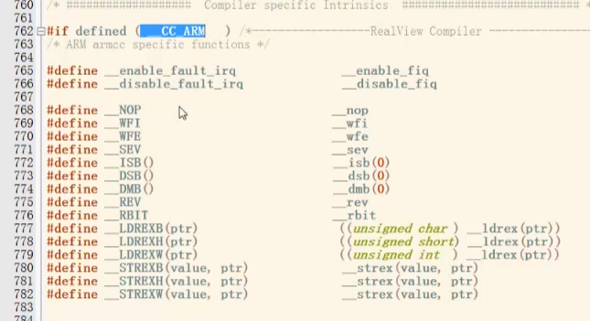
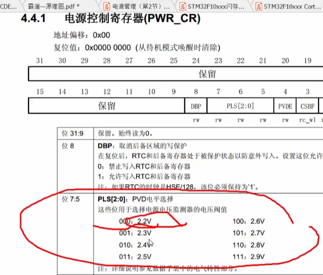

我们可以去看`Cortex-M3 权威指南`:
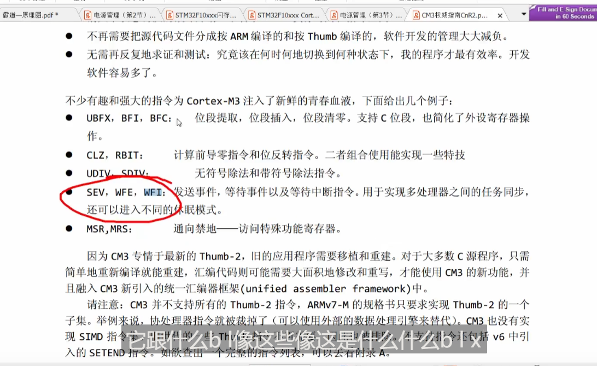


#### WFI和WFE命令  

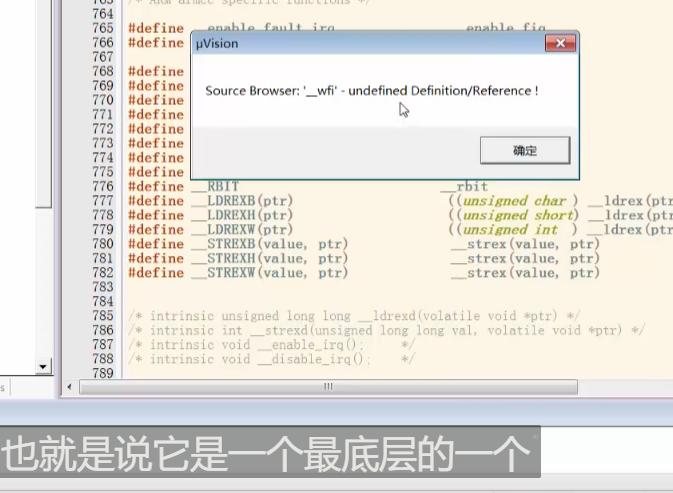
### 6.3 低功耗实验

我们通过软件使寄存器:
* SLEEPDEEP = 1
* PWR_CR->PDDS = 1
* PWR_CR->WUF = 0
然后调用`__WFI()`/`__WFE`, 进入待机.

唤醒: 给`WKUP`引脚上升沿信号.

但是具体版上哪个引脚使`WKUP`引脚呢?

我们看到`数据手册 Table 5. High-density STM32F103xx pin definitions (continued)`中, `WKUP`引脚被接在`PA0` 引脚.

我们看到`指南者原理图`中, `K1`按键按下后, `PA0`引脚会通过电阻R15接入高电平.
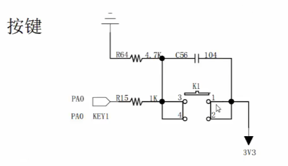


## 7.杂项

使用外设(如串口usart, ADC, i2c, spi)...引脚(绑定到哪个gpio口), 去`数据手册`里找(pinouts and pin descriptions). 注意`参考手册`里没有. 它主要是介绍外设的功能和原理图以及寄存器说明.

比如, 我们使用adc, 先看`参考手册`:

现在我们想知道外部通道ADCx_IN0~ADCx_IN15这16个外部通道接哪个gpio引脚. 

现在去查`数据手册`, 找到
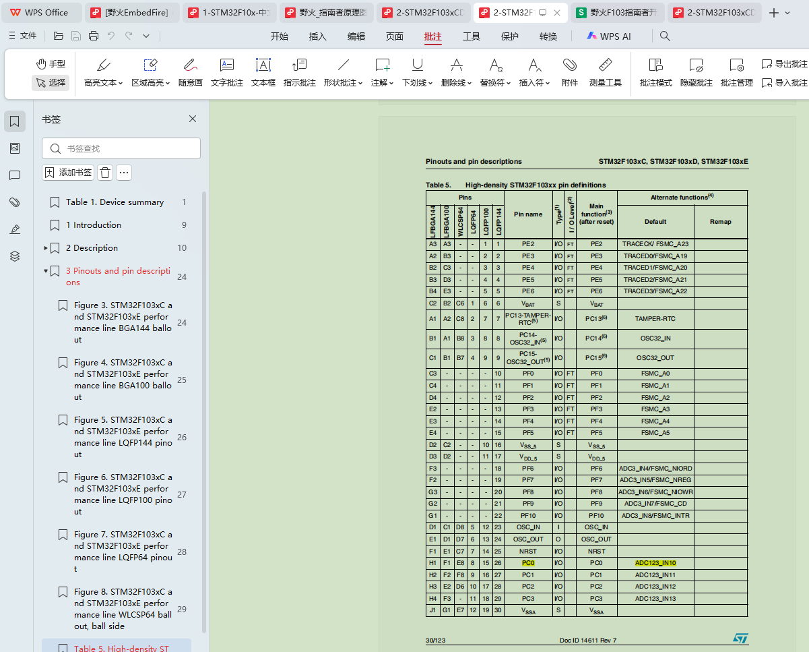


发现文件一处错误: stm32f10xx中文说明手册，寄存器映射GPIOF基地址错了，别问我怎么知道的，这是一个痛苦的故事。


出现flash download failed cortex-M3，然后将debug中setting中的debug中的connect设置为under reset， reset设为SYSRESETEQ后就可以了.


编译出现4个错误20个警告的话，魔术棒target里右上选version5版本.

### 7.0 常用英文缩写说明

-   **LDO**：Low Drop-Out regulator，低压差线性稳压器. 比DC-DC降压模块,比如buck低能, 就是纯电阻分压.
    -   工作方式：在输入和输出之间串联一个“可变电阻”（通常是一个晶体管），通过调节它的导通度来丢弃多余电压。
    -   优点：电路简单、响应快、输出噪声低。  
    -   缺点：效率低——当输入电压高于输出很多时，剩余能量全以热量形式浪费掉；尤其 ΔV（输入−输出）越大，损耗越严重。


    
-   **MCU**：Microcontroller Unit，微控制器单元
    
-   **ADC**：Analog‑to‑Digital Converter，模数转换器
    
-   **VDDA**：Voltage Digital‑to‑Analog，模拟电源输入
    
-   **VSSA**：Voltage Serial Signal Analog，模拟地
    
-   **VBUS**：USB 总线供电电压


