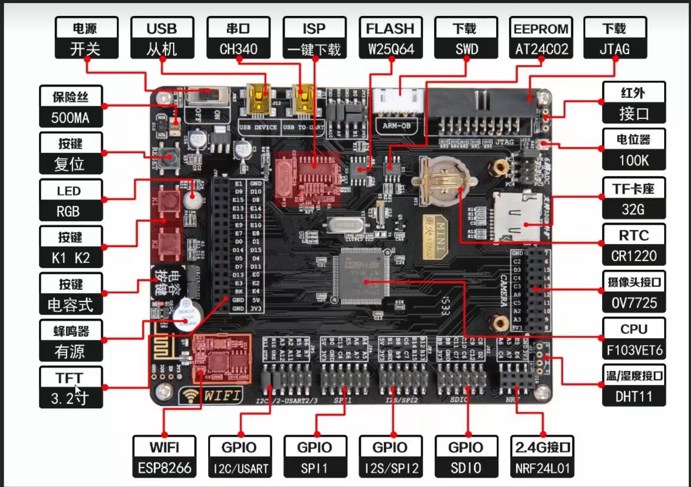

## 9 STM32CubeMX

我们使用型号:
`stm32f103vet6`

### 1. 创建项目流程:
使用三种方式创建新工程: 
* 1.选择MCU
* 2.选择板子
* 3.选择example

我们选择MCU, 搜索stm32f103vet6, 选择双击:


至此创建了一个新的cube工程.

### 2. Pinouts&Configuration


在芯片图上点击某个引脚, 会让你选择该引脚的复用功能:


以PC13为例:


| 选项名                 | 含义               | 用途                                 |
| ------------------- | ---------------- | ---------------------------------- |
| **PC13-TAMPER-RTC** | 默认名称（芯片复位后的默认功能） | 通常用于 RTC 的 **防篡改输入**，但默认状态不是 GPIO  |
| **Reset\_State**    | 芯片复位后默认状态        | STM32 上电后此引脚默认处于浮空输入模式             |
| **RTC\_OUT**        | RTC 时钟输出         | 用于将 RTC 的 1Hz 信号输出到外部设备（极少用）       |
| **RTC\_TAMPER**     | RTC 篡改检测输入       | 如果你启用 RTC 防篡改功能，它作为输入检测外部非法干预（如重启） |
| **GPIO\_Input**     | 通用输入             | 作为普通数字输入引脚                         |
| **GPIO\_Output**    | 通用输出             | 💡 最常用模式，用于点灯、驱动外设等                |
| **GPIO\_Analog**    | 模拟输入模式           | 如 ADC 输入（在 PC13 上不会这么用）            |
| **EVENTOUT**        | 输出事件信号           | 用于低功耗应用中的事件触发，极少用                  |
| **GPIO\_EXTI13**    | 外部中断线 13         | 把这个引脚设置成中断源，如按键触发 `EXTI13` 中断      |

>可以方便看到PC14和PC15分别有一个`RCC_OSC32_IN`和`RCC_OSC32_OUT`. 这两个复用引脚用于连接`LSE`外部低速晶振的输入输出端. 启用LSE的时候, PC14和PC15会被占用. 所以一般PC14和PC15不经常用作其他用途了.

#### 2.1 配置gpio

我们以配置PC13为gpio输出模式然后用来点灯为例.

右边芯片图中配置PC13为`GPIO_Output`, 然后左边选择System Core->GPIO, 在Configuration横栏选择配置好的PC13行, 下方出现config选项.


| 选项名称                       | 含义                     | 推荐设置（点灯用）                       |
| -------------------------- | ---------------------- | ------------------------------- |
| **GPIO Output Level**      | 上电初始化时该引脚输出的是高电平还是低电平  | 🔺 `High`（先熄灯）或 `Low`（先亮）       |
| **GPIO Mode**              | 引脚工作模式（推挽输出(强制高(3.3v)低(0v)电平, 有拉电阻能力, 但是无法做到比如说你想让引脚接入5v会搞坏板子)或开漏输出(没有拉电阻能力需要外部电路)）      | ✅ `Output Push Pull`（点灯用）       |
| **GPIO Pull-up/Pull-down** | 是否启用芯片内部的可编程电阻配置为上下拉电阻（对输出来说通常无效）   | ❌ `No pull-up and no pull-down` |
| **Maximum Output Speed**   | IO 口输出电平切换速度（相当于驱动能力）  | ✅ `Low`（PC13 驱动能力本就弱, 点灯也不要求）           |
| **User Label**             | 你可以给这个引脚起个名字，生成代码时自动加宏 | 可选，如命名为 `LED1`                  |


#### 2.2 配置RCC:

在Pinout&Configuration -> System Core -> RCC 处配置.


HSE和LSE在这里配置, 选项都一样.

| 选项                          | 说明                               |
| ----------------------------- | -------------------------------- |
| `Disable`                     | 关闭 HSE，不使用外部晶振（只靠内部 RC 振荡器 HSI）  |
| `BYPASS Clock Source`         | 外部提供时钟信号（不是晶振，而是模块，如 TCXO）       |
| `Crystal/Ceramic Resonator` ✅ | 用外接晶振，**大多数开发板都选这个**（比如 8MHz 晶振） |


选项**Master Clock Output (MCO)** 即把自己主频输出到某个引脚（如 PA8）”的功能，一般用于调试或外部同步。


### 9.3 配置SYS(系统)

在Pinout&Configuration -> System Core -> SYS 处配置.

配置SYSTEM:


* Debug项

该项决定**调试接口**和**跟踪功能**使用哪些引脚. 一般设为Serial Wire. 

| 选项名称                                     | 引脚占用                                 | 含义/用途                   |
| ---------------------------------------- | ------------------------------------ | ----------------------- |
| **Serial Wire**                          | 2 个引脚：`SWDIO` + `SWCLK`              | 推荐 ✅：常用的调试方式（SWD）       |
| **JTAG (4 pins)**                        | 4 个引脚：`JTDI`, `JTDO`, `JTCK`, `JTMS` | 老式调试方式（很少用了）            |
| **JTAG (5 pins)**                        | 5 个引脚：上面 4 个 + `nTRST`               | 更完整的老式 JTAG 接口          |
| **Trace Asynchronous SW**                | 基于 SWD，再用额外引脚输出调试跟踪数据                | 高级 Trace 功能，STM32F1 不常用 |
| **JTAG with Trace Synchro (1/2/4 bits)** | JTAG + Trace 输出通道                    | STM32F1 系列不支持           |
| **Trace Synchro SW (1 bit)**             | SWD + 1 条 Trace 输出线                  | STM32F1 系列不支持           |


### 9.4 配置其他各种外设

在Pinout&Configuration->Analog(配置ADC和DAC); Timers(配置TIM)...

#### GPIO口的配置


### 9.5 Clock Configuration


Clock Configuration界面如下图, 其中采用了常用的配置.


* input frequency:

	可以看到最左边主时钟树有两个input frequency, 上面那个32.768KHz的是LSE. 在Pinout&Configration里没开的话就是灰色的. 下面这个是HSE, 即板子上焊的外部晶体晶振.

* 两个内部振荡器LSI, HSI在左上角.

* PLL Source Mux

	这个复选器决定要倍频来自HSE的信号还是HSI的信号. 一般选择HSE.

* PLLMul

	可以选择PLL的倍频倍数. 对`stm13f103vet6`, 最高主频72MHz, 此处可以选择`×9`.


	如果Pinouts&Configs没有选择conectivity->USB通讯, 则此处为灰

	

* System Clock Mux:
  
	

	这个复选器选择STM32的**主系统时钟SYSCLK**来自哪个源.
	在**选择HSE/HSE分频得到的PLLCLK为源**的时候可以选择是否启用CSS(clock security system). 如果启用, 它会在HSE震荡失败的时候生成一个不可屏蔽中断(NMI), 然后自动切换到HSI.

* AHB Prescaler; APB1 Prescaler

AHB和APB1分频. 分频的结果必须保证不超过该时钟线允许的最大值. 比如下图的配置中, 导致APB1总线时钟`PCLK1`最终为72KHz, 超过了允许的最大值`36 MHz max`, 于是分频器和PCLK1结果两个框标红表示错误. 需要把APB1 Prescaler设为`/2`.


## 0 上版流程 & STM32项目结构:

### 0.1 上板流程

#### 安装usb转串口驱动
即ch340. 驱动安装好后, 板子插`usb转串口`那个usb口. 上电后, 在电脑设备管理器-端口应当能看到ch340端口.不上电就没有. 废话!


#### 先安装keil(5.24以上版本,最好)
然后使用注册机破解它.
然后找要安装的包pack文件(即cmsis pack),双击安装.
然后就可以打开keil使用了.


#### 新建project流程:
keil里新建一个μvision project后, 在当前目录:
需要添加启动文件(`F:\aza\wokwok\STM32\野火【STM32F103开发板-指南者】资料\3-STM32官方资料(标准库固件包; hal固件包, 一些手册)\标准库固件包\STM32F10x_StdPeriph_Lib_V3.5.0\Libraries\CMSIS\CM3\DeviceSupport\ST\STM32F10x\startup\arm`)
需要添加自己的.c文件.
需要添加一个空的头文件.

#### 生成编译文件
写好后编译. 记得勾选生成hex文件.

#### (串口)下载
然后(这里用串口通信)使用串口下载软件(mcuisp):
	搜索串口,选择对应的ch340串口. bps就115200吧别太高了
	选择下载时的程序文件为生成的hex文件.(在项目文件夹的objects里)
	选择DTR低电平复位; RTS高电平进bootloader.(这个的原理可以参考野火文档-isp一键下载原理分析.)

### 0.2 STM32项目结构
```
azazel@DESKTOP-NJKSK6O:/mnt/f/aza/WOKWOK/STM32/my_projects/ADC_DMA_TIM_interrupt$ tree
.
├── Libraries(官方库文件. 这些都是和内核相关的文件, 大部分情况下你几乎不会去修改, 只会include它们, 比如`#include stm32f10x.h`)
│   ├── CMSIS
│   │   ├── core_cm3.c
│   │   ├── core_cm3.h
│   │   ├── startup(.s文件是)
│   │   │   ├── startup_stm32f10x_cl.s
│   │   │   ├── startup_stm32f10x_hd.s
│   │   │   ├── startup_stm32f10x_hd_vl.s
│   │   │   ├── startup_stm32f10x_ld.s
│   │   │   ├── startup_stm32f10x_ld_vl.s
│   │   │   ├── startup_stm32f10x_md.s
│   │   │   ├── startup_stm32f10x_md_vl.s
│   │   │   └── startup_stm32f10x_xl.s
│   │   ├── stm32f10x.h(主头文件. 包含所有寄存器的定义.)
│   │   ├── system_stm32f10x.c(一些系统初始化函数)
│   │   └── system_stm32f10x.h(一些系统初始化函数)
│   └── FWlib(即Firmware Library, STM32F10x标准固件库)
│       ├── inc(外设的头文件)
│       │   ├── misc.h
│       │   ├── stm32f10x_adc.h
│       │   ├── stm32f10x_bkp.h
│       │   ├── stm32f10x_can.h
│       │   ├── stm32f10x_cec.h
│       │   ├── stm32f10x_crc.h
│       │   ├── stm32f10x_dac.h
│       │   ├── stm32f10x_dbgmcu.h
│       │   ├── stm32f10x_dma.h
│       │   ├── stm32f10x_exti.h
│       │   ├── stm32f10x_flash.h
│       │   ├── stm32f10x_fsmc.h
│       │   ├── stm32f10x_gpio.h
│       │   ├── stm32f10x_i2c.h
│       │   ├── stm32f10x_iwdg.h
│       │   ├── stm32f10x_pwr.h
│       │   ├── stm32f10x_rcc.h
│       │   ├── stm32f10x_rtc.h
│       │   ├── stm32f10x_sdio.h
│       │   ├── stm32f10x_spi.h
│       │   ├── stm32f10x_tim.h
│       │   ├── stm32f10x_usart.h
│       │   └── stm32f10x_wwdg.h
│       └── src(外设的实现文件)
│           ├── misc.c
│           ├── stm32f10x_adc.c
│           ├── stm32f10x_bkp.c
│           ├── stm32f10x_can.c
│           ├── stm32f10x_cec.c
│           ├── stm32f10x_crc.c
│           ├── stm32f10x_dac.c
│           ├── stm32f10x_dbgmcu.c
│           ├── stm32f10x_dma.c
│           ├── stm32f10x_exti.c
│           ├── stm32f10x_flash.c
│           ├── stm32f10x_fsmc.c
│           ├── stm32f10x_gpio.c
│           ├── stm32f10x_i2c.c
│           ├── stm32f10x_iwdg.c
│           ├── stm32f10x_pwr.c
│           ├── stm32f10x_rcc.c
│           ├── stm32f10x_rtc.c
│           ├── stm32f10x_sdio.c
│           ├── stm32f10x_spi.c
│           ├── stm32f10x_tim.c
│           ├── stm32f10x_usart.c
│           └── stm32f10x_wwdg.c
├── Listing(汇编清单文件)
│   ├── USART.map
│   └── startup_stm32f10x_hd.lst
├── Output(编译结果. 其中有大量.s(汇编源代码), .crf(keil专用中间文件), .d(记录源文件之间的依赖关系的文件), .o(目标文件), .axf(ARM处理器调试文件), .htm(网页报告)....以及最重要的.hex, 用于烧录的16进制可执行文件. 你最终要烧录的东西就是这个.)
│   ├── USART.hex(用于烧录的16进制可执行文件)
│   ├── USART.htm
│	.....
├── Project(keil工程文件.)
│   └── RVMDK（uv5）
│       ├── BH-F103.uvguix.azazel(用户个性化配置)
│       ├── BH-F103.uvoptx(项目的配置和编译选项)
│       ├── BH-F103.uvprojx(可以用keil打开的工程文件.)
│       └── DebugConfig(调试器的配置)
│           ├── ADC_DMA_STM32F103VE_1.0.0.dbgconf
│           └── USART_STM32F103VE_1.0.0.dbgconf
├── User(这里都是用户自己编写的内容. 用户主代码区! 一般在这里编写我们自己的代码.)
│   ├── adc(如果你要用一个外设比如adc, 用模块化的风格编程.下同...)
│   │   ├── bsp_adc.c
│   │   ├── bsp_adc.h
│   │   └── readme.txt
│   ├── tim
│   │   ├── bsp_tim.c
│   │   └── bsp_tim.h
│   ├── usart
│   │   ├── bsp_usart.c
│   │   └── bsp_usart.h
│   ├── main.c(主函数, 程序入口.)
│   ├── stm32f10x_conf.h
│   ├── stm32f10x_it.c(中断服务函数.)
│   ├── stm32f10x_it.h
├── keilkill.bat(看起来意思是个清理工具, 可能会帮你删除所有的编译文件吧? )
└── readme.md
```

## 1 各种外设

* STM32硬件资源描述图



* stm32f10系列引脚分类


### 1.1 GPIO端口:

通用输入输出端口的简称. 也就是软件可以控制的引脚.
这个外设在APB2总线连接. 使用时复位和时钟信号要去APB2总线的对应控制寄存器打开.
一共有GPIOx, x=`ABCDE`五个端口, 每个端口有个16个引脚. 在板子上比如PB0即为GPIO的B端口0号引脚.

#### 1.1.1 GPIO的配置写法

比如要配置3个gpio为推挽输出模式, 来用于控制三个`LED外设`, 规范的做法:

```c

LED_GPIO_Config()	//在main.c 中调用配置函数. 具体的配置函数写在`bsp_led.c`中.


//bsp_led.h中配置宏名称(主要是要用的gpio名字). 实现硬件配置与程序逻辑解耦~
/* 如果你想换一个gpio用, 需要更改下面三个属性. port和clk必须依照你具体gpio对应的板上结构哦, 去看引脚吧. */
// R-红色: 这是一个属于`GPIOB`组的5号gpio, 是PB5引脚的复用. 使用apb2_gpiob的总线.
#define LED1_GPIO_PORT    	GPIOB			              /* GPIO端口 */
#define LED1_GPIO_CLK 	    RCC_APB2Periph_GPIOB		/* GPIO端口时钟 */
#define LED1_GPIO_PIN		GPIO_Pin_5			        /* 连接到SCL时钟线的GPIO */

// G-绿色
#define LED2_GPIO_PORT    	GPIOB			              /* GPIO端口 */
#define LED2_GPIO_CLK 	    RCC_APB2Periph_GPIOB		/* GPIO端口时钟 */
#define LED2_GPIO_PIN		GPIO_Pin_0			        /* 连接到SCL时钟线的GPIO */

// B-蓝色
#define LED3_GPIO_PORT    	GPIOB			              /* GPIO端口 */
#define LED3_GPIO_CLK 	    RCC_APB2Periph_GPIOB		/* GPIO端口时钟 */
#define LED3_GPIO_PIN		GPIO_Pin_1			        /* 连接到SCL时钟线的GPIO */

//假设LED1的GPIO你想换一个, 比如你想用PB8(gpio_pin_8), 则要查询: 它属于GPIOB端口, 则:
#define LED1_GPIO_PORT  GPIOB
#define LED1_GPIO_CLK   RCC_APB2Periph_GPIOB
#define LED1_GPIO_PIN   GPIO_Pin_8


//`bsp_led.c`中的配置
void LED_GPIO_Config(void)
{		
	/*定义一个GPIO_InitTypeDef类型的结构体.*/
	GPIO_InitTypeDef GPIO_InitStructure;


    /************* 通用配置：适用于所有 LED 引脚的通用设置 *************/
	/*开启LED相关的GPIO外设时钟*/
	RCC_APB2PeriphClockCmd( LED1_GPIO_CLK | LED2_GPIO_CLK | LED3_GPIO_CLK, ENABLE);

	/*设置引脚模式为通用推挽输出*/
	GPIO_InitStructure.GPIO_Mode = GPIO_Mode_Out_PP;   

	/*设置引脚速率为50MHz */   
	GPIO_InitStructure.GPIO_Speed = GPIO_Speed_50MHz; 
	/*选择要控制的GPIO引脚*/
	GPIO_InitStructure.GPIO_Pin = LED1_GPIO_PIN;	


    /************* 单独配置每个 LED 的引脚 *************/
	/*调用库函数，初始化GPIO*/
	GPIO_Init(LED1_GPIO_PORT, &GPIO_InitStructure);	
	
	/*选择要控制的GPIO引脚*/
	GPIO_InitStructure.GPIO_Pin = LED2_GPIO_PIN;

	/*调用库函数，初始化GPIO*/
	GPIO_Init(LED2_GPIO_PORT, &GPIO_InitStructure);
	
	/*选择要控制的GPIO引脚*/
	GPIO_InitStructure.GPIO_Pin = LED3_GPIO_PIN;

	/*调用库函数，初始化GPIOF*/
	GPIO_Init(LED3_GPIO_PORT, &GPIO_InitStructure);


	//初始化默认状态设置(即将)
	/* 关闭所有led灯	*/
	GPIO_SetBits(LED1_GPIO_PORT, LED1_GPIO_PIN);
	
	/* 关闭所有led灯	*/
	GPIO_SetBits(LED2_GPIO_PORT, LED2_GPIO_PIN);	 

	/* 关闭所有led灯	*/
	GPIO_SetBits(LED3_GPIO_PORT, LED3_GPIO_PIN);
}

```


#### 1.1.2底层寄存器
操作它们主要靠这几个寄存器:

##### 1. APB2总线 外设时钟使能寄存器(RCC_APB2ENR); APB2 外设复位寄存器 (RCC_APB2RSTR)
在AHB总线上. 地址为`0x4002 1000 - 0x4002 13FF`
首先是使能和复位信号. 如果想使用GPIO端口(在总线APB2连接), 则需要开启复位和时钟控制RCC. 外设的时钟和使能信号默认是关闭的.
当外设时钟没有启用时，软件不能读出外设寄存器的数值，返回的数值始终是0x0。


##### 2. GBIOx_ODR (output data reg)输出数据寄存器.
它是一个32bit寄存器. 高16位预留为0没用. 低16位控制端口0~端口15的输出电平, 0为低电平.

##### 3. GBIOx_CRL (config reg low)端口配置低寄存器.
负责Px0~Px7引脚的配置. 是32bit寄存器. 
相对于GBIOx基地址偏移为0. 复位0x4444 4444.
每个引脚占据4bit. 比如低4位为:
* MODEy[1:0] 这两位设置Px0的工作模式:
	* `00`输入模式
	* `01`输出模式，10 MHz
	* `10`输出模式，2 MHz
	* `11`输出模式，50 MHz
* CNFy[1:0] 这两位设置:
  * 当MODEY是`00`时;
    * `00`
    * `01`
    * `10`
    * `11`

##### 4. GBIOx_CRL (config reg high)端口配置高寄存器.
负责Px8~Px15引脚的配置.


* 双重模式特质adc1, adc2一起使用.


* 常用固件库函数(后面数字表示在对应头文件(ADC_开头就是`stm32f10x_adc.h`, RCC_开头就是`stm32f10x_rcc.h`等)的第几行.)


### 1.2 时钟和RCC(reset and clock control)

STM32F103 的时钟系统使用 时钟树 进行管理，所有外设（GPIO、USART、ADC 等）都需要时钟才能工作。

**HSE(High-Speed External clock), 高速外部时钟**由外部晶振提供信号.
可以通过 **PLL（锁相环）** 倍频，把 STM32 的主频提升到 72MHz.


RCC是stm32的一个外设,  负责系统复位和时钟管理.
它控制gpio, adc, usart, apb1, apb2灯外设的始终开关.
比如，RCC->APB2ENR |= (1 << 9); 用于 开启 ADC1 时钟。

时钟树:


* `HSE_OSC`震荡模块配合OSC_IN, OSC_OUT引脚输入输出, 产生HSE震荡时钟信号. (stm32本身不包含一个晶振模块. `HSE_OSC`模块只是利用驱动电路来配合外部的晶振工作, 产生信号给内部模块用.)
* 紧接着的`PLLXTPRE`(PLL extended pre-divider)预分频器模块.
  * ENABLE: 将HSE信号1/2分频, 然后送入`PLL选择器`.
  * UNENABLE: HSE直接送入`PLL选择器`.
* `PLL选择器`通过PLLSRC使能, 选择(分频的)`HSE`信号或HSI信号, 传给`PLL`.
* `HSI`是内部振荡器信号. 比较简洁, 不需要晶振和控制电路, 产生8MHZ的劣质信号...
* 


### 1.4 接口的重映射

例如`USART2_TX`, 当控制重映射的寄存器USART2_REMAP=0时, 它被分配到默认物理引脚PA2.
当USART2_REMAP=1时, 它被分配到物理引脚PD5.


### 1.5 DMA (data memory access) 直接存储器访问

功能: 在两处搬运数据, 不占用cpu.
比如串口输入时, 我们把sram中的字符串数据arr先搬运到cpu暂存reg, 然后搬运到USART的DR, 然后发送.
如果能使用DMA, 只需要cpu发个命令, 让数据arr自动搬运到目的地(USART_DR), cpu可以去做别的事.

stm32f103大容量版本有两个DMA外设`DMA1`, `DMA2`.
每个DMA有7个通道. 可以实现
* P->M
* M->P
* M->M

P:外设peripheral.  
M:

注意:ADC2没有DMA功能. 可以用ADC1或ADC3.

### 1.6 TIM(timer)定时器


#### 1.6.1 基本定时器


##### 时基 time base


* 计时器 **CNT**
* 预分频器 **PSC**(Prescaler)
  * 
  * 
* 自动重装载寄存器 **ARR** : 计数器到达该寄存器值后自动清零.

* **影子寄存器**: 
  * PSC和ARR都有`影子寄存器`(框图中, PSC和ARR矩形有一个影子图案). 其实就是打拍. 比如ARR的影子寄存器称为称为`自动重装载预装载`, 使能在TIMx_CR1寄存器的7位`ARPE`.
    * 
    * 

计数器时钟`CK_CNT`频率: 
$CK\_CNT=\frac{72M}{PSC+1}$
于是计数器技术一轮需要的时间为$\frac{ARR}{CK\_CNT}$

时基结构体的初始化:
```c
typedef struct{
//PSC的分频因子
uint16_t TIM_Prescaler;

//计数模式. (基本计时器TIM7,TIM8不用配, 只能向上计数)
uint16_t TIM_CounterMode;

//ARR的值, 计数周期
uint32_t TIM_Period;

//外部输入的时钟分频因子.(基本计时器没有)

//重复计时器(高级定时器专用)
//如果开启相关功能, 可以在ARR满的时候不产生中断/DMA请求, 而是清零并且让重复计时器++. 感觉没啥用...你扩倍ARR设定不就好了.
uint8_t TIM_ClockDivision;
//

} TIM_TimeBaseInitTypeDef
```

#### 1.6.2 高级定时器 TIM1, TIM8

三个功能:
* 定时
* PWM
* 捕获
  * 脉冲宽度
  * PWM


### 1.7 LED

指南者板子有RGBled.
其电路参见指南者原理图:


可见, red连接的gpio口是`PB5`, 当`PB5`低电平时导通.


如果你要设置gpio的话如下
```c
void REDLED_GPIO_Config(void)
{
    GPIO_InitTypeDef GPIO_InitStructure;
    
    // 开启 GPIOB 时钟
    RCC_APB2PeriphClockCmd(RCC_APB2Periph_GPIOB, ENABLE);
    
    // 配置 PB5 为推挽输出模式
    GPIO_InitStructure.GPIO_Pin = GPIO_Pin_5;
    GPIO_InitStructure.GPIO_Mode = GPIO_Mode_Out_PP;
    GPIO_InitStructure.GPIO_Speed = GPIO_Speed_50MHz;
    GPIO_Init(GPIOB, &GPIO_InitStructure);
    
    // 默认PB5高电平, 关闭 LED
    GPIO_SetBits(GPIOB, GPIO_Pin_0);
}
```


### 1.8 晶振


* 实体晶振:
  * `Y1`处即HSE所用的8MHz晶振(通过PLL倍频为72MHz)
  * `Y2`处即LSE所用的32.768KHz晶振.

* 内部振荡器晶振:
  * 串口芯片`CH340C`自带一个12MHz晶振在内部. (对应`Y3`处没有晶振. 否则用的是`CH340`的话, 这里要焊一个12MHz实体晶振给CH340G用)
  * `HSI`. 在MCU内部. 8MHz. 和焊接的HSE(PLL倍频之前)一样, 但是精度要差得多.
  * `LSI`. 在MCU内部. 40kHz, 精度差.

### 1.9


## 2 几个例程:

### 指南者板子硬件设计:
从原理图查到:

注意PC0实际上被SPI接口占用了. 别用.


### 2.1 ADC实验
整个原理图:

### 理论部分 


#### 引脚
VDDA(VDD(drain to drain) analog)即模拟模块的电源电压。
VSSA(VSS(source to source) analog)即模拟模块的地.


引脚分配图:


可以使用这个分压结构测量更高的电压:

很容易导出uout和uin的线性关系:
i1=uin/(R2+R3);
i2=3v3/(R1+R3);
uout=R3(i1+i2)=R3(uin/(R2+R3)+3v3/(R1+R3)). 线性关系.

每个ADC的端口:


先看adc的16个外部通道结构:

外部的16个通道在转换的时候又分为**规则通道**和**注入通道**.
其中规则通道最多有16路,注入通道最多有4路。
**规则通道**:顾名思意,规则通道就是很规矩的意思，我们平时
一般使用的就是这个通道。
**注入通道**:注入,可以理解为插入,插队的意思，是一-种不安
分的通道。它是一种在规则通道转换的时候强行插入要转换的
一种。这点跟中断程序很像,都是不安分的主。所以，注入通
道只有在规则通道存在时才会出现。


有三格寄存器来决定通道转换顺序.
#### 规则序列寄存器SQRx, x=1,2,3
  

举个例子: 如果需要adc模块转换通道3,8两个通道的模拟信号并且依次将转换结果存在寄存器里等待cpu读取, 那麽SQR寄存器要设置为:
	SQR3的[4:0],即SQ1部分设置为`00011`,即`3`,表示第一个要转换的通道是3.
	SQR3的[9:5],即SQ2部分设置为`00100`,即`8`,表示第二个要转换的通道是8.
	SQR3剩下的位和SQR2,SQR1除了`SQL`部分的位均默认为`0`, 表示不转换.
	SQL部分设置为`0010`,即`2`, 表示一共要转换的通道数为2.


#### 注入序列寄存器JQR


#### 触发源部分

需要先设置ADON寄存器让adc模块工作, 然后:
* 1.使用软件触发: 设置SWSTART和JSWSTART寄存器.
* 2.使用外部事件触发:
ADON寄存器控制adc模块工作电压是否开启(是否开启adc.)
SWSTART寄存器,控制规则通道可以开始转换了.
JSWSTART寄存器,控制注入通道可以开始转换了.

也可以用**外部事件触发**
例如,下面的模块就是规则通道的外部触发:

打开EXTTRIG寄存器开启规则通道的外部触发;然后
设置EXTSEL寄存器选择用哪个信号, 然后对应的那个计时器信号可以作为触发.
看模块可以知道, 可以用TIM1_CH1~TIM4_CH4这些计时器信号, 也可以用外部gpio信号`EXTI_11`.

这几个寄存器简单查一下发现都在32位寄存器`ADC_CR2`中.

#### 转换.
转换时间:


#### 转换结果:
规则组的数据放在`ADC_DR`寄存器.
注入组的数据放在`JDRx`寄存器.


* `独立模式`: 即单独使用adc1,2,3之一时.


#### 中断


##### EOC(end of complete)中断
##### JEOC()中断
##### AWD()中断
模拟看门狗的寄存器配置:


#### 数据换算关系


#### 初始化结构体:


### 实验部分

首先复制一个串口实验项目`USART1接发`为基础.

改文件夹名字为ADC,开始:

在User目录新建一个adc文件夹存放驱动.
在其中新建`bsp_adc.c`和`bsp_adc.h`板级支持包文件.

##### 1.编写bsp_adc.c和bsp_adc.h
在啊keil中指定头文件路径: 魔术棒->c/c++->include paths->new(insert), 选择adc文件夹, 于是添加这个路径到头文件寻找中.

写`bsp_adc.h`. 我们要在里面写条件编译. 可以从项目的bsp_usart.h中粘贴修改.
直接抄来例程中的bsp_adc.h.

```c
#include "bsp_adc.h"
//1.初始化adc要用的gpio.
void ADCx_GPIO_Config(void){
	//直接从固件库例程里抄吧~
	//地址在F:\aza\wokwok\STM32\野火【STM32F103开发板-指南者】资料\1-程序源码_教程文档\1-[野火]《STM32库开发实战指南》(标准库源码)【优先学习】\30-ADC—电压采集\1-ADC—单通道（中断读取）
	
	
	//定义一个初始化结构体变量.
	GPIO_InitTypeDef GPIO_InitStructure;
	
	// 打开 ADC IO端口时钟
	ADC_GPIO_APBxClock_FUN ( ADC_GPIO_CLK, ENABLE );
	
	// 配置 ADC IO 引脚模式
	// 必须为模拟输入
	//GPIO.pin是结构体GPIO_InitTypeDef的成员. 表示要配置的引脚. 此处ADC_PIN在头文件宏中定义为`GPIO_Pin_1`.
	GPIO_InitStructure.GPIO_Pin = ADC_PIN;
	GPIO_InitStructure.GPIO_Mode = GPIO_Mode_AIN;	//模拟输出模式
	
	// 初始化 ADC IO. ADC_PORT在宏中定义为`GPIOC`
	GPIO_Init(ADC_PORT, &GPIO_InitStructure);		

}


//2.初始化ADC初始化结构体
void ADCx_Mode_Config(void){
	ADC_InitTypeDef ADC_InitStruct;
	
	//打开ADC时钟.(具体这个函数去rcc固件库里找.)
	ADC_GPIO_APBxClock_FUN ( ADC_GPIO_CLK, ENABLE ); 
	
	
	//先配置结构体的第一个成员:ADC_Mode. adc模式选择. 我们现在只使用一个adc, 所以选择`独立模式`.(去固件库stm32f10x_adc.h, line94找. 先在FWLB文件夹找到stm32f10x_adc.c,然后在其include的前者跳转即可.
	//en, 初始化结构体的6个成员也要在stm32f10x_adc.h里查看结构体typedef哦.
	ADC_InitStruct.ADC_Mode = ADC_Mode_Independent;
	
	//第二个成员是ADC_ScanConvMode(see stm32f10x_adc.h, line56). 是否扫描. 扫描是针对多通道的. 选择DISABLE(how can i know the options?? see .h pls.).
	ADC_InitStruct.ADC_ScanConvMode = DISABLE;
	
	//第三个成员是ADC_ContinuousConvMode, 是否连续转换, enable.
	ADC_InitStruct.ADC_ContinuousConvMode = ENABLE;
	
	
	//4th member: ADC_ExternalTrigConv, adc触发模式. choose 软件触发.(不使用外部触发, 外部触发是定时器/外部gpio)
	//选项参考.h文件, line123~138. 
	ADC_InitStruct.ADC_ExternalTrigConv = ADC_ExternalTrigConv_None;
	
	//5th: dataalign.
	ADC_InitStruct.ADC_DataAlign = ADC_DataAlign_Right;
	
	//6th: channel nember.
	ADC_InitStruct.ADC_NbrOfChannel = 1;


	//初始化结束后, 调用adc_init.该函数的作用是: 按照上述配置好的参数, 去改写各种设置adc功能的寄存器, 实现你的配置.
	//(.h, line429: `void ADC_Init(ADC_TypeDef* ADCx, ADC_InitTypeDef* ADC_InitStruct);`)
	ADC_Init(ADC_x, &ADC_InitStruct);


	//3.1配置adc时钟. 前往固件库stm32f10x_rcc.c, line766:`void RCC_ADCCLKConfig(uint32_t RCC_PCLK2)`
	//函数的形参选择: 见stm32f10x_rcc.c, line760~764处说明. 此处选择8分之一分频.
	RCC_ADCCLKConfig(RCC_PCLK2_Div8);
		
	
	
	//3.2配置`通道转换顺序`, `采样时间`
	//查看stm32f10x_adc.h, line442, 得到函数ADC_RegularChannelConfig.每个参数...
	//1.哪个adc, 
	//2.哪个通道, 
	//3.转换顺序(cause 我们这里只用一个adc通道所以它的rank就是1咯.)
	//4.采样时间. 见stm32f10x_adc.c, line579~588. 这里我们选择55.5个周期.
	ADC_RegularChannelConfig(ADC_x, ADC_CHANNEL, 1, ADC_SampleTime_55Cycles5);
	
	
	
	//4.1使能adc转换完成中断, 配置adc优先级.
	//去adc.h中找到IT(interrupt)字样的函数: void ADC_ITConfig(ADC_TypeDef* ADCx, uint16_t ADC_IT, FunctionalState NewState);
	//1.选的哪个adc
	//2.中断类型. ADC_IT_EOC, 规则通道.
	//3.enable/diable
	ADC_ITConfig(ADC_x, ADC_IT_EOC, ENABLE);
	
	
	//5.使能adc(就是打开adc), 准备开始转换.
	//(最快的编程方法: 把函数定义给ai看, 让她告诉你形参怎麽设置.)
	ADC_Cmd(ADC_x, ENABLE);
	
	
	//6.校准adc.
	// 初始化ADC 校准寄存器  
	ADC_ResetCalibration(ADC_x);
	// 等待校准寄存器初始化完成
	while(ADC_GetResetCalibrationStatus(ADC_x));
	
	// ADC开始校准
	ADC_StartCalibration(ADC_x);
	// 等待校准完成
	while(ADC_GetCalibrationStatus(ADC_x));
	
	
	//7.软件触发adc, 开始转换.
	// 由于没有采用外部触发，所以使用软件触发ADC转换 
	ADC_SoftwareStartConvCmd(ADC_x, ENABLE);
}

//8.编写终端服务函数, 读取ADC转换的数据.
//这个函数的作用是配置 ADC 的 NVIC（嵌套向量中断控制器），也就是告诉 STM32，当 ADC 触发中断时，该如何处理。
static void ADC_NVIC_Config(void)
{
	////声明一个 NVIC_InitTypeDef 结构体变量，用来配置 NVIC.
  NVIC_InitTypeDef NVIC_InitStructure;
	// 优先级分组
	NVIC_PriorityGroupConfig(NVIC_PriorityGroup_1);
	
	
	//选择要配置的中断源，这里是 ADC_IRQ（ADC 的中断）。
  NVIC_InitStructure.NVIC_IRQChannel = ADC_IRQ;
	
	//设置 抢占优先级 = 1，子优先级 = 1。
  NVIC_InitStructure.NVIC_IRQChannelPreemptionPriority = 1;
  NVIC_InitStructure.NVIC_IRQChannelSubPriority = 1;
	
	//启用 ADC 中断。
  NVIC_InitStructure.NVIC_IRQChannelCmd = ENABLE;
	
	//调用 STM32 库函数 NVIC_Init()，把上面的配置写入 NVIC。
  NVIC_Init(&NVIC_InitStructure);
}


//包装一下上面我们写的初始化函数.
void ADCx_Init(void){
	ADC_NVIC_Config();
	ADCx_GPIO_Config();
	ADCx_Mode_Config();
}


```


##### 2.编写中断服务函数.
在USER目录中编辑文件`stm32f10x_it.c`(it即interrupt. stm32官方库默认中断处理函数都定义在这个文件.)
因为这个例子里我们的项目文件是拷贝的USART接发, 所以该文件写入了串口终端服务函数. 注释掉, 写上我们要用的adc中断服务函数.
记得包含头文件`bsp_adc.h`

##### 3.编写main函数.
在USER目录中编辑文件`main.c`.


## 3 中断, NVIC模块, EXTI模块

stm32使用模块`NVIC`(nested vectored interrupt controller,内嵌向量中断控制器)管理中断.

右边的框图解释:
`中断`的输入量:
* 1.外设影响某个io口电平.
  * 边沿检测电路检测到上升/下降(这个自己设置,也可以是双边)后, 会给`请求挂起寄存器`信号. 
* 2.内部软件中断事件.
  * 软件中断事件寄存器也可以给请求挂起寄存器发信号. 
`请求挂起寄存器`用或门连接软件/io口信号, 即都可接收.
然后:
* 当`中断屏蔽寄存器`允许时, `请求挂起寄存器`信号发送给`EXTI`.

**EXTI**(external interrupt controller,外部中断控制器). 管理外部中断, 然后给信号到NVIC. "秘书的秘书".

stm32拥有19个`EXTI`模块, 比如EXTI0管理的i/o口为PA0,PB0,PC0,PD0,PE0.

* 注意: stm32中, 相同编号的io口(如PA0和PB0两个引脚)使用相同的EXTI线. 不能同时设置为不同的外部中断, 会失效.


**中断向量**: 即中断服务程序所在的位置.(这里的`向量`其实就是个**指针**)
**中断嵌套**: 优先级更高的中断请求打断了正在进行的中断服务.

**优先级**:
对每一个中断请求, 需要配置其
* 抢占式优先级(如果已经有正在处理的中断请求, 抢占优先级更高的中断可以打断它.)
* 响应式优先级(用来判断cpu正常运行没有中断请求的时候的优先级.) 
两种优先级都是一个数字, 数字越低(1)越高级.

#### 中断函数的例子:
```c
//中断服务函数ISR应当写在`stm32f10x_it.c`中.

//TIM6外设的中断函数. 其中有库函数和宏:
//TIM_GetITStatus,...: stm32f10x_tim.c中的库函数.
//定时器硬件模块选择
//#define	BASIC_TIM		TIM6
//...
void  BASIC_TIM_IRQHandler (void)
{
	if ( TIM_GetITStatus( BASIC_TIM, TIM_IT_Update) != RESET ) 
	{	
		//一个全局变量.
		time++;
		//清除中断标志位
		TIM_ClearITPendingBit(BASIC_TIM , TIM_FLAG_Update);  		 
	}		 	
}
```

## 4. 串口通信(Serial Communication)
**串口**（Serial Port），通常指的是 UART（Universal Asynchronous Receiver/Transmitter，通用异步收发器），它是一种数据传输协议。
### 串口协议的硬件部分:

**在 STM32 和大多数单片机上，UART 通信默认使用 TTL 电平.**

**TTL**(transistor-transistor logic)晶体管晶体管逻辑. 

* TTL(transistor transistor level)电平: 即直接从单片机/芯片引脚里出来的电平. 高电平有5v(51单片机的gpio端口), 3.3v等.
* RS-232电平: 15v表示0, -15v表示1. RS-232标准串口一般用于工业设备直接通信. 电平转换芯片常用的有`MAX3232`,`SP3232`.

RS-232长这样子:(九根针)


* *可以在指南者上拓展出RS232接口:*
购买一个232转TTL:

四个引脚,vcc和gnd分别接stm32提供的一个vcc和gnd即可;
rxd(收端)和txd(发端)


### usb转串口:
图中的控制器A即stm32. 
usb协议(即universaal serial bus,通用串行总线协议), 信号传输方式是差分信号, 且需要复杂的协议通信(枚举, 握手, 数据帧...)
#### 具体来说, stm32板子和电脑连接:
stm32指南者板子上, 信号要通过板子上的ch340芯片, 然后通过连接的usb转串口数据线. 
##### 引脚连接方式:(如图)

查原理图得:(查原理图第一图, 即下方标有`stm32f103vet6`, 此为cpu的引脚. 可看到PA9分配到USART1_TX, 后者即为stm32的UART发送引脚, PA10分配到USART1_RX.)
看板子上PA9和PA10分别连接RXD, TXD, 这部分属于J11框图. 于是在原理图中搜索J11框图, 查到这是usb串口转换模块, 而TXD和RXD是芯片ch340的引脚, 它们通过两个跳帽和PA9(USART1_RX), PA10(USART1_TX)相联.
* PA9表示一个物理上的唯一的引脚. 而引脚可以复用, 抽象意义的引脚USART1_RX被分配在PA9.


STM32 TX（即USART1_TX, 即PA9. TTL电平） → CH340 RX(即J11板块上的RXD)
STM32 RX（即USART1_RX, 即PA10. TTL电平） → CH340 TX(即J11板块上的TXD)
STM32 GND → CH340 GND
* 用 CH340 连接 STM32 和电脑时，它在做两个转换

	* USB ⇄ UART（协议转换）
	电脑用的是 USB，但 STM32 只会 UART，CH340 充当“协议翻译官”。
	* USB ⇄ TTL（电平转换）
	电脑的 USB 是 0V / 5V，STM32 的 UART 是 3.3V，CH340 还能帮忙匹配电平。
安装ch340驱动后, windows可以认识ch340, 给它分配一个com口.
TTL转usb电平的芯片常有`ch340`.


**实际电路图:**
实际上就是ch340电路图.


由上图, 默认ch340芯片的RXD和TXD连接的时PA9和PA10, 这两个引脚被分配在USART1的TX和RX. 所以默认使用的是USART1.

如果想要使用USART2, 可以拆掉两个跳帽, 把CH340的RXD和TXD连接到USART2外设的TX和RX上. 查表(`Table 5. High-density STM32F103xx pin definitions`)得, 

它们是:`PA3`, `PA2`. 于是我们可以用杜邦线把RXD和TXD连接到PA2和PA3.

同理, PB10, PB11默认和wifi连接, 是USART3.


### 串口协议的软件部分:


### 串口通信-功能框图

#### 1.引脚部分


每个USART串口有五个常用引脚(IRDA_OUT和IRDA_IN是红外功能, 很少用):


nRTS中的n表示低电平有效.
这些引脚对应的gpio: 去查询`2-STM32F103xCDE_数据手册-英文`的`pinouts and pin descriptions, table 5`.

就这个表. high-density即高容量. 指南者就是高容量.
LQFP144指的是144脚的芯片,
指南者是LQFP100型号的.
但是前六列这些数字的意义? 是PCB封装引脚号.
例如如果我想找usart1的cts, 我应该搜索这个引脚名:`USART1_CTS`
然后搜索数据手册(`pinouts and pin descriptions, table 5`):
这是查询的结果.


* 我们可以看到stm32指南者有5个串口模块, 其中uart1挂载在总线APB2(72M时钟)上,比较快. 剩下四个挂载在APB1总线(36M时钟).  同时也要注意写程序的时候记得打开总线时钟.

* 前三个是`USART`, 即通用同步/异步收发器. 后两个是`UART`,即通用异步收发器. 少了`SCLK`, `CTS`, `RTS`三个引脚.

#### 2.数据寄存器部分
这部分自己看寄存器文档即可.

`USART_DR`. 9位有效. 


由USART_CR1的M位决定具体用几位.


停止位由USART_CR2寄存器的相关位配置:

最常用:1个停止位.


想要使用usart, 首先UE(usart enable, 在CR1寄存器的13位)要置1. 如果接收, RE(也在CR1寄存器)=1. 同理发送需要TE=1.

* SR寄存器:存储状态用的. 


`RXNE`: 读数据寄存器非空. 该位表示:


`TXEIE`: 

`USART_BRR`是波特率寄存器.


### USART编程

### 学习stm32f10x_usart.h.

## 5. 固件库编程经验**
---
根据我们的经验, 头文件大致结构为:
1. 定义初始化结构体;
2. 用宏给出结构体的成员的值的右值选项(其实就是用别名代替一个个寄存器)
3. 固件库函数. 
   1. 会有init函数, 也就是调用来初始化结构体(把填的设置写到寄存器里)
   2. ...其他常用函数. 

固件库编程中, 常用的两类结构体:
* [外设名]_InitTypeDef
  * 这个结构体用来对某个特定外设([外设名]_TypeDef类的对象)进行配置. 它储存设置用的寄存器赋值. 由用户声明, 然后作为形参传入init函数进行初始化.
* [外设名]_TypeDef
  * 这个结构体
  * 该结构体的实例由 STM32 固件库(stm32f10x.h)提供，对应 STM32 内部 USART 硬件外设的寄存器。一般用户不涉及声明新的结构体哦.
   
---


### 5.3 USART初始化结构体
有两个结构体. 它们在固件库FWLB的stm32f10x_usart.c中

```c
typedef struct
{
  uint32_t USART_BaudRate;            /*!< This member configures the USART communication baud rate.
                                           The baud rate is computed using the following formula:
                                            - IntegerDivider = ((PCLKx) / (16 * (USART_InitStruct->USART_BaudRate)))
                                            - FractionalDivider = ((IntegerDivider - ((u32) IntegerDivider)) * 16) + 0.5 */

  uint16_t USART_WordLength;          /*!< Specifies the number of data bits transmitted or received in a frame.
                                           This parameter can be a value of @ref USART_Word_Length */

  uint16_t USART_StopBits;            /*!< Specifies the number of stop bits transmitted.
                                           This parameter can be a value of @ref USART_Stop_Bits */

  uint16_t USART_Parity;              /*!< Specifies the parity mode.
                                           This parameter can be a value of @ref USART_Parity
                                           @note When parity is enabled, the computed parity is inserted
                                                 at the MSB position of the transmitted data (9th bit when
                                                 the word length is set to 9 data bits; 8th bit when the
                                                 word length is set to 8 data bits). */
 
  uint16_t USART_Mode;                /*!< Specifies wether the Receive or Transmit mode is enabled or disabled.
                                           This parameter can be a value of @ref USART_Mode */

  uint16_t USART_HardwareFlowControl; /*!< Specifies wether the hardware flow control mode is enabled
                                           or disabled.
                                           This parameter can be a value of @ref USART_Hardware_Flow_Control */
} USART_InitTypeDef;

```

如果不用使用同步功能, 不需要初始化下面这个时钟结构体咯.
```c
typedef struct {
uint16_t USART_Clock; // 时钟使能控制
uint16_t USART_CPOL; // 时钟极性(空闲的时候是高电平还是低电平.)
uint16_t USART_CPHA; // 时钟相位(第一个边沿触发还是第二个边沿触发)
uint16_t USART_LastBit; // 最尾位时钟脉冲(当 STM32 的 USART 处于 同步模式（Synchronous Mode） 时，USART 需要输出一个时钟信号 (USARTx_CK) 来同步通信。USART_LastBit 决定是否在数据帧的 最后一位 发送时再输出一个额外的时钟脉冲。)
} USART_ClockInitTypeDef;

```

### 5.4 USART固件库函数
它们在固件库FWLB的stm32f10x_usart.c中
```c
void USART_DeInit(USART_TypeDef* USARTx);//default init. 就是把某个usart硬件`USARTx`初始化为默认值.
void USART_Init(USART_TypeDef* USARTx, USART_InitTypeDef* USART_InitStruct);//初始化函数. 接受某个usart硬件`USARTx`和用户写的初始化设置结构体`USART_InitStruct`, 然后把前者用后者进行初始化.
void USART_StructInit(USART_InitTypeDef* USART_InitStruct);//把传入的初始化结构体设置为默认值.
void USART_ClockInit(USART_TypeDef* USARTx, USART_ClockInitTypeDef* USART_ClockInitStruct);//用时钟初始化结构体, 来配置某个usart的时钟. (适用于同步模式. 我们一般都使用异步模式...不需要配置时钟.)
void USART_ClockStructInit(USART_ClockInitTypeDef* USART_ClockInitStruct);//把传入的初始化结构体设置为默认值.
void USART_Cmd(USART_TypeDef* USARTx, FunctionalState NewState);//
void USART_ITConfig(USART_TypeDef* USARTx, uint16_t USART_IT, FunctionalState NewState);//中断配置. usart发送数据寄存器为空/完成发送/接受数据寄存器为空..时, 都可以产生中断.
void USART_DMACmd(USART_TypeDef* USARTx, uint16_t USART_DMAReq, FunctionalState NewState);
void USART_SetAddress(USART_TypeDef* USARTx, uint8_t USART_Address);
void USART_WakeUpConfig(USART_TypeDef* USARTx, uint16_t USART_WakeUp);
void USART_ReceiverWakeUpCmd(USART_TypeDef* USARTx, FunctionalState NewState);
void USART_LINBreakDetectLengthConfig(USART_TypeDef* USARTx, uint16_t USART_LINBreakDetectLength);
void USART_LINCmd(USART_TypeDef* USARTx, FunctionalState NewState);
void USART_SendData(USART_TypeDef* USARTx, uint16_t Data);
uint16_t USART_ReceiveData(USART_TypeDef* USARTx);
void USART_SendBreak(USART_TypeDef* USARTx);
void USART_SetGuardTime(USART_TypeDef* USARTx, uint8_t USART_GuardTime);
void USART_SetPrescaler(USART_TypeDef* USARTx, uint8_t USART_Prescaler);
void USART_SmartCardCmd(USART_TypeDef* USARTx, FunctionalState NewState);
void USART_SmartCardNACKCmd(USART_TypeDef* USARTx, FunctionalState NewState);
void USART_HalfDuplexCmd(USART_TypeDef* USARTx, FunctionalState NewState);
void USART_OverSampling8Cmd(USART_TypeDef* USARTx, FunctionalState NewState);
void USART_OneBitMethodCmd(USART_TypeDef* USARTx, FunctionalState NewState);
void USART_IrDAConfig(USART_TypeDef* USARTx, uint16_t USART_IrDAMode);
void USART_IrDACmd(USART_TypeDef* USARTx, FunctionalState NewState);
FlagStatus USART_GetFlagStatus(USART_TypeDef* USARTx, uint16_t USART_FLAG);//获取usart的状态标志位. 
// USART_FLAG_TXE	发送数据寄存器空，表示可以发送新数据
// USART_FLAG_RXNE	接收数据寄存器非空，表示有新数据可以读取
// USART_FLAG_TC	发送完成
// USART_FLAG_ORE	过载错误
// USART_FLAG_FE	帧错误
void USART_ClearFlag(USART_TypeDef* USARTx, uint16_t USART_FLAG);//手动清除 USART 标志位.
ITStatus USART_GetITStatus(USART_TypeDef* USARTx, uint16_t USART_IT);//检查 USART 的中断标志位 是否被触发，判断是否进入某个 USART 中断状态。
// USART_IT_TXE	发送寄存器空中断
// USART_IT_RXNE	接收数据寄存器非空中断
// USART_IT_TC	发送完成中断
// USART_IT_ORE	过载错误中断
// USART_IT_FE	帧错误中断
void USART_ClearITPendingBit(USART_TypeDef* USARTx, uint16_t USART_IT);//清除 USART 的中断挂起标志，即 手动清除某个中断状态，避免中断重复触发。
```


### 5.5 编程任务和流程
* 01-初始化串口需要用到的GPIO
* 02-初始化串口, USART _InitTypeDef
* 03-中断配置(接收中断,中断优先级)
* 04-使能串口
* 05-编写发送和接收函数
* 06-编写中断服务函数


### 5.6 程序移植: 如何复用自己写的外设bsp?

1. 复制USER的外设文件夹(一般包含`bsp_外设.c`, `bsp_外设.h`), 并在keil项目中添加这些文件到1.项目和2.链接器中
2. 在项目的`stm32f10x_conf.h`中将对应的外设的库文件头文件包含(取消注释)
3. 在main.c中包含`bsp_外设.h`, 即可开始在main.c中使用该外设了.

### 5.7 delay 延时


最简单粗暴的空转延时函数法:
```c
void Delay(__IO uint32_t nCount)
{
  for(; nCount != 0; nCount--);
} 
```
`Delay(0x400000);`大概会在72MHz的STM32上延时1s左右.

## 6.电源管理

stm32芯片的电源模块:


特别的,stm13f103v6(指南者)型号的usb供电模块原理图:


### 6.1 三种模式

模式名称	        | CPU状态	      | 时钟状态				 | 电流典型值（@72 MHz） | 说明
|------------------|--------------|--------------------|-----------------------|------|
运行模式（Run）     | 正常运行         | 所有开启（HSE、PLL） | 20～30 mA | CPU 主频全速运行，外设全开
睡眠模式（Sleep）   | CPU停止，外设继续 | 外设时钟正常 | 6～12 mA | 用 __WFI()，中断可唤醒
停止模式（Stop）    | CPU停止          | 主时钟关闭，仅低速时钟保留 | 10～100 µA | RAM 保持，唤醒稍慢，可通过 RTC 唤醒
待机模式（Standby） | 全部停止         | 所有时钟关闭 | 1～10 µA | RAM丢失，需复位唤醒，功耗最低

#### 1.睡眠模式(sleep)

通过调用_WFI()或_WFE()进入睡眠.

睡眠有两个模式: 立即和退出时. 它们主要是通过WFI()睡眠时区分的. 通过配置内核寄存器`SLEEPONEXIT`设置.


#### 2.停止模式(stop)


#### 3.待机模式(standby关机)


注意: 如果有备份供电(纽扣电池), `备份域`内的RTC都可以正常运行, 寄存器都可以被正常保存.

### 6.2 电源控制(POWER CONTROL, PWR)的寄存器(PWR_CR)和库函数

它们是arm cc编译器支持的一些指令, 是最底层的指令了. 我们不能再进一步跳转...


我们可以去看`Cortex-M3 权威指南`:


#### WFI和WFE命令  


### 6.3 低功耗实验

我们通过软件使寄存器:
* SLEEPDEEP = 1
* PWR_CR->PDDS = 1
* PWR_CR->WUF = 0
然后调用`__WFI()`/`__WFE`, 进入待机.

唤醒: 给`WKUP`引脚上升沿信号.

但是具体版上哪个引脚是`WKUP`引脚呢?

我们看到`数据手册 Table 5. High-density STM32F103xx pin definitions (continued)`中, `WKUP`引脚被接在`PA0` 引脚.

我们看到`指南者原理图`中, `K1`按键按下后, `PA0`引脚会通过电阻R15接入高电平.


## 7. RTC

用rtc实现一个中断：

先看bsp_rtc.c
```c
#include "bsp_rtc.h"

#include "stm32f10x.h"

#include <stdio.h>

#include "stm32f10x_exti.h"
#include "delay.h"

//rtc闹钟触发标志. 复习:__IO是stm一个宏, ==volatile, 表达这个变量可能被硬件中断或改变, 不允许优化和缓存偷懒, 时刻监视.
__IO uint8_t rtc_alarm_triggered = 0;


//rtc外设配置中断, 即在NVIC中注册RTC中断通道
void RTC_NVIC_Config(void)
{
	

    NVIC_InitTypeDef NVIC_InitStructure;	//NVIC配置结构体


	  EXTI_InitTypeDef EXTI_InitStructure;	//EXIT配置结构体
	    
	
	
    EXTI_ClearITPendingBit(EXTI_Line17);// 清除 EXTI Line17 的中断挂起标志
	  // 连接 EXTI Line17 到 RTC Alarm
	  EXTI_InitStructure.EXTI_Line = EXTI_Line17;
    EXTI_InitStructure.EXTI_Mode = EXTI_Mode_Interrupt;
    EXTI_InitStructure.EXTI_Trigger = EXTI_Trigger_Rising;
    EXTI_InitStructure.EXTI_LineCmd = ENABLE;
    EXTI_Init(&EXTI_InitStructure);
	
	
	
    NVIC_PriorityGroupConfig(NVIC_PriorityGroup_1);	//设置 中断优先级分组策略在 不使用 HAL、完全裸机风格（比如你现在的库） 中，这个配置 是必须的，否则后面 NVIC_Init() 设置的优先级可能会被忽略或不生效。
	
		//注意这不是 RTC_IRQn 而是 RTCAlarm_IRQn）
    NVIC_InitStructure.NVIC_IRQChannel = RTCAlarm_IRQn;
	//享有最高优先级.
    NVIC_InitStructure.NVIC_IRQChannelPreemptionPriority = 0;
    NVIC_InitStructure.NVIC_IRQChannelSubPriority = 0;
    NVIC_InitStructure.NVIC_IRQChannelCmd = ENABLE;
    NVIC_Init(&NVIC_InitStructure);
}


//初始化rtc外设.
void RTC_Configuration(void)
{
		//打开 PWR 和 BKP 外设时钟
    RCC_APB1PeriphClockCmd(RCC_APB1Periph_PWR | RCC_APB1Periph_BKP, ENABLE);
	
		//允许访问后备寄存器（BKP 寄存器）
    PWR_BackupAccessCmd(ENABLE);
	
		//复位RTC和BKP寄存器的备份域, 好习惯.
    BKP_DeInit();
		
		//启用LSE
    RCC_LSEConfig(RCC_LSE_ON);
	
		//等待LSE稳定(起振)
    while (RCC_GetFlagStatus(RCC_FLAG_LSERDY) == RESET);
	
		//设置RTC的时钟源为LSE
    RCC_RTCCLKConfig(RCC_RTCCLKSource_LSE);
	
		//使能RTC时钟
    RCC_RTCCLKCmd(ENABLE);

	  // 等待 RTC 寄存器同步完成（必须）
    // 因为 APB 时钟快、RTC 慢，需要同步后才允许操作 RTC
    RTC_WaitForSynchro();
		
		//等待上一条命令完成（RTC 是低速外设，需等待确认）
    RTC_WaitForLastTask();

		//使能 RTC 的闹钟中断（Alarm 中断）.RTC有三种中断来源, 用三个寄存器控制.
    RTC_ITConfig(RTC_IT_ALR, ENABLE);
		
		//再次等待上条写命令完成
    RTC_WaitForLastTask();


		//设置 RTC 的分频器，使其以 1Hz 计数
    // LSE = 32768 Hz → 32767 分频后每秒进 1（1 Hz）
    RTC_SetPrescaler(32767);
    RTC_WaitForLastTask();
}


//配置一个seconds秒后触发的闹钟.
void RTC_SetAlarmInSeconds(uint32_t seconds)
{
		//RTC_GetCounter()库函数读取当前RTC计数器的值, 即UNIX时间戳.
    uint32_t current_time = RTC_GetCounter();
	
		//RTC_SetAlarm()函数对RTC外设*设置闹钟*(请参见RTC外设产生中断的三种方式, alarm就是其中一种). 届时,RTC会产生一个中断信号.
    RTC_SetAlarm(current_time + seconds);
	
		//等待上面函数的寄存器写操作完成.
    RTC_WaitForLastTask();
}


//RTC的中断服务函数. 在it.c中转发这个函数, 实现解耦的效果.
void BSP_RTCAlarm_IRQHandler(void)
{
    if (RTC_GetITStatus(RTC_IT_ALR) != RESET)
    {
				//清除中断标志
        RTC_ClearITPendingBit(RTC_IT_ALR);
			
				//清除外部中断线
        RTC_WaitForLastTask();
			
				//设置闹钟触发变量为1

        rtc_alarm_triggered = 1;
			
		/*****************red闪烁******************************/
		//GPIO_ResetBits(GPIOB, GPIO_Pin_5);				Delay(0x0FFFFF);
		//GPIO_SetBits(GPIOB, GPIO_Pin_5);					Delay(0x0FFFFF);
		//GPIO_ResetBits(GPIOB, GPIO_Pin_5);					Delay(0x0FFFFF);
		//GPIO_SetBits(GPIOB, GPIO_Pin_5);					Delay(0x0FFFFF);
		/*****************red闪烁******************************/
						
				EXTI_ClearITPendingBit(EXTI_Line17);
    }
}

```

然后在main.c中可以这样:
```c
//2025.6.22.azazel
 //这是来自USART1接发项目文件夹的基础上进行的adc单通道中断读取项目的基础上的阈值检测.
 //的基础上的USART1_ADC_DMA.
 //的基础上的USART1_ADC_DMA_TIMled.
 //的基础上的rtc休眠
#include "stm32f10x.h"
#include "bsp_usart.h"
#include "bsp_adc.h"
#include "bsp_tim.h"
#include "bsp_led.h"
#include "bsp_rtc.h"
#include "bsp_beep.h"
#include "delay.h"

extern __IO uint16_t ADC_ConvertedValue;
extern uint8_t led_timer_count;

//局部变量.用来保存转换计算后的电压值
float ADC_ConvertedValueLocal;
#define THRESHOLD_VOLTAGE 0.05f


int main(void)
{	
	
	/****************************除了RTC外的初始化***************************************/
  USART_Config();  /*初始化USART 配置模式为 115200 8-N-1，中断接收*/
	ADCx_Init();	//初始化adc
	LED_GPIO_Config();	//初始化LED
	RED_LED_GPIO_Config();	//初始化RED LED
	BasicTIM_Init();		//初始化TIM
	BEEP_GPIO_Config();			/* BEEP GPIO 初始化 */
	/*************************************************************************/
	
	
	/****************************RTC初始化*********************************************/	
	RTC_NVIC_Config();	// RTC 中断通道配置
	RTC_Configuration();	// RTC 外设初始化（LSE、分频器、Alarm 中断使能）
	/*************************************************************************/


  while(1)
	{	
		rtc_alarm_triggered = 0; // 清标志		
		RTC_SetAlarmInSeconds(5);	//设定工作闹钟: 工作时间为5秒
		
		
		/******************************要进行的工作循环*******************************************/
		while(!rtc_alarm_triggered){
			//电压值=寄存器值/4096*3.3
			ADC_ConvertedValueLocal =(float) ADC_ConvertedValue/4096*3.3; 

			if (ADC_ConvertedValueLocal >= THRESHOLD_VOLTAGE)//如果超过阈限
			{
					// 将 LED 置低，点亮 LED
					GPIO_ResetBits(GPIOB, GPIO_Pin_0);
					// 重置计时器为 x（ x * 中断触发频率(0.1s) = x/10s）
					led_timer_count = 5; 
				
					BEEP( ON ); 			  // 响
					Delay(0x0FFFFF);	
					BEEP( OFF );		  // 不响
					Delay(0x0FFFFF);
			} 
		/*************************************************************************/

		}
		
		/* —— 工作闹钟触发后进入这里 —— */
		rtc_alarm_triggered = 0; // 清标志
		GPIO_SetBits(GPIOB, GPIO_Pin_0);
		/* —— 设定休眠闹钟. 休眠时间为x秒 —— */
		RTC_SetAlarmInSeconds(5);
		

		

		/* —— 进入 Stop 模式，等待 RTC 中断自动唤醒 —— */
		PWR_EnterSTOPMode(PWR_Regulator_LowPower, PWR_STOPEntry_WFI);

		/* —— 唤醒后要重配置系统时钟 —— */
		
		SystemInit();
		/*除了RTC外的初始化******************************************************************/
		USART_Config();  /*初始化USART 配置模式为 115200 8-N-1，中断接收*/
		ADCx_Init();	//初始化adc
		LED_GPIO_Config();	//初始化LED
		BasicTIM_Init();		//初始化TIM
		
		//亮灯表示休眠结束
		/*****************red闪烁******************************/
		int i=5;
		while(i--){
		GPIO_ResetBits(GPIOB, GPIO_Pin_5);				Delay(0x05FFFF);
		GPIO_SetBits(GPIOB, GPIO_Pin_5);					Delay(0x05FFFF);
		}
		/*****************red闪烁******************************/
	}	
}
/*********************************************END OF FILE**********************/

```


## 8.杂项

* 使用外设(如串口usart, ADC, i2c, spi)...引脚(绑定到哪个gpio口), 去`数据手册`里找(pinouts and pin descriptions). 注意`参考手册`里没有. 它主要是介绍外设的功能和原理图以及寄存器说明.

	比如, 我们使用adc, 先看`参考手册`:
	
	现在我们想知道外部通道ADCx_IN0~ADCx_IN15这16个外部通道接哪个gpio引脚. 

	现在去查`数据手册`, 找到
	


	发现文件一处错误: stm32f10xx中文说明手册，寄存器映射GPIOF基地址错了，别问我怎么知道的，这是一个痛苦的故事。


	出现flash download failed cortex-M3，然后将debug中setting中的debug中的connect设置为under reset， reset设为SYSRESETEQ后就可以了.


	编译出现4个错误20个警告的话，魔术棒target里右上选version5版本.

* stm32的引脚上电后如果不初始化, 默认是浮空输入模式. 可以无视.
* 你可以用gpio口推挽输出高低电平来驱动低功耗的外设, 但是这不规范, 最好还是用stm32的GND和3.3V两个引脚来驱动.

### 7.0 常用英文缩写说明

-   **LDO**：Low Drop-Out regulator，低压差线性稳压器. 比DC-DC降压模块,比如buck低能, 就是纯电阻分压.
    -   工作方式：在输入和输出之间串联一个“可变电阻”（通常是一个晶体管），通过调节它的导通度来丢弃多余电压。
    -   优点：电路简单、响应快、输出噪声低。  
    -   缺点：效率低——当输入电压高于输出很多时，剩余能量全以热量形式浪费掉；尤其 ΔV（输入−输出）越大，损耗越严重。


    
-   **MCU**：Microcontroller Unit，微控制器单元
    
-   **ADC**：Analog‑to‑Digital Converter，模数转换器
    
-   **VDDA**：Voltage Digital‑to‑Analog，模拟电源输入
    
-   **VSSA**：Voltage Serial Signal Analog，模拟地
    
-   **VBUS**：USB 总线供电电压


## 9 SD卡

注意: `SD总线协议(简称SD)`和USB协议一样, 区分主机(控制器)和从机.
指南者板子搭载了SDIO外设, 可以和SD卡交互.

* `SDIO协议`: 是扩展自`SD总线协议`的扩展标准, 它允许主机通过 `SD卡接口` 访问非存储类外设, 比如SDIO-wifi芯片之类的. 

### 9.0 常见的储存设备


| 名称                       | 通信协议| 常见容量范围        | 说明                                                          |
| ------------------------ | ---------------- | ------------- | ----------------------------------------------------------- |
| **TF卡（micro SD）**        | SD/SPI  | 1GB ～ 1TB+    | 又叫 microSD 卡，最初命名为 TransFlash，后被纳入 SD 协会标准。可通过卡套转换为 SD 大卡。  |
| **SD卡**                  | SD/SPI  | 1GB ～ 2TB     | 标准尺寸 SD 卡，也叫“大卡”。支持 SPI/SD 通信。                            |
| **CFE A 卡（CFexpress A）** | PCIe/NVMe 协议   | 64GB ～ 1TB+   | 专业高速卡，采用 PCIe 接口，NVMe 协议，适用于高端相机（如 Sony A7S III），尺寸小、速度快。   |
| **CFE B 卡（CFexpress B）** | PCIe/NVMe 协议   | 128GB ～ 4TB+  | 更大更快的版本，常用于 Canon R5/R3、Nikon Z9 等高端设备。                     |
| **SPI Flash**            | SPI    | 512KB ～ 256MB | 片上 NOR Flash，MCU 程序/网页/固件存储用，常见如 W25Q64、GD25Q128。由主控自行读写管理。 |
| **EEPROM**               | 常为 I²C（部分 SPI） | 128B ～ 512KB  | 电可擦写存储器，适合少量数据频繁写入（如配置/参数保存）。常见如 AT24C32、CAT24C256。         |

* 
  -   **SD 卡**像是“U盘”一样，**自己带控制器、地址管理、写保护、缓存**；   
  -   **SPI Flash**像是“裸硬盘芯片”，**由你自己决定怎么存数据、怎么读块**。

* SDIO卡: 指的是可以使用SDIO协议(比如其中9个I/O口可以用作UHS-I协议的SDIO通讯, 或者其中17个I/O口可以用作UHS-II协议的SDIO通讯)的外设芯片. 注意指的是外设芯片, 而不是存储设备. 比如一块wifi芯片.

* 
	**SPI Flash 是一种使用 SPI 接口的 NOR 型闪存**；  
	**SD 卡内部通常是 NAND 闪存结构**，由控制器管理读写。


#### 9.0.1啥是NOR闪存/NAND闪存?

首先它们都是非易失性
| 类型             | 名字来源                     		| 是否直接由某种门电路构成 |
| -------------- | ------------------------ 			| ------------ |
| **NAND Flash** | 由大量 **NAND 结构的晶体管阵列** 组成 | ✅ 是的         |
| **NOR Flash**  | 由大量 **NOR 结构的晶体管阵列** 组成  | ✅ 是的         |


---------------------------


- NAND架构显然擦除得更快, 但是读取很慢. 是以块为单位读取/写入的(一般是512bit).
- 很便宜而且储存密度大.
- 适用在储存卡, 硬盘...


----------------------------


- NOR架构addresses the entire memory range, 所以可以访问其中任意一个字节, 所以读取非常快; 

- 但是NOR逻辑门单元更大(CMOS), 也更昂贵.
- NOR首次启动需要更大的功率, 但是启动之后功耗会小于NAND.
- 适合高速随机读取.
- 适用在计算芯片的内存.

---------------------------

存储卡的速度指标:

| 指标         | 说明                    | 主要影响的应用场景             | 举例                                  |
| ---------- | --------------------- | --------------------- | ----------------------------------- |
| **顺序写入速度** | 连续写入大块数据的速度（如写大文件）    | **视频录制、数据采集、单个大文件备份存储, 下载游戏内大型资源**    | 行车记录仪、安防录像、STM32采集传感器数据并写文件         |
| **顺序读取速度** | 连续读取大块数据的速度（如读大文件）    | **媒体播放、系统启动、读取单个大文件, 玩游戏** | 播放高清视频、读取音频文件、加载游戏大地图               |
| **随机写入速度** | 在随机地址写入小数据块的能力（4KB以下） | **数据库、小文件日志写入**       | Android App 写配置、STM32日志写入FATFS多个小文件 |
| **随机读取速度** | 从随机地址读取小数据块的能力（4KB以下） | **操作系统响应, 索引检索, 玩游戏** | 启动系统、读取配置、打开一堆小图片或文档                |


一般情况下, 顺序读取 > 顺序写入 >> 随机读取 > 随机写入. 比如一张普通质量的TF卡:

| 类型        | 典型速度范围（MB/s）    |
| --------- | --------------- |
| 顺序读取      | 60–100+ MB/s（快） |
| 顺序写入      | 20–80 MB/s（略慢）  |
| 随机读取（4KB） | 5–15 MB/s（小文件）  |
| 随机写入（4KB） | 0.5–5 MB/s（最慢）  |


一般标在表面的是顺序读取速度. 而且是极端完美工况下.

最低速度标识:


### 9.1 SD卡的标识

| 标识               | 含义                        | 举例         | 是否代表速度？     |
| ---------------- | ------------------------- | ---------- | ----------- |
| **UHS-I/II/III** | 总线标准. UHS-II协议通过17个引脚, 而UHS-I只有9个引脚. UHS-II卡可兼容UHS-I卡槽, 但降速运行.| 决定理论带宽     | ✅ 是         |
| **U1/U3**        | 最小顺序写入速度（10MB/s / 30MB/s） | 写视频时的最低保证  | ✅ 是         |
| **V30/V60/V90**  | 视频速度等级（最低写入速率）            | 适合视频录制     | ✅ 是         |
| **A1/A2**        | App 性能等级（随机 IOPS）         | 适合运行应用或多任务 | ✅ 是（但是随机性能） |


* 举个例子说明：

	你买了一张：

	-   **UHS-II / U3 / V60 / A2** 的 SD 卡；
		
	-   插入普通 UHS-I 相机中使用；
		
	-   结果：   
		-   它只能运行在 UHS-I 速度；        
		-   最大读取速度 ≈ 90 MB/s；        
		-   但它仍能保证 **V60：最小写入 60 MB/s**，适合录 4K 视频；        
		-   App 加载快，因为是 A2 卡。


* 因为尺寸太小, 没有办法容纳第二排UHS-II接口引脚, 所以**所有的micro SD(TF)卡都最多只支持UHS-I**, 只有9个针脚"金手指". 具体引脚说明见9.4 SD卡结构.


### 9.2 读写速度测试?

CDM(crystal disk mark)软件测速

##### SD卡的两种协议: SPI&SDIO

SPI模式也称为SD卡的兼容模式. UHS-I和UHS-II协议都向下支持, 只使用四根引脚通信:
| 名称         | 说明         |
| ---------- | ---------- |
| DAT0–DAT3  | 数据线（4-bit） |
| CMD        | 命令线        |
| CLK        | 时钟线        |
| VCC/GND/CD | 电源、地、检测    |

而SDIO模式是更高速的协议, UHS-I和UHS-II分别使用9个和17个引脚实现(后者多了一排并行所以更快).


### 9.3 SD卡容量

不同容量的SD卡支持的SD协议版本不同. 也就是说SPI协议下工作都一样, 但是SDIO协议不同, 表现不一样.

| 类型       | 全称                           | 容量范围        | 文件系统    | 指令集/协议 	 | 标识            |
| -------- | -------------------------------- | ------------- | ----------- | ------- 		| ------------- |
| **SDSC** | Secure Digital Standard Capacity | ≤ 2 GB        | FAT12/FAT16 | SD v1.x 				| 通常写 “SD”      |
| **SDHC** | Secure Digital High Capacity     | 4 GB ～ 32 GB  | FAT32       | SD v2.0 				| 带 “HC” 标志     |
| **SDXC** | Secure Digital eXtended Capacity | 64 GB ～ 2 TB  | exFAT       | SD v3.0 				| 带 “XC” 标志     |

stm32F4系列只能支持SD2.0协议, 也就是说如果用SDIO协议, 只能选择SDSC, SDHC卡.

### 9.4 SD卡物理结构


##### 1.寄存器结构:

| 名称      | 位宽  | 中文说明                                    | 通俗解释                                                            |
| ------- | --- | --------------------------------------- | --------------------------------------------------------------- |
| **CID** | 128 | 卡识别号 (Card Identification Number)       | **卡的身份证**。包含厂商ID、产品名、生产日期等。**唯一标识一张卡**。主机可以用它识别不同卡。             |
| **RCA** | 16  | 相对地址 (Relative Card Address)            | 主机分配给SD卡的“通信地址”。多卡系统中每张卡靠它来区分。初始化时主机设置。                         |
| **DSR** | 16  | 驱动器寄存器 (Driver Stage Register)          | 用于配置卡的输出驱动强度，**可选寄存器**，实际中**很少使用**。                             |
| **CSD** | 128 | 卡特定数据 (Card Specific Data)              | 包含 SD 卡的**容量、读写速度、块大小、最大电流**等信息，是**主机最重要的参考信息之一**。              |
| **SCR** | 64  | SD配置寄存器 (SD Configuration Register)     | 说明 SD 卡的**版本、总线宽度支持情况（1-bit / 4-bit）、命令支持情况等**。主机用它来判断能否启用4线模式。 |
| **OCR** | 32  | 操作条件寄存器 (Operation Conditions Register) | 包含 SD 卡的**电压范围支持信息**，以及卡是否准备好。初始化阶段主机会不断读取这个寄存器来判断卡是否ready。     |
| **SSR** | 512 | SD状态 (SD Status)                        | 包含更详细的卡运行状态，比如**写保护、擦除单元大小、当前速度模式等**。                           |
| **CSR** | 32  | 卡状态 (Card Status)                       | 是主机每次发送命令（CMD）后 SD 卡反馈的“简要状态码”，包含是否出错、是否就绪等。可以理解为“最近一次操作的执行结果”。 |


##### 2.SD总线协议:


 
  - 起始位: 4根线同时传输一个`0`
  - 终止位: 4根线同时传输一个`1`
- SD宽数据包


##### 3. SD使用的9个数据线(引脚):

| 引脚名           | 方向     | 功能                 |
| ------------- | ------ | ------------------ |
| **CLK**       | 主机 → 卡 | 时钟线                |
| **CMD**       | 双向, 半双工 		| 命令/响应线             |
| **DAT0~3**    | 双向, 单工但方向可变(这严格称为**时分双向**)     | 数据线                |
| **VDD**       | -      | 电源（通常 3.3V）        |
| **VSS (GND)** | -      | 地线                 |
| **CD/DAT3**   | 双用     | 卡检测/CD 线（低电平表示卡插入）(DAT3也可复用为卡检测输入) |


### 9.5 SD的CMD线: `命令` 和 `响应`


`SD命令`由主机发出. `响应`则由SD卡发出.

它们通过`CMD`引脚半双工通信.

 [常规命令]分为四种命令.
| 缩写       | 全称                              | 特点                                    |
| -------- | ------------------------------- | ------------------------------------- |
| **bc**   | Broadcast Command               | 广播命令，**所有卡都接收**，**无响应**（如 CMD0）       |
| **bcr**  | Broadcast Command with Response | 广播命令，所有卡接收，但主机**会等待响应**（如 CMD1）       |
| **ac**   | Addressed Command               | **指定某张卡**（通过 RCA 地址），主机会等待响应（如 CMD17） |
| **adtc** | Addressed Data Transfer Command | 指定卡 + **带有数据传输**（如 CMD18、CMD24 等）     |


- **命令格式**:  
- 
  - 


#### 9.5.1 SD命令的命令号部分

可以看到SD命令用6bit表示`命令号`. 6bit可以表示2^6=64条命令, 即`CMD0`~`CMD63`.

它们是:


🧾 标准命令（CMDx）列表（部分保留命令会标明）
| CMD编号 | 名称                     | 功能说明                       |
| ----- | ---------------------- | -------------------------- |
| CMD0  | GO\_IDLE\_STATE        | 软件复位卡，进入 idle 状态（上电后第一条命令） |
| CMD1  | SEND\_OP\_COND         | 启动卡初始化（MMC专用，SD不用）         |
| CMD2  | ALL\_SEND\_CID         | 请求卡的CID号（卡唯一识别号）           |
| CMD3  | SEND\_RELATIVE\_ADDR   | 设置/获取 RCA（卡相对地址）           |
| CMD4  | SET\_DSR               | 设置 DSR 寄存器（很少用）            |
| CMD5  | IO\_SEND\_OP\_COND     | SDIO专用，初始化IO卡              |
| CMD6  | SWITCH\_FUNC           | 切换函数（高速模式等）或读取支持函数         |
| CMD7  | SELECT/DESELECT\_CARD  | 选择/取消选择卡                   |
| CMD8  | SEND\_IF\_COND         | 检测电压范围、确认是否支持SDHC/SDXC     |
| CMD9  | SEND\_CSD              | 读取CSD寄存器                   |
| CMD10 | SEND\_CID              | 读取CID寄存器                   |
| CMD11 | READ\_DAT\_UNTIL\_STOP | （保留）                       |
| CMD12 | STOP\_TRANSMISSION     | 停止多块数据传输                   |
| CMD13 | SEND\_STATUS           | 获取卡当前状态                    |
| CMD14 | BUSTEST\_R             | 总线测试（保留）                   |
| CMD15 | GO\_INACTIVE\_STATE    | 让卡进入“休眠”状态，断开总线            |


📤 数据传输相关命令：
| CMD编号 | 名称                      | 功能说明              |
| ----- | ----------------------- | ----------------- |
| CMD16 | SET\_BLOCKLEN           | 设置数据块长度（标准为512字节） |
| CMD17 | READ\_SINGLE\_BLOCK     | 读取单个数据块           |
| CMD18 | READ\_MULTIPLE\_BLOCK   | 读取多个数据块           |
| CMD19 | BUSTEST\_W              | 总线测试（保留）          |
| CMD20 | WRITE\_DAT\_UNTIL\_STOP | （保留）              |


📥 写入相关命令：
| CMD编号 | 名称                     | 功能说明       |
| ----- | ---------------------- | ---------- |
| CMD24 | WRITE\_BLOCK           | 写入单块       |
| CMD25 | WRITE\_MULTIPLE\_BLOCK | 写入多块       |
| CMD26 | PROGRAM\_CID           | 编程CID（只一次） |
| CMD27 | PROGRAM\_CSD           | 编程CSD（只一次） |

⛔ 擦除、写保护等：
| CMD编号 | 名称                          | 功能说明               |
| ----- | --------------------------- | ------------------ |
| CMD28 | SET\_WRITE\_PROT            | 设置写保护（硬件）          |
| CMD29 | CLR\_WRITE\_PROT            | 清除写保护              |
| CMD30 | SEND\_WRITE\_PROT           | 查询是否写保护            |
| CMD32 | ERASE\_WR\_BLK\_START\_ADDR | 设置擦除开始地址           |
| CMD33 | ERASE\_WR\_BLK\_END\_ADDR   | 设置擦除结束地址           |
| CMD38 | ERASE                       | 执行擦除命令（搭配CMD32/33） |


🧾 应用命令（ACMDxx）列表（需先发送 CMD55）：
| ACMD编号 | 名称                         | 功能说明                     |
| ------ | -------------------------- | ------------------------ |
| ACMD6  | SET\_BUS\_WIDTH            | 设置总线宽度（1-bit / 4-bit）    |
| ACMD13 | SD\_STATUS                 | 读取SD状态寄存器（512bit）        |
| ACMD22 | SEND\_NUM\_WR\_BLOCKS      | 返回最后一次写入的块数              |
| ACMD23 | SET\_WR\_BLK\_ERASE\_COUNT | 设置一次擦除的块数                |
| ACMD41 | SD\_SEND\_OP\_COND         | SD卡初始化命令，检测电压范围，卡是否ready |
| ACMD42 | SET\_CLR\_CARD\_DETECT     | 控制pull-up电阻使能            |
| ACMD51 | SEND\_SCR                  | 读取SCR寄存器（卡支持的特性）         |


例如, `CMD0`是一个`bc`(boardcast)命令, 所有卡都接受且无`响应`. 它的内容是:
- 起始位: 0(1bit, 固定为0)
- 传输位: 1(1bit, 表示方向为主机->SD卡从机)
- 命令号: 0(6bit, 0号命令0x0即000000)
- 参数: 0(32bit, CMD0不需要参数默认都为0)
- CRC7校验位: 1001010(CRC7校验位是对前面加起来40bit进行运算(略)得到的.)
- 停止位: 1(1bit, 固定为1)

合起来就是一个48位SD命令帧:
`0 1 000000 00000000000000000000000000000000 1001010 1`
十六进制表示就是`0x40 0x00 0x00 0x00 0x00 0x95`


#### 9.5.2 SD命令的参数部分 

SD命令有32bit用来表达命令参数. 包括块地址、扇区编号、偏移量、标志位、状态配置值等.

注意SD卡访问的地址是`块地址`, 即扇区编号. 每块512B.

#### 9.5.3 SD响应

响应由SD卡向主机发出. 部分命令要求SD卡作出响应.

| 响应类型 | 位宽      | 用途说明                      |
| ---- | ------- | ------------------------- |
| R1   | 48 bit  | 卡状态响应（最常见）                |
| R1b  | 48 bit  | R1 + 卡忙信号（需等待）            |
| R2   | 136 bit | 读取CID/CSD寄存器              |
| R3   | 48 bit  | OCR（电压条件）响应               |
| R4   | 48 bit  | **未在 SD 卡中使用. 用于 SDIO.** |
| R5   | 48 bit  | **未在 SD 卡中使用. 用于 SDIO.**       |
| R6   | 48 bit  | RCA 地址响应（如 CMD3）          |
| R7   | 48 bit  | 电压检测和接口条件（CMD8）           |


### 9.6 SD卡的`操作模式`

SD卡有两种操作模式.

-   **SD卡初始化模式（Identification Mode）**
    
    -   在复位（CMD0）后，SD卡进入**初始化模式**，此时通信使用**低速时钟（通常400kHz以下）**。
        
    -   主机发送 **CMD8（Send Interface Condition）** 检查卡支持的电压范围。
        
    -   接着发送 **ACMD41（SD\_SEND\_OP\_COND）** 进行初始化，并协商工作电压和主机能力（如高容量支持）。
        
    -   在初始化完成后，SD卡会分配一个**相对地址（RCA, Relative Card Address）**，并进入**数据传输模式**。
        
-   **SD卡数据传输模式（Data Transfer Mode）**
    
    -   初始化完成后，SD卡进入**数据传输模式**，此时可以使用**高速时钟（最高可达208MHz，取决于SD卡版本）**。
        
    -   主机通过 **CMD7（Select/Deselect Card）** 选择某张卡（使用RCA），使其进入**传输状态（Transfer State）**。
        
    -   在该模式下，主机可以执行读写操作（如 **CMD17/18/24/25** 等）访问存储数据。


事实上, 两种操作模式下还有不同的`状态`.

状态转换图: 
Power On → Idle State (CMD0)																			\
           │																							\
           ├─ CMD8 + ACMD41 → Ready State																\
           │                   │																		\
           │                   ├─ CMD2 → Identification State											\
           │                   │           │															\
           │                   │           ├─ CMD3 → Stand-by State (Data Transfer Mode)				\
           │                   │                       │												\
           │                   │                       ├─ CMD7 (RCA) → Transfer State					\	
           │                   │                       │       │										\
           │                   │                       │       ├─ CMD17/18 → Sending-data → Transfer	\
           │                   │                       │       ├─ CMD24/25 → Receive-data → Programming → Transfer\
           │                   │                       │       └─ CMD7 (RCA=0) → Stand-by				\
           │                   │                       └─ CMD0 → Idle (强制复位)						\	
           │                   └─ CMD0 → Idle															\
           └─ CMD0 → Idle																				\


---

 **表1：初始化模式（Identification Mode）下的状态**
| **状态**              | **触发条件**               | **关键命令**                                                                 | **说明**                                                                 |
|-----------------------|---------------------------|-----------------------------------------------------------------------------|-------------------------------------------------------------------------|
| **Idle State**        | 上电或收到 `CMD0`          | `CMD0`（强制复位）、`CMD8`（检查电压）、`ACMD41`（初始化）                   | 卡未激活，仅响应少数命令。                                               |
| **Ready State**       | `ACMD41` 初始化成功        | `CMD2`（读取CID）、`CMD3`（分配RCA）                                        | 卡已准备好被识别，等待CID读取和RCA分配。                                 |
| **Identification State** | 收到 `CMD3`（分配RCA）   | `CMD7`（选择卡，进入传输模式）                                              | 卡已获得RCA，但未进入数据传输模式。                                      |

---

 **表2：数据传输模式（Data Transfer Mode）下的状态**
| **状态**              | **触发条件**               | **关键命令**                                                                 | **说明**                                                                 |
|-----------------------|---------------------------|-----------------------------------------------------------------------------|-------------------------------------------------------------------------|
| **Stand-by State**    | 收到 `CMD7`（选择卡）      | `CMD7`（取消选择）、`CMD9`（读取CSD）、`CMD16`（设置块大小，仅SDSC有效）     | 卡已被选择，但未进行数据传输。                                           |
| **Transfer State**    | 从 Stand-by 进入           | `CMD17/18`（读单块/多块）、`CMD24/25`（写单块/多块）、`CMD12`（终止传输）    | 卡可执行读写操作，正常状态。                                             |
| **Sending-data State** | 收到 `CMD17/18`（读数据） | 无额外命令（自动返回Transfer State）                                         | 卡正在向主机发送数据。                                                   |
| **Receive-data State** | 收到 `CMD24/25`（写数据） | 无额外命令（自动返回Transfer State）                                         | 卡正在接收主机数据。                                                     |
| **Programming State** | 数据写入闪存（如 `CMD24`） | `CMD13`（查询状态，检查`BUSY`位）                                            | 卡正在编程（写入数据），可能不响应其他命令。                             |
| **Disconnect State**  | `CMD7`（RCA=0）取消选择    | `CMD7`（重新选择卡）                                                         | 卡被临时取消选择，可快速恢复。                                           |


### 9.7 SD卡的寻址

#### **1. SDSC（标准容量卡，≤ 2GB）—— 以字节（Byte）为单位寻址**

-   **物理寻址方式**：SDSC 使用 **字节寻址（Byte Addressing）**，即主机可以指定任意字节偏移量（32位地址，最大支持 2^32 = 4GB，但实际最大容量为 2GB）。
    
-   **读写单位**：
    
    -   虽然SD协议允许按字节寻址，但 **实际读写仍以块（Block）为单位**（典型块大小是512字节）。
        
    -   例如：
        
        -   `CMD17 (READ_SINGLE_BLOCK)` 读取一个块（如512字节）。
            
        -   `CMD24 (WRITE_BLOCK)` 写入一个块。
            
    -   **即使主机只请求1字节，SD卡仍会读写整个块**，再由主机控制器或软件处理所需字节。
        

* * *

#### **2. SDHC（高容量卡，2GB~32GB）和 SDXC（扩展容量卡，32GB~2TB）—— 以块（Block）为单位寻址**

-   **物理寻址方式**：SDHC/SDXC 使用 **块寻址（Block Addressing）**，地址直接指向块号（32位块地址，每块固定为512字节，最大支持 2^32 × 512B = 2TB）。
    
    -   例如：
        
        -   地址 `0` = 第0块（0x000~0x1FF）。
            
        -   地址 `1` = 第1块（0x200~0x3FF）。
            
-   **读写单位**：
    
    -   所有操作必须按整块进行，**不支持字节级寻址**。
        
    -   例如：
        
        -   `CMD17` 读取一个块（512字节），即使主机只需要其中几个字节。
            
        -   `CMD24` 写入一个块，必须完整写入512字节。


###

## 10 SPI(serial peripheral interface)通信协议

SPI是由motorola公司开发的一种通用数据总线. 使用四根通信线:

| 信号线      | 全称                  | 方向       | 说明         |
| -------- | ------------------- | -------- | ---------- |
| **MOSI** | Master Out Slave In | 主机 → SD卡 | 主机发数据（命令）  |
| **MISO** | Master In Slave Out | SD卡 → 主机 | SD卡返回数据    |
| **SCLK** | Serial Clock        | 主机 → SD卡 | 时钟信号       |
| **CS**   | Chip Select（片选）     | 主机 → SD卡 | 拉低使能选中的SD卡 |

SPI协议是同步全双工的.

支持总线挂载多个从设备.

W25Q64: 一款常见的NOR Flash存储器芯片, 使用SPI接口.
| 属性       | 说明                             |
| -------- | ------------------------------ |
| **型号**   | W25Q64                         |
| **容量**   | 64 Mbit = **8 MB**             |
| **类型**   | NOR Flash                      |
| **接口**   | SPI（支持标准SPI、Dual SPI、Quad SPI） |
| **电压范围** | 2.7V \~ 3.6V                   |
| **厂家**   | Winbond（华邦电子）                  |


## 11 OLED

一般用作调试显示屏, 方便我们调试程序.


常见两种协议, 4阵脚的是I2C, 7针脚的是SPI


江协科技up主写的驱动函数:
前两个参数是行/列.


##

##

##
## 10 常见问题(bug log)


### 库函数未声明(this func is decleared implicit)

检查:
* 1.有没有include头文件
  * #include "stm32f10x.h"(总头文件)
    * 注意: 该总头文件通过这段代码来include `stm32f10x_conf.h`:
```c
#ifdef USE_STDPERIPH_DRIVER
#include "stm32f10x_conf.h"
#endif
```
  * 而`stm32f10x_conf.h`中含有#include "stm32f10x_rtc.h"...(各种外设的头文件, **它们是你最终要include的头文件!**), 但是它们可能是默认被注释的, 需要把对应的头文件去注释哦!
* 2.有没有意外的中文路径名
  * 比如因为复制来的项目导致的文件夹叫做`xxx-副本`


### include找不到文件

keil的话, 点击魔术棒(options)选项-> C/C++ -> include paths, 选择添加要include的头文件的路径. 注意路径没有包含关系, 必须是同级目录.


### 中断函数怎麽写好?

关于一些中断函数写在哪里? 它们用的全局变量呢? 经验:
| 方式                                       | 说明          | 是否推荐           |
| ---------------------------------------- | ----------- | -------------- |
| 在 `it.c` 直接 `extern` 各个变量                | 简单，但维护成本高   | ❌ 不推荐          |
| 把变量声明写在各自 `.h` 文件中，在 `it.c` 中 `#include` | 易维护，结构清晰    | ✅ 推荐           |
| 中断函数内部「转发」到对应外设模块处理                      | 解耦、利于大型项目扩展 | ✅✅ 强烈推荐（中大型项目） |


### F12找不到定义跳转?

如果当前没有报错或警告, 可能是你还没有编译. 编译一下再F12.


### 添加新的bsp文件步骤:

可以自己去USER新建, 也可以在keil界面直接选择USER文件夹然后add a new file...但是记得改一下路径, 看一眼你创建在哪里了. 记得维持清爽的USER文件夹下面各种外设文件夹的结构! 不然还得花时间维护include path设置


因为这样做生成的文件

